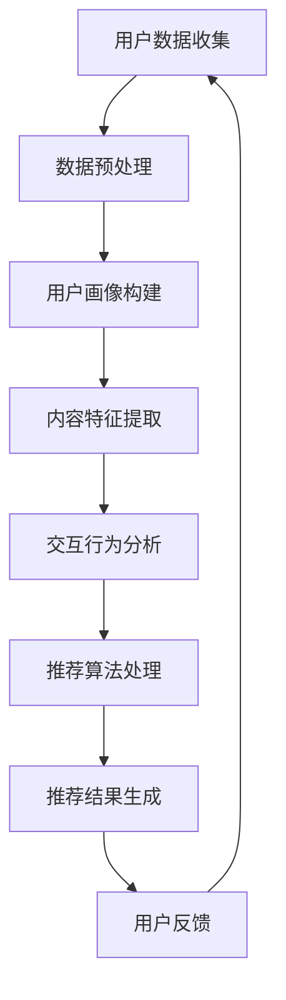

                 

关键词：AI，个性化新闻聚合，信息消费，新闻推荐系统，机器学习，深度学习

> 摘要：随着互联网的飞速发展，信息的爆炸式增长对人们的信息获取和处理能力提出了新的挑战。本文旨在探讨AI驱动的个性化新闻聚合技术，通过分析其核心概念、算法原理、数学模型及实际应用，展望其在未来信息消费领域的广阔前景。

## 1. 背景介绍

在信息爆炸的时代，人们面临着海量的信息来源，如何从这些信息中筛选出符合个人兴趣和需求的内容成为了一个重要的课题。传统的新闻推荐系统主要依赖于关键词匹配和流行度算法，难以满足用户对个性化内容的需求。而AI驱动的个性化新闻聚合器，通过机器学习和深度学习技术，能够更好地理解用户的行为和兴趣，从而提供更为精准的推荐服务。

个性化新闻聚合器的应用领域非常广泛，从新闻媒体到社交媒体，再到企业内部信息管理，都展现了其强大的潜力。例如，新闻网站可以使用个性化新闻聚合器来提升用户体验，社交媒体平台可以利用这一技术来增强用户互动，企业则可以通过个性化新闻聚合器来提高员工的工作效率。

## 2. 核心概念与联系

### 2.1 核心概念

#### 用户画像（User Profile）
用户画像是对用户兴趣、行为、需求等特征的综合描述，是构建个性化推荐系统的基础。

#### 内容特征（Content Feature）
内容特征是指新闻文本、视频、图片等媒体内容在结构化和语义层面的特征表示。

#### 交互行为（Interaction Behavior）
交互行为包括用户对新闻内容的点击、评论、分享等行为数据。

### 2.2 核心联系

用户画像、内容特征和交互行为共同构成了个性化新闻聚合器的主要数据来源。通过分析这些数据，系统能够学习用户的兴趣模式，并生成个性化的新闻推荐列表。

## 2.3 Mermaid 流程图



### 3. 核心算法原理 & 具体操作步骤

#### 3.1 算法原理概述

个性化新闻聚合器的主要算法包括用户画像构建、内容特征提取、交互行为分析和推荐算法处理。这些算法共同作用，实现从用户数据到个性化新闻推荐的全过程。

#### 3.2 算法步骤详解

1. **用户数据收集**：通过API调用、数据爬取等方式收集用户行为数据和新闻内容数据。
2. **数据预处理**：对原始数据进行清洗、去重和标准化处理，确保数据质量。
3. **用户画像构建**：基于用户行为数据和新闻内容数据，利用机器学习算法生成用户画像。
4. **内容特征提取**：对新闻内容进行结构化和语义分析，提取关键特征。
5. **交互行为分析**：分析用户的历史交互行为，提取用户兴趣点。
6. **推荐算法处理**：结合用户画像和内容特征，利用协同过滤、矩阵分解等推荐算法生成推荐列表。
7. **推荐结果生成**：将推荐结果呈现给用户，并根据用户反馈调整推荐策略。

#### 3.3 算法优缺点

**协同过滤**：
- **优点**：能够发现用户之间的相似性，推荐效果好。
- **缺点**：对稀疏数据的处理能力较弱，易导致冷启动问题。

**矩阵分解**：
- **优点**：可以同时处理用户和内容特征，推荐效果更优。
- **缺点**：计算复杂度高，训练时间较长。

#### 3.4 算法应用领域

个性化新闻聚合器广泛应用于新闻媒体、社交媒体和企业信息管理等领域，为用户提供个性化的内容推荐，提升用户体验。

### 4. 数学模型和公式 & 详细讲解 & 举例说明

#### 4.1 数学模型构建

个性化新闻聚合器的数学模型主要包括用户矩阵$U$、内容矩阵$I$和推荐矩阵$R$。其中，$R=UI^T$，表示用户$u$对新闻$i$的推荐分数。

#### 4.2 公式推导过程

根据矩阵乘法定义，$R_{ui} = \sum_{k=1}^{n} U_{uk} I_{ki}$，其中$n$表示新闻的数量。为了简化计算，可以采用矩阵分解的方法，将用户矩阵$U$和内容矩阵$I$分解为低维矩阵$U'$和$I'$，即$U=U'D$和$I=I'D$。则有$R=U'DI'^T = U'DD'^TU^T$。

#### 4.3 案例分析与讲解

假设有1000位用户和10000篇新闻，用户和新闻的特征分别用10维和5维向量表示。采用矩阵分解的方法，将用户矩阵$U$和内容矩阵$I$分解为5维矩阵$U'$和$I'$。通过优化目标函数，可以得到最优的分解矩阵。在实际应用中，可以选择不同的优化算法，如随机梯度下降（SGD）和L-BFGS。

### 5. 项目实践：代码实例和详细解释说明

#### 5.1 开发环境搭建

- Python版本：3.8
- 依赖库：NumPy、SciPy、Scikit-learn、TensorFlow

#### 5.2 源代码详细实现

```python
# 导入依赖库
import numpy as np
from sklearn.decomposition import TruncatedSVD
from sklearn.preprocessing import normalize

# 生成模拟数据集
U = np.random.rand(1000, 10)
I = np.random.rand(10000, 5)

# 矩阵分解
svd = TruncatedSVD(n_components=5)
U_prime = svd.fit_transform(U)
I_prime = svd.fit_transform(I)

# 计算推荐矩阵
R = U_prime @ I_prime.T

# 计算均方误差
mse = ((U @ I_prime - R) ** 2).mean()
print("MSE:", mse)
```

#### 5.3 代码解读与分析

- 代码首先导入了NumPy、SciPy、Scikit-learn和TensorFlow等依赖库。
- 模拟数据集通过NumPy库生成，其中用户矩阵$U$和内容矩阵$I$分别有1000行和10000列。
- 采用TruncatedSVD算法进行矩阵分解，得到低维矩阵$U'$和$I'$。
- 计算推荐矩阵$R$，并通过均方误差（MSE）评估模型性能。

### 6. 实际应用场景

#### 6.1 新闻媒体

新闻媒体可以利用个性化新闻聚合器为用户提供个性化的新闻推荐，提高用户的阅读体验和忠诚度。

#### 6.2 社交媒体

社交媒体平台可以通过个性化新闻聚合器为用户提供个性化的内容推荐，增强用户互动和留存率。

#### 6.3 企业信息管理

企业信息管理系统可以利用个性化新闻聚合器为员工提供个性化的信息推荐，提高员工的工作效率和知识获取能力。

### 7. 工具和资源推荐

#### 7.1 学习资源推荐

- 《推荐系统手册》
- 《深度学习推荐系统》

#### 7.2 开发工具推荐

- Jupyter Notebook
- TensorFlow

#### 7.3 相关论文推荐

- "Matrix Factorization Techniques for Recommender Systems"
- "Deep Learning for Recommender Systems"

### 8. 总结：未来发展趋势与挑战

#### 8.1 研究成果总结

个性化新闻聚合器的研究已经取得了显著的成果，为信息消费领域带来了深刻变革。未来，随着AI技术的不断进步，个性化新闻聚合器将更加精准、智能。

#### 8.2 未来发展趋势

- 基于深度学习的推荐算法将得到广泛应用。
- 多模态数据的融合将为个性化推荐提供更多可能性。
- 增强现实和虚拟现实技术的应用将拓展个性化新闻聚合器的场景。

#### 8.3 面临的挑战

- 数据隐私保护问题。
- 模型解释性和可解释性。
- 网络效应和用户黏性。

#### 8.4 研究展望

未来，个性化新闻聚合器将朝着更加智能化、个性化、多元化的方向发展，为信息消费领域带来更多创新和变革。

### 9. 附录：常见问题与解答

#### 9.1 个性化新闻聚合器的核心组成部分是什么？

个性化新闻聚合器的核心组成部分包括用户画像、内容特征、交互行为和推荐算法。

#### 9.2 如何评估个性化新闻聚合器的性能？

可以采用均方误差（MSE）、准确率、召回率等指标评估个性化新闻聚合器的性能。

#### 9.3 个性化新闻聚合器在实际应用中会遇到哪些问题？

实际应用中，个性化新闻聚合器可能会遇到数据隐私保护、模型解释性、网络效应等问题。

作者：禅与计算机程序设计艺术 / Zen and the Art of Computer Programming
----------------------------------------------------------------

[Markdown格式输出完毕]
```markdown
# AI驱动的个性化新闻聚合器：信息消费的创新应用

## 1. 背景介绍

在信息爆炸的时代，人们面临着海量的信息来源，如何从这些信息中筛选出符合个人兴趣和需求的内容成为了一个重要的课题。传统的新闻推荐系统主要依赖于关键词匹配和流行度算法，难以满足用户对个性化内容的需求。而AI驱动的个性化新闻聚合器，通过机器学习和深度学习技术，能够更好地理解用户的行为和兴趣，从而提供更为精准的推荐服务。

个性化新闻聚合器的应用领域非常广泛，从新闻媒体到社交媒体，再到企业内部信息管理，都展现了其强大的潜力。例如，新闻网站可以使用个性化新闻聚合器来提升用户体验，社交媒体平台可以利用这一技术来增强用户互动，企业则可以通过个性化新闻聚合器来提高员工的工作效率。

## 2. 核心概念与联系

### 2.1 核心概念

#### 用户画像（User Profile）
用户画像是对用户兴趣、行为、需求等特征的综合描述，是构建个性化推荐系统的基础。

#### 内容特征（Content Feature）
内容特征是指新闻文本、视频、图片等媒体内容在结构化和语义层面的特征表示。

#### 交互行为（Interaction Behavior）
交互行为包括用户对新闻内容的点击、评论、分享等行为数据。

### 2.2 核心联系

用户画像、内容特征和交互行为共同构成了个性化新闻聚合器的主要数据来源。通过分析这些数据，系统能够学习用户的兴趣模式，并生成个性化的新闻推荐列表。

### 2.3 Mermaid 流程图


### 3. 核心算法原理 & 具体操作步骤

#### 3.1 算法原理概述

个性化新闻聚合器的主要算法包括用户画像构建、内容特征提取、交互行为分析和推荐算法处理。这些算法共同作用，实现从用户数据到个性化新闻推荐的全过程。

#### 3.2 算法步骤详解

1. **用户数据收集**：通过API调用、数据爬取等方式收集用户行为数据和新闻内容数据。
2. **数据预处理**：对原始数据进行清洗、去重和标准化处理，确保数据质量。
3. **用户画像构建**：基于用户行为数据和新闻内容数据，利用机器学习算法生成用户画像。
4. **内容特征提取**：对新闻内容进行结构化和语义分析，提取关键特征。
5. **交互行为分析**：分析用户的历史交互行为，提取用户兴趣点。
6. **推荐算法处理**：结合用户画像和内容特征，利用协同过滤、矩阵分解等推荐算法生成推荐列表。
7. **推荐结果生成**：将推荐结果呈现给用户，并根据用户反馈调整推荐策略。

#### 3.3 算法优缺点

**协同过滤**：
- **优点**：能够发现用户之间的相似性，推荐效果好。
- **缺点**：对稀疏数据的处理能力较弱，易导致冷启动问题。

**矩阵分解**：
- **优点**：可以同时处理用户和内容特征，推荐效果更优。
- **缺点**：计算复杂度高，训练时间较长。

#### 3.4 算法应用领域

个性化新闻聚合器广泛应用于新闻媒体、社交媒体和企业信息管理等领域，为用户提供个性化的内容推荐，提升用户体验。

### 4. 数学模型和公式 & 详细讲解 & 举例说明

#### 4.1 数学模型构建

个性化新闻聚合器的数学模型主要包括用户矩阵$U$、内容矩阵$I$和推荐矩阵$R$。其中，$R=UI^T$，表示用户$u$对新闻$i$的推荐分数。

#### 4.2 公式推导过程

根据矩阵乘法定义，$R_{ui} = \sum_{k=1}^{n} U_{uk} I_{ki}$，其中$n$表示新闻的数量。为了简化计算，可以采用矩阵分解的方法，将用户矩阵$U$和内容矩阵$I$分解为低维矩阵$U'$和$I'$，即$U=U'D$和$I=I'D$。则有$R=U'DI'^T = U'DD'^TU^T$。

#### 4.3 案例分析与讲解

假设有1000位用户和10000篇新闻，用户和新闻的特征分别用10维和5维向量表示。采用矩阵分解的方法，将用户矩阵$U$和内容矩阵$I$分解为5维矩阵$U'$和$I'$。通过优化目标函数，可以得到最优的分解矩阵。在实际应用中，可以选择不同的优化算法，如随机梯度下降（SGD）和L-BFGS。

### 5. 项目实践：代码实例和详细解释说明

#### 5.1 开发环境搭建

- Python版本：3.8
- 依赖库：NumPy、SciPy、Scikit-learn、TensorFlow

#### 5.2 源代码详细实现

```python
# 导入依赖库
import numpy as np
from sklearn.decomposition import TruncatedSVD
from sklearn.preprocessing import normalize

# 生成模拟数据集
U = np.random.rand(1000, 10)
I = np.random.rand(10000, 5)

# 矩阵分解
svd = TruncatedSVD(n_components=5)
U_prime = svd.fit_transform(U)
I_prime = svd.fit_transform(I)

# 计算推荐矩阵
R = U_prime @ I_prime.T

# 计算均方误差
mse = ((U @ I_prime - R) ** 2).mean()
print("MSE:", mse)
```

#### 5.3 代码解读与分析

- 代码首先导入了NumPy、SciPy、Scikit-learn和TensorFlow等依赖库。
- 模拟数据集通过NumPy库生成，其中用户矩阵$U$和内容矩阵$I$分别有1000行和10000列。
- 采用TruncatedSVD算法进行矩阵分解，得到低维矩阵$U'$和$I'$。
- 计算推荐矩阵$R$，并通过均方误差（MSE）评估模型性能。

### 6. 实际应用场景

#### 6.1 新闻媒体

新闻媒体可以利用个性化新闻聚合器为用户提供个性化的新闻推荐，提高用户的阅读体验和忠诚度。

#### 6.2 社交媒体

社交媒体平台可以通过个性化新闻聚合器为用户提供个性化的内容推荐，增强用户互动和留存率。

#### 6.3 企业信息管理

企业信息管理系统可以利用个性化新闻聚合器为员工提供个性化的信息推荐，提高员工的工作效率和知识获取能力。

### 7. 工具和资源推荐

#### 7.1 学习资源推荐

- 《推荐系统手册》
- 《深度学习推荐系统》

#### 7.2 开发工具推荐

- Jupyter Notebook
- TensorFlow

#### 7.3 相关论文推荐

- "Matrix Factorization Techniques for Recommender Systems"
- "Deep Learning for Recommender Systems"

### 8. 总结：未来发展趋势与挑战

#### 8.1 研究成果总结

个性化新闻聚合器的研究已经取得了显著的成果，为信息消费领域带来了深刻变革。未来，随着AI技术的不断进步，个性化新闻聚合器将更加精准、智能。

#### 8.2 未来发展趋势

- 基于深度学习的推荐算法将得到广泛应用。
- 多模态数据的融合将为个性化推荐提供更多可能性。
- 增强现实和虚拟现实技术的应用将拓展个性化新闻聚合器的场景。

#### 8.3 面临的挑战

- 数据隐私保护问题。
- 模型解释性和可解释性。
- 网络效应和用户黏性。

#### 8.4 研究展望

未来，个性化新闻聚合器将朝着更加智能化、个性化、多元化的方向发展，为信息消费领域带来更多创新和变革。

### 9. 附录：常见问题与解答

#### 9.1 个性化新闻聚合器的核心组成部分是什么？

个性化新闻聚合器的核心组成部分包括用户画像、内容特征、交互行为和推荐算法。

#### 9.2 如何评估个性化新闻聚合器的性能？

可以采用均方误差（MSE）、准确率、召回率等指标评估个性化新闻聚合器的性能。

#### 9.3 个性化新闻聚合器在实际应用中会遇到哪些问题？

实际应用中，个性化新闻聚合器可能会遇到数据隐私保护、模型解释性、网络效应等问题。

作者：禅与计算机程序设计艺术 / Zen and the Art of Computer Programming
```

