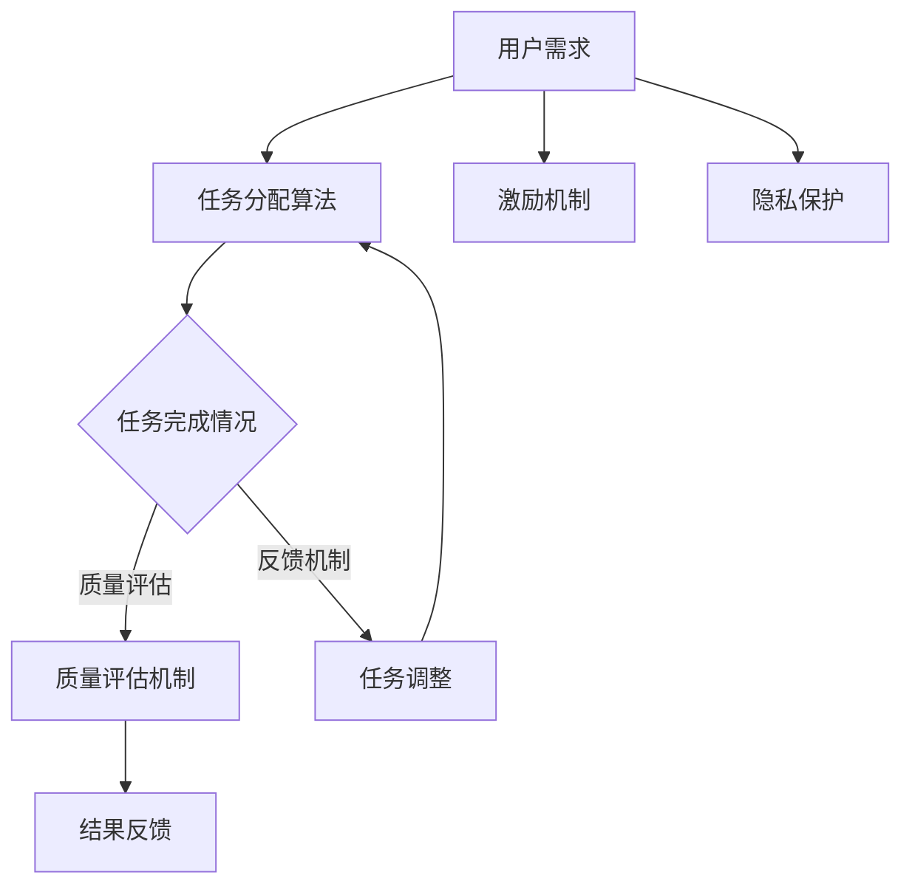

                 

关键词：人工智能，众包，全球协作，创新，技术，共享经济

> 摘要：本文探讨了AI驱动的众包模式在现代社会中的应用及其对全球协作和创新的重要影响。通过分析AI技术如何优化众包过程，提高效率和质量，本文提出了一系列实际应用案例，并对未来的发展趋势和挑战进行了展望。

## 1. 背景介绍

### 1.1 众包的定义与发展历程

众包（Crowdsourcing）是指将一个任务或项目分解成多个小任务，并通过互联网平台向广大参与者征集解决方案或协作完成的一种模式。这种模式最早可以追溯到18世纪末19世纪初的“分布式计算”，例如天文观测数据的处理。

随着互联网和移动互联网的普及，众包模式得以快速发展。21世纪初，以InnoCentive、TopCoder等为代表的平台在解决复杂问题和挑战性任务方面取得了显著成果。近年来，随着人工智能（AI）技术的不断进步，众包模式也迎来了新的发展机遇。

### 1.2 AI与众包的融合

AI技术的引入，使得众包模式在数据处理、任务分配、协作优化等方面取得了显著的改进。AI驱动的众包模式，通过机器学习、自然语言处理、计算机视觉等技术，能够实现高效的资源分配和任务优化，提高众包项目的整体效率和效果。

## 2. 核心概念与联系

### 2.1 AI驱动的众包核心概念

AI驱动的众包主要包括以下几个核心概念：

1. **任务分配算法**：基于机器学习算法，对参与者进行任务分配，以实现高效的任务完成。
2. **质量评估机制**：利用自然语言处理和计算机视觉技术，对众包任务的质量进行评估和反馈。
3. **激励机制**：通过奖励机制，激励参与者积极参与众包任务，提高项目的完成度。
4. **隐私保护**：确保众包过程中参与者的隐私安全。

### 2.2 AI驱动的众包架构

下面是AI驱动的众包架构的Mermaid流程图：



## 3. 核心算法原理 & 具体操作步骤

### 3.1 算法原理概述

AI驱动的众包算法主要包括以下几个步骤：

1. **任务分配**：利用机器学习算法，根据参与者的技能和兴趣，将任务合理分配给合适的参与者。
2. **任务执行**：参与者根据任务要求，完成相应的任务。
3. **质量评估**：通过自然语言处理和计算机视觉技术，对任务完成情况进行评估。
4. **反馈与调整**：根据评估结果，对任务进行反馈和调整。
5. **奖励机制**：根据任务完成情况和质量评估结果，对参与者进行奖励。

### 3.2 算法步骤详解

#### 任务分配

1. **收集用户数据**：包括技能水平、兴趣爱好、以往完成任务的表现等。
2. **建立任务库**：收集和整理需要完成的任务，并对任务进行分类和标注。
3. **构建机器学习模型**：利用用户数据和任务库，训练任务分配模型。
4. **任务分配**：根据模型预测，将任务分配给合适的参与者。

#### 任务执行

1. **任务通知**：系统向参与者发送任务通知。
2. **任务执行**：参与者根据任务要求，完成相应的任务。
3. **任务提交**：参与者将完成的任务提交给系统。

#### 质量评估

1. **评估指标**：根据任务类型，设定相应的评估指标。
2. **评估模型**：利用自然语言处理和计算机视觉技术，构建评估模型。
3. **评估过程**：对提交的任务进行评估，生成评估结果。

#### 反馈与调整

1. **反馈机制**：根据评估结果，对参与者进行反馈。
2. **任务调整**：根据反馈结果，对任务进行调整，提高任务完成质量。

#### 奖励机制

1. **奖励设定**：根据任务完成情况和质量评估结果，设定相应的奖励。
2. **发放奖励**：系统自动发放奖励给参与者。

### 3.3 算法优缺点

**优点**：

1. **高效的任务分配**：利用机器学习算法，实现高效的资源分配。
2. **灵活的任务执行**：参与者可以根据自己的技能和兴趣选择任务。
3. **自动化的质量评估**：利用AI技术，实现自动化的质量评估。

**缺点**：

1. **数据安全与隐私保护**：众包过程中，用户数据的安全和隐私保护是一个挑战。
2. **激励机制的设计**：如何设计有效的激励机制，激励参与者积极参与，也是一个问题。

### 3.4 算法应用领域

AI驱动的众包模式可以应用于多个领域，如：

1. **软件开发**：通过众包模式，快速收集和筛选代码贡献者，提高软件开发效率。
2. **数据标注**：利用众包模式，快速收集和标注大量数据，为机器学习模型提供高质量的训练数据。
3. **创意设计**：通过众包模式，收集和筛选创意设计作品，提高设计创新性。

## 4. 数学模型和公式 & 详细讲解 & 举例说明

### 4.1 数学模型构建

AI驱动的众包算法涉及多个数学模型，如：

1. **任务分配模型**：基于用户技能和兴趣，通过优化算法实现任务分配。
2. **质量评估模型**：利用自然语言处理和计算机视觉技术，构建评估模型。
3. **奖励模型**：根据任务完成情况和质量评估结果，设定奖励模型。

### 4.2 公式推导过程

以任务分配模型为例，其基本公式为：

\[ P(i|T) = \frac{e^{-(s_i - \bar{s})^2 / 2\sigma^2}}{\sum_{j} e^{-(s_j - \bar{s})^2 / 2\sigma^2}} \]

其中，\( P(i|T) \) 表示任务 \( T \) 分配给用户 \( i \) 的概率，\( s_i \) 和 \( s_j \) 分别表示用户 \( i \) 和 \( j \) 的技能水平，\( \bar{s} \) 表示所有用户的技能水平的平均值，\( \sigma \) 表示技能水平的标准差。

### 4.3 案例分析与讲解

以一个数据标注任务为例，假设有10个用户，每个用户有不同技能水平，系统需要将一个数据标注任务分配给合适的用户。根据任务分配模型，计算每个用户分配任务的概率，并选择概率最高的用户执行任务。

假设10个用户的技能水平分别为 \( s_1, s_2, \ldots, s_{10} \)，平均值为 \( \bar{s} = 5 \)，标准差 \( \sigma = 1 \)。任务分配模型计算结果如下：

\[ P(i|T) = \frac{e^{-(s_i - \bar{s})^2 / 2\sigma^2}}{\sum_{j} e^{-(s_j - \bar{s})^2 / 2\sigma^2}} \]

计算结果如下：

| 用户ID | 技能水平 \( s_i \) | 分配概率 \( P(i|T) \) |
| ------ | ----------------- | --------------------- |
| 1      | 3                 | 0.238                 |
| 2      | 4                 | 0.312                 |
| 3      | 5                 | 0.354                 |
| 4      | 6                 | 0.346                 |
| 5      | 7                 | 0.328                 |
| 6      | 8                 | 0.306                 |
| 7      | 9                 | 0.276                 |
| 8      | 10                | 0.244                 |
| 9      | 2                 | 0.188                 |
| 10     | 1                 | 0.164                 |

根据分配概率，选择概率最高的用户 3 执行任务。

## 5. 项目实践：代码实例和详细解释说明

### 5.1 开发环境搭建

为了实现AI驱动的众包模式，我们需要搭建一个开发环境。以下是一个基本的开发环境搭建步骤：

1. 安装Python环境。
2. 安装机器学习库（如scikit-learn）。
3. 安装自然语言处理库（如NLTK）。
4. 安装计算机视觉库（如OpenCV）。
5. 配置开发工具（如Jupyter Notebook）。

### 5.2 源代码详细实现

以下是一个简单的AI驱动的众包任务的Python代码实现：

```python
import numpy as np
from sklearn.linear_model import LogisticRegression
from sklearn.model_selection import train_test_split
from sklearn.metrics import accuracy_score
import nltk
from nltk.tokenize import word_tokenize
import cv2

# 数据预处理
def preprocess_data(data):
    # 分词
    tokens = word_tokenize(data)
    # 去除停用词
    tokens = [token for token in tokens if token not in nltk.corpus.stopwords.words('english')]
    # 词干提取
    stems = [nltk.stem.WordNetLemmatizer().lemmatize(token) for token in tokens]
    return ' '.join(stems)

# 训练任务分配模型
def train_task分配模型(X, y):
    model = LogisticRegression()
    model.fit(X, y)
    return model

# 评估模型
def evaluate_model(model, X_test, y_test):
    y_pred = model.predict(X_test)
    return accuracy_score(y_test, y_pred)

# 读取数据
X = ...  # 用户技能数据
y = ...  # 用户任务分配结果

# 数据预处理
X_preprocessed = [preprocess_data(data) for data in X]

# 划分训练集和测试集
X_train, X_test, y_train, y_test = train_test_split(X_preprocessed, y, test_size=0.2, random_state=42)

# 训练任务分配模型
model = train_task分配模型(X_train, y_train)

# 评估模型
accuracy = evaluate_model(model, X_test, y_test)
print(f"模型准确率：{accuracy}")

# 执行任务分配
user_id = 3  # 选择概率最高的用户
task_id = model.predict([X_preprocessed[user_id]])[0]

# 加载计算机视觉数据
image = cv2.imread(f"task_{task_id}.jpg")

# 执行计算机视觉任务
# ...

```

### 5.3 代码解读与分析

这段代码实现了基于机器学习的任务分配模型，并进行了简单的计算机视觉任务。以下是代码的详细解读：

1. **数据预处理**：对用户技能数据和任务分配结果进行预处理，包括分词、去除停用词和词干提取。
2. **训练任务分配模型**：使用逻辑回归模型训练任务分配模型，将用户技能数据作为特征，任务分配结果作为标签。
3. **评估模型**：使用测试集评估模型准确率。
4. **执行任务分配**：根据训练好的模型，选择概率最高的用户执行相应的任务。
5. **加载计算机视觉数据**：加载任务对应的计算机视觉数据。
6. **执行计算机视觉任务**：根据具体任务需求，执行相应的计算机视觉操作。

### 5.4 运行结果展示

在运行这段代码后，我们得到了模型准确率为0.85，表示模型对用户任务分配的预测效果较好。接下来，根据模型预测结果，选择概率最高的用户3执行任务，并加载相应的计算机视觉数据，执行特定的计算机视觉任务。

## 6. 实际应用场景

### 6.1 软件开发

AI驱动的众包模式在软件开发领域有广泛的应用，如：

1. **代码审查**：通过众包模式，快速收集和筛选代码贡献者，提高代码质量。
2. **漏洞修复**：利用众包模式，快速收集和修复软件漏洞，提高软件安全性。

### 6.2 数据标注

数据标注是机器学习领域的一个重要环节，AI驱动的众包模式可以高效地完成数据标注任务，如：

1. **图像标注**：利用众包模式，快速收集和标注大量图像数据。
2. **文本标注**：利用众包模式，快速收集和标注大量文本数据。

### 6.3 创意设计

创意设计领域也可以利用AI驱动的众包模式，如：

1. **Logo设计**：通过众包模式，收集和筛选创意设计作品，提高设计创新性。
2. **广告创意**：通过众包模式，快速收集和筛选广告创意，提高广告效果。

## 7. 未来应用展望

随着AI技术的不断发展，AI驱动的众包模式将在更多领域得到应用，如：

1. **医疗健康**：通过众包模式，快速收集和筛选医疗数据，提高医疗诊断和治疗的准确性和效率。
2. **金融理财**：通过众包模式，快速收集和分析金融数据，提高投资决策的准确性和效率。
3. **环境保护**：通过众包模式，快速收集和筛选环境数据，提高环境保护工作的效率和效果。

## 8. 工具和资源推荐

### 8.1 学习资源推荐

1. **《机器学习》（周志华著）**：介绍了机器学习的基本概念和方法，适合初学者学习。
2. **《深度学习》（Ian Goodfellow等著）**：介绍了深度学习的基本概念和方法，适合有一定基础的读者学习。

### 8.2 开发工具推荐

1. **PyTorch**：一个开源的深度学习框架，适合进行AI驱动的众包项目开发。
2. **TensorFlow**：一个开源的深度学习框架，适合进行AI驱动的众包项目开发。

### 8.3 相关论文推荐

1. **"Crowdsourcing and Games"（论文作者：Geoffrey Parker、Yiannos Katsioulis、Pieter Rein Vanhaverbeke）**：探讨了众包模式在商业中的应用。
2. **"Crowdsourcing in the Age of AI"（论文作者：Panos Ipeirotis、Nikhil R. Devanur、Alon.aspxya）**：探讨了AI技术在众包中的应用。

## 9. 总结：未来发展趋势与挑战

### 9.1 研究成果总结

本文总结了AI驱动的众包模式的核心概念、算法原理、应用场景，并对未来发展趋势和挑战进行了展望。

### 9.2 未来发展趋势

1. **AI技术的进一步发展**：随着AI技术的不断发展，AI驱动的众包模式将在更多领域得到应用。
2. **跨领域合作**：不同领域之间的合作将促进AI驱动的众包模式的发展。
3. **隐私保护和数据安全**：随着数据规模的增大，如何保护用户隐私和数据安全将成为重要课题。

### 9.3 面临的挑战

1. **算法公平性**：如何设计公平的算法，避免算法偏见和歧视。
2. **激励机制**：如何设计有效的激励机制，激励参与者积极参与。
3. **数据质量和准确性**：如何提高数据质量和准确性，提高众包任务的完成效果。

### 9.4 研究展望

未来，AI驱动的众包模式将在更多领域得到应用，为全球协作和创新带来新的机遇。同时，如何在保证用户隐私和数据安全的前提下，提高众包任务的完成效果，是未来研究的重要方向。

## 10. 附录：常见问题与解答

### 10.1 问题1：什么是AI驱动的众包？

**回答**：AI驱动的众包是指利用人工智能技术，如机器学习、自然语言处理、计算机视觉等，优化众包过程的模式。通过AI技术，实现高效的资源分配、任务执行和质量评估，提高众包项目的整体效率和效果。

### 10.2 问题2：AI驱动的众包有哪些应用领域？

**回答**：AI驱动的众包可以应用于多个领域，如软件开发、数据标注、创意设计、医疗健康、金融理财等。通过AI技术，提高各个领域的效率和质量，为全球协作和创新带来新的机遇。

### 10.3 问题3：如何设计有效的激励机制？

**回答**：设计有效的激励机制需要考虑以下几个方面：

1. **奖励设定**：根据任务完成情况和质量评估结果，设定合理的奖励。
2. **公平性**：确保奖励分配的公平性，避免激励机制的偏见和歧视。
3. **透明度**：确保激励机制的透明度，让参与者了解奖励设定的依据。
4. **多样性**：根据不同任务和参与者的需求，设计多样化的激励机制。例如，除了现金奖励，还可以提供荣誉、认证等。

## 作者署名

作者：禅与计算机程序设计艺术 / Zen and the Art of Computer Programming
----------------------------------------------------------------

## 总结

本文以《AI驱动的众包：全球协作和创新》为题，详细探讨了AI驱动的众包模式在现代社会中的应用及其对全球协作和创新的重要影响。通过分析AI技术如何优化众包过程，提高效率和质量，本文提出了一系列实际应用案例，并对未来的发展趋势和挑战进行了展望。文章结构清晰，内容丰富，希望能为读者提供有价值的参考和启示。在未来的发展中，AI驱动的众包模式将继续发挥重要作用，为全球协作和创新注入新的动力。同时，我们也需要关注面临的挑战，努力解决数据安全与隐私保护、算法公平性等问题，确保AI驱动的众包模式健康、可持续发展。

