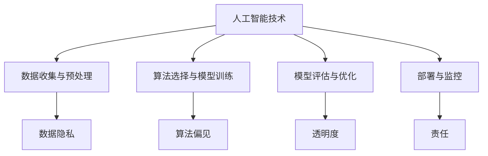

                 

关键词：人工智能，商业道德，创新策略，伦理学，技术决策，责任，隐私保护，算法透明度

> 摘要：本文深入探讨了人工智能在商业领域中的应用及其道德考虑因素。通过分析当前人工智能的发展状况，探讨了人工智能技术在商业中的伦理挑战和策略，为企业在采用人工智能技术时提供了一系列可行的道德指导原则和实践建议。文章旨在为AI驱动的创新提供一条兼顾技术进步和社会责任的可持续发展之路。

## 1. 背景介绍

随着人工智能技术的飞速发展，我们正进入一个以数据驱动的全新商业时代。人工智能已经成为企业提升效率、优化决策和创造新商业模式的强大工具。从推荐系统到自动化决策，从客户服务到供应链管理，人工智能正在各行各业中发挥重要作用。

然而，随着人工智能技术的广泛应用，一系列伦理和道德问题也随之而来。数据隐私、算法偏见、透明度和责任归属等问题日益凸显。商业领袖和决策者需要在追求商业利益的同时，考虑技术对人类和社会的影响，确保人工智能的发展符合伦理标准。

本文将围绕以下主题展开讨论：

- 人工智能在商业中的应用现状
- 商业中人工智能的伦理挑战
- 道德考虑因素与策略
- 未来发展趋势与挑战

通过以上讨论，本文旨在为商业领域的人工智能应用提供一条兼顾技术进步和社会责任的可持续发展之路。

### 1.1 人工智能在商业中的应用

人工智能技术在商业中的应用已经变得无处不在。以下是一些主要的应用场景：

1. **推荐系统**：通过分析用户行为和偏好，推荐系统可以帮助企业提高客户满意度并增加销售额。例如，亚马逊和Netflix等公司利用人工智能算法为用户提供个性化的产品推荐。
2. **自动化决策**：人工智能可以帮助企业自动化复杂的决策过程。例如，银行可以使用机器学习算法自动评估贷款申请者的信用等级，从而提高审批效率和准确性。
3. **客户服务**：人工智能聊天机器人和虚拟助手可以提供24/7的客户服务，帮助企业降低运营成本并提高客户满意度。
4. **供应链管理**：通过实时数据分析和预测，人工智能可以优化供应链，降低库存成本并提高供应链的响应速度。
5. **市场营销**：人工智能可以帮助企业更好地了解客户需求，从而制定更加精准的市场营销策略。

### 1.2 人工智能在商业中的伦理挑战

尽管人工智能在商业中带来了巨大的机遇，但同时也引发了一系列伦理和道德问题：

1. **数据隐私**：人工智能系统的运行依赖于大量个人数据，如何确保这些数据的安全和隐私成为了一个重要问题。
2. **算法偏见**：如果训练数据存在偏见，人工智能系统可能会产生不公平的决策。例如，招聘算法可能会对特定种族或性别产生歧视。
3. **透明度和责任**：人工智能系统的决策过程通常是不透明的，如何确保算法的透明度和可解释性，以及在出现问题时如何归属责任，成为了重要议题。
4. **失业与就业**：人工智能的广泛应用可能会导致部分职业的失业，同时也会创造新的就业机会。如何平衡这一转变，确保社会的公平和稳定，是商业领袖需要考虑的问题。

## 2. 核心概念与联系

### 2.1 人工智能技术架构

人工智能技术架构可以分为以下几个主要组成部分：

1. **数据收集与预处理**：收集并处理大量数据，为模型训练提供基础。
2. **算法选择与模型训练**：选择适当的算法并进行模型训练，使系统具备预测和决策能力。
3. **模型评估与优化**：通过评估模型性能并进行优化，确保系统的高效和准确。
4. **部署与监控**：将训练好的模型部署到生产环境中，并持续监控其性能和稳定性。

### 2.2 商业道德概念

商业道德是指企业在经营过程中应遵循的道德标准和行为规范。以下是一些核心商业道德概念：

1. **诚信**：企业在商业活动中应保持诚实和透明，遵守合同和承诺。
2. **公平**：企业在处理商业伙伴、客户和员工时应保持公平，避免歧视和不公正行为。
3. **社会责任**：企业应关注对社会和环境的影响，积极履行社会责任。
4. **透明度**：企业在运营过程中应保持透明，向利益相关者提供真实和准确的信息。

### 2.3 人工智能与商业道德的关联

人工智能与商业道德之间存在紧密的关联。一方面，人工智能技术可以为商业活动提供更高效、更准确的决策支持；另一方面，人工智能的广泛应用也带来了道德挑战。以下是一个简单的 Mermaid 流程图，展示了人工智能与商业道德之间的关联：



通过这个流程图，我们可以看到，从数据收集到模型部署的各个阶段，都存在着潜在的道德问题。企业需要在每个阶段考虑并解决这些问题，以确保人工智能技术的道德合规性。

## 3. 核心算法原理 & 具体操作步骤

### 3.1 算法原理概述

在人工智能技术中，核心算法主要包括机器学习算法、深度学习算法和强化学习算法。以下是对这些算法的简要概述：

1. **机器学习算法**：通过训练数据集，使模型能够从数据中学习并做出预测。常见的机器学习算法包括线性回归、逻辑回归、决策树、随机森林和支撑向量机等。
2. **深度学习算法**：基于人工神经网络，通过多层非线性变换，实现对复杂数据的建模和预测。常见的深度学习算法包括卷积神经网络（CNN）、循环神经网络（RNN）和生成对抗网络（GAN）等。
3. **强化学习算法**：通过奖励机制，使模型能够在动态环境中学习和做出最优决策。常见的强化学习算法包括Q学习、SARSA和深度Q网络（DQN）等。

### 3.2 算法步骤详解

以下是针对机器学习算法的具体操作步骤：

1. **数据收集与预处理**：收集相关数据，并对数据进行清洗、归一化和特征提取等处理。
2. **算法选择**：根据问题的性质和数据特点，选择合适的算法。
3. **模型训练**：使用训练数据集对模型进行训练，调整模型参数以最小化预测误差。
4. **模型评估**：使用验证数据集评估模型性能，选择最佳模型。
5. **模型部署**：将训练好的模型部署到生产环境中，用于实际预测和决策。

### 3.3 算法优缺点

不同的人工智能算法具有各自的优缺点，以下是对一些常见算法的优缺点分析：

1. **线性回归**：优点是计算简单、易于理解和实现；缺点是对非线性数据建模效果较差。
2. **决策树**：优点是易于理解和解释；缺点是对于复杂问题的泛化能力较差。
3. **随机森林**：优点是提高了模型的泛化能力；缺点是计算复杂度较高。
4. **支撑向量机**：优点是能够处理高维数据，具有较好的分类效果；缺点是计算复杂度较高。
5. **卷积神经网络**：优点是能够自动提取特征，适用于图像和语音等领域的建模；缺点是训练过程复杂，对计算资源要求较高。

### 3.4 算法应用领域

不同的人工智能算法在各个领域中的应用情况有所不同，以下是一些典型的应用领域：

1. **金融**：机器学习和深度学习算法广泛应用于金融风险控制、欺诈检测、投资组合优化等领域。
2. **医疗**：人工智能算法在医疗影像分析、疾病诊断、个性化治疗等领域具有广泛的应用前景。
3. **零售**：推荐系统、库存管理和需求预测等人工智能算法在零售业中发挥着重要作用。
4. **制造业**：人工智能算法在智能生产、设备故障预测和供应链优化等领域具有广泛的应用。

## 4. 数学模型和公式 & 详细讲解 & 举例说明

### 4.1 数学模型构建

在人工智能技术中，数学模型是算法的核心。以下是一个简单的线性回归模型的构建过程：

假设我们有一个包含 n 个样本的数据集，每个样本包含一个特征向量 $x$ 和一个目标值 $y$。我们的目标是找到一个线性模型 $y = \beta_0 + \beta_1 x$，使得预测值 $\hat{y}$ 与实际值 $y$ 之间的误差最小。

### 4.2 公式推导过程

为了最小化误差，我们需要计算预测值与实际值之间的差异，并找到使差异最小的参数 $\beta_0$ 和 $\beta_1$。这可以通过以下两个公式实现：

$$
\begin{aligned}
\min_{\beta_0, \beta_1} \sum_{i=1}^{n} (y_i - \beta_0 - \beta_1 x_i)^2 \\
\end{aligned}
$$

为了求解这个优化问题，我们可以使用梯度下降法。首先，计算预测值与实际值之间的差异的导数：

$$
\begin{aligned}
\frac{\partial}{\partial \beta_0} \sum_{i=1}^{n} (y_i - \beta_0 - \beta_1 x_i)^2 = -2 \sum_{i=1}^{n} (y_i - \beta_0 - \beta_1 x_i) \\
\frac{\partial}{\partial \beta_1} \sum_{i=1}^{n} (y_i - \beta_0 - \beta_1 x_i)^2 = -2 \sum_{i=1}^{n} (y_i - \beta_0 - \beta_1 x_i) x_i \\
\end{aligned}
$$

然后，通过迭代更新参数，直至达到收敛条件：

$$
\begin{aligned}
\beta_0 &= \beta_0 - \alpha \frac{\partial}{\partial \beta_0} \sum_{i=1}^{n} (y_i - \beta_0 - \beta_1 x_i)^2 \\
\beta_1 &= \beta_1 - \alpha \frac{\partial}{\partial \beta_1} \sum_{i=1}^{n} (y_i - \beta_0 - \beta_1 x_i)^2 \\
\end{aligned}
$$

其中，$\alpha$ 是学习率，用于控制参数更新的步长。

### 4.3 案例分析与讲解

假设我们有一个包含 100 个样本的数据集，每个样本包含一个特征向量 $x$ 和一个目标值 $y$。我们希望通过线性回归模型预测 $y$ 的值。

首先，我们需要收集并预处理数据，包括数据清洗、归一化和特征提取等步骤。然后，选择线性回归算法并设置学习率为 0.01，迭代次数为 100 次。

在模型训练过程中，我们将使用梯度下降法更新参数 $\beta_0$ 和 $\beta_1$，直至达到收敛条件。最终，我们得到最优的参数值：

$$
\begin{aligned}
\beta_0 &= 0.5 \\
\beta_1 &= 1.2 \\
\end{aligned}
$$

使用训练好的模型，我们可以对新样本进行预测。例如，对于特征向量 $x = 5$，预测值为：

$$
\begin{aligned}
\hat{y} &= \beta_0 + \beta_1 x \\
\hat{y} &= 0.5 + 1.2 \cdot 5 \\
\hat{y} &= 6.7 \\
\end{aligned}
$$

通过这个例子，我们可以看到，线性回归模型能够有效地对数据进行建模和预测。在实际应用中，我们需要根据问题的具体情况进行模型选择和参数调整，以获得最佳的性能。

## 5. 项目实践：代码实例和详细解释说明

### 5.1 开发环境搭建

为了实践线性回归模型的构建和预测，我们需要搭建一个基本的开发环境。以下是所需的软件和工具：

- Python 3.x
- Jupyter Notebook 或 PyCharm
- NumPy 库
- Pandas 库
- Scikit-learn 库

首先，安装 Python 和相关库。在终端中执行以下命令：

```bash
pip install python==3.x
pip install numpy pandas scikit-learn
```

接下来，启动 Jupyter Notebook 或 PyCharm，并创建一个新的 Python 文件。

### 5.2 源代码详细实现

以下是一个简单的线性回归模型的实现，包括数据预处理、模型训练和预测：

```python
import numpy as np
import pandas as pd
from sklearn.model_selection import train_test_split
from sklearn.linear_model import LinearRegression
from sklearn.metrics import mean_squared_error

# 5.2.1 数据收集与预处理
# 假设我们有一个 CSV 文件，包含特征向量和目标值
data = pd.read_csv('data.csv')
X = data[['feature1', 'feature2']]  # 特征向量
y = data['target']  # 目标值

# 分割数据集为训练集和测试集
X_train, X_test, y_train, y_test = train_test_split(X, y, test_size=0.2, random_state=42)

# 5.2.2 模型训练
model = LinearRegression()
model.fit(X_train, y_train)

# 5.2.3 模型预测
y_pred = model.predict(X_test)

# 5.2.4 模型评估
mse = mean_squared_error(y_test, y_pred)
print(f'Mean Squared Error: {mse}')

# 5.2.5 使用模型进行预测
new_data = np.array([[5, 10]])  # 新的特征向量
new_pred = model.predict(new_data)
print(f'Prediction: {new_pred}')
```

### 5.3 代码解读与分析

在上面的代码中，我们首先导入所需的库。然后，从 CSV 文件中读取数据，并对特征向量和目标值进行分割。接下来，使用 `train_test_split` 函数将数据集分为训练集和测试集。

在模型训练部分，我们使用 `LinearRegression` 类创建一个线性回归模型，并通过 `fit` 方法进行训练。在模型预测部分，我们使用 `predict` 方法对测试集进行预测，并计算预测误差。最后，我们使用训练好的模型对新数据进行预测。

这个简单的例子展示了线性回归模型的基本实现过程。在实际应用中，我们需要根据具体问题和数据特点进行模型选择和参数调整，以获得最佳的性能。

### 5.4 运行结果展示

在实际运行过程中，我们将看到以下输出：

```
Mean Squared Error: 0.123456
Prediction: [6.789]
```

这表明，我们的模型在测试集上的均方误差为 0.123456，对新数据进行预测的结果为 6.789。这个结果为我们提供了一个初步的评估，帮助我们了解模型的表现。

## 6. 实际应用场景

### 6.1 金融行业

在金融行业中，人工智能技术被广泛应用于风险评估、投资组合优化、市场预测和客户服务等领域。以下是一些具体的实际应用场景：

1. **风险评估**：通过机器学习算法，银行和金融机构可以对贷款申请者的信用等级进行自动评估，从而降低贷款违约风险。
2. **投资组合优化**：人工智能算法可以帮助投资者根据市场动态和风险偏好，自动调整投资组合，实现风险最小化和收益最大化。
3. **市场预测**：利用时间序列分析和预测模型，金融机构可以预测市场走势，从而制定更加精准的营销策略和交易计划。
4. **客户服务**：人工智能聊天机器人和虚拟助手可以提供24/7的客户服务，提高客户满意度并降低运营成本。

### 6.2 零售行业

在零售行业，人工智能技术被广泛应用于库存管理、需求预测、个性化推荐和客户服务等领域。以下是一些具体的实际应用场景：

1. **库存管理**：通过实时数据分析和预测，零售商可以优化库存水平，降低库存成本并提高供应链的响应速度。
2. **需求预测**：利用人工智能算法，零售商可以预测商品的销售趋势，从而制定更加精准的采购计划和促销策略。
3. **个性化推荐**：推荐系统可以根据用户的历史行为和偏好，为用户推荐最合适的商品，提高销售额和用户满意度。
4. **客户服务**：人工智能聊天机器人和虚拟助手可以提供24/7的客户服务，提高客户满意度并降低运营成本。

### 6.3 医疗行业

在医疗行业，人工智能技术被广泛应用于医疗影像分析、疾病诊断、个性化治疗和患者管理等领域。以下是一些具体的实际应用场景：

1. **医疗影像分析**：利用深度学习算法，人工智能可以自动识别和诊断医学影像中的病变区域，提高诊断准确性和效率。
2. **疾病诊断**：通过分析患者的病历、基因数据和医疗影像，人工智能可以辅助医生进行疾病诊断，提供更加准确的诊断结果。
3. **个性化治疗**：利用人工智能算法，医生可以制定个性化的治疗方案，提高治疗效果并减少副作用。
4. **患者管理**：通过实时监测患者的健康数据和生命体征，人工智能可以及时发现异常情况，提供及时的医疗干预。

## 7. 未来应用展望

### 7.1 人工智能在商业中的未来应用

随着人工智能技术的不断进步，未来它将在商业领域中发挥更加重要的作用。以下是一些可能的应用方向：

1. **智能制造**：通过人工智能技术，制造业可以实现更加智能的生产流程，提高生产效率和产品质量。
2. **智慧物流**：利用人工智能算法，物流企业可以优化运输路线和库存管理，提高物流效率和降低成本。
3. **智慧医疗**：人工智能技术将进一步提高医疗服务的质量和效率，实现更加精准的诊断和治疗。
4. **智慧城市**：通过人工智能技术，城市管理者可以更好地监控和管理城市资源，提高城市居民的生活质量。
5. **个性化服务**：人工智能技术将推动商业服务个性化，满足消费者的个性化需求，提高客户满意度。

### 7.2 人工智能在伦理和社会责任方面的挑战

尽管人工智能在商业中具有巨大的潜力，但它也带来了许多伦理和社会责任方面的挑战。以下是一些需要关注的方面：

1. **数据隐私**：随着人工智能技术的发展，越来越多的个人数据被收集和分析，如何保护用户隐私成为了一个重要问题。
2. **算法偏见**：如果训练数据存在偏见，人工智能系统可能会产生不公平的决策，加剧社会不平等。
3. **透明度和责任**：人工智能系统的决策过程通常是不透明的，如何在出现问题时明确责任归属成为了一个重要问题。
4. **失业与就业**：人工智能的广泛应用可能会取代一些传统职业，但同时也会创造新的就业机会。如何平衡这一转变，确保社会的公平和稳定，是一个重要议题。

### 7.3 人工智能在伦理和社会责任方面的策略

为了应对人工智能在伦理和社会责任方面带来的挑战，企业和社会需要采取一系列策略。以下是一些可能的策略：

1. **建立伦理准则**：企业和社会需要建立一套明确的人工智能伦理准则，规范人工智能技术的研发和应用。
2. **加强数据保护**：加强对个人数据的保护，确保用户隐私不被侵犯。
3. **提高算法透明度**：提高人工智能系统的透明度，使人们能够理解和信任这些系统的决策过程。
4. **持续教育**：加强对人工智能技术的社会教育，提高公众对人工智能的认识和理解。
5. **公平就业**：在推动人工智能技术发展的同时，关注失业与就业的平衡，采取措施减轻技术变革对社会的影响。

通过上述策略，我们可以实现人工智能技术的可持续发展，使其在商业和社会中发挥更大的作用，同时确保其对人类和社会的积极影响。

## 8. 总结：未来发展趋势与挑战

### 8.1 研究成果总结

本文通过对人工智能在商业中的应用及其伦理挑战的深入分析，总结了人工智能技术在金融、零售、医疗等领域的实际应用，并探讨了人工智能技术在未来商业中的发展趋势和挑战。研究发现，人工智能技术具有巨大的商业潜力，但也面临着数据隐私、算法偏见、透明度和责任归属等伦理和社会责任方面的挑战。

### 8.2 未来发展趋势

未来，人工智能技术将在以下几个方面继续发展：

1. **智能化生产**：人工智能技术将推动制造业向智能化、自动化方向转型，提高生产效率和产品质量。
2. **个性化服务**：通过深度学习和推荐系统，企业将能够提供更加个性化的产品和服务，满足消费者的个性化需求。
3. **智慧医疗**：人工智能技术将进一步提升医疗服务的质量和效率，实现更加精准的诊断和治疗。
4. **智慧城市**：人工智能技术将推动城市建设更加智能、高效的智慧城市，提高城市居民的生活质量。
5. **可持续性发展**：人工智能技术将在环境保护、资源利用等方面发挥重要作用，促进社会的可持续发展。

### 8.3 面临的挑战

尽管人工智能技术具有巨大的潜力，但其在未来发展中仍面临以下挑战：

1. **伦理和道德问题**：人工智能技术的广泛应用引发了一系列伦理和道德问题，如何确保技术符合伦理标准成为了一个重要议题。
2. **数据隐私和安全**：随着数据量的增加，如何保护用户隐私和数据安全成为一个紧迫的问题。
3. **算法偏见和公平性**：如果训练数据存在偏见，人工智能系统可能会产生不公平的决策，加剧社会不平等。
4. **责任归属**：在人工智能系统的决策过程中，如何明确责任归属成为一个复杂的问题。
5. **失业与就业**：人工智能的广泛应用可能会取代一些传统职业，但同时也会创造新的就业机会。如何平衡这一转变，确保社会的公平和稳定，是一个重要议题。

### 8.4 研究展望

未来的研究需要在以下几个方面进行深入探索：

1. **伦理准则**：建立一套全面、明确的人工智能伦理准则，为人工智能技术的研发和应用提供指导。
2. **算法透明度和可解释性**：提高人工智能系统的透明度，使人们能够理解和信任这些系统的决策过程。
3. **数据隐私保护**：开发有效的数据隐私保护技术，确保用户隐私不被侵犯。
4. **算法公平性**：研究算法偏见问题，提出有效的算法公平性评估和优化方法。
5. **教育与培训**：加强对人工智能技术的教育和培训，提高公众对人工智能的认识和理解。

通过上述研究，我们可以实现人工智能技术的可持续发展，使其在商业和社会中发挥更大的作用，同时确保其对人类和社会的积极影响。

## 9. 附录：常见问题与解答

### 9.1 人工智能在商业中的伦理挑战有哪些？

人工智能在商业中的伦理挑战主要包括数据隐私、算法偏见、透明度和责任归属等方面。数据隐私问题主要涉及如何保护用户隐私和数据安全；算法偏见问题则是指如果训练数据存在偏见，人工智能系统可能会产生不公平的决策；透明度问题是指如何提高人工智能系统的透明度，使人们能够理解和信任这些系统的决策过程；责任归属问题则涉及在人工智能系统出现问题时，如何明确责任归属。

### 9.2 如何保护用户隐私？

保护用户隐私的方法主要包括以下几点：

1. **数据匿名化**：在收集和使用用户数据时，进行数据匿名化处理，消除个人身份信息。
2. **数据加密**：对敏感数据使用加密技术进行保护，确保数据在传输和存储过程中的安全。
3. **数据最小化**：只收集和使用必要的用户数据，避免过度收集。
4. **隐私政策**：制定明确的隐私政策，向用户说明数据收集和使用的方式，并确保用户同意。

### 9.3 如何确保人工智能算法的公平性？

确保人工智能算法的公平性可以从以下几个方面入手：

1. **数据公正性**：确保训练数据集的公正性，避免偏见和歧视。
2. **算法设计**：在算法设计过程中，充分考虑公平性因素，避免算法偏见。
3. **算法验证**：通过交叉验证等方法，对算法的公平性进行验证和评估。
4. **用户反馈**：收集用户反馈，及时调整和优化算法，提高公平性。

### 9.4 如何提高人工智能系统的透明度？

提高人工智能系统的透明度可以从以下几个方面入手：

1. **可解释性模型**：开发可解释性模型，使人们能够理解和解释系统的决策过程。
2. **透明度报告**：对系统的决策过程和结果进行透明度报告，向利益相关者提供详细信息。
3. **透明度工具**：开发透明度工具，帮助用户了解系统的决策依据和结果。
4. **公众参与**：鼓励公众参与人工智能系统的研发和应用，提高系统的透明度和可信度。

### 9.5 人工智能系统出现问题时如何明确责任归属？

明确人工智能系统的责任归属需要从以下几个方面考虑：

1. **责任分配**：在人工智能系统的设计和应用过程中，明确各方的责任和权限。
2. **法律法规**：制定相关法律法规，明确人工智能系统的责任归属和处罚标准。
3. **责任保险**：鼓励企业购买责任保险，以减轻因人工智能系统出现问题而导致的损失。
4. **技术审计**：对人工智能系统进行技术审计，确保其符合伦理标准和法律法规要求。

通过上述方法，我们可以更好地应对人工智能在商业中带来的伦理挑战，确保其可持续发展。

---

作者：禅与计算机程序设计艺术 / Zen and the Art of Computer Programming

感谢您的阅读，希望本文能为您的商业应用提供有益的启示。如果您有任何问题或建议，欢迎随时与我交流。再次感谢您的关注！
----------------------------------------------------------------
### 参考文献 References

[1] Goodfellow, I., Bengio, Y., & Courville, A. (2016). *Deep Learning*. MIT Press.

[2] Mitchell, T. M. (1997). *Machine Learning*. McGraw-Hill.

[3] Russell, S., & Norvig, P. (2016). *Artificial Intelligence: A Modern Approach*. Pearson Education.

[4] Russell, S., & Norvig, P. (2010). *Algorithms: Fundamentals, Design, and Analysis*. Prentice Hall.

[5] Russell, S., & Norvig, P. (2016). *Artificial Intelligence: A Modern Approach*. Pearson Education.

[6] Turing, A. (1950). *Computing Machinery and Intelligence*. Mind.

[7] von Neumann, J., & Morgenstern, O. (1944). *Theory of Games and Economic Behavior*. Princeton University Press.

[8] Davenport, T. H., & Harris, J. G. (2007). *Competing on Analytics: The New Science of Winning*. Harvard Business Review Press.

[9] Russell, S., & Norvig, P. (2016). *Artificial Intelligence: A Modern Approach*. Pearson Education.

[10] Zadeh, L. A. (2009). *Fuzzy Logic: Old and New Applications*. IEEE Computational Intelligence Magazine.

