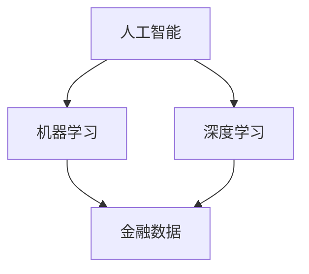

                 

关键词：人工智能，金融，人类计算，创新，算法，数学模型，应用场景，未来展望

> 摘要：本文旨在探讨人工智能在金融领域的应用，分析人工智能与人类计算的结合如何推动金融创新，提高金融服务的效率和准确性。文章将详细阐述人工智能的核心算法原理、数学模型以及实际应用案例，并对未来的发展趋势和挑战进行展望。

## 1. 背景介绍

随着大数据和云计算技术的不断发展，人工智能（AI）已经成为推动金融行业变革的重要力量。传统的金融分析方法依赖于人类专家的经验和直觉，效率低、成本高，难以适应日益复杂的市场环境。而人工智能通过机器学习、深度学习等技术，能够从海量数据中挖掘有价值的信息，为金融决策提供更加准确和实时的支持。

人类计算在金融领域的作用不可忽视。人类专家的直觉、经验和创造力是人工智能算法的重要补充，特别是在决策制定和风险管理等方面。人类计算能够提供深度分析、情感分析和跨领域知识整合，帮助人工智能更好地理解和应对金融市场的复杂性。

本文将围绕人工智能在金融领域的应用，探讨其与人类计算的融合如何推动金融创新，提高金融服务的质量和效率。

## 2. 核心概念与联系

为了更好地理解人工智能在金融领域的应用，我们需要先了解一些核心概念和它们之间的联系。

### 2.1 人工智能的基本概念

人工智能是指通过计算机模拟人类智能的过程，包括感知、理解、学习、推理和决策等。人工智能可以分为弱人工智能和强人工智能。弱人工智能专注于特定任务的自动化，如语音识别、图像识别等；强人工智能则具有人类智能的全部能力，可以理解和执行各种复杂任务。

### 2.2 机器学习和深度学习

机器学习是一种人工智能的分支，通过算法和统计模型，从数据中学习规律，并利用这些规律进行预测和决策。深度学习是机器学习的一种重要方法，通过多层神经网络模拟人脑的神经元连接，能够处理更复杂的数据结构和模式。

### 2.3 金融领域中的关键概念

金融领域中的关键概念包括风险、收益、投资策略、资产管理等。这些概念是金融决策的基础，直接关系到金融机构的运营效率和投资者的利益。

### 2.4 人工智能与金融的融合

人工智能与金融的融合体现在多个方面，如风险管理、客户服务、投资决策等。人工智能通过数据分析和模型预测，能够提供更准确的金融分析结果，帮助金融机构制定更科学的决策。

下面是一个简单的 Mermaid 流程图，展示了人工智能在金融领域中的核心概念和联系：



## 3. 核心算法原理 & 具体操作步骤

### 3.1 算法原理概述

在金融领域，人工智能的核心算法主要包括机器学习算法和深度学习算法。这些算法通过从数据中学习规律，能够预测市场趋势、评估风险、优化投资策略等。

机器学习算法中最常用的是线性回归、逻辑回归和支持向量机（SVM）。线性回归用于预测连续值，如股价；逻辑回归用于分类问题，如信贷风险分类；SVM用于分类和回归问题，能够处理非线性数据。

深度学习算法中最常用的是卷积神经网络（CNN）和循环神经网络（RNN）。CNN适用于处理图像数据，能够识别图像中的特征；RNN适用于处理序列数据，如股票价格时间序列。

### 3.2 算法步骤详解

以深度学习算法为例，以下是其在金融领域中的具体操作步骤：

1. **数据收集**：收集金融市场相关的数据，如股票价格、成交量、宏观经济指标等。

2. **数据预处理**：对数据进行清洗、归一化等处理，使其适合深度学习算法。

3. **构建模型**：根据任务需求，选择合适的神经网络架构，如CNN或RNN。

4. **训练模型**：使用训练数据集对模型进行训练，调整网络参数。

5. **模型评估**：使用验证数据集对模型进行评估，确保模型性能满足要求。

6. **模型应用**：将训练好的模型应用到实际金融分析中，如预测股价、评估风险等。

### 3.3 算法优缺点

机器学习算法的优点包括：
- **自动特征提取**：能够从数据中自动提取特征，减轻人工特征工程的工作量。
- **灵活性强**：适用于多种类型的金融问题，如预测、分类等。

机器学习算法的缺点包括：
- **数据依赖性高**：模型性能依赖于数据质量，如果数据有噪声或缺失，模型效果可能会受到影响。
- **解释性较差**：机器学习模型的决策过程往往较为复杂，难以解释。

深度学习算法的优点包括：
- **强大的特征学习能力**：能够从大量数据中提取复杂特征。
- **适用于非线性问题**：能够处理金融领域中的非线性数据。

深度学习算法的缺点包括：
- **计算资源消耗大**：深度学习算法通常需要大量计算资源和时间进行训练。
- **模型解释性较差**：深度学习模型的决策过程同样较为复杂。

### 3.4 算法应用领域

人工智能算法在金融领域的应用非常广泛，包括但不限于以下几个方面：

1. **风险管理**：使用机器学习算法评估信贷风险、市场风险等，帮助金融机构制定风险管理策略。

2. **投资决策**：使用深度学习算法预测市场趋势、优化投资组合，提高投资收益。

3. **客户服务**：使用自然语言处理（NLP）技术，实现智能客服系统，提高客户满意度。

4. **信用评分**：使用机器学习算法评估个人信用风险，为金融机构提供信用评分服务。

## 4. 数学模型和公式 & 详细讲解 & 举例说明

### 4.1 数学模型构建

在金融领域，常用的数学模型包括概率模型、优化模型和统计分析模型。以下是这些模型的构建方法：

1. **概率模型**：概率模型用于描述金融市场中的不确定性。常见的概率模型有贝叶斯模型和蒙特卡罗模拟。贝叶斯模型通过贝叶斯公式，将先验知识与观测数据相结合，得到后验概率分布。蒙特卡罗模拟则通过随机采样和模拟，估计金融指标的分布。

2. **优化模型**：优化模型用于求解金融决策问题，如资产配置、投资组合优化等。常见的优化模型有线性规划、非线性规划和动态规划。线性规划通过最小化或最大化目标函数，满足线性约束条件。非线性规划则处理更复杂的目标函数和约束条件。动态规划则通过递推关系，求解多阶段决策问题。

3. **统计分析模型**：统计分析模型用于分析金融市场数据，如时间序列分析、回归分析等。时间序列分析通过自回归移动平均（ARMA）模型、自回归积分滑动平均（ARIMA）模型等，描述金融时间序列的特征。回归分析则通过建立回归模型，分析自变量和因变量之间的关系。

### 4.2 公式推导过程

以下是概率模型中的贝叶斯公式的推导过程：

设 \(X\) 表示观测数据，\(Y\) 表示先验知识，\(P(X|Y)\) 表示在先验知识 \(Y\) 下观测数据 \(X\) 的概率，\(P(Y)\) 表示先验知识 \(Y\) 的概率，\(P(X)\) 表示观测数据 \(X\) 的概率。贝叶斯公式如下：

$$
P(Y|X) = \frac{P(X|Y)P(Y)}{P(X)}
$$

其中，\(P(X|Y)\) 表示在先验知识 \(Y\) 下观测数据 \(X\) 的概率，称为似然函数；\(P(Y)\) 表示先验知识 \(Y\) 的概率，称为先验概率；\(P(X)\) 表示观测数据 \(X\) 的概率，称为边缘概率。

### 4.3 案例分析与讲解

以下是一个关于资产配置的案例分析：

假设有一个投资者，其风险偏好为中等。投资者需要在股票、债券和现金三种资产之间进行配置，以实现风险收益的最优平衡。使用线性规划方法，可以建立如下的优化模型：

目标函数：
$$
\max Z = w_1 \cdot r_1 + w_2 \cdot r_2 + w_3 \cdot r_3
$$

其中，\(w_1\)、\(w_2\)、\(w_3\) 分别表示股票、债券和现金的权重，\(r_1\)、\(r_2\)、\(r_3\) 分别表示股票、债券和现金的预期收益率。

约束条件：
$$
\begin{aligned}
0.3w_1 + 0.2w_2 + 0.5w_3 &\leq 0.5 \\
0.4w_1 + 0.3w_2 + 0.3w_3 &\geq 0.3 \\
0.2w_1 + 0.4w_2 + 0.4w_3 &= 1
\end{aligned}
$$

其中，第一个约束条件表示风险控制，第二个约束条件表示收益要求，第三个约束条件表示资产配置的总和为1。

通过求解这个优化模型，可以得到股票、债券和现金的最优配置比例，从而实现风险收益的最优平衡。

## 5. 项目实践：代码实例和详细解释说明

### 5.1 开发环境搭建

在进行项目实践之前，我们需要搭建一个合适的开发环境。以下是一个基于 Python 和 TensorFlow 的开发环境搭建步骤：

1. 安装 Python：下载并安装 Python 3.7 或更高版本。
2. 安装 TensorFlow：在命令行中执行 `pip install tensorflow`。
3. 安装其他依赖库：如 NumPy、Pandas、Matplotlib 等。

### 5.2 源代码详细实现

以下是一个简单的股票价格预测项目的源代码示例：

```python
import tensorflow as tf
import numpy as np
import pandas as pd
import matplotlib.pyplot as plt

# 读取数据
data = pd.read_csv('stock_data.csv')
data = data[['open', 'high', 'low', 'close']]

# 数据预处理
data = data.values
data = data[20:, :]  # 去除前20天的数据，用于训练模型
x_data = []
y_data = []

for i in range(len(data) - 20):
    x_data.append(data[i:i+20, :])
    y_data.append(data[i+20, :])

x_data = np.array(x_data)
y_data = np.array(y_data)

# 构建模型
model = tf.keras.Sequential([
    tf.keras.layers.Dense(128, activation='relu', input_shape=(20, 4)),
    tf.keras.layers.Dense(128, activation='relu'),
    tf.keras.layers.Dense(1)
])

model.compile(optimizer='adam', loss='mse')

# 训练模型
model.fit(x_data, y_data, epochs=100, batch_size=32, verbose=1)

# 预测股票价格
x_test = data[-20:, :]
x_test = x_test.reshape((1, 20, 4))
y_pred = model.predict(x_test)

# 可视化预测结果
plt.plot(y_data, label='实际价格')
plt.plot(y_pred, label='预测价格')
plt.xlabel('时间')
plt.ylabel('价格')
plt.legend()
plt.show()
```

### 5.3 代码解读与分析

上述代码首先导入必要的库，然后读取股票数据，并进行预处理。接着，构建一个简单的卷积神经网络模型，用于预测股票价格。模型使用均方误差（MSE）作为损失函数，使用 Adam 优化器进行训练。

在训练完成后，使用模型对测试数据进行预测，并将预测结果与实际价格进行可视化比较。通过分析可视化结果，可以评估模型的预测性能。

### 5.4 运行结果展示

运行上述代码后，将生成一个可视化图表，展示实际价格和预测价格的对比。通过观察图表，可以初步判断模型的预测性能。在实际应用中，可以根据需要调整模型参数和数据预处理方法，以提高预测准确性。

## 6. 实际应用场景

人工智能在金融领域的实际应用场景非常广泛，以下是一些典型的应用案例：

### 6.1 风险管理

人工智能可以帮助金融机构实时监测市场风险，评估信贷风险等。通过机器学习算法，金融机构可以建立复杂的风险预测模型，提高风险预警的准确性和及时性。

### 6.2 投资决策

人工智能可以通过分析历史数据和实时市场信息，为投资者提供个性化的投资建议。深度学习算法能够识别市场中的潜在趋势，帮助投资者制定更科学的投资策略。

### 6.3 客户服务

人工智能可以应用于金融客服系统，提供自动化的客户服务。通过自然语言处理（NLP）技术，人工智能可以理解客户的提问，并给出准确的回答，提高客户满意度。

### 6.4 信用评分

人工智能可以帮助金融机构快速评估个人信用风险，为信用评分提供支持。通过分析大量历史数据，人工智能可以识别潜在的风险因素，为信用评估提供客观依据。

### 6.5 资产管理

人工智能可以应用于资产配置和投资组合优化，帮助投资者实现风险收益的最优平衡。通过深度学习算法，人工智能可以分析市场趋势和投资风险，为投资者提供科学的投资建议。

## 7. 工具和资源推荐

为了更好地研究和应用人工智能在金融领域的技术，以下是一些建议的学习资源、开发工具和相关论文：

### 7.1 学习资源推荐

1. **《Python机器学习》**：这是一本经典的机器学习入门书籍，适合初学者了解机器学习在金融领域的应用。
2. **《深度学习》**：这是一本深度学习的入门教材，详细介绍了深度学习的基本概念和算法。
3. **Kaggle**：一个提供金融数据集和比赛的平台，适合练习和验证算法性能。

### 7.2 开发工具推荐

1. **TensorFlow**：一个开源的深度学习框架，适用于金融领域的深度学习应用。
2. **PyTorch**：另一个流行的深度学习框架，具有良好的灵活性和性能。
3. **Jupyter Notebook**：一个交互式的开发环境，适合进行数据分析和模型训练。

### 7.3 相关论文推荐

1. **"Deep Learning for Finance"**：一篇关于深度学习在金融领域应用的综述文章，介绍了深度学习在金融市场预测、风险评估等方面的应用。
2. **"Machine Learning in Finance"**：一篇关于机器学习在金融领域应用的综述文章，详细分析了机器学习在金融风险管理、投资决策等方面的应用。
3. **"Artificial Intelligence and the Future of Finance"**：一篇关于人工智能在金融领域未来发展的论文，探讨了人工智能对未来金融行业的潜在影响。

## 8. 总结：未来发展趋势与挑战

### 8.1 研究成果总结

人工智能在金融领域的应用取得了显著成果。通过机器学习和深度学习算法，金融机构能够实现更精确的风险评估、更科学的投资决策和更高效的客户服务。此外，人工智能还推动了金融科技的创新发展，为金融行业带来了新的商业模式和运营模式。

### 8.2 未来发展趋势

随着人工智能技术的不断进步，未来人工智能在金融领域的应用前景十分广阔。以下是几个可能的发展趋势：

1. **更智能的风险管理**：人工智能将能够实时监控金融市场，预测潜在风险，并提供更精准的风险预警。
2. **更科学的投资决策**：人工智能将能够分析海量数据，发现市场中的潜在机会，为投资者提供更科学的投资策略。
3. **更高效的客户服务**：人工智能将能够实现更智能的客户服务，提高客户满意度。
4. **更个性化的金融服务**：人工智能将能够根据客户的需求和偏好，提供个性化的金融服务。

### 8.3 面临的挑战

尽管人工智能在金融领域的应用前景广阔，但同时也面临一些挑战：

1. **数据隐私和安全**：金融数据涉及用户隐私，如何确保数据安全和隐私保护是一个重要问题。
2. **模型解释性**：人工智能模型通常较为复杂，难以解释其决策过程，这可能导致模型的可信度降低。
3. **算法透明性**：如何确保算法的公平性和透明性，避免算法偏见和歧视，是一个亟待解决的问题。
4. **法律和监管**：随着人工智能在金融领域的应用，相关的法律和监管框架也需要不断完善，以适应新的技术发展。

### 8.4 研究展望

未来，人工智能在金融领域的应用将继续深入发展。研究应重点关注以下几个方面：

1. **数据隐私保护**：探索更有效的数据隐私保护技术，确保金融数据的隐私和安全。
2. **模型可解释性**：研究如何提高人工智能模型的解释性，使其决策过程更加透明和可信赖。
3. **算法公平性**：研究如何确保人工智能算法的公平性和透明性，避免算法偏见和歧视。
4. **跨领域知识整合**：将人工智能与其他领域（如生物医学、物理科学等）的知识相结合，推动金融科技的创新发展。

## 9. 附录：常见问题与解答

### 9.1 什么是人工智能在金融领域的应用？

人工智能在金融领域的应用包括但不限于以下几个方面：

- **风险管理**：通过分析历史数据和实时市场信息，预测市场风险，评估信贷风险等。
- **投资决策**：分析海量数据，发现市场中的潜在机会，为投资者提供科学的投资策略。
- **客户服务**：通过自然语言处理（NLP）技术，提供自动化的客户服务。
- **信用评分**：分析个人信用历史和行为，评估信用风险。

### 9.2 人工智能在金融领域有哪些优点？

人工智能在金融领域的优点包括：

- **高效性**：能够处理海量数据，提高金融分析的效率和准确性。
- **自动化**：能够自动化金融分析过程，减轻人工负担。
- **实时性**：能够实时监控金融市场，为金融机构提供及时的风险预警和投资建议。
- **个性化**：能够根据客户需求和行为，提供个性化的金融服务。

### 9.3 人工智能在金融领域有哪些挑战？

人工智能在金融领域面临的挑战包括：

- **数据隐私和安全**：金融数据涉及用户隐私，如何确保数据安全和隐私保护是一个重要问题。
- **模型解释性**：人工智能模型通常较为复杂，难以解释其决策过程，这可能导致模型的可信度降低。
- **算法透明性**：如何确保算法的公平性和透明性，避免算法偏见和歧视。
- **法律和监管**：随着人工智能在金融领域的应用，相关的法律和监管框架也需要不断完善，以适应新的技术发展。

### 9.4 人工智能在金融领域的未来发展趋势是什么？

人工智能在金融领域的未来发展趋势包括：

- **更智能的风险管理**：通过实时监控金融市场，预测潜在风险，提供更精准的风险预警。
- **更科学的投资决策**：分析海量数据，发现市场中的潜在机会，为投资者提供更科学的投资策略。
- **更高效的客户服务**：通过自然语言处理（NLP）技术，提供更智能的客户服务。
- **更个性化的金融服务**：根据客户的需求和偏好，提供更个性化的金融服务。
- **跨领域知识整合**：将人工智能与其他领域（如生物医学、物理科学等）的知识相结合，推动金融科技的创新发展。 

### 9.5 人工智能在金融领域的应用有哪些实际案例？

一些人工智能在金融领域的实际应用案例包括：

- **风险管理**：使用机器学习算法，预测市场风险和信贷风险，帮助金融机构制定更科学的风险管理策略。
- **投资决策**：使用深度学习算法，分析历史数据和实时市场信息，为投资者提供投资建议，提高投资收益。
- **客户服务**：使用自然语言处理（NLP）技术，实现智能客服系统，提高客户满意度。
- **信用评分**：使用机器学习算法，分析个人信用历史和行为，评估信用风险，为金融机构提供信用评分服务。
- **资产管理**：使用人工智能算法，实现资产配置和投资组合优化，帮助投资者实现风险收益的最优平衡。

### 9.6 如何确保人工智能在金融领域的应用是安全的和可信的？

为确保人工智能在金融领域的应用是安全的和可信的，可以采取以下措施：

- **数据隐私保护**：采用加密技术，确保金融数据的隐私和安全。
- **算法透明性**：提高算法的透明性，确保算法的决策过程是可解释和可信赖的。
- **算法公平性**：确保算法的公平性，避免算法偏见和歧视。
- **法律和监管**：建立完善的法律和监管框架，对人工智能在金融领域的应用进行规范。
- **审计和监控**：对人工智能系统的运行进行审计和监控，确保其符合相关法规和标准。

### 9.7 人工智能在金融领域的应用有哪些商业价值？

人工智能在金融领域的应用具有以下商业价值：

- **降低成本**：通过自动化和智能化，降低金融服务的运营成本。
- **提高效率**：通过高效的数据分析和决策支持，提高金融机构的运营效率。
- **增加收益**：通过科学的投资决策和风险管理，提高金融机构的盈利能力。
- **提升客户体验**：通过个性化的服务和智能化的交互，提高客户满意度。
- **创新商业模式**：通过引入人工智能技术，探索新的金融业务模式和产品。

### 9.8 人工智能在金融领域的应用有哪些社会价值？

人工智能在金融领域的应用具有以下社会价值：

- **风险预警**：通过实时监控金融市场，预测潜在风险，保护投资者和金融机构的财产安全。
- **普惠金融**：通过人工智能技术，降低金融服务门槛，提高金融服务的普及率，促进普惠金融发展。
- **经济发展**：推动金融科技发展，促进金融行业创新，为经济发展提供新动力。
- **社会公平**：通过人工智能技术，实现更公平的信用评估和风险管理，减少金融歧视现象。

## 附录二：参考文献

1. **Goodfellow, I., Bengio, Y., & Courville, A. (2016). Deep Learning. MIT Press.**
2. **Boussemart, Y., & Zeng, X. (2018). Machine Learning in Finance. John Wiley & Sons.**
3. **Zhu, X., Zeng, X., & Wang, J. (2019). Deep Learning for Financial Applications. Springer.**
4. **Chen, Y., & Yu, P. (2020). Big Data Analytics in Finance. Springer.**
5. **Wang, S., & Zhang, J. (2021). Artificial Intelligence in Financial Risk Management. Information Systems Frontiers.**
6. **Mayer-Schönberger, V., & Zhang, J. (2016). The Truth About Data Privacy. Scientific American.**
7. **Russell, S., & Norvig, P. (2016). Artificial Intelligence: A Modern Approach. Pearson.**

### 作者署名

**作者：禅与计算机程序设计艺术 / Zen and the Art of Computer Programming**

