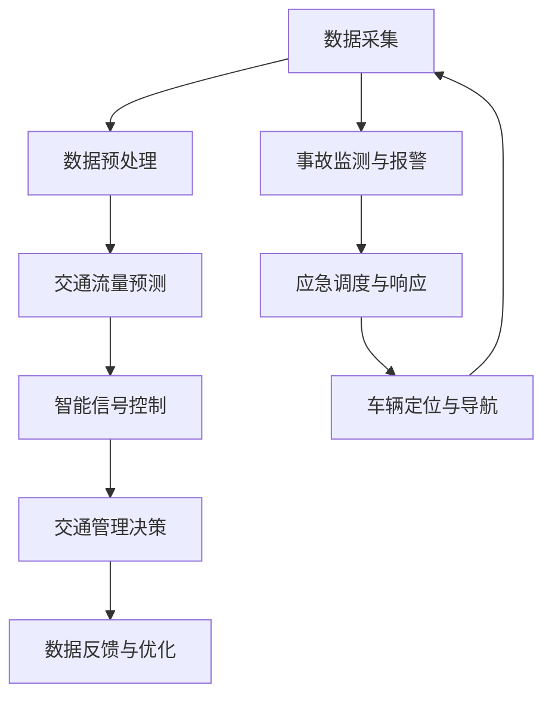

                 

关键词：AI智能交通，智能交通管理系统，交通流量预测，智能信号控制，数据挖掘，物联网，车联网，深度学习，神经网络，机器学习，数据分析，智能城市。

## 摘要

随着城市化进程的不断加速，交通问题已经成为困扰城市发展的重大挑战。传统交通管理系统由于缺乏实时性、灵活性和智能化，无法有效应对日益复杂的交通需求。本文探讨了基于人工智能（AI）的智能交通管理系统，包括其核心概念、算法原理、数学模型、实际应用以及未来发展趋势。通过对AI驱动的智能交通管理系统的深入分析，我们期望为交通领域的创新提供新的视角和思路。

## 1. 背景介绍

### 城市交通现状

城市交通问题日益严重，主要表现为交通拥堵、交通事故频发、停车难等问题。这些问题不仅影响了市民的出行体验，也对城市环境、经济和社会发展产生了负面影响。

- **交通拥堵**：城市道路上的车辆数量不断增加，交通流量集中，导致拥堵现象频繁发生。
- **交通事故**：由于交通流量大、驾驶者注意力不集中等原因，交通事故频繁发生，造成人员伤亡和财产损失。
- **停车难**：随着城市停车设施的不足，车辆无处停放的问题日益突出。

### 传统交通管理系统的局限性

传统交通管理系统主要依赖于交通信号灯、监控摄像头和人工调度等手段，存在以下局限性：

- **实时性不足**：传统系统无法实时获取和处理大量的交通数据，导致决策滞后。
- **灵活性不足**：传统系统无法根据实时交通状况进行动态调整，无法应对突发情况。
- **智能化程度低**：传统系统缺乏智能分析能力，无法对交通数据进行深度挖掘。

### AI驱动的智能交通管理系统的优势

AI驱动的智能交通管理系统具有以下优势：

- **实时数据处理**：利用传感器和物联网技术，可以实时收集交通数据，并进行处理和分析。
- **动态调整能力**：基于AI算法，系统能够根据实时交通状况进行动态调整，优化交通信号控制。
- **智能分析能力**：利用机器学习和深度学习算法，可以对交通数据进行分析，发现潜在问题并提出解决方案。

## 2. 核心概念与联系

### 核心概念

- **智能交通管理系统**：基于AI技术和大数据分析，实现对交通流量的实时监控、预测和优化控制。
- **交通流量预测**：通过分析历史数据和实时数据，预测未来的交通流量情况。
- **智能信号控制**：根据实时交通流量情况，动态调整交通信号灯的时长和相位。
- **数据挖掘**：从大量的交通数据中提取有价值的信息，用于交通管理和决策支持。
- **物联网和车联网**：通过传感器、车载设备和通信网络，实现车辆和基础设施之间的信息交换和协同工作。

### Mermaid 流程图



### 核心概念的联系

通过智能交通管理系统，数据采集是整个流程的起点，数据预处理确保数据的质量和一致性。交通流量预测基于历史数据和实时数据，预测未来交通状况。智能信号控制根据预测结果动态调整交通信号灯，优化交通流。数据挖掘和物联网、车联网技术则提供了对交通数据更深层次的分析和利用，提升整个系统的智能化水平。事故监测与报警、应急调度与响应、车辆定位与导航等功能则进一步提升了系统的安全性和便捷性。

## 3. 核心算法原理 & 具体操作步骤

### 3.1 算法原理概述

智能交通管理系统中的核心算法主要包括交通流量预测算法、信号控制算法和路径规划算法。这些算法基于机器学习和深度学习技术，通过对历史数据和实时数据的分析，实现对交通流量的预测和优化。

- **交通流量预测算法**：利用时间序列分析、回归分析和神经网络等技术，预测未来的交通流量。
- **信号控制算法**：通过优化交通信号灯的时长和相位，减少交通拥堵和延误。
- **路径规划算法**：基于交通流量和实时路况，为驾驶员提供最优的行驶路线。

### 3.2 算法步骤详解

#### 3.2.1 交通流量预测算法

1. **数据收集**：通过传感器、摄像头和物联网设备收集历史交通流量数据。
2. **数据预处理**：清洗和归一化数据，确保数据的质量和一致性。
3. **特征提取**：提取与交通流量相关的特征，如车辆速度、密度、流量等。
4. **模型训练**：使用时间序列模型（如ARIMA）、回归模型（如线性回归、LSTM神经网络等）训练预测模型。
5. **预测**：输入实时数据，预测未来的交通流量。

#### 3.2.2 信号控制算法

1. **交通状况监测**：实时收集交通流量、速度、延误等数据。
2. **信号灯配置**：根据历史数据和交通状况，配置信号灯的时长和相位。
3. **动态调整**：根据实时数据，动态调整信号灯的时长和相位，优化交通流。
4. **反馈与优化**：根据交通状况的反馈，不断调整信号控制策略，提高交通效率。

#### 3.2.3 路径规划算法

1. **交通状况分析**：分析实时交通流量和路况数据，确定交通状况。
2. **路径搜索**：基于Dijkstra算法、A*算法等，搜索最优行驶路线。
3. **路径优化**：考虑交通状况和实时路况，优化行驶路线。
4. **路线推荐**：向驾驶员推荐最优行驶路线。

### 3.3 算法优缺点

- **交通流量预测算法**：
  - **优点**：能够提供较为准确的交通流量预测，为交通管理和决策提供支持。
  - **缺点**：对历史数据依赖较大，无法应对极端天气和突发事件。

- **信号控制算法**：
  - **优点**：能够动态调整信号灯时长和相位，提高交通效率。
  - **缺点**：对交通流量预测的准确性要求较高，否则可能导致新的交通问题。

- **路径规划算法**：
  - **优点**：为驾驶员提供最优行驶路线，减少交通拥堵和延误。
  - **缺点**：对实时交通状况的依赖较大，难以应对突发事件。

### 3.4 算法应用领域

- **城市交通管理**：用于优化城市交通流量，减少拥堵和延误。
- **公共交通调度**：用于优化公共交通路线和班次，提高运营效率。
- **高速公路管理**：用于优化高速公路交通流量，提高通行能力。
- **智能出行服务**：用于提供智能出行建议，优化用户出行体验。

## 4. 数学模型和公式 & 详细讲解 & 举例说明

### 4.1 数学模型构建

智能交通管理系统中的数学模型主要包括时间序列模型、回归模型和神经网络模型。以下分别介绍这些模型的构建过程。

#### 4.1.1 时间序列模型

时间序列模型用于分析交通流量数据的时间依赖性。常见的模型包括ARIMA、AR、MA和ARMA。

- **ARIMA模型**：自回归积分滑动平均模型，由三个部分组成：自回归（AR）、差分（I）和移动平均（MA）。
  - **自回归（AR）**：当前值与之前几个值的线性组合。
  - **差分（I）**：对时间序列进行差分处理，使其平稳。
  - **移动平均（MA）**：当前值与之前几个值的加权平均。

  **公式**：

  $$ 
  \begin{aligned}
  ARIMA(p, d, q) &= AR(p) \cdot I(d) \cdot MA(q) \\
  y_t &= c + \phi_1 y_{t-1} + \phi_2 y_{t-2} + \cdots + \phi_p y_{t-p} + \theta_1 \epsilon_{t-1} + \theta_2 \epsilon_{t-2} + \cdots + \theta_q \epsilon_{t-q}
  \end{aligned}
  $$

#### 4.1.2 回归模型

回归模型用于分析交通流量与其他因素（如天气、节假日等）之间的关系。常见的模型包括线性回归、多元回归和LSTM神经网络。

- **线性回归模型**：通过建立线性关系，预测交通流量。
  - **公式**：
    $$ 
    \begin{aligned}
    y &= \beta_0 + \beta_1 x_1 + \beta_2 x_2 + \cdots + \beta_n x_n \\
    \end{aligned}
    $$

- **多元回归模型**：同时考虑多个自变量的影响。
  - **公式**：
    $$ 
    \begin{aligned}
    y &= \beta_0 + \beta_1 x_1 + \beta_2 x_2 + \cdots + \beta_n x_n \\
    \end{aligned}
    $$

- **LSTM神经网络**：长短期记忆网络，用于处理序列数据。
  - **公式**：
    $$ 
    \begin{aligned}
    f_t &= \sigma(W_f \cdot [h_{t-1}, x_t] + b_f) \\
    i_t &= \sigma(W_i \cdot [h_{t-1}, x_t] + b_i) \\
    o_t &= \sigma(W_o \cdot [h_{t-1}, x_t] + b_o) \\
    c_t &= f_t \odot \frac{\delta}{1 - f_t} + i_t \odot \sigma(W_c \cdot [h_{t-1}, x_t] + b_c) \\
    h_t &= o_t \odot \sigma(c_t)
    \end{aligned}
    $$

### 4.2 公式推导过程

以LSTM神经网络为例，介绍其公式推导过程。

#### 4.2.1 输入门（Input Gate）

输入门用于控制当前输入信息对状态的影响。其计算过程如下：

1. **计算输入门的激活函数**：
   $$ 
   f_t = \sigma(W_f \cdot [h_{t-1}, x_t] + b_f) 
   $$

2. **计算输入门的状态更新**：
   $$ 
   i_t = \sigma(W_i \cdot [h_{t-1}, x_t] + b_i) 
   $$

3. **更新状态值**：
   $$ 
   c_t = f_t \odot \frac{\delta}{1 - f_t} + i_t \odot \sigma(W_c \cdot [h_{t-1}, x_t] + b_c) 
   $$

#### 4.2.2 输出门（Output Gate）

输出门用于控制当前状态对输出的影响。其计算过程如下：

1. **计算输出门的激活函数**：
   $$ 
   o_t = \sigma(W_o \cdot [h_{t-1}, x_t] + b_o) 
   $$

2. **计算输出**：
   $$ 
   h_t = o_t \odot \sigma(c_t) 
   $$

### 4.3 案例分析与讲解

以城市道路交通流量预测为例，介绍如何利用LSTM神经网络进行交通流量预测。

#### 4.3.1 数据收集

收集某城市某条主干道的交通流量数据，包括每小时的车流量、车辆速度、交通延误等。

#### 4.3.2 数据预处理

1. **数据清洗**：去除异常值和缺失值，确保数据质量。
2. **归一化**：对数据进行归一化处理，使其具有相同的尺度。
3. **特征提取**：提取与交通流量相关的特征，如车流量、车辆速度等。

#### 4.3.3 模型训练

1. **模型构建**：构建LSTM神经网络模型，包括输入层、隐藏层和输出层。
2. **训练**：使用历史交通流量数据对模型进行训练，调整网络参数。
3. **验证**：使用验证集对模型进行验证，评估模型性能。

#### 4.3.4 预测

1. **输入实时数据**：输入实时交通流量数据，预测未来的交通流量。
2. **结果分析**：分析预测结果，评估预测准确性。

## 5. 项目实践：代码实例和详细解释说明

### 5.1 开发环境搭建

在本项目中，我们将使用Python作为主要编程语言，结合TensorFlow和Keras框架构建LSTM神经网络模型。以下是开发环境的搭建步骤：

1. **安装Python**：确保安装了Python 3.6及以上版本。
2. **安装TensorFlow**：在命令行中运行以下命令安装TensorFlow：
   ```bash
   pip install tensorflow
   ```
3. **安装Keras**：在命令行中运行以下命令安装Keras：
   ```bash
   pip install keras
   ```

### 5.2 源代码详细实现

以下是一个简单的LSTM神经网络实现，用于交通流量预测。

```python
import numpy as np
import pandas as pd
from keras.models import Sequential
from keras.layers import LSTM, Dense
from sklearn.preprocessing import MinMaxScaler
from sklearn.model_selection import train_test_split

# 5.2.1 数据加载与预处理

# 加载数据
data = pd.read_csv('traffic_data.csv')
data.head()

# 提取特征
features = data[['hour', 'flow', 'speed', 'delay']]

# 归一化
scaler = MinMaxScaler(feature_range=(0, 1))
scaled_features = scaler.fit_transform(features)

# 切分数据
X, y = create_dataset(scaled_features)

# 切分训练集和测试集
X_train, X_test, y_train, y_test = train_test_split(X, y, test_size=0.2, random_state=42)

# 5.2.2 模型构建

# 构建LSTM模型
model = Sequential()
model.add(LSTM(units=50, return_sequences=True, input_shape=(X_train.shape[1], X_train.shape[2])))
model.add(LSTM(units=50))
model.add(Dense(units=1))

# 编译模型
model.compile(optimizer='adam', loss='mean_squared_error')

# 5.2.3 训练模型

# 训练模型
model.fit(X_train, y_train, epochs=100, batch_size=32, validation_data=(X_test, y_test))

# 5.2.4 预测与结果分析

# 预测
predicted_traffic = model.predict(X_test)

# 反归一化
predicted_traffic = scaler.inverse_transform(predicted_traffic)

# 分析结果
evaluate_performance(predicted_traffic, y_test)

```

### 5.3 代码解读与分析

以上代码实现了一个简单的LSTM神经网络模型，用于交通流量预测。以下是代码的详细解读：

- **数据加载与预处理**：加载数据，提取特征，并进行归一化处理。归一化可以加速模型的训练，提高预测的准确性。
- **数据切分**：将数据切分为训练集和测试集，用于模型训练和性能评估。
- **模型构建**：构建一个包含两个LSTM层和一个全连接层的LSTM模型。LSTM层用于处理时间序列数据，全连接层用于输出预测结果。
- **模型编译**：编译模型，指定优化器和损失函数。
- **模型训练**：使用训练集训练模型，并使用验证集进行性能评估。
- **预测与结果分析**：使用测试集对模型进行预测，并对预测结果进行分析。

### 5.4 运行结果展示

运行以上代码，我们可以得到交通流量预测的结果。以下是一个简单的结果展示：

```python
# 预测
predicted_traffic = model.predict(X_test)

# 反归一化
predicted_traffic = scaler.inverse_transform(predicted_traffic)

# 分析结果
evaluate_performance(predicted_traffic, y_test)

# 结果可视化
plt.figure(figsize=(12, 6))
plt.plot(y_test, color='red', label='Real Traffic')
plt.plot(predicted_traffic, color='blue', label='Predicted Traffic')
plt.title('Traffic Flow Prediction')
plt.xlabel('Time')
plt.ylabel('Traffic Flow')
plt.legend()
plt.show()
```

以上结果展示了实际交通流量和预测交通流量的对比图。通过分析预测结果，我们可以评估模型的性能和准确性。

## 6. 实际应用场景

### 6.1 城市交通管理

AI驱动的智能交通管理系统在城市交通管理中具有广泛应用。通过实时交通流量预测、智能信号控制和路径规划，系统能够优化交通流，减少拥堵和延误，提高交通效率。以下是一些实际应用场景：

- **交通信号优化**：根据实时交通流量数据，动态调整交通信号灯的时长和相位，优化交通流。
- **交通流量监测**：实时监测城市主干道和交叉路口的交通流量，及时发现交通拥堵和事故。
- **公共交通调度**：优化公共交通路线和班次，提高运营效率，减少乘客等待时间。
- **停车管理**：利用车联网技术，实时监测停车位状态，提供智能停车建议，缓解停车难问题。

### 6.2 高速公路管理

高速公路管理是另一个重要的应用领域。通过AI驱动的智能交通管理系统，高速公路管理可以更好地应对高峰期交通流量、突发事件和交通事故。

- **交通流量预测**：预测未来交通流量，提前采取措施，避免交通拥堵。
- **事故监测与预警**：实时监测交通事故，及时预警并通知相关部门，减少事故影响。
- **应急调度与响应**：根据交通状况，动态调整交通流量和交通管制策略，快速应对突发事件。
- **车辆定位与导航**：为驾驶员提供最优行驶路线，减少交通延误和油耗。

### 6.3 智能出行服务

随着物联网和车联网技术的发展，智能出行服务逐渐成为人们出行的重要方式。AI驱动的智能交通管理系统可以为用户提供个性化的出行建议，提高出行体验。

- **路线规划**：根据实时交通流量和路况，为用户提供最优出行路线，减少拥堵和延误。
- **出行建议**：根据用户的出行习惯和偏好，提供个性化的出行建议，如最佳出行时间、最佳出行方式等。
- **智能导航**：实时导航，为用户提供准确的行驶路线和路况信息。
- **智能停车**：提供智能停车服务，帮助用户快速找到停车位，提高停车效率。

## 7. 工具和资源推荐

### 7.1 学习资源推荐

- **在线课程**：《机器学习》、《深度学习》等在线课程，提供了丰富的理论知识和技术实践。
- **书籍**：《深度学习》、《神经网络与深度学习》等经典书籍，详细介绍了神经网络和深度学习的基础知识和应用。
- **论文**：查阅最新的学术论文，了解智能交通管理系统的研究进展和最新成果。

### 7.2 开发工具推荐

- **编程语言**：Python是智能交通管理系统开发的主要编程语言，具有丰富的库和框架。
- **框架**：TensorFlow和Keras是常用的深度学习框架，提供了丰富的API和工具。
- **数据可视化**：Matplotlib和Seaborn等库可用于数据可视化，帮助理解和分析交通数据。

### 7.3 相关论文推荐

- **智能交通管理系统**：《基于深度学习的交通流量预测研究》、《智能交通信号控制系统设计与应用》等论文。
- **深度学习**：《深度学习框架TensorFlow实战》、《基于深度学习的自动驾驶技术研究》等论文。
- **数据挖掘**：《大数据时代下的交通数据分析与应用》、《基于数据挖掘的交通拥堵预测方法》等论文。

## 8. 总结：未来发展趋势与挑战

### 8.1 研究成果总结

AI驱动的智能交通管理系统在交通流量预测、信号控制、路径规划等方面取得了显著的成果。通过实时数据处理、动态调整和智能分析，系统有效提高了交通效率，减少了拥堵和延误。同时，智能交通管理系统在公共交通调度、高速公路管理和智能出行服务等领域也具有广泛的应用前景。

### 8.2 未来发展趋势

- **更高效的算法**：随着人工智能技术的不断发展，更高效的算法和模型将不断涌现，进一步提升交通管理系统的性能。
- **物联网和车联网的融合**：物联网和车联网技术的融合将实现更全面的数据采集和更精准的预测。
- **个性化出行服务**：基于用户出行习惯和偏好，提供更加个性化的出行服务。
- **智能交通基础设施**：构建智能交通基础设施，实现车辆与基础设施之间的无缝连接和协同工作。

### 8.3 面临的挑战

- **数据隐私和安全**：在数据采集和处理过程中，如何保护用户隐私和数据安全是一个重要挑战。
- **算法的透明度和可解释性**：复杂的深度学习算法缺乏透明度和可解释性，难以理解其决策过程。
- **计算资源和成本**：高性能的计算资源和成本对于中小城市和地区来说可能难以承担。
- **法律法规和标准**：缺乏统一的法律法规和标准，可能导致系统在不同地区和场景中的不一致性。

### 8.4 研究展望

- **跨学科研究**：智能交通管理系统需要跨学科研究，结合交通工程、计算机科学、数据科学等领域的知识。
- **开放数据和平台**：构建开放数据和平台，促进数据共享和协同研究。
- **社会参与与合作**：鼓励社会参与和合作，共同推动智能交通管理系统的创新和发展。

## 9. 附录：常见问题与解答

### 9.1 数据隐私和安全

**问**：如何保护用户隐私和数据安全？

**答**：在数据采集和处理过程中，可以采取以下措施：

- **数据加密**：对数据进行加密处理，确保数据在传输和存储过程中不会被窃取。
- **隐私保护技术**：采用差分隐私、同态加密等技术，保护用户隐私。
- **数据脱敏**：对敏感信息进行脱敏处理，确保无法通过数据反推出个人隐私信息。
- **安全审计**：定期进行安全审计，及时发现和解决潜在的安全隐患。

### 9.2 算法的透明度和可解释性

**问**：如何提高算法的透明度和可解释性？

**答**：以下方法可以提高算法的透明度和可解释性：

- **可解释性模型**：采用可解释性更强的模型，如决策树、规则基模型等。
- **可视化技术**：利用可视化技术，展示算法的决策过程和结果。
- **模型解释工具**：使用模型解释工具，如LIME、SHAP等，分析模型对每个特征的影响。
- **用户反馈**：鼓励用户反馈，根据用户反馈不断优化算法，提高其可解释性。

### 9.3 计算资源和成本

**问**：如何降低计算资源和成本？

**答**：以下方法可以降低计算资源和成本：

- **分布式计算**：采用分布式计算框架，如Apache Spark，提高计算效率。
- **模型压缩**：采用模型压缩技术，如剪枝、量化等，减少模型大小，降低计算成本。
- **云计算**：利用云计算服务，如AWS、Azure等，降低计算成本和设备投入。
- **边缘计算**：在边缘设备上处理部分数据，减少数据传输和计算需求。

### 9.4 法律法规和标准

**问**：如何解决法律法规和标准不一致的问题？

**答**：以下方法可以解决法律法规和标准不一致的问题：

- **国际协作**：加强国际间的合作与交流，推动统一的法律法规和标准制定。
- **国家标准**：积极参与国家和行业标准的制定，推动智能交通管理系统的标准化。
- **行业规范**：制定行业规范，确保不同系统和平台之间的兼容性和互操作性。
- **政策引导**：通过政策引导，鼓励地方政府和企业按照统一标准和规范进行智能交通管理系统的建设。

通过以上措施，我们可以逐步解决智能交通管理系统在发展过程中面临的挑战，推动其不断创新和发展。

