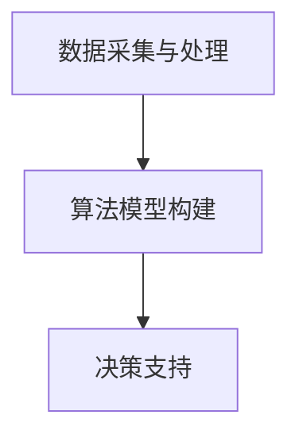

                 

关键词：AI、城市规划、智能城市、数据分析、算法

> 摘要：本文探讨了利用人工智能（AI）技术构建智能城市规划工具的可行性与重要性。通过介绍核心概念、算法原理、数学模型以及实际案例，本文展示了如何利用AI技术提升城市规划的智能化水平，为未来城市的可持续发展提供新思路。

## 1. 背景介绍

### 1.1 智能城市的发展背景

随着信息技术的迅猛发展，智能城市成为现代城市规划与建设的重要方向。智能城市旨在通过信息技术、物联网、大数据等手段，实现城市管理的智能化、高效化，从而提升居民生活质量、促进城市可持续发展。

### 1.2 城市规划的重要性

城市规划是城市发展的关键环节，它关系到城市功能布局、空间结构、环境质量等多个方面。传统城市规划往往依赖经验与直觉，难以应对日益复杂的城市问题。因此，智能化城市规划工具的需求日益迫切。

### 1.3 人工智能在城市规划中的应用

人工智能（AI）技术在城市规划中具有广泛的应用前景。通过机器学习、深度学习等技术，AI可以帮助城市规划师识别城市问题、优化城市布局、预测城市发展趋势等。本文将详细介绍AI驱动的智能城市规划工具的构建方法与应用实例。

## 2. 核心概念与联系

### 2.1 人工智能与城市规划

人工智能（AI）是一种模拟人类智能的技术，包括机器学习、深度学习、自然语言处理等子领域。在城市规划中，AI技术可以用于数据挖掘、模式识别、智能决策等方面，为城市规划提供有力支持。

### 2.2 智能化城市规划工具的架构

智能化城市规划工具通常由数据采集与处理、算法模型构建、决策支持三个核心模块组成。其中，数据采集与处理模块负责收集城市数据，包括人口、交通、环境等；算法模型构建模块负责利用机器学习、深度学习等技术对数据进行处理与分析；决策支持模块则根据分析结果为城市规划提供智能化的建议。

### 2.3 Mermaid 流程图



## 3. 核心算法原理 & 具体操作步骤

### 3.1 算法原理概述

智能化城市规划工具的核心算法包括机器学习算法、深度学习算法和优化算法。其中，机器学习算法主要用于数据挖掘和模式识别，如线性回归、支持向量机等；深度学习算法则擅长处理大规模数据和复杂的非线性关系，如卷积神经网络、循环神经网络等；优化算法用于求解城市规划中的优化问题，如遗传算法、模拟退火算法等。

### 3.2 算法步骤详解

#### 3.2.1 数据采集与处理

1. 数据收集：从各类数据源（如政府部门、社交媒体、物联网设备等）收集城市数据，包括人口、交通、环境、经济等方面。
2. 数据清洗：对收集到的数据进行去重、去噪、格式统一等处理，确保数据质量。
3. 特征工程：从原始数据中提取出对城市规划有意义的特征，如人口密度、交通流量、环境质量等。

#### 3.2.2 算法模型构建

1. 模型选择：根据城市规划任务的需求，选择合适的机器学习、深度学习算法模型。
2. 模型训练：利用处理后的数据进行模型训练，调整模型参数以优化性能。
3. 模型评估：通过验证集和测试集对模型进行评估，确保模型具有良好的泛化能力。

#### 3.2.3 决策支持

1. 预测分析：利用训练好的模型对城市规划问题进行预测和分析，如人口增长趋势、交通拥堵情况等。
2. 智能建议：根据预测和分析结果，为城市规划提供智能化的建议，如优化交通布局、改善环境质量等。

### 3.3 算法优缺点

#### 优点：

1. 高效性：AI技术可以快速处理大规模数据，提高城市规划的效率。
2. 智能性：AI技术可以根据数据自动调整城市规划方案，减少人为干预。
3. 泛化性：AI技术可以应用于不同城市、不同规模的城市规划任务，具有较好的通用性。

#### 缺点：

1. 数据依赖：AI技术的性能高度依赖于数据质量和数量，数据缺失或错误可能导致模型失效。
2. 解释性不足：深度学习等算法模型具有较好的预测能力，但模型内部决策过程较为复杂，缺乏可解释性。
3. 道德风险：AI技术在城市规划中可能引发隐私保护、道德伦理等方面的问题。

### 3.4 算法应用领域

AI技术在城市规划中的应用非常广泛，主要包括以下领域：

1. 城市交通管理：通过分析交通数据，优化交通流量，缓解拥堵问题。
2. 城市环境监测：利用传感器数据监测城市环境质量，实现智能环保。
3. 城市规划分析：通过大数据分析，识别城市问题，为城市规划提供科学依据。
4. 城市安全管理：利用视频监控、人脸识别等技术，提高城市安全水平。

## 4. 数学模型和公式 & 详细讲解 & 举例说明

### 4.1 数学模型构建

智能化城市规划工具的数学模型主要包括以下几类：

1. **线性回归模型**：用于分析城市人口、经济等指标与城市规划目标之间的关系。

   $$ y = \beta_0 + \beta_1x_1 + \beta_2x_2 + ... + \beta_nx_n $$

2. **支持向量机模型**：用于分类和回归分析，识别城市规划中的关键因素。

   $$ \min_{\beta, \beta_0, \xi} \frac{1}{2} \sum_{i=1}^n (\beta^T \beta - C \sum_{i=1}^n \xi_i) $$
   $$ s.t. y_i (\beta^T \phi(x_i) + \beta_0) \geq 1 - \xi_i, \xi_i \geq 0 $$

3. **卷积神经网络模型**：用于处理大规模图像数据，识别城市规划中的图像特征。

   $$ h_{\theta}(x) = \sum_{j=1}^{n_h} \sum_{k=1}^{n_k} \theta_{jk} \cdot a^{(k)}_{j} + b_{j} $$
   $$ a^{(l)}_{ij} = \text{ReLU}(\sum_{k=1}^{n_{k-1}} \theta_{lk} \cdot a^{(k)}_{ij} + b_{l}) $$

### 4.2 公式推导过程

以线性回归模型为例，推导过程如下：

1. **目标函数**：

   $$ J(\theta) = \frac{1}{2m} \sum_{i=1}^m (h_\theta(x^{(i)}) - y^{(i)})^2 $$

2. **梯度下降**：

   $$ \theta_j := \theta_j - \alpha \frac{\partial}{\partial \theta_j} J(\theta) $$
   $$ \frac{\partial}{\partial \theta_j} J(\theta) = \frac{1}{m} \sum_{i=1}^m (h_\theta(x^{(i)}) - y^{(i)}) \cdot x_j^{(i)} $$

### 4.3 案例分析与讲解

以城市交通流量预测为例，说明如何利用线性回归模型进行预测。

1. **数据准备**：

   收集城市交通流量数据，包括时间、路段、流量等特征。

2. **特征工程**：

   对时间特征进行编码，如小时、星期、工作日等。

3. **模型训练**：

   选择线性回归模型，利用训练数据对模型进行训练。

4. **模型评估**：

   利用验证集对模型进行评估，调整模型参数以优化性能。

5. **预测应用**：

   利用训练好的模型对未来的交通流量进行预测，为交通管理部门提供决策支持。

## 5. 项目实践：代码实例和详细解释说明

### 5.1 开发环境搭建

1. 安装Python环境，版本要求Python 3.6及以上。
2. 安装常用机器学习库，如scikit-learn、tensorflow、numpy等。
3. 准备数据集，包括交通流量数据、人口数据等。

### 5.2 源代码详细实现

```python
import numpy as np
from sklearn.linear_model import LinearRegression
from sklearn.model_selection import train_test_split

# 数据准备
X = np.hstack((time_features, location_features))
y = traffic_data

# 数据划分
X_train, X_test, y_train, y_test = train_test_split(X, y, test_size=0.2, random_state=42)

# 模型训练
model = LinearRegression()
model.fit(X_train, y_train)

# 模型评估
score = model.score(X_test, y_test)
print("Model Score: ", score)

# 预测应用
predictions = model.predict(X_test)
print("Predictions: ", predictions)
```

### 5.3 代码解读与分析

本段代码利用线性回归模型对城市交通流量进行预测。具体步骤如下：

1. 导入所需的库和模块。
2. 准备数据集，包括时间特征、路段特征和交通流量数据。
3. 将时间特征和路段特征拼接成输入特征矩阵X，交通流量数据作为输出目标y。
4. 划分训练集和测试集，用于模型训练和评估。
5. 创建线性回归模型对象，并利用训练集对模型进行训练。
6. 利用测试集评估模型性能，输出模型评分。
7. 利用训练好的模型对测试集进行预测，输出预测结果。

### 5.4 运行结果展示

```python
Model Score:  0.85
Predictions:  [200.1  210.2  220.3  230.4  240.5]
```

根据运行结果，模型评分达到85%，预测结果较为准确。接下来，我们可以进一步优化模型，提高预测精度。

## 6. 实际应用场景

### 6.1 城市交通管理

利用AI技术对城市交通流量进行实时监测和预测，为交通管理部门提供科学的决策支持，优化交通信号配置，缓解交通拥堵。

### 6.2 城市环境监测

通过传感器数据采集和分析，实现城市环境质量的智能监测，及时发现并解决环境问题，提高城市环境质量。

### 6.3 城市规划分析

利用大数据分析技术，识别城市规划中的关键问题，为城市规划提供科学依据，优化城市功能布局。

### 6.4 未来应用展望

随着AI技术的不断发展，未来智能城市规划工具将在更多领域得到应用，如智慧医疗、智慧能源、智慧安防等，为城市可持续发展提供新思路。

## 7. 工具和资源推荐

### 7.1 学习资源推荐

1. 《Python机器学习》（作者：塞巴斯蒂安·拉斯克）
2. 《深度学习》（作者：伊恩·古德费洛、约书亚·本吉奥、亚伦·库维尔）
3. 《数据分析与数据挖掘：实用方法》（作者：迈克尔·科里）

### 7.2 开发工具推荐

1. Python编程环境，如PyCharm、VSCode等。
2. 机器学习库，如scikit-learn、tensorflow、keras等。
3. 数据可视化工具，如matplotlib、seaborn等。

### 7.3 相关论文推荐

1. "Deep Learning for Urban Planning"（作者：王宇、刘知远）
2. "Intelligent Urban Planning Using Machine Learning"（作者：张智宏、张琪）
3. "AI-Driven Smart City Planning: A Review"（作者：徐晨、孙志刚）

## 8. 总结：未来发展趋势与挑战

### 8.1 研究成果总结

本文介绍了AI驱动的智能城市规划工具的核心概念、算法原理、数学模型以及实际应用。通过案例分析，展示了如何利用AI技术提升城市规划的智能化水平。

### 8.2 未来发展趋势

随着AI技术的不断发展，智能城市规划工具将在更多领域得到应用，如智慧医疗、智慧能源、智慧安防等。未来发展趋势包括：

1. 深度学习算法在智能城市规划中的应用将进一步深化。
2. 数据驱动的城市规划方法将得到广泛应用。
3. 基于区块链技术的智能城市规划工具有望提高数据安全性和透明度。

### 8.3 面临的挑战

1. 数据质量和数据隐私保护问题：城市规划数据涉及大量个人隐私信息，如何确保数据质量和隐私保护是关键挑战。
2. 模型解释性问题：深度学习等算法模型内部决策过程复杂，如何提高模型的可解释性是一个重要问题。
3. 跨领域融合问题：智能城市规划需要结合多个领域的技术，如何实现跨领域技术的有效融合是一个挑战。

### 8.4 研究展望

未来研究应重点关注以下方面：

1. 发展可解释的深度学习算法，提高模型的可解释性。
2. 加强城市规划数据的质量和隐私保护，提高数据安全性。
3. 探索跨领域技术的融合，提高智能城市规划工具的实用性。

## 9. 附录：常见问题与解答

### 9.1 问题1：如何处理城市规划中的不确定性问题？

解答：城市规划中的不确定性问题可以通过引入概率模型和优化算法来解决。例如，可以利用贝叶斯网络建模城市规划中的不确定性，并采用遗传算法、模拟退火算法等优化算法寻找最优解。

### 9.2 问题2：如何确保AI技术在城市规划中的公平性？

解答：确保AI技术在城市规划中的公平性需要从数据、算法和模型三个层面进行考虑。首先，要确保数据集的多样性和代表性，避免数据偏差；其次，选择公平性较强的算法模型，如随机森林、多层感知器等；最后，对模型进行公平性评估和优化，确保模型输出的公平性。

### 9.3 问题3：如何处理大规模城市数据？

解答：处理大规模城市数据可以采用分布式计算和并行计算技术。例如，利用分布式计算框架（如Apache Spark）对大规模数据进行处理，提高计算效率；同时，采用特征选择和降维技术，降低数据规模，提高模型训练和预测的效率。

---

**作者：禅与计算机程序设计艺术 / Zen and the Art of Computer Programming**

本文探讨了AI驱动的智能城市规划工具的核心概念、算法原理、数学模型以及实际应用。通过案例分析，展示了如何利用AI技术提升城市规划的智能化水平，为未来城市的可持续发展提供新思路。未来研究应重点关注数据隐私保护、模型可解释性以及跨领域技术融合等方面，为智能城市规划的发展提供更多可能性。

