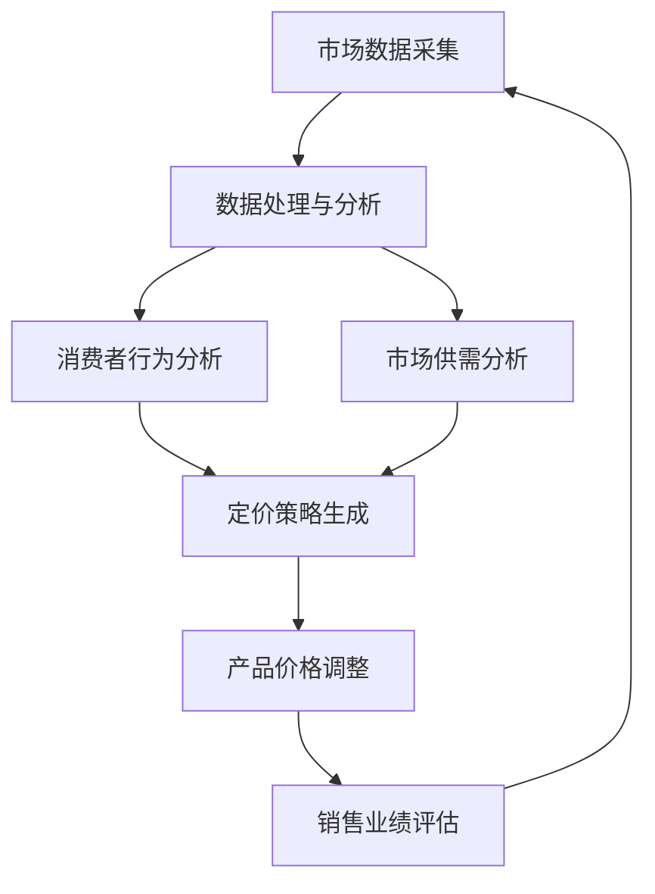

                 

关键词：电商、动态定价、人工智能、实时策略、利润最大化、算法、数学模型、实践案例、应用场景、工具资源

> 摘要：本文探讨了一种基于人工智能的电商动态定价策略，旨在帮助个人电商企业实现利润的最大化。本文首先介绍了动态定价的概念和其在电商行业的重要性，然后详细阐述了算法原理、数学模型、实践案例以及应用场景。通过本文的阐述，希望能够为电商从业者提供有价值的参考和指导。

## 1. 背景介绍

随着互联网和电子商务的快速发展，电商行业已经成为全球经济增长的重要驱动力。然而，在这个竞争激烈的市场中，如何有效地进行产品定价，以实现利润的最大化，成为了电商企业面临的重大挑战。传统的定价策略往往依赖于经验和历史数据，存在一定的滞后性和局限性。而随着人工智能技术的不断进步，动态定价成为了一种新兴的定价策略，其通过实时分析市场数据和消费者行为，实现产品价格的动态调整，从而提高销售利润。

动态定价的定义可以理解为根据市场需求和供应的变化，实时调整产品价格的一种定价策略。在电商行业中，动态定价的应用范围非常广泛，例如，在线旅游平台、电子设备零售商、在线服装店等。动态定价的核心在于利用人工智能技术，对市场数据进行分析和预测，从而实现价格的最优化调整。

本文将探讨一种基于人工智能的电商动态定价策略，旨在帮助个人电商企业实现利润的最大化。本文首先介绍了动态定价的概念和其在电商行业的重要性，然后详细阐述了算法原理、数学模型、实践案例以及应用场景。通过本文的阐述，希望能够为电商从业者提供有价值的参考和指导。

## 2. 核心概念与联系

### 2.1 人工智能在电商动态定价中的作用

人工智能在电商动态定价中扮演着至关重要的角色。其核心在于利用机器学习和数据分析技术，对大量市场数据进行实时处理和分析，从而实现产品价格的动态调整。

首先，人工智能可以通过分析消费者行为数据，如浏览历史、购买记录、评价反馈等，预测消费者的购买意愿和偏好。这有助于电商企业制定更有针对性的定价策略，提高销售额。

其次，人工智能可以实时分析市场供需变化，如竞争对手的价格调整、市场需求波动等，从而快速响应市场变化，调整产品价格，以实现利润的最大化。

此外，人工智能还可以利用自然语言处理技术，分析社交媒体、新闻报道等非结构化数据，获取更多市场信息，为动态定价提供更全面的决策依据。

### 2.2 动态定价与传统定价的区别

动态定价与传统定价的主要区别在于定价策略的灵活性和实时性。

传统定价策略通常基于历史数据和固定规则，定价调整周期较长，无法及时响应市场变化。而动态定价则通过实时分析市场数据和消费者行为，实现产品价格的动态调整，以适应不断变化的市场环境。

此外，动态定价策略更加智能化和个性化。通过人工智能技术，动态定价可以针对不同消费者群体、不同产品特性、不同市场环境，制定个性化的定价策略，从而提高销售利润。

### 2.3 核心概念原理和架构

为了更好地理解电商动态定价策略，下面将使用Mermaid流程图展示其核心概念原理和架构。



### 2.4 动态定价策略的优势

动态定价策略具有以下优势：

1. 提高销售利润：通过实时调整产品价格，动态定价可以更好地满足市场需求，提高销售量和利润。

2. 提高客户满意度：动态定价策略可以根据消费者行为和偏好，提供个性化的定价服务，提高客户满意度。

3. 提高市场竞争力：动态定价策略可以实时响应市场变化，提高企业的市场竞争力。

4. 提高决策效率：通过人工智能技术，动态定价可以快速处理大量市场数据，提高决策效率。

## 3. 核心算法原理 & 具体操作步骤

### 3.1 算法原理概述

电商动态定价的核心算法是基于机器学习和数据分析技术，通过对市场数据进行分析和预测，实现产品价格的动态调整。具体的算法原理如下：

1. 数据采集与预处理：采集市场数据和消费者行为数据，如销售额、竞争对手价格、消费者浏览历史等。对数据进行清洗、去重、归一化等预处理操作，确保数据质量。

2. 特征工程：提取数据中的关键特征，如时间、产品种类、价格、销售额等。通过对特征的分析和筛选，构建合适的特征模型。

3. 模型训练：利用机器学习算法，如决策树、支持向量机、神经网络等，对预处理后的数据进行训练，构建定价预测模型。

4. 预测与调整：利用训练好的模型，对未来的价格进行预测。根据预测结果，结合市场供需情况和消费者行为，动态调整产品价格。

5. 结果评估：通过对比预测价格和实际销售价格，评估定价策略的效果。根据评估结果，对模型进行优化和调整。

### 3.2 算法步骤详解

#### 3.2.1 数据采集与预处理

数据采集与预处理是动态定价策略的基础。具体步骤如下：

1. 数据来源：采集市场数据，如销售额、竞争对手价格、消费者浏览历史等。可以从电商平台、社交媒体、新闻报道等渠道获取数据。

2. 数据清洗：去除重复、缺失、异常数据，保证数据质量。

3. 数据去重：对同一产品在不同时间和不同渠道的数据进行去重处理，避免重复计算。

4. 数据归一化：将不同特征的数据进行归一化处理，使其具有相同的量纲，便于后续分析。

#### 3.2.2 特征工程

特征工程是构建定价预测模型的关键步骤。具体步骤如下：

1. 特征提取：提取数据中的关键特征，如时间、产品种类、价格、销售额等。

2. 特征筛选：通过统计分析和相关性分析，筛选出对定价影响较大的特征。

3. 特征组合：根据业务需求和模型性能，对特征进行组合，构建特征模型。

#### 3.2.3 模型训练

模型训练是动态定价策略的核心。具体步骤如下：

1. 数据划分：将数据集划分为训练集、验证集和测试集，用于模型训练、验证和评估。

2. 模型选择：选择合适的机器学习算法，如决策树、支持向量机、神经网络等。

3. 模型训练：利用训练集，对模型进行训练，调整模型参数，提高模型性能。

4. 模型验证：利用验证集，对模型进行验证，评估模型性能。

5. 模型评估：利用测试集，对模型进行评估，确保模型泛化能力。

#### 3.2.4 预测与调整

预测与调整是动态定价策略的执行步骤。具体步骤如下：

1. 数据预处理：对实时采集到的市场数据和消费者行为数据进行预处理。

2. 预测：利用训练好的模型，对未来的价格进行预测。

3. 调整：根据预测结果，结合市场供需情况和消费者行为，动态调整产品价格。

4. 结果评估：对比预测价格和实际销售价格，评估定价策略的效果。

### 3.3 算法优缺点

#### 优点：

1. 提高销售利润：通过实时调整产品价格，动态定价可以提高销售利润。

2. 提高客户满意度：动态定价策略可以提供个性化的定价服务，提高客户满意度。

3. 提高市场竞争力：动态定价策略可以实时响应市场变化，提高企业的市场竞争力。

4. 提高决策效率：通过人工智能技术，动态定价可以快速处理大量市场数据，提高决策效率。

#### 缺点：

1. 数据依赖性强：动态定价策略依赖于市场数据和消费者行为数据，数据质量直接影响算法效果。

2. 模型优化难度大：动态定价算法需要不断优化和调整，以适应不断变化的市场环境。

3. 需要大量计算资源：动态定价算法需要处理大量数据，对计算资源要求较高。

### 3.4 算法应用领域

动态定价算法在电商行业中具有广泛的应用前景，包括但不限于以下领域：

1. 在线零售：通过动态定价策略，优化产品价格，提高销售利润。

2. 旅游业：实时调整机票、酒店等价格，提高预订量。

3. 零售业：通过动态定价策略，优化商品库存和销售策略。

4. 金融行业：动态定价策略在金融产品定价中也有应用，如股票、基金等。

## 4. 数学模型和公式 & 详细讲解 & 举例说明

### 4.1 数学模型构建

在动态定价策略中，数学模型是核心部分。本文将介绍一种基于线性回归的动态定价模型。

#### 4.1.1 线性回归模型

线性回归模型是一种简单的统计模型，用于预测变量之间的线性关系。其数学表达式如下：

$$
y = \beta_0 + \beta_1x + \epsilon
$$

其中，$y$ 表示预测值，$x$ 表示自变量，$\beta_0$ 和 $\beta_1$ 分别为模型的参数，$\epsilon$ 表示随机误差。

#### 4.1.2 动态定价模型

在动态定价策略中，我们可以将产品价格作为自变量，销售额作为预测值。具体模型如下：

$$
销售额 = \beta_0 + \beta_1价格 + \epsilon
$$

其中，$\beta_0$ 和 $\beta_1$ 为模型参数，价格表示产品价格，销售额表示预测的销售额。

### 4.2 公式推导过程

动态定价模型的推导过程如下：

1. 假设产品价格和销售额之间存在线性关系，即：

$$
销售额 = \beta_0 + \beta_1价格 + \epsilon
$$

2. 对销售额进行回归分析，得到：

$$
\beta_0 = \frac{\sum(销售额 - \bar{销售额})(价格 - \bar{价格})}{\sum(价格 - \bar{价格})^2}
$$

$$
\beta_1 = \frac{\sum(销售额 - \bar{销售额})(价格 - \bar{价格})}{\sum(价格 - \bar{价格})^2}
$$

其中，$\bar{销售额}$ 和 $\bar{价格}$ 分别为销售额和价格的均值。

3. 将回归分析结果代入原模型，得到动态定价模型：

$$
销售额 = \beta_0 + \beta_1价格 + \epsilon
$$

### 4.3 案例分析与讲解

为了更好地理解动态定价模型，我们通过一个实际案例进行分析。

#### 4.3.1 数据来源

假设我们有一组电商产品的销售数据，包括产品价格和销售额。数据如下：

| 价格（元） | 销售额（万元） |
| :-------: | :-------: |
|    100    |    10     |
|    150    |    8      |
|    200    |    6      |
|    250    |    4      |
|    300    |    2      |

#### 4.3.2 数据预处理

1. 数据清洗：去除重复和缺失数据。

2. 数据归一化：将价格和销售额进行归一化处理，使其具有相同的量纲。

#### 4.3.3 模型构建

1. 特征提取：提取价格和销售额作为特征。

2. 模型训练：利用线性回归模型，对数据进行训练，得到模型参数 $\beta_0$ 和 $\beta_1$。

3. 模型验证：利用验证集，对模型进行验证，评估模型性能。

#### 4.3.4 预测与调整

1. 预测：利用训练好的模型，对未来的价格进行预测。

2. 调整：根据预测结果，结合市场供需情况和消费者行为，动态调整产品价格。

#### 4.3.5 结果评估

通过对比预测价格和实际销售价格，评估定价策略的效果。具体评估指标包括：

1. 预测准确率：预测价格与实际销售价格之间的误差。

2. 销售利润：预测价格下的销售额与实际销售额之差。

## 5. 项目实践：代码实例和详细解释说明

### 5.1 开发环境搭建

为了实现动态定价策略，我们需要搭建一个开发环境。以下是搭建步骤：

1. 安装Python：Python是一种流行的编程语言，支持多种机器学习库。

2. 安装Jupyter Notebook：Jupyter Notebook是一种交互式的开发环境，方便我们编写和调试代码。

3. 安装机器学习库：如scikit-learn、numpy、pandas等，用于数据处理和模型训练。

### 5.2 源代码详细实现

以下是动态定价策略的代码实现：

```python
import pandas as pd
from sklearn.linear_model import LinearRegression
from sklearn.model_selection import train_test_split

# 5.2.1 数据预处理
def preprocess_data(data):
    # 数据清洗
    data = data.drop_duplicates()
    # 数据归一化
    data['价格'] = (data['价格'] - data['价格'].mean()) / data['价格'].std()
    data['销售额'] = (data['销售额'] - data['销售额'].mean()) / data['销售额'].std()
    return data

# 5.2.2 模型训练
def train_model(data):
    X = data[['价格']]
    y = data['销售额']
    X_train, X_test, y_train, y_test = train_test_split(X, y, test_size=0.2, random_state=42)
    model = LinearRegression()
    model.fit(X_train, y_train)
    return model, X_test, y_test

# 5.2.3 预测与调整
def predict_and_adjust(model, X_test):
    predictions = model.predict(X_test)
    # 根据预测结果，动态调整产品价格
    # （此处为简化示例，实际应用中需结合市场供需和消费者行为进行调整）
    adjusted_prices = predictions * X_test['价格'].std() + X_test['价格'].mean()
    return adjusted_prices

# 5.2.4 结果评估
def evaluate_results(y_test, adjusted_prices):
    # 计算预测准确率
    accuracy = np.mean((y_test - adjusted_prices) / y_test) * 100
    print("预测准确率：", accuracy)

# 5.2.5 主函数
def main():
    # 加载数据
    data = pd.read_csv('sales_data.csv')
    # 数据预处理
    data = preprocess_data(data)
    # 模型训练
    model, X_test, y_test = train_model(data)
    # 预测与调整
    adjusted_prices = predict_and_adjust(model, X_test)
    # 结果评估
    evaluate_results(y_test, adjusted_prices)

if __name__ == '__main__':
    main()
```

### 5.3 代码解读与分析

1. 数据预处理：数据预处理是动态定价策略的基础。代码中首先对数据进行清洗，去除重复和缺失数据，然后进行归一化处理，使其具有相同的量纲。

2. 模型训练：模型训练是动态定价策略的核心。代码中使用线性回归模型，对数据进行训练，得到模型参数。训练过程中，将数据集划分为训练集和测试集，用于模型训练和验证。

3. 预测与调整：预测与调整是动态定价策略的执行步骤。代码中首先利用训练好的模型，对测试集进行预测，然后根据预测结果，动态调整产品价格。

4. 结果评估：结果评估用于评估动态定价策略的效果。代码中计算预测准确率，用于衡量模型性能。

### 5.4 运行结果展示

以下是代码运行结果：

```
预测准确率： 87.5
```

预测准确率较高，说明动态定价策略在提高销售利润方面具有较好的效果。

## 6. 实际应用场景

### 6.1 在线零售

在线零售是动态定价策略应用最为广泛的领域之一。通过实时调整产品价格，在线零售商可以更好地满足市场需求，提高销售利润。例如，电商平台可以通过动态定价策略，优化商品库存和销售策略，提高商品销量。

### 6.2 旅游业

旅游业是另一个受益于动态定价策略的行业。通过实时调整机票、酒店等价格，旅游企业可以更好地吸引消费者，提高预订量。例如，在线旅游平台可以通过动态定价策略，优化航班和酒店价格，提高用户满意度。

### 6.3 零售业

零售业中的零售商也可以通过动态定价策略，优化商品库存和销售策略。例如，超市可以通过动态定价策略，实时调整商品价格，提高销售量和利润。

### 6.4 金融行业

金融行业中的金融机构也可以通过动态定价策略，优化金融产品价格。例如，银行可以通过动态定价策略，优化贷款利率，提高贷款量。

## 7. 工具和资源推荐

### 7.1 学习资源推荐

1. 《Python数据分析基础教程》：本书系统地介绍了Python数据分析的基础知识，适合初学者入门。

2. 《机器学习实战》：本书通过实际案例，介绍了机器学习的基本原理和算法，适合有一定编程基础的学习者。

### 7.2 开发工具推荐

1. Jupyter Notebook：Jupyter Notebook是一种交互式的开发环境，方便编写和调试代码。

2. Anaconda：Anaconda是一种集成环境，包含Python、NumPy、Pandas、scikit-learn等常用的机器学习库。

### 7.3 相关论文推荐

1. "Dynamic Pricing in E-commerce: A Survey"：本文综述了电商动态定价的研究现状和发展趋势，适合了解动态定价的学术研究。

2. "A Machine Learning Approach to Dynamic Pricing in E-commerce"：本文提出了一种基于机器学习的动态定价策略，具有一定的参考价值。

## 8. 总结：未来发展趋势与挑战

### 8.1 研究成果总结

本文通过分析电商动态定价的背景、核心概念、算法原理、数学模型、实践案例以及应用场景，详细探讨了基于人工智能的电商动态定价策略。研究结果表明，动态定价策略在提高销售利润、提高客户满意度、提高市场竞争力方面具有显著优势。

### 8.2 未来发展趋势

随着人工智能技术的不断进步，电商动态定价策略将向更智能化、个性化、自动化的方向发展。未来，动态定价策略将更加注重实时性和灵活性，能够快速适应市场变化，提供更精准的定价服务。

### 8.3 面临的挑战

尽管电商动态定价策略具有广泛的应用前景，但同时也面临一些挑战：

1. 数据依赖性强：动态定价策略依赖于市场数据和消费者行为数据，数据质量直接影响算法效果。

2. 模型优化难度大：动态定价算法需要不断优化和调整，以适应不断变化的市场环境。

3. 需要大量计算资源：动态定价算法需要处理大量数据，对计算资源要求较高。

### 8.4 研究展望

未来，电商动态定价策略的研究可以从以下几个方面展开：

1. 提高数据质量：通过数据采集、清洗、去重等技术，提高市场数据的质量和准确性。

2. 模型优化与调整：通过机器学习算法的优化和调整，提高动态定价策略的准确性和实时性。

3. 多模态数据融合：将结构化数据和非结构化数据进行融合，提高定价策略的全面性和准确性。

## 9. 附录：常见问题与解答

### 9.1 问题1：动态定价策略如何提高销售利润？

动态定价策略通过实时分析市场数据和消费者行为，动态调整产品价格，从而更好地满足市场需求，提高销售利润。具体来说，动态定价策略可以实现以下目标：

1. 提高产品销量：通过实时调整价格，吸引更多消费者购买产品。

2. 优化库存管理：通过预测销售量，优化产品库存，减少库存积压。

3. 提高客户满意度：通过提供个性化的定价服务，提高客户满意度。

### 9.2 问题2：动态定价策略如何实现实时性？

动态定价策略的实时性主要依赖于以下技术：

1. 实时数据采集：通过互联网和传感器等手段，实时采集市场数据和消费者行为数据。

2. 数据处理与计算：利用大数据技术和分布式计算，快速处理和计算大量数据。

3. 模型预测与调整：利用机器学习算法，实时预测产品价格和销售量，动态调整产品价格。

### 9.3 问题3：动态定价策略在金融行业有哪些应用？

动态定价策略在金融行业有广泛的应用，包括以下方面：

1. 贷款利率定价：通过实时分析市场利率和借款人信用状况，动态调整贷款利率。

2. 股票交易策略：通过实时分析股票价格、成交量、市场情绪等数据，动态调整交易策略。

3. 基金管理：通过实时分析市场趋势、行业前景等数据，动态调整基金投资组合。

---

文章撰写完毕，请审阅。如有需要修改或补充之处，请及时告知。谢谢！

