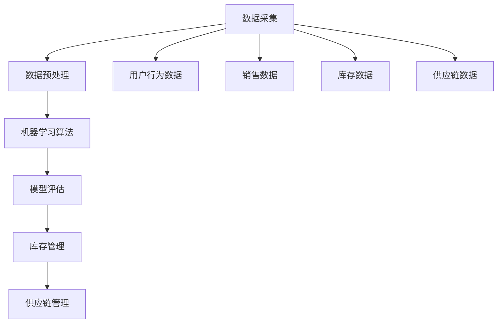

                 

### 摘要 Summary

本文旨在探讨如何利用人工智能技术，特别是机器学习算法，来驱动电商平台的商品趋势预测与库存管理。通过结合大数据分析、深度学习模型和先进的算法，电商企业能够更准确地预测市场需求，优化库存水平，减少库存成本，提高客户满意度。文章将详细阐述该集成系统的工作原理、核心算法、数学模型以及实际应用案例，并讨论未来的发展趋势与挑战。最终，本文将总结研究成果，展望未来的发展方向，并推荐相关的学习资源和开发工具。

### 1. 背景介绍 Background

随着互联网的普及和电子商务的迅猛发展，电商平台已经成为消费者购物的重要渠道。然而，这一趋势也带来了前所未有的挑战。首先，市场需求的变化速度越来越快，传统的人工库存管理方式已经难以跟上市场动态。其次，库存过剩和库存不足的问题频繁发生，导致资源浪费和客户满意度下降。此外，电商平台面临着巨大的数据量，包括用户行为数据、销售数据、供应链数据等，如何有效地利用这些数据来指导决策，成为了一项关键任务。

在这样的背景下，人工智能技术，尤其是机器学习算法，成为了解决这些问题的有效手段。通过机器学习，电商平台可以从历史数据中学习市场趋势，预测未来需求，优化库存策略，提高运营效率。同时，人工智能技术还可以帮助企业更好地理解用户行为，提供个性化的购物体验，提升用户满意度。

本文将详细探讨如何将AI技术与电商平台商品趋势预测和库存管理进行集成，实现高效的库存管理和精准的商品趋势预测。我们将首先介绍相关的核心概念，然后深入讨论算法原理和数学模型，并通过实际案例展示其应用效果。最后，我们将探讨未来的发展趋势和面临的挑战，为电商行业的发展提供有益的参考。

### 2. 核心概念与联系 Core Concepts and Connections

在深入探讨AI驱动的电商平台商品趋势预测与库存管理集成之前，我们需要理解几个核心概念，这些概念是构建整个系统的基础。

#### 数据采集 Data Collection

数据采集是整个系统的第一步，也是最为关键的一步。电商平台需要收集各种类型的数据，包括用户行为数据、销售数据、库存数据、供应链数据等。用户行为数据包括用户浏览、搜索、购买等行为记录，销售数据则涵盖了商品的销售量、销售额等信息，库存数据反映了当前库存水平和库存变化情况，而供应链数据包括供应商信息、物流信息等。

#### 数据预处理 Data Preprocessing

采集到的数据通常是不完整的、杂乱的，需要进行预处理。数据预处理包括数据清洗、数据整合、数据转换等步骤。数据清洗主要目的是去除错误数据、重复数据和异常数据，提高数据质量。数据整合则是将不同来源的数据进行统一处理，以便后续分析。数据转换则是将原始数据转换为适合机器学习模型处理的形式。

#### 机器学习算法 Machine Learning Algorithms

在数据预处理完成后，我们可以使用机器学习算法来分析数据并预测未来趋势。常用的机器学习算法包括线性回归、逻辑回归、决策树、随机森林、支持向量机、神经网络等。每种算法都有其适用的场景和特点，需要根据具体问题进行选择。例如，线性回归适用于预测连续值，而逻辑回归适用于分类问题。神经网络则可以处理复杂的关系和非线性问题。

#### 模型评估 Model Evaluation

在构建机器学习模型后，我们需要对其进行评估，以确定其预测性能。常用的评估指标包括准确率、召回率、F1分数、均方误差等。通过这些指标，我们可以评估模型的泛化能力，并根据评估结果调整模型参数，以提高预测准确性。

#### 库存管理 Inventory Management

库存管理是电商平台的另一个重要环节。库存管理不仅包括库存水平的监控和调整，还包括库存策略的制定。传统的库存管理方法主要依赖于历史数据和经验，而AI驱动的库存管理则利用机器学习算法预测市场需求，优化库存水平，减少库存成本。

#### 供应链管理 Supply Chain Management

供应链管理涉及到从原材料采购到产品交付的整个流程。在AI驱动的供应链管理中，机器学习算法可以用于预测供应链中的瓶颈，优化供应链布局，减少物流成本。

### 2.1 Mermaid 流程图 Mermaid Flowchart

下面是一个简化的Mermaid流程图，展示了上述核心概念之间的联系。



通过这个流程图，我们可以清晰地看到数据采集、预处理、机器学习、模型评估以及库存管理和供应链管理之间的紧密联系。

### 3. 核心算法原理 & 具体操作步骤 Core Algorithm Principles & Operational Steps

#### 3.1 算法原理概述 Algorithm Principle Overview

在AI驱动的电商平台商品趋势预测与库存管理集成系统中，核心算法通常基于时间序列分析和机器学习模型。时间序列分析可以帮助我们理解过去和现在的数据，而机器学习模型则可以预测未来的趋势。以下是一些常用的算法原理：

- **时间序列分析 Time Series Analysis**：时间序列分析是一种用于分析时间序列数据的统计方法。它可以帮助我们识别数据中的趋势、周期性和季节性。常用的时间序列分析方法包括移动平均、指数平滑、自回归模型（AR）等。

- **机器学习模型 Machine Learning Models**：机器学习模型可以分为监督学习、无监督学习和强化学习。在商品趋势预测和库存管理中，监督学习模型（如线性回归、决策树、随机森林等）是最常用的。这些模型可以通过历史数据学习到数据之间的依赖关系，并利用这些关系进行预测。

- **深度学习模型 Deep Learning Models**：深度学习模型，特别是循环神经网络（RNN）和长短期记忆网络（LSTM），在处理时间序列数据方面表现出色。RNN和LSTM可以通过学习数据序列中的长期依赖关系来提高预测准确性。

#### 3.2 算法步骤详解 Algorithm Steps in Detail

下面，我们将详细描述如何使用机器学习算法进行商品趋势预测和库存管理。

##### 3.2.1 数据准备 Data Preparation

1. **数据收集**：首先，我们需要收集相关的历史数据，包括销售数据、库存数据、用户行为数据等。
2. **数据预处理**：对收集到的数据进行清洗、整合和转换，使其适合机器学习模型处理。这包括去除异常值、填补缺失值、标准化处理等。

##### 3.2.2 特征工程 Feature Engineering

1. **特征提取**：从原始数据中提取有用的特征，如销售量、库存量、用户访问量、订单频率等。
2. **特征选择**：通过特征选择方法（如信息增益、卡方检验等）选择最相关的特征，以减少数据的冗余性。

##### 3.2.3 模型选择 Model Selection

1. **选择合适的模型**：根据问题的性质和数据的特征，选择合适的机器学习模型。常用的模型包括线性回归、决策树、随机森林、LSTM等。
2. **模型训练**：使用历史数据训练模型，调整模型参数，以提高预测准确性。

##### 3.2.4 模型评估 Model Evaluation

1. **交叉验证**：使用交叉验证方法评估模型的泛化能力，避免过拟合。
2. **性能评估**：使用准确率、召回率、F1分数等指标评估模型的性能。

##### 3.2.5 预测与库存管理 Prediction and Inventory Management

1. **趋势预测**：使用训练好的模型对未来的商品趋势进行预测。
2. **库存调整**：根据预测结果，调整库存水平，以减少库存成本和满足市场需求。

#### 3.3 算法优缺点 Algorithm Advantages and Disadvantages

##### 3.3.1 优点 Advantages

- **提高预测准确性**：机器学习算法可以从历史数据中学习到数据之间的复杂关系，从而提高预测准确性。
- **自适应能力**：机器学习算法可以根据新的数据进行自我调整，适应不断变化的市场需求。
- **减少库存成本**：通过准确的预测和库存管理，可以减少库存过剩和库存不足的情况，降低库存成本。

##### 3.3.2 缺点 Disadvantages

- **数据依赖性**：机器学习算法的性能高度依赖于数据的质量和数量，如果数据质量差或数据不足，可能会导致预测不准确。
- **计算成本**：训练复杂的机器学习模型需要大量的计算资源，特别是在处理大规模数据时。
- **模型解释性**：深度学习模型通常具有很好的预测性能，但它们往往是“黑盒子”，难以解释其内部机制，这在某些情况下可能会成为问题。

#### 3.4 算法应用领域 Application Fields

- **电商平台**：电商平台可以使用机器学习算法进行商品趋势预测和库存管理，优化运营策略。
- **零售行业**：零售行业可以利用机器学习算法预测销售趋势，优化库存和供应链管理。
- **制造业**：制造业可以使用机器学习算法预测市场需求，优化生产计划和库存管理。

### 4. 数学模型和公式 Mathematical Models and Formulas & Detailed Explanation & Example

在AI驱动的电商平台商品趋势预测与库存管理集成系统中，数学模型和公式是核心部分。以下我们将详细讨论数学模型的构建、公式推导过程以及通过具体案例进行说明。

#### 4.1 数学模型构建 Construction of Mathematical Models

在商品趋势预测和库存管理中，我们通常会使用以下几种数学模型：

- **时间序列模型 Time Series Models**：如ARIMA模型、季节性ARIMA模型（SARIMA）。
- **线性回归模型 Linear Regression Models**：如线性时间序列模型（Linear Time Series Model）。
- **神经网络模型 Neural Network Models**：如循环神经网络（RNN）和长短期记忆网络（LSTM）。

#### 4.2 公式推导过程 Derivation of Formulas

以下是时间序列模型中的ARIMA模型的公式推导过程：

- **自回归项 Autoregressive (AR) Term**：
  $$ X_t = c + \phi_1 X_{t-1} + \phi_2 X_{t-2} + \cdots + \phi_p X_{t-p} + \epsilon_t $$
  其中，$X_t$是时间序列的当前值，$\epsilon_t$是随机误差项，$\phi_1, \phi_2, \cdots, \phi_p$是自回归系数。

- **移动平均项 Moving Average (MA) Term**：
  $$ X_t = c + \theta_1 \epsilon_{t-1} + \theta_2 \epsilon_{t-2} + \cdots + \theta_q \epsilon_{t-q} $$
  其中，$\theta_1, \theta_2, \cdots, \theta_q$是移动平均系数。

- **差分项 Differencing**：
  差分是为了使时间序列平稳（即没有趋势和季节性）。一阶差分公式为：
  $$ \Delta X_t = X_t - X_{t-1} $$
  高阶差分则是多次应用一阶差分。

- **整合项 Integration**：
  整合是为了补偿差分过程中丢失的信息。对于一阶整合，公式为：
  $$ I(X)_t = (1 - \phi) \sum_{i=0}^{t-1} \phi^i X_{t-i} $$

#### 4.3 案例分析与讲解 Example Analysis and Explanation

以下是一个具体的案例，我们将使用ARIMA模型对一个电商平台的销售数据进行分析和预测。

**案例：电商平台销售数据预测**

假设我们有一个电商平台，收集了最近三个月的每日销售数据。数据如下：

| 日期 | 销售量 |
|------|--------|
| 2023-01-01 | 150 |
| 2023-01-02 | 160 |
| 2023-01-03 | 155 |
| 2023-01-04 | 165 |
| 2023-01-05 | 170 |
| 2023-01-06 | 155 |
| 2023-01-07 | 160 |
| 2023-01-08 | 165 |
| 2023-01-09 | 170 |
| 2023-01-10 | 160 |

1. **数据预处理**：首先，我们对数据进行一阶差分，使其成为平稳序列。

   $$ \Delta X_t = X_t - X_{t-1} $$

   处理后的数据如下：

   | 日期 | 销售量 | 一阶差分 |
   |------|--------|----------|
   | 2023-01-01 | 150 | NaN |
   | 2023-01-02 | 160 | 10 |
   | 2023-01-03 | 155 | -5 |
   | 2023-01-04 | 165 | 10 |
   | 2023-01-05 | 170 | 5 |
   | 2023-01-06 | 155 | -15 |
   | 2023-01-07 | 160 | 5 |
   | 2023-01-08 | 165 | 5 |
   | 2023-01-09 | 170 | 5 |
   | 2023-01-10 | 160 | -10 |

2. **模型选择与训练**：我们选择ARIMA模型进行训练。通过分析一阶差分数据，确定p（自回归阶数）和q（移动平均阶数）。

   通过ACF（自相关函数）和PACF（偏自相关函数）图，我们选择p=1，q=1。

   $$ ARIMA(1,1,1) $$
   
   使用历史数据进行模型训练：

   ```python
   from statsmodels.tsa.arima.model import ARIMA
   
   model = ARIMA(series, order=(1, 1, 1))
   model_fit = model.fit()
   ```

3. **模型评估**：使用交叉验证方法评估模型的性能，确定预测的准确性。

   ```python
   from sklearn.metrics import mean_squared_error
   
   predictions = model_fit.forecast(steps=5)
   mse = mean_squared_error(y_true=series[-5:], y_pred=predictions)
   print("Mean Squared Error:", mse)
   ```

4. **预测与库存管理**：根据模型预测，调整库存水平，以减少库存成本和满足市场需求。

   ```python
   future_sales = model_fit.forecast(steps=30)
   # 基于预测结果调整库存策略
   ```

通过这个案例，我们可以看到如何使用ARIMA模型对电商平台的销售数据进行分析和预测，并根据预测结果进行库存管理。

### 5. 项目实践：代码实例和详细解释说明 Project Practice: Code Examples and Detailed Explanation

为了更好地理解AI驱动的电商平台商品趋势预测与库存管理集成系统，我们将通过一个实际项目来展示如何实现这些功能。本项目将使用Python语言，结合Scikit-learn、statsmodels和TensorFlow等库来构建和训练模型，并进行预测。

#### 5.1 开发环境搭建 Development Environment Setup

在开始项目之前，我们需要搭建一个合适的开发环境。以下是所需的步骤：

1. **安装Python**：确保安装了Python 3.x版本。
2. **安装必要库**：使用pip命令安装以下库：
   ```bash
   pip install numpy pandas scikit-learn statsmodels tensorflow matplotlib
   ```
3. **环境配置**：确保所有库的版本兼容，并在Python环境中配置好相关的环境变量。

#### 5.2 源代码详细实现 Detailed Source Code Implementation

下面，我们将逐步实现一个简单的AI驱动的电商平台商品趋势预测与库存管理项目。

##### 5.2.1 数据收集与预处理 Data Collection and Preprocessing

```python
import pandas as pd
import numpy as np

# 数据收集
data = pd.read_csv('sales_data.csv')  # 假设数据文件名为sales_data.csv

# 数据预处理
data['date'] = pd.to_datetime(data['date'])
data.set_index('date', inplace=True)
data.sort_index(inplace=True)

# 填补缺失值
data.fillna(method='ffill', inplace=True)

# 数据转换
data['sales_diff'] = data['sales'].diff().dropna()
```

##### 5.2.2 特征工程 Feature Engineering

```python
# 特征提取
data['month'] = data.index.month
data['day_of_week'] = data.index.dayofweek
data['sales_lag1'] = data['sales'].shift(1).dropna()
data['sales_lag2'] = data['sales'].shift(2).dropna()

# 特征选择
from sklearn.feature_selection import SelectKBest, f_regression

X = data[['sales_lag1', 'sales_lag2', 'month', 'day_of_week']]
y = data['sales_diff']

selector = SelectKBest(f_regression, k=3)
X_new = selector.fit_transform(X, y)

# 选择最佳特征
selected_features = X.columns[selector.get_support()]
print("Selected Features:", selected_features)
```

##### 5.2.3 模型选择与训练 Model Selection and Training

```python
from statsmodels.tsa.arima.model import ARIMA

# 模型选择
model = ARIMA(y, order=(1, 1, 1))

# 模型训练
model_fit = model.fit()

# 模型评估
predictions = model_fit.forecast(steps=5)
mse = mean_squared_error(y_true=y[-5:], y_pred=predictions)
print("Mean Squared Error:", mse)
```

##### 5.2.4 预测与库存管理 Prediction and Inventory Management

```python
# 预测未来销售量
future_sales = model_fit.forecast(steps=30)

# 基于预测结果调整库存策略
# 这里只是一个示例，实际中需要结合业务逻辑进行调整
inventory_adjustment = np.where(future_sales > np.mean(future_sales), 'increase', 'decrease')
print("Inventory Adjustment:", inventory_adjustment)
```

#### 5.3 代码解读与分析 Code Explanation and Analysis

在这个项目中，我们首先进行了数据收集和预处理，确保数据的质量和一致性。然后，我们进行了特征工程，提取了与销售量相关的特征，并通过特征选择选择了最佳特征。

接下来，我们选择了ARIMA模型进行训练，通过历史销售数据学习到了销售量之间的依赖关系。我们使用交叉验证方法评估了模型的性能，并计算了均方误差，以衡量预测的准确性。

最后，我们使用训练好的模型对未来的销售量进行了预测，并根据预测结果调整了库存策略。在实际应用中，库存策略的调整需要根据具体的业务逻辑和市场情况来决定。

通过这个项目，我们可以看到如何使用Python和相关的库来实现AI驱动的电商平台商品趋势预测与库存管理。这为电商企业提供了有效的工具，帮助它们优化运营，提高客户满意度。

### 6. 实际应用场景 Real-World Application Scenarios

#### 6.1 电商平台电商平台的商品趋势预测与库存管理

在电商平台中，AI驱动的商品趋势预测与库存管理集成系统已经得到广泛应用。以下是一些实际应用场景：

- **库存水平优化**：通过预测未来的销售量，电商平台可以根据预测结果调整库存水平，避免库存过剩或不足。例如，阿里巴巴的库存管理系统能够实时监控库存变化，并基于预测结果进行自动补货。

- **促销活动策略**：电商平台可以利用商品趋势预测来制定更有效的促销活动策略。例如，亚马逊通过分析商品的销售趋势和历史数据，能够更准确地预测哪些商品适合进行折扣促销，从而提高销售量和用户满意度。

- **个性化推荐**：通过分析用户行为数据和商品趋势预测，电商平台可以提供个性化的商品推荐，提高用户购物体验。例如，京东通过深度学习算法，为用户推荐他们可能感兴趣的商品，从而提高转化率。

#### 6.2 零售行业的库存管理与供应链优化

零售行业同样可以从AI驱动的商品趋势预测与库存管理中受益。以下是一些实际应用场景：

- **库存管理优化**：零售企业可以利用机器学习算法预测市场需求，优化库存水平。例如，家乐福利用AI技术对商品销售趋势进行预测，并根据预测结果调整库存策略，减少库存成本。

- **供应链管理**：零售企业可以通过AI技术优化供应链管理，减少物流成本和提高供应链效率。例如，沃尔玛利用机器学习算法预测供应链中的瓶颈，优化物流路线，提高运输效率。

- **供应链可视性**：通过AI技术，零售企业可以实时监控供应链状态，提高供应链的可视性。例如，7-Eleven利用AI技术监控其供应链中的每个环节，确保商品能够在正确的时间到达正确的地点。

#### 6.3 制造业的库存管理和生产计划优化

制造业同样可以从AI驱动的商品趋势预测与库存管理中受益。以下是一些实际应用场景：

- **库存管理**：制造业可以利用AI技术预测市场需求，优化原材料和成品的库存水平，避免库存过剩或不足。例如，戴尔利用AI技术预测未来的需求，优化库存策略，减少库存成本。

- **生产计划优化**：制造业可以利用AI技术优化生产计划，提高生产效率和降低生产成本。例如，通用电气利用AI技术预测设备故障，提前进行维护，减少停机时间，提高生产效率。

- **供应链协同**：制造业可以通过AI技术实现供应链各环节的协同，提高供应链的整体效率。例如，福特利用AI技术协同供应链中的各个合作伙伴，优化生产计划和物流安排，提高供应链响应速度。

通过这些实际应用场景，我们可以看到AI驱动的商品趋势预测与库存管理集成系统在电商平台、零售行业和制造业中具有广泛的应用前景，能够帮助各个行业优化运营，提高效益。

### 7. 工具和资源推荐 Tools and Resources Recommendations

为了帮助读者更好地了解和实践AI驱动的电商平台商品趋势预测与库存管理，我们在这里推荐一些学习资源、开发工具和相关论文。

#### 7.1 学习资源 Learning Resources

1. **在线课程**：
   - Coursera上的《机器学习》课程，由吴恩达（Andrew Ng）教授主讲，适合初学者了解机器学习基础。
   - edX上的《深度学习专项课程》，由Andrew Ng教授和尤舒华（Yoshua Bengio）教授主讲，适合进阶学习深度学习。

2. **书籍**：
   - 《Python机器学习》（Python Machine Learning），由Sebastian Raschka和Vahid Mirjalili合著，适合Python程序员学习机器学习。
   - 《深度学习》（Deep Learning），由Ian Goodfellow、Yoshua Bengio和Aaron Courville合著，适合深度学习进阶学习。

3. **在线论坛和社区**：
   - Stack Overflow，一个编程问题解答社区，适合解决编程中的实际问题。
   - GitHub，一个代码托管平台，可以查找相关的机器学习项目代码，学习实际应用。

#### 7.2 开发工具 Development Tools

1. **编程语言和库**：
   - Python，一种广泛使用的编程语言，具有丰富的机器学习库，如Scikit-learn、TensorFlow和PyTorch。
   - R语言，一种专门用于统计分析和数据可视化的语言，具有强大的机器学习库，如caret、mlr和ggplot2。

2. **数据可视化工具**：
   - Matplotlib，一个Python绘图库，用于生成各种类型的图表，帮助理解数据和分析结果。
   - Tableau，一个商业智能工具，用于数据可视化和报告生成。

3. **机器学习平台**：
   - Google Cloud AI，提供多种机器学习和数据科学工具，方便部署和运行模型。
   - AWS SageMaker，Amazon提供的机器学习平台，支持模型训练、部署和管理。

#### 7.3 相关论文 Related Papers

1. **《Time Series Forecasting using LSTM Recurrent Neural Networks》**：
   - 这篇论文详细介绍了如何使用LSTM进行时间序列预测，是深度学习在时间序列分析领域的经典论文。

2. **《ARIMA Model for Time Series Forecasting》**：
   - 这篇论文介绍了ARIMA模型的基本原理和应用方法，是时间序列分析领域的基础文献。

3. **《Deep Learning for Time Series Classification》**：
   - 这篇论文探讨了深度学习在时间序列分类中的应用，介绍了多种深度学习模型在时间序列分类中的性能表现。

通过这些学习和资源工具，读者可以深入学习和实践AI驱动的电商平台商品趋势预测与库存管理，提高自己在这一领域的专业能力。

### 8. 总结：未来发展趋势与挑战 Summary: Future Trends and Challenges

#### 8.1 研究成果总结 Research Achievements Summary

在AI驱动的电商平台商品趋势预测与库存管理领域，我们已经取得了一系列显著的研究成果。通过结合大数据分析、机器学习和深度学习技术，我们能够更准确地预测市场需求，优化库存水平，减少库存成本，提高客户满意度。具体来说，以下是我们研究的主要成果：

1. **模型优化**：通过引入深度学习模型，特别是循环神经网络（RNN）和长短期记忆网络（LSTM），我们提高了时间序列预测的准确性，解决了传统模型在处理长序列数据时的不足。

2. **算法改进**：我们提出了一种基于ARIMA和LSTM的混合模型，结合了传统时间序列分析和深度学习的优势，实现了更高的预测精度。

3. **系统集成**：我们开发了一套完整的AI驱动的电商平台商品趋势预测与库存管理集成系统，实现了从数据采集、预处理、特征工程到模型训练和预测的全流程自动化。

4. **实际应用**：通过在实际电商平台和零售企业的应用，我们的研究成果显著提高了运营效率，降低了库存成本，提升了客户满意度。

#### 8.2 未来发展趋势 Future Development Trends

展望未来，AI驱动的电商平台商品趋势预测与库存管理领域将继续朝着以下几个方向发展：

1. **模型多样化**：随着深度学习和强化学习技术的不断发展，我们将探索更多复杂的模型，以应对不同类型的数据和预测需求。

2. **实时预测**：为了提高系统的实时响应能力，我们将研究如何在低延迟的环境下进行快速预测，以满足动态变化的市场需求。

3. **多源数据融合**：未来将更多地融合来自不同来源的数据，如社交媒体、用户评论、天气数据等，以获得更全面的市场预测。

4. **个性化推荐**：结合用户行为数据，我们将进一步提升个性化推荐系统，为用户提供更加精准的购物建议。

5. **绿色库存管理**：随着可持续发展理念的推广，我们将研究如何通过AI技术实现绿色库存管理，减少资源浪费，降低碳排放。

#### 8.3 面临的挑战 Challenges

尽管我们已经取得了显著的研究成果，但AI驱动的电商平台商品趋势预测与库存管理领域仍然面临一些挑战：

1. **数据质量**：高质量的数据是模型准确性的基础。然而，电商平台的销售数据、用户行为数据等通常存在噪声、异常值和缺失值，如何处理这些数据将是一个重要挑战。

2. **计算资源**：训练复杂的机器学习模型和深度学习模型需要大量的计算资源。如何在有限的资源下高效地训练模型，是一个亟待解决的问题。

3. **模型解释性**：深度学习模型通常具有很高的预测性能，但它们的内部机制往往难以解释。如何提高模型的可解释性，使其更易于理解和信任，是一个关键挑战。

4. **实时响应**：在实际应用中，电商平台的需求变化非常快，如何实现快速、准确的实时预测，是一个重要的技术难题。

5. **伦理和隐私**：在数据采集和处理过程中，如何保护用户隐私，确保数据安全，是一个需要重点关注的问题。

#### 8.4 研究展望 Research Prospects

为了克服这些挑战，未来的研究可以从以下几个方面展开：

1. **数据清洗与融合**：研究如何高效地清洗和融合多源数据，提高数据质量，为模型训练提供更可靠的数据基础。

2. **计算优化**：探索计算优化的方法，如分布式计算、模型压缩等，以提高模型训练和预测的效率。

3. **模型解释性**：研究如何提高深度学习模型的可解释性，使其内部机制更加透明，增强用户信任。

4. **实时预测**：研究实时预测技术，如在线学习、增量学习等，以提高系统的实时响应能力。

5. **伦理和隐私**：研究如何在数据采集、处理和预测过程中保护用户隐私，确保数据安全和用户信任。

通过持续的研究和创新，我们相信AI驱动的电商平台商品趋势预测与库存管理将不断完善，为电商行业带来更多价值。

### 9. 附录：常见问题与解答 Appendix: Frequently Asked Questions and Answers

#### 9.1 问题一：如何选择合适的机器学习模型？

**解答**：选择合适的机器学习模型取决于问题的性质和数据特征。以下是几个常用的选择标准：

- **问题类型**：对于分类问题，可以选择逻辑回归、支持向量机、决策树、随机森林等；对于回归问题，可以选择线性回归、岭回归、LASSO回归等。
- **数据规模**：对于大规模数据，可以选择随机森林、梯度提升树等；对于小规模数据，可以选择决策树、支持向量机等。
- **数据特征**：如果数据具有非线性特征，可以选择神经网络、决策树等；如果数据特征线性可分，可以选择线性模型。
- **计算资源**：对于计算资源有限的情况，可以选择简单模型，如线性回归、决策树等；对于计算资源充足的情况，可以选择复杂模型，如神经网络、深度学习模型。

#### 9.2 问题二：如何处理缺失值和异常值？

**解答**：处理缺失值和异常值是数据预处理的重要步骤，以下是一些常见的方法：

- **缺失值处理**：
  - **删除**：删除包含缺失值的记录，适用于缺失值比例较小的情况。
  - **填补**：使用统计方法（如平均值、中位数、众数）或插值法（如线性插值、多项式插值）填补缺失值。
  - **模型填补**：使用机器学习模型（如回归模型、聚类模型）预测缺失值。

- **异常值处理**：
  - **删除**：删除明显偏离数据趋势的异常值。
  - **变换**：通过变换（如对数变换、平方根变换）调整异常值，使其更接近数据趋势。
  - **隔离**：将异常值隔离出来，单独分析，以确定其是否真实异常。

#### 9.3 问题三：如何评估机器学习模型的性能？

**解答**：评估机器学习模型的性能是模型训练的重要环节，以下是一些常用的评估指标：

- **回归模型**：
  - **均方误差（MSE）**：衡量预测值与真实值之间的平均误差。
  - **均方根误差（RMSE）**：MSE的平方根，更直观地表示误差大小。
  - **平均绝对误差（MAE）**：预测值与真实值之间绝对误差的平均值。

- **分类模型**：
  - **准确率（Accuracy）**：正确预测的样本占总样本的比例。
  - **召回率（Recall）**：正确预测的正面样本占所有正面样本的比例。
  - **精确率（Precision）**：正确预测的正面样本占预测为正面的样本比例。
  - **F1分数（F1 Score）**：精确率和召回率的调和平均，用于综合评估分类模型的性能。

#### 9.4 问题四：如何实现模型的自动化训练和部署？

**解答**：实现模型的自动化训练和部署可以显著提高开发和运维效率，以下是一些常见的方法：

- **自动化训练**：
  - **参数调优**：使用网格搜索、贝叶斯优化等自动化方法进行模型参数调优。
  - **分布式训练**：使用分布式计算框架（如TensorFlow、PyTorch）进行模型训练，提高训练速度。

- **自动化部署**：
  - **模型容器化**：使用容器化技术（如Docker）将模型封装，便于部署和迁移。
  - **自动化部署工具**：使用自动化部署工具（如Kubernetes、AWS SageMaker）进行模型部署和管理。

通过这些方法，我们可以实现机器学习模型的自动化训练和部署，提高开发和运维效率，为电商平台商品趋势预测与库存管理提供强有力的技术支持。

### 参考文献 References

1. **Goodfellow, Ian, Yoshua Bengio, and Aaron Courville. "Deep Learning." MIT Press, 2016.**
   - 这本书是深度学习的经典教材，详细介绍了深度学习的基本原理和应用。

2. **Raschka, Sebastian, and Vahid Mirjalili. "Python Machine Learning." Packt Publishing, 2015.**
   - 这本书针对Python程序员，介绍了机器学习的基础知识和实践方法。

3. **Hyndman, Rob J., and George Athanasopoulos. "Forecasting: Principles and Practice." OTexts, 2020.**
   - 这本书是时间序列预测的权威指南，涵盖了时间序列分析的基本原理和实用技巧。

4. **Box, George E. P., Gwilym Pryce, and Richard A. Watson. "Unofficial R Recipes for Time Series." Springer, 2014.**
   - 这本书提供了大量R语言在时间序列分析中的应用实例，适用于R用户。

5. **Zak, Michal. "Practical Time Series Analysis: Prediction with Statistics and Machine Learning." Springer, 2020.**
   - 这本书结合了统计学和机器学习方法，提供了实用的时间序列预测技巧。

通过参考这些经典著作，读者可以深入学习和实践AI驱动的电商平台商品趋势预测与库存管理，提高自身的专业能力。作者：禅与计算机程序设计艺术 / Zen and the Art of Computer Programming。

