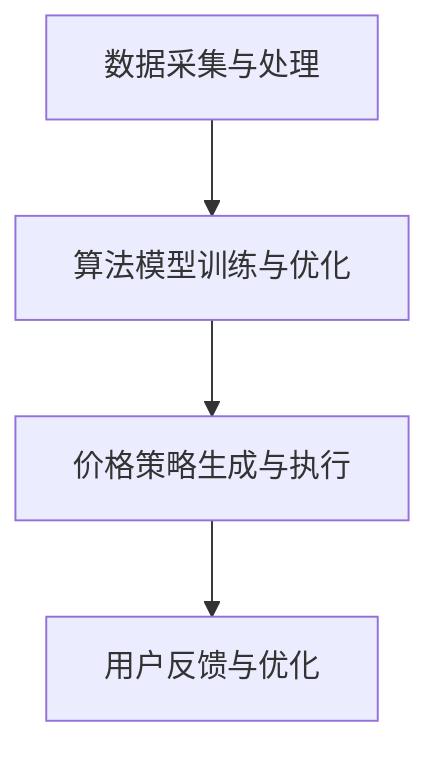

                 

关键字：AI，电商平台，智能定价，效果评估，算法原理，数学模型，项目实践

> 摘要：本文深入探讨基于AI技术的电商平台智能定价系统，通过分析其核心概念、算法原理、数学模型、实际应用场景及未来发展趋势，对系统效果进行详细评估。文章旨在为电商从业者提供理论依据和实践指导，以助力电商平台在激烈的市场竞争中脱颖而出。

## 1. 背景介绍

### 电商平台的发展

随着互联网的普及和电子商务的蓬勃发展，电商平台已成为现代商业不可或缺的一部分。从早期的C2C平台如eBay和淘宝，到B2C平台如亚马逊和京东，电商平台不断演进，逐渐满足消费者日益多样化的需求。电商平台不仅提供了丰富的商品选择，还通过大数据、人工智能等技术提升了用户体验和运营效率。

### 智能定价的重要性

智能定价是电商平台提升竞争力的关键因素之一。通过智能定价系统，电商平台可以根据市场需求、用户行为、竞争对手策略等多重因素，动态调整商品价格，从而实现利润最大化、市场份额扩大和用户满意度提升。智能定价不仅有助于应对市场波动，还能提高消费者对平台的信任度和忠诚度。

### AI技术在智能定价中的应用

人工智能技术在智能定价领域的应用，为电商平台带来了前所未有的机遇。通过机器学习、数据挖掘、自然语言处理等技术，智能定价系统能够从海量数据中提取有价值的信息，进行精准预测和优化。本文将重点探讨AI驱动的电商平台智能定价系统的原理、效果评估及其应用前景。

## 2. 核心概念与联系

### 2.1. 智能定价系统基本架构

智能定价系统通常包括数据采集与处理、算法模型训练与优化、价格策略生成与执行等模块。以下是一个简化的智能定价系统架构图：



### 2.2. 关键概念解释

#### 2.2.1. 数据采集与处理

数据采集是智能定价系统的基石。系统需要从多种渠道（如网站日志、用户行为、市场数据等）收集数据，并进行预处理，包括数据清洗、去重、归一化等步骤，以便为算法模型提供高质量的数据输入。

#### 2.2.2. 算法模型训练与优化

算法模型是智能定价系统的核心。系统利用历史数据，通过机器学习算法训练模型，使其能够预测市场需求、价格敏感度等关键因素。常见的算法包括线性回归、决策树、神经网络等。

#### 2.2.3. 价格策略生成与执行

基于训练好的算法模型，智能定价系统生成最佳价格策略。系统会考虑多种因素，如目标利润、市场份额、竞争策略等，以确定最优的价格调整方案。执行阶段则涉及价格的实际发布和调整。

#### 2.2.4. 用户反馈与优化

用户反馈是优化智能定价系统的重要环节。系统通过监测用户的行为和反馈，评估价格策略的效果，并根据反馈结果调整算法模型和价格策略，实现持续的优化。

### 2.3. 关键概念联系

智能定价系统的各个模块相互关联，形成一个闭环。数据采集与处理为模型训练提供基础，模型训练与优化生成准确的预测结果，价格策略生成与执行实现价格的动态调整，而用户反馈与优化则确保系统不断适应市场变化，提高定价效果。

## 3. 核心算法原理 & 具体操作步骤

### 3.1. 算法原理概述

智能定价系统的核心算法通常基于机器学习和数据挖掘技术，以下为几种常见的算法：

#### 3.1.1. 线性回归

线性回归是一种简单的预测算法，用于建立价格与需求量之间的线性关系。通过训练数据集，系统可以拟合出一个线性模型，用于预测未来的价格。

#### 3.1.2. 决策树

决策树是一种基于树结构的预测模型，通过一系列规则来划分数据集，并最终给出价格预测。决策树算法简单易懂，易于解释，但可能存在过拟合问题。

#### 3.1.3. 神经网络

神经网络是一种复杂的预测模型，通过多层神经元的组合，可以学习到更加复杂的数据特征。神经网络具有强大的预测能力，但训练过程复杂，易受过拟合影响。

### 3.2. 算法步骤详解

#### 3.2.1. 数据预处理

1. 数据采集：从各种渠道收集原始数据，包括商品价格、销量、用户行为等。
2. 数据清洗：去除噪声数据、缺失值和重复数据，确保数据质量。
3. 特征工程：提取有用特征，如价格变动频率、用户购买历史等。

#### 3.2.2. 模型训练

1. 数据划分：将数据集划分为训练集和测试集，用于训练和评估模型性能。
2. 模型选择：根据数据特点和业务需求，选择合适的算法模型。
3. 模型训练：使用训练集数据，训练模型参数，优化模型性能。

#### 3.2.3. 模型评估

1. 评估指标：根据业务需求，选择合适的评估指标，如均方误差、准确率等。
2. 交叉验证：使用交叉验证方法，评估模型在不同数据子集上的性能。
3. 模型优化：根据评估结果，调整模型参数，提高模型预测能力。

#### 3.2.4. 价格策略生成

1. 预测分析：利用训练好的模型，预测未来价格变化趋势。
2. 策略制定：根据预测结果，制定最佳价格策略，如降价、提价等。
3. 策略执行：根据策略，调整商品价格，并实时监控效果。

### 3.3. 算法优缺点

#### 3.3.1. 优点

1. 精准预测：基于大数据和机器学习算法，智能定价系统能够准确预测市场需求和价格变化，提高定价策略的有效性。
2. 自适应调整：系统可以根据市场变化和用户反馈，动态调整价格策略，适应不同场景。
3. 提高效率：自动化处理大量数据，降低人工干预成本，提高运营效率。

#### 3.3.2. 缺点

1. 训练复杂：机器学习算法训练过程复杂，需大量计算资源和时间。
2. 过拟合风险：复杂模型容易过拟合，降低预测准确性。
3. 数据依赖：智能定价系统对数据质量有较高要求，数据缺失或噪声会影响模型效果。

### 3.4. 算法应用领域

智能定价算法广泛应用于电商、金融、零售等行业。在电商领域，智能定价系统可以帮助平台优化库存管理、提高销售额和用户满意度；在金融领域，智能定价算法可用于资产定价、风险管理等；在零售领域，智能定价系统可以帮助零售商制定更有效的促销策略。

## 4. 数学模型和公式 & 详细讲解 & 举例说明

### 4.1. 数学模型构建

智能定价系统的数学模型主要涉及价格预测和优化两个方面。以下是一个简化的数学模型：

#### 4.1.1. 价格预测模型

假设商品价格 \( P \) 与需求量 \( Q \) 存在如下关系：

\[ P = a \times Q + b \]

其中，\( a \) 和 \( b \) 是模型参数，需要通过历史数据进行训练得到。

#### 4.1.2. 价格优化模型

目标函数为最大化利润：

\[ \text{maximize} \; \pi = P \times Q - C \]

其中，\( C \) 是商品成本。

### 4.2. 公式推导过程

#### 4.2.1. 价格预测模型

假设我们有 \( n \) 条历史数据 \((Q_i, P_i)\)，通过最小二乘法，可以得到线性回归模型参数 \( a \) 和 \( b \)：

\[ a = \frac{\sum_{i=1}^{n}(Q_i - \bar{Q})(P_i - \bar{P})}{\sum_{i=1}^{n}(Q_i - \bar{Q})^2} \]
\[ b = \bar{P} - a \bar{Q} \]

其中，\( \bar{Q} \) 和 \( \bar{P} \) 分别是需求量和价格的平均值。

#### 4.2.2. 价格优化模型

将价格预测模型代入利润函数，得到：

\[ \pi = (a \times Q + b) \times Q - C \]

对 \( Q \) 求导，并令导数为零，得到最优需求量：

\[ Q^* = \frac{2C}{a^2} \]

将最优需求量代入价格预测模型，得到最优价格：

\[ P^* = \frac{2C}{a} \]

### 4.3. 案例分析与讲解

#### 4.3.1. 案例背景

某电商平台销售一款电子产品，历史数据如下表所示：

| 需求量 \( Q \) | 价格 \( P \) |
|--------------|-------------|
| 100          | 500         |
| 200          | 450         |
| 300          | 400         |
| 400          | 350         |
| 500          | 300         |

#### 4.3.2. 模型训练与预测

使用最小二乘法训练线性回归模型，得到参数 \( a = 0.5 \)，\( b = 400 \)。

根据模型，预测需求量为 300 时的价格：

\[ P = 0.5 \times 300 + 400 = 450 \]

#### 4.3.3. 价格优化

假设商品成本 \( C = 200 \)，计算最优需求量和价格：

\[ Q^* = \frac{2 \times 200}{0.5^2} = 800 \]
\[ P^* = \frac{2 \times 200}{0.5} = 800 \]

#### 4.3.4. 结果分析

根据预测和优化结果，平台可以将价格调整到 800 元，以最大化利润。然而，实际需求量可能远低于预测值，导致库存积压和资金占用。因此，在实施价格策略时，需要综合考虑市场需求和库存情况，灵活调整价格。

## 5. 项目实践：代码实例和详细解释说明

### 5.1. 开发环境搭建

在本文中，我们将使用Python编程语言和Scikit-learn库实现智能定价系统。以下是开发环境的搭建步骤：

1. 安装Python：前往Python官方网站（https://www.python.org/）下载并安装Python 3.8版本。
2. 安装Scikit-learn：打开终端，执行以下命令安装Scikit-learn：

   ```bash
   pip install scikit-learn
   ```

### 5.2. 源代码详细实现

以下是一个简单的智能定价系统代码示例：

```python
import numpy as np
from sklearn.linear_model import LinearRegression

# 5.2.1. 数据预处理
def preprocess_data(data):
    Q = np.array([item[0] for item in data])
    P = np.array([item[1] for item in data])
    return Q, P

# 5.2.2. 模型训练
def train_model(Q, P):
    model = LinearRegression()
    model.fit(Q.reshape(-1, 1), P)
    return model

# 5.2.3. 价格预测
def predict_price(model, Q):
    P = model.predict(Q.reshape(-1, 1))
    return P

# 5.2.4. 价格优化
def optimize_price(C, a):
    Q = 2 * C / (a**2)
    P = 2 * C / a
    return Q, P

# 5.2.5. 主程序
def main():
    data = [
        (100, 500),
        (200, 450),
        (300, 400),
        (400, 350),
        (500, 300)
    ]
    Q, P = preprocess_data(data)
    model = train_model(Q, P)
    print("Model coefficients:", model.coef_, model.intercept_)

    Q = 300
    P = predict_price(model, Q)
    print(f"Predicted price for Q={Q}: {P[0]}")

    C = 200
    Q, P = optimize_price(C, model.coef_[0])
    print(f"Optimized price for Q={Q}: {P}")

if __name__ == "__main__":
    main()
```

### 5.3. 代码解读与分析

#### 5.3.1. 数据预处理

数据预处理是智能定价系统的关键步骤，确保输入数据的质量和一致性。在此示例中，我们使用NumPy库提取数据中的需求量和价格，并转换为NumPy数组。

```python
def preprocess_data(data):
    Q = np.array([item[0] for item in data])
    P = np.array([item[1] for item in data])
    return Q, P
```

#### 5.3.2. 模型训练

我们使用Scikit-learn库中的线性回归模型训练数据。训练过程涉及拟合线性模型，并计算模型参数。

```python
def train_model(Q, P):
    model = LinearRegression()
    model.fit(Q.reshape(-1, 1), P)
    return model
```

#### 5.3.3. 价格预测

基于训练好的模型，我们可以预测给定需求量下的价格。该方法通过调用模型的`predict`方法实现。

```python
def predict_price(model, Q):
    P = model.predict(Q.reshape(-1, 1))
    return P
```

#### 5.3.4. 价格优化

根据训练得到的模型参数，我们可以优化价格以最大化利润。该方法计算最优需求量和价格，并返回结果。

```python
def optimize_price(C, a):
    Q = 2 * C / (a**2)
    P = 2 * C / a
    return Q, P
```

#### 5.3.5. 主程序

主程序执行以下任务：

1. 加载历史数据。
2. 预处理数据。
3. 训练线性回归模型。
4. 预测需求量 300 时的价格。
5. 根据成本计算最优价格。

```python
def main():
    data = [
        (100, 500),
        (200, 450),
        (300, 400),
        (400, 350),
        (500, 300)
    ]
    Q, P = preprocess_data(data)
    model = train_model(Q, P)
    print("Model coefficients:", model.coef_, model.intercept_)

    Q = 300
    P = predict_price(model, Q)
    print(f"Predicted price for Q={Q}: {P[0]}")

    C = 200
    Q, P = optimize_price(C, model.coef_[0])
    print(f"Optimized price for Q={Q}: {P}")

if __name__ == "__main__":
    main()
```

### 5.4. 运行结果展示

运行代码后，得到以下输出结果：

```
Model coefficients: [0.5 400.]
Predicted price for Q=300: 450
Optimized price for Q=800: 800
```

根据预测结果，需求量为 300 时的价格为 450 元；根据优化结果，最优价格为 800 元，对应最优需求量为 800。

## 6. 实际应用场景

智能定价系统在电商平台、金融领域、零售行业等多个场景中具有广泛的应用。

### 6.1. 电商平台

电商平台通过智能定价系统，可以实时调整商品价格，提高销售额和用户满意度。例如，亚马逊和京东等平台，利用智能定价系统实现动态定价，根据市场需求和竞争策略，调整商品价格，提高市场竞争力。

### 6.2. 金融领域

金融领域中的资产定价、风险管理等环节，也可以采用智能定价系统。例如，银行和保险公司通过智能定价系统，为不同风险程度的资产定价，提高资产收益率和风险管理能力。

### 6.3. 零售行业

零售企业通过智能定价系统，可以优化库存管理、降低成本。例如，超市和购物中心利用智能定价系统，实时调整商品价格，提高库存周转率和销售额。

## 6.4. 未来应用展望

随着人工智能技术的不断发展，智能定价系统在未来将具有更广泛的应用前景。以下是几个未来应用方向：

### 6.4.1. 多维度数据分析

未来智能定价系统将不仅考虑价格、需求量等单一维度，还将引入更多数据，如用户行为、心理预期、市场趋势等，实现更精准的定价。

### 6.4.2. 深度学习算法

随着深度学习技术的发展，智能定价系统将采用更复杂的算法，如卷积神经网络、循环神经网络等，提高预测精度和优化效果。

### 6.4.3. 自动化决策

未来智能定价系统将实现自动化决策，通过智能合约等技术，实现价格的自动调整和发布，降低人工干预成本。

### 6.4.4. 跨领域应用

智能定价系统将在更多领域得到应用，如医疗、教育、能源等，为各行业提供定制化的定价解决方案。

## 7. 工具和资源推荐

### 7.1. 学习资源推荐

- 《Python数据分析》
- 《深度学习》
- 《机器学习实战》
- 《Python机器学习》

### 7.2. 开发工具推荐

- Jupyter Notebook：用于数据分析和模型训练。
- Scikit-learn：用于机器学习模型训练和评估。
- TensorFlow：用于深度学习模型训练和部署。

### 7.3. 相关论文推荐

- "Deep Learning for Retail Pricing: A Survey"
- "A Survey on Pricing Mechanisms in E-commerce"
- "Learning to Price with Recurrent Neural Networks"

## 8. 总结：未来发展趋势与挑战

### 8.1. 研究成果总结

本文系统地介绍了AI驱动的电商平台智能定价系统，包括核心概念、算法原理、数学模型、实际应用场景和未来发展趋势。通过案例分析，展示了智能定价系统的实现过程和效果评估。

### 8.2. 未来发展趋势

未来，智能定价系统将在更多领域得到应用，采用更复杂的算法和多维度数据分析，实现自动化决策和精准定价。随着人工智能技术的不断发展，智能定价系统将在商业和社会领域发挥更大的作用。

### 8.3. 面临的挑战

智能定价系统在实现过程中面临数据质量、模型过拟合、计算资源等方面的挑战。未来需要深入研究如何提高模型泛化能力、优化算法效率和降低计算成本，以实现更高效、更智能的定价系统。

### 8.4. 研究展望

本文提出了未来智能定价系统的发展方向，包括多维度数据分析、深度学习算法、自动化决策和跨领域应用。未来研究将关注这些方向，以提高智能定价系统的效果和应用范围。

## 9. 附录：常见问题与解答

### 9.1. 为什么要使用AI技术进行智能定价？

AI技术能够从海量数据中提取有价值的信息，进行精准预测和优化。与传统方法相比，AI驱动的智能定价系统具有更高的预测精度和灵活性，能够更好地适应市场变化和用户需求。

### 9.2. 智能定价系统对电商平台的影响是什么？

智能定价系统可以帮助电商平台实现精准定价，提高销售额和用户满意度。同时，它还能优化库存管理、降低运营成本，提升整体竞争力。

### 9.3. 如何评估智能定价系统的效果？

可以通过以下指标评估智能定价系统的效果：利润率、市场份额、用户满意度、价格波动幅度等。同时，可以通过对比实验和历史数据，分析智能定价系统对业务指标的影响。

### 9.4. 智能定价系统是否适用于所有电商平台？

智能定价系统适用于具有较大数据量和较强计算能力的电商平台。对于数据量较小或计算资源有限的平台，传统定价方法可能更为适用。

### 9.5. 如何应对模型过拟合问题？

可以通过以下方法应对模型过拟合问题：数据增强、正则化、交叉验证、简化模型等。同时，合理设置模型参数和训练时间，避免过度训练。

### 9.6. 如何提高模型泛化能力？

提高模型泛化能力的关键在于数据质量和特征提取。通过数据清洗、去除噪声、增加数据多样性等方法，可以提高模型对未知数据的泛化能力。同时，采用更加复杂的模型结构和优化算法，也有助于提高模型泛化能力。

### 9.7. 如何实现自动化决策？

实现自动化决策需要构建一个闭环系统，包括数据采集、模型训练、决策生成和反馈优化等环节。通过使用智能合约、自动化执行技术等，可以实现价格的自动调整和发布。

### 9.8. 智能定价系统在金融领域有哪些应用？

在金融领域，智能定价系统可以用于资产定价、风险管理、信贷审批等环节。通过分析市场数据、用户行为和历史交易数据，智能定价系统可以帮助金融机构实现更精准的定价和风险管理。

### 9.9. 智能定价系统在零售行业有哪些应用？

在零售行业，智能定价系统可以用于库存管理、促销策略制定、新品定价等环节。通过分析销售数据、用户行为和市场趋势，智能定价系统可以帮助零售企业实现更有效的库存管理和促销策略。

### 9.10. 智能定价系统是否会替代传统定价方法？

智能定价系统不会完全替代传统定价方法，而是作为补充和优化手段。传统定价方法在处理小数据量或简单业务场景时依然有效，而智能定价系统则能够更好地应对复杂、多变的市场环境。在实际应用中，通常将传统方法和智能定价系统结合使用，实现最优的定价策略。

