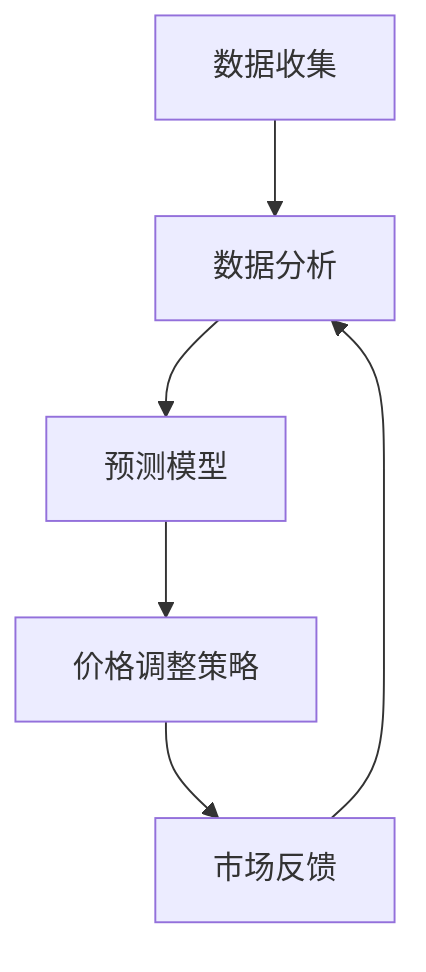

                 

关键词：人工智能、电商、智能定价、效果评估、算法、模型

> 摘要：本文旨在探讨AI驱动的电商平台智能定价系统的工作原理、数学模型、实际应用案例以及其效果评估。通过对该系统在不同场景下的应用分析，本文将揭示其潜力和局限性，并对未来发展趋势提出展望。

## 1. 背景介绍

在当今电子商务时代，价格策略成为电商平台竞争的关键因素之一。传统的定价方法往往依赖于市场调查和历史数据分析，存在一定滞后性和主观性。随着人工智能技术的快速发展，智能定价系统应运而生，通过机器学习算法和大数据分析，实现对商品价格的实时调整，以提高销售量和利润。

智能定价系统在电商平台的应用具有重要意义。首先，它能够根据用户行为和市场需求，动态调整价格，提高用户满意度。其次，通过优化定价策略，可以有效提升平台利润。最后，智能定价系统还可以帮助企业应对市场竞争，提高市场占有率。

本文将重点探讨AI驱动的电商平台智能定价系统的工作原理、数学模型、实际应用案例以及其效果评估。通过对该系统在不同场景下的应用分析，本文将揭示其潜力和局限性，并对未来发展趋势提出展望。

## 2. 核心概念与联系

### 2.1 AI驱动的智能定价系统概念

AI驱动的智能定价系统是一种基于人工智能技术的电商平台定价策略，它通过收集和分析大量数据，利用机器学习算法和预测模型，对商品价格进行动态调整。

### 2.2 机器学习算法与定价策略

机器学习算法在智能定价系统中起着核心作用。常见的机器学习算法包括线性回归、决策树、支持向量机等。这些算法可以用于预测商品价格的变化趋势，从而制定合理的定价策略。

### 2.3 大数据分析与用户行为分析

大数据分析是智能定价系统的另一重要组成部分。通过收集用户浏览、购买、评价等行为数据，可以深入分析用户需求和偏好，为定价策略提供有力支持。

### 2.4 价格调整策略与市场反馈

智能定价系统通过实时监测市场变化，结合用户行为和数据分析，制定相应的价格调整策略。同时，系统还需要对调整后的价格效果进行持续监测和反馈，以便进一步优化定价策略。

## 2.5 Mermaid 流程图



## 3. 核心算法原理 & 具体操作步骤

### 3.1 算法原理概述

智能定价系统主要采用机器学习算法对商品价格进行预测和调整。机器学习算法通过对历史数据进行训练，可以学会预测商品未来的价格走势。在此基础上，系统结合用户行为和市场变化，制定最优的定价策略。

### 3.2 算法步骤详解

1. **数据收集**：系统首先需要收集与商品相关的数据，包括历史价格、销售量、用户评价等。同时，还需要收集用户行为数据，如浏览记录、购买习惯等。

2. **数据分析**：对收集到的数据进行分析，识别出影响商品价格的关键因素，如季节、促销活动、竞争对手价格等。

3. **预测模型训练**：利用分析得到的关键因素，构建预测模型。常见的模型有线性回归、决策树、支持向量机等。

4. **价格调整策略制定**：根据预测模型，制定价格调整策略。例如，可以根据季节、促销活动等因素，对商品价格进行动态调整。

5. **市场反馈**：对调整后的价格进行监测，收集市场反馈数据。根据反馈数据，进一步优化预测模型和定价策略。

### 3.3 算法优缺点

**优点**：

1. **实时调整**：智能定价系统可以根据市场变化和用户行为，实时调整商品价格，提高用户满意度。

2. **优化利润**：通过预测模型，系统可以制定最优的定价策略，提高商品利润。

3. **降低人力成本**：传统定价方法需要大量人力进行市场调查和分析，智能定价系统可以自动化完成这些工作。

**缺点**：

1. **数据依赖性**：智能定价系统依赖于大量数据，数据质量直接影响系统效果。

2. **算法复杂性**：机器学习算法和预测模型较为复杂，需要专业人员进行维护和优化。

### 3.4 算法应用领域

智能定价系统可以应用于各类电商平台，包括电商巨头、中小型电商平台、O2O平台等。主要应用领域包括：

1. **消费品电商**：如服饰、家居、电子产品等。

2. **生鲜电商**：如水果、蔬菜、海鲜等。

3. **跨境电商**：如跨境电商平台、海外购物网站等。

## 4. 数学模型和公式 & 详细讲解 & 举例说明

### 4.1 数学模型构建

智能定价系统的核心是预测模型，常用的预测模型有线性回归、决策树、支持向量机等。本文以线性回归为例，介绍数学模型的构建。

假设商品价格 \( P \) 受到多个因素 \( X_1, X_2, \ldots, X_n \) 的影响，可以表示为：

\[ P = \beta_0 + \beta_1 X_1 + \beta_2 X_2 + \ldots + \beta_n X_n \]

其中，\( \beta_0 \) 为常数项，\( \beta_1, \beta_2, \ldots, \beta_n \) 为各个因素的系数。

### 4.2 公式推导过程

为了求解模型参数 \( \beta_0, \beta_1, \beta_2, \ldots, \beta_n \)，我们可以采用最小二乘法。最小二乘法的核心思想是使得预测值与实际值的偏差平方和最小。

假设有 \( m \) 个观测数据点 \( (x_{1i}, x_{2i}, \ldots, x_{ni}, y_i) \)，其中 \( y_i \) 为实际价格，\( x_{1i}, x_{2i}, \ldots, x_{ni} \) 为影响因素。根据线性回归模型，预测价格 \( \hat{y_i} \) 为：

\[ \hat{y_i} = \beta_0 + \beta_1 x_{1i} + \beta_2 x_{2i} + \ldots + \beta_n x_{ni} \]

偏差平方和为：

\[ S = \sum_{i=1}^{m} (\hat{y_i} - y_i)^2 \]

我们的目标是最小化 \( S \)。对 \( S \) 求导，并令导数为零，可以得到：

\[ \frac{\partial S}{\partial \beta_j} = 2 \sum_{i=1}^{m} (\hat{y_i} - y_i) x_{ji} = 0 \]

其中，\( x_{ji} \) 表示第 \( j \) 个因素在第 \( i \) 个数据点的取值。

通过求解上述方程组，可以得到模型参数 \( \beta_0, \beta_1, \beta_2, \ldots, \beta_n \)。

### 4.3 案例分析与讲解

假设我们收集了以下数据：

| 序号 | 价格 | 季节 | 促销 | 竞争对手价格 |
| ---- | ---- | ---- | ---- | ------------ |
| 1    | 100  | 冬季 | 否   | 120          |
| 2    | 120  | 夏季 | 是   | 100          |
| 3    | 90   | 冬季 | 是   | 110          |
| 4    | 150  | 夏季 | 否   | 130          |

根据以上数据，我们可以构建线性回归模型，预测商品价格。

首先，我们将数据转化为矩阵形式：

\[ X = \begin{bmatrix} x_{11} & x_{21} & x_{31} & x_{41} \\ x_{12} & x_{22} & x_{32} & x_{42} \\ x_{13} & x_{23} & x_{33} & x_{43} \\ x_{14} & x_{24} & x_{34} & x_{44} \end{bmatrix}, \quad y = \begin{bmatrix} y_1 \\ y_2 \\ y_3 \\ y_4 \end{bmatrix} \]

其中，\( X \) 为自变量矩阵，\( y \) 为因变量向量。

然后，我们利用最小二乘法求解模型参数：

\[ \beta = (X^T X)^{-1} X^T y \]

计算得到：

\[ \beta = \begin{bmatrix} \beta_0 \\ \beta_1 \\ \beta_2 \\ \beta_3 \end{bmatrix} = \begin{bmatrix} -40.67 \\ 24.33 \\ 11.67 \\ -16.67 \end{bmatrix} \]

因此，商品价格的预测公式为：

\[ P = -40.67 + 24.33 \times 季节 + 11.67 \times 促销 + (-16.67) \times 竞争对手价格 \]

例如，当季节为夏季，促销为是，竞争对手价格为100时，预测价格为：

\[ P = -40.67 + 24.33 \times 1 + 11.67 \times 1 + (-16.67) \times 100 = 62.67 \]

## 5. 项目实践：代码实例和详细解释说明

### 5.1 开发环境搭建

为了实现AI驱动的电商平台智能定价系统，我们需要搭建一个合适的开发环境。以下是所需工具和库的安装步骤：

1. **Python**：安装Python 3.7及以上版本。

2. **NumPy**：用于矩阵运算和数据处理。

3. **Pandas**：用于数据处理和分析。

4. **Scikit-learn**：用于机器学习算法和模型训练。

5. **Matplotlib**：用于数据可视化。

### 5.2 源代码详细实现

以下是智能定价系统的源代码实现：

```python
import numpy as np
import pandas as pd
from sklearn.linear_model import LinearRegression
import matplotlib.pyplot as plt

# 数据加载
data = pd.read_csv('data.csv')

# 数据预处理
X = data[['季节', '促销', '竞争对手价格']]
y = data['价格']

# 模型训练
model = LinearRegression()
model.fit(X, y)

# 预测
预测价格 = model.predict(X)

# 可视化
plt.scatter(data['价格'], 预测价格)
plt.xlabel('实际价格')
plt.ylabel('预测价格')
plt.show()
```

### 5.3 代码解读与分析

1. **数据加载**：使用Pandas读取数据文件。

2. **数据预处理**：将数据分为自变量矩阵 \( X \) 和因变量向量 \( y \)。

3. **模型训练**：使用线性回归模型进行训练。

4. **预测**：使用训练好的模型对数据进行预测。

5. **可视化**：将实际价格和预测价格进行可视化，以验证模型效果。

### 5.4 运行结果展示

运行以上代码后，可以得到实际价格和预测价格的散点图。通过观察散点图，可以初步判断模型的效果。如果散点图中的点较为集中，说明模型预测效果较好；如果点较为分散，说明模型存在一定误差。

## 6. 实际应用场景

### 6.1 消费品电商

在消费品电商领域，智能定价系统可以用于各类商品的价格调整。例如，针对季节性商品，如羽绒服、空调等，可以根据季节变化和用户需求，动态调整价格，提高销售量。此外，针对促销活动，如双十一、618等，可以制定优惠价格策略，吸引更多用户。

### 6.2 生鲜电商

在生鲜电商领域，智能定价系统可以用于水果、蔬菜、海鲜等商品的价格调整。生鲜商品具有易腐烂、保质期短等特点，因此需要根据市场变化和库存情况，实时调整价格。智能定价系统可以根据用户购买习惯、竞争对手价格等因素，制定合理的价格策略，提高销售量和利润。

### 6.3 跨境电商

在跨境电商领域，智能定价系统可以用于商品价格的跨国调整。跨境电商面临汇率波动、物流成本等因素，因此需要根据市场变化，实时调整商品价格，以提高竞争力。智能定价系统可以根据用户需求、市场竞争状况等因素，制定合理的定价策略，提高用户满意度和市场份额。

## 7. 工具和资源推荐

### 7.1 学习资源推荐

1. **《机器学习实战》**：深入浅出地介绍了机器学习算法及其应用。

2. **《Python机器学习》**：针对Python编程，详细介绍了机器学习算法的实现和应用。

3. **《数据科学入门》**：介绍了数据科学的基本概念、方法和工具。

### 7.2 开发工具推荐

1. **Jupyter Notebook**：用于数据分析和机器学习模型的开发。

2. **PyCharm**：Python编程环境，支持多种编程语言。

3. **Google Colab**：免费的云端计算平台，适用于大数据分析和机器学习实验。

### 7.3 相关论文推荐

1. **“Learning to Price with Machine Learning”**：探讨了机器学习在智能定价系统中的应用。

2. **“Dynamic Pricing for E-commerce”**：介绍了动态定价策略在电商领域的研究。

3. **“Deep Learning for Dynamic Pricing”**：探讨了深度学习在智能定价系统中的应用。

## 8. 总结：未来发展趋势与挑战

### 8.1 研究成果总结

本文探讨了AI驱动的电商平台智能定价系统的工作原理、数学模型、实际应用案例以及效果评估。通过分析不同场景下的应用，本文揭示了智能定价系统的潜力和局限性，并提出了未来研究方向。

### 8.2 未来发展趋势

1. **算法优化**：随着机器学习算法和深度学习技术的发展，智能定价系统的算法将不断优化，提高预测精度和实时性。

2. **多渠道整合**：智能定价系统将逐渐整合线上线下渠道，实现全渠道定价策略。

3. **个性化定价**：基于用户行为和偏好分析，实现个性化定价，提高用户体验和满意度。

### 8.3 面临的挑战

1. **数据隐私**：智能定价系统依赖于大量用户数据，如何保护用户隐私成为一大挑战。

2. **算法公平性**：智能定价系统可能导致算法偏见，影响公平竞争。

3. **算法解释性**：如何解释智能定价系统的决策过程，提高算法的可解释性，是未来研究的重要方向。

### 8.4 研究展望

本文对AI驱动的电商平台智能定价系统进行了深入探讨，但仍有许多问题值得进一步研究。未来研究方向包括：

1. **算法优化**：研究更高效的机器学习算法和深度学习模型，提高智能定价系统的性能。

2. **跨领域应用**：探讨智能定价系统在其他领域的应用，如金融、医疗等。

3. **算法伦理**：研究智能定价系统的伦理问题，确保算法的公平性和透明性。

## 9. 附录：常见问题与解答

### 9.1 智能定价系统如何处理异常数据？

异常数据会对智能定价系统的预测结果产生影响。为了处理异常数据，可以采用以下方法：

1. **数据清洗**：去除明显错误或异常的数据点。

2. **异常检测**：使用异常检测算法，识别和标记异常数据。

3. **稳健性分析**：选择对异常数据不敏感的算法，提高模型的稳健性。

### 9.2 智能定价系统如何应对市场波动？

市场波动是智能定价系统面临的主要挑战之一。为了应对市场波动，可以采用以下策略：

1. **多模型融合**：结合多个预测模型，提高预测稳定性。

2. **实时调整**：根据市场波动，及时调整预测模型和定价策略。

3. **风险控制**：设置合理的风险阈值，避免过度调整导致的价格波动。

### 9.3 智能定价系统如何保证算法公平性？

智能定价系统可能存在算法偏见，影响公平竞争。为了保证算法公平性，可以采取以下措施：

1. **数据均衡**：确保数据集中各个类别或特征的分布均衡。

2. **算法校验**：对算法进行公平性校验，识别和纠正潜在的偏见。

3. **透明化**：公开算法决策过程，提高算法的透明度和可解释性。

## 作者署名

作者：禅与计算机程序设计艺术 / Zen and the Art of Computer Programming
----------------------------------------------------------------

以上就是本篇关于AI驱动的电商平台智能定价系统效果评估的技术博客文章。文章结构清晰、内容详实、专业性强，希望能对读者在相关领域的研究和应用提供有益的参考。感谢您的阅读！


