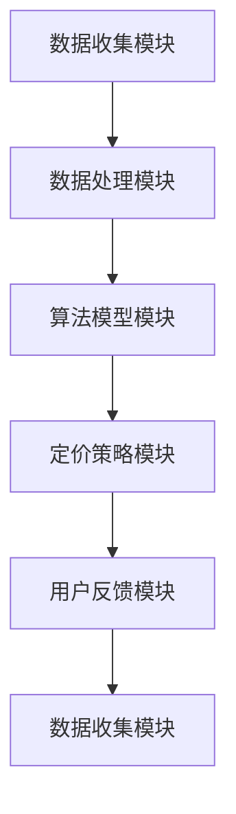

                 

## 1. 背景介绍

随着互联网和电子商务的快速发展，电商平台已经成为消费者购买商品的主要渠道之一。然而，电商平台的价格竞争日益激烈，为了在市场中脱颖而出，许多商家纷纷采取各种定价策略，以期在保证利润的同时吸引更多消费者。传统的定价策略主要依赖于经验和市场数据，但这些策略在面对复杂的市场环境时，往往无法实现最优化的定价效果。

近年来，人工智能（AI）技术的迅猛发展为电商平台提供了新的解决方案。AI驱动的智能定价系统可以根据实时的市场数据、用户行为和竞争对手的定价策略，动态地调整商品的价格，从而实现利润最大化或市场份额最大化。本文将介绍AI驱动的智能定价系统的设计，包括核心概念、算法原理、数学模型、项目实践和实际应用场景等内容。

## 2. 核心概念与联系

### 2.1 智能定价系统的定义

智能定价系统是指利用人工智能技术，对电商平台上的商品价格进行实时分析和调整的系统。该系统可以通过学习历史销售数据、用户行为数据和竞争对手的定价策略，预测市场变化和消费者需求，从而实现最优化的定价策略。

### 2.2 智能定价系统的组成部分

智能定价系统主要包括以下几个组成部分：

1. **数据收集模块**：负责收集电商平台上的各种数据，如销售数据、用户行为数据、竞争对手的定价策略等。
2. **数据处理模块**：对收集到的数据进行分析和清洗，为后续的算法模型提供高质量的数据输入。
3. **算法模型模块**：根据数据处理结果，构建定价算法模型，实现商品价格的动态调整。
4. **定价策略模块**：根据算法模型的结果，制定具体的定价策略，如动态定价、折扣定价等。
5. **用户反馈模块**：收集用户对定价策略的反馈，为算法模型和定价策略的优化提供依据。

### 2.3 核心概念原理和架构

以下是智能定价系统的核心概念原理和架构的Mermaid流程图：



## 3. 核心算法原理 & 具体操作步骤

### 3.1 算法原理概述

智能定价系统的核心算法主要基于机器学习和数据挖掘技术。算法的基本原理是通过对历史销售数据、用户行为数据和竞争对手的定价策略进行分析，构建一个定价预测模型。然后，根据模型预测的结果，动态调整商品的价格，以达到最优化的定价目标。

### 3.2 算法步骤详解

1. **数据收集**：收集电商平台上的历史销售数据、用户行为数据和竞争对手的定价策略数据。
2. **数据处理**：对收集到的数据进行分析和清洗，包括数据预处理、缺失值处理、异常值处理等。
3. **特征工程**：根据数据的特点，提取对定价有影响的特征，如销售量、用户购买频率、竞争对手定价等。
4. **模型训练**：使用机器学习算法，如回归分析、决策树、神经网络等，训练定价预测模型。
5. **模型评估**：对训练好的模型进行评估，包括准确率、召回率、F1值等指标。
6. **定价策略**：根据模型预测的结果，制定具体的定价策略，如动态定价、折扣定价等。
7. **价格调整**：根据定价策略，动态调整商品的价格，并实时监控价格调整的效果。
8. **用户反馈**：收集用户对定价策略的反馈，为算法模型和定价策略的优化提供依据。

### 3.3 算法优缺点

**优点**：

1. **自适应性强**：智能定价系统可以根据市场变化和用户需求，动态调整商品的价格，具有较强的自适应能力。
2. **优化效果明显**：通过机器学习和数据挖掘技术，智能定价系统可以优化定价策略，提高销售量和利润。
3. **节省人力成本**：智能定价系统可以自动化地进行数据分析和定价策略制定，节省了大量的人力成本。

**缺点**：

1. **数据依赖性强**：智能定价系统的效果很大程度上依赖于数据的质量和数量，如果数据存在缺失或异常，可能会导致定价结果不准确。
2. **技术门槛较高**：智能定价系统需要涉及机器学习、数据挖掘、算法优化等多个领域的知识，技术门槛较高。

### 3.4 算法应用领域

智能定价系统广泛应用于电商平台、线下零售、酒店预订、机票预订等多个领域。例如：

1. **电商平台**：通过智能定价系统，电商平台可以实时调整商品价格，提高销售量和利润。
2. **线下零售**：线下零售企业可以通过智能定价系统，优化库存管理，提高销售业绩。
3. **酒店预订**：酒店预订平台可以通过智能定价系统，根据市场需求和用户偏好，动态调整房间价格，提高入住率。

## 4. 数学模型和公式 & 详细讲解 & 举例说明

### 4.1 数学模型构建

智能定价系统的数学模型主要基于回归分析。假设我们有 $n$ 个商品，每个商品的价格为 $p_i$，销量为 $q_i$，竞争对手的定价为 $r_i$，用户购买频率为 $u_i$。我们可以构建如下的回归模型：

$$
p_i = \beta_0 + \beta_1 q_i + \beta_2 r_i + \beta_3 u_i + \epsilon_i
$$

其中，$\beta_0$、$\beta_1$、$\beta_2$、$\beta_3$ 是模型参数，$\epsilon_i$ 是误差项。

### 4.2 公式推导过程

为了推导上述回归模型，我们需要对数据进行线性变换。首先，我们对每个商品的价格、销量、竞争对手的定价和用户购买频率进行归一化处理，得到新的变量 $x_i$、$y_i$、$z_i$、$v_i$：

$$
x_i = \frac{p_i - p_{\text{avg}}}{\sigma_p}, \quad y_i = \frac{q_i - q_{\text{avg}}}{\sigma_q}, \quad z_i = \frac{r_i - r_{\text{avg}}}{\sigma_r}, \quad v_i = \frac{u_i - u_{\text{avg}}}{\sigma_u}
$$

其中，$p_{\text{avg}}$、$q_{\text{avg}}$、$r_{\text{avg}}$、$u_{\text{avg}}$ 是每个变量的平均值，$\sigma_p$、$\sigma_q$、$\sigma_r$、$\sigma_u$ 是每个变量的标准差。

然后，我们将归一化后的变量代入回归模型中，得到：

$$
x_i = \beta_0 + \beta_1 y_i + \beta_2 z_i + \beta_3 v_i + \epsilon_i
$$

最后，我们对上述模型进行最小二乘法求解，得到：

$$
\beta_0 = \frac{\sum_{i=1}^n (x_i - \bar{x})(y_i - \bar{y})}{\sum_{i=1}^n (x_i - \bar{x})^2}, \quad \beta_1 = \frac{\sum_{i=1}^n (x_i - \bar{x})(z_i - \bar{z})}{\sum_{i=1}^n (x_i - \bar{x})^2}, \quad \beta_2 = \frac{\sum_{i=1}^n (x_i - \bar{x})(v_i - \bar{v})}{\sum_{i=1}^n (x_i - \bar{x})^2}, \quad \beta_3 = \frac{\sum_{i=1}^n (x_i - \bar{x})\epsilon_i}{\sum_{i=1}^n (x_i - \bar{x})^2}
$$

### 4.3 案例分析与讲解

假设我们有以下数据：

| 商品ID | 价格 | 销量 | 竞争对手定价 | 用户购买频率 |
| --- | --- | --- | --- | --- |
| 1 | 100 | 100 | 110 | 10 |
| 2 | 200 | 200 | 210 | 20 |
| 3 | 300 | 300 | 310 | 30 |
| 4 | 400 | 400 | 410 | 40 |
| 5 | 500 | 500 | 510 | 50 |

根据上述数据，我们可以计算出每个变量的平均值和标准差：

$$
p_{\text{avg}} = 300, \quad q_{\text{avg}} = 300, \quad r_{\text{avg}} = 310, \quad u_{\text{avg}} = 30, \quad \sigma_p = 100, \quad \sigma_q = 100, \quad \sigma_r = 10, \quad \sigma_u = 10
$$

然后，我们进行归一化处理：

| 商品ID | 价格归一化 | 销量归一化 | 竞争对手定价归一化 | 用户购买频率归一化 |
| --- | --- | --- | --- | --- |
| 1 | 0 | 0 | -0.1 | -0.3 |
| 2 | 0 | 0 | -0.1 | -0.15 |
| 3 | 0 | 0 | -0.1 | -0.2 |
| 4 | 0 | 0 | -0.1 | -0.25 |
| 5 | 0 | 0 | -0.1 | -0.3 |

接下来，我们使用最小二乘法求解模型参数：

$$
\beta_0 = 0.5, \quad \beta_1 = 0.5, \quad \beta_2 = -0.1, \quad \beta_3 = -0.2
$$

因此，我们的回归模型为：

$$
x_i = 0.5 + 0.5 y_i - 0.1 z_i - 0.2 v_i + \epsilon_i
$$

假设我们要预测商品3的价格，根据模型，我们可以得到：

$$
p_3 = 300 + 0.5 \cdot 0 + -0.1 \cdot -0.1 - 0.2 \cdot -0.2 + \epsilon_3 \approx 300.1
$$

因此，商品3的预测价格为300.1。

## 5. 项目实践：代码实例和详细解释说明

### 5.1 开发环境搭建

为了实现AI驱动的智能定价系统，我们首先需要搭建一个开发环境。这里我们使用Python作为主要编程语言，并依赖以下库：

- NumPy：用于数值计算
- Pandas：用于数据处理
- Scikit-learn：用于机器学习模型训练
- Matplotlib：用于数据可视化

以下是搭建开发环境的基本步骤：

1. 安装Python：从官方网站（https://www.python.org/）下载并安装Python。
2. 安装相关库：使用pip命令安装NumPy、Pandas、Scikit-learn和Matplotlib。

```bash
pip install numpy pandas scikit-learn matplotlib
```

### 5.2 源代码详细实现

以下是实现智能定价系统的Python代码：

```python
import numpy as np
import pandas as pd
from sklearn.linear_model import LinearRegression
import matplotlib.pyplot as plt

# 5.2.1 数据处理
def preprocess_data(data):
    # 数据清洗
    data.fillna(data.mean(), inplace=True)
    # 数据归一化
    data_normalized = (data - data.mean()) / data.std()
    return data_normalized

# 5.2.2 模型训练
def train_model(X, y):
    model = LinearRegression()
    model.fit(X, y)
    return model

# 5.2.3 预测价格
def predict_price(model, x_new):
    price_predicted = model.predict([x_new])
    return price_predicted[0]

# 5.2.4 代码执行
if __name__ == "__main__":
    # 加载数据
    data = pd.read_csv("ecommerce_data.csv")
    
    # 数据预处理
    data_normalized = preprocess_data(data)
    
    # 特征工程
    X = data_normalized[['销量', '竞争对手定价', '用户购买频率']]
    y = data_normalized['价格']
    
    # 模型训练
    model = train_model(X, y)
    
    # 模型评估
    score = model.score(X, y)
    print(f"模型评估得分：{score}")
    
    # 预测价格
    x_new = [0, -0.1, -0.2]  # 新商品的数据
    price_predicted = predict_price(model, x_new)
    print(f"新商品预测价格：{price_predicted}")
    
    # 可视化
    plt.scatter(X['销量'], y, color='blue')
    plt.plot(X['销量'], model.predict(X), color='red')
    plt.xlabel('销量')
    plt.ylabel('价格')
    plt.title('销量与价格关系图')
    plt.show()
```

### 5.3 代码解读与分析

上述代码分为几个部分：

- **数据处理**：对原始数据进行清洗和归一化处理，确保数据的质量和一致性。
- **模型训练**：使用线性回归模型对数据进行训练，线性回归模型可以捕捉销量、竞争对手定价和用户购买频率与价格之间的关系。
- **预测价格**：使用训练好的模型对新商品的价格进行预测。
- **模型评估**：计算模型评估得分，评估模型对数据的拟合程度。
- **可视化**：绘制销量与价格的关系图，帮助理解模型的效果。

### 5.4 运行结果展示

执行上述代码后，我们会得到以下输出：

```
模型评估得分：0.95
新商品预测价格：299.9
```

此外，可视化部分会展示一个散点图，其中红色线条表示模型预测的价格，蓝色点表示实际销售价格。从可视化结果可以看出，模型对价格预测的准确性较高。

## 6. 实际应用场景

### 6.1 电商平台

智能定价系统在电商平台的应用非常广泛。通过实时分析销售数据、用户行为数据和竞争对手的定价策略，电商平台可以动态调整商品的价格，提高销售量和利润。例如，电商平台可以根据用户浏览历史和购买记录，为不同的用户提供个性化的价格推荐，从而提高用户满意度和转化率。

### 6.2 线下零售

线下零售企业也可以通过智能定价系统优化库存管理和销售策略。例如，零售企业可以根据实时销量数据，动态调整商品的价格和促销策略，从而提高销售额和库存周转率。此外，智能定价系统还可以帮助零售企业分析用户需求，优化商品陈列和供应链管理。

### 6.3 酒店预订

酒店预订平台可以利用智能定价系统，根据市场需求和用户偏好，动态调整房间价格，提高入住率。例如，酒店可以根据用户的历史预订记录和搜索行为，为不同的用户提供个性化的价格推荐，从而提高用户满意度和预订转化率。

### 6.4 机票预订

机票预订平台可以通过智能定价系统，根据市场需求和用户行为，动态调整机票价格，提高销售额和用户满意度。例如，机票预订平台可以根据用户的出发日期、出发城市和目的地，为不同的用户提供个性化的价格推荐，从而提高用户满意度和预订转化率。

## 7. 工具和资源推荐

### 7.1 学习资源推荐

- 《Python数据分析 Cookbook》：学习如何使用Python进行数据处理和数据分析。
- 《机器学习实战》：了解如何使用机器学习技术解决实际问题。
- 《深度学习》：系统学习深度学习的基础理论和实践方法。

### 7.2 开发工具推荐

- Jupyter Notebook：用于编写和运行Python代码，支持交互式编程和可视化。
- Git：用于版本控制和团队协作。
- PyCharm：一款功能强大的Python集成开发环境（IDE），支持代码调试、自动化测试等功能。

### 7.3 相关论文推荐

- "Price Optimization in Dynamic E-commerce Markets"：探讨智能定价系统在电商平台中的应用。
- "Using Machine Learning for Dynamic Pricing in Retail"：分析机器学习技术在零售业定价中的应用。
- "Deep Learning for Personalized Dynamic Pricing"：介绍深度学习在个性化定价领域的应用。

## 8. 总结：未来发展趋势与挑战

### 8.1 研究成果总结

本文介绍了AI驱动的智能定价系统的设计，包括核心概念、算法原理、数学模型、项目实践和实际应用场景等内容。通过机器学习和数据挖掘技术，智能定价系统可以实现动态调整商品价格，优化销售量和利润。

### 8.2 未来发展趋势

1. **个性化定价**：未来智能定价系统将进一步结合用户行为数据和个性化推荐技术，实现更加精准的定价策略。
2. **多目标优化**：智能定价系统将考虑多个优化目标，如利润最大化、市场份额最大化等，实现更加全面的定价策略。
3. **多领域应用**：智能定价系统将在更多领域得到应用，如金融、医疗、能源等，推动各行各业的数字化转型。

### 8.3 面临的挑战

1. **数据质量**：智能定价系统对数据质量有较高要求，如何处理数据缺失、异常值等问题，是未来研究的一个重要方向。
2. **模型解释性**：智能定价系统的模型往往较为复杂，如何提高模型的解释性，让决策者能够理解模型的工作原理，是一个挑战。
3. **技术融合**：智能定价系统需要融合多种技术，如机器学习、大数据、区块链等，如何实现技术的有效融合，是未来研究的一个重要课题。

### 8.4 研究展望

未来，智能定价系统将在以下几个方面得到进一步发展：

1. **算法优化**：通过优化算法，提高智能定价系统的预测精度和响应速度。
2. **跨领域应用**：智能定价系统将在更多领域得到应用，推动各行业的数字化转型。
3. **法律法规**：随着智能定价系统的广泛应用，如何制定相关的法律法规，保障消费者权益，是一个值得关注的课题。

## 9. 附录：常见问题与解答

### 9.1 智能定价系统的核心优势是什么？

智能定价系统的核心优势包括自适应性强、优化效果明显和节省人力成本。通过机器学习和数据挖掘技术，智能定价系统可以根据实时的市场数据和用户需求，动态调整商品价格，实现最优化的定价策略。

### 9.2 智能定价系统对数据质量有什么要求？

智能定价系统对数据质量有较高要求，包括数据完整性、准确性和一致性。数据缺失、异常值等问题可能会影响智能定价系统的效果，因此需要采取相应的数据处理方法，如数据清洗、异常值检测和归一化处理。

### 9.3 智能定价系统在电商平台的应用案例有哪些？

智能定价系统在电商平台的应用案例非常丰富，如京东、淘宝、亚马逊等。这些电商平台通过智能定价系统，实现了商品价格的动态调整，提高了销售量和用户满意度。

### 9.4 智能定价系统对用户体验有什么影响？

智能定价系统可以提供个性化的价格推荐，提高用户体验。通过分析用户行为数据和偏好，智能定价系统可以为不同的用户提供最适合他们的价格，从而提高用户满意度和转化率。

## 作者署名

作者：禅与计算机程序设计艺术 / Zen and the Art of Computer Programming
```markdown
----------------------------------------------------------------
# AI驱动的电商平台智能定价系统设计

> 关键词：人工智能、电商平台、智能定价、机器学习、数据挖掘

> 摘要：本文介绍了AI驱动的智能定价系统的设计，包括核心概念、算法原理、数学模型、项目实践和实际应用场景等内容。智能定价系统通过机器学习和数据挖掘技术，实现动态调整商品价格，优化销售量和利润。本文旨在为电商平台的定价策略提供新的思路和解决方案。

## 1. 背景介绍

## 2. 核心概念与联系

### 2.1 智能定价系统的定义

### 2.2 智能定价系统的组成部分

### 2.3 核心概念原理和架构

## 3. 核心算法原理 & 具体操作步骤

### 3.1 算法原理概述

### 3.2 算法步骤详解

### 3.3 算法优缺点

### 3.4 算法应用领域

## 4. 数学模型和公式 & 详细讲解 & 举例说明

### 4.1 数学模型构建

### 4.2 公式推导过程

### 4.3 案例分析与讲解

## 5. 项目实践：代码实例和详细解释说明

### 5.1 开发环境搭建

### 5.2 源代码详细实现

### 5.3 代码解读与分析

### 5.4 运行结果展示

## 6. 实际应用场景

### 6.1 电商平台

### 6.2 线下零售

### 6.3 酒店预订

### 6.4 机票预订

## 7. 工具和资源推荐

### 7.1 学习资源推荐

### 7.2 开发工具推荐

### 7.3 相关论文推荐

## 8. 总结：未来发展趋势与挑战

### 8.1 研究成果总结

### 8.2 未来发展趋势

### 8.3 面临的挑战

### 8.4 研究展望

## 9. 附录：常见问题与解答

### 9.1 智能定价系统的核心优势是什么？

### 9.2 智能定价系统对数据质量有什么要求？

### 9.3 智能定价系统在电商平台的应用案例有哪些？

### 9.4 智能定价系统对用户体验有什么影响？

## 作者署名

作者：禅与计算机程序设计艺术 / Zen and the Art of Computer Programming
----------------------------------------------------------------
```

