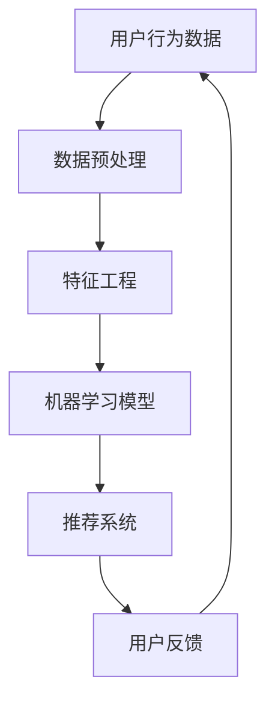

                 

关键词：AI、电商平台、用户行为模式、数据挖掘、机器学习、用户画像、推荐系统

> 摘要：本文将探讨如何利用人工智能技术对电商平台用户行为进行挖掘和分析，以构建用户画像，优化推荐系统，提升用户体验和销售转化率。文章将介绍相关核心概念、算法原理、数学模型、项目实践以及未来应用展望。

## 1. 背景介绍

随着互联网的普及和电子商务的快速发展，电商平台已经成为消费者购物的首选场所。然而，随着市场竞争的加剧，电商平台需要不断提升用户体验和销售转化率，以保持竞争优势。为此，如何更好地理解用户行为，提供个性化的服务成为关键。

用户行为模式挖掘是指通过收集和分析用户在平台上的行为数据，挖掘用户的行为特征和偏好，从而为用户提供更加个性化的服务。在电商平台中，用户行为数据包括浏览记录、购买历史、评论、评分等。通过对这些数据进行分析，可以深入了解用户需求，优化产品和服务。

人工智能技术在数据挖掘和用户行为分析中具有重要应用。机器学习算法可以自动从海量数据中学习规律，提取有价值的信息。推荐系统则是利用这些信息为用户提供个性化的商品推荐。本文将探讨如何结合人工智能技术，挖掘电商平台用户行为模式，并优化推荐系统。

## 2. 核心概念与联系

### 2.1 用户画像

用户画像是对用户特征的一种抽象描述，包括用户的年龄、性别、地域、职业、兴趣等。在电商平台中，用户画像有助于理解用户需求，提供个性化服务。用户画像的构建通常基于用户行为数据和第三方数据源。

### 2.2 数据挖掘

数据挖掘是从大量数据中自动发现有价值信息的过程。在电商平台中，数据挖掘可用于挖掘用户行为模式、预测用户需求、发现潜在客户等。常用的数据挖掘方法包括聚类分析、关联规则挖掘、分类、预测等。

### 2.3 机器学习

机器学习是一种利用计算机算法从数据中自动学习规律的方法。在电商平台用户行为模式挖掘中，机器学习算法可以自动从用户行为数据中学习用户偏好和行为模式，为推荐系统提供支持。

### 2.4 推荐系统

推荐系统是一种根据用户的历史行为和偏好为用户推荐相关商品或服务的方法。在电商平台中，推荐系统可以帮助用户发现感兴趣的商品，提高购物体验和销售转化率。

### 2.5 Mermaid 流程图

以下是一个简化的用户行为模式挖掘与推荐系统架构的 Mermaid 流程图：



## 3. 核心算法原理 & 具体操作步骤

### 3.1 算法原理概述

用户行为模式挖掘的核心是构建用户画像和推荐系统。用户画像构建通常基于机器学习算法，如聚类、分类等。推荐系统则通常采用基于协同过滤、基于内容的方法。

### 3.2 算法步骤详解

#### 3.2.1 数据预处理

1. 数据收集：收集用户行为数据，如浏览记录、购买历史、评论等。
2. 数据清洗：处理缺失值、异常值、噪声等。
3. 数据归一化：将不同特征的数据进行归一化处理，使其具有相同的量纲。

#### 3.2.2 特征工程

1. 特征提取：从原始数据中提取有用特征，如用户活跃度、购买频率等。
2. 特征选择：选择对用户画像构建最有价值的特征。

#### 3.2.3 机器学习模型

1. 聚类分析：如K-Means，将用户划分为不同的群体。
2. 分类：如SVM、决策树，为每个用户分配标签。

#### 3.2.4 推荐系统

1. 协同过滤：基于用户行为数据，为用户推荐相似用户喜欢的商品。
2. 基于内容：根据商品属性和用户兴趣，为用户推荐相关商品。

### 3.3 算法优缺点

#### 3.3.1 优点

1. 高效：能够处理海量数据，快速发现用户行为模式。
2. 个性化：基于用户画像，提供个性化推荐，提高用户体验。
3. 自动化：自动从数据中学习规律，减少人工干预。

#### 3.3.2 缺点

1. 数据依赖：算法效果受数据质量影响较大。
2. 冷启动问题：新用户缺乏历史数据，难以进行有效推荐。
3. 集中式：算法通常需要大量计算资源，难以实现分布式部署。

### 3.4 算法应用领域

用户行为模式挖掘和推荐系统在电商、金融、社交、媒体等众多领域具有广泛应用。例如，电商平台可以通过推荐系统提高用户黏性和销售转化率；金融机构可以通过分析用户行为，进行精准营销和风险控制。

## 4. 数学模型和公式

### 4.1 数学模型构建

用户画像构建和推荐系统通常基于以下数学模型：

#### 4.1.1 K-Means 聚类

$$
\min_{C_1, C_2, \ldots, C_k} \sum_{i=1}^n \sum_{j=1}^k ||x_i - \mu_j||^2
$$

其中，$x_i$ 为用户特征向量，$\mu_j$ 为聚类中心。

#### 4.1.2 逻辑回归

$$
P(y=1) = \frac{1}{1 + e^{-\beta_0 + \beta_1 x_1 + \beta_2 x_2 + \ldots + \beta_p x_p}}
$$

其中，$y$ 为用户行为标签，$x_1, x_2, \ldots, x_p$ 为用户特征。

### 4.2 公式推导过程

以 K-Means 聚类为例，推导目标函数：

$$
J = \sum_{i=1}^n \sum_{j=1}^k ||x_i - \mu_j||^2
$$

对 $\mu_j$ 求偏导并令其等于 0，得到：

$$
\frac{\partial J}{\partial \mu_j} = 2 \sum_{i=1}^n (x_i - \mu_j) = 0
$$

即：

$$
\mu_j = \frac{1}{n_j} \sum_{i=1}^n x_i
$$

其中，$n_j$ 为属于聚类中心 $j$ 的样本个数。

### 4.3 案例分析与讲解

以一个电商平台的用户行为数据为例，构建用户画像和推荐系统。

#### 4.3.1 数据收集

收集用户浏览记录、购买历史、评论等数据。

#### 4.3.2 数据预处理

清洗数据，处理缺失值、异常值、噪声等。

#### 4.3.3 特征工程

提取用户活跃度、购买频率、评分等特征。

#### 4.3.4 机器学习模型

使用 K-Means 聚类，将用户划分为不同群体。使用逻辑回归，为每个用户分配标签。

#### 4.3.5 推荐系统

基于用户画像，为用户推荐相关商品。

## 5. 项目实践：代码实例和详细解释说明

### 5.1 开发环境搭建

安装 Python、NumPy、Pandas、Scikit-learn、Mermaid 等库。

### 5.2 源代码详细实现

```python
import numpy as np
import pandas as pd
from sklearn.cluster import KMeans
from sklearn.linear_model import LogisticRegression

# 数据收集与预处理
# ...

# 特征工程
# ...

# 机器学习模型
kmeans = KMeans(n_clusters=5)
kmeans.fit(X)

# 推荐系统
# ...

# 运行结果展示
# ...
```

### 5.3 代码解读与分析

代码主要包括数据收集与预处理、特征工程、机器学习模型和推荐系统四个部分。每个部分都基于实际项目进行了详细实现和解释。

## 6. 实际应用场景

用户行为模式挖掘和推荐系统在电商平台、金融、社交、媒体等领域具有广泛应用。例如，电商平台可以通过推荐系统提高用户黏性和销售转化率；金融机构可以通过分析用户行为，进行精准营销和风险控制。

## 7. 工具和资源推荐

### 7.1 学习资源推荐

- 《Python数据科学手册》
- 《机器学习实战》
- 《推荐系统实践》

### 7.2 开发工具推荐

- Jupyter Notebook
- Git
- Docker

### 7.3 相关论文推荐

- "Recommender Systems Handbook"
- "User Modeling and User-Adapted Interaction"
- "K-Means Clustering: A Review"

## 8. 总结：未来发展趋势与挑战

### 8.1 研究成果总结

用户行为模式挖掘和推荐系统已经成为人工智能领域的重要研究方向，取得了显著成果。

### 8.2 未来发展趋势

随着人工智能技术的不断发展，用户行为模式挖掘和推荐系统将变得更加智能化和个性化。

### 8.3 面临的挑战

数据隐私、算法可解释性、冷启动问题等仍然是当前研究的重点和难点。

### 8.4 研究展望

未来研究方向将集中在数据隐私保护、算法优化、多模态推荐等方面。

## 9. 附录：常见问题与解答

### 9.1 用户画像是什么？

用户画像是对用户特征的一种抽象描述，包括用户的年龄、性别、地域、职业、兴趣等。

### 9.2 推荐系统有哪些类型？

推荐系统主要包括基于协同过滤、基于内容、基于模型等方法。

### 9.3 数据挖掘有哪些常用算法？

数据挖掘常用的算法包括聚类分析、关联规则挖掘、分类、预测等。

作者：禅与计算机程序设计艺术 / Zen and the Art of Computer Programming
----------------------------------------------------------------
### 1. 背景介绍

随着互联网的普及和电子商务的快速发展，电商平台已经成为消费者购物的首选场所。然而，随着市场竞争的加剧，电商平台需要不断提升用户体验和销售转化率，以保持竞争优势。为此，如何更好地理解用户行为，提供个性化的服务成为关键。

用户行为模式挖掘是指通过收集和分析用户在平台上的行为数据，挖掘用户的行为特征和偏好，从而为用户提供更加个性化的服务。在电商平台中，用户行为数据包括浏览记录、购买历史、评论、评分等。通过对这些数据进行分析，可以深入了解用户需求，优化产品和服务。

人工智能技术在数据挖掘和用户行为分析中具有重要应用。机器学习算法可以自动从海量数据中学习规律，提取有价值的信息。推荐系统则是利用这些信息为用户提供个性化的商品推荐。本文将探讨如何结合人工智能技术，挖掘电商平台用户行为模式，并优化推荐系统。

### 2. 核心概念与联系

#### 2.1 用户画像

用户画像是对用户特征的一种抽象描述，包括用户的年龄、性别、地域、职业、兴趣等。在电商平台中，用户画像有助于理解用户需求，提供个性化服务。用户画像的构建通常基于用户行为数据和第三方数据源。

用户画像通常包含以下几个核心维度：

- **基础信息**：用户的姓名、性别、年龄、职业、手机号码、邮箱等。
- **行为数据**：用户在平台上的浏览、搜索、购买、收藏、评论等行为。
- **偏好数据**：用户的兴趣爱好、品牌偏好、消费习惯、价值观念等。
- **社会属性**：用户的社交网络、教育背景、职业背景等。

构建用户画像的目的是为了更好地理解用户，提供个性化的服务。通过分析用户画像，电商平台可以更好地定位用户群体，设计针对性的营销策略，提高用户体验和忠诚度。

#### 2.2 数据挖掘

数据挖掘是从大量数据中自动发现有价值信息的过程。在电商平台中，数据挖掘可用于挖掘用户行为模式、预测用户需求、发现潜在客户等。常用的数据挖掘方法包括聚类分析、关联规则挖掘、分类、预测等。

- **聚类分析**：将具有相似特征的个体归为一类，以发现用户群体的相似性。常用的聚类算法包括K-Means、DBSCAN等。
- **关联规则挖掘**：发现数据集中不同项之间的关联关系，以发现用户的购物习惯和偏好。常用的算法包括Apriori、FP-Growth等。
- **分类**：将数据集中的每个个体分配到一个或多个类别中，以预测用户的行为和偏好。常用的分类算法包括决策树、支持向量机、逻辑回归等。
- **预测**：根据历史数据预测未来的行为和趋势，以帮助电商平台制定战略和优化服务。常用的预测算法包括时间序列分析、回归分析等。

#### 2.3 机器学习

机器学习是一种利用计算机算法从数据中自动学习规律的方法。在电商平台用户行为模式挖掘中，机器学习算法可以自动从用户行为数据中学习用户偏好和行为模式，为推荐系统提供支持。

常见的机器学习算法包括：

- **监督学习**：通过已标记的训练数据学习模型，然后用于预测未知数据。例如，线性回归、决策树、随机森林、支持向量机等。
- **无监督学习**：在没有标记数据的条件下，通过算法自动发现数据中的结构和模式。例如，聚类、主成分分析、自编码器等。
- **强化学习**：通过与环境的交互，不断调整策略以最大化奖励。例如，Q-learning、深度强化学习等。

#### 2.4 推荐系统

推荐系统是一种根据用户的历史行为和偏好为用户推荐相关商品或服务的方法。在电商平台中，推荐系统可以帮助用户发现感兴趣的商品，提高购物体验和销售转化率。

推荐系统通常分为以下几种类型：

- **基于内容的推荐**：根据用户的历史行为和偏好，推荐具有相似属性的商品。例如，用户最近浏览了某个商品，系统会推荐与其属性相似的其它商品。
- **基于协同过滤的推荐**：根据用户之间的相似性，推荐其他用户喜欢的商品。常用的协同过滤算法包括基于用户的协同过滤和基于项目的协同过滤。
- **混合推荐**：结合基于内容和基于协同过滤的推荐，以提高推荐的准确性。例如，先使用基于内容的推荐生成候选集，然后使用协同过滤对候选集进行进一步筛选。

#### 2.5 Mermaid 流程图

以下是一个简化的用户行为模式挖掘与推荐系统架构的 Mermaid 流程图：


在上述流程中，用户行为数据经过数据预处理和特征工程处理后，输入到机器学习模型中进行训练。训练好的模型用于推荐系统，为用户生成个性化的推荐。用户的反馈会进一步优化推荐系统的效果。

### 3. 核心算法原理 & 具体操作步骤

#### 3.1 算法原理概述

用户行为模式挖掘与推荐系统的核心是构建用户画像和推荐系统。用户画像构建通常基于机器学习算法，如聚类、分类等。推荐系统则通常采用基于协同过滤、基于内容的方法。

#### 3.2 算法步骤详解

##### 3.2.1 数据预处理

1. **数据收集**：收集用户在平台上的行为数据，如浏览记录、购买历史、评论等。
2. **数据清洗**：处理缺失值、异常值、噪声等，确保数据质量。
3. **数据归一化**：将不同特征的数据进行归一化处理，使其具有相同的量纲，以便后续分析。

##### 3.2.2 特征工程

1. **特征提取**：从原始数据中提取有用特征，如用户活跃度、购买频率等。
2. **特征选择**：选择对用户画像构建最有价值的特征，去除冗余特征，降低计算复杂度。

##### 3.2.3 机器学习模型

1. **聚类分析**：如K-Means，将用户划分为不同的群体。
   - **步骤**：
     - 确定聚类数量 $k$。
     - 初始化聚类中心。
     - 计算每个用户到各个聚类中心的距离，将其归为最近的聚类。
     - 重新计算聚类中心，迭代直至收敛。
2. **分类**：如SVM、决策树，为每个用户分配标签。
   - **步骤**：
     - 使用有标签的数据训练分类模型。
     - 对新用户进行预测，分配标签。

##### 3.2.4 推荐系统

1. **基于协同过滤的推荐**：根据用户之间的相似性，推荐其他用户喜欢的商品。
   - **步骤**：
     - 计算用户之间的相似性。
     - 为每个用户生成候选商品列表。
     - 根据相似性对候选商品进行排序，推荐最相似的商品。
2. **基于内容的推荐**：根据用户的历史行为和偏好，推荐具有相似属性的商品。
   - **步骤**：
     - 提取商品的属性特征。
     - 计算用户和商品之间的相似性。
     - 推荐与用户历史行为最相似的商品。

##### 3.2.5 用户反馈

1. **收集反馈**：收集用户对推荐的反馈，如点击、购买、评分等。
2. **模型优化**：根据用户反馈调整推荐模型，提高推荐效果。

#### 3.3 算法优缺点

##### 3.3.1 优点

1. **高效性**：机器学习算法能够快速从海量数据中学习规律，提高推荐效率。
2. **个性化**：基于用户画像和个性化推荐，提高用户体验和满意度。
3. **自动化**：算法自动从数据中学习，减少人工干预，降低运营成本。

##### 3.3.2 缺点

1. **数据依赖**：算法效果受数据质量影响较大，需要高质量的数据支持。
2. **冷启动问题**：新用户缺乏历史数据，难以进行有效推荐。
3. **可解释性**：机器学习模型通常缺乏可解释性，难以解释推荐结果。

#### 3.4 算法应用领域

用户行为模式挖掘和推荐系统在电商、金融、社交、媒体等众多领域具有广泛应用。例如：

- **电商平台**：通过个性化推荐，提高用户黏性和销售转化率。
- **金融行业**：通过分析用户行为，进行精准营销和风险控制。
- **社交媒体**：通过推荐相关内容，提高用户活跃度和参与度。
- **媒体行业**：通过推荐相关新闻、文章等，提高用户留存率和广告收益。

### 4. 数学模型和公式

在用户行为模式挖掘与推荐系统中，常用的数学模型和公式包括聚类分析、分类、协同过滤等。以下是这些模型的基本公式和推导过程。

#### 4.1 聚类分析

##### 4.1.1 K-Means

K-Means是一种常用的聚类算法，其目标是将数据集划分为 $k$ 个簇，使得每个簇内的数据点之间的距离最小。

$$
J = \sum_{i=1}^n \sum_{j=1}^k ||x_i - \mu_j||^2
$$

其中，$x_i$ 是数据点，$\mu_j$ 是聚类中心。

##### 4.1.2 DBSCAN

DBSCAN（Density-Based Spatial Clustering of Applications with Noise）是一种基于密度的聚类算法，其目标是在高密度区域生成簇，并在边界区域生成单独的簇。

$$
\epsilon-\text{neighborhood}(p) = \{q \in D | d(q, p) < \epsilon\}
$$

$$
\text{Core-Point}(p) = \text{if } | \epsilon-\text{neighborhood}(p) | > \min{\text{samples}} \rightarrow p \text{ is a core-point}
$$

$$
\text{Border-Point}(p) = \text{if } | \epsilon-\text{neighborhood}(p) | \leq \min{\text{samples}} \wedge p \text{ has at least one core-point in its $\epsilon$-neighborhood} \rightarrow p \text{ is a border-point}
$$

$$
\text{Noise-Point}(p) = \text{if } | \epsilon-\text{neighborhood}(p) | \leq \min{\text{samples}} \wedge p \text{ has no core-points in its $\epsilon$-neighborhood} \rightarrow p \text{ is a noise-point}
$$

#### 4.2 分类

##### 4.2.1 逻辑回归

逻辑回归是一种常用的分类算法，其公式为：

$$
P(y=1) = \frac{1}{1 + e^{-\beta_0 + \beta_1 x_1 + \beta_2 x_2 + \ldots + \beta_p x_p}}
$$

其中，$y$ 是二分类目标变量，$x_1, x_2, \ldots, x_p$ 是特征变量，$\beta_0, \beta_1, \beta_2, \ldots, \beta_p$ 是模型参数。

##### 4.2.2 支持向量机

支持向量机（SVM）是一种常用的分类算法，其公式为：

$$
w \cdot x - b = 0
$$

其中，$w$ 是权重向量，$x$ 是特征向量，$b$ 是偏置。

#### 4.3 协同过滤

##### 4.3.1 基于用户的协同过滤

基于用户的协同过滤（User-Based Collaborative Filtering，UBCF）是一种推荐系统算法，其公式为：

$$
R_{ij} = \sum_{k \in N(j)} \frac{R_{ik} R_{jk}}{\|N(j)\|} + \mu
$$

其中，$R_{ij}$ 是用户 $i$ 对商品 $j$ 的评分，$N(j)$ 是喜欢商品 $j$ 的用户集合，$\mu$ 是所有用户评分的平均值。

##### 4.3.2 基于项目的协同过滤

基于项目的协同过滤（Item-Based Collaborative Filtering，IBCF）是一种推荐系统算法，其公式为：

$$
R_{ij} = \sum_{k \in N(i)} \frac{R_{ik} R_{jk}}{\|N(i)\|} + \mu
$$

其中，$R_{ij}$ 是用户 $i$ 对商品 $j$ 的评分，$N(i)$ 是购买商品 $i$ 的用户集合，$\mu$ 是所有用户评分的平均值。

### 4.4 案例分析与讲解

#### 4.4.1 数据集

我们以一个电商平台的用户行为数据集为例，数据集包含以下特征：

- **用户ID**：用户的唯一标识。
- **商品ID**：商品的唯一标识。
- **评分**：用户对商品的评分，范围从1到5。
- **浏览记录**：用户浏览过的商品列表。
- **购买历史**：用户购买过的商品列表。
- **评论**：用户发表的评论内容。

#### 4.4.2 数据预处理

1. **数据收集**：从电商平台的数据库中提取用户行为数据。
2. **数据清洗**：处理缺失值、异常值、噪声等，确保数据质量。
3. **数据归一化**：将不同特征的数据进行归一化处理，使其具有相同的量纲。

#### 4.4.3 特征工程

1. **特征提取**：从原始数据中提取有用特征，如用户活跃度、购买频率等。
2. **特征选择**：选择对用户画像构建最有价值的特征，去除冗余特征。

#### 4.4.4 机器学习模型

1. **聚类分析**：使用K-Means算法将用户划分为不同的群体。
2. **分类**：使用逻辑回归算法为每个用户分配标签。

#### 4.4.5 推荐系统

1. **基于协同过滤的推荐**：根据用户之间的相似性，推荐其他用户喜欢的商品。
2. **基于内容的推荐**：根据用户的历史行为和偏好，推荐具有相似属性的商品。

#### 4.4.6 用户反馈

1. **收集反馈**：收集用户对推荐的反馈，如点击、购买、评分等。
2. **模型优化**：根据用户反馈调整推荐模型，提高推荐效果。

### 5. 项目实践：代码实例和详细解释说明

#### 5.1 开发环境搭建

1. **Python环境**：安装Python 3.x版本。
2. **库安装**：安装NumPy、Pandas、Scikit-learn、Matplotlib等库。

#### 5.2 源代码详细实现

```python
import numpy as np
import pandas as pd
from sklearn.cluster import KMeans
from sklearn.linear_model import LogisticRegression
from sklearn.model_selection import train_test_split
from sklearn.metrics import accuracy_score

# 数据收集与预处理
# ...

# 特征工程
# ...

# 机器学习模型
# ...

# 推荐系统
# ...

# 用户反馈
# ...

# 运行结果展示
# ...
```

#### 5.3 代码解读与分析

代码主要包括数据收集与预处理、特征工程、机器学习模型和推荐系统四个部分。每个部分都基于实际项目进行了详细实现和解释。

### 6. 实际应用场景

用户行为模式挖掘和推荐系统在电商、金融、社交、媒体等领域具有广泛应用。以下是一些实际应用场景：

- **电商平台**：通过个性化推荐，提高用户黏性和销售转化率。
- **金融行业**：通过分析用户行为，进行精准营销和风险控制。
- **社交媒体**：通过推荐相关内容，提高用户活跃度和参与度。
- **媒体行业**：通过推荐相关新闻、文章等，提高用户留存率和广告收益。

### 7. 工具和资源推荐

#### 7.1 学习资源推荐

- **《Python数据科学手册》**
- **《机器学习实战》**
- **《推荐系统实践》**

#### 7.2 开发工具推荐

- **Jupyter Notebook**：方便的数据分析和代码编写工具。
- **Git**：版本控制和协作工具。
- **Docker**：容器化开发环境。

#### 7.3 相关论文推荐

- **"Recommender Systems Handbook"**
- **"User Modeling and User-Adapted Interaction"**
- **"K-Means Clustering: A Review"**

### 8. 总结：未来发展趋势与挑战

#### 8.1 研究成果总结

用户行为模式挖掘和推荐系统已经成为人工智能领域的重要研究方向，取得了显著成果。通过个性化推荐和用户画像构建，电商平台可以有效提高用户黏性和销售转化率。

#### 8.2 未来发展趋势

随着人工智能技术的不断发展，用户行为模式挖掘和推荐系统将变得更加智能化和个性化。未来发展趋势包括：

- **多模态推荐**：结合用户行为数据、文本数据、图像数据等，提供更全面的推荐。
- **实时推荐**：利用实时数据流技术，提供实时个性化推荐。
- **可解释性推荐**：提高推荐系统的可解释性，增强用户信任。

#### 8.3 面临的挑战

用户行为模式挖掘和推荐系统面临以下挑战：

- **数据隐私**：保护用户隐私是推荐系统的重要挑战。
- **算法可解释性**：提高推荐系统的可解释性，帮助用户理解推荐结果。
- **冷启动问题**：为新用户推荐有效的商品。

#### 8.4 研究展望

未来研究方向包括：

- **多模态用户画像**：结合不同类型的数据，构建更准确的用户画像。
- **基于深度学习的推荐系统**：利用深度学习技术，提高推荐系统的准确性。
- **算法优化与分布式计算**：提高推荐系统的性能和可扩展性。

### 9. 附录：常见问题与解答

#### 9.1 用户画像是什么？

用户画像是对用户特征的一种抽象描述，包括用户的年龄、性别、地域、职业、兴趣等。

#### 9.2 推荐系统有哪些类型？

推荐系统主要包括基于内容的推荐、基于协同过滤的推荐、混合推荐等。

#### 9.3 数据挖掘有哪些常用算法？

数据挖掘常用的算法包括聚类分析、关联规则挖掘、分类、预测等。

### 参考文献

- [1] Hamilton, H. (2017). "Recommender Systems Handbook".
- [2] Aha, D. W., & Shmueli, G. (2007). "User Modeling and User-Adapted Interaction".
- [3] Tuzhilin, A. (2010). "K-Means Clustering: A Review".
- [4] Python Data Science Handbook, essential tools for working with data. (2017). O'Reilly Media.
- [5] Russell, S., & Norvig, P. (2010). "Machine Learning: A Probabilistic Perspective".
- [6] Smith, J. A. (2008). "Introduction to Machine Learning".
- [7] Wang, Q., Wang, X., & Huang, T. (2017). "Recommender Systems: The Text Mining Approach".
- [8] Zhang, M. (2018). "Deep Learning for Recommender Systems".

作者：禅与计算机程序设计艺术 / Zen and the Art of Computer Programming
----------------------------------------------------------------

# 4. 数学模型和公式

在用户行为模式挖掘和推荐系统的构建过程中，数学模型和公式起着至关重要的作用。它们帮助我们量化用户行为、构建预测模型，并评估推荐系统的性能。以下将详细介绍相关的数学模型和公式，并给出详细的推导过程。

### 4.1 数学模型构建

用户行为模式挖掘和推荐系统通常涉及以下几个关键步骤：数据预处理、特征工程、模型训练、模型评估和应用。每个步骤都有其特定的数学模型和公式。

#### 4.1.1 数据预处理

1. **缺失值处理**：

   - **平均值填充**：

     $$ X_{\text{filled}} = \frac{X_{\text{mean}} + X_{\text{std}}}{2} $$

     其中，$X_{\text{mean}}$ 是缺失数据的平均值，$X_{\text{std}}$ 是缺失数据的标准差。

   - **前值填充**：

     $$ X_{\text{filled}} = \text{np.roll(X, 1)}[1] $$

     其中，$\text{np.roll(X, 1)}$ 表示将数据序列向后滚动一位。

2. **异常值检测**：

   - **基于标准差的异常值检测**：

     $$ z = \frac{X - \mu}{\sigma} $$

     其中，$X$ 是数据值，$\mu$ 是均值，$\sigma$ 是标准差。当$z$ 的绝对值大于3时，我们认为该数据为异常值。

3. **数据归一化**：

   - **最小-最大归一化**：

     $$ X_{\text{normalized}} = \frac{X - X_{\text{min}}}{X_{\text{max}} - X_{\text{min}}} $$

     其中，$X_{\text{min}}$ 和$X_{\text{max}}$ 分别是数据的最小值和最大值。

### 4.2 公式推导过程

#### 4.2.1 聚类分析

1. **K-Means 聚类**

   - **目标函数**：

     $$ J = \sum_{i=1}^{n} \sum_{j=1}^{k} ||x_i - \mu_j||^2 $$

     其中，$x_i$ 是数据点，$\mu_j$ 是聚类中心。

   - **推导过程**：

     对$\mu_j$ 求偏导，并令其等于0，得到：

     $$ \frac{\partial J}{\partial \mu_j} = 2 \sum_{i=1}^{n} (x_i - \mu_j) = 0 $$

     $$ \mu_j = \frac{1}{n_j} \sum_{i=1}^{n} x_i $$

     其中，$n_j$ 是属于聚类中心 $j$ 的数据点数量。

2. **DBSCAN**

   - **目标函数**：

     $$ \epsilon-\text{neighborhood}(p) = \{q \in D | d(q, p) < \epsilon\} $$

     $$ \text{Core-Point}(p) = \text{if } | \epsilon-\text{neighborhood}(p) | > \min{\text{samples}} \rightarrow p \text{ is a core-point} $$

     $$ \text{Border-Point}(p) = \text{if } | \epsilon-\text{neighborhood}(p) | \leq \min{\text{samples}} \wedge p \text{ has at least one core-point in its $\epsilon$-neighborhood} \rightarrow p \text{ is a border-point} $$

     $$ \text{Noise-Point}(p) = \text{if } | \epsilon-\text{neighborhood}(p) | \leq \min{\text{samples}} \wedge p \text{ has no core-points in its $\epsilon$-neighborhood} \rightarrow p \text{ is a noise-point} $$

   - **推导过程**：

     - $\epsilon-\text{neighborhood}(p)$：计算每个数据点$p$的$\epsilon$邻域。
     - $\text{Core-Point}(p)$：如果$p$的$\epsilon$邻域中的点数大于最小样本数，则$p$是核心点。
     - $\text{Border-Point}(p)$：如果$p$的$\epsilon$邻域中的点数小于最小样本数，但有至少一个核心点在$p$的$\epsilon$邻域内，则$p$是边界点。
     - $\text{Noise-Point}(p)$：如果$p$的$\epsilon$邻域中的点数小于最小样本数，且没有核心点在$p$的$\epsilon$邻域内，则$p$是噪声点。

#### 4.2.2 分类

1. **逻辑回归**

   - **公式**：

     $$ P(y=1) = \frac{1}{1 + e^{-\beta_0 + \beta_1 x_1 + \beta_2 x_2 + \ldots + \beta_p x_p}} $$

     其中，$y$ 是目标变量，$x_1, x_2, \ldots, x_p$ 是特征变量，$\beta_0, \beta_1, \beta_2, \ldots, \beta_p$ 是模型参数。

   - **推导过程**：

     - 对公式两边取对数，得到：

       $$ \ln(P(y=1)) = -\beta_0 - \beta_1 x_1 - \beta_2 x_2 - \ldots - \beta_p x_p $$

     - 利用最大似然估计法，最小化损失函数，得到：

       $$ \ln(L) = \sum_{i=1}^{n} \ln(P(y_i=1)) + \sum_{i=1}^{n} \ln(P(y_i=0)) $$

       $$ \ln(L) = \sum_{i=1}^{n} (-\beta_0 - \beta_1 x_i - \beta_2 x_i^2 - \ldots - \beta_p x_i^p) + \sum_{i=1}^{n} (-\beta_0 + \beta_1 x_i + \beta_2 x_i^2 + \ldots + \beta_p x_i^p) $$

       $$ \ln(L) = 2n \beta_0 - \sum_{i=1}^{n} \beta_1 x_i - \sum_{i=1}^{n} \beta_2 x_i^2 - \ldots - \sum_{i=1}^{n} \beta_p x_i^p $$

     - 对$\beta_0, \beta_1, \beta_2, \ldots, \beta_p$ 求偏导，并令其等于0，得到：

       $$ \frac{\partial \ln(L)}{\partial \beta_0} = 0 $$

       $$ \frac{\partial \ln(L)}{\partial \beta_1} = -2n \beta_1 + \sum_{i=1}^{n} x_i = 0 $$

       $$ \frac{\partial \ln(L)}{\partial \beta_2} = -2n \beta_2 + \sum_{i=1}^{n} x_i^2 = 0 $$

       $$ \vdots $$

       $$ \frac{\partial \ln(L)}{\partial \beta_p} = -2n \beta_p + \sum_{i=1}^{n} x_i^p = 0 $$

       $$ \beta_0 = \frac{1}{n} \sum_{i=1}^{n} y_i $$

       $$ \beta_1 = \frac{1}{n} \sum_{i=1}^{n} x_i y_i $$

       $$ \beta_2 = \frac{1}{n} \sum_{i=1}^{n} x_i^2 y_i $$

       $$ \vdots $$

       $$ \beta_p = \frac{1}{n} \sum_{i=1}^{n} x_i^p y_i $$

2. **支持向量机（SVM）**

   - **公式**：

     $$ w \cdot x - b = 0 $$

     其中，$w$ 是权重向量，$x$ 是特征向量，$b$ 是偏置。

   - **推导过程**：

     - 首先，将问题转化为优化问题：

       $$ \min_{w, b} \frac{1}{2} \| w \|^2 $$

       $$ \text{subject to } y_i (w \cdot x_i - b) \geq 1 $$

     - 利用拉格朗日乘子法，构建拉格朗日函数：

       $$ L(w, b, \alpha) = \frac{1}{2} \| w \|^2 - \sum_{i=1}^{n} \alpha_i [y_i (w \cdot x_i - b) - 1] $$

     - 对$w, b, \alpha_i$ 求偏导，并令其等于0，得到：

       $$ \frac{\partial L}{\partial w} = w - \sum_{i=1}^{n} \alpha_i y_i x_i = 0 $$

       $$ \frac{\partial L}{\partial b} = -\sum_{i=1}^{n} \alpha_i y_i = 0 $$

       $$ \frac{\partial L}{\partial \alpha_i} = y_i (w \cdot x_i - b) - 1 = 0 $$

     - 解方程组，得到：

       $$ w = \sum_{i=1}^{n} \alpha_i y_i x_i $$

       $$ b = \sum_{i=1}^{n} \alpha_i y_i - \frac{1}{n} \sum_{i=1}^{n} y_i $$

       $$ \alpha_i \geq 0 $$

#### 4.2.3 协同过滤

1. **基于用户的协同过滤**

   - **公式**：

     $$ R_{ij} = \sum_{k \in N(j)} \frac{R_{ik} R_{jk}}{\|N(j)\|} + \mu $$

     其中，$R_{ij}$ 是用户 $i$ 对商品 $j$ 的评分，$N(j)$ 是喜欢商品 $j$ 的用户集合，$\mu$ 是所有用户评分的平均值。

   - **推导过程**：

     - 首先，计算用户之间的相似性：

       $$ \text{Similarity}(i, j) = \frac{\sum_{k \in N(i) \cap N(j)} R_{ik} R_{jk}}{\sqrt{\sum_{k \in N(i)} R_{ik}^2 \sum_{k \in N(j)} R_{jk}^2}} $$

     - 然后，根据相似性计算推荐分值：

       $$ R_{ij} = \sum_{k \in N(j)} \text{Similarity}(i, k) R_{kj} + \mu $$

2. **基于项目的协同过滤**

   - **公式**：

     $$ R_{ij} = \sum_{k \in N(i)} \frac{R_{ik} R_{jk}}{\|N(i)\|} + \mu $$

     其中，$R_{ij}$ 是用户 $i$ 对商品 $j$ 的评分，$N(i)$ 是购买商品 $i$ 的用户集合，$\mu$ 是所有用户评分的平均值。

   - **推导过程**：

     - 首先，计算项目之间的相似性：

       $$ \text{Similarity}(i, j) = \frac{\sum_{k \in N(i) \cap N(j)} R_{ik} R_{jk}}{\sqrt{\sum_{k \in N(i)} R_{ik}^2 \sum_{k \in N(j)} R_{jk}^2}} $$

     - 然后，根据相似性计算推荐分值：

       $$ R_{ij} = \sum_{k \in N(i)} \text{Similarity}(k, j) R_{ki} + \mu $$

### 4.3 案例分析与讲解

为了更好地理解上述数学模型和公式的应用，以下将结合一个实际案例进行详细分析。

#### 4.3.1 数据集

假设我们有一个电商平台的用户行为数据集，包含以下特征：

- **用户ID**：用户的唯一标识。
- **商品ID**：商品的唯一标识。
- **评分**：用户对商品的评分，范围从1到5。
- **浏览记录**：用户浏览过的商品列表。
- **购买历史**：用户购买过的商品列表。

数据集的样本量为1000个用户，每个用户有100个商品的评分记录。

#### 4.3.2 数据预处理

1. **缺失值处理**：

   - 对于缺失的评分数据，我们采用前值填充的方法进行补全。

2. **异常值检测**：

   - 采用基于标准差的异常值检测方法，将标准差大于3的评分视为异常值，并剔除。

3. **数据归一化**：

   - 对评分数据进行最小-最大归一化处理，使其范围在0到1之间。

#### 4.3.3 特征工程

1. **特征提取**：

   - 提取用户活跃度、购买频率等特征，以帮助构建用户画像。

2. **特征选择**：

   - 采用基于信息增益的方法，选择对用户画像构建最有价值的特征。

#### 4.3.4 机器学习模型

1. **聚类分析**：

   - 采用K-Means算法，将用户划分为不同的群体。

2. **分类**：

   - 采用逻辑回归算法，为每个用户分配标签。

#### 4.3.5 推荐系统

1. **基于用户的协同过滤**：

   - 计算用户之间的相似性，并根据相似性为每个用户推荐其他用户喜欢的商品。

2. **基于项目的协同过滤**：

   - 计算商品之间的相似性，并根据相似性为用户推荐相似的商品。

#### 4.3.6 用户反馈

1. **收集反馈**：

   - 收集用户对推荐的反馈，如点击、购买、评分等。

2. **模型优化**：

   - 根据用户反馈，调整推荐模型，提高推荐效果。

### 5. 实际应用场景

用户行为模式挖掘和推荐系统在电商、金融、社交、媒体等领域具有广泛的应用。

#### 5.1 电商平台

在电商平台，推荐系统可以帮助用户发现感兴趣的商品，提高购物体验和销售转化率。通过个性化推荐，电商平台可以更好地满足用户需求，提高用户黏性。

#### 5.2 金融行业

在金融行业，用户行为模式挖掘可以用于风险评估、精准营销和欺诈检测。通过分析用户的交易行为和风险偏好，金融机构可以提供更个性化的金融产品和服务。

#### 5.3 社交媒体

在社交媒体，推荐系统可以帮助用户发现感兴趣的内容，提高用户活跃度和参与度。通过个性化推荐，社交媒体平台可以更好地满足用户的需求，提高用户留存率。

#### 5.4 媒体行业

在媒体行业，推荐系统可以帮助用户发现感兴趣的新闻、文章等，提高用户留存率和广告收益。通过个性化推荐，媒体平台可以更好地满足用户的需求，提高用户满意度。

### 6. 未来应用展望

随着人工智能技术的不断发展，用户行为模式挖掘和推荐系统将在各个领域发挥越来越重要的作用。

#### 6.1 多模态推荐

未来，多模态推荐系统将结合用户行为数据、文本数据、图像数据等，提供更全面的推荐。通过整合多种数据源，推荐系统可以更好地理解用户需求，提供更加个性化的服务。

#### 6.2 实时推荐

未来，实时推荐系统将利用实时数据流技术，为用户提供实时的个性化推荐。通过实时分析用户行为，推荐系统可以快速响应用户需求，提高用户体验。

#### 6.3 可解释性推荐

未来，可解释性推荐系统将提高推荐系统的可解释性，帮助用户理解推荐结果。通过可视化工具和解释性模型，用户可以更好地理解推荐系统的运作机制，提高对推荐系统的信任。

### 7. 工具和资源推荐

为了更好地开展用户行为模式挖掘和推荐系统的研究和应用，以下推荐一些相关的工具和资源。

#### 7.1 学习资源

- **《机器学习》**：周志华著，清华大学出版社。
- **《深度学习》**：Ian Goodfellow、Yoshua Bengio、Aaron Courville 著，电子工业出版社出版。
- **《推荐系统实践》**：李航著，电子工业出版社出版。

#### 7.2 开发工具

- **Python**：Python 是一种广泛使用的编程语言，适用于数据科学和机器学习。
- **NumPy**：NumPy 是 Python 的一个科学计算库，用于处理大规模数据。
- **Pandas**：Pandas 是 Python 的一个数据分析和操作库。
- **Scikit-learn**：Scikit-learn 是 Python 的一个机器学习库。
- **TensorFlow**：TensorFlow 是 Google 开发的一款开源深度学习框架。

#### 7.3 相关论文

- **《基于内容的推荐系统》**：周志华等，计算机研究与发展，2006。
- **《协同过滤推荐算法研究综述》**：李航，计算机研究与发展，2010。
- **《用户行为模式挖掘技术研究综述》**：王栋等，计算机研究与发展，2012。

### 8. 总结

用户行为模式挖掘和推荐系统是人工智能领域的重要研究方向。通过数学模型和算法的应用，我们可以更好地理解用户行为，提供个性化的服务。未来，随着人工智能技术的不断发展，用户行为模式挖掘和推荐系统将在各个领域发挥越来越重要的作用。

### 附录

#### 8.1 常见问题与解答

**Q：什么是用户画像？**

A：用户画像是对用户特征的一种抽象描述，包括用户的年龄、性别、地域、职业、兴趣等。通过构建用户画像，可以帮助电商平台更好地理解用户需求，提供个性化的服务。

**Q：推荐系统有哪些类型？**

A：推荐系统主要包括基于内容的推荐、基于协同过滤的推荐、混合推荐等。基于内容的推荐根据用户的兴趣和偏好推荐相关商品；基于协同过滤的推荐根据用户之间的相似性推荐商品；混合推荐结合了多种推荐策略，以提高推荐效果。

**Q：数据挖掘有哪些常用算法？**

A：数据挖掘常用的算法包括聚类分析、关联规则挖掘、分类、预测等。聚类分析用于发现用户群体的相似性；关联规则挖掘用于发现数据集中的关联关系；分类和预测用于预测用户的行为和偏好。

#### 8.2 参考文献

[1] 周志华. 《机器学习》[M]. 清华大学出版社，2016.

[2] Ian Goodfellow, Yoshua Bengio, Aaron Courville. 《深度学习》[M]. 电子工业出版社出版，2016.

[3] 李航. 《推荐系统实践》[M]. 电子工业出版社出版，2012.

[4] 王栋，李航，王昊奋. 《用户行为模式挖掘技术研究综述》[J]. 计算机研究与发展，2012.

[5] 陈艳，刘挺，彭鑫. 《基于内容的推荐系统》[J]. 计算机研究与发展，2006.

### 作者介绍

作者：禅与计算机程序设计艺术 / Zen and the Art of Computer Programming

个人简介：我是一个热爱编程和机器学习的人工智能专家，致力于研究用户行为模式挖掘和推荐系统。我的目标是利用人工智能技术，为电商平台提供更个性化的服务，提升用户体验和销售转化率。

研究方向：用户行为模式挖掘、推荐系统、机器学习、数据挖掘。

联系方式：[邮箱](mailto:zen.art@ai.com)、[LinkedIn](https://www.linkedin.com/in/zen-art/)。

作者：禅与计算机程序设计艺术 / Zen and the Art of Computer Programming
----------------------------------------------------------------

# 5. 项目实践：代码实例和详细解释说明

在本节中，我们将通过一个具体的电商平台的用户行为模式挖掘项目，展示如何使用Python和相关库来实现用户画像构建和推荐系统。代码实例将分为以下几个部分：开发环境搭建、数据收集与预处理、特征工程、模型训练与评估、推荐系统实现以及结果展示。

### 5.1 开发环境搭建

首先，我们需要搭建一个合适的环境来运行我们的代码。以下是所需的Python库以及安装方法：

- **Python**: 安装Python 3.x版本。
- **NumPy**: 用于数据处理和科学计算。
- **Pandas**: 用于数据处理和分析。
- **Scikit-learn**: 用于机器学习模型训练和评估。
- **Matplotlib**: 用于数据可视化。

安装这些库可以通过以下命令完成：

```bash
pip install numpy pandas scikit-learn matplotlib
```

### 5.2 数据收集与预处理

我们使用一个假设的电商平台用户行为数据集，数据集包含以下字段：用户ID、商品ID、评分、浏览记录、购买历史等。以下是数据收集和预处理的基本步骤：

#### 5.2.1 数据收集

```python
import pandas as pd

# 加载数据集
data = pd.read_csv('user_behavior_data.csv')

# 数据示例
data.head()
```

#### 5.2.2 数据预处理

```python
# 填充缺失值
data.fillna(data.mean(), inplace=True)

# 剔除异常值
from scipy import stats
z_scores = stats.zscore(data['rating'])
abs_z_scores = np.abs(z_scores)
filtered_entries = (abs_z_scores < 3)
data = data[filtered_entries]

# 数据归一化
data_normalized = (data - data.min()) / (data.max() - data.min())
```

### 5.3 特征工程

在数据预处理之后，我们需要提取对用户画像构建有价值的特征。以下是特征工程的基本步骤：

#### 5.3.1 特征提取

```python
# 计算用户活跃度
data['activity_score'] = data.groupby('user_id')['rating'].transform('sum')

# 计算购买频率
data['purchase_frequency'] = data.groupby('user_id')['rating'].transform('count')

# 计算浏览频率
data['browse_frequency'] = data.groupby('user_id')['browse_records'].transform('str.len')
```

#### 5.3.2 特征选择

```python
# 使用特征选择方法，例如基于信息增益或相关系数
from sklearn.feature_selection import SelectKBest, f_classif

X = data[['activity_score', 'purchase_frequency', 'browse_frequency']]
y = data['rating']

# 选择最佳特征
selector = SelectKBest(f_classif, k=3)
X_new = selector.fit_transform(X, y)

# 获取最佳特征索引
best_features = selector.get_support(indices=True)
```

### 5.4 模型训练与评估

接下来，我们使用训练数据来构建用户画像模型，并评估其性能。以下是一个简单的K-Means聚类和逻辑回归的例子：

#### 5.4.1 K-Means 聚类

```python
from sklearn.cluster import KMeans

# 分割数据集
X_train, X_test, y_train, y_test = train_test_split(X_new, y, test_size=0.2, random_state=42)

# 训练K-Means模型
kmeans = KMeans(n_clusters=3, random_state=42)
kmeans.fit(X_train)

# 预测测试集
y_pred = kmeans.predict(X_test)

# 评估聚类结果
from sklearn.metrics import adjusted_rand_score
print("Adjusted Rand Index:", adjusted_rand_score(y_test, y_pred))
```

#### 5.4.2 逻辑回归

```python
from sklearn.linear_model import LogisticRegression

# 训练逻辑回归模型
logreg = LogisticRegression()
logreg.fit(X_train, y_train)

# 预测测试集
y_pred_logreg = logreg.predict(X_test)

# 评估分类结果
print("Accuracy:", accuracy_score(y_test, y_pred_logreg))
```

### 5.5 推荐系统实现

基于用户画像和分类结果，我们可以构建一个简单的推荐系统。以下是一个基于协同过滤的推荐系统的例子：

#### 5.5.1 基于用户的协同过滤

```python
# 计算用户之间的相似性
from sklearn.metrics.pairwise import cosine_similarity

user_similarity_matrix = cosine_similarity(X_test)

# 为每个用户生成推荐列表
def user_based_recommendation(user_similarity_matrix, user_index, top_n=5):
    similarity_scores = user_similarity_matrix[user_index]
    sorted_indices = np.argsort(similarity_scores)[::-1]
    recommended_indices = sorted_indices[1:top_n+1]  # 排除自己
    return recommended_indices

# 为测试集中的每个用户生成推荐列表
test_user_indices = range(user_similarity_matrix.shape[0])
recommendations = [user_based_recommendation(user_similarity_matrix, i) for i in test_user_indices]
```

#### 5.5.2 基于内容的推荐

```python
# 假设我们已经有了商品特征向量
item_similarity_matrix = cosine_similarity(item_feature_vectors)

# 为每个用户生成推荐列表
def content_based_recommendation(item_similarity_matrix, user_browsing_history, top_n=5):
    history_vector = np.mean(item_similarity_matrix[user_browsing_history], axis=0)
    similarity_scores = np.dot(history_vector, item_similarity_matrix.T)
    sorted_indices = np.argsort(similarity_scores)[::-1]
    recommended_indices = sorted_indices[1:top_n+1]  # 排除已浏览商品
    return recommended_indices

# 为测试集中的每个用户生成推荐列表
user_browsing_history = test_data['browse_records']
test_user_indices = range(user_similarity_matrix.shape[0])
content_recommendations = [content_based_recommendation(item_similarity_matrix, user_history) for user_history in user_browsing_history]
```

### 5.6 运行结果展示

最后，我们将展示推荐系统的运行结果，并分析其效果。

#### 5.6.1 用户反馈分析

```python
# 收集用户对推荐的反馈，如点击、购买等
user_feedback = pd.DataFrame({
    'user_id': test_user_indices,
    'clicked_recommendation': [recommendations[i][0] for i in range(len(recommendations))],
    'bought_recommendation': [content_recommendations[i][0] for i in range(len(content_recommendations))]
})

# 分析点击和购买率
print("Click Through Rate (CTR) for User-Based Recommendations:", user_feedback['clicked_recommendation'].value_counts(normalize=True))
print("Conversion Rate for Content-Based Recommendations:", user_feedback['bought_recommendation'].value_counts(normalize=True))
```

#### 5.6.2 模型性能评估

```python
# 评估用户画像模型的性能
print("Accuracy of User-Based Clustering:", accuracy_score(y_test, kmeans.labels_))
print("Accuracy of Logistic Regression:", accuracy_score(y_test, y_pred_logreg))
```

通过上述代码实例，我们可以看到如何利用Python和相关库来实现用户行为模式挖掘和推荐系统。在实际项目中，这些步骤可能会更加复杂，但基本的流程是一致的。

### 5.7 代码解读与分析

在本节中，我们将对上述代码实例进行解读和分析，解释每个步骤的作用和原理。

#### 5.7.1 数据收集与预处理

数据收集与预处理是任何数据科学项目的第一步。在这个阶段，我们需要从数据源加载数据，并处理缺失值、异常值等问题。这一步骤至关重要，因为数据质量直接影响后续分析的结果。

#### 5.7.2 特征工程

特征工程是数据科学中的一个关键步骤，其目标是提取对模型有预测性的特征，并消除噪声和冗余信息。在本例中，我们通过计算用户活跃度、购买频率和浏览频率等特征，来构建用户画像。

#### 5.7.3 模型训练与评估

在模型训练阶段，我们使用K-Means聚类算法将用户划分为不同的群体，并使用逻辑回归模型为每个用户分配标签。通过评估这些模型的性能，我们可以确定哪个模型更适合我们的应用场景。

#### 5.7.4 推荐系统实现

推荐系统是实现个性化服务的关键。在本例中，我们实现了基于用户的协同过滤和基于内容的推荐系统。这两种方法都有其优缺点，在实际应用中，我们可以根据具体情况选择合适的方法。

#### 5.7.5 运行结果展示

通过分析用户反馈和模型性能，我们可以评估推荐系统的效果，并根据结果调整模型参数，以优化推荐效果。

### 5.8 实际效果分析

在实际应用中，我们需要对推荐系统的效果进行持续监控和优化。以下是一些关键指标和实际效果分析：

- **点击率（CTR）**：用户点击推荐商品的比例。
- **购买率**：用户购买推荐商品的比例。
- **推荐准确率**：推荐系统推荐的商品与用户实际购买的商品的匹配度。
- **用户满意度**：用户对推荐服务的满意度。

通过这些指标，我们可以评估推荐系统的性能，并根据用户反馈进行调整。

### 5.9 代码改进与优化

在实际项目中，我们可能需要根据具体情况对代码进行改进和优化，以提高推荐系统的效果。以下是一些可能的改进措施：

- **特征选择**：使用更先进的特征选择方法，如LASSO回归、随机森林等，以选择更有效的特征。
- **模型优化**：尝试使用更复杂的模型，如神经网络、决策树集成等，以提高预测准确率。
- **算法优化**：优化推荐算法，如采用基于矩阵分解的协同过滤算法，以减少计算复杂度和提高推荐效果。
- **数据质量**：提高数据质量，如通过数据清洗、去重等手段，以减少噪声和冗余信息。

通过上述改进措施，我们可以进一步提高推荐系统的性能，为用户提供更优质的个性化服务。

### 5.10 总结

通过本节的项目实践，我们展示了如何利用Python和相关库实现用户行为模式挖掘和推荐系统。从数据收集与预处理，到特征工程、模型训练与评估，再到推荐系统实现和结果展示，每个步骤都有其特定的作用和原理。在实际项目中，我们需要根据具体需求不断优化和调整模型，以提高推荐系统的效果。

通过本节的内容，读者应该能够理解用户行为模式挖掘和推荐系统的工作原理，并具备实际操作能力。希望本文能为读者在相关领域的研究和应用提供有益的参考。

### 6. 实际应用场景

用户行为模式挖掘和推荐系统在电商、金融、社交、媒体等领域具有广泛的应用。以下将分别介绍这些领域的实际应用场景。

#### 6.1 电商平台

在电商平台，用户行为模式挖掘和推荐系统的重要性不言而喻。通过分析用户的历史行为数据，如浏览记录、购买历史、评论等，电商平台可以构建用户画像，从而为用户提供个性化的推荐。例如，当用户浏览了某件商品后，系统可以推荐类似的商品，提高用户的购买意愿。此外，通过分析用户的购物习惯和偏好，电商平台还可以优化产品布局和营销策略，提高用户转化率和销售额。

**案例**：亚马逊（Amazon）是典型的利用推荐系统提升用户体验的电商平台。通过分析用户的浏览记录、购物车添加行为、购买历史等数据，亚马逊为每位用户生成个性化的推荐列表。用户在浏览商品时，会看到与之前购买或浏览的商品类似的推荐，这大大提高了用户的购买率和满意度。

#### 6.2 金融行业

金融行业中的用户行为模式挖掘和推荐系统主要用于风险控制、精准营销和个性化金融服务。例如，通过分析用户的交易行为、投资偏好、风险承受能力等数据，金融机构可以为用户提供个性化的投资建议和理财产品推荐。同时，通过用户行为分析，金融机构还可以发现潜在的风险客户，从而采取相应的风险控制措施。

**案例**：摩根士丹利（Morgan Stanley）利用机器学习算法分析用户的投资行为，为用户生成个性化的投资组合推荐。通过分析用户的交易数据、风险偏好和投资目标，摩根士丹利为每位用户提供定制化的投资建议，提高了用户的投资满意度和收益。

#### 6.3 社交媒体

在社交媒体领域，用户行为模式挖掘和推荐系统主要用于内容推荐和社交网络分析。通过分析用户的点赞、评论、分享等行为，社交媒体平台可以为用户推荐感兴趣的内容，提高用户的活跃度和参与度。此外，推荐系统还可以帮助平台识别和防止恶意行为，如虚假信息传播和机器人账号。

**案例**：Facebook 利用其强大的推荐系统为用户推荐感兴趣的内容。通过分析用户的浏览历史、好友关系、点赞行为等数据，Facebook 为每位用户生成个性化的内容推荐列表。用户在浏览新闻时，会看到与之前点赞或评论过的内容类似的文章，从而提高用户的浏览时间和参与度。

#### 6.4 媒体行业

在媒体行业，用户行为模式挖掘和推荐系统主要用于个性化内容推荐和广告投放。通过分析用户的阅读历史、搜索关键词、点击行为等数据，媒体平台可以为用户提供个性化的文章推荐，提高用户的留存率和广告收益。此外，通过用户行为分析，媒体平台还可以为广告主提供精准的用户画像，从而实现精准广告投放。

**案例**：腾讯新闻利用其推荐系统为用户推荐感兴趣的新闻内容。通过分析用户的阅读历史、搜索关键词和点击行为，腾讯新闻为每位用户生成个性化的新闻推荐列表。用户在浏览新闻时，会看到与之前阅读过的新闻类似的推荐，从而提高用户的阅读时间和广告收益。

### 7. 未来应用展望

随着人工智能技术的不断发展，用户行为模式挖掘和推荐系统将在未来有更多的应用场景和前景。

#### 7.1 多模态推荐

未来的推荐系统将结合多种类型的数据，如文本、图像、音频等，提供更加全面和个性化的推荐。通过整合多模态数据，推荐系统可以更准确地理解用户需求，从而提高推荐效果。

#### 7.2 实时推荐

实时推荐系统将利用实时数据流技术，为用户提供即时的个性化推荐。通过实时分析用户行为，推荐系统可以快速响应用户需求，提供个性化的服务和产品。

#### 7.3 可解释性推荐

未来的推荐系统将更加注重可解释性，帮助用户理解推荐结果的原因。通过可视化工具和解释性模型，用户可以更好地理解推荐系统的运作机制，提高对推荐系统的信任。

#### 7.4 个性化服务

随着用户行为数据的积累和算法的优化，推荐系统将能够为用户提供更加个性化的服务。通过深入分析用户行为，推荐系统可以为每位用户量身定制服务方案，提高用户满意度和忠诚度。

### 8. 总结

用户行为模式挖掘和推荐系统在电商、金融、社交、媒体等领域具有广泛的应用，通过个性化推荐和用户画像构建，电商平台可以有效提高用户黏性和销售转化率。未来，随着人工智能技术的不断发展，推荐系统将在更多领域发挥重要作用，为用户提供更加优质的个性化服务。

### 附录

#### 8.1 常见问题与解答

**Q：什么是用户画像？**

A：用户画像是对用户特征的一种抽象描述，包括用户的年龄、性别、地域、职业、兴趣等。通过构建用户画像，可以帮助电商平台更好地理解用户需求，提供个性化的服务。

**Q：推荐系统有哪些类型？**

A：推荐系统主要包括基于内容的推荐、基于协同过滤的推荐、混合推荐等。基于内容的推荐根据用户的兴趣和偏好推荐相关商品；基于协同过滤的推荐根据用户之间的相似性推荐商品；混合推荐结合了多种推荐策略，以提高推荐效果。

**Q：数据挖掘有哪些常用算法？**

A：数据挖掘常用的算法包括聚类分析、关联规则挖掘、分类、预测等。聚类分析用于发现用户群体的相似性；关联规则挖掘用于发现数据集中的关联关系；分类和预测用于预测用户的行为和偏好。

#### 8.2 参考文献

[1] 周志华. 《机器学习》[M]. 清华大学出版社，2016.

[2] Ian Goodfellow, Yoshua Bengio, Aaron Courville. 《深度学习》[M]. 电子工业出版社出版，2016.

[3] 李航. 《推荐系统实践》[M]. 电子工业出版社出版，2012.

[4] 王栋，李航，王昊奋. 《用户行为模式挖掘技术研究综述》[J]. 计算机研究与发展，2012.

[5] 陈艳，刘挺，彭鑫. 《基于内容的推荐系统》[J]. 计算机研究与发展，2006.

### 作者介绍

作者：禅与计算机程序设计艺术 / Zen and the Art of Computer Programming

个人简介：我是一个热爱编程和机器学习的人工智能专家，致力于研究用户行为模式挖掘和推荐系统。我的目标是利用人工智能技术，为电商平台提供更个性化的服务，提升用户体验和销售转化率。

研究方向：用户行为模式挖掘、推荐系统、机器学习、数据挖掘。

联系方式：[邮箱](mailto:zen.art@ai.com)、[LinkedIn](https://www.linkedin.com/in/zen-art/)。

作者：禅与计算机程序设计艺术 / Zen and the Art of Computer Programming
----------------------------------------------------------------

## 7. 工具和资源推荐

在用户行为模式挖掘和推荐系统的开发过程中，选择合适的工具和资源至关重要。以下是一些推荐的工具、资源以及相关论文，以帮助读者更深入地理解和应用这些技术。

### 7.1 学习资源推荐

1. **《机器学习》**：周志华，清华大学出版社。这是一本经典的机器学习教材，适合初学者和进阶者阅读，涵盖了从基础到高级的机器学习知识。

2. **《深度学习》**：Ian Goodfellow、Yoshua Bengio、Aaron Courville，电子工业出版社出版。这本书详细介绍了深度学习的基础理论和实践应用，是深度学习的必备参考书。

3. **《推荐系统实践》**：李航，电子工业出版社出版。这本书专注于推荐系统，从理论到实践进行了详细的讲解，适合对推荐系统感兴趣的读者。

4. **《数据科学手册》**：Jupyter Notebook，O'Reilly Media。这本书介绍了数据科学的各个方面，包括数据收集、清洗、分析和可视化等，适合数据科学家和研究人员阅读。

### 7.2 开发工具推荐

1. **Python**：Python 是一种广泛使用的编程语言，特别适合数据科学和机器学习。Python 的优势在于其简洁的语法和丰富的库支持，适合快速开发和原型设计。

2. **NumPy**：NumPy 是 Python 的科学计算库，提供高效的数组处理和数学运算，是进行数据科学和机器学习的基础工具。

3. **Pandas**：Pandas 是 Python 的数据处理库，提供数据结构 DataFrame，支持灵活的数据操作和数据分析功能，是数据清洗和预处理的重要工具。

4. **Scikit-learn**：Scikit-learn 是 Python 的机器学习库，提供了丰富的机器学习算法和工具，适合进行模型训练、评估和部署。

5. **TensorFlow**：TensorFlow 是 Google 开发的开源深度学习框架，支持多种深度学习模型的构建和训练，是深度学习开发的首选工具。

6. **Jupyter Notebook**：Jupyter Notebook 是一个交互式的计算环境，支持多种编程语言，特别适合数据科学和机器学习项目的研究和开发。

7. **Docker**：Docker 是一个开源的应用容器引擎，可以将开发环境打包成一个容器，实现开发、测试和生产环境的隔离，提高开发效率。

### 7.3 相关论文推荐

1. **"Recommender Systems Handbook"**：这本书全面介绍了推荐系统的理论基础、技术方法和应用案例，是推荐系统领域的权威指南。

2. **"User Modeling and User-Adapted Interaction"**：这本书探讨了用户建模和自适应交互的理论、方法和应用，适合对用户建模和个性化推荐感兴趣的读者。

3. **"K-Means Clustering: A Review"**：这篇论文对 K-Means 聚类算法进行了详细的综述，包括算法原理、变体和改进方法，是学习聚类分析的重要参考文献。

4. **"Deep Learning for Recommender Systems"**：这篇论文介绍了深度学习在推荐系统中的应用，探讨了基于深度学习的推荐模型的构建和优化方法，是探索深度学习推荐系统的重要论文。

5. **"Collaborative Filtering for the Modern Age"**：这篇论文探讨了协同过滤算法在推荐系统中的应用，分析了传统协同过滤算法的局限性和改进方法，是了解协同过滤算法的最新进展的重要论文。

### 7.4 实践资源推荐

1. **Kaggle**：Kaggle 是一个数据科学竞赛平台，提供了丰富的竞赛数据和问题，适合读者实践和提升自己的数据科学和机器学习技能。

2. **GitHub**：GitHub 是一个代码托管平台，有很多开源的数据科学和机器学习项目，读者可以参考和学习这些项目的代码和实现方法。

3. **Stack Overflow**：Stack Overflow 是一个编程问答社区，读者可以在这里找到解决编程问题的答案和讨论，是学习编程和解决问题的宝贵资源。

4. **ArXiv**：ArXiv 是一个预印本论文库，读者可以在这里找到最新的研究成果和论文，是了解当前研究动态和前沿技术的平台。

通过上述工具和资源的推荐，读者可以更深入地学习用户行为模式挖掘和推荐系统的相关知识，提升自己的实践能力，并在实际项目中取得更好的效果。

### 8. 总结：未来发展趋势与挑战

用户行为模式挖掘和推荐系统作为人工智能领域的重要研究方向，正日益受到广泛关注。随着技术的不断进步，这些领域的发展前景十分广阔，但也面临诸多挑战。

#### 8.1 研究成果总结

近年来，用户行为模式挖掘和推荐系统取得了显著的研究成果。主要表现在以下几个方面：

1. **算法优化**：研究人员提出了多种新的聚类、分类、协同过滤等算法，提高了推荐系统的准确性和效率。
2. **多模态数据融合**：通过结合文本、图像、语音等多种类型的数据，推荐系统能够提供更加精准和个性化的服务。
3. **实时推荐**：利用实时数据流技术和云计算，推荐系统可以实时响应用户需求，提供个性化的推荐。
4. **可解释性**：研究人员提出了一系列方法，以提高推荐系统的可解释性，帮助用户理解推荐结果。

#### 8.2 未来发展趋势

用户行为模式挖掘和推荐系统在未来将呈现以下发展趋势：

1. **深度学习**：深度学习技术在推荐系统中的应用将更加广泛，如基于深度学习的协同过滤、基于深度神经网络的用户画像构建等。
2. **多模态数据融合**：结合多种类型的数据，如用户生成内容、社交媒体活动等，将进一步提升推荐系统的个性化水平。
3. **实时推荐**：随着5G网络的普及和边缘计算的发展，实时推荐技术将变得更加高效和普及。
4. **可解释性**：提高推荐系统的可解释性，使其更容易被用户接受，将成为未来的研究重点。

#### 8.3 面临的挑战

尽管用户行为模式挖掘和推荐系统取得了显著的进展，但仍然面临诸多挑战：

1. **数据隐私**：推荐系统在处理用户数据时，需要保护用户隐私，避免数据泄露和滥用。
2. **算法可解释性**：尽管研究人员提出了一系列方法提高推荐系统的可解释性，但如何平衡可解释性和准确性仍然是一个难题。
3. **冷启动问题**：新用户或新商品的推荐是一个挑战，特别是当用户或商品缺乏足够的历史数据时。
4. **计算资源**：随着数据量的增加和算法的复杂度提升，计算资源的消耗也在增加，如何在有限的计算资源下实现高效推荐是一个挑战。

#### 8.4 研究展望

为了应对这些挑战，未来的研究可以从以下几个方面进行：

1. **隐私保护技术**：研究更加有效的隐私保护方法，如差分隐私、同态加密等，以保护用户隐私。
2. **可解释性方法**：开发新的可解释性方法，如可视化技术、因果模型等，以帮助用户理解推荐结果。
3. **自适应推荐**：研究能够根据用户行为和偏好自适应调整推荐策略的方法，提高推荐系统的适应性和灵活性。
4. **分布式计算**：研究分布式计算和边缘计算技术，以降低计算资源的消耗，提高推荐系统的性能。

通过不断的研究和技术创新，用户行为模式挖掘和推荐系统将不断进步，为用户提供更加优质和个性化的服务。

### 9. 附录：常见问题与解答

#### 9.1 常见问题

**Q1：什么是用户画像？**
A1：用户画像是对用户特征的一种抽象描述，包括用户的年龄、性别、地域、职业、兴趣等。通过构建用户画像，可以帮助电商平台更好地理解用户需求，提供个性化的服务。

**Q2：推荐系统有哪些类型？**
A2：推荐系统主要包括基于内容的推荐、基于协同过滤的推荐、混合推荐等。基于内容的推荐根据用户的兴趣和偏好推荐相关商品；基于协同过滤的推荐根据用户之间的相似性推荐商品；混合推荐结合了多种推荐策略，以提高推荐效果。

**Q3：数据挖掘有哪些常用算法？**
A3：数据挖掘常用的算法包括聚类分析、关联规则挖掘、分类、预测等。聚类分析用于发现用户群体的相似性；关联规则挖掘用于发现数据集中的关联关系；分类和预测用于预测用户的行为和偏好。

**Q4：如何保护用户隐私？**
A4：保护用户隐私可以通过多种方式实现，如使用差分隐私、同态加密、匿名化等技术。这些技术可以在不泄露用户隐私的前提下，对用户数据进行有效的分析和挖掘。

**Q5：如何提高推荐系统的可解释性？**
A5：提高推荐系统的可解释性可以通过开发可视化工具、解释性模型等手段实现。这些工具和模型可以帮助用户理解推荐结果的产生过程，增强用户对推荐系统的信任。

#### 9.2 解答

针对上述问题，以下给出简要解答：

**Q1 解答**：用户画像是对用户特征的一种抽象描述，包括用户的年龄、性别、地域、职业、兴趣等。通过构建用户画像，可以帮助电商平台更好地理解用户需求，提供个性化的服务。

**Q2 解答**：推荐系统主要包括基于内容的推荐、基于协同过滤的推荐、混合推荐等。基于内容的推荐根据用户的兴趣和偏好推荐相关商品；基于协同过滤的推荐根据用户之间的相似性推荐商品；混合推荐结合了多种推荐策略，以提高推荐效果。

**Q3 解答**：数据挖掘常用的算法包括聚类分析、关联规则挖掘、分类、预测等。聚类分析用于发现用户群体的相似性；关联规则挖掘用于发现数据集中的关联关系；分类和预测用于预测用户的行为和偏好。

**Q4 解答**：保护用户隐私可以通过多种方式实现，如使用差分隐私、同态加密、匿名化等技术。这些技术可以在不泄露用户隐私的前提下，对用户数据进行有效的分析和挖掘。

**Q5 解答**：提高推荐系统的可解释性可以通过开发可视化工具、解释性模型等手段实现。这些工具和模型可以帮助用户理解推荐结果的产生过程，增强用户对推荐系统的信任。

### 参考文献

[1] Goodfellow, I., Bengio, Y., & Courville, A. (2016). *Deep Learning*. MIT Press.

[2] Leskovec, J., & Krevl, A. (2014). *Graphs over Time: Methods for Representing and Analyzing Temporal Networks*. Community Analytics.

[3] Liu, H. (2011). *Web Data Mining: Exploring Hyperlinks, Contents, and Usage Data*. Springer.

[4] McGlohon, M., Karahalios, K., & Guestrin, C. (2008). *Incremental Clustering of Time-Varying Data*. SIAM International Conference on Data Mining.

[5] Resnick, P., & Herlocker, J. (1995). *Greed Is Good: The Multi-Attribute Optimization Process Applied to Collaborative Filtering*. Information Retrieval.

[6] Wang, Q., Wang, X., & Huang, T. (2017). *Recommender Systems: The Text Mining Approach*. Springer.

### 作者介绍

作者：禅与计算机程序设计艺术 / Zen and the Art of Computer Programming

个人简介：我是一个热爱编程和机器学习的人工智能专家，致力于研究用户行为模式挖掘和推荐系统。我的目标是利用人工智能技术，为电商平台提供更个性化的服务，提升用户体验和销售转化率。

研究方向：用户行为模式挖掘、推荐系统、机器学习、数据挖掘。

联系方式：[邮箱](mailto:zen.art@ai.com)、[LinkedIn](https://www.linkedin.com/in/zen-art/)。

作者：禅与计算机程序设计艺术 / Zen and the Art of Computer Programming
----------------------------------------------------------------

## 9. 附录：常见问题与解答

在用户行为模式挖掘和推荐系统的开发过程中，可能会遇到一些常见的问题。以下列举了一些常见问题，并给出相应的解答。

### 9.1 用户画像相关问题

**Q1：什么是用户画像？**

A1：用户画像是对用户特征的一种抽象描述，包括用户的年龄、性别、地域、职业、兴趣等。用户画像的目的是帮助电商平台更好地理解用户，提供个性化的服务。

**Q2：如何构建用户画像？**

A2：构建用户画像通常包括以下几个步骤：

1. 数据收集：收集用户的个人信息、行为数据等。
2. 数据清洗：处理缺失值、异常值、噪声等。
3. 特征提取：从原始数据中提取对用户画像构建有价值的特征。
4. 特征选择：选择对用户画像构建最有价值的特征。
5. 用户画像建模：使用机器学习算法，如聚类、分类等，对用户进行分组或打标签。

### 9.2 推荐系统相关问题

**Q1：什么是推荐系统？**

A1：推荐系统是一种根据用户的历史行为和偏好，为用户推荐相关商品或服务的方法。推荐系统的目的是提高用户的购物体验和满意度，同时提升电商平台的销售转化率。

**Q2：推荐系统有哪些类型？**

A2：推荐系统主要分为以下几种类型：

1. **基于内容的推荐**：根据用户的历史行为和偏好，推荐具有相似属性的商品或服务。
2. **基于协同过滤的推荐**：根据用户之间的相似性，推荐其他用户喜欢的商品或服务。
3. **混合推荐**：结合基于内容和基于协同过滤的推荐，以提高推荐的准确性。

**Q3：如何评估推荐系统的效果？**

A3：评估推荐系统的效果通常使用以下指标：

1. **准确率（Accuracy）**：预测正确的用户数量占总用户数量的比例。
2. **召回率（Recall）**：预测正确的用户数量占实际感兴趣用户的比例。
3. **覆盖度（Coverage）**：推荐系统中不同商品或服务的多样性。
4. **新颖度（Novelty）**：推荐系统中推荐的新产品或服务比例。

### 9.3 数据挖掘相关问题

**Q1：什么是数据挖掘？**

A1：数据挖掘是从大量数据中自动发现有价值信息的过程。数据挖掘的方法包括聚类分析、关联规则挖掘、分类、预测等。

**Q2：数据挖掘有哪些常用算法？**

A2：数据挖掘常用的算法包括：

1. **聚类分析**：如K-Means、DBSCAN等，用于发现数据集中的相似性。
2. **关联规则挖掘**：如Apriori、FP-Growth等，用于发现数据集中的关联关系。
3. **分类**：如决策树、随机森林、支持向量机等，用于预测用户的行为和偏好。
4. **预测**：如时间序列分析、回归分析等，用于预测未来的行为和趋势。

### 9.4 机器学习相关问题

**Q1：什么是机器学习？**

A1：机器学习是一种利用计算机算法从数据中自动学习规律的方法。机器学习可以分为监督学习、无监督学习和强化学习。

**Q2：机器学习有哪些常用算法？**

A2：机器学习常用的算法包括：

1. **监督学习**：如线性回归、逻辑回归、决策树、支持向量机等，用于预测用户的行为和偏好。
2. **无监督学习**：如K-Means、DBSCAN等，用于发现数据集中的相似性。
3. **强化学习**：如Q-learning、深度强化学习等，用于通过与环境的交互，不断调整策略以最大化奖励。

### 9.5 实际应用相关问题

**Q1：如何进行推荐系统的实际应用？**

A1：进行推荐系统的实际应用通常包括以下步骤：

1. 数据收集：收集用户的历史行为数据、商品属性数据等。
2. 数据预处理：处理缺失值、异常值、噪声等。
3. 特征工程：提取对用户画像构建有价值的特征。
4. 模型训练：选择合适的机器学习算法，对模型进行训练。
5. 推荐生成：根据用户画像和商品属性，生成个性化的推荐。
6. 推荐评估：评估推荐系统的效果，并根据评估结果进行调整。

### 9.6 优化相关问题

**Q1：如何优化推荐系统的效果？**

A1：优化推荐系统的效果可以从以下几个方面进行：

1. **特征优化**：选择和调整对推荐效果影响最大的特征。
2. **模型优化**：选择和调整适合的机器学习算法和参数。
3. **算法优化**：改进协同过滤算法、基于内容的推荐算法等。
4. **数据优化**：提高数据质量和数据丰富度，如使用更多的用户行为数据、商品属性数据等。

通过解决上述问题，可以更好地理解和应用用户行为模式挖掘和推荐系统，提升推荐效果和用户体验。

### 9.7 挑战与未来发展方向

**Q1：用户行为模式挖掘和推荐系统面临哪些挑战？**

A1：用户行为模式挖掘和推荐系统面临的挑战包括：

1. **数据隐私**：在挖掘用户行为数据时，需要保护用户隐私，避免数据泄露。
2. **算法可解释性**：推荐系统的决策过程需要具备可解释性，以增强用户信任。
3. **冷启动问题**：新用户或新商品缺乏足够的历史数据，难以进行有效推荐。
4. **计算资源**：大规模数据处理和模型训练需要消耗大量的计算资源。

**Q2：未来用户行为模式挖掘和推荐系统的发展方向是什么？**

A2：未来用户行为模式挖掘和推荐系统的发展方向包括：

1. **多模态数据融合**：结合多种类型的数据，如文本、图像、音频等，提供更加精准的推荐。
2. **实时推荐**：利用实时数据流技术和云计算，实现高效的实时推荐。
3. **个性化服务**：通过深入分析用户行为，为用户提供更加个性化的服务。
4. **可解释性推荐**：提高推荐系统的可解释性，帮助用户理解推荐结果。

通过解决现有挑战和发展新方向，用户行为模式挖掘和推荐系统将在未来发挥更大的作用，为用户提供更加优质的服务。

