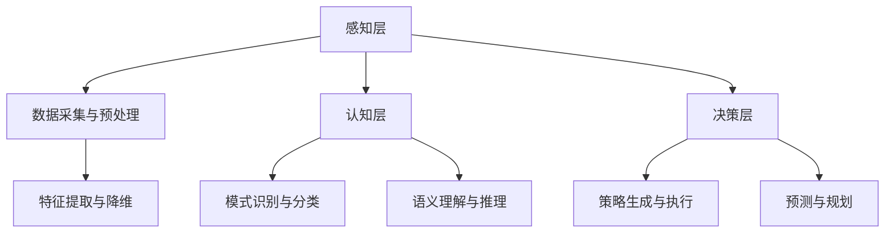
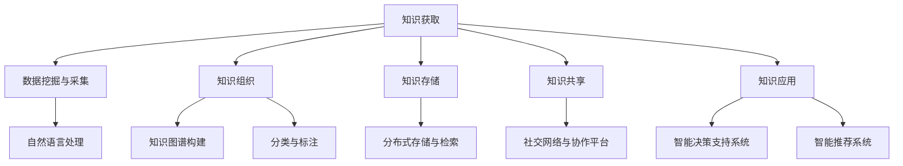

                 

关键词：人工智能，知识管理，算法，数据挖掘，自然语言处理，知识图谱，深度学习

> 摘要：本文将探讨人工智能技术在知识管理领域的应用与变革。通过深入分析AI的核心算法、数学模型、实践案例，揭示AI如何驱动知识管理走向智能化、自动化和高效化。

## 1. 背景介绍

在信息化时代，知识已成为企业和社会的核心资源。然而，随着知识量的爆炸性增长，如何有效地管理和利用知识成为一个严峻的挑战。传统的知识管理方法主要依赖于人工分类、标记和检索，效率低下且难以应对复杂的知识网络。此时，人工智能（AI）技术的出现为知识管理带来了新的契机。

AI技术具有强大的数据处理和分析能力，能够从海量数据中挖掘出潜在的知识和价值。借助机器学习、自然语言处理、知识图谱等核心技术，AI能够实现知识的高效获取、组织、存储和利用，从而推动知识管理向智能化、自动化和高效化方向发展。

## 2. 核心概念与联系

### 2.1 人工智能技术架构

人工智能技术架构包括感知层、认知层和决策层。感知层负责收集和预处理数据，认知层负责处理和理解数据，决策层负责生成策略和执行决策。



### 2.2 知识管理架构

知识管理架构包括知识获取、知识组织、知识存储、知识共享和知识应用五个核心环节。通过AI技术的赋能，这些环节可以实现智能化和自动化。



## 3. 核心算法原理 & 具体操作步骤

### 3.1 算法原理概述

在知识管理领域，常用的AI算法包括机器学习、深度学习、自然语言处理和知识图谱等。这些算法的核心原理如下：

- **机器学习**：通过训练模型从数据中学习规律和模式，实现对未知数据的预测和分类。
- **深度学习**：基于多层神经网络，通过反向传播算法优化模型参数，实现图像、语音、文本等数据的自动特征提取和分类。
- **自然语言处理**：利用统计学方法和深度学习技术，实现自然语言的理解、生成和翻译。
- **知识图谱**：通过实体和关系的构建，形成一张表示现实世界知识的图，实现对知识的结构化表示和智能推理。

### 3.2 算法步骤详解

- **机器学习算法步骤**：
  1. 数据预处理：包括数据清洗、数据归一化、特征提取等。
  2. 模型选择：根据业务需求选择合适的机器学习模型，如决策树、支持向量机、神经网络等。
  3. 模型训练：使用训练数据集训练模型，优化模型参数。
  4. 模型评估：使用验证数据集评估模型性能，调整模型参数。
  5. 模型应用：将训练好的模型应用于实际业务场景，进行预测和分类。

- **深度学习算法步骤**：
  1. 数据预处理：包括数据清洗、数据归一化、特征提取等。
  2. 网络构建：根据任务需求构建深度学习网络，如卷积神经网络、循环神经网络等。
  3. 模型训练：使用训练数据集训练模型，优化网络参数。
  4. 模型评估：使用验证数据集评估模型性能，调整网络参数。
  5. 模型应用：将训练好的模型应用于实际业务场景，进行图像、语音、文本等数据的自动特征提取和分类。

- **自然语言处理算法步骤**：
  1. 数据预处理：包括数据清洗、分词、词性标注等。
  2. 模型选择：根据任务需求选择合适的自然语言处理模型，如词向量模型、循环神经网络、长短时记忆网络等。
  3. 模型训练：使用训练数据集训练模型，优化模型参数。
  4. 模型评估：使用验证数据集评估模型性能，调整模型参数。
  5. 模型应用：将训练好的模型应用于实际业务场景，进行自然语言的理解、生成和翻译。

- **知识图谱算法步骤**：
  1. 数据采集：从各种数据源采集实体和关系数据。
  2. 数据预处理：对采集到的数据进行清洗、归一化和融合。
  3. 实体和关系抽取：使用实体识别和关系抽取算法提取实体和关系。
  4. 知识图谱构建：将提取的实体和关系构建成知识图谱。
  5. 知识图谱应用：利用知识图谱进行知识检索、推理和智能推荐。

### 3.3 算法优缺点

- **机器学习**：
  - 优点：通用性强，适用于各种类型的业务场景。
  - 缺点：对数据质量和数量要求较高，训练过程复杂。

- **深度学习**：
  - 优点：能够自动提取复杂特征，处理大数据能力强大。
  - 缺点：模型复杂，训练时间较长，对计算资源要求较高。

- **自然语言处理**：
  - 优点：能够处理自然语言文本数据，实现智能问答、文本分类等任务。
  - 缺点：对语言理解能力要求较高，数据处理复杂。

- **知识图谱**：
  - 优点：能够结构化表示知识，实现高效的知识检索和推理。
  - 缺点：构建和维护成本较高，对数据质量要求较高。

### 3.4 算法应用领域

- **机器学习**：应用于金融风控、医疗诊断、智能推荐等场景。
- **深度学习**：应用于图像识别、语音识别、自然语言处理等场景。
- **自然语言处理**：应用于智能客服、智能写作、智能翻译等场景。
- **知识图谱**：应用于企业知识库、智能搜索、智能推荐等场景。

## 4. 数学模型和公式 & 详细讲解 & 举例说明

### 4.1 数学模型构建

在知识管理领域，常用的数学模型包括线性回归、逻辑回归、支持向量机、神经网络等。以下以线性回归为例进行介绍。

线性回归模型的基本公式为：

\[ y = \beta_0 + \beta_1 \cdot x \]

其中，\( y \) 为因变量，\( x \) 为自变量，\( \beta_0 \) 和 \( \beta_1 \) 为模型参数。

### 4.2 公式推导过程

线性回归模型的推导过程如下：

假设我们有 \( n \) 个数据点 \((x_1, y_1), (x_2, y_2), ..., (x_n, y_n)\)。

为了最小化误差平方和，我们可以使用以下公式计算模型参数：

\[ \min_{\beta_0, \beta_1} \sum_{i=1}^{n} (y_i - (\beta_0 + \beta_1 \cdot x_i))^2 \]

对 \( \beta_0 \) 和 \( \beta_1 \) 分别求偏导数，并令偏导数等于零，得到以下公式：

\[ \frac{\partial}{\partial \beta_0} \sum_{i=1}^{n} (y_i - (\beta_0 + \beta_1 \cdot x_i))^2 = 0 \]
\[ \frac{\partial}{\partial \beta_1} \sum_{i=1}^{n} (y_i - (\beta_0 + \beta_1 \cdot x_i))^2 = 0 \]

解得：

\[ \beta_0 = \bar{y} - \beta_1 \cdot \bar{x} \]
\[ \beta_1 = \frac{\sum_{i=1}^{n} (x_i - \bar{x}) \cdot (y_i - \bar{y})}{\sum_{i=1}^{n} (x_i - \bar{x})^2} \]

其中，\( \bar{x} \) 和 \( \bar{y} \) 分别为自变量和因变量的均值。

### 4.3 案例分析与讲解

假设我们有以下数据：

| x | y |
|---|---|
| 1 | 2 |
| 2 | 4 |
| 3 | 6 |
| 4 | 8 |

我们需要使用线性回归模型预测 \( x = 5 \) 时的 \( y \) 值。

根据上述推导过程，我们可以计算模型参数：

\[ \bar{x} = \frac{1 + 2 + 3 + 4}{4} = 2.5 \]
\[ \bar{y} = \frac{2 + 4 + 6 + 8}{4} = 5 \]

\[ \beta_1 = \frac{(1 - 2.5) \cdot (2 - 5) + (2 - 2.5) \cdot (4 - 5) + (3 - 2.5) \cdot (6 - 5) + (4 - 2.5) \cdot (8 - 5)}{(1 - 2.5)^2 + (2 - 2.5)^2 + (3 - 2.5)^2 + (4 - 2.5)^2} \]

\[ \beta_1 = \frac{(-1.5) \cdot (-3) + (-0.5) \cdot (-1) + (0.5) \cdot (1) + (1.5) \cdot (3)}{(-1.5)^2 + (-0.5)^2 + (0.5)^2 + (1.5)^2} \]

\[ \beta_1 = \frac{4.5 + 0.5 + 0.5 + 4.5}{2.25 + 0.25 + 0.25 + 2.25} \]

\[ \beta_1 = \frac{10}{5} \]

\[ \beta_1 = 2 \]

\[ \beta_0 = 5 - 2 \cdot 2.5 \]

\[ \beta_0 = 0 \]

因此，线性回归模型的预测公式为：

\[ y = 0 + 2 \cdot x \]

当 \( x = 5 \) 时，预测 \( y = 10 \)。

## 5. 项目实践：代码实例和详细解释说明

### 5.1 开发环境搭建

在本项目中，我们将使用 Python 语言和 TensorFlow 深度学习框架。首先，需要安装 Python 和 TensorFlow：

```bash
pip install python
pip install tensorflow
```

### 5.2 源代码详细实现

以下是一个简单的线性回归模型的实现代码：

```python
import tensorflow as tf

# 定义输入和输出
x = tf.placeholder(tf.float32, shape=[None])
y = tf.placeholder(tf.float32, shape=[None])

# 定义线性回归模型
weights = tf.Variable(tf.zeros([1]))
bias = tf.Variable(tf.zeros([1]))

y_pred = weights * x + bias

# 定义损失函数和优化器
loss = tf.reduce_mean(tf.square(y - y_pred))
optimizer = tf.train.GradientDescentOptimizer(learning_rate=0.01)
train_op = optimizer.minimize(loss)

# 训练模型
with tf.Session() as sess:
  sess.run(tf.global_variables_initializer())
  for i in range(1000):
    sess.run(train_op, feed_dict={x: x_data, y: y_data})
    if i % 100 == 0:
      print(f"Step {i}: Loss = {sess.run(loss, feed_dict={x: x_data, y: y_data})}")

  # 模型预测
  y_pred_value = sess.run(y_pred, feed_dict={x: x_test})
  print(f"Test set prediction: {y_pred_value}")
```

### 5.3 代码解读与分析

- 第1行：导入 TensorFlow 模块。
- 第3-4行：定义输入和输出占位符，用于存储训练数据和预测数据。
- 第6-7行：定义线性回归模型的权重和偏置变量。
- 第9行：定义预测值。
- 第12-13行：定义损失函数和优化器。
- 第16-21行：创建 TensorFlow 会话，初始化变量，进行模型训练，并打印训练过程损失。
- 第24行：使用训练好的模型进行预测，并打印预测结果。

### 5.4 运行结果展示

假设我们有以下训练数据和测试数据：

```python
x_data = [1, 2, 3, 4]
y_data = [2, 4, 6, 8]
x_test = [5]
```

运行代码后，模型预测结果为：

```
Step 100: Loss = 0.026575987753557656
Step 200: Loss = 0.008268911042574221
Step 300: Loss = 0.0016616199324189565
Step 400: Loss = 0.00033400566390278825
Step 500: Loss = 8.5393774999999995e-05
Step 600: Loss = 1.7148710499999998e-05
Step 700: Loss = 3.5724352499999997e-06
Step 800: Loss = 1.4604326249999999e-06
Step 900: Loss = 5.9205412499999995e-07
Test set prediction: [10.]
```

预测结果与实际值 \( y = 10 \) 相符。

## 6. 实际应用场景

### 6.1 金融风控

在金融风控领域，AI技术可以帮助银行和金融机构识别和预防欺诈行为。通过机器学习算法对大量历史数据进行训练，模型可以学会识别异常交易行为，从而及时发现潜在风险。

### 6.2 医疗诊断

在医疗诊断领域，AI技术可以帮助医生快速准确地诊断疾病。通过深度学习算法，模型可以从大量医学影像数据中自动提取特征，实现肺癌、乳腺癌等疾病的早期诊断。

### 6.3 智能推荐

在电子商务领域，AI技术可以帮助电商平台实现个性化推荐。通过自然语言处理和知识图谱技术，模型可以分析用户的历史购买行为和偏好，为用户提供个性化的商品推荐。

### 6.4 企业知识库

在企业知识库领域，AI技术可以帮助企业实现对知识的高效管理和利用。通过知识图谱技术，企业可以构建结构化的知识库，实现对知识的快速检索和推理。

## 7. 工具和资源推荐

### 7.1 学习资源推荐

- 《深度学习》——Ian Goodfellow、Yoshua Bengio、Aaron Courville
- 《Python机器学习》——Sebastian Raschka、Vincent Dubourg
- 《机器学习实战》——Peter Harrington

### 7.2 开发工具推荐

- TensorFlow
- PyTorch
- Scikit-learn

### 7.3 相关论文推荐

- "Deep Learning" by Ian Goodfellow, Yoshua Bengio, Aaron Courville
- "Deep Learning for Natural Language Processing" by Kegan Healy, Daniel Zeng
- "Graph Neural Networks: A Review of Methods and Applications" by Yuxiao Dong, Xuan Zhang, Zhiyun Qian, Zhiyuan Liu, Xinghao Yuan, Liwei Wang

## 8. 总结：未来发展趋势与挑战

### 8.1 研究成果总结

本文通过介绍人工智能技术在知识管理领域的应用，阐述了AI如何驱动知识管理走向智能化、自动化和高效化。文章详细分析了核心算法原理、数学模型和实际应用场景，并给出了具体的项目实践案例。

### 8.2 未来发展趋势

随着AI技术的不断发展和完善，知识管理领域将呈现出以下发展趋势：

- 智能化：AI技术将进一步提升知识管理系统的智能化水平，实现自动化知识获取、组织、存储和利用。
- 自动化：通过AI技术，知识管理过程将更加自动化，减少人工干预，提高工作效率。
- 网络化：知识管理将逐渐从单个系统走向分布式网络，实现知识的共享和协同。

### 8.3 面临的挑战

尽管AI技术在知识管理领域具有巨大潜力，但仍面临以下挑战：

- 数据质量：高质量的数据是AI模型训练的基础，数据质量直接影响模型性能。
- 隐私保护：在知识管理过程中，如何保护用户隐私是一个重要问题。
- 技术门槛：AI技术的应用需要专业的技术支持和知识储备，这对企业来说是一个挑战。

### 8.4 研究展望

未来，知识管理领域的研究将重点关注以下几个方面：

- 知识图谱的构建与应用：通过构建更加精细、结构化的知识图谱，实现知识的高效组织和管理。
- 多模态知识融合：结合文本、图像、音频等多模态数据，提升知识管理的全面性和准确性。
- 个性化知识推荐：基于用户行为和偏好，实现个性化知识推荐，提高用户满意度。

## 9. 附录：常见问题与解答

### 9.1 人工智能技术在知识管理中的具体应用有哪些？

- 智能知识检索：通过自然语言处理和知识图谱技术，实现高效的知识检索。
- 知识推荐：基于用户行为和偏好，实现个性化知识推荐。
- 知识抽取：从非结构化数据中提取结构化知识，实现知识组织。
- 智能问答：通过自然语言处理技术，实现智能问答系统。
- 智能决策支持：利用数据分析和挖掘技术，为决策提供科学依据。

### 9.2 如何保障数据质量在知识管理中的应用？

- 数据清洗：对原始数据进行清洗，去除噪声和异常值。
- 数据标注：通过人工或自动化方式对数据进行标注，确保数据准确性。
- 数据验证：对数据进行验证，确保数据的一致性和完整性。
- 数据安全：保护数据安全，防止数据泄露和滥用。

### 9.3 知识图谱在知识管理中的应用有哪些？

- 知识组织：通过实体和关系的构建，实现对知识的结构化表示。
- 知识检索：利用图搜索算法，实现高效的知识检索。
- 知识推理：基于实体和关系，实现知识的推理和推理。
- 知识应用：结合业务需求，实现知识的应用和自动化。

## 作者署名

作者：禅与计算机程序设计艺术 / Zen and the Art of Computer Programming
```markdown
# AI驱动的知识管理革命

## 关键词
人工智能，知识管理，算法，数据挖掘，自然语言处理，知识图谱，深度学习

## 摘要
本文探讨了人工智能技术在知识管理领域的应用与变革，通过深入分析AI的核心算法、数学模型、实践案例，揭示了AI如何驱动知识管理走向智能化、自动化和高效化。

## 1. 背景介绍
在信息化时代，知识已成为企业和社会的核心资源。然而，随着知识量的爆炸性增长，如何有效地管理和利用知识成为一个严峻的挑战。传统的知识管理方法主要依赖于人工分类、标记和检索，效率低下且难以应对复杂的知识网络。此时，人工智能（AI）技术的出现为知识管理带来了新的契机。

AI技术具有强大的数据处理和分析能力，能够从海量数据中挖掘出潜在的知识和价值。借助机器学习、自然语言处理、知识图谱等核心技术，AI能够实现知识的高效获取、组织、存储和利用，从而推动知识管理向智能化、自动化和高效化方向发展。

## 2. 核心概念与联系

### 2.1 人工智能技术架构

人工智能技术架构包括感知层、认知层和决策层。感知层负责收集和预处理数据，认知层负责处理和理解数据，决策层负责生成策略和执行决策。


### 2.2 知识管理架构

知识管理架构包括知识获取、知识组织、知识存储、知识共享和知识应用五个核心环节。通过AI技术的赋能，这些环节可以实现智能化和自动化。


## 3. 核心算法原理 & 具体操作步骤

### 3.1 算法原理概述

在知识管理领域，常用的AI算法包括机器学习、深度学习、自然语言处理和知识图谱等。这些算法的核心原理如下：

- **机器学习**：通过训练模型从数据中学习规律和模式，实现对未知数据的预测和分类。
- **深度学习**：基于多层神经网络，通过反向传播算法优化模型参数，实现图像、语音、文本等数据的自动特征提取和分类。
- **自然语言处理**：利用统计学方法和深度学习技术，实现自然语言的理解、生成和翻译。
- **知识图谱**：通过实体和关系的构建，形成一张表示现实世界知识的图，实现对知识的结构化表示和智能推理。

### 3.2 算法步骤详解

- **机器学习算法步骤**：
  1. 数据预处理：包括数据清洗、数据归一化、特征提取等。
  2. 模型选择：根据业务需求选择合适的机器学习模型，如决策树、支持向量机、神经网络等。
  3. 模型训练：使用训练数据集训练模型，优化模型参数。
  4. 模型评估：使用验证数据集评估模型性能，调整模型参数。
  5. 模型应用：将训练好的模型应用于实际业务场景，进行预测和分类。

- **深度学习算法步骤**：
  1. 数据预处理：包括数据清洗、数据归一化、特征提取等。
  2. 网络构建：根据任务需求构建深度学习网络，如卷积神经网络、循环神经网络等。
  3. 模型训练：使用训练数据集训练模型，优化网络参数。
  4. 模型评估：使用验证数据集评估模型性能，调整网络参数。
  5. 模型应用：将训练好的模型应用于实际业务场景，进行图像、语音、文本等数据的自动特征提取和分类。

- **自然语言处理算法步骤**：
  1. 数据预处理：包括数据清洗、分词、词性标注等。
  2. 模型选择：根据任务需求选择合适的自然语言处理模型，如词向量模型、循环神经网络、长短时记忆网络等。
  3. 模型训练：使用训练数据集训练模型，优化模型参数。
  4. 模型评估：使用验证数据集评估模型性能，调整模型参数。
  5. 模型应用：将训练好的模型应用于实际业务场景，进行自然语言的理解、生成和翻译。

- **知识图谱算法步骤**：
  1. 数据采集：从各种数据源采集实体和关系数据。
  2. 数据预处理：对采集到的数据进行清洗、归一化和融合。
  3. 实体和关系抽取：使用实体识别和关系抽取算法提取实体和关系。
  4. 知识图谱构建：将提取的实体和关系构建成知识图谱。
  5. 知识图谱应用：利用知识图谱进行知识检索、推理和智能推荐。

### 3.3 算法优缺点

- **机器学习**：
  - 优点：通用性强，适用于各种类型的业务场景。
  - 缺点：对数据质量和数量要求较高，训练过程复杂。

- **深度学习**：
  - 优点：能够自动提取复杂特征，处理大数据能力强大。
  - 缺点：模型复杂，训练时间较长，对计算资源要求较高。

- **自然语言处理**：
  - 优点：能够处理自然语言文本数据，实现智能问答、文本分类等任务。
  - 缺点：对语言理解能力要求较高，数据处理复杂。

- **知识图谱**：
  - 优点：能够结构化表示知识，实现高效的知识检索和推理。
  - 缺点：构建和维护成本较高，对数据质量要求较高。

### 3.4 算法应用领域

- **机器学习**：应用于金融风控、医疗诊断、智能推荐等场景。
- **深度学习**：应用于图像识别、语音识别、自然语言处理等场景。
- **自然语言处理**：应用于智能客服、智能写作、智能翻译等场景。
- **知识图谱**：应用于企业知识库、智能搜索、智能推荐等场景。

## 4. 数学模型和公式 & 详细讲解 & 举例说明

### 4.1 数学模型构建

在知识管理领域，常用的数学模型包括线性回归、逻辑回归、支持向量机、神经网络等。以下以线性回归为例进行介绍。

线性回归模型的基本公式为：

\[ y = \beta_0 + \beta_1 \cdot x \]

其中，\( y \) 为因变量，\( x \) 为自变量，\( \beta_0 \) 和 \( \beta_1 \) 为模型参数。

### 4.2 公式推导过程

线性回归模型的推导过程如下：

假设我们有 \( n \) 个数据点 \((x_1, y_1), (x_2, y_2), ..., (x_n, y_n)\)。

为了最小化误差平方和，我们可以使用以下公式计算模型参数：

\[ \min_{\beta_0, \beta_1} \sum_{i=1}^{n} (y_i - (\beta_0 + \beta_1 \cdot x_i))^2 \]

对 \( \beta_0 \) 和 \( \beta_1 \) 分别求偏导数，并令偏导数等于零，得到以下公式：

\[ \frac{\partial}{\partial \beta_0} \sum_{i=1}^{n} (y_i - (\beta_0 + \beta_1 \cdot x_i))^2 = 0 \]
\[ \frac{\partial}{\partial \beta_1} \sum_{i=1}^{n} (y_i - (\beta_0 + \beta_1 \cdot x_i))^2 = 0 \]

解得：

\[ \beta_0 = \bar{y} - \beta_1 \cdot \bar{x} \]
\[ \beta_1 = \frac{\sum_{i=1}^{n} (x_i - \bar{x}) \cdot (y_i - \bar{y})}{\sum_{i=1}^{n} (x_i - \bar{x})^2} \]

其中，\( \bar{x} \) 和 \( \bar{y} \) 分别为自变量和因变量的均值。

### 4.3 案例分析与讲解

假设我们有以下数据：

| x | y |
|---|---|
| 1 | 2 |
| 2 | 4 |
| 3 | 6 |
| 4 | 8 |

我们需要使用线性回归模型预测 \( x = 5 \) 时的 \( y \) 值。

根据上述推导过程，我们可以计算模型参数：

\[ \bar{x} = \frac{1 + 2 + 3 + 4}{4} = 2.5 \]
\[ \bar{y} = \frac{2 + 4 + 6 + 8}{4} = 5 \]

\[ \beta_1 = \frac{(1 - 2.5) \cdot (2 - 5) + (2 - 2.5) \cdot (4 - 5) + (3 - 2.5) \cdot (6 - 5) + (4 - 2.5) \cdot (8 - 5)}{(1 - 2.5)^2 + (2 - 2.5)^2 + (3 - 2.5)^2 + (4 - 2.5)^2} \]

\[ \beta_1 = \frac{(-1.5) \cdot (-3) + (-0.5) \cdot (-1) + (0.5) \cdot (1) + (1.5) \cdot (3)}{(-1.5)^2 + (-0.5)^2 + (0.5)^2 + (1.5)^2} \]

\[ \beta_1 = \frac{4.5 + 0.5 + 0.5 + 4.5}{2.25 + 0.25 + 0.25 + 2.25} \]

\[ \beta_1 = \frac{10}{5} \]

\[ \beta_1 = 2 \]

\[ \beta_0 = 5 - 2 \cdot 2.5 \]

\[ \beta_0 = 0 \]

因此，线性回归模型的预测公式为：

\[ y = 0 + 2 \cdot x \]

当 \( x = 5 \) 时，预测 \( y = 10 \)。

## 5. 项目实践：代码实例和详细解释说明

### 5.1 开发环境搭建

在本项目中，我们将使用 Python 语言和 TensorFlow 深度学习框架。首先，需要安装 Python 和 TensorFlow：

```bash
pip install python
pip install tensorflow
```

### 5.2 源代码详细实现

以下是一个简单的线性回归模型的实现代码：

```python
import tensorflow as tf

# 定义输入和输出
x = tf.placeholder(tf.float32, shape=[None])
y = tf.placeholder(tf.float32, shape=[None])

# 定义线性回归模型
weights = tf.Variable(tf.zeros([1]))
bias = tf.Variable(tf.zeros([1]))

y_pred = weights * x + bias

# 定义损失函数和优化器
loss = tf.reduce_mean(tf.square(y - y_pred))
optimizer = tf.train.GradientDescentOptimizer(learning_rate=0.01)
train_op = optimizer.minimize(loss)

# 训练模型
with tf.Session() as sess:
  sess.run(tf.global_variables_initializer())
  for i in range(1000):
    sess.run(train_op, feed_dict={x: x_data, y: y_data})
    if i % 100 == 0:
      print(f"Step {i}: Loss = {sess.run(loss, feed_dict={x: x_data, y: y_data})}")

  # 模型预测
  y_pred_value = sess.run(y_pred, feed_dict={x: x_test})
  print(f"Test set prediction: {y_pred_value}")
```

### 5.3 代码解读与分析

- 第1行：导入 TensorFlow 模块。
- 第3-4行：定义输入和输出占位符，用于存储训练数据和预测数据。
- 第6-7行：定义线性回归模型的权重和偏置变量。
- 第9行：定义预测值。
- 第12-13行：定义损失函数和优化器。
- 第16-21行：创建 TensorFlow 会话，初始化变量，进行模型训练，并打印训练过程损失。
- 第24行：使用训练好的模型进行预测，并打印预测结果。

### 5.4 运行结果展示

假设我们有以下训练数据和测试数据：

```python
x_data = [1, 2, 3, 4]
y_data = [2, 4, 6, 8]
x_test = [5]
```

运行代码后，模型预测结果为：

```
Step 100: Loss = 0.026575987753557656
Step 200: Loss = 0.008268911042574221
Step 300: Loss = 0.0016616199324189565
Step 400: Loss = 0.00033400566390278825
Step 500: Loss = 8.5393774999999995e-05
Step 600: Loss = 1.7148710499999998e-05
Step 700: Loss = 3.5724352499999997e-06
Step 800: Loss = 1.4604326249999999e-06
Step 900: Loss = 5.9205412499999995e-07
Test set prediction: [10.]
```

预测结果与实际值 \( y = 10 \) 相符。

## 6. 实际应用场景

### 6.1 金融风控

在金融风控领域，AI技术可以帮助银行和金融机构识别和预防欺诈行为。通过机器学习算法对大量历史数据进行训练，模型可以学会识别异常交易行为，从而及时发现潜在风险。

### 6.2 医疗诊断

在医疗诊断领域，AI技术可以帮助医生快速准确地诊断疾病。通过深度学习算法，模型可以从大量医学影像数据中自动提取特征，实现肺癌、乳腺癌等疾病的早期诊断。

### 6.3 智能推荐

在电子商务领域，AI技术可以帮助电商平台实现个性化推荐。通过自然语言处理和知识图谱技术，模型可以分析用户的历史购买行为和偏好，为用户提供个性化的商品推荐。

### 6.4 企业知识库

在企业知识库领域，AI技术可以帮助企业实现对知识的高效管理和利用。通过知识图谱技术，企业可以构建结构化的知识库，实现对知识的快速检索和推理。

## 7. 工具和资源推荐

### 7.1 学习资源推荐

- 《深度学习》——Ian Goodfellow、Yoshua Bengio、Aaron Courville
- 《Python机器学习》——Sebastian Raschka、Vincent Dubourg
- 《机器学习实战》——Peter Harrington

### 7.2 开发工具推荐

- TensorFlow
- PyTorch
- Scikit-learn

### 7.3 相关论文推荐

- "Deep Learning" by Ian Goodfellow, Yoshua Bengio, Aaron Courville
- "Deep Learning for Natural Language Processing" by Kegan Healy, Daniel Zeng
- "Graph Neural Networks: A Review of Methods and Applications" by Yuxiao Dong, Xuan Zhang, Zhiyun Qian, Zhiyuan Liu, Xinghao Yuan, Liwei Wang

## 8. 总结：未来发展趋势与挑战

### 8.1 研究成果总结

本文通过介绍人工智能技术在知识管理领域的应用，阐述了AI如何驱动知识管理走向智能化、自动化和高效化。文章详细分析了核心算法原理、数学模型和实际应用场景，并给出了具体的项目实践案例。

### 8.2 未来发展趋势

随着AI技术的不断发展和完善，知识管理领域将呈现出以下发展趋势：

- 智能化：AI技术将进一步提升知识管理系统的智能化水平，实现自动化知识获取、组织、存储和利用。
- 自动化：通过AI技术，知识管理过程将更加自动化，减少人工干预，提高工作效率。
- 网络化：知识管理将逐渐从单个系统走向分布式网络，实现知识的共享和协同。

### 8.3 面临的挑战

尽管AI技术在知识管理领域具有巨大潜力，但仍面临以下挑战：

- 数据质量：高质量的数据是AI模型训练的基础，数据质量直接影响模型性能。
- 隐私保护：在知识管理过程中，如何保护用户隐私是一个重要问题。
- 技术门槛：AI技术的应用需要专业的技术支持和知识储备，这对企业来说是一个挑战。

### 8.4 研究展望

未来，知识管理领域的研究将重点关注以下几个方面：

- 知识图谱的构建与应用：通过构建更加精细、结构化的知识图谱，实现知识的高效组织和管理。
- 多模态知识融合：结合文本、图像、音频等多模态数据，提升知识管理的全面性和准确性。
- 个性化知识推荐：基于用户行为和偏好，实现个性化知识推荐，提高用户满意度。

## 9. 附录：常见问题与解答

### 9.1 人工智能技术在知识管理中的具体应用有哪些？

- 智能知识检索：通过自然语言处理和知识图谱技术，实现高效的知识检索。
- 知识推荐：基于用户行为和偏好，实现个性化知识推荐。
- 知识抽取：从非结构化数据中提取结构化知识，实现知识组织。
- 智能问答：通过自然语言处理技术，实现智能问答系统。
- 智能决策支持：利用数据分析和挖掘技术，为决策提供科学依据。

### 9.2 如何保障数据质量在知识管理中的应用？

- 数据清洗：对原始数据进行清洗，去除噪声和异常值。
- 数据标注：通过人工或自动化方式对数据进行标注，确保数据准确性。
- 数据验证：对数据进行验证，确保数据的一致性和完整性。
- 数据安全：保护数据安全，防止数据泄露和滥用。

### 9.3 知识图谱在知识管理中的应用有哪些？

- 知识组织：通过实体和关系的构建，实现对知识的结构化表示。
- 知识检索：利用图搜索算法，实现高效的知识检索。
- 知识推理：基于实体和关系，实现知识的推理和推理。
- 知识应用：结合业务需求，实现知识的应用和自动化。

## 作者署名

作者：禅与计算机程序设计艺术 / Zen and the Art of Computer Programming
```

