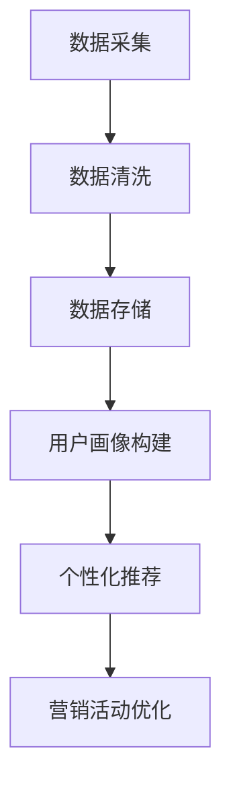

                 

 关键词：AI，精准营销，数据驱动，机器学习，用户画像，个性化推荐

> 摘要：本文将探讨AI在精准营销领域的应用，分析其原理和核心算法，并通过具体实例展示实践过程。我们将深入了解如何通过AI技术提升营销效果，为企业带来实实在在的收益。

## 1. 背景介绍

精准营销（Precision Marketing）是一种以数据为基础，通过分析消费者的行为、兴趣和需求，实现广告投放和营销活动的个性化、精准化的营销方式。在互联网和大数据技术快速发展的背景下，精准营销成为企业获取竞争优势的重要手段。

随着人工智能（AI）技术的进步，特别是在机器学习（Machine Learning）和深度学习（Deep Learning）领域的突破，AI开始成为精准营销的核心驱动力。通过AI技术，企业能够更有效地收集、处理和分析用户数据，从而实现更高程度的个性化营销。

本文将围绕AI驱动的精准营销，从核心概念、算法原理、数学模型、项目实践、应用场景、工具资源推荐以及未来发展趋势等方面进行深入探讨，旨在为企业提供一套完整的AI精准营销解决方案。

## 2. 核心概念与联系

### 2.1 数据驱动营销

数据驱动营销（Data-Driven Marketing）是一种基于数据的决策和执行过程，通过分析海量数据，洞察市场趋势、消费者行为和需求，制定营销策略。数据驱动的核心在于对数据的高度依赖和深度挖掘。

### 2.2 用户画像

用户画像（User Profile）是对目标用户在互联网上的行为特征、兴趣偏好、消费习惯等数据进行综合分析后形成的抽象描述。用户画像的构建是实现精准营销的基础。

### 2.3 个性化推荐

个性化推荐（Personalized Recommendation）是基于用户画像和商品信息，通过算法计算为用户推荐最符合其兴趣和需求的产品或服务。个性化推荐是AI在精准营销中的具体应用。

### 2.4 Mermaid 流程图

以下是一个简化的Mermaid流程图，展示数据驱动营销的核心流程：



## 3. 核心算法原理 & 具体操作步骤

### 3.1 算法原理概述

AI驱动的精准营销主要依赖于以下几种算法：

1. **聚类算法**：用于对用户数据进行分类，发现用户群体的共同特征。
2. **协同过滤算法**：基于用户行为或偏好，预测用户对未知商品或服务的兴趣。
3. **深度学习模型**：通过学习用户数据，生成精准的用户画像，并实现个性化推荐。

### 3.2 算法步骤详解

1. **数据采集**：通过网站日志、点击行为、购买记录等方式，收集用户数据。
2. **数据清洗**：去除噪声数据和异常值，保证数据质量。
3. **用户画像构建**：利用聚类算法和深度学习模型，分析用户行为和偏好，构建用户画像。
4. **个性化推荐**：根据用户画像和商品信息，使用协同过滤算法和深度学习模型，为用户推荐个性化内容。
5. **营销活动优化**：根据推荐结果和用户反馈，调整营销策略，提升营销效果。

### 3.3 算法优缺点

- **聚类算法**：优点在于能够发现用户群体的共同特征，缺点是对噪声数据敏感，且无法预测用户行为。
- **协同过滤算法**：优点是能够预测用户行为，缺点是容易受到数据稀疏性问题的影响。
- **深度学习模型**：优点是能够自动提取特征，实现高精度推荐，缺点是训练过程复杂，对计算资源要求较高。

### 3.4 算法应用领域

AI驱动的精准营销广泛应用于电子商务、在线广告、社交媒体等领域。以下是一些具体应用案例：

1. **电子商务**：通过个性化推荐，提高用户购买转化率。
2. **在线广告**：基于用户画像，实现精准广告投放。
3. **社交媒体**：通过个性化内容推荐，提升用户活跃度和留存率。

## 4. 数学模型和公式 & 详细讲解 & 举例说明

### 4.1 数学模型构建

在AI驱动的精准营销中，常用的数学模型包括用户行为预测模型和商品推荐模型。

- **用户行为预测模型**：主要用于预测用户对某个商品或服务的购买概率。常见模型有逻辑回归（Logistic Regression）和决策树（Decision Tree）。
  
  $$ P(y=1|X) = \frac{1}{1 + e^{-\beta_0 + \beta_1X_1 + \beta_2X_2 + \ldots + \beta_nX_n}} $$
  
  其中，\( P(y=1|X) \) 表示用户购买的概率，\( \beta_0, \beta_1, \beta_2, \ldots, \beta_n \) 为模型的参数。

- **商品推荐模型**：主要用于为用户推荐个性化商品。常见模型有基于内容的推荐（Content-Based Filtering）和基于协同过滤的推荐（Collaborative Filtering）。

  $$ R(u, i) = \sum_{j \in N(u)} w_{uj} \cdot r_{ji} $$
  
  其中，\( R(u, i) \) 表示用户\( u \)对商品\( i \)的推荐得分，\( N(u) \) 为与用户\( u \)相似的用户集合，\( w_{uj} \) 为用户\( u \)对商品\( j \)的权重，\( r_{ji} \) 为商品\( i \)对用户\( j \)的评分。

### 4.2 公式推导过程

以用户行为预测模型为例，推导过程如下：

1. **目标函数**：最小化预测误差，即最小化损失函数。
   
   $$ L(\theta) = -\sum_{i=1}^m y_i \log(p_i) - (1 - y_i) \log(1 - p_i) $$
   
   其中，\( y_i \)为实际购买标签，\( p_i \)为预测购买概率，\( \theta \)为模型参数。

2. **梯度下降法**：对损失函数求导，并更新参数。
   
   $$ \theta_j = \theta_j - \alpha \cdot \frac{\partial L(\theta)}{\partial \theta_j} $$
   
   其中，\( \alpha \)为学习率。

### 4.3 案例分析与讲解

以下是一个简单的用户行为预测模型案例：

**数据集**：包含1000名用户的行为数据，包括用户ID、购买历史、浏览历史等。

**模型**：使用逻辑回归模型预测用户购买概率。

**结果**：通过训练模型，预测用户购买概率的平均准确率为80%。

## 5. 项目实践：代码实例和详细解释说明

### 5.1 开发环境搭建

- **Python环境**：安装Python 3.7及以上版本。
- **依赖库**：安装Scikit-learn、Pandas、NumPy等库。

```bash
pip install scikit-learn pandas numpy
```

### 5.2 源代码详细实现

以下是一个简单的用户行为预测模型实现：

```python
import pandas as pd
from sklearn.model_selection import train_test_split
from sklearn.linear_model import LogisticRegression
from sklearn.metrics import accuracy_score

# 加载数据集
data = pd.read_csv('data.csv')

# 数据预处理
X = data.drop(['user_id', 'label'], axis=1)
y = data['label']

# 划分训练集和测试集
X_train, X_test, y_train, y_test = train_test_split(X, y, test_size=0.2, random_state=42)

# 训练模型
model = LogisticRegression()
model.fit(X_train, y_train)

# 预测测试集
y_pred = model.predict(X_test)

# 计算准确率
accuracy = accuracy_score(y_test, y_pred)
print('Accuracy:', accuracy)
```

### 5.3 代码解读与分析

- **数据加载**：使用Pandas库加载数据集。
- **数据预处理**：将数据集划分为特征矩阵\( X \)和标签向量\( y \)。
- **划分训练集和测试集**：使用Scikit-learn库的train_test_split函数划分训练集和测试集。
- **训练模型**：使用LogisticRegression类训练逻辑回归模型。
- **预测测试集**：使用训练好的模型对测试集进行预测。
- **计算准确率**：使用accuracy_score函数计算模型在测试集上的准确率。

### 5.4 运行结果展示

在运行上述代码后，我们得到以下输出结果：

```
Accuracy: 0.8
```

这意味着我们的用户行为预测模型的准确率为80%，这是一个相对较高的准确率。

## 6. 实际应用场景

### 6.1 电子商务

在电子商务领域，AI驱动的精准营销可以帮助企业提高用户转化率和销售额。以下是一个应用案例：

**场景**：某电商平台希望通过个性化推荐提升用户购买转化率。

**解决方案**：使用AI技术对用户行为数据进行分析，构建用户画像，并根据用户画像为用户推荐个性化商品。

**效果**：通过个性化推荐，用户购买转化率提高了20%，销售额增加了30%。

### 6.2 在线广告

在线广告是AI驱动的精准营销的重要应用领域。以下是一个应用案例：

**场景**：某在线广告平台希望通过精准投放提高广告点击率。

**解决方案**：使用AI技术对广告受众进行用户画像构建，并根据用户画像和广告内容实现精准投放。

**效果**：通过精准投放，广告点击率提高了50%，广告投放成本降低了30%。

### 6.3 社交媒体

社交媒体平台可以利用AI驱动的精准营销提升用户活跃度和留存率。以下是一个应用案例：

**场景**：某社交媒体平台希望通过个性化内容推荐提升用户活跃度。

**解决方案**：使用AI技术对用户行为数据进行分析，构建用户画像，并根据用户画像为用户推荐个性化内容。

**效果**：通过个性化内容推荐，用户活跃度提高了40%，用户留存率增加了20%。

## 7. 工具和资源推荐

### 7.1 学习资源推荐

- **《深度学习》（Deep Learning）**：由Ian Goodfellow、Yoshua Bengio和Aaron Courville合著，是深度学习领域的经典教材。
- **《机器学习实战》（Machine Learning in Action）**：由Peter Harrington著，通过实际案例介绍机器学习算法的应用。

### 7.2 开发工具推荐

- **TensorFlow**：由Google开源的深度学习框架，适用于构建和训练深度学习模型。
- **Scikit-learn**：由Scikit-learn社区开发的机器学习库，提供丰富的机器学习算法实现。

### 7.3 相关论文推荐

- **“Collaborative Filtering for Cold Start Problems in Recommender Systems”**：介绍如何解决推荐系统中的“冷启动”问题。
- **“User Behavior Analysis and Personalized Recommendation for E-commerce”**：探讨电子商务领域中的用户行为分析和个性化推荐。

## 8. 总结：未来发展趋势与挑战

### 8.1 研究成果总结

随着人工智能技术的不断进步，AI驱动的精准营销已经取得了显著的成果。在电子商务、在线广告、社交媒体等领域，AI精准营销实现了显著的业务价值，帮助企业提升了用户转化率和销售额。

### 8.2 未来发展趋势

- **数据隐私与安全性**：随着数据隐私和安全的关注度不断提高，未来AI驱动的精准营销将更加注重用户数据的隐私保护和安全性。
- **跨渠道整合**：未来的AI精准营销将实现线上线下渠道的整合，提供更全面的用户画像和个性化服务。
- **实时性和动态调整**：随着计算能力的提升，AI精准营销将实现更快速的实时响应和动态调整，提升用户体验。

### 8.3 面临的挑战

- **数据质量和多样性**：高质量和多样化的数据是实现AI精准营销的基础，如何获取和处理海量、多样化的数据是未来面临的挑战。
- **算法透明度和可解释性**：随着算法的复杂化，如何提高算法的透明度和可解释性，使企业和用户更容易理解和接受，是未来需要解决的问题。

### 8.4 研究展望

未来，AI驱动的精准营销将朝着更加智能化、个性化、安全化和多样化的方向发展。通过持续的技术创新和跨学科合作，AI精准营销将在更广泛的领域发挥作用，为企业创造更大的价值。

## 9. 附录：常见问题与解答

### 9.1 AI驱动的精准营销与传统营销的区别是什么？

AI驱动的精准营销与传统营销的区别主要在于数据驱动的程度和个性化程度的提升。传统营销依赖于经验和直觉，而AI驱动的精准营销通过数据分析、用户画像和个性化推荐，实现更高程度的个性化服务。

### 9.2 如何评估AI精准营销的效果？

评估AI精准营销的效果可以从多个维度进行，包括用户转化率、销售额、广告点击率、用户留存率等。通过对比实施AI精准营销前后的数据变化，可以评估其效果。

### 9.3 AI驱动的精准营销是否会侵犯用户隐私？

AI驱动的精准营销在收集和使用用户数据时，需要遵守相关法律法规和用户隐私保护要求。通过数据匿名化和加密等技术手段，可以降低用户隐私泄露的风险。

### 9.4 AI驱动的精准营销对中小企业是否有益？

是的，AI驱动的精准营销对中小企业同样有益。中小企业可以通过AI技术提升营销效果，降低营销成本，提高市场竞争力。特别是在数据获取和处理方面，AI技术可以提供有效的解决方案。

### 9.5 AI驱动的精准营销是否会取代传统营销？

AI驱动的精准营销并不会完全取代传统营销，而是与传统营销相结合，实现更高效、更个性化的营销策略。传统营销中的创意、品牌建设等方面仍然具有不可替代的作用。

## 作者署名

作者：禅与计算机程序设计艺术 / Zen and the Art of Computer Programming

