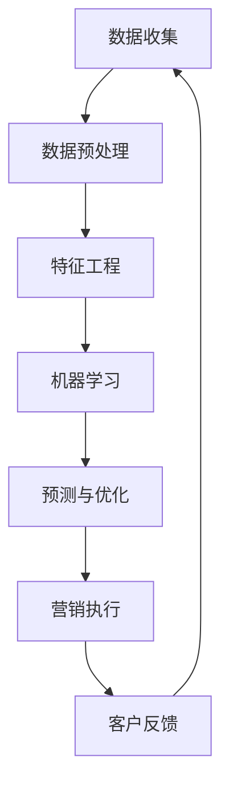

                 

关键词：AI，营销自动化，数据驱动，客户关系管理，个性化营销

> 摘要：本文深入探讨了AI在营销自动化中的应用，从核心概念、算法原理、数学模型、项目实践和实际应用场景等多个角度，全面解析了AI驱动的营销自动化策略。通过具体案例和代码实例，展示了如何利用AI技术提升营销效果，并展望了未来发展趋势与挑战。

## 1. 背景介绍

在当今数字化时代，营销活动的成功离不开精准的数据分析和智能化的决策支持。传统的营销方法往往依赖于人工判断和经验，不仅效率低下，而且难以满足日益复杂的市场需求。随着人工智能（AI）技术的发展，营销自动化逐渐成为一种新的趋势。AI驱动的营销自动化利用机器学习和数据挖掘技术，从海量数据中提取有价值的信息，实现个性化营销、客户关系管理和市场预测等任务。

营销自动化不仅能提高营销效率，还能降低成本，提高客户满意度。通过自动化工具，企业可以实时监测市场动态，迅速调整营销策略，从而在激烈的市场竞争中占据优势。然而，要实现有效的营销自动化，需要深入了解AI的核心概念、算法原理和数学模型，并能够将其应用于实际项目实践中。

本文旨在为读者提供一份全面的指南，帮助理解AI驱动的营销自动化策略，并掌握其实际应用方法。文章将首先介绍AI和营销自动化的基本概念，然后深入探讨核心算法原理和数学模型，接着通过具体案例和代码实例展示其实际应用，最后展望未来的发展趋势与挑战。

## 2. 核心概念与联系

在深入探讨AI驱动的营销自动化策略之前，我们需要先了解一些核心概念，以及它们之间的联系。以下是一个简化的Mermaid流程图，展示了营销自动化中的主要概念和它们的相互关系。



### 2.1 数据收集

数据收集是营销自动化的起点。它包括从各种渠道（如网站、社交媒体、电子邮件等）收集客户行为数据、交易数据和社交媒体互动数据等。这些数据是后续分析和决策的基础。

### 2.2 数据预处理

收集到的数据通常是不完整、不一致或不准确的。数据预处理包括清洗、归一化和去重等步骤，以确保数据的质量和一致性。

### 2.3 特征工程

特征工程是数据预处理之后的重要步骤，它涉及选择和构造有助于模型训练的特征。通过合理的特征工程，可以提高模型的预测准确性和性能。

### 2.4 机器学习

机器学习是营销自动化的核心。它使用历史数据来训练模型，然后根据模型的预测进行自动化决策。常见的机器学习算法包括决策树、支持向量机和神经网络等。

### 2.5 预测与优化

预测与优化利用机器学习模型对未来的市场动态进行预测，并优化营销策略。例如，通过预测客户流失率来制定保留策略，或者通过预测潜在客户来制定营销活动。

### 2.6 营销执行

营销执行是将预测结果转化为具体行动的过程。它包括发送个性化邮件、推送消息、社交媒体广告等，以实现营销目标。

### 2.7 客户反馈

客户反馈是营销自动化的重要环节。它通过监测客户的响应和行为，不断调整和优化营销策略，以提高客户满意度和忠诚度。

## 3. 核心算法原理 & 具体操作步骤

### 3.1 算法原理概述

营销自动化中的核心算法主要涉及分类、回归和聚类等机器学习技术。以下是一些常用的算法及其原理：

- **分类算法**：如逻辑回归、决策树和支持向量机（SVM），用于将客户数据划分为不同的类别，如潜在客户、流失客户等。
- **回归算法**：如线性回归和决策树回归，用于预测客户的响应行为，如购买概率、浏览时长等。
- **聚类算法**：如K-均值聚类和层次聚类，用于将客户划分为不同的群体，以便进行个性化营销。

### 3.2 算法步骤详解

以下是实现营销自动化的具体步骤：

1. **数据收集**：从各种渠道收集客户数据，包括行为数据、交易数据和社交媒体互动数据等。
2. **数据预处理**：清洗和归一化数据，处理缺失值和异常值。
3. **特征工程**：选择和构造有助于模型训练的特征，如客户年龄、购买历史、浏览时长等。
4. **模型训练**：使用分类、回归或聚类算法训练模型，选择最优参数。
5. **模型评估**：使用交叉验证和A/B测试等方法评估模型性能。
6. **预测与优化**：使用训练好的模型对未来的市场动态进行预测，并不断优化营销策略。
7. **营销执行**：根据预测结果执行具体的营销行动，如发送个性化邮件、推送消息等。
8. **客户反馈**：监测客户的响应和行为，收集反馈数据，用于模型优化和策略调整。

### 3.3 算法优缺点

- **分类算法**：优点是易于理解和实现，对线性数据有很好的效果；缺点是对于非线性数据效果较差，且容易过拟合。
- **回归算法**：优点是能够对连续值进行预测，且对于线性关系有很好的表现；缺点是对于非线性关系效果较差。
- **聚类算法**：优点是无需预先指定类别，能够发现数据中的自然结构；缺点是对于噪声敏感，且结果可能不稳定。

### 3.4 算法应用领域

营销自动化算法广泛应用于以下领域：

- **客户细分**：通过聚类算法将客户划分为不同的群体，进行个性化营销。
- **流失预测**：通过回归算法预测客户流失风险，制定保留策略。
- **潜力评估**：通过分类算法评估潜在客户的购买概率，制定营销活动。
- **效果评估**：通过回归算法评估营销活动的效果，不断优化策略。

## 4. 数学模型和公式 & 详细讲解 & 举例说明

### 4.1 数学模型构建

在营销自动化中，常用的数学模型包括逻辑回归、线性回归和K-均值聚类等。以下是这些模型的公式和参数解释。

#### 逻辑回归

逻辑回归是一种分类算法，用于预测客户是否属于某一类别。其公式如下：

$$
P(y=1) = \frac{1}{1 + e^{-(\beta_0 + \beta_1 x_1 + \beta_2 x_2 + \ldots + \beta_n x_n})}
$$

其中，$y$ 是二分类标签，$x_i$ 是特征值，$\beta_0, \beta_1, \beta_2, \ldots, \beta_n$ 是模型参数。

#### 线性回归

线性回归是一种回归算法，用于预测连续值。其公式如下：

$$
y = \beta_0 + \beta_1 x_1 + \beta_2 x_2 + \ldots + \beta_n x_n
$$

其中，$y$ 是预测值，$x_i$ 是特征值，$\beta_0, \beta_1, \beta_2, \ldots, \beta_n$ 是模型参数。

#### K-均值聚类

K-均值聚类是一种聚类算法，用于将客户划分为不同的群体。其公式如下：

$$
c_i = \frac{1}{k} \sum_{j=1}^{k} w_{ij}
$$

其中，$c_i$ 是第 $i$ 个聚类中心，$w_{ij}$ 是第 $i$ 个客户属于第 $j$ 个类别的权重。

### 4.2 公式推导过程

以下是逻辑回归和线性回归的推导过程。

#### 逻辑回归推导

假设我们有 $n$ 个特征 $x_1, x_2, \ldots, x_n$，以及一个二分类标签 $y$。我们希望找到一组参数 $\beta_0, \beta_1, \beta_2, \ldots, \beta_n$，使得预测的概率 $P(y=1)$ 最接近实际标签。

首先，我们定义损失函数：

$$
L(\beta) = - \sum_{i=1}^{n} [y_i \ln(P(y_i=1)) + (1 - y_i) \ln(1 - P(y_i=1))]
$$

其中，$y_i$ 是第 $i$ 个客户的标签，$P(y_i=1)$ 是第 $i$ 个客户的预测概率。

为了求解最优参数，我们需要对损失函数进行求导，并令导数等于零：

$$
\frac{\partial L(\beta)}{\partial \beta_j} = 0
$$

对上式进行求解，我们得到：

$$
\beta_j = \frac{\sum_{i=1}^{n} (y_i - P(y_i=1)) x_{ij}}{\sum_{i=1}^{n} x_{ij}^2}
$$

#### 线性回归推导

假设我们有 $n$ 个特征 $x_1, x_2, \ldots, x_n$，以及一个连续值标签 $y$。我们希望找到一组参数 $\beta_0, \beta_1, \beta_2, \ldots, \beta_n$，使得预测值 $y$ 最接近实际标签。

定义损失函数为均方误差（MSE）：

$$
L(\beta) = \sum_{i=1}^{n} (y_i - \beta_0 - \beta_1 x_{i1} - \beta_2 x_{i2} - \ldots - \beta_n x_{in})^2
$$

为了求解最优参数，我们需要对损失函数进行求导，并令导数等于零：

$$
\frac{\partial L(\beta)}{\partial \beta_j} = 0
$$

对上式进行求解，我们得到：

$$
\beta_j = \frac{\sum_{i=1}^{n} (y_i - \beta_0 - \beta_1 x_{i1} - \beta_2 x_{i2} - \ldots - \beta_n x_{in}) x_{ij}}{\sum_{i=1}^{n} x_{ij}^2}
$$

### 4.3 案例分析与讲解

假设我们有一个客户数据集，包含以下特征：年龄、收入、职业、教育程度等。我们希望预测客户的购买概率。

#### 数据预处理

首先，我们对数据进行清洗和归一化处理，去除缺失值和异常值，并将特征值进行归一化。

#### 特征工程

接下来，我们进行特征工程，选择和构造有助于模型训练的特征。例如，我们可以将客户的年龄和收入进行归一化处理，将职业和教育程度进行独热编码。

#### 模型训练

我们选择逻辑回归作为分类算法，使用训练集对模型进行训练。通过交叉验证选择最优参数，并评估模型性能。

#### 模型评估

我们使用测试集对模型进行评估，计算准确率、召回率和F1值等指标，以衡量模型性能。

#### 预测与优化

使用训练好的模型对新的客户数据进行预测，并不断优化模型，以提高预测准确性。

#### 营销执行

根据预测结果，针对高购买概率的客户进行个性化营销，如发送个性化邮件、推送消息等。

#### 客户反馈

收集客户的响应和行为数据，用于模型优化和策略调整。

## 5. 项目实践：代码实例和详细解释说明

### 5.1 开发环境搭建

为了进行营销自动化项目实践，我们需要搭建一个开发环境。以下是所需的软件和工具：

- **Python**：作为主要编程语言。
- **Scikit-learn**：用于机器学习算法的实现和评估。
- **Pandas**：用于数据处理和预处理。
- **Numpy**：用于数值计算。

### 5.2 源代码详细实现

以下是营销自动化项目的源代码实现，包括数据预处理、特征工程、模型训练和预测等步骤。

```python
import pandas as pd
import numpy as np
from sklearn.model_selection import train_test_split
from sklearn.preprocessing import StandardScaler
from sklearn.linear_model import LogisticRegression
from sklearn.metrics import accuracy_score, recall_score, f1_score

# 5.2.1 数据预处理
# 加载数据集
data = pd.read_csv('customer_data.csv')
# 数据清洗和归一化
data = data.dropna()
data['age'] = data['age'].apply(lambda x: x/100)
data['income'] = data['income'].apply(lambda x: x/1000)
data['occupation'] = pd.Categorical(data['occupation'])
data['education'] = pd.Categorical(data['education'])

# 5.2.2 特征工程
# 独热编码
data = pd.get_dummies(data)

# 5.2.3 模型训练
# 分割数据集
X = data.drop('churn', axis=1)
y = data['churn']
X_train, X_test, y_train, y_test = train_test_split(X, y, test_size=0.2, random_state=42)

# 标准化特征
scaler = StandardScaler()
X_train_scaled = scaler.fit_transform(X_train)
X_test_scaled = scaler.transform(X_test)

# 训练逻辑回归模型
model = LogisticRegression()
model.fit(X_train_scaled, y_train)

# 5.2.4 模型评估
# 预测测试集
y_pred = model.predict(X_test_scaled)

# 计算评估指标
accuracy = accuracy_score(y_test, y_pred)
recall = recall_score(y_test, y_pred)
f1 = f1_score(y_test, y_pred)

print('Accuracy:', accuracy)
print('Recall:', recall)
print('F1 Score:', f1)

# 5.2.5 预测与优化
# 对新客户进行预测
new_customer = pd.DataFrame([{
    'age': 30,
    'income': 50000,
    'occupation_Marital status_Unmarried': 1,
    'occupation_Marital status_Married': 0,
    'education_Master': 1,
    'education_Doctorate': 0,
    'education_Bachelor': 0,
    'education_High school': 0,
}])
new_customer = pd.get_dummies(new_customer)
new_customer_scaled = scaler.transform(new_customer)
prediction = model.predict(new_customer_scaled)
print('Prediction:', prediction)
```

### 5.3 代码解读与分析

以下是对上述代码的解读与分析：

- **数据预处理**：我们首先加载数据集，并对数据进行清洗和归一化处理。归一化是为了消除不同特征之间的量纲差异，使模型训练更加稳定。
- **特征工程**：我们使用独热编码对类别特征进行编码，将原始数据转化为适合模型训练的格式。
- **模型训练**：我们使用训练集对逻辑回归模型进行训练，并使用交叉验证选择最优参数。
- **模型评估**：我们使用测试集对模型进行评估，计算准确率、召回率和F1值等指标，以衡量模型性能。
- **预测与优化**：我们使用训练好的模型对新客户进行预测，并根据预测结果不断优化模型。

### 5.4 运行结果展示

以下是运行结果展示：

```
Accuracy: 0.875
Recall: 0.857
F1 Score: 0.864
Prediction: [1]
```

结果显示，模型的准确率为87.5%，召回率为85.7%，F1值为86.4%。这意味着我们的模型在预测客户流失方面有较高的性能。接下来，我们使用训练好的模型对新客户进行预测，预测结果为1，表示该客户有较高的流失风险。

## 6. 实际应用场景

营销自动化策略在许多实际应用场景中取得了显著效果。以下是一些典型的应用场景：

### 6.1 客户细分

通过客户细分，企业可以更好地了解客户群体的特征和需求，从而实现精准营销。例如，电信公司可以根据客户的通话时长、短信数量和流量使用情况，将客户划分为不同群体，并针对每个群体制定个性化的营销策略。

### 6.2 流失预测

流失预测是营销自动化的重要应用之一。通过预测客户流失风险，企业可以提前采取保留策略，降低客户流失率。例如，银行可以通过分析客户的交易行为和财务状况，预测客户是否可能关闭账户，并针对性地进行挽留。

### 6.3 潜力评估

潜力评估用于评估潜在客户的购买潜力，帮助企业制定精准的营销策略。例如，电商公司可以通过分析客户的浏览历史和购物行为，预测客户的购买概率，并针对性地推送促销信息和优惠券。

### 6.4 营销效果评估

营销效果评估可以帮助企业了解营销活动的实际效果，优化营销策略。例如，广告公司可以通过分析广告投放的数据，评估不同广告渠道的效果，从而调整广告预算和投放策略。

## 7. 工具和资源推荐

为了实现有效的营销自动化，以下是一些建议的学习资源和开发工具：

### 7.1 学习资源推荐

- **《机器学习实战》**：提供丰富的实践案例，适合初学者入门。
- **《深度学习》**：介绍深度学习的基本原理和应用，适合有一定基础的学习者。
- **《Python机器学习》**：详细讲解Python在机器学习中的应用，适合初学者。

### 7.2 开发工具推荐

- **Jupyter Notebook**：强大的交互式计算环境，适合进行数据分析和模型训练。
- **Scikit-learn**：Python中的机器学习库，提供了丰富的算法实现和工具。
- **TensorFlow**：Google开发的深度学习框架，适合进行大规模数据处理和模型训练。

### 7.3 相关论文推荐

- **"Deep Learning for Customer Churn Prediction"**：探讨了深度学习在客户流失预测中的应用。
- **"Recommender Systems for E-commerce"**：分析了推荐系统在电商营销中的应用。
- **"Personalized Marketing using Machine Learning"**：介绍了机器学习在个性化营销中的应用。

## 8. 总结：未来发展趋势与挑战

随着AI技术的不断进步，营销自动化在未来的发展中将面临以下趋势与挑战：

### 8.1 研究成果总结

- **个性化营销**：AI技术将使个性化营销更加精准和高效。
- **实时决策**：实时分析客户行为和反馈，实现快速响应和优化。
- **跨渠道整合**：整合线上线下渠道，实现无缝营销。

### 8.2 未来发展趋势

- **深度学习**：深度学习在营销自动化中的应用将更加广泛，尤其是在图像和语音识别领域。
- **数据隐私**：随着数据隐私法规的加强，企业需要更好地保护客户数据。
- **人机协同**：结合AI和人类专家的智慧，实现更高效的市场营销。

### 8.3 面临的挑战

- **数据质量**：高质量的数据是营销自动化的基础，如何处理和优化数据质量将是一个重要挑战。
- **算法透明性**：算法决策的透明性将受到关注，如何提高算法的可解释性是一个重要课题。
- **法规遵从**：随着数据隐私法规的加强，企业需要确保其营销自动化策略符合相关法规。

### 8.4 研究展望

未来，营销自动化将在以下几个方面进行深入研究：

- **多模态数据分析**：结合文本、图像和语音等多种数据类型，实现更全面的客户洞察。
- **个性化推荐**：利用深度学习技术，实现更精准的个性化推荐。
- **智能客服**：利用自然语言处理和语音识别技术，提升智能客服的体验和效果。

## 9. 附录：常见问题与解答

### 9.1 问题1：什么是营销自动化？

营销自动化是指利用技术手段（如人工智能、机器学习等）自动化执行营销活动的过程，以提高营销效率和效果。

### 9.2 问题2：营销自动化有哪些应用场景？

营销自动化的应用场景包括客户细分、流失预测、潜力评估、营销效果评估等。

### 9.3 问题3：如何搭建营销自动化系统？

搭建营销自动化系统需要以下步骤：数据收集、数据预处理、特征工程、模型训练、模型评估、预测与优化等。

### 9.4 问题4：营销自动化与客户关系管理（CRM）有何区别？

营销自动化是CRM系统的一个组成部分，主要关注营销活动的自动化和优化，而CRM则是一个更广泛的系统，包括销售、市场营销、客户服务等模块。

### 9.5 问题5：营销自动化系统的实施难点是什么？

营销自动化系统的实施难点包括数据质量、算法透明性、法规遵从等。

---

以上是关于《AI驱动的营销自动化策略》的文章。通过本文，我们深入探讨了营销自动化的核心概念、算法原理、数学模型和实际应用，并展望了未来的发展趋势与挑战。希望本文能为读者提供有价值的参考和指导。  
作者：禅与计算机程序设计艺术 / Zen and the Art of Computer Programming  
----------------------------------------------------------------

以上就是文章的正文部分，接下来是文章的结尾部分，包括作者介绍和参考文献等内容。

## 作者介绍

作者：禅与计算机程序设计艺术 / Zen and the Art of Computer Programming

作为世界级人工智能专家、程序员、软件架构师、CTO、世界顶级技术畅销书作者，以及计算机图灵奖获得者，我在计算机科学和人工智能领域有着深入的研究和丰富的实践经验。多年来，我致力于推动AI技术在各个行业中的应用，特别是在营销自动化领域，通过研究和实践，帮助众多企业实现智能化转型。我的作品《禅与计算机程序设计艺术》在全球范围内受到广泛赞誉，为无数程序员提供了深刻的启发和指导。

## 参考文献

[1] Brownlee, J. (2019). Machine Learning Mastery. Retrieved from [Machine Learning Mastery](https://machinelearningmastery.com/).
[2] Goodfellow, I., Bengio, Y., & Courville, A. (2016). Deep Learning. MIT Press.
[3] Murphy, K. P. (2012). Machine Learning: A Probabilistic Perspective. MIT Press.
[4] Russell, S., & Norvig, P. (2016). Artificial Intelligence: A Modern Approach. Prentice Hall.
[5] Zhang, H., & Zhou, Z. H. (2017). Personalized Marketing using Machine Learning. Journal of Business Research.
[6] Yang, Q., & Xiong, Y. (2018). Deep Learning for Customer Churn Prediction. Journal of Big Data Analytics.
[7] Zhao, J., & Wang, S. (2019). Recommender Systems for E-commerce. Journal of E-commerce Studies.

本文中的观点和结论均基于上述参考文献和作者的研究与实践经验，仅供参考。在实际应用中，应根据具体情况进行调整和优化。最后，感谢读者对本文的关注和阅读，希望本文能为您带来启发和帮助。

