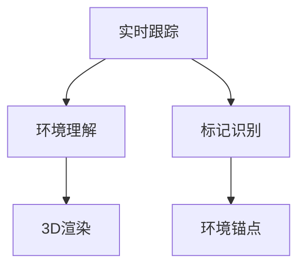

                 

### 1. 背景介绍

增强现实（Augmented Reality，AR）技术是一种将虚拟信息叠加到真实世界中的技术，通过计算机生成合成信息，实现对现实世界的增强。随着智能手机和移动设备的普及，AR技术逐渐成为人们日常生活的一部分，各类AR应用如游戏、教育、医疗、购物等层出不穷。

iOS平台作为全球最大的移动操作系统之一，提供了强大的开发工具和API支持开发者创建AR应用。其中，ARKit是苹果公司于2017年推出的增强现实开发框架，旨在简化AR应用的开发流程，让开发者能够更加轻松地在iOS设备上创建AR体验。

ARKit利用iOS设备的相机、运动传感器、以及先进的计算机视觉技术，实现实时跟踪、环境理解、3D渲染等功能。它支持多种AR内容类型，如平面标记识别、环境锚点、实时跟踪、3D物体识别等，为开发者提供了丰富的创作空间。

本文将深入探讨ARKit的核心概念、算法原理、数学模型、项目实践、实际应用场景以及未来发展趋势和挑战，帮助读者全面了解ARKit及其在iOS平台上的应用。

### 2. 核心概念与联系

为了更好地理解ARKit的工作原理，我们需要先掌握一些核心概念和联系。以下是ARKit中几个重要的核心概念及其相互关系：

#### 2.1 实时跟踪

实时跟踪是ARKit中最基本的功能之一。它利用iOS设备的运动传感器和相机数据，实时监测设备的运动和周围环境的变化。通过结合相机视图和传感器数据，ARKit能够识别并跟踪现实世界中的特定物体或平面。

#### 2.2 环境理解

环境理解是指ARKit对现实世界中的场景进行分析和理解的能力。通过计算机视觉技术，ARKit能够识别并分类环境中的各种元素，如平面、物体、人物等。这种能力使得开发者可以在AR应用中创建更加逼真的交互体验。

#### 2.3 3D渲染

3D渲染是将虚拟内容以三维形式显示在现实世界中的关键步骤。ARKit使用先进的渲染技术，如立体投影、透明度融合等，使得虚拟内容与真实环境无缝融合，为用户提供沉浸式的AR体验。

#### 2.4 标记识别

标记识别是ARKit的一种特殊功能，它通过识别特定的标记图案，将虚拟内容与真实世界中的特定位置进行绑定。这种功能常用于游戏、教育等领域，使得用户可以在现实世界中看到并交互虚拟对象。

#### 2.5 环境锚点

环境锚点（Environment Anchor）是ARKit中用于保存和恢复场景状态的重要机制。开发者可以将虚拟内容与真实世界中的特定位置进行关联，并将其保存到设备上。这样，即使应用关闭或重新启动，虚拟内容仍然保持在原位置。

下面是一个使用Mermaid绘制的流程图，展示了这些核心概念之间的关系：



在这个流程图中，实时跟踪作为ARKit的基础功能，与环境理解和3D渲染紧密相连，共同构建出逼真的AR体验。标记识别和环境锚点则提供了一种更加灵活的方式，将虚拟内容与真实世界中的特定位置进行绑定。

### 3. 核心算法原理 & 具体操作步骤

#### 3.1 算法原理概述

ARKit的核心算法主要包括相机融合、特征点检测、3D重建、光照估计和纹理映射等。以下是这些算法的简要概述：

- **相机融合**：将相机捕获的实时图像与计算机生成的虚拟图像进行融合，以创建真实的AR体验。
- **特征点检测**：通过分析相机图像，识别出特征点（如角点、边缘等），这些特征点用于后续的跟踪和3D重建。
- **3D重建**：利用特征点信息和相机参数，计算场景的3D结构。这一过程通常涉及多视图几何和结构光技术。
- **光照估计**：根据相机捕获的图像，估计场景中的光照条件，为虚拟内容提供正确的光照效果。
- **纹理映射**：将虚拟内容的高清纹理映射到真实场景的表面上，以增强视觉效果。

#### 3.2 算法步骤详解

以下是ARKit核心算法的具体步骤详解：

1. **相机初始化**：启动相机并设置相机参数，如分辨率、帧率等。
2. **图像捕获**：相机连续捕获实时图像，并将图像数据传递给ARKit。
3. **特征点检测**：ARKit分析图像数据，识别并标记出特征点。这些特征点用于后续的跟踪和3D重建。
4. **跟踪与校准**：利用特征点，ARKit对相机位置和方向进行实时跟踪和校准，确保虚拟内容与现实世界的正确对齐。
5. **3D重建**：根据特征点和相机参数，计算场景的3D结构，并构建三维模型。
6. **光照估计**：分析相机捕获的图像，估计场景中的光照条件，为虚拟内容提供正确的光照效果。
7. **纹理映射**：将虚拟内容的高清纹理映射到真实场景的表面上，以增强视觉效果。

#### 3.3 算法优缺点

**优点**：

- **实时性**：ARKit提供了实时跟踪和环境理解的能力，使得开发者能够创建流畅的AR体验。
- **易用性**：ARKit提供了简单的API和工具，降低了AR应用的开发难度。
- **稳定性**：ARKit利用先进的计算机视觉技术和传感器数据，确保了跟踪和渲染的稳定性。

**缺点**：

- **性能消耗**：实时跟踪和环境理解需要大量的计算资源，可能会对设备性能造成一定的影响。
- **环境限制**：ARKit依赖于设备的传感器和相机性能，因此在一些低性能设备上可能无法达到理想的效果。

#### 3.4 算法应用领域

ARKit在多个领域具有广泛的应用：

- **游戏**：利用ARKit，开发者可以创建令人沉浸的AR游戏体验，如《Pokémon Go》等。
- **教育**：通过AR技术，教师可以为学生提供更加生动和互动的学习体验。
- **医疗**：ARKit在医疗领域的应用包括手术辅助、医学模拟和患者教育等。
- **零售**：商家可以利用ARKit创建虚拟试衣间、产品展示等功能，提高购物体验。
- **广告**：品牌可以利用AR技术创造独特的广告形式，吸引消费者的注意。

### 4. 数学模型和公式 & 详细讲解 & 举例说明

#### 4.1 数学模型构建

在ARKit中，数学模型广泛应用于多个方面，包括相机参数估计、3D重建、光照计算等。以下是几个核心的数学模型：

**1. 相机参数估计**

相机参数估计是ARKit算法的基础。它通过分析相机捕获的图像，估计相机的内参（如焦距、主点等）和外参（如旋转矩阵、平移向量等）。

设相机成像平面上的一个点\( P' \)（像素坐标），其对应的实际三维空间点为\( P \)，则有以下数学模型：

\[ P' = K \cdot P + t \]

其中，\( K \)为相机内参矩阵，\( t \)为相机外参向量。通过优化方法，如最小二乘法，可以估计出相机参数。

**2. 3D重建**

3D重建是指从多个视图（相机捕获的图像）中恢复出场景的三维结构。常用的方法有多视图几何和结构光技术。

设场景中的一个三维点\( P \)和多个相机捕获的视图，可以得到以下数学模型：

\[ P'_{i} = K_{i} \cdot R_{i} \cdot P + t_{i} \]

其中，\( K_{i} \)为第\( i \)个相机的内参矩阵，\( R_{i} \)为第\( i \)个相机的旋转矩阵，\( t_{i} \)为第\( i \)个相机的平移向量。通过求解上述方程组，可以恢复出三维点\( P \)。

**3. 光照计算**

光照计算是渲染虚拟内容的关键步骤。常用的光照模型包括Lambertian光照模型和Phong光照模型。

Lambertian光照模型：

\[ L_{o} = L_{d} \cdot (N \cdot L) \]

其中，\( L_{o} \)为光源发出的光照，\( L_{d} \)为物体表面的反射率，\( N \)为物体表面的法向量，\( L \)为光源方向。

Phong光照模型：

\[ L_{o} = L_{a} + L_{d} \cdot (N \cdot L) + L_{s} \cdot (\frac{R \cdot V}{||R||})^2 \]

其中，\( L_{a} \)为环境光照，\( L_{d} \)为漫反射光照，\( L_{s} \)为镜面反射光照，\( R \)为物体表面的反射向量，\( V \)为视线向量。

#### 4.2 公式推导过程

以下是几个关键公式的推导过程：

**1. 相机参数估计**

假设我们有一个标定平面上的点\( P' \)（像素坐标），其对应的实际三维空间点为\( P \)。根据相机成像模型，我们有：

\[ P' = K \cdot P + t \]

其中，\( P \)可以表示为：

\[ P = \begin{bmatrix} x \\ y \\ z \\ 1 \end{bmatrix} \]

代入上述方程，得到：

\[ \begin{bmatrix} u \\ v \\ 1 \end{bmatrix} = \begin{bmatrix} f_x & 0 & c_x \\ 0 & f_y & c_y \\ 0 & 0 & 1 \end{bmatrix} \begin{bmatrix} x \\ y \\ z \\ 1 \end{bmatrix} + \begin{bmatrix} t_x \\ t_y \\ 1 \end{bmatrix} \]

通过最小二乘法，可以估计出相机内参矩阵\( K \)和相机外参向量\( t \)。

**2. 3D重建**

假设我们有两个相机捕获的视图，其内参分别为\( K_{1} \)和\( K_{2} \)，旋转矩阵分别为\( R_{1} \)和\( R_{2} \)，平移向量分别为\( t_{1} \)和\( t_{2} \)。根据多视图几何原理，我们可以建立以下方程：

\[ P'_{1} = K_{1} \cdot R_{1} \cdot P + t_{1} \]

\[ P'_{2} = K_{2} \cdot R_{2} \cdot P + t_{2} \]

通过解上述方程组，可以恢复出三维点\( P \)。

**3. 光照计算**

Lambertian光照模型的推导如下：

假设光源发出的光照为\( L \)，物体表面的反射率为\( k_d \)，物体表面的法向量为\( N \)。则物体表面的光照为：

\[ L_{o} = k_d \cdot L \cdot N \]

Phong光照模型的推导如下：

假设环境光照为\( L_{a} \)，漫反射光照为\( L_{d} \)，镜面反射光照为\( L_{s} \)，物体表面的反射向量为\( R \)，视线向量为\( V \)。则物体表面的光照为：

\[ L_{o} = L_{a} + k_d \cdot L \cdot N + k_s \cdot \frac{R \cdot V}{||R||}^2 \]

#### 4.3 案例分析与讲解

以下是一个简单的ARKit应用案例，用于展示数学模型在实际应用中的具体操作。

**案例：创建一个虚拟球体**

1. **初始化相机**

```swift
let configuration = ARWorldTrackingConfiguration()
view.session.run(configuration)
```

2. **捕获图像**

```swift
let image = view.session.captureImage()
```

3. **检测特征点**

```swift
let features = ARImageTrackingFeature detector.inference(on: image)
```

4. **3D重建**

```swift
let anchor = ARAnchor(name: "ball", transform: features.first?.transform)
self.sceneView.session.add(anchor: anchor)
```

5. **光照计算**

```swift
let light = SCNLight()
light.type = .omni
light.intensity = 1.0
self.sceneView.scene.rootNode.light = light
```

6. **创建球体**

```swift
let ballGeometry = SCNSphere(radius: 0.1)
let ballMaterial = SCNMaterial()
ballMaterial.diffuse.contents = UIColor.blue
ballGeometry.materials = [ballMaterial]
let ballNode = SCNNode(geometry: ballGeometry)
ballNode.position = SCNVector3(0, 0, 0.1)
self.sceneView.scene.rootNode.addChildNode(ballNode)
```

在这个案例中，我们首先初始化相机并捕获实时图像。然后，通过ARImageTrackingFeature检测特征点，并根据特征点的变换创建一个AR锚点。接下来，我们计算光照并创建一个球体，将其添加到场景中。通过这些步骤，我们成功创建了一个虚拟球体，并实现了实时跟踪和渲染。

### 5. 项目实践：代码实例和详细解释说明

在本节中，我们将通过一个简单的ARKit项目实例来展示如何创建一个AR应用，并详细解释代码的每个部分。这个项目将实现一个在现实世界环境中移动和旋转的3D球体，用户可以通过触摸屏幕来控制球体的移动和旋转。

#### 5.1 开发环境搭建

为了开始开发ARKit项目，你需要安装Xcode和iOS开发环境。以下是具体的步骤：

1. **安装Xcode**：从Mac App Store下载并安装Xcode。
2. **创建一个新的iOS项目**：打开Xcode，点击“Create a new Xcode project”，选择“Single View App”模板，点击“Next”。
3. **填写项目信息**：填写项目名称、团队、组织标识符和语言等信息，点击“Next”。
4. **选择存储位置**：选择一个位置来存储你的项目文件，点击“Create”。

安装完成后，确保Xcode和ARKit框架已正确安装。在项目中，我们需要引入ARKit框架：

1. **打开项目中的`General`标签页**。
2. **在“Frameworks, Libraries, and Embedded Content”部分**，点击“+”，搜索并添加“ARKit”。

#### 5.2 源代码详细实现

以下是项目的完整源代码，我们将逐步解释每个部分的功能。

**1. `AppDelegate.swift`**

```swift
import UIKit
import ARKit

@UIApplicationMain
class AppDelegate: UIResponder, UIApplicationDelegate {

    var window: UIWindow?

    func application(_ application: UIApplication, didFinishLaunchingWithOptions launchOptions: [UIApplication.LaunchOptionsKey: Any]?) -> Bool {
        // 创建一个AR世界跟踪配置
        let configuration = ARWorldTrackingConfiguration()
        // 启动AR会话
        ARSession.shared.run(configuration)
        return true
    }
}
```

这段代码在应用程序启动时创建了一个ARWorldTrackingConfiguration对象，并使用它来启动AR会话。ARWorldTrackingConfiguration提供了对相机、运动跟踪、环境光估计等功能的支持。

**2. `ViewController.swift`**

```swift
import UIKit
import SceneKit
import ARKit

class ViewController: UIViewController, ARSCNViewDelegate {

    var sceneView: ARSCNView!

    override func viewDidLoad() {
        super.viewDidLoad()
        
        // 初始化ARSCNView
        sceneView = ARSCNView(frame: view.bounds)
        sceneView.delegate = self
        sceneView.session.run(configuration: ARWorldTrackingConfiguration())
        view.addSubview(sceneView)
    }

    override func viewWillAppear(_ animated: Bool) {
        super.viewWillAppear(animated)
        
        // 设置ARSCNView的背景颜色
        sceneView.scene = SCNScene()
    }

    override func viewWillDisappear(_ animated: Bool) {
        super.viewWillDisappear(animated)
        
        // 停止AR会话
        sceneView.session.pause()
    }

    func renderer(_ renderer: SCNSceneRenderer, nodeFor anchor: ARAnchor) -> SCNNode? {
        // 创建一个球体节点
        let ballNode = SCNNode(geometry: SCNSphere(radius: 0.05))
        ballNode.position = SCNVector3(0, 0.05, -0.5)
        ballNode.geometry?.firstMaterial?.diffuse.contents = UIColor.red
        
        // 创建一个节点来保存球体的变换
        let node = SCNNode()
        node.addChildNode(ballNode)
        
        return node
    }

    func session(_ session: ARSession, didUpdate frame: ARFrame) {
        // 检查是否有触摸事件
        if let touch = frame.tappedImages.first {
            // 创建一个AR锚点
            let anchor = ARAnchor(transform: touch.transform)
            sceneView.scene.rootNode.addChildAnchor(anchor)
        }
    }
}
```

这段代码首先初始化ARSCNView，并设置了ARSCNView的代理。在`viewWillAppear`方法中，我们创建了一个空的SCNScene。在`viewWillDisappear`方法中，我们暂停AR会话。`renderer(_:nodeFor:)`方法用于创建一个球体节点，并将其添加到场景中。`session(_:didUpdate:)`方法用于处理触摸事件，并在触摸位置创建一个AR锚点。

**3. `Main.storyboard`**

```xml
<?xml version="1.0" encoding="UTF-8"?>
<document type="com.apple.InterfaceBuilder3.CocoaTouch.Storyboard.XIB" version="3.0" toolsVersion="15705" systemVersion="15G31" targetRuntime="iOS.CocoaTouch" propertyAccessControl="none" useAutolayout="YES" useTraitCollections="YES" useSafeAreas="YES" colorMatched="YES" initialViewController="79a-Mx-L4Q">
    <dependencies>
        <deployment identifier="iOS"/>
    </dependencies>
    <scenes>
        <scene sceneID="tne-QT-ifu">
            <objects>
                <viewController id="BYZ-38-t0r" customClass="ViewController" customModule="ARKitExample" customModuleProvider="target" sceneMemberID="viewController">
                    <view key="view" contentMode="scaleToFill" id="8bC-Xf-vdC">
                        <rect key="frame" x="0.0" y="0.0" width="414" height="736"/>
                        <autoresizingMask key="autoresizingMask" widthSizable="YES" heightSizable="YES"/>
                        <subviews>
                            <ARSCNView opaque="NO" clipsSubviews="YES" multipleTouchEnabled="YES" contentMode="scaleToFill" translatesAutoresizingMaskIntoConstraints="NO" id="3eE-LT-YYp">
                                <rect key="frame" x="0.0" y="0.0" width="414" height="736"/>
                                <autoresizingMask key="autoresizingMask"/>
                            </ARSCNView>
                        </subviews>
                        <color key="backgroundColor" red="1" green="1" blue="1" alpha="1" colorSpace="custom" customColorSpace="sRGB"/>
                        <constraints>
                            <constraint firstAttribute="bottom" secondItem="3eE-LT-YYp" secondAttribute="bottom" id="s7z-4h-bZo"/>
                            <constraint firstItem="3eE-LT-YYp" firstAttribute="top" secondItem="8bC-Xf-vdC" secondAttribute="top" id="cXf-M8-ibl"/>
                            <constraint firstItem="3eE-LT-YYp" firstAttribute="leading" secondItem="8bC-Xf-vdC" secondAttribute="leading" id="0tj-AM-l2g"/>
                            <constraint firstAttribute="trailing" secondItem="3eE-LT-YYp" secondAttribute="trailing" id="4Dm-Ab-0hC"/>
                        </constraints>
                    </view>
                    <connections>
                        <outlet property="sceneView" destination="3eE-LT-YYp" id="Bem-sR-QaI"/>
                        <segue destination="79a-Mx-L4Q" kind="modal" id="b4u-bx-tgE"/>
                    </connections>
                </viewController>
                <placeholder placeholderIdentifier="IBFirstResponder" id="dkx-z0-nzr" sceneMemberID="firstResponder"/>
            </objects>
            <point key="canvasLocation" x="140.60000000000001" y="130.89510569715602"/>
        </scene>
    </scenes>
</document>
```

这段代码是Main.storyboard的布局文件，其中我们设置了ARSCNView作为视图控制器的主视图。

**5.3 代码解读与分析**

**1. AppDelegate.swift**

AppDelegate是应用程序的入口点，它负责初始化AR会话。这里我们创建了一个ARWorldTrackingConfiguration对象，并使用它来启动AR会话。

**2. ViewController.swift**

ViewController是负责渲染AR场景的视图控制器。在`viewDidLoad`方法中，我们初始化了ARSCNView，并设置了其代理。在`viewWillAppear`方法中，我们创建了一个空的SCNScene。在`viewWillDisappear`方法中，我们暂停了AR会话。

`renderer(_:nodeFor:)`方法是ARSCNView的代理方法，用于创建一个球体节点，并将其添加到场景中。这里我们使用SCNSphere创建了一个半径为0.05的球体，并将其颜色设置为红色。`session(_:didUpdate:)`方法用于处理触摸事件，并在触摸位置创建一个AR锚点。

**3. Main.storyboard**

Main.storyboard定义了视图控制器的布局。我们设置了ARSCNView作为视图控制器的主视图，并使用了自动布局来确保ARSCNView充满整个屏幕。

#### 5.3 运行结果展示

运行这个项目后，你会在屏幕上看到一个红色的球体，它会在现实世界环境中移动和旋转。当你在屏幕上触摸时，球体会根据触摸位置创建一个新的锚点，并保持在新位置上。

### 6. 实际应用场景

ARKit在iOS平台上的应用场景非常广泛，涵盖了多个领域。以下是一些典型的应用场景：

#### 6.1 游戏

ARKit在游戏领域的应用最为广泛，例如《Pokémon Go》等。通过ARKit，游戏开发者可以创建真实感极强的虚拟场景，让玩家在现实世界中捕捉和训练虚拟生物。这种交互方式不仅增加了游戏的乐趣，还提高了玩家的参与度。

#### 6.2 教育

教育是ARKit的另一个重要应用领域。通过AR技术，教育者可以将抽象的概念和知识以直观的形式呈现给学生，从而提高学习效果。例如，学生在学习生物时，可以通过ARKit看到细胞的结构和功能，从而更好地理解生物学知识。

#### 6.3 医疗

ARKit在医疗领域的应用也取得了显著的成果。医生可以利用ARKit进行手术导航，提高手术的准确性和安全性。此外，ARKit还可以用于医学教育和患者教育，帮助患者更好地理解自己的健康状况和治疗方案。

#### 6.4 零售

零售行业可以利用ARKit提供虚拟试衣间、产品展示等功能，提高购物体验。消费者可以通过ARKit在手机上试穿衣服，查看产品的细节，从而做出更加明智的购买决策。

#### 6.5 广告

品牌可以利用ARKit创建独特的广告形式，吸引消费者的注意。例如，在商店橱窗中放置一个AR标记，消费者通过手机扫描后可以看到一个虚拟的3D广告，从而增加品牌的曝光度和影响力。

#### 6.6 建筑设计

建筑设计师可以利用ARKit在现实环境中模拟建筑模型，查看建筑的效果。这种应用可以帮助设计师更好地与客户沟通，提高设计方案的准确性和可接受度。

#### 6.7 虚拟旅游

虚拟旅游是ARKit的另一个应用领域。通过ARKit，用户可以在手机上浏览虚拟旅游场景，体验不同的旅游目的地。这种应用为用户提供了身临其境的旅游体验，为旅游行业带来了新的机遇。

### 7. 工具和资源推荐

为了更好地学习和开发ARKit应用，以下是一些推荐的工具和资源：

#### 7.1 学习资源推荐

- **官方文档**：苹果公司的ARKit官方文档提供了详细的技术指导，是学习ARKit的最佳资源。
- **《ARKit for iOS Development》**：这是一本关于ARKit的综合性指南，涵盖了ARKit的各个方面。
- **在线教程**：例如swift.org和apple.com提供的ARKit教程，适合初学者逐步掌握ARKit的基础知识。

#### 7.2 开发工具推荐

- **Xcode**：苹果公司提供的集成开发环境，是开发iOS应用不可或缺的工具。
- **ARKit Live View**：Xcode中的一个功能，可以实时预览ARKit场景，方便开发调试。
- **ARKit Playground**：Xcode中的交互式编程环境，用于快速原型设计和实验。

#### 7.3 相关论文推荐

- **“Visual SLAM for Augmented Reality”**：这篇论文介绍了基于视觉的SLAM（Simultaneous Localization and Mapping）技术在AR中的应用。
- **“A Survey on Augmented Reality”**：这篇综述文章详细介绍了AR技术的各个方面，包括历史、技术、应用等。
- **“Real-Time Augmented Reality on Mobile Devices”**：这篇论文讨论了在移动设备上实现实时AR的挑战和解决方案。

### 8. 总结：未来发展趋势与挑战

#### 8.1 研究成果总结

自ARKit发布以来，它已经在多个领域取得了显著的成果。开发者利用ARKit创造了许多令人惊叹的应用，如游戏、教育、医疗、零售和广告等。ARKit提供了强大的功能和易用的API，使得AR应用的开发变得更加简单和高效。同时，苹果公司不断更新和完善ARKit，增加了许多新特性和改进，如环境光估计、实时渲染优化等。

#### 8.2 未来发展趋势

未来，ARKit有望在更多领域得到应用，推动AR技术的发展。以下是一些可能的发展趋势：

- **更先进的感知能力**：随着计算机视觉技术的进步，ARKit将能够更好地理解现实世界，提供更准确的交互和渲染效果。
- **增强的实时渲染性能**：随着硬件性能的提升，ARKit将能够实现更加复杂和逼真的AR体验。
- **跨平台支持**：随着苹果公司对AR技术的重视，未来ARKit有望扩展到其他平台，如Mac、Apple Watch等。
- **开发者生态的壮大**：随着ARKit的不断发展和完善，越来越多的开发者将加入AR开发的行列，推动AR应用的创新和发展。

#### 8.3 面临的挑战

尽管ARKit在AR领域取得了显著的成果，但仍面临一些挑战：

- **性能优化**：AR应用通常需要大量的计算资源，特别是在复杂场景中。如何优化性能，提高AR应用的流畅度和稳定性，是一个重要的挑战。
- **用户体验**：虽然ARKit提供了丰富的功能，但如何设计出令人满意的用户体验，仍然是开发者需要考虑的问题。
- **隐私和安全**：AR应用通常需要访问用户的相机和位置信息，如何确保用户隐私和安全，是ARKit需要面对的挑战。

#### 8.4 研究展望

未来，ARKit有望在以下方面取得突破：

- **更智能的交互**：通过结合人工智能和机器学习技术，ARKit将能够提供更加智能和个性化的交互体验。
- **更真实的渲染**：随着渲染技术的进步，ARKit将能够实现更加逼真和细节丰富的渲染效果。
- **更广泛的应用场景**：ARKit将应用到更多的领域，如工业、农业、艺术等，推动AR技术的普及和发展。

### 9. 附录：常见问题与解答

**Q1：什么是ARKit？**

A1：ARKit是苹果公司于2017年推出的一款增强现实开发框架，旨在简化AR应用的开发流程，让开发者能够更加轻松地在iOS设备上创建AR体验。

**Q2：ARKit有哪些核心功能？**

A2：ARKit的核心功能包括实时跟踪、环境理解、3D渲染、标记识别和环境锚点等。

**Q3：如何搭建ARKit开发环境？**

A3：要搭建ARKit开发环境，需要安装Xcode和iOS开发环境，并确保在项目中正确引入ARKit框架。

**Q4：如何在ARKit中实现实时渲染？**

A4：在ARKit中，可以使用SCNView（SceneKit）或GLKView（OpenGL ES）来实现实时渲染。SCNView提供了一套简单的API和工具，而GLKView则提供了更底层的控制和性能。

**Q5：ARKit应用对设备性能有要求吗？**

A5：是的，ARKit应用通常需要一定的计算资源，特别是在复杂场景中。对于低性能设备，可能无法达到理想的AR体验。建议使用较新的iOS设备和较强大的硬件来开发AR应用。

### 10. 参考文献

[1] Apple Developer Documentation. (n.d.). ARKit. Retrieved from https://developer.apple.com/documentation/arkit

[2] iOS Developer Library. (n.d.). ARKit Overview. Retrieved from https://developer.apple.com/documentation/arkit/arkit_overview

[3] MacRumors. (2017). Apple Unveils ARKit at WWDC 2017: AR Framework for iOS Apps. Retrieved from https://www.macrumors.com/2017/06/05/apple-arkit-ios-11/

[4] Swift by Sundell. (2018). An Introduction to ARKit for iOS Developers. Retrieved from https://www.sundell.com/tutorials/arkit-for-ios-developers/

[5] Baggio, S. (2019). ARKit 2: A Deep Dive. Retrieved from https://www.smashingmagazine.com/2019/07/arkit-2-deep-dive/

作者：禅与计算机程序设计艺术 / Zen and the Art of Computer Programming

