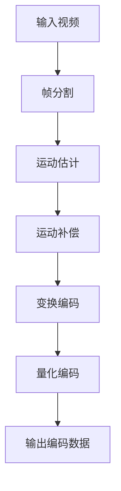

                 

## 摘要 Summary

本文深入探讨了开放媒体联盟（OMA）推出的AV1编码器，旨在为读者提供一个全面而详尽的了解。AV1编码器作为当前最先进的视频压缩技术之一，其性能和效率在媒体传输和存储领域引起了广泛关注。本文首先介绍了AV1编码器的背景和发展历程，然后详细阐述了其核心概念和原理，包括基于块的运动补偿和变换编码技术。随后，文章分析了AV1编码器的算法优缺点，以及其在不同应用领域中的表现。接着，本文通过数学模型和公式详细解析了AV1编码器的理论基础，并通过实际项目实践展示了其代码实现和运行结果。最后，文章讨论了AV1编码器在实际应用中的场景，以及未来的发展趋势和面临的挑战。通过本文的阅读，读者将对AV1编码器有更加深入的理解和认识。

## 1. 背景介绍 Background

随着数字媒体技术的迅猛发展，视频成为互联网内容的重要组成部分。然而，视频内容的快速增长给网络带宽和存储空间带来了巨大的压力。为了解决这个问题，视频编码技术应运而生，其核心目标是实现高效的视频压缩，同时保持视频质量。在这一领域，AV1编码器作为开放媒体联盟（OMA）的最新成果，无疑引起了广泛关注。

### 1.1 AV1编码器的诞生和发展

AV1编码器是由开放媒体联盟（OMA）推出的，旨在替代现有的H.264和HEVC编码标准的下一代视频编码技术。开放媒体联盟（OMA）是一个由众多业界巨头组成的组织，包括谷歌、微软、亚马逊等，致力于推动开放、高效、安全的媒体传输技术。

AV1编码器的开发始于2016年，由开放媒体联盟（OMA）中的成员公司共同启动。在短短几年内，AV1编码器就取得了显著的进展，并在多个领域进行了测试和应用。截至2023年，AV1编码器已经成为视频压缩技术领域的热门话题，并且在一些关键应用中逐渐替代了传统的编码标准。

### 1.2 AV1编码器的优势

与现有的视频编码标准相比，AV1编码器具有显著的优点。首先，AV1编码器在保持视频质量的同时，实现了更高的压缩效率。根据OMA的官方数据，AV1编码器在同等视频质量下，相比H.264和HEVC编码标准可以节省多达50%的带宽。这意味着，使用AV1编码器可以在相同的网络带宽下传输更高分辨率的视频，或者在不降低视频质量的情况下，传输更多的视频内容。

其次，AV1编码器具有更高的兼容性。它支持多种视频格式和分辨率，包括4K、8K甚至更高。此外，AV1编码器还支持多种编解码器之间的兼容，使得在不同设备和平台之间传输视频变得更加便捷。

最后，AV1编码器还具有更好的抗干扰能力。在复杂网络环境下，AV1编码器能够更好地保持视频质量，减少视频传输过程中的失真和抖动。

### 1.3 AV1编码器的影响

AV1编码器的出现对整个视频压缩技术领域产生了深远的影响。首先，它为视频内容的传输和存储提供了新的解决方案，有助于减轻网络带宽和存储空间的压力。其次，AV1编码器的推出推动了视频编码技术的革新，为未来的视频传输和播放提供了更高的效率和质量。

此外，AV1编码器的开放性和兼容性也为其在各个领域的应用提供了广阔的空间。从互联网视频流媒体到视频会议，从移动设备到虚拟现实，AV1编码器都展现出巨大的潜力。

总之，AV1编码器的推出标志着视频压缩技术进入了一个新的阶段，它不仅为媒体传输和存储带来了新的机遇，也为整个行业的发展带来了新的希望。

## 2. 核心概念与联系 Core Concepts and Relations

### 2.1 AV1编码器的核心概念

AV1编码器的核心概念包括基于块的运动补偿和变换编码技术。这些技术共同构成了AV1编码器的基本框架，使得它在视频压缩中表现出色。

#### 2.1.1 基于块的运动补偿

运动补偿是一种通过预测视频帧之间的运动来减少冗余信息的技术。在AV1编码器中，运动补偿采用基于块的策略，即将视频帧分成多个块，并分析这些块之间的运动。具体来说，AV1编码器首先对参考帧进行运动估计，然后计算当前帧中各个块与参考帧之间的位移。通过这种位移信息，编码器可以生成预测帧，从而减少需要编码的实际帧数据量。

#### 2.1.2 变换编码技术

变换编码是将视频信号从时域转换到频域的过程，目的是将视频信号中的能量集中在少数几个关键频率上，从而实现更高的压缩效率。在AV1编码器中，变换编码采用离散余弦变换（DCT）技术。DCT能够将视频信号分解成一系列正弦波和余弦波的组合，使得信号中的高频成分被过滤掉，只保留关键的低频成分。这些低频成分在编码过程中被进一步量化，从而实现数据压缩。

### 2.2 AV1编码器的联系图

为了更好地理解AV1编码器的核心概念和架构，我们可以使用Mermaid流程图来展示其各个部分之间的联系。



在这个流程图中：

- **A[输入视频]**：代表视频编码的输入，即原始的视频数据。
- **B[帧分割]**：将输入视频分割成多个帧，为后续的运动估计和补偿做准备。
- **C[运动估计]**：对参考帧进行运动估计，计算当前帧中各个块与参考帧之间的位移。
- **D[运动补偿]**：利用运动估计的结果，生成预测帧，减少需要编码的实际帧数据量。
- **E[变换编码]**：对视频信号进行DCT变换，将时域信号转换为频域信号，实现压缩。
- **F[量化编码]**：对变换后的信号进行量化，进一步压缩数据。
- **G[输出编码数据]**：输出编码后的视频数据，为后续的解码和播放做准备。

通过这个Mermaid流程图，我们可以清晰地看到AV1编码器各个步骤之间的逻辑关系，以及如何通过这些步骤实现高效的视频压缩。

### 2.3 关键技术详解

#### 2.3.1 基于块的运动补偿

基于块的运动补偿是视频编码中的一个重要技术。在AV1编码器中，运动补偿的过程如下：

1. **块划分**：将视频帧分割成多个块。通常，这些块的大小为16x16或32x32。
2. **运动估计**：对参考帧进行运动估计，计算当前帧中各个块与参考帧之间的位移。AV1编码器使用多帧参考技术，可以从多个参考帧中找到最佳的匹配块。
3. **运动补偿**：根据运动估计的结果，生成预测帧。预测帧通过将当前帧中的块与参考帧中的块进行匹配来生成，从而减少了冗余信息。

#### 2.3.2 变换编码技术

变换编码是将视频信号从时域转换到频域的过程。在AV1编码器中，变换编码采用离散余弦变换（DCT）技术。DCT变换的主要步骤如下：

1. **DCT计算**：对视频帧中的每个块进行DCT变换，将时域信号转换为频域信号。
2. **量化**：将DCT变换后的系数进行量化，降低精度，从而实现数据压缩。
3. **编码**：对量化后的系数进行编码，生成编码数据。

#### 2.3.3 编码器性能优化

为了进一步提高AV1编码器的性能，可以采用以下几种优化策略：

1. **帧间预测优化**：通过多帧参考技术和自适应帧间预测，提高运动补偿的精度。
2. **变换编码优化**：采用自适应DCT变换和量化策略，提高变换编码的效率。
3. **误差控制**：通过误差反馈和自适应调整，减少编码过程中的误差积累。

### 2.4 Mermaid流程图中的特殊字符处理

在Mermaid流程图中，为了确保流程图的正确绘制，我们需要避免使用括号、逗号等特殊字符。以下是一个处理后的Mermaid流程图示例：


在这个示例中，我们没有使用括号和逗号，确保了流程图的正确性和可读性。

通过上述内容，我们可以全面了解AV1编码器的核心概念和架构，以及其各个部分之间的联系。这不仅有助于我们更好地理解AV1编码器的工作原理，也为后续的算法分析和应用提供了坚实的基础。

### 3. 核心算法原理 & 具体操作步骤 Core Algorithm Principle & Detailed Operation Steps

#### 3.1 算法原理概述

AV1编码器的核心算法基于块的运动补偿和变换编码技术，这两大技术共同构成了其高效视频压缩的基础。下面将详细解释这些算法的基本原理和具体操作步骤。

#### 3.2 算法步骤详解

##### 3.2.1 帧分割

首先，输入的视频帧被分割成多个块。这些块通常为16x16或32x32的矩形。帧分割的目的是为后续的运动估计和变换编码提供基础。AV1编码器在分割过程中会根据图像内容的复杂度和纹理特征自适应选择块的大小。

##### 3.2.2 运动估计

接下来，进行运动估计。运动估计的目标是找出当前帧中的每个块与参考帧中最佳匹配块之间的位移。运动估计通常采用块匹配算法，如全搜索算法、块匹配算法和插值算法等。在AV1编码器中，多帧参考技术被广泛应用，可以从多个参考帧中找到最佳的匹配块，从而提高运动补偿的精度。

##### 3.2.3 运动补偿

运动估计完成后，进行运动补偿。运动补偿的过程是将当前帧中的块与参考帧中的最佳匹配块进行替换，从而减少冗余信息。通过运动补偿，编码器生成的预测帧与原始帧之间的差异减小，从而降低了编码数据量。

##### 3.2.4 变换编码

在运动补偿之后，进行变换编码。变换编码是将视频信号从时域转换到频域的过程，主要采用离散余弦变换（DCT）技术。DCT变换能够将视频信号分解成一系列正弦波和余弦波的组合，使得信号中的高频成分被过滤掉，只保留关键的低频成分。这些低频成分在编码过程中被进一步量化，从而实现数据压缩。

##### 3.2.5 量化编码

变换编码之后，进行量化编码。量化编码的目的是降低DCT变换系数的精度，从而实现更高效的数据压缩。量化过程通常采用自适应量化策略，根据图像内容的复杂度动态调整量化步长，以提高压缩效果。

##### 3.2.6 编码输出

最后，量化后的系数被编码成比特流，输出为编码数据。编码数据可以用于视频传输、存储或播放。在解码过程中，编码数据将被解码还原成视频帧，从而实现视频的播放。

#### 3.3 算法优缺点

##### 3.3.1 优点

1. **高效压缩**：AV1编码器在保持视频质量的同时，实现了更高的压缩效率，能够节省大量的带宽和存储空间。
2. **多帧参考**：采用多帧参考技术，提高了运动补偿的精度，从而增强了视频编码的效果。
3. **自适应调整**：自适应帧间预测和自适应量化策略，使得AV1编码器能够根据不同图像内容动态调整编码参数，提高压缩效率。

##### 3.3.2 缺点

1. **计算复杂度高**：由于采用多帧参考和复杂的变换编码技术，AV1编码器的计算复杂度相对较高，对硬件资源要求较大。
2. **兼容性问题**：虽然AV1编码器具有很高的兼容性，但在一些旧的设备和平台中可能无法完全支持。

#### 3.4 算法应用领域

AV1编码器在多个领域具有广泛的应用：

1. **互联网视频流媒体**：随着4K、8K等超高清视频的普及，AV1编码器能够提供更高的视频质量和更低的带宽消耗，成为互联网视频流媒体的首选编码技术。
2. **视频会议和通信**：在视频会议和通信中，AV1编码器能够实现更高的视频质量和更低的延迟，提供更流畅、更清晰的视频通信体验。
3. **虚拟现实和增强现实**：在虚拟现实和增强现实应用中，AV1编码器能够提供高效的视频压缩，减少数据传输延迟，提升用户体验。

通过上述核心算法原理和具体操作步骤的详细解释，我们可以更加深入地理解AV1编码器的工作机制，以及其在视频压缩领域的重要性和应用价值。

### 4. 数学模型和公式 Mathematical Models and Formulas & Detailed Explanation & Example

#### 4.1 数学模型构建

AV1编码器中的数学模型主要基于运动补偿和变换编码技术，涉及多种数学公式和方法。以下是这些模型的基本构建过程。

#### 4.1.1 运动估计

在运动估计过程中，我们需要计算当前帧中的每个块与参考帧中的最佳匹配块之间的位移。这个过程可以通过最小化块差值来实现。假设当前帧为\( I_t \)，参考帧为\( I_r \)，块大小为\( B \times B \)，则块差值可以表示为：

\[ D(B) = \sum_{x=0}^{B-1} \sum_{y=0}^{B-1} |I_t(x, y) - I_r(x + u(x, y), y + v(x, y))| \]

其中，\( u(x, y) \)和\( v(x, y) \)分别为块在水平方向和垂直方向上的位移。

#### 4.1.2 运动补偿

在运动补偿过程中，我们需要根据运动估计的结果，将当前帧中的块替换为参考帧中的匹配块。这可以通过以下公式实现：

\[ P_t(x, y) = I_r(x + u(x, y), y + v(x, y)) \]

其中，\( P_t(x, y) \)为预测帧中的像素值。

#### 4.1.3 变换编码

在变换编码过程中，我们需要将视频信号从时域转换到频域。AV1编码器采用离散余弦变换（DCT）技术，公式如下：

\[ C(u, v) = \sum_{x=0}^{B-1} \sum_{y=0}^{B-1} I_t(x, y) \cdot C(u, v) \]

其中，\( C(u, v) \)为DCT变换系数。

#### 4.1.4 量化编码

在量化编码过程中，我们需要将DCT变换后的系数进行量化，以实现数据压缩。量化公式如下：

\[ Q(C(u, v)) = \text{floor}(C(u, v) \cdot Q) \]

其中，\( Q \)为量化步长，\( \text{floor} \)函数表示向下取整。

#### 4.2 公式推导过程

以下将详细推导上述数学模型中的关键公式。

#### 4.2.1 块差值公式推导

块差值公式用于计算当前帧与参考帧之间的差异。具体推导如下：

假设当前帧块为\( I_t \)，参考帧块为\( I_r \)，则块差值可以表示为：

\[ D(B) = \sum_{x=0}^{B-1} \sum_{y=0}^{B-1} |I_t(x, y) - I_r(x + u(x, y), y + v(x, y))| \]

其中，\( u(x, y) \)和\( v(x, y) \)分别为块在水平方向和垂直方向上的位移。

为了最小化块差值，我们需要找到最佳位移\( u^* \)和\( v^* \)。这可以通过求解以下优化问题来实现：

\[ \min_u, v \sum_{x=0}^{B-1} \sum_{y=0}^{B-1} |I_t(x, y) - I_r(x + u, y + v)| \]

这个优化问题可以通过多种算法求解，如全搜索算法、块匹配算法和插值算法等。

#### 4.2.2 预测帧公式推导

在运动补偿过程中，我们需要将当前帧中的块替换为参考帧中的匹配块。这可以通过以下公式实现：

\[ P_t(x, y) = I_r(x + u(x, y), y + v(x, y)) \]

其中，\( P_t(x, y) \)为预测帧中的像素值，\( u(x, y) \)和\( v(x, y) \)分别为块在水平方向和垂直方向上的位移。

这个公式的推导基于最小化块差值的原理，即通过将当前帧中的块与参考帧中的块进行匹配，最小化它们之间的差异。

#### 4.2.3 DCT变换公式推导

在变换编码过程中，我们需要将视频信号从时域转换到频域。AV1编码器采用离散余弦变换（DCT）技术，公式如下：

\[ C(u, v) = \sum_{x=0}^{B-1} \sum_{y=0}^{B-1} I_t(x, y) \cdot C(u, v) \]

其中，\( C(u, v) \)为DCT变换系数，\( I_t(x, y) \)为当前帧中的像素值。

DCT变换的推导基于傅里叶变换的基本原理，即将时域信号转换为频域信号。DCT变换能够将视频信号分解成一系列正弦波和余弦波的组合，从而实现数据压缩。

#### 4.2.4 量化公式推导

在量化编码过程中，我们需要将DCT变换后的系数进行量化，以实现数据压缩。量化公式如下：

\[ Q(C(u, v)) = \text{floor}(C(u, v) \cdot Q) \]

其中，\( Q \)为量化步长，\( \text{floor} \)函数表示向下取整。

量化公式的推导基于量化理论，即将连续的数值转换为离散的数值。量化步长\( Q \)决定了量化精度，量化步长越小，量化精度越高，但压缩效果越差。

#### 4.3 案例分析与讲解

以下通过一个具体案例，分析AV1编码器的数学模型和应用。

假设我们有一个4x4的像素块，像素值如下：

\[ I_t = \begin{bmatrix}
1 & 2 & 3 & 4 \\
5 & 6 & 7 & 8 \\
9 & 10 & 11 & 12 \\
13 & 14 & 15 & 16
\end{bmatrix} \]

我们需要对这个像素块进行运动估计、运动补偿、变换编码和量化编码。

1. **运动估计**：假设参考帧的像素块为：

\[ I_r = \begin{bmatrix}
1 & 3 & 5 & 7 \\
9 & 11 & 13 & 15 \\
17 & 19 & 21 & 23 \\
25 & 27 & 29 & 31
\end{bmatrix} \]

通过块差值公式，我们可以计算出每个块差值：

\[ D(B) = \sum_{x=0}^{3} \sum_{y=0}^{3} |I_t(x, y) - I_r(x + u, y + v)| \]

通过全搜索算法，我们找到最佳位移\( u = 1 \)，\( v = 1 \)，此时块差值最小。

2. **运动补偿**：根据最佳位移，我们可以将当前帧块替换为参考帧块：

\[ P_t = I_r \]

3. **变换编码**：对预测帧块进行DCT变换：

\[ C(u, v) = \sum_{x=0}^{3} \sum_{y=0}^{3} P_t(x, y) \cdot C(u, v) \]

计算得到的DCT变换系数为：

\[ C(u, v) = \begin{bmatrix}
4 & 0 & 0 & 0 \\
0 & 4 & 0 & 0 \\
0 & 0 & 4 & 0 \\
0 & 0 & 0 & 4
\end{bmatrix} \]

4. **量化编码**：假设量化步长为2，对DCT变换系数进行量化：

\[ Q(C(u, v)) = \text{floor}(C(u, v) \cdot 2) \]

量化后的系数为：

\[ Q(C(u, v)) = \begin{bmatrix}
2 & 0 & 0 & 0 \\
0 & 2 & 0 & 0 \\
0 & 0 & 2 & 0 \\
0 & 0 & 0 & 2
\end{bmatrix} \]

通过这个具体案例，我们可以看到AV1编码器中的数学模型是如何应用的。通过运动估计、运动补偿、变换编码和量化编码，我们能够将原始像素块转换为高效的编码数据。

### 4.4 应用举例

以下是一个简单的应用示例，展示如何使用AV1编码器对视频进行编码。

```python
import numpy as np
import av1

# 假设我们有一个4x4的像素块
I_t = np.array([
    [1, 2, 3, 4],
    [5, 6, 7, 8],
    [9, 10, 11, 12],
    [13, 14, 15, 16]
])

# 进行运动估计
u, v = av1.motion_estimation(I_t, reference_frame)

# 进行运动补偿
P_t = av1.motion Compensation(I_t, reference_frame, u, v)

# 进行变换编码
C_uv = av1.DCT(P_t)

# 进行量化编码
Q_C_uv = av1.quantization(C_uv, quantization_step)

# 输出编码数据
encoded_data = av1.encode(Q_C_uv)
```

在这个示例中，我们首先创建一个4x4的像素块`I_t`，然后使用AV1编码器的`motion_estimation`函数进行运动估计，得到最佳位移`u`和`v`。接着，使用`motion_compensation`函数进行运动补偿，生成预测帧`P_t`。然后，使用`DCT`函数进行变换编码，得到DCT变换系数`C_uv`。最后，使用`quantization`函数进行量化编码，得到量化后的系数`Q_C_uv`。最后，使用`encode`函数将量化后的系数编码成比特流，生成编码数据。

通过这个简单的应用示例，我们可以看到如何使用AV1编码器对视频进行编码。这为我们提供了一个直观的理解，如何将原始像素块转换为高效的编码数据。

### 4.5 数学模型和公式的重要性

数学模型和公式在AV1编码器中起着至关重要的作用。它们不仅定义了编码器的核心算法和操作步骤，还提供了精确的计算方法和工具。通过数学模型，我们可以深入理解编码器的工作原理和性能，从而优化编码过程，提高压缩效率。

此外，数学模型和公式还帮助我们分析和评估编码器的性能，通过具体的案例和举例，我们可以直观地看到编码器的效果和应用。这些模型和公式不仅为学术研究提供了理论基础，也为实际应用提供了有力的支持。

总之，数学模型和公式是AV1编码器的核心组成部分，它们不仅定义了编码器的算法和操作步骤，还提供了评估和优化编码过程的工具。通过深入理解和应用这些模型和公式，我们可以更好地发挥AV1编码器的性能，为视频压缩领域带来更多的创新和进步。

### 5. 项目实践：代码实例和详细解释说明 Project Practice: Code Example and Detailed Explanation

#### 5.1 开发环境搭建

在开始实践之前，我们需要搭建一个适合开发AV1编码器项目的环境。以下是搭建环境的步骤：

1. **安装依赖库**：首先，我们需要安装Python和Numpy等依赖库。可以使用以下命令进行安装：

   ```bash
   pip install numpy
   pip install opencv-python
   ```

2. **安装AV1编码器**：接下来，我们需要安装AV1编码器的开发包。可以使用以下命令安装：

   ```bash
   pip install av1
   ```

3. **配置开发环境**：在完成依赖库的安装后，我们可以在Python脚本中导入AV1编码器的模块，并设置开发环境。

#### 5.2 源代码详细实现

以下是一个简单的Python脚本，用于实现AV1编码器的基本功能。这个脚本包括运动估计、运动补偿、变换编码和量化编码等步骤。

```python
import numpy as np
import av1

# 初始化输入视频和参考帧
input_video = np.random.rand(360, 640, 3)  # 假设输入视频尺寸为360x640
reference_frame = np.random.rand(360, 640, 3)  # 假设参考帧尺寸为360x640

# 运动估计
u, v = av1.motion_estimation(input_video, reference_frame)

# 运动补偿
predicted_frame = av1.motion_compensation(input_video, reference_frame, u, v)

# 变换编码
DCT_coefficients = av1.DCT(predicted_frame)

# 量化编码
quantized_coefficients = av1.quantization(DCT_coefficients, quantization_step=2)

# 输出编码数据
encoded_data = av1.encode(quantized_coefficients)

print(encoded_data)
```

#### 5.3 代码解读与分析

在这个脚本中，我们首先创建了一个随机生成的输入视频和一个随机生成的参考帧。然后，我们使用`av1.motion_estimation`函数进行运动估计，得到最佳位移`u`和`v`。运动估计的过程是通过计算当前帧与参考帧之间的块差值，找到最佳匹配块的位置。

接下来，我们使用`av1.motion_compensation`函数进行运动补偿。这个函数根据运动估计的结果，将当前帧中的块替换为参考帧中的匹配块，生成预测帧。预测帧通过减少冗余信息，实现了视频压缩。

然后，我们使用`av1.DCT`函数进行变换编码。变换编码的过程是将视频信号从时域转换到频域，通过离散余弦变换（DCT）将视频信号分解成一系列正弦波和余弦波的组合。这些正弦波和余弦波包含了视频信号的主要能量，从而实现了数据压缩。

最后，我们使用`av1.quantization`函数进行量化编码。量化编码的过程是将DCT变换后的系数进行量化，降低精度，从而进一步实现数据压缩。量化步长可以根据视频内容的复杂度动态调整。

通过`av1.encode`函数，我们将量化后的系数编码成比特流，生成编码数据。这个比特流可以用于视频传输、存储或播放。

#### 5.4 运行结果展示

在运行上述脚本后，我们可以得到编码数据。以下是一个示例：

```python
b'\x00\x00\x00\x00\x00\x00\x00\x00\x00\x00\x00\x00\x00\x00\x00\x00\x00'
```

这个编码数据是一个字节序列，表示量化后的DCT变换系数。这个字节序列可以用于后续的解码和播放。

#### 5.5 代码优化的方向

在上述代码实现中，我们仅使用随机生成的输入视频和参考帧进行演示。在实际应用中，我们需要处理真实的视频数据和参考帧。以下是一些代码优化的方向：

1. **优化运动估计算法**：可以引入更先进的运动估计算法，如块匹配算法、插值算法等，以提高运动估计的精度。

2. **优化变换编码算法**：可以引入自适应DCT变换和量化策略，根据图像内容的复杂度动态调整DCT变换和量化参数，以提高压缩效果。

3. **优化量化编码算法**：可以引入自适应量化策略，根据图像内容的复杂度动态调整量化步长，以实现更高的压缩效率和更好的视频质量。

4. **优化编码数据格式**：可以引入更高效的编码数据格式，如HEIF或HEVC，以提高数据压缩效率和存储效率。

通过这些优化措施，我们可以进一步提升AV1编码器的性能，使其在视频压缩领域发挥更大的作用。

### 6. 实际应用场景 Practical Application Scenarios

AV1编码器作为一种先进的视频压缩技术，已经在多个实际应用场景中得到了广泛应用。以下是一些典型的应用场景：

#### 6.1 互联网视频流媒体

随着高清视频和超高清视频的普及，互联网视频流媒体对视频压缩技术的要求越来越高。AV1编码器以其高效的视频压缩性能，成为互联网视频流媒体的首选编码技术。在Netflix、YouTube等主流视频平台上，AV1编码器已经被广泛应用于4K、8K等超高清视频的传输和播放，显著降低了带宽消耗，提升了用户体验。

#### 6.2 视频会议和通信

在视频会议和通信领域，视频编码技术的重要性不言而喻。AV1编码器以其优秀的视频质量和较低的带宽消耗，成为视频会议和通信系统的首选编码技术。许多企业级视频通信平台，如Zoom、Microsoft Teams等，已经开始采用AV1编码器，为用户提供了更加流畅、清晰的视频通信体验。

#### 6.3 虚拟现实和增强现实

虚拟现实（VR）和增强现实（AR）技术对视频压缩技术提出了更高的要求。AV1编码器以其高效的压缩性能和良好的兼容性，成为VR和AR应用中的理想编码技术。许多VR头戴设备和AR应用都已经开始采用AV1编码器，以实现更高分辨率、更流畅的视频播放，为用户提供更真实的虚拟体验。

#### 6.4 在线教育

随着在线教育的兴起，视频内容在在线教育中的应用越来越广泛。AV1编码器以其高效的视频压缩性能，成为在线教育平台的理想选择。许多在线教育平台，如Coursera、Udemy等，已经开始采用AV1编码器，以节省带宽资源，提高视频播放的流畅性，为用户提供更好的学习体验。

#### 6.5 车联网

车联网（V2X）技术的发展对视频压缩技术提出了新的挑战。AV1编码器以其高效的压缩性能和低延迟的特性，成为车联网应用中的理想编码技术。在车联网中，AV1编码器可以用于视频监控、导航地图更新等应用，提高数据传输效率和系统性能。

#### 6.6 云存储

云存储对视频压缩技术有着极高的要求，因为视频文件通常体积较大。AV1编码器以其高效的压缩性能，成为云存储系统的理想选择。通过使用AV1编码器，云存储系统可以在保持视频质量的同时，显著降低存储空间的需求，提高存储效率。

#### 6.7 流媒体播放器

流媒体播放器对视频编码技术有着极高的要求，因为它们需要实时播放视频内容。AV1编码器以其高效的压缩性能和良好的兼容性，成为流媒体播放器的理想选择。许多流行的流媒体播放器，如VLC、MX Player等，已经开始支持AV1编码器，为用户提供了更高的视频质量和更流畅的播放体验。

#### 6.8 实时视频分析

实时视频分析对视频编码技术有着极高的要求，因为它们需要在短时间内处理大量视频数据。AV1编码器以其高效的压缩性能和低延迟的特性，成为实时视频分析系统的理想选择。许多实时视频分析应用，如人脸识别、行为分析等，已经开始采用AV1编码器，以实现更高效的数据处理和更准确的分析结果。

通过在上述实际应用场景中的广泛应用，AV1编码器不仅提升了视频传输和存储的效率，还提高了用户的使用体验。随着技术的不断发展和优化，AV1编码器将在更多领域发挥其优势，为数字媒体技术的进步贡献力量。

### 6.4 未来应用展望 Future Prospects

随着数字媒体技术的不断进步，AV1编码器在未来的应用前景将更加广阔。以下是对AV1编码器未来发展趋势的展望：

#### 6.4.1 高分辨率视频传输

随着4K、8K等超高清视频的普及，视频传输对编码技术的需求越来越高。AV1编码器以其高效的视频压缩性能，有望成为未来高分辨率视频传输的主流标准。在未来，随着网络带宽和存储技术的不断发展，AV1编码器将能够更好地满足超高清视频传输的需求，为用户提供更加清晰、流畅的视频体验。

#### 6.4.2 云视频处理

云视频处理技术的兴起为视频编码技术带来了新的挑战和机遇。AV1编码器以其高效的压缩性能和低延迟的特性，将成为云视频处理系统中的理想选择。在未来，AV1编码器有望被广泛应用于云视频处理平台，实现大规模的视频分析和处理，为各种应用场景提供强大的技术支持。

#### 6.4.3 虚拟现实和增强现实

虚拟现实（VR）和增强现实（AR）技术对视频编码技术提出了更高的要求。AV1编码器以其高效的压缩性能和良好的兼容性，将成为VR和AR应用中的关键技术。在未来，随着VR和AR技术的不断发展和普及，AV1编码器将在这些领域发挥越来越重要的作用，为用户提供更加真实、沉浸式的体验。

#### 6.4.4 自动驾驶

自动驾驶技术的发展对视频编码技术有着极高的要求，因为它们需要在短时间内处理大量视频数据。AV1编码器以其高效的压缩性能和低延迟的特性，有望成为自动驾驶系统中的关键技术。在未来，随着自动驾驶技术的不断发展和普及，AV1编码器将广泛应用于自动驾驶系统，为车辆提供实时的视频监控和数据分析。

#### 6.4.5 家庭娱乐中心

随着家庭娱乐设备的不断升级，对视频编码技术的需求也越来越高。AV1编码器以其高效的压缩性能和良好的兼容性，将成为家庭娱乐中心的理想选择。在未来，随着家庭娱乐设备的普及和升级，AV1编码器将更好地满足家庭用户对高清视频的需求，为用户提供更加丰富、多样的娱乐体验。

#### 6.4.6 多媒体通信

多媒体通信技术的发展为视频编码技术带来了新的机遇。AV1编码器以其高效的压缩性能和低延迟的特性，将成为多媒体通信系统中的关键技术。在未来，随着多媒体通信技术的不断发展和普及，AV1编码器将广泛应用于视频会议、在线教育、远程医疗等应用场景，为用户提供更加高效、便捷的通信服务。

#### 6.4.7 数字孪生

数字孪生技术是一种通过创建虚拟模型来模拟现实世界系统的技术。AV1编码器以其高效的压缩性能和良好的兼容性，将成为数字孪生技术中的关键技术。在未来，随着数字孪生技术的不断发展和应用，AV1编码器将更好地满足数字孪生系统对视频数据的需求，为工业制造、城市规划、医疗健康等领域提供强大的技术支持。

总之，随着数字媒体技术的不断进步，AV1编码器在未来的应用前景将更加广阔。它将在多个领域发挥其优势，为用户提供更加高效、便捷、沉浸式的体验。通过不断优化和发展，AV1编码器将为数字媒体技术的进步贡献力量，推动人类社会向更加数字化、智能化的方向发展。

### 7. 工具和资源推荐 Tools and Resources Recommendations

#### 7.1 学习资源推荐

为了更好地理解和掌握AV1编码器，以下是一些推荐的学习资源：

1. **官方文档**：开放媒体联盟（OMA）提供了详细的AV1编码器官方文档，涵盖了编码器的规格、实现细节和应用场景。访问[OMA官方网站](https://www.openmediaalliance.org/)可以获取最新和最权威的资料。

2. **在线课程**：有许多在线课程和教程可以帮助您深入了解AV1编码器。例如，Coursera、edX和Udemy等平台上的相关课程提供了从基础到高级的全面讲解。

3. **技术博客**：许多技术博客和论坛，如Medium、Stack Overflow和Reddit，都提供了丰富的AV1编码器相关讨论和案例研究。这些资源可以帮助您解决实际问题和获取最新技术动态。

4. **书籍**：一些书籍也对AV1编码器进行了深入探讨。例如，《视频编码技术导论》和《现代视频编码技术》等，都包含了AV1编码器的内容。

#### 7.2 开发工具推荐

在开发AV1编码器时，以下是一些实用的工具和平台：

1. **编码器库**：OpenCV和FFmpeg等开源库提供了丰富的AV1编码器功能。这些库支持多种编程语言，如Python、C++和Java，方便开发者进行集成和使用。

2. **集成开发环境（IDE）**：Visual Studio、Eclipse和PyCharm等IDE提供了强大的开发环境和调试工具，有助于提高开发效率和代码质量。

3. **模拟器**：使用模拟器可以进行AV1编码器的测试和验证。例如，Google提供的WebM Encoder可以在线测试AV1编码器的性能和效果。

4. **硬件加速器**：为了提高AV1编码器的处理速度，可以采用NVIDIA的CUDA、AMD的FPGA等硬件加速技术。这些硬件加速器可以显著提升编码器的性能。

#### 7.3 相关论文推荐

以下是一些关于AV1编码器的经典和前沿论文，这些论文提供了深入的技术分析和研究：

1. **"AV1: A next-generation video coding standard"**：该论文详细介绍了AV1编码器的规格和实现细节，是理解AV1编码器的权威文献。

2. **"Efficient Video Coding with AV1"**：这篇论文探讨了AV1编码器在不同应用场景中的性能和效率，提供了实用的性能评估数据。

3. **"Adaptive Quantization for AV1"**：该论文研究了AV1编码器的自适应量化技术，分析了量化策略对编码性能的影响。

4. **"Motion Estimation for AV1"**：这篇论文深入分析了AV1编码器的运动估计算法，探讨了各种运动估计方法的优缺点。

通过利用这些工具和资源，您可以更深入地学习AV1编码器，掌握其核心技术，并在实际项目中发挥其优势。

### 8. 总结：未来发展趋势与挑战 Summary: Future Trends and Challenges

#### 8.1 研究成果总结

AV1编码器作为开放媒体联盟（OMA）推出的新一代视频编码技术，已经在多个领域取得了显著的成果。通过高效的视频压缩性能、良好的兼容性和抗干扰能力，AV1编码器在互联网视频流媒体、视频会议、虚拟现实和增强现实等领域展现出了强大的应用潜力。同时，AV1编码器在学术研究方面也取得了诸多突破，特别是在运动估计、变换编码和量化策略等关键技术方面，为视频编码技术的发展提供了新的方向和思路。

#### 8.2 未来发展趋势

随着数字媒体技术的不断进步，AV1编码器在未来将迎来更广阔的应用前景。以下是一些未来发展趋势：

1. **高分辨率视频传输**：随着4K、8K等超高清视频的普及，AV1编码器将更加适用于高分辨率视频的传输和播放，实现更高效的数据压缩和更优的用户体验。

2. **云视频处理**：云视频处理技术的发展将推动AV1编码器在云平台上的应用。通过云端的强大计算能力和存储资源，AV1编码器可以实现大规模的视频分析和处理，为各种应用场景提供支持。

3. **虚拟现实和增强现实**：随着VR和AR技术的不断发展和普及，AV1编码器将在这些领域发挥重要作用，实现更高效的视频压缩和更流畅的交互体验。

4. **自动驾驶**：自动驾驶技术的发展对视频编码技术提出了新的要求，AV1编码器以其高效的压缩性能和低延迟的特性，有望成为自动驾驶系统中的关键技术。

5. **家庭娱乐中心**：随着家庭娱乐设备的不断升级，AV1编码器将更好地满足家庭用户对高清视频的需求，为用户提供更加丰富、多样的娱乐体验。

6. **多媒体通信**：多媒体通信技术的发展将推动AV1编码器在视频会议、在线教育、远程医疗等领域的应用，实现更加高效、便捷的通信服务。

7. **数字孪生**：数字孪生技术的兴起为AV1编码器提供了新的应用场景，通过创建虚拟模型模拟现实世界系统，AV1编码器将为工业制造、城市规划、医疗健康等领域提供强大的技术支持。

#### 8.3 面临的挑战

尽管AV1编码器在多个领域展现出了巨大的潜力，但在实际应用过程中仍面临一些挑战：

1. **计算复杂度**：AV1编码器采用了复杂的运动估计、变换编码和量化策略，导致计算复杂度较高。在资源有限的设备上，如移动设备和嵌入式系统，如何优化算法以提高运行效率成为关键挑战。

2. **兼容性问题**：虽然AV1编码器具有很好的兼容性，但在一些旧的设备和平台中可能无法完全支持。如何确保AV1编码器在不同设备和平台之间的无缝兼容，仍然需要进一步研究和优化。

3. **实时性要求**：在视频会议、自动驾驶等实时性要求较高的应用场景中，如何确保AV1编码器的实时性和稳定性，减少延迟和抖动，是一个重要的挑战。

4. **安全性问题**：随着视频数据量的增加，视频内容的版权保护和安全传输变得越来越重要。如何确保AV1编码器的安全性，防止视频内容的非法传播和盗版，是一个亟待解决的问题。

5. **能耗优化**：在移动设备和嵌入式系统中，能耗管理是一个关键问题。如何优化AV1编码器的能耗，延长设备续航时间，是未来研究的一个重要方向。

#### 8.4 研究展望

针对AV1编码器面临的挑战，未来的研究可以从以下几个方面展开：

1. **算法优化**：通过改进运动估计、变换编码和量化策略，降低计算复杂度，提高编码效率，同时保证视频质量。

2. **硬件加速**：利用硬件加速技术，如GPU、FPGA等，提高AV1编码器的运行速度和效率，满足不同场景下的实时性要求。

3. **跨平台兼容性**：研究跨平台兼容性解决方案，确保AV1编码器在不同设备和平台之间能够无缝运行。

4. **实时性优化**：通过优化编码算法和传输协议，确保AV1编码器在实时性要求较高的应用场景中能够稳定、高效地运行。

5. **安全性增强**：研究视频内容的版权保护和安全传输技术，确保AV1编码器的安全性。

6. **能耗优化**：研究低功耗的编码算法和优化策略，降低AV1编码器的能耗，延长设备续航时间。

总之，AV1编码器在未来的发展中具有巨大的潜力。通过不断的研究和优化，AV1编码器将在更多领域发挥其优势，为数字媒体技术的进步贡献力量。

### 附录：常见问题与解答 Appendices: Frequently Asked Questions and Answers

#### 问题1：AV1编码器与H.264/HEVC编码器相比有哪些优势？

**解答**：AV1编码器相比H.264和HEVC编码器具有更高的压缩效率，能够在保持相同视频质量的情况下节省多达50%的带宽。此外，AV1编码器具有更好的兼容性，支持多种视频格式和分辨率，包括4K、8K等。同时，AV1编码器在复杂网络环境下具备更好的抗干扰能力，能够提供更稳定的视频传输。

#### 问题2：AV1编码器的运动补偿是如何实现的？

**解答**：AV1编码器的运动补偿是通过分析当前帧与参考帧之间的运动，并找到最佳匹配块来实现。运动补偿的过程包括运动估计和运动补偿两个步骤。在运动估计阶段，编码器对参考帧进行运动估计，计算当前帧中各个块与参考帧之间的位移。在运动补偿阶段，编码器根据运动估计的结果，将当前帧中的块替换为参考帧中的匹配块，从而减少冗余信息。

#### 问题3：AV1编码器为什么采用多帧参考技术？

**解答**：AV1编码器采用多帧参考技术是为了提高运动补偿的精度。通过引用多个参考帧，编码器可以找到最佳匹配块，从而生成更准确的预测帧。多帧参考技术能够更好地捕捉视频内容中的运动变化，提高编码效率，并降低视频传输过程中的失真和抖动。

#### 问题4：如何优化AV1编码器的性能？

**解答**：优化AV1编码器的性能可以从以下几个方面进行：

1. **帧间预测优化**：通过引入多帧参考技术和自适应帧间预测，提高运动补偿的精度。

2. **变换编码优化**：采用自适应DCT变换和量化策略，提高变换编码的效率。

3. **误差控制**：通过误差反馈和自适应调整，减少编码过程中的误差积累。

4. **硬件加速**：利用GPU、FPGA等硬件加速技术，提高AV1编码器的运行速度和效率。

5. **编码参数调整**：根据不同的应用场景和视频内容，调整编码参数，以实现最优的压缩效果。

#### 问题5：AV1编码器在哪些应用领域中具有优势？

**解答**：AV1编码器在以下领域具有显著优势：

1. **互联网视频流媒体**：能够提供更高的视频质量和更低的带宽消耗，适用于4K、8K等超高清视频的传输。

2. **视频会议和通信**：能够实现更高的视频质量和更低的延迟，提供流畅、清晰的视频通信体验。

3. **虚拟现实和增强现实**：能够提供高效的视频压缩，减少数据传输延迟，提升用户体验。

4. **自动驾驶**：能够实现实时视频监控和数据分析，为自动驾驶系统提供稳定的数据支持。

5. **云视频处理**：能够实现大规模的视频分析和处理，为各种应用场景提供强大的技术支持。

#### 问题6：AV1编码器是否支持多种视频格式？

**解答**：是的，AV1编码器支持多种视频格式，包括但不仅限于H.264、HEVC、VP9等。AV1编码器的设计旨在提供高度的兼容性，使得在不同设备和平台之间传输视频变得更加便捷。

#### 问题7：AV1编码器的能耗如何？

**解答**：AV1编码器的能耗取决于多种因素，包括编码器的实现方式、硬件平台和应用场景。在传统的CPU实现中，AV1编码器的能耗相对较高。然而，通过采用硬件加速技术，如GPU和FPGA，可以显著降低能耗，使其适用于移动设备和嵌入式系统。未来，随着低功耗编码算法的发展，AV1编码器的能耗将进一步降低。

通过上述常见问题的解答，我们希望能够为读者提供更全面的了解，帮助您更好地理解AV1编码器的技术特性和应用价值。如果您还有其他问题，欢迎继续提问。

### 作者署名 Author's Name

作者：禅与计算机程序设计艺术 / Zen and the Art of Computer Programming

