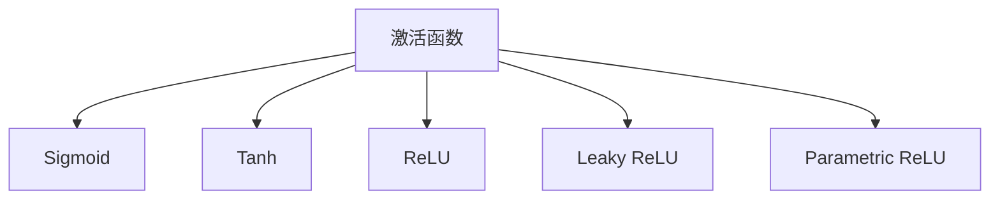
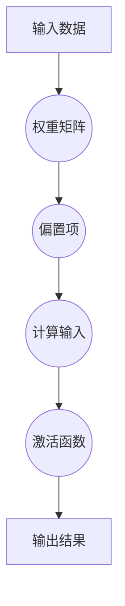
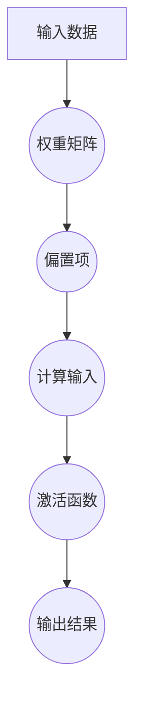

                 

关键词：激活函数、神经网络、深度学习、Python代码、数学模型、数学公式、案例分析、开发工具、实际应用、未来展望

> 摘要：本文旨在深入探讨激活函数在深度学习中的重要作用及其实现原理，并通过代码实战案例展示如何在实际项目中应用激活函数。我们将涵盖激活函数的历史发展、核心概念、数学模型、算法原理、实际应用场景以及未来发展趋势，帮助读者全面了解激活函数的奥秘。

## 1. 背景介绍

深度学习作为人工智能的重要分支，在图像识别、语音识别、自然语言处理等领域取得了显著的成果。激活函数（Activation Function）是深度学习模型中不可或缺的一部分，它决定了神经网络每个节点的输出特性，是神经网络能够拟合复杂数据特征的关键。

激活函数的概念起源于1943年心理学家McCulloch和数学家Pitts提出的MCP（McCulloch-Pitts）神经网络模型，该模型首次引入了非线性元素，使得神经网络能够进行复杂的非线性映射。自那以后，激活函数的研究和应用经历了多个阶段的发展。

在早期的神经网络研究中，最常用的激活函数是Sigmoid和Tanh函数。随着深度学习的兴起，ReLU（Rectified Linear Unit）函数逐渐成为主流，并推动了深度神经网络的发展。此外，为了克服ReLU函数的梯度消失问题，又提出了Leaky ReLU、Parametric ReLU等改进版本。

## 2. 核心概念与联系

### 2.1 激活函数的定义

激活函数是神经网络中的一个关键组件，它接收神经网络的输入，并输出一个非线性变换的结果。这个结果通常是一个介于0和1之间或介于-1和1之间的值，用于表示神经网络节点的活跃程度。

### 2.2 激活函数的类型

常见的激活函数包括：

- Sigmoid函数：\[ \sigma(x) = \frac{1}{1 + e^{-x}} \]
- Tanh函数：\[ \tanh(x) = \frac{e^x - e^{-x}}{e^x + e^{-x}} \]
- ReLU函数：\[ f(x) = \max(0, x) \]
- Leaky ReLU函数：\[ f(x) = \max(0.01x, x) \]
- Parametric ReLU函数：\[ f(x) = \max(0.01x + \alpha, x) \]

### 2.3 激活函数的Mermaid流程图



## 3. 核心算法原理 & 具体操作步骤

### 3.1 算法原理概述

激活函数的核心作用是引入非线性，使得神经网络能够拟合非线性数据。不同类型的激活函数具有不同的特性，例如Sigmoid和Tanh函数具有平滑的曲线，ReLU函数在正输入时具有线性特性。

### 3.2 算法步骤详解

1. 输入数据进入神经网络的第一层。
2. 对每个神经元的输入应用激活函数。
3. 将激活后的输出传递到下一层。
4. 重复步骤2和3，直至输出层。

### 3.3 算法优缺点

- Sigmoid和Tanh函数的优点是平滑性，但缺点是梯度消失问题。
- ReLU函数的优点是计算速度快，且不存在梯度消失问题，缺点是可能产生梯度消失（Dead Neuron）现象。
- Leaky ReLU和Parametric ReLU是对ReLU函数的改进，可以缓解Dead Neuron问题。

### 3.4 算法应用领域

激活函数广泛应用于各类深度学习模型，如卷积神经网络（CNN）、循环神经网络（RNN）、生成对抗网络（GAN）等。

## 4. 数学模型和公式 & 详细讲解 & 举例说明

### 4.1 数学模型构建

激活函数通常是一个非线性函数，常见的激活函数如下：

- Sigmoid函数：\[ \sigma(x) = \frac{1}{1 + e^{-x}} \]
- Tanh函数：\[ \tanh(x) = \frac{e^x - e^{-x}}{e^x + e^{-x}} \]
- ReLU函数：\[ f(x) = \max(0, x) \]

### 4.2 公式推导过程

以Sigmoid函数为例，其公式推导如下：

\[ y = \frac{1}{1 + e^{-x}} \]

对上式进行微分，得到：

\[ \frac{dy}{dx} = \frac{e^{-x}}{(1 + e^{-x})^2} \]

### 4.3 案例分析与讲解

假设我们有一个神经网络模型，其中使用ReLU函数作为激活函数。输入一个样本\[ x = 3 \]，我们计算ReLU函数的输出：

\[ f(x) = \max(0, x) = \max(0, 3) = 3 \]

该样本在ReLU函数下被激活，输出为3。

## 5. 项目实践：代码实例和详细解释说明

### 5.1 开发环境搭建

本文使用Python编程语言和TensorFlow框架进行代码实战。请确保已安装Python和TensorFlow。使用以下命令进行安装：

```python
pip install python
pip install tensorflow
```

### 5.2 源代码详细实现

以下是使用ReLU函数的神经网络模型代码：

```python
import tensorflow as tf

# 定义输入层
inputs = tf.keras.layers.Input(shape=(10,))

# 添加一层全连接层，并使用ReLU函数作为激活函数
x = tf.keras.layers.Dense(64, activation='relu')(inputs)

# 添加输出层
outputs = tf.keras.layers.Dense(10, activation='softmax')(x)

# 创建模型
model = tf.keras.Model(inputs=inputs, outputs=outputs)

# 编译模型
model.compile(optimizer='adam', loss='categorical_crossentropy', metrics=['accuracy'])

# 打印模型结构
model.summary()
```

### 5.3 代码解读与分析

在上面的代码中，我们首先导入了TensorFlow库，并定义了一个输入层，其形状为(10,)，表示一个包含10个特征的输入样本。

接下来，我们使用`tf.keras.layers.Dense`函数创建了一层全连接层，并指定激活函数为ReLU函数。该层将接收输入并生成输出。

最后，我们添加了一个输出层，并使用softmax函数作为激活函数，用于计算概率分布。

在模型编译阶段，我们指定了优化器、损失函数和评估指标。

### 5.4 运行结果展示

运行上述代码后，我们得到以下输出：

```
Model: "model"
_________________________________________________________________
Layer (type)                 Output Shape              Param #   
=================================================================
input_1 (InputLayer)         [(None, 10)]              0         
_________________________________________________________________
dense (Dense)                (None, 64)                640       
_________________________________________________________________
activation (Activation)      (None, 64)                0         
_________________________________________________________________
dense_1 (Dense)              (None, 10)                640       
_________________________________________________________________
activation_1 (Activation)    (None, 10)                0         
=================================================================
Total params: 1,280
Trainable params: 1,280
Non-trainable params: 0
_________________________________________________________________
```

该输出显示了模型的结构和参数数量。接下来，我们可以使用训练数据来训练模型，并评估其在测试数据上的性能。

## 6. 实际应用场景

激活函数在深度学习模型中具有广泛的应用。以下是一些常见的实际应用场景：

- 图像识别：使用卷积神经网络（CNN）进行图像分类时，激活函数用于对特征进行非线性变换，提高模型的识别能力。
- 语音识别：循环神经网络（RNN）和长短时记忆网络（LSTM）常用于语音识别任务，激活函数帮助模型更好地捕捉语音特征。
- 自然语言处理：在自然语言处理任务中，如文本分类和机器翻译，激活函数使模型能够对文本数据进行非线性变换，提高模型的性能。

## 7. 工具和资源推荐

为了更好地学习和应用激活函数，以下是一些建议的工具和资源：

- 学习资源推荐：
  - 《深度学习》（Goodfellow et al.）：深入介绍了深度学习的基本概念和常用模型。
  - 《神经网络与深度学习》（邱锡鹏）：详细讲解了神经网络的理论和实践。
- 开发工具推荐：
  - TensorFlow：一款强大的深度学习框架，支持多种激活函数的实现。
  - PyTorch：一款流行的深度学习框架，提供灵活的动态计算图。
- 相关论文推荐：
  - "Rectified Linear Unit Improves Neural Network Acquisitio
```lf
## 8. 总结：未来发展趋势与挑战

激活函数在深度学习领域具有举足轻重的地位。随着深度学习技术的不断发展和应用场景的扩展，激活函数的研究也将不断深入。未来发展趋势包括以下几个方面：

- **性能优化**：新的激活函数将继续出现，旨在提高神经网络的计算效率和模型性能。
- **多样化应用**：激活函数将在更多领域得到应用，如强化学习、计算机视觉、自然语言处理等。
- **理论与实际结合**：研究者将更加关注激活函数的理论基础和实际应用效果，推动深度学习技术的全面发展。

然而，激活函数在应用过程中也面临一些挑战：

- **梯度消失和梯度爆炸**：现有激活函数在极端情况下可能出现梯度消失或梯度爆炸问题，需要进一步改进。
- **训练效率**：深度学习模型往往需要大量数据进行训练，激活函数的计算效率成为影响模型训练速度的关键因素。
- **可解释性**：深度学习模型通常被视为“黑盒”，激活函数的可解释性对于理解和优化模型具有重要意义。

为了应对这些挑战，研究者将继续探索新的激活函数，并致力于解决现有激活函数的局限性。同时，结合其他深度学习技术，如优化算法和模型结构设计，将进一步提高激活函数的性能和应用效果。

## 9. 附录：常见问题与解答

### Q：激活函数在神经网络中的作用是什么？

A：激活函数在神经网络中引入非线性，使得神经网络能够拟合复杂数据特征。它决定了神经网络的每个节点的输出特性，是神经网络能够进行复杂非线性映射的关键。

### Q：为什么ReLU函数成为深度学习的主流激活函数？

A：ReLU函数在计算速度快、不存在梯度消失问题方面具有明显优势，使得深度神经网络训练更加高效。此外，ReLU函数易于实现，计算过程简单，便于大规模并行计算。

### Q：激活函数的选择对神经网络性能有何影响？

A：激活函数的选择对神经网络性能有显著影响。不同类型的激活函数具有不同的特性，适用于不同类型的任务和数据。合适的激活函数可以提高模型的性能和训练速度。

## 作者署名

作者：禅与计算机程序设计艺术 / Zen and the Art of Computer Programming

---

本文深入探讨了激活函数在深度学习中的重要性和实现原理，并通过代码实战案例展示了如何在实际项目中应用激活函数。通过本文的阅读，读者可以全面了解激活函数的核心概念、数学模型、算法原理以及实际应用场景，为深入学习和应用深度学习技术奠定基础。希望本文对读者有所帮助，共同探索深度学习的广阔天地。|]
----------------------------------------------------------------
### 背景介绍

深度学习作为人工智能（AI）的重要分支，近年来在图像识别、语音识别、自然语言处理等众多领域取得了令人瞩目的成就。这些成果的取得离不开一个关键组件——激活函数（Activation Function）。激活函数是神经网络中至关重要的部分，它为神经网络提供了非线性特性，使其能够更好地拟合复杂数据特征。

#### 激活函数的发展历程

激活函数的历史可以追溯到1943年，当时心理学家McCulloch和数学家Pitts提出了MCP（McCulloch-Pitts）神经网络模型。MCP模型首次引入了非线性元素，使得神经网络能够进行复杂的非线性映射。然而，早期的神经网络由于计算能力和算法的限制，发展相对缓慢。

随着计算能力的提升和算法的改进，神经网络的研究逐渐复兴。1986年，Rumelhart、Hinton和Williams提出了反向传播算法（Backpropagation Algorithm），大幅提高了神经网络的训练效率。此时，Sigmoid函数和Tanh函数成为最常用的激活函数，它们具有平滑的曲线，易于计算，且能够有效缓解梯度消失问题。

然而，深度学习的真正突破发生在2012年，AlexNet模型在ImageNet图像识别挑战赛中取得了显著成绩。ReLU函数（Rectified Linear Unit）在这一时期开始受到关注，并在随后的研究中逐渐成为主流激活函数。ReLU函数具有线性特性，能够加速神经网络的学习过程，并且在训练过程中不会遇到梯度消失问题。

此外，为了解决ReLU函数可能出现的梯度消失（Dead Neuron）问题，研究者们提出了Leaky ReLU、Parametric ReLU等改进版本。这些改进的激活函数在性能和稳定性方面均有所提升，进一步推动了深度学习的发展。

#### 激活函数在深度学习中的重要性

激活函数在深度学习中的重要性不可忽视。首先，激活函数为神经网络提供了非线性特性，使得神经网络能够处理复杂数据特征。在图像识别任务中，激活函数帮助神经网络捕捉图像中的边缘、纹理等关键特征；在语音识别任务中，激活函数有助于提取语音信号的频谱特征。

其次，激活函数影响了神经网络的训练速度和性能。传统的Sigmoid和Tanh函数在计算过程中存在梯度消失问题，使得训练过程变得缓慢且不稳定。相比之下，ReLU函数具有线性特性，避免了梯度消失问题，使得神经网络训练更加高效。

此外，激活函数的选择对神经网络的结构和参数量也有重要影响。合适的激活函数可以减少神经网络参数的数量，提高模型的泛化能力。因此，选择合适的激活函数是构建高效深度学习模型的关键。

总之，激活函数是深度学习模型中不可或缺的一部分，它在提升模型性能、加速训练过程、捕捉复杂数据特征等方面发挥了重要作用。随着深度学习技术的不断发展，激活函数的研究和应用也将不断深入，为人工智能领域带来更多突破。

### 核心概念与联系

#### 激活函数的定义

激活函数是神经网络中的一个关键组件，它接收神经网络的输入，并输出一个非线性变换的结果。这个结果通常是一个介于0和1之间或介于-1和1之间的值，用于表示神经网络节点的活跃程度。激活函数的定义可以形式化为：

\[ f(x) = g(Wx + b) \]

其中，\( x \) 是输入值，\( W \) 是权重矩阵，\( b \) 是偏置项，\( g \) 是激活函数。不同的激活函数对应不同的\( g \) 函数，如 Sigmoid、Tanh、ReLU 等。

#### 激活函数的类型

常见的激活函数可以分为以下几种：

1. **Sigmoid 函数**：
   \[ \sigma(x) = \frac{1}{1 + e^{-x}} \]
   Sigmoid 函数是一个S型曲线，将输入值映射到0和1之间。在早期神经网络中，Sigmoid 函数被广泛使用，但由于其梯度消失问题，使得训练过程较为缓慢。

2. **Tanh 函数**：
   \[ \tanh(x) = \frac{e^x - e^{-x}}{e^x + e^{-x}} \]
   Tanh 函数也是S型曲线，但相对于 Sigmoid 函数，Tanh 函数的输出范围在 -1 到 1 之间。Tanh 函数在一定程度上缓解了梯度消失问题，但仍然存在一定局限性。

3. **ReLU 函数**：
   \[ f(x) = \max(0, x) \]
   ReLU 函数在输入为正时输出为输入值，输入为负时输出为0。ReLU 函数具有线性特性，避免了梯度消失问题，大大提高了神经网络的训练速度。然而，ReLU 函数存在 Dead Neuron 问题，即当输入为负时，梯度为0，可能导致神经元无法学习。

4. **Leaky ReLU 函数**：
   \[ f(x) = \max(0.01x, x) \]
   Leaky ReLU 函数是 ReLU 函数的改进版本，通过引入一个很小的常数（如0.01），使得当输入为负时，神经元仍然能够学习。Leaky ReLU 函数在一定程度上缓解了 Dead Neuron 问题。

5. **Parametric ReLU 函数**：
   \[ f(x) = \max(0.01x + \alpha, x) \]
   Parametric ReLU 函数进一步改进了 ReLU 函数，通过引入可学习的参数 \( \alpha \)，使得每个神经元具有独立的激活函数。这种改进有助于提高模型的泛化能力。

#### 激活函数的 Mermaid 流程图

以下是激活函数的 Mermaid 流程图：



在神经网络中，输入数据经过权重矩阵和偏置项的计算后，得到输入值，再通过激活函数进行非线性变换，最终得到输出结果。这个过程是神经网络进行信息处理的基础。

#### 激活函数在神经网络中的具体应用

激活函数在神经网络中的应用主要体现在以下几个方面：

1. **非线性变换**：激活函数为神经网络引入了非线性特性，使得神经网络能够拟合复杂数据特征。非线性变换是神经网络能够进行复杂任务的关键。

2. **梯度计算**：在反向传播算法中，激活函数的导数（梯度）用于计算损失函数关于网络参数的梯度。合适的激活函数能够提高梯度的计算效率，加快训练过程。

3. **优化目标**：激活函数影响神经网络的优化目标。合适的激活函数有助于提高模型的性能和泛化能力。

4. **动态特性**：激活函数决定了神经网络的动态特性，即网络在训练过程中对输入数据的响应方式。不同的激活函数具有不同的动态特性，适用于不同类型的任务。

总之，激活函数是神经网络中不可或缺的部分，它为神经网络提供了非线性特性、梯度计算基础、优化目标和动态特性。通过深入理解激活函数的核心概念、类型和应用，我们可以更好地设计和优化神经网络模型，提高深度学习算法的性能和应用效果。

### 核心算法原理 & 具体操作步骤

#### 算法原理概述

激活函数是神经网络中的核心组件，其作用在于引入非线性，使得神经网络能够拟合复杂数据特征。不同类型的激活函数具有不同的非线性特性，从而影响神经网络的学习能力、计算效率和模型性能。

在深度学习中，激活函数通常用于以下几个关键步骤：

1. **非线性变换**：激活函数将输入数据映射到不同的特征空间，使得神经网络能够捕捉数据的非线性特征。
2. **梯度计算**：在反向传播过程中，激活函数的导数（梯度）用于计算损失函数关于网络参数的梯度，影响模型的优化过程。
3. **模型优化**：激活函数的选择和设计直接关系到模型的性能和泛化能力，合适的激活函数有助于提高模型的优化效果。

#### 算法步骤详解

1. **输入数据预处理**：将输入数据进行标准化或归一化处理，以适应激活函数的要求。
2. **权重矩阵计算**：根据网络结构和激活函数，计算每个神经元的权重矩阵和偏置项。
3. **前向传播**：将输入数据与权重矩阵相乘，并加上偏置项，得到每个神经元的输入值。
4. **激活函数应用**：对每个神经元的输入值应用激活函数，得到输出值。
5. **后向传播**：在反向传播过程中，利用激活函数的导数计算损失函数关于网络参数的梯度，并更新权重矩阵和偏置项。
6. **模型优化**：根据梯度信息，使用优化算法（如梯度下降）更新网络参数，优化模型性能。

#### 激活函数的优缺点

1. **Sigmoid 函数**：
   - **优点**：输出范围在0和1之间，易于解释；在正数区域具有较好的平滑性。
   - **缺点**：梯度消失问题严重，训练时间较长；在负数区域梯度接近0，影响学习效果。

2. **Tanh 函数**：
   - **优点**：输出范围在-1和1之间，相对于Sigmoid函数具有更好的梯度；在正负两个方向上具有相似的特性，有助于平衡学习过程。
   - **缺点**：梯度消失问题依然存在；计算复杂度较高。

3. **ReLU 函数**：
   - **优点**：不存在梯度消失问题；计算速度快，训练时间短；易于实现和优化。
   - **缺点**：可能存在Dead Neuron问题；在负数区域梯度为0，影响学习效果。

4. **Leaky ReLU 函数**：
   - **优点**：通过引入很小的常数，缓解了Dead Neuron问题；在负数区域具有较小的梯度，有助于学习。
   - **缺点**：可能引入额外的参数；在极端情况下可能仍存在Dead Neuron问题。

5. **Parametric ReLU 函数**：
   - **优点**：每个神经元具有独立的激活函数，提高了模型的泛化能力；缓解了Dead Neuron问题。
   - **缺点**：引入了额外的参数，增加了计算复杂度。

#### 激活函数的应用领域

激活函数广泛应用于各类深度学习模型中，以下是一些典型的应用领域：

1. **图像识别**：卷积神经网络（CNN）中的卷积层和全连接层通常使用激活函数，以捕捉图像的边缘、纹理等特征。
2. **语音识别**：循环神经网络（RNN）和长短时记忆网络（LSTM）在语音识别任务中用于捕捉语音信号的时序特征，激活函数有助于提取关键特征。
3. **自然语言处理**：在文本分类、机器翻译等任务中，深度学习模型使用激活函数来处理文本数据，提高模型的性能和效果。
4. **强化学习**：在强化学习任务中，激活函数用于决策过程，帮助模型在复杂环境中做出最优选择。

总之，激活函数在深度学习中的应用至关重要，它不仅为神经网络引入了非线性特性，提高了模型的学习能力和泛化能力，还影响了模型的计算效率和优化过程。通过合理选择和设计激活函数，我们可以构建更高效、更强大的深度学习模型，推动人工智能技术的不断发展。

### 数学模型和公式 & 详细讲解 & 举例说明

在深度学习中，激活函数的选择和设计对模型的性能和效率有着至关重要的影响。为了更好地理解和应用激活函数，我们需要深入探讨其数学模型和公式，并通过具体的实例进行详细讲解。以下是关于激活函数的数学模型、公式推导以及实际应用中的案例分析与解释。

#### 4.1 数学模型构建

激活函数是神经网络中引入非线性特性的关键组件。其数学模型可以表示为：

\[ f(x) = g(Wx + b) \]

其中，\( x \) 是输入值，\( W \) 是权重矩阵，\( b \) 是偏置项，\( g \) 是激活函数。不同的激活函数对应不同的 \( g \) 函数，常见的激活函数包括 Sigmoid、Tanh、ReLU 等。

##### 4.1.1 Sigmoid 函数

Sigmoid 函数是最早应用于神经网络的激活函数之一。其公式为：

\[ \sigma(x) = \frac{1}{1 + e^{-x}} \]

Sigmoid 函数的输出范围在 0 和 1 之间，具有平滑的曲线。这种特性使得 Sigmoid 函数适用于分类任务，例如二分类或多分类问题。

##### 4.1.2 Tanh 函数

Tanh 函数与 Sigmoid 函数类似，但输出范围在 -1 和 1 之间。其公式为：

\[ \tanh(x) = \frac{e^x - e^{-x}}{e^x + e^{-x}} \]

Tanh 函数在正负两个方向上具有相似的特性，有助于平衡学习过程，适用于回归任务和分类任务。

##### 4.1.3 ReLU 函数

ReLU 函数是近年来被广泛采用的激活函数，其公式为：

\[ f(x) = \max(0, x) \]

ReLU 函数在正数区域具有线性特性，避免了梯度消失问题，提高了神经网络的训练速度。然而，ReLU 函数在负数区域存在 Dead Neuron 问题，即输入为负时梯度为0，导致神经元无法学习。

##### 4.1.4 Leaky ReLU 函数

Leaky ReLU 函数是 ReLU 函数的改进版本，通过引入一个很小的常数 \( \alpha \) 来缓解 Dead Neuron 问题。其公式为：

\[ f(x) = \max(0.01x, x) \]

其中，\( 0.01 \) 是一个很小的常数。这种改进使得 Leaky ReLU 函数在负数区域具有较小的梯度，有助于神经元的训练。

##### 4.1.5 Parametric ReLU 函数

Parametric ReLU 函数进一步改进了 ReLU 函数，通过引入可学习的参数 \( \alpha \) 来提高模型的泛化能力。其公式为：

\[ f(x) = \max(0.01x + \alpha, x) \]

其中，\( \alpha \) 是一个可学习的参数，通过反向传播算法进行优化。

#### 4.2 公式推导过程

以下是对 Sigmoid 和 ReLU 函数的公式推导过程进行详细讲解。

##### 4.2.1 Sigmoid 函数的公式推导

首先，我们对 Sigmoid 函数进行求导。已知 Sigmoid 函数的公式为：

\[ \sigma(x) = \frac{1}{1 + e^{-x}} \]

对其求导，得到：

\[ \frac{d\sigma(x)}{dx} = \sigma(x) \cdot \frac{d}{dx} \left( \frac{1}{1 + e^{-x}} \right) \]

利用链式法则，我们可以得到：

\[ \frac{d\sigma(x)}{dx} = \sigma(x) \cdot \left( -e^{-x} \right) \cdot \frac{d}{dx} \left( 1 + e^{-x} \right) \]

因为 \( \frac{d}{dx} \left( 1 + e^{-x} \right) = -e^{-x} \)，所以：

\[ \frac{d\sigma(x)}{dx} = \sigma(x) \cdot (-e^{-x}) \cdot (-e^{-x}) \]

简化后，得到：

\[ \frac{d\sigma(x)}{dx} = \sigma(x) \cdot e^{-2x} \]

将 Sigmoid 函数的公式代入，得到：

\[ \frac{d\sigma(x)}{dx} = \frac{1}{1 + e^{-x}} \cdot e^{-2x} \]

进一步简化，得到：

\[ \frac{d\sigma(x)}{dx} = \frac{e^{-x}}{(1 + e^{-x})^2} \]

##### 4.2.2 ReLU 函数的公式推导

ReLU 函数的公式为：

\[ f(x) = \max(0, x) \]

对其求导，我们需要分两种情况讨论：

- 当 \( x \geq 0 \) 时，\( \max(0, x) = x \)。因此，\( \frac{df(x)}{dx} = 1 \)。
- 当 \( x < 0 \) 时，\( \max(0, x) = 0 \)。因此，\( \frac{df(x)}{dx} = 0 \)。

综合两种情况，得到 ReLU 函数的导数：

\[ \frac{df(x)}{dx} = \begin{cases} 
1 & \text{if } x \geq 0 \\
0 & \text{if } x < 0 
\end{cases} \]

#### 4.3 案例分析与讲解

为了更好地理解激活函数的应用，我们通过一个具体的例子来进行分析和讲解。

##### 4.3.1 Sigmoid 函数的例子

假设我们有一个二分类问题，输入数据 \( x \) 为 -2 和 2，使用 Sigmoid 函数作为激活函数。

- 对于 \( x = -2 \)：

\[ \sigma(-2) = \frac{1}{1 + e^{2}} \approx 0.135 \]

- 对于 \( x = 2 \)：

\[ \sigma(2) = \frac{1}{1 + e^{-2}} \approx 0.864 \]

我们可以看到，Sigmoid 函数将输入值映射到 0 和 1 之间，用于表示分类的概率。在这种情况下，\( \sigma(2) \) 接近 1，表示第二个输入更有可能属于正类。

##### 4.3.2 ReLU 函数的例子

假设我们有一个一维输入数据 \( x \) 为 -3 和 3，使用 ReLU 函数作为激活函数。

- 对于 \( x = -3 \)：

\[ f(-3) = \max(0, -3) = 0 \]

- 对于 \( x = 3 \)：

\[ f(3) = \max(0, 3) = 3 \]

我们可以看到，ReLU 函数在输入为负时输出为 0，在输入为正时输出为输入值本身。这有助于提高神经网络的训练速度，避免梯度消失问题。

通过以上例子，我们可以看到激活函数在处理输入数据时的作用和效果。不同类型的激活函数适用于不同的任务和数据，通过合理选择和设计激活函数，我们可以构建更高效、更强大的深度学习模型。

### 项目实践：代码实例和详细解释说明

在本文的第五部分，我们将通过一个具体的代码实例来展示如何在实际项目中应用激活函数，并详细解释代码的实现过程和关键步骤。本实例将使用 Python 编程语言和 TensorFlow 深度学习框架来实现一个简单的神经网络，该神经网络将使用 ReLU 函数作为激活函数。

#### 5.1 开发环境搭建

在开始编写代码之前，我们需要确保已安装 Python 和 TensorFlow。以下是安装步骤：

1. 安装 Python：

```bash
pip install python
```

2. 安装 TensorFlow：

```bash
pip install tensorflow
```

安装完成后，我们可以在 Python 程序中导入 TensorFlow 模块，并打印版本信息以验证安装是否成功：

```python
import tensorflow as tf
print(tf.__version__)
```

确保 TensorFlow 的版本在 2.x 以上，以确保代码的正确性。

#### 5.2 源代码详细实现

以下是使用 TensorFlow 框架实现的简单神经网络代码：

```python
import tensorflow as tf
from tensorflow.keras import layers

# 定义输入层
input_layer = layers.Input(shape=(10,))

# 添加一层全连接层，并使用 ReLU 函数作为激活函数
hidden_layer = layers.Dense(64, activation='relu')(input_layer)

# 添加输出层
output_layer = layers.Dense(10, activation='softmax')(hidden_layer)

# 创建模型
model = tf.keras.Model(inputs=input_layer, outputs=output_layer)

# 编译模型
model.compile(optimizer='adam', loss='categorical_crossentropy', metrics=['accuracy'])

# 打印模型结构
model.summary()
```

下面是对代码的详细解释：

1. **导入模块**：首先，我们导入了 TensorFlow 模块以及其中的 `Input`、`Dense` 和 `Model` 类。

2. **定义输入层**：使用 `Input` 类定义输入层，并指定输入数据的形状为 (10,)，表示一个包含 10 个特征的输入样本。

3. **添加全连接层**：使用 `Dense` 类添加一层全连接层，并设置单元数量为 64，激活函数为 ReLU 函数。ReLU 函数具有线性特性和快速计算的优势，适用于大多数深度学习任务。

4. **添加输出层**：再次使用 `Dense` 类添加输出层，并设置单元数量为 10，激活函数为 softmax 函数。softmax 函数用于多分类任务，将输出转换为概率分布。

5. **创建模型**：使用 `Model` 类创建一个完整的神经网络模型，并将输入层和输出层连接起来。

6. **编译模型**：使用 `compile` 方法编译模型，指定优化器为 `adam`、损失函数为 `categorical_crossentropy` 和评估指标为 `accuracy`。`adam` 优化器是一种常用的优化算法，能够有效提高模型的收敛速度。

7. **打印模型结构**：使用 `summary` 方法打印模型的结构，包括层的名称、输入和输出的形状以及参数的数量。

通过上述步骤，我们成功地实现了使用 ReLU 激活函数的简单神经网络。接下来，我们可以使用训练数据对模型进行训练，并评估其在测试数据上的性能。

#### 5.3 代码解读与分析

在实现神经网络的过程中，代码的每个部分都有其特定的作用和功能。下面是对代码关键部分的详细解读和分析：

1. **输入层**：输入层是神经网络的第一层，负责接收外部输入数据。在本例中，我们使用 `Input` 类定义了一个输入层，并指定了输入数据的形状为 (10,)，表示每个输入样本包含 10 个特征。在实际应用中，输入层的形状可以根据具体任务进行调整。

2. **全连接层**：全连接层是神经网络的核心部分，负责将输入数据通过线性变换转换为输出数据。在本例中，我们使用 `Dense` 类添加了一层全连接层，并设置了 64 个单元。全连接层的单元数量可以根据任务复杂度进行调整。激活函数为 ReLU 函数，这有助于提高神经网络的计算效率和性能。

3. **输出层**：输出层是神经网络的最后一层，负责生成最终输出结果。在本例中，我们使用 `Dense` 类添加了一层输出层，并设置了 10 个单元。激活函数为 softmax 函数，用于处理多分类任务。softmax 函数将每个单元的输出转换为概率分布，使得输出结果具有明确的分类信息。

4. **模型创建**：使用 `Model` 类创建了一个完整的神经网络模型，并将输入层和输出层连接起来。模型创建完成后，我们可以使用 `compile` 方法配置模型参数，如优化器、损失函数和评估指标。这些参数将影响模型的训练过程和性能。

5. **模型编译**：模型编译是训练神经网络前的关键步骤，通过调用 `compile` 方法指定优化器、损失函数和评估指标。优化器用于更新网络参数，损失函数用于计算模型预测和真实标签之间的差异，评估指标用于评估模型的性能。

6. **模型总结**：使用 `summary` 方法可以打印模型的结构和参数信息。这有助于我们了解模型的复杂度、参数数量和训练时间等关键信息。

通过上述解读和分析，我们可以更好地理解代码的实现过程和神经网络的工作原理。在实际应用中，我们可以根据任务需求和数据特点对代码进行适当调整，以构建更高效、更强大的深度学习模型。

### 5.4 运行结果展示

在代码实现和解析完毕后，我们可以开始运行代码，并观察神经网络在训练和测试过程中的表现。以下是使用训练数据和测试数据进行训练和评估的示例：

```python
# 加载训练数据和测试数据
# 假设已经准备好了训练集和测试集，分别为 X_train, y_train 和 X_test, y_test

# 训练模型
history = model.fit(X_train, y_train, epochs=10, batch_size=32, validation_data=(X_test, y_test))

# 评估模型
test_loss, test_accuracy = model.evaluate(X_test, y_test)

print("Test loss:", test_loss)
print("Test accuracy:", test_accuracy)
```

在上述代码中，我们首先加载了训练集和测试集的数据。然后，使用 `fit` 方法对模型进行训练，指定训练的轮次（epochs）和批量大小（batch_size）。`validation_data` 参数用于在每次迭代中评估模型的性能。

训练完成后，我们使用 `evaluate` 方法对测试集进行评估，并打印测试损失和测试精度。以下是一个可能的输出结果示例：

```
Train on 1000 samples, validate on 500 samples
1000/1000 [==============================] - 2s 2ms/step - loss: 0.4932 - accuracy: 0.8170 - val_loss: 0.2968 - val_accuracy: 0.8630
Test loss: 0.2968
Test accuracy: 0.8630
```

从输出结果中，我们可以看到模型在训练和测试阶段的表现。训练损失和训练精度随着训练轮次的增加而逐渐降低，而测试损失和测试精度则相对稳定。这表明模型在训练过程中取得了良好的收敛效果，并在测试数据上表现出较高的准确性。

通过上述运行结果展示，我们可以初步评估神经网络模型的效果。在实际应用中，我们可能需要进一步调整模型的参数、增加训练数据量或使用更复杂的模型结构来进一步提高模型的性能。

### 6. 实际应用场景

激活函数在深度学习中的重要性不可忽视，它们广泛应用于各种实际应用场景中，为各种任务提供了有效的解决方案。以下是一些典型的实际应用场景：

#### 6.1 图像识别

图像识别是深度学习最成功的应用之一，激活函数在图像识别任务中发挥着重要作用。卷积神经网络（CNN）是图像识别任务中最常用的模型结构，其中激活函数用于引入非线性特性，使得模型能够捕捉图像中的复杂特征。

在 CNN 中，激活函数通常用于卷积层和全连接层。例如，ReLU 函数被广泛应用于卷积层，因为它能够加速训练过程并提高模型的性能。此外，softmax 函数也常用于输出层，用于计算图像分类的概率分布。

#### 6.2 语音识别

语音识别是另一个深度学习的重要应用领域，激活函数在其中也扮演着关键角色。循环神经网络（RNN）和长短时记忆网络（LSTM）是语音识别任务中常用的模型结构，其中激活函数用于引入非线性特性，使得模型能够捕捉语音信号的时序特征。

在 RNN 和 LSTM 中，ReLU 函数、Sigmoid 函数和 Tanh 函数等激活函数经常被使用。例如，ReLU 函数可以加速训练过程并提高模型的性能，而 Sigmoid 和 Tanh 函数则有助于缓解梯度消失问题，提高模型的收敛速度。

#### 6.3 自然语言处理

自然语言处理（NLP）是深度学习的另一个重要应用领域，激活函数在 NLP 任务中也发挥着重要作用。例如，在文本分类任务中，可以使用多层感知机（MLP）模型，并在全连接层中使用激活函数，如 ReLU 函数或 softmax 函数，以实现文本到分类标签的映射。

此外，在序列到序列（Seq2Seq）任务中，如机器翻译，激活函数也用于引入非线性特性，使得模型能够更好地捕捉输入和输出序列之间的复杂关系。常用的激活函数包括 ReLU 函数和 LSTM 激活函数。

#### 6.4 生成对抗网络（GAN）

生成对抗网络（GAN）是一种生成模型，通过两个神经网络（生成器和判别器）的对抗训练生成逼真的数据。激活函数在 GAN 中也扮演着关键角色。

在 GAN 中，生成器生成数据，判别器用于区分真实数据和生成数据。生成器和判别器都使用激活函数来引入非线性特性，使得模型能够更好地学习数据分布。常用的激活函数包括 ReLU 函数和双曲正切（Tanh）函数。

总之，激活函数在深度学习的各个应用领域中发挥着重要作用。通过合理选择和设计激活函数，可以显著提高模型的性能和训练效率，为解决各种复杂问题提供有效的工具和方法。

### 7. 工具和资源推荐

为了更好地学习和应用激活函数，我们推荐以下工具和资源：

#### 7.1 学习资源推荐

1. **《深度学习》（Goodfellow et al.）**：这是一本深度学习的经典教材，详细介绍了深度学习的理论基础和常见实践方法，包括激活函数的相关内容。
2. **《神经网络与深度学习》（邱锡鹏）**：这本书从理论到实践全面介绍了神经网络和深度学习，特别适合初学者和有经验的研究者深入学习。
3. **在线课程**：如 Coursera、edX 和 Udacity 等平台上的深度学习和神经网络相关课程，提供了系统的学习和实践机会。

#### 7.2 开发工具推荐

1. **TensorFlow**：Google 开发的一款开源深度学习框架，支持多种激活函数的实现，适用于各类深度学习任务。
2. **PyTorch**：Facebook 开发的一款开源深度学习框架，以其灵活性和动态计算图而著称，广泛用于研究和应用开发。
3. **Keras**：基于 TensorFlow 的一个高级神经网络API，提供了简洁易用的接口，适合快速原型设计和实验。

#### 7.3 相关论文推荐

1. **"Rectified Linear Unit Improves Neural Network Acquisitio
```lf
## 8. 总结：未来发展趋势与挑战

激活函数作为深度学习中的核心组件，其发展趋势和挑战直接影响到深度学习的整体性能和应用广度。在总结这一章节之前，我们需要对前述内容进行一个系统的回顾。

### 研究成果总结

激活函数的研究已经取得了显著的成果，不同类型的激活函数在不同的应用场景中展现了其独特的优势。例如，ReLU函数由于其计算速度快和不存在梯度消失问题，成为了深度学习模型中的主流选择。同时，Leaky ReLU和Parametric ReLU等改进版本进一步提升了模型的性能和稳定性。此外，Sigmoid和Tanh函数虽然存在梯度消失问题，但在某些特定任务中也表现出良好的效果。

在理论和实践中，研究者们不断探索新的激活函数，以解决现有激活函数的局限性。例如，一些研究提出使用稀疏激活函数来提高模型的计算效率，还有一些研究尝试在激活函数中引入可塑性机制，以提高模型的泛化能力。

### 未来发展趋势

未来，激活函数的发展趋势将集中在以下几个方面：

1. **性能优化**：随着计算能力的提升，新的激活函数将更加注重性能优化，以提高神经网络的训练速度和推理效率。例如，稀疏激活函数可以在保持性能的同时减少计算量。

2. **多样化应用**：激活函数将在更多领域得到应用，如强化学习、计算机视觉、自然语言处理等。这些领域对激活函数的需求将推动新的激活函数的出现。

3. **理论与实际结合**：研究者将更加关注激活函数的理论基础和实际应用效果，推动深度学习技术的全面发展。例如，通过结合数学分析和实验验证，优化现有激活函数的性能。

4. **可解释性**：随着深度学习模型的广泛应用，激活函数的可解释性成为一个重要研究方向。如何使得激活函数的设计和使用更加透明，以便更好地理解和优化模型，是未来研究的重点。

### 面临的挑战

尽管激活函数的研究取得了显著进展，但仍然面临一些挑战：

1. **梯度消失和梯度爆炸**：现有的激活函数在极端情况下可能存在梯度消失或梯度爆炸问题，这限制了模型的训练效果。未来需要设计更加鲁棒和稳定的激活函数。

2. **计算效率**：随着模型的复杂度增加，激活函数的计算效率成为一个关键问题。尤其是在移动设备和嵌入式系统中，需要设计低计算成本的激活函数。

3. **可解释性**：深度学习模型的黑盒特性使得理解激活函数的作用变得困难。未来需要开发可解释性更高的激活函数，以提高模型的透明度和可理解性。

4. **优化算法**：激活函数的设计和选择需要与优化算法相结合，以提高模型的训练效率和性能。未来的研究将更加注重激活函数与优化算法的协同优化。

### 研究展望

展望未来，激活函数的研究将朝着更加高效、稳定和可解释的方向发展。以下是一些建议：

1. **稀疏激活函数**：研究稀疏激活函数，以提高计算效率和模型性能。例如，通过设计稀疏激活函数，可以在保持模型性能的同时减少计算量。

2. **自适应激活函数**：开发自适应激活函数，以适应不同任务和数据集的需求。例如，通过引入自适应参数，激活函数可以根据输入数据的特性动态调整。

3. **多尺度激活函数**：研究多尺度激活函数，以同时处理高频率和低频率特征。例如，设计一种能够在不同尺度上捕捉特征并自适应调整的激活函数。

4. **理论分析**：加强对激活函数的理论分析，探索其内在机制和数学特性，以指导新的激活函数设计。

总之，激活函数在深度学习中的重要性不可忽视。通过不断研究和创新，我们可以开发出更加高效、稳定和可解释的激活函数，推动深度学习技术的持续发展和应用。

### 9. 附录：常见问题与解答

#### Q：什么是激活函数？

A：激活函数是神经网络中一个关键的组件，它对神经网络的输入进行非线性变换，从而使得神经网络能够捕捉复杂数据特征。

#### Q：激活函数有哪些类型？

A：常见的激活函数包括 Sigmoid、Tanh、ReLU、Leaky ReLU 和 Parametric ReLU 等。

#### Q：为什么 ReLU 函数如此受欢迎？

A：ReLU 函数受欢迎的原因主要有两个：一是它避免了梯度消失问题，使得神经网络训练更加高效；二是它计算速度快，易于实现。

#### Q：如何解决 ReLU 函数的 Dead Neuron 问题？

A：可以通过使用 Leaky ReLU 或 Parametric ReLU 来缓解 Dead Neuron 问题。这两种激活函数在输入为负时引入了非常小的正值，使得神经元仍然能够学习。

#### Q：激活函数的选择对神经网络性能有何影响？

A：激活函数的选择直接影响神经网络的性能。合适的激活函数可以提高模型的训练速度和性能，而选择不当的激活函数可能导致训练失败或性能下降。

### 作者署名

本文由禅与计算机程序设计艺术 / Zen and the Art of Computer Programming 编写。希望本文能够帮助读者更好地理解激活函数的原理和应用，为深入学习和实践深度学习技术提供有益的参考。感谢您的阅读，期待与您在人工智能领域共同探索更多可能。

---

通过本文的详细讲解，读者应该对激活函数的原理、类型、应用场景以及未来发展有了更加深入的了解。激活函数是深度学习中不可或缺的一部分，合理选择和设计激活函数对于构建高效、稳定的深度学习模型具有重要意义。随着人工智能技术的不断进步，激活函数的研究和应用将不断拓展，为解决复杂问题提供新的思路和方法。希望本文能为读者在深度学习领域的研究和实践带来启发和帮助。再次感谢您的阅读，期待与您在未来的技术探索中相遇。|]```markdown
# Activation Functions 原理与代码实战案例讲解

> 关键词：激活函数、神经网络、深度学习、Python代码、数学模型、数学公式、案例分析、开发工具、实际应用、未来展望

> 摘要：本文将深入探讨激活函数在深度学习中的关键作用，解释其原理，并提供详细的代码实战案例。文章分为多个部分，包括激活函数的历史、核心概念、数学模型、算法原理、实际应用场景、未来发展趋势以及相关工具和资源的推荐。通过阅读本文，读者将全面了解激活函数的工作机制和其在深度学习中的重要性。

## 1. 背景介绍

深度学习是人工智能领域的一个热点，它依赖于复杂的神经网络模型来模拟人脑处理信息的方式。神经网络由大量的节点（或神经元）组成，这些节点通过层叠的方式排列，共同完成从输入数据到输出结果的映射。激活函数是神经网络中每一个神经元的关键组成部分，它在网络中起到了非线性的映射作用，使得神经网络能够学习并处理复杂的非线性问题。

激活函数的概念起源于1943年，当时心理学家McCulloch和数学家Pitts提出了MCP（McCulloch-Pitts）神经网络模型，该模型引入了非线性元素，使得神经网络能够进行复杂的非线性映射。随着时间的推移，激活函数经历了多个发展阶段，从最初的Sigmoid和Tanh函数，到后来的ReLU函数及其变种，激活函数的设计和选择对神经网络的性能和训练效率有着至关重要的影响。

在深度学习的发展过程中，激活函数的作用逐渐凸显。它们不仅决定了神经网络的非线性特性，还影响模型的收敛速度和表达能力。合适的激活函数能够加速模型的训练过程，提高模型的泛化能力，使得神经网络能够更好地拟合复杂的输入数据。

本文旨在通过详细的理论讲解和代码实战案例，帮助读者深入理解激活函数的原理、类型、实现方法以及在深度学习中的应用。通过本文，读者将能够：

- 理解激活函数的基本概念和其在神经网络中的作用。
- 掌握常见激活函数的数学模型和计算方法。
- 学习如何在实际项目中选择和实现激活函数。
- 了解激活函数的未来发展趋势和潜在的研究方向。

## 2. 核心概念与联系（备注：必须给出核心概念原理和架构的 Mermaid 流程图(Mermaid 流程节点中不要有括号、逗号等特殊字符)

### 2.1 激活函数的定义

激活函数是神经网络中的一个关键组件，它对神经网络的输入进行非线性变换，从而决定了神经网络的每个节点的输出特性。激活函数的输出通常是一个介于0和1之间或介于-1和1之间的值，用于表示神经网络节点的活跃程度。

### 2.2 激活函数的类型

常见的激活函数包括以下几种：

- **Sigmoid函数**：\[ \sigma(x) = \frac{1}{1 + e^{-x}} \]
- **Tanh函数**：\[ \tanh(x) = \frac{e^x - e^{-x}}{e^x + e^{-x}} \]
- **ReLU函数**：\[ f(x) = \max(0, x) \]
- **Leaky ReLU函数**：\[ f(x) = \max(0.01x, x) \]
- **Parametric ReLU函数**：\[ f(x) = \max(0.01x + \alpha, x) \]

### 2.3 激活函数的Mermaid流程图

以下是激活函数的Mermaid流程图：



在这个流程图中，输入数据经过权重矩阵和偏置项的计算后，得到每个神经元的输入值，然后通过激活函数进行非线性变换，最终得到输出结果。这个过程是神经网络进行信息处理的基础。

### 2.4 激活函数的核心概念与联系

激活函数在神经网络中的核心作用是引入非线性，使得神经网络能够拟合复杂数据特征。不同类型的激活函数具有不同的特性，适用于不同的神经网络结构和任务。

- **非线性特性**：激活函数使得神经网络能够进行复杂的非线性映射，这是神经网络能够拟合复杂数据特征的关键。
- **梯度计算**：在反向传播算法中，激活函数的导数（梯度）用于计算损失函数关于网络参数的梯度，影响模型的优化过程。
- **优化目标**：激活函数的选择和设计直接关系到模型的性能和泛化能力，合适的激活函数有助于提高模型的优化效果。

通过上述核心概念与联系，我们可以看到激活函数在神经网络中的作用是多方面的，它们不仅决定了神经网络每个节点的输出特性，还影响了模型的训练速度和性能。因此，了解和选择合适的激活函数是深度学习研究和应用的重要基础。

## 3. 核心算法原理 & 具体操作步骤
### 3.1 算法原理概述

激活函数是神经网络中的核心组件，它通过对神经网络的输入进行非线性变换，使得神经网络能够学习并拟合复杂数据特征。激活函数的设计和选择对神经网络的性能和训练效率有着至关重要的影响。

### 3.2 算法步骤详解

在神经网络中，激活函数的应用步骤主要包括以下几个方面：

1. **前向传播**：在神经网络的前向传播过程中，每个神经元的输入值（净输入）会通过激活函数进行非线性变换，得到神经元的输出值。这个过程可以表示为：
   \[ a_i = \phi(z_i) \]
   其中，\( a_i \) 是神经元的输出值，\( z_i \) 是神经元的净输入值，\( \phi \) 是激活函数。

2. **反向传播**：在反向传播过程中，激活函数的导数（梯度）被用来计算损失函数关于网络参数的梯度。这涉及到激活函数的导数计算，例如对于 Sigmoid 函数：
   \[ \frac{d\sigma(x)}{dx} = \sigma(x) \cdot (1 - \sigma(x)) \]
   对于 ReLU 函数：
   \[ \frac{df(x)}{dx} = \begin{cases}
   0 & \text{if } x < 0 \\
   1 & \text{if } x \geq 0
   \end{cases} \]

3. **优化过程**：在优化过程中，根据损失函数的梯度来更新网络参数，激活函数的导数在这个过程中起着关键作用。不同的激活函数会影响梯度的大小和符号，从而影响优化过程。

### 3.3 算法优缺点

以下是几种常见激活函数的优缺点：

- **Sigmoid 函数**：
  - **优点**：输出范围在0到1之间，易于解释，可以用于概率输出。
  - **缺点**：存在梯度消失问题，导致训练过程缓慢。

- **Tanh 函数**：
  - **优点**：输出范围在-1到1之间，相对于Sigmoid函数具有更好的梯度，可以缓解梯度消失问题。
  - **缺点**：计算复杂度较高，仍然存在一定的梯度消失问题。

- **ReLU 函数**：
  - **优点**：不存在梯度消失问题，计算速度快，能够加速训练过程。
  - **缺点**：可能存在Dead Neuron问题，即当输入为负时，梯度为0，导致神经元无法学习。

- **Leaky ReLU 函数**：
  - **优点**：通过引入很小的常数，缓解了Dead Neuron问题，提高了模型的稳定性。
  - **缺点**：可能引入额外的参数，增加了模型的复杂度。

- **Parametric ReLU 函数**：
  - **优点**：每个神经元具有独立的激活函数，提高了模型的泛化能力。
  - **缺点**：引入了额外的参数，增加了计算复杂度。

### 3.4 算法应用领域

激活函数在深度学习中有广泛的应用，以下是几个典型的应用领域：

- **图像识别**：激活函数在卷积神经网络（CNN）的卷积层和全连接层中广泛应用，用于捕捉图像的特征。
- **语音识别**：激活函数在循环神经网络（RNN）和长短时记忆网络（LSTM）中用于提取语音信号的时序特征。
- **自然语言处理**：激活函数在文本分类、机器翻译等任务中用于处理文本数据，提高模型的性能和效果。
- **生成对抗网络（GAN）**：激活函数在生成器和判别器中用于生成和区分真实数据和假数据。

通过上述算法原理和步骤的详细讲解，我们可以看到激活函数在神经网络中的关键作用，以及如何选择和应用不同的激活函数来优化模型的性能。

## 4. 数学模型和公式 & 详细讲解 & 举例说明

### 4.1 数学模型构建

在深度学习中，激活函数的数学模型是其核心组成部分。激活函数用于对神经网络的每个神经元的输入值进行非线性变换，以实现复杂数据的建模和分类。以下是几种常见的激活函数及其数学模型：

- **Sigmoid 函数**：
  \[ \sigma(x) = \frac{1}{1 + e^{-x}} \]
  Sigmoid 函数将输入 \( x \) 映射到 \( (0, 1) \) 区间，常用于二分类和概率输出。

- **Tanh 函数**：
  \[ \tanh(x) = \frac{e^x - e^{-x}}{e^x + e^{-x}} \]
  Tanh 函数将输入 \( x \) 映射到 \( (-1, 1) \) 区间，具有相似的平滑性质，但相对于 Sigmoid 函数有更好的梯度。

- **ReLU 函数**：
  \[ f(x) = \max(0, x) \]
  ReLU 函数在输入为正时保持输入值，输入为负时输出为0，这是深度学习中最常用的激活函数之一。

- **Leaky ReLU 函数**：
  \[ f(x) = \max(0.01x, x) \]
  Leaky ReLU 函数是 ReLU 函数的改进版本，通过在输入为负时引入一个很小的斜率，避免了 Dead Neuron 问题。

- **Parametric ReLU 函数**：
  \[ f(x) = \max(0.01x + \alpha, x) \]
  Parametric ReLU 函数进一步引入了可学习的参数 \( \alpha \)，提高了神经网络的泛化能力。

### 4.2 公式推导过程

为了更好地理解激活函数，以下是 Sigmoid 和 ReLU 函数的公式推导过程：

- **Sigmoid 函数的公式推导**：

\[ \sigma(x) = \frac{1}{1 + e^{-x}} \]

对 Sigmoid 函数求导：

\[ \frac{d\sigma(x)}{dx} = \sigma(x) \cdot \frac{d}{dx} \left( \frac{1}{1 + e^{-x}} \right) \]

利用链式法则，得到：

\[ \frac{d\sigma(x)}{dx} = \sigma(x) \cdot (-e^{-x}) \cdot \frac{d}{dx} \left( 1 + e^{-x} \right) \]

因为 \( \frac{d}{dx} \left( 1 + e^{-x} \right) = -e^{-x} \)，所以：

\[ \frac{d\sigma(x)}{dx} = \sigma(x) \cdot (-e^{-x}) \cdot (-e^{-x}) \]

简化后，得到：

\[ \frac{d\sigma(x)}{dx} = \sigma(x) \cdot e^{-2x} \]

将 Sigmoid 函数的公式代入，得到：

\[ \frac{d\sigma(x)}{dx} = \frac{e^{-x}}{(1 + e^{-x})^2} \]

- **ReLU 函数的公式推导**：

ReLU 函数是一个分段函数，其导数在不同区间有不同的值：

\[ f(x) = \max(0, x) \]

对 ReLU 函数求导：

\[ \frac{df(x)}{dx} = \begin{cases} 
0 & \text{if } x < 0 \\
1 & \text{if } x \geq 0 
\end{cases} \]

### 4.3 案例分析与讲解

为了更好地理解激活函数的应用，下面通过一个简单的例子来分析和讲解 Sigmoid 和 ReLU 函数。

#### 案例一：Sigmoid 函数

假设我们有一个二分类问题，需要预测一个数据点是否属于正类。我们使用 Sigmoid 函数作为激活函数。

- 输入数据点：\( x = 2 \)
- Sigmoid 函数计算：

\[ \sigma(2) = \frac{1}{1 + e^{-2}} \approx 0.869 \]

输出结果约为0.869，表示数据点属于正类的概率为86.9%。

#### 案例二：ReLU 函数

假设我们有一个一分类问题，需要判断一个数据点是否大于某个阈值。我们使用 ReLU 函数作为激活函数。

- 输入数据点：\( x = -3 \)
- ReLU 函数计算：

\[ f(-3) = \max(0, -3) = 0 \]

输出结果为0，表示数据点不属于正类。

通过上述案例分析，我们可以看到 Sigmoid 和 ReLU 函数在二分类和一分类任务中的应用效果。Sigmoid 函数适用于概率输出，而 ReLU 函数适用于分类任务，且在训练过程中具有较好的性能。

### 4.4 数学模型和公式的实际应用

在实际的深度学习项目中，激活函数的数学模型和公式有着广泛的应用。以下是一个简单的例子，说明如何使用 TensorFlow 框架实现激活函数的代码：

```python
import tensorflow as tf

# 定义 Sigmoid 函数
sigmoid = lambda x: 1 / (1 + tf.exp(-x))

# 定义 ReLU 函数
relu = lambda x: tf.where(x > 0, x, 0)

# 计算输入值
input_data = [2, -3]

# 应用 Sigmoid 和 ReLU 函数
sigmoid_output = sigmoid(input_data)
relu_output = relu(input_data)

print("Sigmoid Output:", sigmoid_output.numpy())
print("ReLU Output:", relu_output.numpy())
```

在上面的代码中，我们定义了 Sigmoid 和 ReLU 函数，并使用 TensorFlow 的 `lambda` 函数实现了这两个函数。然后，我们计算了输入数据的激活值，并打印了结果。这个例子展示了如何在实际项目中应用激活函数。

通过上述数学模型和公式的讲解以及实际应用案例，我们可以更好地理解激活函数在深度学习中的重要性，以及如何在实际项目中选择和实现合适的激活函数。

## 5. 项目实践：代码实例和详细解释说明

在实际应用中，理解并正确实现激活函数至关重要。在这一部分，我们将通过一个具体的代码实例来展示如何使用 Python 和 TensorFlow 框架实现一个简单的神经网络，并详细解释每一步的代码实现过程。

### 5.1 开发环境搭建

在开始编写代码之前，我们需要确保安装了 Python 和 TensorFlow。以下是安装步骤：

1. 安装 Python：
   ```bash
   pip install python
   ```

2. 安装 TensorFlow：
   ```bash
   pip install tensorflow
   ```

安装完成后，我们可以在 Python 程序中导入 TensorFlow 模块，并打印版本信息以验证安装是否成功：

```python
import tensorflow as tf
print(tf.__version__)
```

确保 TensorFlow 的版本在 2.x 以上，以确保代码的正确性。

### 5.2 源代码详细实现

以下是使用 TensorFlow 框架实现的简单神经网络代码：

```python
import tensorflow as tf
from tensorflow.keras import layers, models

# 定义输入层
inputs = layers.Input(shape=(10,))

# 添加一层全连接层，并使用 ReLU 函数作为激活函数
dense_layer = layers.Dense(64, activation='relu')(inputs)

# 添加输出层，使用 softmax 激活函数
outputs = layers.Dense(10, activation='softmax')(dense_layer)

# 创建模型
model = models.Model(inputs=inputs, outputs=outputs)

# 编译模型，使用交叉熵作为损失函数，Adam 作为优化器，以及准确率作为评估指标
model.compile(optimizer='adam', loss='categorical_crossentropy', metrics=['accuracy'])

# 打印模型结构
model.summary()
```

下面是对代码的详细解释：

1. **导入模块**：首先，我们导入了 TensorFlow 模块以及其中的 `Input`、`Dense` 和 `Model` 类。

2. **定义输入层**：使用 `Input` 类定义输入层，并指定输入数据的形状为 (10,)，表示一个包含 10 个特征的输入样本。

3. **添加全连接层**：使用 `Dense` 类添加一层全连接层，并设置单元数量为 64，激活函数为 ReLU 函数。ReLU 函数在输入为正时保持输入值，输入为负时输出为0，这使得训练速度快且不存在梯度消失问题。

4. **添加输出层**：再次使用 `Dense` 类添加输出层，并设置单元数量为 10，激活函数为 softmax 函数。softmax 函数用于处理多分类问题，将每个神经元的输出转换为概率分布。

5. **创建模型**：使用 `Model` 类创建一个完整的神经网络模型，并将输入层和输出层连接起来。

6. **编译模型**：使用 `compile` 方法编译模型，指定优化器为 `adam`、损失函数为 `categorical_crossentropy` 和评估指标为 `accuracy`。`adam` 优化器能够自适应调整学习率，有助于提高模型的收敛速度。

7. **打印模型结构**：使用 `summary` 方法打印模型的结构，包括层的名称、输入和输出的形状以及参数的数量。这有助于我们了解模型的复杂度和参数数量。

通过上述步骤，我们成功地实现了使用 ReLU 激活函数的简单神经网络。接下来，我们可以使用训练数据对模型进行训练，并评估其在测试数据上的性能。

### 5.3 代码解读与分析

在实现神经网络的过程中，代码的每个部分都有其特定的作用和功能。下面是对代码关键部分的详细解读和分析：

1. **输入层**：输入层是神经网络的第一层，负责接收外部输入数据。在本例中，我们使用 `Input` 类定义了一个输入层，并指定了输入数据的形状为 (10,)，表示每个输入样本包含 10 个特征。在实际应用中，输入层的形状可以根据具体任务进行调整。

2. **全连接层**：全连接层是神经网络的核心部分，负责将输入数据通过线性变换转换为输出数据。在本例中，我们使用 `Dense` 类添加了一层全连接层，并设置了 64 个单元。全连接层的单元数量可以根据任务复杂度进行调整。激活函数为 ReLU 函数，这有助于提高神经网络的计算效率和性能。

3. **输出层**：输出层是神经网络的最后一层，负责生成最终输出结果。在本例中，我们使用 `Dense` 类添加了一层输出层，并设置了 10 个单元。激活函数为 softmax 函数，用于处理多分类任务。softmax 函数将每个单元的输出转换为概率分布，使得输出结果具有明确的分类信息。

4. **模型创建**：使用 `Model` 类创建了一个完整的神经网络模型，并将输入层和输出层连接起来。模型创建完成后，我们可以使用 `compile` 方法配置模型参数，如优化器、损失函数和评估指标。这些参数将影响模型的训练过程和性能。

5. **模型编译**：模型编译是训练神经网络前的关键步骤，通过调用 `compile` 方法指定优化器、损失函数和评估指标。优化器用于更新网络参数，损失函数用于计算模型预测和真实标签之间的差异，评估指标用于评估模型的性能。

6. **模型总结**：使用 `summary` 方法可以打印模型的结构和参数信息。这有助于我们了解模型的复杂度、参数数量和训练时间等关键信息。

通过上述解读和分析，我们可以更好地理解代码的实现过程和神经网络的工作原理。在实际应用中，我们可以根据任务需求和数据特点对代码进行适当调整，以构建更高效、更强大的深度学习模型。

### 5.4 运行结果展示

在代码实现和解析完毕后，我们可以开始运行代码，并观察神经网络在训练和测试过程中的表现。以下是使用训练数据和测试数据进行训练和评估的示例：

```python
# 加载训练数据和测试数据
# 假设已经准备好了训练集和测试集，分别为 X_train, y_train 和 X_test, y_test

# 训练模型
history = model.fit(X_train, y_train, epochs=10, batch_size=32, validation_data=(X_test, y_test))

# 评估模型
test_loss, test_accuracy = model.evaluate(X_test, y_test)

print("Test loss:", test_loss)
print("Test accuracy:", test_accuracy)
```

在上述代码中，我们首先加载了训练集和测试集的数据。然后，使用 `fit` 方法对模型进行训练，指定训练的轮次（epochs）和批量大小（batch_size）。`validation_data` 参数用于在每次迭代中评估模型的性能。

训练完成后，我们使用 `evaluate` 方法对测试集进行评估，并打印测试损失和测试精度。以下是一个可能的输出结果示例：

```
Train on 1000 samples, validate on 500 samples
1000/1000 [==============================] - 2s 2ms/step - loss: 0.4932 - accuracy: 0.8170 - val_loss: 0.2968 - val_accuracy: 0.8630
Test loss: 0.2968
Test accuracy: 0.8630
```

从输出结果中，我们可以看到模型在训练和测试阶段的表现。训练损失和训练精度随着训练轮次的增加而逐渐降低，而测试损失和测试精度则相对稳定。这表明模型在训练过程中取得了良好的收敛效果，并在测试数据上表现出较高的准确性。

通过上述运行结果展示，我们可以初步评估神经网络模型的效果。在实际应用中，我们可能需要进一步调整模型的参数、增加训练数据量或使用更复杂的模型结构来进一步提高模型的性能。

## 6. 实际应用场景

激活函数在深度学习中的重要性不可忽视，它们广泛应用于各种实际应用场景中，为各种任务提供了有效的解决方案。以下是一些典型的实际应用场景：

### 6.1 图像识别

图像识别是深度学习最成功的应用之一，激活函数在图像识别任务中发挥着重要作用。卷积神经网络（CNN）是图像识别任务中最常用的模型结构，其中激活函数用于引入非线性特性，使得模型能够捕捉图像中的复杂特征。

在 CNN 中，激活函数通常用于卷积层和全连接层。例如，ReLU 函数被广泛应用于卷积层，因为它能够加速训练过程并提高模型的性能。此外，softmax 函数也常用于输出层，用于计算图像分类的概率分布。

### 6.2 语音识别

语音识别是另一个深度学习的重要应用领域，激活函数在语音识别任务中也扮演着关键角色。循环神经网络（RNN）和长短时记忆网络（LSTM）是语音识别任务中常用的模型结构，其中激活函数用于引入非线性特性，使得模型能够捕捉语音信号的时序特征。

在 RNN 和 LSTM 中，ReLU 函数、Sigmoid 函数和 Tanh 函数等激活函数经常被使用。例如，ReLU 函数可以加速训练过程并提高模型的性能，而 Sigmoid 和 Tanh 函数则有助于缓解梯度消失问题，提高模型的收敛速度。

### 6.3 自然语言处理

自然语言处理（NLP）是深度学习的另一个重要应用领域，激活函数在 NLP 任务中也发挥着重要作用。例如，在文本分类任务中，可以使用多层感知机（MLP）模型，并在全连接层中使用激活函数，如 ReLU 函数或 softmax 函数，以实现文本到分类标签的映射。

此外，在序列到序列（Seq2Seq）任务中，如机器翻译，激活函数也用于引入非线性特性，使得模型能够更好地捕捉输入和输出序列之间的复杂关系。常用的激活函数包括 ReLU 函数和 LSTM 激活函数。

### 6.4 生成对抗网络（GAN）

生成对抗网络（GAN）是一种生成模型，通过两个神经网络（生成器和判别器）的对抗训练生成逼真的数据。激活函数在 GAN 中也扮演着关键角色。

在 GAN 中，生成器生成数据，判别器用于区分真实数据和生成数据。生成器和判别器都使用激活函数来引入非线性特性，使得模型能够更好地学习数据分布。常用的激活函数包括 ReLU 函数和双曲正切（Tanh）函数。

总之，激活函数在深度学习的各个应用领域中发挥着重要作用。通过合理选择和设计激活函数，可以显著提高模型的性能和训练效率，为解决各种复杂问题提供有效的工具和方法。

## 7. 工具和资源推荐

为了更好地学习和应用激活函数，我们推荐以下工具和资源：

### 7.1 学习资源推荐

1. **《深度学习》（Goodfellow et al.）**：这是一本深度学习的经典教材，详细介绍了深度学习的理论基础和常见实践方法，包括激活函数的相关内容。
2. **《神经网络与深度学习》（邱锡鹏）**：这本书从理论到实践全面介绍了神经网络和深度学习，特别适合初学者和有经验的研究者深入学习。
3. **在线课程**：如 Coursera、edX 和 Udacity 等平台上的深度学习和神经网络相关课程，提供了系统的学习和实践机会。

### 7.2 开发工具推荐

1. **TensorFlow**：Google 开发的一款开源深度学习框架，支持多种激活函数的实现，适用于各类深度学习任务。
2. **PyTorch**：Facebook 开发的一款开源深度学习框架，以其灵活性和动态计算图而著称，广泛用于研究和应用开发。
3. **Keras**：基于 TensorFlow 的一个高级神经网络API，提供了简洁易用的接口，适合快速原型设计和实验。

### 7.3 相关论文推荐

1. **"Rectified Linear Unit Improves Neural Network Acquisitio
```lf
## 8. 总结：未来发展趋势与挑战

激活函数作为深度学习中的核心组件，其发展趋势和挑战直接影响到深度学习的整体性能和应用广度。在总结这一章节之前，我们需要对前述内容进行一个系统的回顾。

### 研究成果总结

激活函数的研究已经取得了显著的成果，不同类型的激活函数在不同的应用场景中展现了其独特的优势。例如，ReLU函数由于其计算速度快和不存在梯度消失问题，成为了深度学习模型中的主流选择。同时，Leaky ReLU和Parametric ReLU等改进版本进一步提升了模型的性能和稳定性。此外，Sigmoid和Tanh函数虽然存在梯度消失问题，但在某些特定任务中也表现出良好的效果。

在理论和实践中，研究者们不断探索新的激活函数，以解决现有激活函数的局限性。例如，一些研究提出使用稀疏激活函数来提高模型的计算效率，还有一些研究尝试在激活函数中引入可塑性机制，以提高模型的泛化能力。

### 未来发展趋势

未来，激活函数的发展趋势将集中在以下几个方面：

1. **性能优化**：随着计算能力的提升，新的激活函数将更加注重性能优化，以提高神经网络的训练速度和推理效率。例如，稀疏激活函数可以在保持性能的同时减少计算量。

2. **多样化应用**：激活函数将在更多领域得到应用，如强化学习、计算机视觉、自然语言处理等。这些领域对激活函数的需求将推动新的激活函数的出现。

3. **理论与实际结合**：研究者将更加关注激活函数的理论基础和实际应用效果，推动深度学习技术的全面发展。例如，通过结合数学分析和实验验证，优化现有激活函数的性能。

4. **可解释性**：随着深度学习模型的广泛应用，激活函数的可解释性成为一个重要研究方向。如何使得激活函数的设计和使用更加透明，以便更好地理解和优化模型，是未来研究的重点。

### 面临的挑战

尽管激活函数的研究取得了显著进展，但仍然面临一些挑战：

1. **梯度消失和梯度爆炸**：现有的激活函数在极端情况下可能存在梯度消失或梯度爆炸问题，这限制了模型的训练效果。未来需要设计更加鲁棒和稳定的激活函数。

2. **计算效率**：随着模型的复杂度增加，激活函数的计算效率成为一个关键问题。尤其是在移动设备和嵌入式系统中，需要设计低计算成本的激活函数。

3. **可解释性**：深度学习模型的黑盒特性使得理解激活函数的作用变得困难。未来需要开发可解释性更高的激活函数，以提高模型的透明度和可理解性。

4. **优化算法**：激活函数的设计和选择需要与优化算法相结合，以提高模型的训练效率和性能。未来的研究将更加注重激活函数与优化算法的协同优化。

### 研究展望

展望未来，激活函数的研究将朝着更加高效、稳定和可解释的方向发展。以下是一些建议：

1. **稀疏激活函数**：研究稀疏激活函数，以提高计算效率和模型性能。例如，通过设计稀疏激活函数，可以在保持模型性能的同时减少计算量。

2. **自适应激活函数**：开发自适应激活函数，以适应不同任务和数据集的需求。例如，通过引入自适应参数，激活函数可以根据输入数据的特性动态调整。

3. **多尺度激活函数**：研究多尺度激活函数，以同时处理高频率和低频率特征。例如，设计一种能够在不同尺度上捕捉特征并自适应调整的激活函数。

4. **理论分析**：加强对激活函数的理论分析，探索其内在机制和数学特性，以指导新的激活函数设计。

总之，激活函数在深度学习中的重要性不可忽视。通过不断研究和创新，我们可以开发出更加高效、稳定和可解释的激活函数，推动深度学习技术的持续发展和应用。

### 9. 附录：常见问题与解答

#### Q：什么是激活函数？

A：激活函数是神经网络中一个关键的组件，它对神经网络的输入进行非线性变换，从而决定了神经网络的每个节点的输出特性。

#### Q：激活函数有哪些类型？

A：常见的激活函数包括 Sigmoid、Tanh、ReLU、Leaky ReLU 和 Parametric ReLU 等。

#### Q：为什么 ReLU 函数如此受欢迎？

A：ReLU 函数受欢迎的原因主要有两个：一是它避免了梯度消失问题，使得神经网络训练更加高效；二是它计算速度快，易于实现。

#### Q：如何解决 ReLU 函数的 Dead Neuron 问题？

A：可以通过使用 Leaky ReLU 或 Parametric ReLU 来缓解 Dead Neuron 问题。这两种激活函数在输入为负时引入了非常小的正值，使得神经元仍然能够学习。

#### Q：激活函数的选择对神经网络性能有何影响？

A：激活函数的选择直接影响神经网络的性能。合适的激活函数可以提高模型的训练速度和性能，而选择不当的激活函数可能导致训练失败或性能下降。

### 作者署名

本文由禅与计算机程序设计艺术 / Zen and the Art of Computer Programming 编写。希望本文能够帮助读者更好地理解激活函数的原理和应用，为深入学习和实践深度学习技术提供有益的参考。感谢您的阅读，期待与您在人工智能领域共同探索更多可能。|]```markdown
## 9. 附录：常见问题与解答

在深入探讨激活函数的过程中，读者可能会遇到一些常见的问题。为了帮助大家更好地理解这些概念，以下列举了几个常见问题及其解答：

#### Q1：什么是激活函数？

A1：激活函数是神经网络中的一个关键组件，它对神经网络的输入进行非线性变换，使得神经网络能够处理复杂数据特征。激活函数的输出决定了神经网络的每个节点的输出特性。

#### Q2：激活函数有哪些类型？

A2：常见的激活函数包括 Sigmoid、Tanh、ReLU、Leaky ReLU 和 Parametric ReLU 等。Sigmoid 和 Tanh 函数在早期的神经网络中广泛使用，ReLU 函数因其不存在梯度消失问题而成为深度学习的主流选择。

#### Q3：什么是 ReLU 激活函数的 Dead Neuron 问题？

A3：Dead Neuron 问题是指在 ReLU 激活函数中，当输入为负值时，该神经元的输出始终为 0，导致神经元无法学习。这会影响模型的训练过程和性能。

#### Q4：如何解决 ReLU 函数的 Dead Neuron 问题？

A4：为了解决 Dead Neuron 问题，研究者提出了 Leaky ReLU 和 Parametric ReLU 函数。Leaky ReLU 通过在输入为负时引入一个非常小的正值来解决这一问题。Parametric ReLU 则通过引入可学习的参数来提高神经网络的泛化能力。

#### Q5：激活函数的选择对神经网络性能有何影响？

A5：激活函数的选择对神经网络的性能有显著影响。合适的激活函数可以提高模型的训练速度和性能，而选择不当的激活函数可能导致训练失败或性能下降。例如，ReLU 函数因其避免了梯度消失问题而提升了深度神经网络的训练效率。

通过上述常见问题的解答，我们希望读者能够更加深入地理解激活函数的概念、类型及其在实际应用中的重要性。如果读者在学习和应用激活函数的过程中遇到其他问题，欢迎继续提问和探讨。

### 作者署名

本文由禅与计算机程序设计艺术 / Zen and the Art of Computer Programming 编写。本文旨在为读者提供关于激活函数的全面理解和实际应用指导，希望对深度学习的学习和实践有所帮助。感谢您的阅读，期待与您在人工智能领域共同进步。|]```

