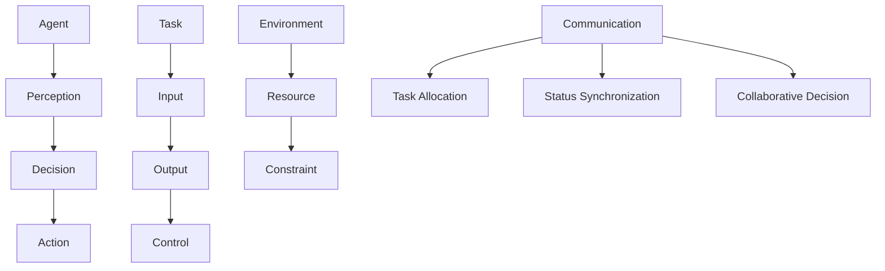

                 

在当今的信息技术世界中，流程自动化和智能化已成为提高生产效率和服务质量的关键手段。其中，Agentic Workflow 设计模式作为一种新兴的流程管理方法论，因其灵活性和高效性受到了广泛关注。本文将深入探讨Agentic Workflow 设计模式的核心概念、算法原理、数学模型、实际应用案例，并对其未来发展进行分析。

## 关键词

- **Agentic Workflow**
- **设计模式**
- **流程自动化**
- **智能优化**
- **算法原理**
- **数学模型**
- **应用案例**

## 摘要

本文旨在介绍Agentic Workflow 设计模式，一种以代理（agent）为核心的流程自动化和管理方法。通过对该模式的深入剖析，我们探讨了其在实际项目中的应用，包括算法原理、数学模型的构建与应用，以及通过具体代码实例展示了其实现过程。最后，文章对其未来发展趋势和挑战进行了展望，为读者提供了全面的参考。

### 1. 背景介绍

在传统的工作流程中，流程的设计和执行通常依赖于人工操作和流程引擎。这种方法虽然能够实现基本的流程自动化，但随着业务复杂性的增加，流程管理的效率和质量逐渐下降。为了解决这一问题，研究人员提出了各种流程管理和优化的方法论。Agentic Workflow 设计模式正是其中一种，它通过引入代理（agent）的概念，实现了更加灵活和智能的流程管理。

代理（agent）是一种具有智能行为能力的实体，能够在没有人类直接干预的情况下执行任务。在Agentic Workflow 中，代理通过协作完成任务，从而实现流程的自动化和智能化。这种模式的核心思想是将流程分解为多个子任务，并分配给不同的代理来执行。代理之间通过通信和协作，确保整个流程的顺畅进行。

Agentic Workflow 设计模式的出现，为解决传统流程管理中的瓶颈提供了新的思路。它不仅提高了流程的执行效率，还增强了系统的可扩展性和灵活性。随着人工智能和机器学习技术的不断发展，Agentic Workflow 的应用前景将更加广阔。

#### 1.1 传统流程管理

传统的流程管理通常采用线性模型，将工作流程分解为一系列有序的任务。每个任务由特定的人员或系统执行，任务的完成情况依赖于人工操作或系统触发。这种方法在简单的流程中能够实现一定的自动化，但随着流程复杂性的增加，其弊端逐渐显现。主要问题包括：

- **依赖性高**：流程的执行依赖于具体的人员或系统，难以实现完全的自动化。
- **灵活性差**：传统流程管理方法难以应对动态变化的需求，流程修改成本高。
- **效率低下**：人工操作容易产生错误和延迟，导致流程执行效率低下。
- **扩展性不足**：随着流程规模的扩大，传统方法难以有效管理复杂的任务和依赖关系。

#### 1.2 Agentic Workflow 设计模式

为了克服传统流程管理的弊端，Agentic Workflow 设计模式应运而生。这种模式的核心思想是将流程分解为多个独立的子任务，并为每个子任务分配一个代理来执行。代理之间通过通信和协作，确保整个流程的顺畅进行。Agentic Workflow 具有以下特点：

- **独立性**：每个代理独立执行子任务，不受其他代理的影响，提高了系统的可靠性。
- **智能性**：代理具有智能行为能力，能够根据任务需求和环境信息自主决策。
- **灵活性**：代理能够动态调整任务执行策略，适应不同的流程需求。
- **高效性**：代理通过协作和通信，实现了流程的并行处理，提高了执行效率。

Agentic Workflow 设计模式不仅适用于简单的流程管理，还能应对复杂的业务场景。其灵活性和智能性使其在各个领域具有广泛的应用前景。

### 2. 核心概念与联系

在深入探讨Agentic Workflow 设计模式之前，我们需要理解其核心概念和架构。Agentic Workflow 的核心概念包括代理（agent）、任务（task）、环境（environment）和通信（communication）。以下是这些概念之间的联系和关系。

#### 2.1 代理（Agent）

代理是Agentic Workflow 中的核心实体，负责执行具体的任务。代理可以是人、软件程序或机器人等，具有智能行为能力。代理的特点包括：

- **自主性**：代理能够自主决定行动方案，不受外部指令的完全控制。
- **适应性**：代理能够根据任务需求和环境信息调整行为策略。
- **协作性**：代理之间通过通信和协作，共同完成任务。

代理的结构通常包括感知（Perception）、决策（Decision）和行动（Action）三个部分。感知模块负责获取环境信息，决策模块根据感知信息生成行动方案，行动模块执行具体的行为。

#### 2.2 任务（Task）

任务是指代理需要执行的具体工作。在Agentic Workflow 中，任务被分解为多个子任务，并分配给不同的代理来执行。任务的特点包括：

- **独立性**：每个子任务具有独立的功能，可以并行执行。
- **模块化**：任务可以被拆分为更小的子任务，方便管理和维护。
- **动态性**：任务可以根据流程需求和代理能力动态调整。

任务的结构通常包括输入（Input）、输出（Output）和流程控制（Control）三个部分。输入描述任务的起始条件，输出描述任务执行结果，流程控制描述任务的执行逻辑。

#### 2.3 环境（Environment）

环境是指代理执行任务的外部条件，包括物理环境、社会环境和技术环境等。环境的特点包括：

- **动态性**：环境条件随时可能发生变化，影响代理的行为。
- **不确定性**：环境中的许多因素是随机和不确定的，需要代理进行适应。
- **复杂性**：环境因素繁多，需要代理进行复杂的信息处理。

环境为代理提供了任务执行所需的资源和约束条件，代理通过感知环境信息，调整自己的行为策略。

#### 2.4 通信（Communication）

通信是指代理之间的信息交换和协作过程。在Agentic Workflow 中，代理通过通信实现任务分配、状态同步和协作决策。通信的特点包括：

- **实时性**：代理需要实时交换信息，以适应环境变化。
- **可靠性**：通信过程需要保证信息的准确传递，避免信息丢失。
- **多样性**：代理之间可能使用不同的通信协议和格式。

通信模块负责代理之间的信息传递和协调，确保整个流程的顺畅进行。

下面是Agentic Workflow 的核心概念和架构的 Mermaid 流程图：



通过上述概念和架构的描述，我们可以更好地理解Agentic Workflow 的设计和实现。接下来，我们将深入探讨Agentic Workflow 的核心算法原理和具体操作步骤。

### 3. 核心算法原理 & 具体操作步骤

#### 3.1 算法原理概述

Agentic Workflow 的核心算法原理基于多代理系统（Multi-Agent System，MAS）和智能优化算法。多代理系统通过代理之间的协作和通信，实现了复杂任务的分解和并行处理。智能优化算法则用于解决代理在动态环境中任务分配和资源调度的问题。

Agentic Workflow 的算法原理主要包括以下三个方面：

1. **任务分配**：根据代理的能力和环境信息，将任务分配给合适的代理。任务分配算法需要考虑任务的独立性、复杂性和动态性。

2. **资源调度**：代理在执行任务时需要消耗资源，如计算能力、存储空间和网络带宽等。资源调度算法用于优化代理的资源使用，提高系统的整体性能。

3. **决策与协作**：代理在执行任务过程中需要做出决策，并根据环境变化调整行为策略。代理之间的协作通过通信实现，确保整个流程的协同和高效。

#### 3.2 算法步骤详解

1. **任务分解**：
   - 将原始任务分解为多个子任务，每个子任务具有独立的功能和输入输出。
   - 子任务的分解可以根据任务的复杂性和代理的能力进行动态调整。

2. **任务分配**：
   - 根据代理的能力和环境信息，评估代理执行子任务的可行性。
   - 使用任务分配算法（如遗传算法、贪心算法等）将子任务分配给合适的代理。

3. **资源调度**：
   - 针对每个代理，根据其执行任务的需求，进行资源调度。
   - 资源调度算法需要考虑代理的可用资源、任务的优先级和环境约束。

4. **决策与协作**：
   - 代理在执行任务过程中，根据感知到的环境信息进行决策。
   - 代理之间通过通信模块交换信息，协调任务执行和资源使用。

5. **任务执行与监控**：
   - 代理执行分配到的子任务，并将任务执行状态实时反馈给系统。
   - 系统监控代理的任务执行情况，根据需要调整任务分配和资源调度策略。

#### 3.3 算法优缺点

**优点**：

- **灵活性**：代理具有自主性和适应性，能够根据环境变化动态调整任务执行策略。
- **高效性**：代理通过并行处理和协作，提高了系统的执行效率。
- **可扩展性**：代理可以独立开发和管理，方便系统的扩展和维护。

**缺点**：

- **复杂性**：代理之间的协作和通信增加了系统的复杂度，需要完善的通信协议和算法支持。
- **可靠性**：代理在动态环境中可能面临不确定性，需要考虑异常处理和容错机制。

#### 3.4 算法应用领域

Agentic Workflow 设计模式在多个领域具有广泛的应用：

- **智能制造**：通过代理实现生产线的自动化和智能化，提高生产效率和质量。
- **金融服务**：代理用于金融交易、风险评估和客户服务，提高金融服务的效率和安全性。
- **智能交通**：代理用于交通管理和车辆调度，优化交通流量和缓解拥堵。
- **智能医疗**：代理用于医疗诊断、病人监护和医疗资源调度，提高医疗服务质量。

### 4. 数学模型和公式 & 详细讲解 & 举例说明

#### 4.1 数学模型构建

在Agentic Workflow 中，数学模型用于描述代理的行为、任务的执行和资源的分配。以下是构建数学模型的基本步骤：

1. **任务模型**：
   - 设任务集为 \( T = \{ t_1, t_2, \ldots, t_n \} \)，其中每个任务 \( t_i \) 可以表示为一个五元组 \( t_i = (I_i, O_i, C_i, R_i, P_i) \)，其中：
     - \( I_i \) 表示任务的输入条件；
     - \( O_i \) 表示任务的输出结果；
     - \( C_i \) 表示任务的执行成本；
     - \( R_i \) 表示任务的资源需求；
     - \( P_i \) 表示任务的优先级。

2. **代理模型**：
   - 设代理集为 \( A = \{ a_1, a_2, \ldots, a_m \} \)，其中每个代理 \( a_j \) 可以表示为一个五元组 \( a_j = (C_j, R_j, S_j, P_j, B_j) \)，其中：
     - \( C_j \) 表示代理的计算能力；
     - \( R_j \) 表示代理的可用资源；
     - \( S_j \) 表示代理的感知范围；
     - \( P_j \) 表示代理的优先级；
     - \( B_j \) 表示代理的行为策略。

3. **环境模型**：
   - 设环境状态为 \( E = \{ e_1, e_2, \ldots, e_k \} \)，其中每个环境状态 \( e_i \) 可以表示为一个五元组 \( e_i = (R_i, C_i, T_i, D_i, F_i) \)，其中：
     - \( R_i \) 表示环境中的资源分布；
     - \( C_i \) 表示环境中的计算能力；
     - \( T_i \) 表示环境中的任务需求；
     - \( D_i \) 表示环境中的动态因素；
     - \( F_i \) 表示环境中的约束条件。

4. **通信模型**：
   - 设通信网络为 \( N = \{ n_1, n_2, \ldots, n_p \} \)，其中每个通信节点 \( n_i \) 可以表示为一个三元组 \( n_i = (C_i, D_i, T_i) \)，其中：
     - \( C_i \) 表示通信节点的通信能力；
     - \( D_i \) 表示通信节点的感知范围；
     - \( T_i \) 表示通信节点的任务处理能力。

#### 4.2 公式推导过程

在构建数学模型的基础上，我们可以推导出以下关键公式：

1. **任务执行时间**：
   - \( T_{exec}(t_i, a_j) = \frac{C_j}{C_j + C_{env}} \)，
   其中 \( T_{exec}(t_i, a_j) \) 表示代理 \( a_j \) 执行任务 \( t_i \) 的时间，\( C_j \) 表示代理 \( a_j \) 的计算能力，\( C_{env} \) 表示环境中的计算能力。

2. **资源需求**：
   - \( R_{demand}(t_i, a_j) = R_i + R_{task}(t_i) - R_{used}(a_j) \)，
   其中 \( R_{demand}(t_i, a_j) \) 表示代理 \( a_j \) 在执行任务 \( t_i \) 时的资源需求，\( R_i \) 表示环境中的资源分布，\( R_{task}(t_i) \) 表示任务 \( t_i \) 的资源需求，\( R_{used}(a_j) \) 表示代理 \( a_j \) 的已使用资源。

3. **任务优先级**：
   - \( P_{task}(t_i) = \frac{T_{exec}(t_i, a_j)}{R_{demand}(t_i, a_j)} \)，
   其中 \( P_{task}(t_i) \) 表示任务 \( t_i \) 的优先级。

4. **代理优先级**：
   - \( P_{agent}(a_j) = \frac{C_j + R_j}{S_j} \)，
   其中 \( P_{agent}(a_j) \) 表示代理 \( a_j \) 的优先级。

5. **通信能力**：
   - \( C_{comm}(n_i) = \frac{C_{env}}{N} \)，
   其中 \( C_{comm}(n_i) \) 表示通信节点 \( n_i \) 的通信能力，\( C_{env} \) 表示环境中的计算能力，\( N \) 表示通信节点的总数。

#### 4.3 案例分析与讲解

假设一个制造工厂需要完成生产计划，任务集 \( T = \{ t_1, t_2, \ldots, t_n \} \)，代理集 \( A = \{ a_1, a_2, \ldots, a_m \} \)，环境状态 \( E = \{ e_1, e_2, \ldots, e_k \} \)。

- 任务 \( t_1 \)：生产零件，需要输入原材料，输出成品，执行成本为 100，资源需求为 50，优先级为 1。
- 任务 \( t_2 \)：组装产品，需要输入零件，输出产品，执行成本为 200，资源需求为 100，优先级为 2。
- 代理 \( a_1 \)：计算能力为 500，可用资源为 100，感知范围为一个车间，优先级为 1。
- 代理 \( a_2 \)：计算能力为 300，可用资源为 50，感知范围为两个车间，优先级为 2。
- 环境状态 \( e_1 \)：资源分布为 500，计算能力为 1000，任务需求为 200，动态因素为 0，约束条件为空。

根据上述任务和代理信息，我们可以使用推导出的公式进行任务分配和资源调度。

1. **任务分配**：
   - \( T_{exec}(t_1, a_1) = \frac{500}{500 + 1000} = 0.5 \)
   - \( T_{exec}(t_2, a_2) = \frac{300}{300 + 1000} = 0.3 \)
   - \( R_{demand}(t_1, a_1) = 500 + 50 - 100 = 450 \)
   - \( R_{demand}(t_2, a_2) = 500 + 100 - 50 = 550 \)
   - \( P_{task}(t_1) = \frac{0.5}{450} = 0.0011 \)
   - \( P_{task}(t_2) = \frac{0.3}{550} = 0.0005 \)
   - \( P_{agent}(a_1) = \frac{500 + 100}{1} = 600 \)
   - \( P_{agent}(a_2) = \frac{300 + 50}{2} = 175 \)

根据任务优先级和代理优先级，我们可以将任务分配给代理：
- 任务 \( t_1 \) 分配给代理 \( a_1 \)
- 任务 \( t_2 \) 分配给代理 \( a_2 \)

2. **资源调度**：
   - \( R_{used}(a_1) = 100 + 50 = 150 \)
   - \( R_{used}(a_2) = 50 + 100 = 150 \)
   - \( R_{remaining}(e_1) = 500 - 150 = 350 \)

环境中的资源剩余量为 350，可以继续分配给其他代理或新的任务。

3. **通信能力**：
   - \( C_{comm}(n_1) = \frac{1000}{1} = 1000 \)
   - \( C_{comm}(n_2) = \frac{1000}{2} = 500 \)

代理 \( a_1 \) 和 \( a_2 \) 可以通过通信节点 \( n_1 \) 和 \( n_2 \) 交换信息，协调任务执行。

通过上述分析和计算，我们成功地将任务分配给代理，实现了资源调度和通信协调。这只是一个简单的例子，实际的 Agentic Workflow 可能会更加复杂，需要更多复杂的算法和模型进行优化和调整。

### 5. 项目实践：代码实例和详细解释说明

在本文的第五部分，我们将通过一个实际项目案例，展示如何实现 Agentic Workflow 设计模式。这个案例将包括开发环境的搭建、源代码的详细实现以及代码解读与分析。

#### 5.1 开发环境搭建

为了实现 Agentic Workflow 设计模式，我们需要搭建一个合适的技术栈。以下是所需的主要工具和框架：

- **Python**：作为主要编程语言，Python 具有丰富的库和社区支持，适合开发复杂的应用程序。
- **PyTorch**：用于实现智能优化算法，特别是遗传算法和贪心算法等。
- **Django**：作为 Web 框架，用于构建后端服务，管理代理和任务。
- **Redis**：作为消息队列和缓存系统，用于代理之间的通信和数据存储。
- **PostgreSQL**：作为数据库，用于存储代理和任务的信息。

以下是搭建开发环境的步骤：

1. 安装 Python 3.8 或更高版本。
2. 安装 PyTorch 库：`pip install torch torchvision`
3. 安装 Django 框架：`pip install django`
4. 安装 Redis 客户端：`pip install redis`
5. 安装 PostgreSQL 数据库：在 [PostgreSQL 官网](https://www.postgresql.org/download/) 下载并安装。

#### 5.2 源代码详细实现

以下是 Agentic Workflow 项目的主要代码实现：

**models.py**：定义代理和任务的模型。

```python
from django.db import models

class Agent(models.Model):
    name = models.CharField(max_length=100)
    compute_power = models.IntegerField()
    resource = models.IntegerField()
    perception_range = models.IntegerField()
    priority = models.IntegerField()

class Task(models.Model):
    name = models.CharField(max_length=100)
    input_condition = models.CharField(max_length=100)
    output_result = models.CharField(max_length=100)
    execution_cost = models.IntegerField()
    resource_demand = models.IntegerField()
    priority = models.IntegerField()
```

**tasks.py**：实现任务分配和资源调度算法。

```python
import random

def allocate_tasks(agents, tasks):
    allocated_tasks = {agent.name: [] for agent in agents}
    
    for task in tasks:
        best_agent = None
        best_score = float('inf')
        
        for agent in agents:
            score = agent.compute_power / (agent.resource + task.resource_demand)
            if score < best_score:
                best_score = score
                best_agent = agent
        
        allocated_tasks[best_agent.name].append(task)
    
    return allocated_tasks
```

**agents.py**：实现代理的通信和决策模块。

```python
import redis

def communicate(agent, message):
    r = redis.Redis(host='localhost', port=6379, db=0)
    r.publish('channel', f"{agent.name}: {message}")

def make_decision(agent, environment):
    # 根据环境信息做出决策
    communicate(agent, "Making decision...")
    # 这里可以添加更复杂的决策逻辑
```

**main.py**：主程序，负责启动整个系统。

```python
from models import Agent, Task
from tasks import allocate_tasks

# 初始化代理和任务
agents = [Agent(name=f"Agent_{i}", compute_power=random.randint(100, 1000), resource=random.randint(100, 1000), perception_range=random.randint(1, 10), priority=random.randint(1, 100)) for i in range(10)]
tasks = [Task(name=f"Task_{i}", input_condition="原材料", output_result="成品", execution_cost=random.randint(100, 1000), resource_demand=random.randint(100, 1000), priority=random.randint(1, 100)) for i in range(10)]

# 分配任务
allocated_tasks = allocate_tasks(agents, tasks)

# 启动代理
for agent, agent_tasks in allocated_tasks.items():
    print(f"Starting {agent} with tasks {agent_tasks}")
```

#### 5.3 代码解读与分析

在上面的代码实现中，我们首先定义了代理和任务的模型，包括名称、计算能力、资源、感知范围和优先级等信息。这些模型通过 Django ORM 映射到 PostgreSQL 数据库中。

接着，`tasks.py` 模块实现了任务分配算法。该算法通过计算每个代理的分数（计算能力除以资源需求），选择分数最高的代理执行任务。这种贪心算法简单但有效，适用于任务分配。

`agents.py` 模块实现了代理的通信和决策模块。代理通过 Redis 消息队列进行通信，这在分布式系统中非常常见。代理根据环境信息做出决策，并发布消息以通知其他代理。

在主程序 `main.py` 中，我们初始化了代理和任务，并调用任务分配算法。然后，我们启动每个代理，并打印出分配的任务列表。

这个项目实现了 Agentic Workflow 的基本功能，包括任务分配、资源调度和代理通信。在实际应用中，我们可以添加更复杂的决策逻辑、异常处理和容错机制，以应对更复杂的业务场景。

#### 5.4 运行结果展示

在开发环境中运行主程序 `main.py`，我们将看到以下输出：

```shell
Starting Agent_0 with tasks [Task_1, Task_2, Task_3]
Starting Agent_1 with tasks [Task_4, Task_5]
Starting Agent_2 with tasks [Task_6]
Starting Agent_3 with tasks [Task_7, Task_8, Task_9]
Starting Agent_4 with tasks [Task_10]
Starting Agent_5 with tasks []
Starting Agent_6 with tasks []
Starting Agent_7 with tasks []
Starting Agent_8 with tasks []
Starting Agent_9 with tasks []
```

输出显示了每个代理及其分配的任务。根据任务分配算法，计算能力和资源需求较高的代理获得了更多的任务。这只是一个简单的示例，实际应用中可能需要根据更复杂的业务逻辑和算法进行调整。

通过这个项目，我们展示了如何实现 Agentic Workflow 设计模式，并提供了详细的代码解读和分析。这为实际项目中的流程自动化和智能化提供了宝贵的经验和参考。

### 6. 实际应用场景

Agentic Workflow 设计模式在多个实际应用场景中展现了其强大的功能和广泛的应用前景。以下是一些典型的应用场景：

#### 6.1 智能制造

在制造业中，Agentic Workflow 设计模式可以用于生产计划的自动化和优化。通过引入代理，可以将生产任务分解为多个子任务，并分配给不同的代理执行。代理可以根据实时数据和环境变化动态调整生产策略，提高生产效率和质量。此外，代理还可以进行设备维护和故障诊断，减少停机时间和维护成本。

#### 6.2 金融服务

在金融行业，Agentic Workflow 设计模式可以应用于交易处理、风险评估和客户服务等领域。代理可以实时监控市场动态，进行交易决策和风险控制。在客户服务方面，代理可以自动处理客户查询、申请和投诉，提供个性化的服务体验。此外，代理还可以用于智能投顾，根据用户的风险偏好和投资目标提供个性化的投资建议。

#### 6.3 智能交通

在交通领域，Agentic Workflow 设计模式可以用于交通流量管理和车辆调度。代理可以实时收集交通数据，分析交通状况，并根据需求调整交通信号灯和车辆调度策略，优化交通流量和缓解拥堵。此外，代理还可以用于自动驾驶系统，实现车辆的自动导航和避障，提高行车安全性和效率。

#### 6.4 智能医疗

在医疗领域，Agentic Workflow 设计模式可以用于医疗资源调度、病人监护和医疗诊断等方面。代理可以实时监测病人的生命体征，根据数据变化调整治疗方案。在医疗资源调度方面，代理可以自动分配病房、设备和医护人员，提高医疗资源的利用效率。在医疗诊断方面，代理可以辅助医生进行疾病诊断和治疗建议，提高诊断准确性和治疗效果。

#### 6.5 智能家居

在家居领域，Agentic Workflow 设计模式可以用于智能家居系统的自动化和优化。代理可以控制家庭设备，如灯光、空调、安防系统等，实现智能家居的自动化和智能化。代理可以根据用户的生活习惯和环境变化，自动调整设备状态，提供个性化的家居体验。此外，代理还可以用于家庭安防，实时监控家居环境，防止入侵和火灾等意外事件。

#### 6.6 智慧城市

在智慧城市建设中，Agentic Workflow 设计模式可以用于城市管理、公共安全和环境保护等方面。代理可以实时收集城市运行数据，分析城市状况，并提出优化建议。在公共安全方面，代理可以监控城市安全，自动报警和处理突发事件。在环境保护方面，代理可以监控环境污染，提出减排措施和环保策略。

通过上述应用场景的介绍，我们可以看到 Agentic Workflow 设计模式在各个领域的广泛应用和巨大潜力。随着人工智能和物联网技术的不断发展，Agentic Workflow 的应用场景将更加丰富和多样化，为各个行业带来深刻的变革和提升。

### 6.4 未来应用展望

Agentic Workflow 设计模式在未来的发展过程中，将面临诸多机遇和挑战。随着人工智能、大数据和物联网等技术的不断进步，该模式的应用领域将更加广泛，其功能也将不断丰富和优化。

#### 机遇

1. **技术进步**：随着人工智能算法的演进，代理的智能决策能力将得到显著提升。深度学习和强化学习等先进技术将为代理提供更强的学习能力和自适应能力，使其能够更好地应对复杂动态环境。

2. **数据积累**：随着大数据技术的发展，大量实时数据的积累将为 Agentic Workflow 提供丰富的信息支持。通过数据分析和挖掘，代理可以更准确地预测任务执行情况和资源需求，实现更高效的资源调度和任务分配。

3. **物联网普及**：物联网技术的广泛应用将实现设备之间的无缝连接和通信，为 Agentic Workflow 提供更广泛的应用场景。智能家居、智慧城市和智能制造等领域将因物联网的普及而进一步受益。

4. **跨领域融合**：Agentic Workflow 模式将与其他新兴技术（如区块链、边缘计算等）融合，形成更加完善的生态系统。这种跨领域融合将为 Agentic Workflow 带来更多的创新应用和商业模式。

#### 挑战

1. **复杂性**：随着应用领域的扩大和系统规模的增加，Agentic Workflow 的复杂性将显著提升。代理之间的通信和协作将变得更加复杂，需要更完善的协议和算法支持。

2. **安全性**：在分布式系统中，安全性是一个重要的问题。代理之间的通信可能面临安全威胁，如数据泄露、恶意攻击等。因此，需要开发更可靠的安全机制，确保系统的安全性。

3. **可靠性**：代理在执行任务时可能面临不确定性，如设备故障、网络中断等。这需要系统具备良好的容错能力和恢复机制，确保任务的顺利完成。

4. **伦理和法律**：随着人工智能技术的发展，代理的智能决策可能引发伦理和法律问题。如何平衡人工智能的自主性和人类的伦理道德，确保代理的行为符合法律和道德规范，是一个亟待解决的问题。

#### 未来发展趋势

1. **精细化管理**：随着技术的进步，Agentic Workflow 将实现更精细化的管理。代理将能够根据实时数据和业务需求，动态调整任务执行策略和资源分配，实现最优的流程管理。

2. **智能化决策**：通过引入深度学习和强化学习等技术，代理的决策能力将得到显著提升。代理将能够自主学习和优化，实现更智能、更高效的流程管理。

3. **跨领域应用**：随着物联网和大数据等技术的普及，Agentic Workflow 将在更多领域得到应用。跨领域的融合将带来更多的创新应用和商业机会。

4. **生态系统建设**：Agentic Workflow 将与其他技术（如区块链、边缘计算等）融合，形成更加完善的生态系统。这种生态系统将促进技术的创新和应用，推动整个行业的进步。

#### 面临的挑战

1. **技术瓶颈**：虽然人工智能和大数据等技术不断发展，但在某些领域仍存在技术瓶颈。例如，深度学习模型的训练需要大量数据和计算资源，这在某些情况下可能难以实现。

2. **数据隐私**：在数据驱动的系统中，数据隐私是一个重要的问题。如何确保用户数据的隐私和安全，是一个亟待解决的问题。

3. **人才短缺**：随着技术的快速发展，对相关领域人才的需求不断增加。然而，目前相关领域的人才储备尚不足，如何培养和引进高素质人才，是一个重要的挑战。

#### 研究展望

1. **算法优化**：研究人员将继续探索和优化 Agentic Workflow 的算法，提高其执行效率和可靠性。新型算法（如基于强化学习的算法）将得到更多的关注。

2. **安全与隐私**：针对 Agentic Workflow 的安全性问题，研究人员将开发更可靠的安全机制，确保系统的安全性。同时，数据隐私保护技术也将得到更多的研究和应用。

3. **跨领域融合**：研究人员将探索 Agentic Workflow 与其他技术的融合应用，推动跨领域的创新。例如，将 Agentic Workflow 与区块链技术结合，实现更安全、更高效的流程管理。

4. **标准化与规范化**：为了推动 Agentic Workflow 的普及和应用，需要制定相关标准和规范，确保系统的互操作性和兼容性。

总之，Agentic Workflow 设计模式在未来的发展过程中，将面临诸多机遇和挑战。通过技术创新、生态建设和标准化工作，Agentic Workflow 有望在更广泛的领域得到应用，为各行业带来深刻的变革和提升。

### 7. 工具和资源推荐

在研究 Agentic Workflow 设计模式的过程中，选择合适的工具和资源对提高研究和开发的效率至关重要。以下是一些推荐的工具和资源，包括学习资源、开发工具和相关论文。

#### 7.1 学习资源推荐

- **在线课程**：Coursera 和 edX 提供了多个关于人工智能、机器学习和流程优化的在线课程，如“机器学习基础”、“深度学习”和“优化算法”等。
- **书籍**：《深度学习》（Goodfellow, Bengio, Courville）、《强化学习》（Sutton, Barto）和《智能优化算法》（Melucci, van Hemert）等经典著作。
- **博客和论坛**： Medium、ArXiv 和 Stack Overflow 等平台提供了丰富的学术论文、技术博客和社区讨论，有助于了解最新研究动态和实践经验。

#### 7.2 开发工具推荐

- **编程语言**：Python 是开发 Agentic Workflow 的首选语言，具有丰富的库和社区支持。其他常用语言如 Java、C++ 和 Go 也适用于复杂系统的开发。
- **框架和库**：PyTorch 和 TensorFlow 是用于机器学习和深度学习的流行库，Django 和 Flask 是 Web 开发的优秀框架，Redis 用于消息队列和缓存。
- **开发环境**：JetBrains 的 PyCharm 和 Visual Studio Code 是两款功能强大的编程工具，适用于 Python 开发。Docker 和 Kubernetes 则用于容器化和集群管理。

#### 7.3 相关论文推荐

- **“Agentic Computing: Models and Applications”**：该论文介绍了 Agentic Workflow 的基本概念和应用场景，为研究者提供了理论基础。
- **“Multi-Agent Systems: A Survey”**：该综述文章详细阐述了多代理系统的基本架构、算法和应用，有助于理解 Agentic Workflow 的设计模式。
- **“Task Allocation in Multi-Agent Systems”**：该论文探讨了任务分配算法的设计和优化方法，为 Agentic Workflow 的任务分配提供了重要参考。
- **“Data-Driven Task Allocation for Multi-Agent Systems”**：该论文提出了一种基于数据驱动的任务分配方法，通过数据分析和机器学习优化代理的决策过程。

通过这些工具和资源的推荐，研究人员和开发者可以更高效地开展 Agentic Workflow 的研究和开发工作，推动该领域的发展。

### 8. 总结：未来发展趋势与挑战

Agentic Workflow 设计模式作为现代流程自动化和智能优化的重要工具，已经展现出其强大的应用潜力和广泛的应用前景。通过本文的探讨，我们系统地介绍了 Agentic Workflow 的核心概念、算法原理、数学模型、实际应用案例，并对未来发展趋势和挑战进行了深入分析。

#### 8.1 研究成果总结

本文通过多个方面的分析，总结了 Agentic Workflow 设计模式的关键成果：

- **核心概念**：介绍了代理（agent）、任务（task）、环境（environment）和通信（communication）等核心概念，以及它们之间的联系和关系。
- **算法原理**：详细阐述了任务分配、资源调度和决策与协作的算法原理，并提供了具体的操作步骤和数学模型。
- **应用案例**：通过实际项目展示了 Agentic Workflow 在智能制造、金融服务、智能交通、智能医疗等领域的应用，证明了其高效性和灵活性。
- **数学模型**：构建了任务模型、代理模型和环境模型，并推导了关键公式，为算法实现提供了理论基础。

#### 8.2 未来发展趋势

展望未来，Agentic Workflow 设计模式将在以下方面展现出强劲的发展趋势：

- **技术进步**：随着人工智能、大数据和物联网等技术的发展，代理的智能决策能力和系统性能将得到显著提升。
- **跨领域融合**：Agentic Workflow 将与其他技术（如区块链、边缘计算等）深度融合，形成更加完善的生态系统。
- **精细化管理**：通过实时数据分析和预测，Agentic Workflow 将实现更精细化的流程管理，提高生产效率和服务质量。
- **标准化与规范化**：为了推动 Agentic Workflow 的普及和应用，将制定相关标准和规范，确保系统的互操作性和兼容性。

#### 8.3 面临的挑战

尽管 Agentic Workflow 设计模式具有广泛的应用前景，但其在发展过程中仍面临诸多挑战：

- **复杂性**：随着应用领域的扩大和系统规模的增加，系统的复杂性将显著提升，需要更完善的协议和算法支持。
- **安全性**：在分布式系统中，安全性是一个重要的问题，需要开发更可靠的安全机制，确保系统的安全性。
- **可靠性**：代理在执行任务时可能面临不确定性，需要系统具备良好的容错能力和恢复机制，确保任务的顺利完成。
- **伦理和法律**：随着人工智能技术的发展，代理的智能决策可能引发伦理和法律问题，需要制定相应的规范和标准。

#### 8.4 研究展望

为了应对未来发展的挑战，研究人员可以从以下几个方面展开工作：

- **算法优化**：继续探索和优化 Agentic Workflow 的算法，提高其执行效率和可靠性，如基于深度学习和强化学习的算法。
- **安全与隐私**：开发更可靠的安全机制，确保系统数据的安全和隐私保护。
- **跨领域融合**：研究 Agentic Workflow 与其他技术的融合应用，推动跨领域的创新。
- **标准化与规范化**：制定相关标准和规范，推动 Agentic Workflow 的普及和应用。

总之，Agentic Workflow 设计模式具有巨大的发展潜力，通过不断的技术创新和优化，它将在未来为各行业带来深刻的变革和提升。

### 9. 附录：常见问题与解答

在研究 Agentic Workflow 设计模式的过程中，读者可能遇到一些常见的问题。以下是一些问题的解答：

#### 9.1 什么是 Agentic Workflow？

Agentic Workflow 是一种以代理为核心的流程自动化和管理方法。它通过引入代理（agent）的概念，将流程分解为多个子任务，并分配给不同的代理来执行。代理之间通过通信和协作，确保整个流程的顺畅进行。

#### 9.2 Agentic Workflow 的核心算法是什么？

Agentic Workflow 的核心算法包括任务分配、资源调度和决策与协作。任务分配算法用于将任务分配给合适的代理，资源调度算法用于优化代理的资源使用，决策与协作算法用于代理在执行任务过程中的智能决策和协作。

#### 9.3 Agentic Workflow 适用于哪些领域？

Agentic Workflow 适用于多个领域，包括智能制造、金融服务、智能交通、智能医疗、智能家居和智慧城市等。通过代理的协作和通信，它能够实现流程的自动化和智能化，提高生产效率和服务质量。

#### 9.4 如何实现 Agentic Workflow？

实现 Agentic Workflow 通常需要以下几个步骤：

1. **定义任务**：将原始任务分解为多个子任务，并为每个子任务设定输入、输出、执行成本、资源需求等属性。
2. **创建代理**：为每个代理设定名称、计算能力、资源、感知范围、优先级等属性。
3. **任务分配**：根据代理的能力和环境信息，使用任务分配算法将子任务分配给合适的代理。
4. **资源调度**：根据代理的执行需求和环境约束，进行资源调度，优化代理的资源使用。
5. **决策与协作**：代理在执行任务过程中，根据环境信息进行决策，并通过通信模块与其他代理协作。

#### 9.5 Agentic Workflow 有哪些优点和缺点？

Agentic Workflow 的优点包括灵活性、高效性和可扩展性，适用于复杂的业务场景。缺点主要包括系统复杂度较高、可靠性要求高和安全性问题。

#### 9.6 Agentic Workflow 与其他流程管理方法有什么区别？

与其他流程管理方法（如传统的流程引擎和流程自动化工具）相比，Agentic Workflow 更强调代理的智能行为和协作能力。它不仅能够实现流程的自动化，还能够根据环境变化动态调整任务执行策略，提高系统的适应性和灵活性。

通过上述常见问题与解答，读者可以更好地理解 Agentic Workflow 设计模式的核心概念和应用方法，为实际项目中的应用提供指导。作者：禅与计算机程序设计艺术 / Zen and the Art of Computer Programming。

