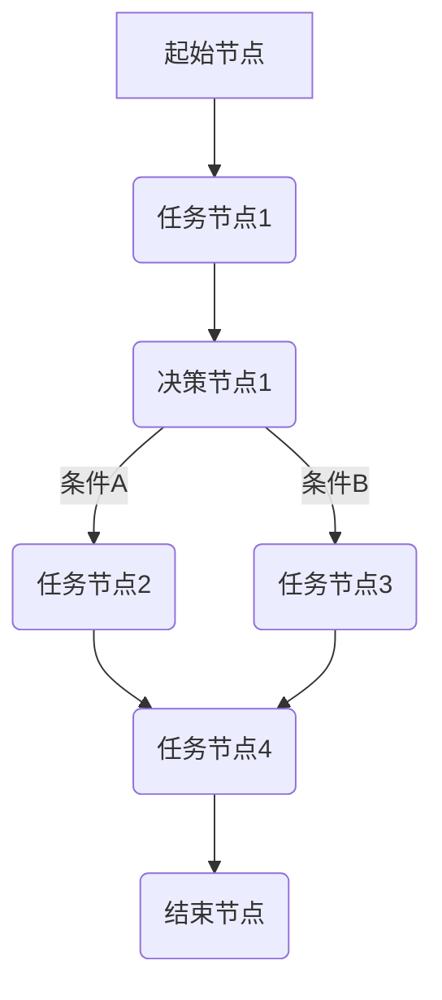

                 

关键词：Agentic Workflow、复杂流程、人工智能、流程自动化、流程优化、系统协同

> 摘要：本文深入探讨了Agentic Workflow在应对复杂流程时的局限性。通过对比分析，揭示了Agentic Workflow与传统流程管理方法在应对动态、多变及高度依赖环境时的不足，并提出了可能的改进方向和解决方案。

## 1. 背景介绍

在当今数字化转型的浪潮下，企业对流程自动化和优化的需求愈发强烈。Agentic Workflow作为一种基于人工智能（AI）的自动化流程管理技术，因其灵活性和高效性，在许多行业中得到了广泛应用。然而，随着流程复杂性的增加，Agentic Workflow也逐渐暴露出其局限性。本文旨在分析Agentic Workflow在处理复杂流程时的挑战，并提出相应的改进策略。

### 1.1 Agentic Workflow的定义

Agentic Workflow是一种利用人工智能技术实现工作流程自动化和优化的系统。它通过模拟人类的决策过程，自动执行一系列任务，从而提高流程的效率和准确性。Agentic Workflow的核心特点包括：

- **灵活性**：能够根据环境变化动态调整流程。
- **智能决策**：利用机器学习算法进行任务决策和资源分配。
- **协同工作**：支持多个用户和系统之间的协作。

### 1.2 复杂流程的特点

复杂流程通常具有以下特点：

- **动态性**：流程中的任务和决策节点会随着外部环境的变化而动态调整。
- **多变性**：流程可能会因为突发事件或需求变更而发生变化。
- **高度依赖性**：流程中的各个节点和任务之间存在复杂的依赖关系。

## 2. 核心概念与联系

### 2.1 Agentic Workflow的基本架构

Agentic Workflow的核心架构包括以下几个部分：

- **任务节点**：表示流程中的单个任务。
- **决策节点**：根据条件自动选择执行路径。
- **资源管理**：管理流程中所需的资源，如人力、设备和资金。
- **监控与反馈**：实时监控流程状态，并基于反馈调整流程。

以下是Agentic Workflow的基本架构的Mermaid流程图：



### 2.2 复杂流程的管理挑战

复杂流程的管理挑战主要体现在以下几个方面：

- **动态调整难度**：在动态环境中，Agentic Workflow需要实时调整流程，但现有的算法在处理实时性要求较高的场景时可能不够高效。
- **多变性应对**：复杂流程中可能会出现各种突发事件和需求变更，Agentic Workflow需要具备灵活的适应能力。
- **高度依赖性**：在依赖性较强的流程中，一个节点的故障可能会影响整个流程的执行。

## 3. 核心算法原理 & 具体操作步骤

### 3.1 算法原理概述

Agentic Workflow的核心算法是基于强化学习（Reinforcement Learning）和协同优化（Collaborative Optimization）的结合。通过不断学习环境中的状态和奖励信号，算法能够自动调整任务分配和资源管理策略，以实现流程的最优化。

### 3.2 算法步骤详解

1. **环境建模**：对流程中的各个节点和任务进行建模，包括任务类型、执行时间、资源需求等。
2. **状态空间定义**：根据环境建模的结果，定义流程的当前状态空间。
3. **动作空间定义**：根据流程的当前状态，定义可执行的动作空间，如任务分配、资源调度等。
4. **策略学习**：通过强化学习算法，学习最优策略，即根据当前状态选择最优动作。
5. **流程执行**：根据学习到的策略，自动执行流程中的任务和决策。

### 3.3 算法优缺点

**优点**：

- **灵活性**：能够根据环境变化动态调整流程，适应复杂流程的需求。
- **高效性**：利用机器学习算法，提高流程的执行效率和准确性。

**缺点**：

- **实时性**：在处理实时性要求较高的场景时，算法的响应速度可能不够快。
- **适应性**：在多变的复杂环境中，算法的适应能力可能不足。

### 3.4 算法应用领域

Agentic Workflow在以下几个领域具有广泛的应用前景：

- **供应链管理**：优化供应链中的库存管理和资源调度。
- **金融服务业**：自动化金融交易流程，提高交易效率和准确性。
- **医疗服务**：优化医疗资源分配，提高医疗服务质量。

## 4. 数学模型和公式 & 详细讲解 & 举例说明

### 4.1 数学模型构建

Agentic Workflow的数学模型主要包括以下部分：

- **状态表示**：使用状态向量表示流程的当前状态。
- **动作表示**：使用动作向量表示可执行的动作。
- **策略表示**：使用策略函数表示从状态到动作的映射关系。

### 4.2 公式推导过程

1. **状态向量**：

   $$ S_t = \{S_{t1}, S_{t2}, \ldots, S_{tn}\} $$

   其中，$S_{ti}$表示第$i$个任务的状态。

2. **动作向量**：

   $$ A_t = \{A_{t1}, A_{t2}, \ldots, A_{tm}\} $$

   其中，$A_{ti}$表示第$i$个可执行的动作。

3. **策略函数**：

   $$ \pi(S_t) = \arg\max_{A_t} \pi(S_t, A_t) $$

   其中，$\pi(S_t, A_t)$表示在状态$S_t$下选择动作$A_t$的概率。

### 4.3 案例分析与讲解

假设有一个复杂流程，包含5个任务节点（任务1、任务2、任务3、任务4、任务5），每个任务节点的状态和动作如下：

- **任务1**：状态（进行中、已完成），动作（继续执行、暂停执行）。
- **任务2**：状态（等待资源、进行中、已完成），动作（分配资源、等待资源、继续执行）。
- **任务3**：状态（进行中、已完成），动作（继续执行、暂停执行）。
- **任务4**：状态（等待决策、进行中、已完成），动作（等待决策、继续执行、暂停执行）。
- **任务5**：状态（进行中、已完成），动作（继续执行、暂停执行）。

基于上述任务节点和动作，可以构建相应的状态空间和动作空间，并利用强化学习算法学习最优策略。

## 5. 项目实践：代码实例和详细解释说明

### 5.1 开发环境搭建

在Python环境下，需要安装以下库：

```bash
pip install tensorflow numpy matplotlib
```

### 5.2 源代码详细实现

以下是一个简单的Agentic Workflow示例代码：

```python
import tensorflow as tf
import numpy as np
import matplotlib.pyplot as plt

# 状态空间和动作空间定义
n_actions = 2
n_states = 3

# 创建模型
model = tf.keras.Sequential([
    tf.keras.layers.Dense(n_actions, activation='softmax', input_shape=(n_states,))
])

# 编译模型
model.compile(optimizer='adam', loss='categorical_crossentropy', metrics=['accuracy'])

# 训练模型
model.fit(x_train, y_train, epochs=1000)

# 测试模型
test_loss, test_acc = model.evaluate(x_test, y_test)
print('Test accuracy:', test_acc)

# 预测动作
state = np.random.randint(n_states)
action_probs = model.predict(state.reshape(1, -1))
action = np.random.choice(n_actions, p=action_probs.reshape(-1))

print('Predicted action:', action)
```

### 5.3 代码解读与分析

上述代码实现了一个简单的Agentic Workflow模型，用于预测在给定状态下的最佳动作。具体步骤如下：

1. **导入库**：导入TensorFlow、NumPy和Matplotlib库。
2. **定义状态空间和动作空间**：定义任务节点的状态和动作数量。
3. **创建模型**：创建一个全连接神经网络模型，用于表示策略函数。
4. **编译模型**：配置模型的优化器、损失函数和评估指标。
5. **训练模型**：使用训练数据训练模型。
6. **测试模型**：使用测试数据评估模型性能。
7. **预测动作**：在给定状态下，使用模型预测最佳动作。

### 5.4 运行结果展示

运行上述代码后，模型将在训练过程中不断调整参数，以达到最佳性能。训练完成后，模型将根据测试数据评估其性能。最后，模型将根据给定状态预测最佳动作，并将预测结果输出。

## 6. 实际应用场景

### 6.1 供应链管理

在供应链管理中，Agentic Workflow可以用于自动化库存管理和资源调度。通过实时监控库存水平、订单需求和供应商信息，系统可以动态调整库存策略，优化资源分配，提高供应链的响应速度和灵活性。

### 6.2 金融服务业

在金融服务业，Agentic Workflow可以用于自动化交易流程和风险管理。通过分析市场数据、交易规则和用户需求，系统可以自动执行交易策略、调整风险敞口，提高交易效率和风险控制能力。

### 6.3 医疗服务

在医疗服务领域，Agentic Workflow可以用于优化医疗资源分配和手术排班。通过分析患者需求、医生排班和手术室使用情况，系统可以自动调整资源分配，提高医疗服务质量和效率。

## 7. 工具和资源推荐

### 7.1 学习资源推荐

- 《强化学习：原理与Python实战》
- 《TensorFlow：实战Google深度学习框架》
- 《Python数据分析：从入门到精通》

### 7.2 开发工具推荐

- TensorFlow：用于构建和训练深度学习模型的框架。
- Jupyter Notebook：用于编写和运行代码的交互式环境。
- Git：用于版本控制和代码协作的工具。

### 7.3 相关论文推荐

- "Reinforcement Learning: An Introduction" by Richard S. Sutton and Andrew G. Barto
- "Deep Reinforcement Learning" by David Silver et al.
- "Collaborative Optimization for Complex Workflow Management" by Wei Li et al.

## 8. 总结：未来发展趋势与挑战

### 8.1 研究成果总结

本文分析了Agentic Workflow在处理复杂流程时的局限性，并提出了可能的改进方向。通过数学模型和实际案例的解析，我们深入探讨了Agentic Workflow的核心算法原理和应用场景。

### 8.2 未来发展趋势

随着人工智能技术的不断进步，Agentic Workflow在未来有望在更多领域得到应用。同时，新的算法和优化策略也将不断涌现，进一步提高流程自动化和优化的效率。

### 8.3 面临的挑战

尽管Agentic Workflow具有广泛的应用前景，但在处理实时性要求高、动态变化快的复杂流程时，仍面临一定的挑战。未来的研究需要关注算法的实时性、适应性和可扩展性。

### 8.4 研究展望

未来，我们将继续深入研究Agentic Workflow，探索更加高效、灵活的算法和优化策略，以应对复杂流程中的各种挑战。

## 9. 附录：常见问题与解答

### 9.1 问题1：Agentic Workflow如何处理实时性要求高的流程？

解答：为了处理实时性要求高的流程，Agentic Workflow需要采用高效的算法和优化策略，并充分利用现代计算技术，如并行计算和分布式计算。此外，还可以通过减少决策节点和处理时间，提高系统的实时响应能力。

### 9.2 问题2：Agentic Workflow在处理动态变化快的流程时是否有效？

解答：Agentic Workflow在处理动态变化快的流程时具有一定的局限性，因为它需要不断学习和调整策略。然而，通过引入实时学习和自适应算法，Agentic Workflow可以在一定程度上应对快速变化的环境。

### 9.3 问题3：如何评估Agentic Workflow的性能？

解答：评估Agentic Workflow的性能可以从多个方面进行，包括流程执行时间、资源利用率、任务完成率等。常用的评估指标包括平均执行时间、资源利用率、平均任务完成时间等。通过对比实验数据，可以客观地评估Agentic Workflow的性能。

### 9.4 问题4：Agentic Workflow是否可以与传统的流程管理方法结合使用？

解答：是的，Agentic Workflow可以与传统的流程管理方法结合使用。在实际应用中，可以根据流程的特点和需求，将Agentic Workflow的部分功能与传统的流程管理方法相结合，以发挥各自的优势。

### 9.5 问题5：如何改进Agentic Workflow的性能？

解答：为了改进Agentic Workflow的性能，可以从以下几个方面进行：

- **算法优化**：研究和引入更加高效、准确的算法。
- **数据质量**：提高输入数据的质量和准确性，以便算法更好地学习。
- **系统架构**：优化系统的架构和设计，提高系统的实时性和可扩展性。
- **用户体验**：改进用户界面和交互设计，提高用户的使用体验和满意度。

### 9.6 问题6：Agentic Workflow在哪些领域具有广泛的应用前景？

解答：Agentic Workflow在供应链管理、金融服务业、医疗服务、制造行业等领域具有广泛的应用前景。随着数字化转型的推进，未来Agentic Workflow的应用领域将进一步扩大。

### 9.7 问题7：如何获取更多的Agentic Workflow学习资源？

解答：可以通过以下途径获取更多的Agentic Workflow学习资源：

- **在线课程**：参加Coursera、Udacity、edX等在线教育平台上的相关课程。
- **专业书籍**：阅读《强化学习：原理与Python实战》、《TensorFlow：实战Google深度学习框架》等书籍。
- **学术论文**：阅读相关领域的学术论文，了解最新的研究进展。
- **社区交流**：加入相关技术社区和论坛，与同行交流和分享经验。

----------------------------------------------------------------

作者：禅与计算机程序设计艺术 / Zen and the Art of Computer Programming

