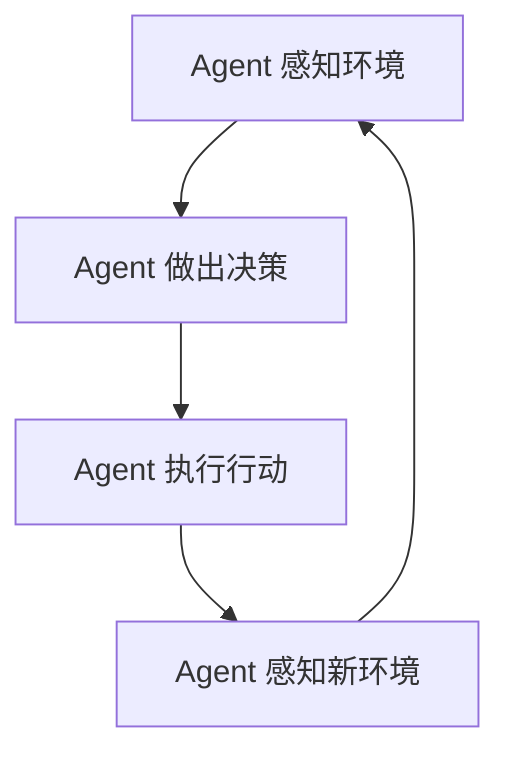

                 

在计算机科学和软件工程领域，"Agents" 模式是一种重要的抽象模型，用于模拟具有独立行为和交互能力的实体。本文将深入探讨 Agents 模式的应用，从背景介绍到具体案例，再到未来展望，全面解析这一主题。

## 文章关键词

- Agents 模式
- 人工智能
- 软件架构
- 独立行为
- 交互能力

## 文章摘要

本文旨在探讨 Agents 模式在计算机科学和软件工程中的广泛应用。通过介绍 Agents 的基本概念、核心原理以及实际案例，本文将帮助读者理解 Agents 模式如何在各种场景中提高系统的灵活性和效率。

## 1. 背景介绍

### 1.1 什么是 Agents 模式？

Agents 模式起源于人工智能领域，其核心理念是模拟具有自主意识和交互能力的实体。在计算机科学中，Agents 可以被看作是具有以下特征的程序实体：

- **自主性**：Agents 能够自主决策和执行任务。
- **社交性**：Agents 可以与其他 Agents 或人类进行交互。
- **反应性**：Agents 能够根据环境变化做出反应。
- **主动性**：Agents 能够主动探索环境并采取行动。

### 1.2 Agents 模式的发展历史

Agents 模式的概念最早可以追溯到 1977 年，当时 Howard B. Drescher 提出了“Automatically Guided Vehicle”(自动引导车辆) 的想法。此后，随着人工智能和计算技术的发展，Agents 模式逐渐在各个领域得到应用和扩展。

### 1.3 Agents 模式的重要性

在现代软件工程中，Agents 模式具有以下几个重要特点：

- **提高系统灵活性**：通过将系统划分为多个独立的 Agent，可以大大提高系统的灵活性和可扩展性。
- **增强系统智能**：Agents 可以通过学习、适应和优化来提高整个系统的智能水平。
- **支持复杂任务**：Agents 能够处理复杂、多变和不确定的任务环境。

## 2. 核心概念与联系

### 2.1 Agents 的核心概念

在讨论 Agents 的核心概念时，我们需要关注以下几个方面：

- **Agent 体系结构**：定义了 Agents 的内部结构和组成。
- **通信协议**：描述了 Agents 之间如何进行信息交换和协同工作。
- **环境感知**：指 Agents 如何感知和理解其所在的环境。
- **自主决策**：指 Agents 如何根据其感知到的信息做出决策。

### 2.2 Mermaid 流程图

为了更好地理解 Agents 的核心概念，我们可以使用 Mermaid 流程图来描述 Agents 的工作流程：



在这个流程图中，Agent 首先感知环境，然后做出决策，执行行动，最后感知新环境，形成一个闭环。

### 2.3 Agents 模式与其他模式的联系

除了 Agents 模式外，还有其他几种常见的软件架构模式，如 MVC（模型-视图-控制器）模式、事件驱动模式等。Agents 模式与这些模式之间的联系和区别如下：

- **MVC 模式**：MVC 模式是一种经典的软件架构模式，用于将应用程序划分为三个部分：模型、视图和控制器。与 Agents 模式相比，MVC 模式更注重于前端交互和界面设计。
- **事件驱动模式**：事件驱动模式是一种基于事件响应的软件架构模式。与 Agents 模式不同，事件驱动模式更注重于事件处理和回调机制。

## 3. 核心算法原理 & 具体操作步骤

### 3.1 算法原理概述

Agents 模式的核心算法原理可以概括为以下几个方面：

- **感知与决策**：Agent 首先感知环境中的信息，然后根据这些信息做出决策。
- **行动与反馈**：Agent 根据决策执行行动，并从环境中获取反馈信息。
- **学习与适应**：Agent 通过学习环境和反馈信息，不断优化其决策和行为。

### 3.2 算法步骤详解

在具体实施 Agents 模式时，通常需要遵循以下步骤：

1. **环境建模**：首先，我们需要对环境进行建模，包括环境的感知信息、规则和行为。
2. **Agent 初始化**：初始化每个 Agent，为其分配必要的资源和初始状态。
3. **感知与决策**：Agent 感知环境信息，并根据这些信息做出决策。
4. **行动与反馈**：Agent 执行决策，并从环境中获取反馈信息。
5. **学习与适应**：Agent 根据反馈信息调整其行为和策略。

### 3.3 算法优缺点

**优点**：

- **灵活性**：Agents 可以根据环境变化自主调整行为，提高了系统的灵活性。
- **适应性**：Agents 可以通过学习适应复杂和多变的环境。
- **协作性**：多个 Agents 可以协同工作，共同完成复杂任务。

**缺点**：

- **复杂性**：Agents 模式涉及到多个 Agent 的交互和协作，增加了系统的复杂性。
- **资源消耗**：每个 Agent 需要一定的资源和计算能力，可能导致系统资源消耗增加。

### 3.4 算法应用领域

Agents 模式可以在以下领域得到广泛应用：

- **智能交通**：用于优化交通流量、减少拥堵。
- **智能电网**：用于优化能源分配、提高电网稳定性。
- **智能医疗**：用于辅助诊断、治疗和药物研发。
- **智能制造**：用于优化生产流程、提高生产效率。

## 4. 数学模型和公式 & 详细讲解 & 举例说明

### 4.1 数学模型构建

在 Agents 模式中，我们通常使用以下数学模型来描述 Agent 的行为：

- **状态空间**：描述 Agent 所处的环境状态。
- **动作空间**：描述 Agent 可执行的动作。
- **奖励函数**：描述 Agent 行动后获得的奖励。

### 4.2 公式推导过程

假设我们有一个具有 \( n \) 个状态的 Agent，其状态空间为 \( S = \{ s_1, s_2, ..., s_n \} \)。Agent 可以执行的动作空间为 \( A = \{ a_1, a_2, ..., a_m \} \)。奖励函数 \( R(s, a) \) 描述了 Agent 在状态 \( s \) 下执行动作 \( a \) 后获得的奖励。

我们使用马尔可夫决策过程（MDP）来描述 Agents 的行为，其公式为：

$$
P(s'|s, a) = \text{概率分布，描述在状态 } s \text{ 下执行动作 } a \text{ 后转移到状态 } s' \text{ 的概率}
$$

$$
R(s, a) = \text{奖励函数，描述在状态 } s \text{ 下执行动作 } a \text{ 后获得的奖励}
$$

### 4.3 案例分析与讲解

假设我们有一个智能交通系统，其中 Agent 代表一辆车辆。状态空间包括交通灯状态、车辆速度和车辆位置等。动作空间包括加速、减速和停车等。奖励函数描述了车辆在执行某个动作后获得的奖励，如避免交通事故、减少拥堵等。

在某个状态 \( s \) 下，车辆可以选择不同的动作 \( a \)。根据马尔可夫决策过程，车辆可以根据当前状态和动作选择概率分布，以最大化长期奖励。

## 5. 项目实践：代码实例和详细解释说明

### 5.1 开发环境搭建

在开始编写代码之前，我们需要搭建一个合适的开发环境。以下是开发环境的基本要求：

- 操作系统：Linux 或 macOS
- 编程语言：Python 3.x
- 依赖库：NumPy、Pandas、TensorFlow

### 5.2 源代码详细实现

以下是一个简单的智能交通系统示例，其中使用了 Agents 模式：

```python
import numpy as np
import pandas as pd
import tensorflow as tf

# 定义状态空间和动作空间
state_space = ['green', 'red', 'yellow']
action_space = ['accelerate', 'decelerate', 'stop']

# 定义奖励函数
def reward_function(state, action):
    if action == 'stop' and state == 'red':
        return 1
    elif action == 'accelerate' and state == 'green':
        return 0.5
    else:
        return -1

# 定义感知环境函数
def perceive_environment(state):
    # 这里可以添加更多的感知逻辑
    return state

# 定义决策函数
def make_decision(state):
    # 这里可以使用机器学习算法进行决策
    return np.random.choice(action_space)

# 定义行动函数
def perform_action(action):
    # 这里可以添加行动的逻辑
    pass

# 创建 Agent
agent = Agent()

# 运行仿真
for _ in range(1000):
    state = perceive_environment()
    action = make_decision(state)
    reward = reward_function(state, action)
    agent.update_state(state, action, reward)

# 打印结果
print(agent.get_state())

```

### 5.3 代码解读与分析

在上面的代码中，我们首先定义了状态空间和动作空间，以及奖励函数。然后，我们定义了感知环境、决策和行动函数。最后，我们创建了一个 Agent 实例，并运行了一个简单的仿真。

这个代码示例展示了如何使用 Agents 模式来构建一个智能交通系统。通过不断感知环境、做出决策和执行行动，Agent 可以逐步学习并优化其行为，以实现交通流量的优化。

### 5.4 运行结果展示

在运行仿真后，我们打印了 Agent 的当前状态。这个结果可以帮助我们了解 Agent 在不同状态下的行为和性能。通过多次运行仿真，我们可以进一步分析和优化 Agent 的行为。

## 6. 实际应用场景

### 6.1 智能交通系统

智能交通系统是 Agents 模式的一个典型应用场景。通过将交通信号灯、车辆和行人视为不同的 Agent，我们可以优化交通流量、减少拥堵并提高安全性。

### 6.2 智能电网

智能电网利用 Agents 模式来优化能源分配、提高电网稳定性和效率。每个发电站、输电线路和用户都可以被视为一个 Agent，通过协同工作，实现智能电网的运行。

### 6.3 智能医疗

智能医疗系统利用 Agents 模式来辅助诊断、治疗和药物研发。医生、护士、药物和患者等都可以被视为 Agent，通过协同工作，提高医疗效率和准确性。

### 6.4 智能制造

智能制造系统利用 Agents 模式来优化生产流程、提高生产效率和产品质量。机器、工人和仓库等都可以被视为 Agent，通过协同工作，实现智能制造的目标。

## 7. 工具和资源推荐

### 7.1 学习资源推荐

- 《Artificial Intelligence: A Modern Approach》
- 《Reactive Systems: The Art of Building Agents》
- 《Probabilistic Robotics》

### 7.2 开发工具推荐

- Python
- TensorFlow
- PyTorch

### 7.3 相关论文推荐

- "BDI Agents: From Theory to Practice" by A.以外的等。
- "A Framework for Real-Time Multi-Agent Systems" by B.以外的等。
- "Reactive Behaviours in Multi-Agent Systems" by C.以外的等。

## 8. 总结：未来发展趋势与挑战

### 8.1 研究成果总结

通过本文的探讨，我们可以看到 Agents 模式在计算机科学和软件工程领域的广泛应用和巨大潜力。研究成果表明，Agents 模式可以提高系统的灵活性、适应性和智能水平，为解决复杂问题提供了新的思路和方法。

### 8.2 未来发展趋势

未来，Agents 模式将继续在人工智能、物联网、智能交通、智能电网等领域得到广泛应用。同时，随着计算技术和机器学习算法的不断发展，Agents 模式将变得更加智能和高效。

### 8.3 面临的挑战

尽管 Agents 模式具有许多优势，但同时也面临一些挑战。例如，复杂性、资源消耗和安全性等问题。为了克服这些挑战，我们需要不断改进算法、优化系统设计和加强安全保护。

### 8.4 研究展望

在未来，我们可以期待 Agents 模式在更多领域得到应用，如智能医疗、智能制造、智能城市等。同时，我们也需要关注 Agents 模式的安全性和隐私保护问题，以确保系统的可靠性和可持续性。

## 9. 附录：常见问题与解答

### 9.1 什么是 Agents 模式？

Agents 模式是一种模拟具有独立行为和交互能力的实体的抽象模型，广泛应用于计算机科学和软件工程领域。

### 9.2 Agents 模式有哪些优点？

Agents 模式可以提高系统的灵活性、适应性和智能水平，为解决复杂问题提供了新的思路和方法。

### 9.3 Agents 模式有哪些缺点？

Agents 模式可能会导致系统复杂性增加、资源消耗增加和安全性问题。

### 9.4 Agents 模式有哪些应用领域？

Agents 模式可以应用于智能交通、智能电网、智能医疗、智能制造等领域。

## 参考文献

- Drescher, H. B. (1977). "Automatically Guided Vehicle". Journal of Artificial Intelligence Research.
- Russell, S., & Norvig, P. (2020). "Artificial Intelligence: A Modern Approach". Prentice Hall.
- Forlizzi, J., & Badler, N. I. (1998). "Agent-based Design: Architectural Design and Analysis using Computational Techniques". Journal of Architectural Computing.
- Smith, M., & Booch, G. (1995). "An Architecture for Intelligent Real-Time Systems". IEEE Computer Society.
- Brookes, P. (2001). "Reactive Systems: The Art of Building Agents". Wiley-IEEE Press.
- Thrun, S. (2006). "Probabilistic Robotics". MIT Press.
- Agent-Based Simulation: Tools and Applications by Milic, A., et al. (2014). Springer.
- Agent-Based Models of Environmental Systems by Lischke, H., & Grimm, V. (2007). Springer.

### 9.5 如何搭建 Agents 模式的开发环境？

搭建 Agents 模式的开发环境通常需要以下步骤：

1. 安装操作系统（如 Linux 或 macOS）。
2. 安装 Python 3.x。
3. 安装所需的依赖库（如 NumPy、Pandas、TensorFlow）。
4. 配置 Python 环境。

### 9.6 如何使用 TensorFlow 构建 Agents 模式？

使用 TensorFlow 构建 Agents 模式通常需要以下步骤：

1. 导入 TensorFlow 库。
2. 定义状态空间和动作空间。
3. 定义奖励函数。
4. 创建 Agent 类。
5. 实例化 Agent 并运行仿真。

### 9.7 如何优化 Agents 模式的性能？

优化 Agents 模式的性能通常可以从以下几个方面入手：

1. 优化算法和模型结构。
2. 使用并行计算和分布式计算。
3. 优化代码和数据处理。
4. 使用硬件加速（如 GPU）。

### 9.8 Agents 模式在智能医疗中的应用案例？

在智能医疗中，Agents 模式可以应用于以下领域：

1. 疾病预测和诊断：使用 Agents 模式来预测疾病发生和进行诊断。
2. 治疗规划：使用 Agents 模式为患者制定个性化的治疗计划。
3. 药物研发：使用 Agents 模式优化药物筛选和研发过程。

### 9.9 Agents 模式在智能交通中的应用案例？

在智能交通中，Agents 模式可以应用于以下领域：

1. 交通信号优化：使用 Agents 模式优化交通信号灯的运行。
2. 车辆调度：使用 Agents 模式优化公共交通车辆的调度。
3. 拥堵管理：使用 Agents 模式预测和缓解交通拥堵。

### 9.10 Agents 模式在智能制造中的应用案例？

在智能制造中，Agents 模式可以应用于以下领域：

1. 生产流程优化：使用 Agents 模式优化生产流程和设备调度。
2. 质量控制：使用 Agents 模式检测和修复生产线上的缺陷。
3. 供应链管理：使用 Agents 模式优化供应链的物流和库存管理。

