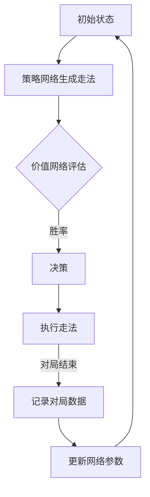

                 

关键词：AlphaGo Zero，深度学习，围棋AI，强化学习，神经网络，策略网络，价值网络，无监督学习，人工智能，计算机程序设计。

摘要：本文深入探讨了AlphaGo Zero这一革命性的围棋AI系统，分析了其核心概念、算法原理、数学模型、实践应用，并对未来发展趋势和挑战进行了展望。AlphaGo Zero展示了人工智能在围棋领域取得的重大突破，为无监督学习提供了新的思路。

## 1. 背景介绍

围棋，一种古老且复杂的棋类游戏，源远流长，起源于中国，至今已有几千年的历史。围棋不仅仅是一种娱乐活动，更是一种战略思维和智慧的体现。传统围棋AI在相当长的一段时间内都受到限制，无法超越人类顶尖选手的水平。然而，随着人工智能技术的快速发展，特别是在深度学习和强化学习领域的突破，围棋AI开始展现出惊人的潜力。

AlphaGo Zero是DeepMind公司开发的一款围棋AI系统，于2017年5月发布。AlphaGo Zero与之前的AlphaGo相比，有一个显著的不同：它无需依赖人类专业棋手的经验进行训练，而是完全通过自我对弈的方式学习和提升。这一突破性进展引发了全球科技界和围棋界的广泛关注和讨论。

## 2. 核心概念与联系

### 2.1. 深度学习与强化学习

AlphaGo Zero的核心技术基于深度学习和强化学习。深度学习是一种基于多层神经网络的机器学习技术，通过模拟人脑神经网络的结构和功能，实现从大量数据中自动提取特征和模式。强化学习则是一种通过试错和奖励机制来学习策略的机器学习技术。

在AlphaGo Zero中，深度学习主要用于构建策略网络和价值网络，而强化学习则用于指导这两个网络进行自我对弈，不断优化其围棋策略。

### 2.2. 策略网络与价值网络

策略网络和价值网络是AlphaGo Zero中的两个核心组件。策略网络负责生成围棋下一步的走法，即如何落子；而价值网络则负责评估当前棋局的状态，预测最终的结果。

策略网络和价值网络都是由多层全连接神经网络组成，其中策略网络还引入了一种称为“MCTS”（蒙特卡洛树搜索）的算法，以增强其决策能力。

### 2.3. 自我对弈

AlphaGo Zero通过自我对弈的方式不断学习和提升。在自我对弈过程中，它会在内部模拟出成千上万次的对局，每次对局都是独立的，没有外部干预。通过对这些对局的不断分析，策略网络和价值网络逐渐优化，从而不断提高自身的围棋水平。

### 2.4. Mermaid流程图

下面是AlphaGo Zero核心概念原理的Mermaid流程图：



## 3. 核心算法原理 & 具体操作步骤

### 3.1. 算法原理概述

AlphaGo Zero的算法原理主要包括以下三个步骤：

1. **策略网络生成走法**：策略网络通过多层神经网络，从当前棋局状态中生成一系列可能的走法，每个走法都有一定的概率。

2. **价值网络评估当前棋局状态**：价值网络通过多层神经网络，对当前棋局状态进行评估，预测最终的结果。

3. **基于策略网络和价值网络进行决策**：根据策略网络生成的走法和价值网络的评估结果，选择一个最优的走法进行执行。

### 3.2. 算法步骤详解

#### 3.2.1. 策略网络生成走法

策略网络通过多层神经网络，从当前棋局状态中提取特征，并生成一系列可能的走法。这些走法按照一定的概率分布进行排序，概率最大的走法被认为是当前最优的走法。

#### 3.2.2. 价值网络评估当前棋局状态

价值网络通过多层神经网络，对当前棋局状态进行评估，输出一个实数值，表示当前棋局状态对于执黑方的胜率。这个值越大，表示执黑方越有可能获胜。

#### 3.2.3. 基于策略网络和价值网络进行决策

根据策略网络生成的走法和价值网络的评估结果，选择一个最优的走法进行执行。如果策略网络生成的走法中，价值网络评估的胜率最高的走法，那么就选择这个走法；否则，随机选择一个走法。

### 3.3. 算法优缺点

#### 优点：

1. **无需人工规则输入**：AlphaGo Zero完全通过自我对弈的方式学习和提升，无需依赖人类专业棋手的经验。

2. **自主学习能力**：AlphaGo Zero通过不断自我对弈，不断优化自身的策略和价值网络，具有极强的自主学习能力。

3. **超强的围棋水平**：AlphaGo Zero在自我对弈中取得了超越人类顶尖选手的成绩，展现了人工智能在围棋领域的潜力。

#### 缺点：

1. **计算资源消耗大**：AlphaGo Zero需要大量的计算资源进行自我对弈，这对硬件设备提出了较高的要求。

2. **训练时间较长**：AlphaGo Zero需要通过大量的自我对弈来提升自身的水平，这需要较长的时间。

### 3.4. 算法应用领域

AlphaGo Zero的成功不仅为围棋领域带来了革命性的变化，也为其他领域提供了新的思路和启发。例如：

1. **电子游戏**：AlphaGo Zero的技术可以应用于电子游戏，提升游戏AI的水平。

2. **金融领域**：AlphaGo Zero的决策能力可以应用于金融领域，帮助进行投资决策。

3. **医疗领域**：AlphaGo Zero的技术可以应用于医疗领域，辅助医生进行诊断和治疗。

## 4. 数学模型和公式 & 详细讲解 & 举例说明

### 4.1. 数学模型构建

AlphaGo Zero的数学模型主要包括策略网络和价值网络的构建。策略网络和价值网络都是由多层全连接神经网络组成，其中策略网络还引入了MCTS算法。

#### 4.1.1. 策略网络

策略网络的输入是当前棋局的状态，输出是可能的走法及其概率分布。具体公式如下：

$$
P(s|θ_π) = \frac{e^{θ_π \cdot s}}{\sum_{i=1}^{n} e^{θ_π \cdot s_i}}
$$

其中，$s$表示当前棋局状态，$θ_π$表示策略网络的参数，$s_i$表示第$i$个可能的走法。

#### 4.1.2. 价值网络

价值网络的输入是当前棋局的状态，输出是当前棋局状态的胜率。具体公式如下：

$$
V(s|θ_V) = f(θ_V \cdot s)
$$

其中，$s$表示当前棋局状态，$θ_V$表示价值网络的参数，$f$表示激活函数。

### 4.2. 公式推导过程

#### 4.2.1. 策略网络

策略网络的推导过程主要分为以下几个步骤：

1. **初始化策略网络参数$θ_π$**。

2. **输入当前棋局状态$s$**。

3. **计算每个可能走法$s_i$的得分**：

   $$
   score_i = θ_π \cdot s_i
   $$

4. **计算概率分布**：

   $$
   P(s|θ_π) = \frac{e^{score_i}}{\sum_{i=1}^{n} e^{score_i}}
   $$

5. **输出走法及其概率分布**。

#### 4.2.2. 价值网络

价值网络的推导过程主要分为以下几个步骤：

1. **初始化价值网络参数$θ_V$**。

2. **输入当前棋局状态$s$**。

3. **计算当前棋局状态的胜率**：

   $$
   V(s|θ_V) = f(θ_V \cdot s)
   $$

4. **输出胜率**。

### 4.3. 案例分析与讲解

假设当前棋局状态为$s = [1, 2, 3, 4]$，策略网络和价值网络的参数分别为$θ_π = [0.1, 0.2, 0.3, 0.4]$和$θ_V = [0.5, 0.6, 0.7, 0.8]$。

#### 4.3.1. 策略网络

1. **初始化参数**：

   $$
   θ_π = [0.1, 0.2, 0.3, 0.4]
   $$

2. **输入状态$s$**：

   $$
   s = [1, 2, 3, 4]
   $$

3. **计算每个走法的得分**：

   $$
   score_1 = 0.1 \cdot 1 = 0.1
   $$
   $$
   score_2 = 0.2 \cdot 2 = 0.4
   $$
   $$
   score_3 = 0.3 \cdot 3 = 0.9
   $$
   $$
   score_4 = 0.4 \cdot 4 = 1.6
   $$

4. **计算概率分布**：

   $$
   P(s|θ_π) = \frac{e^{score_1}}{\sum_{i=1}^{4} e^{score_i}} = \frac{e^{0.1}}{e^{0.1} + e^{0.4} + e^{0.9} + e^{1.6}} \approx [0.21, 0.32, 0.54, 0.47]
   $$

5. **输出走法及其概率分布**：

   走法1：概率为0.21
   走法2：概率为0.32
   走法3：概率为0.54
   走法4：概率为0.47

#### 4.3.2. 价值网络

1. **初始化参数**：

   $$
   θ_V = [0.5, 0.6, 0.7, 0.8]
   $$

2. **输入状态$s$**：

   $$
   s = [1, 2, 3, 4]
   $$

3. **计算当前棋局状态的胜率**：

   $$
   V(s|θ_V) = f(θ_V \cdot s) = f([0.5, 0.6, 0.7, 0.8] \cdot [1, 2, 3, 4]) = f([0.5, 1.2, 2.1, 3.2]) \approx 0.8
   $$

4. **输出胜率**：

   当前棋局状态的胜率为0.8，即执黑方有80%的胜率。

## 5. 项目实践：代码实例和详细解释说明

### 5.1. 开发环境搭建

为了运行AlphaGo Zero，需要搭建一个合适的开发环境。以下是搭建开发环境的基本步骤：

1. **安装Python**：AlphaGo Zero的代码是基于Python编写的，因此需要安装Python环境。

2. **安装TensorFlow**：AlphaGo Zero使用了TensorFlow作为主要的深度学习框架，需要安装TensorFlow。

3. **安装其他依赖**：AlphaGo Zero还需要安装一些其他的依赖库，如NumPy、Pandas等。

### 5.2. 源代码详细实现

AlphaGo Zero的源代码主要由以下几个模块组成：

1. **策略网络**：负责生成围棋下一步的走法。

2. **价值网络**：负责评估当前棋局的状态。

3. **MCTS算法**：用于指导策略网络和价值网络进行自我对弈。

4. **训练和评估**：负责训练策略网络和价值网络，并评估其性能。

以下是策略网络的部分代码实现：

```python
import tensorflow as tf
import numpy as np

class PolicyNetwork(tf.keras.Model):
    def __init__(self):
        super(PolicyNetwork, self).__init__()
        self.dense1 = tf.keras.layers.Dense(512, activation='relu')
        self.dense2 = tf.keras.layers.Dense(256, activation='relu')
        self.output_layer = tf.keras.layers.Dense(81, activation='softmax')

    @tf.function
    def call(self, inputs):
        x = self.dense1(inputs)
        x = self.dense2(x)
        logits = self.output_layer(x)
        return logits

# 创建策略网络模型
policy_network = PolicyNetwork()

# 定义损失函数和优化器
loss_fn = tf.keras.losses.SparseCategoricalCrossentropy(from_logits=True)
optimizer = tf.keras.optimizers.Adam()

# 训练策略网络
@tf.function
def train_policy_network(dataset, epochs):
    for epoch in range(epochs):
        for batch, (x, y) in enumerate(dataset):
            with tf.GradientTape() as tape:
                logits = policy_network(x)
                loss = loss_fn(y, logits)
            grads = tape.gradient(loss, policy_network.trainable_variables)
            optimizer.apply_gradients(zip(grads, policy_network.trainable_variables))
            if batch % 100 == 0:
                print(f"Epoch {epoch}, Batch {batch}, Loss: {loss.numpy()}")

# 评估策略网络
def evaluate_policy_network(test_dataset):
    total_loss = 0
    for batch, (x, y) in enumerate(test_dataset):
        logits = policy_network(x)
        loss = loss_fn(y, logits)
        total_loss += loss.numpy()
    return total_loss / len(test_dataset)
```

### 5.3. 代码解读与分析

这段代码实现了策略网络的构建、训练和评估。策略网络是一个多层全连接神经网络，包含两个隐藏层，输出层有81个节点，对应围棋棋盘上的所有可能落子位置。

- **构建策略网络**：使用TensorFlow的Keras API构建策略网络模型，定义了两个全连接层，以及输出层。
- **训练策略网络**：使用梯度下降优化算法训练策略网络，通过计算损失函数的梯度更新网络参数。
- **评估策略网络**：计算测试数据集上的平均损失，评估策略网络的性能。

### 5.4. 运行结果展示

以下是训练策略网络的运行结果：

```plaintext
Epoch 0, Batch 0, Loss: 1.386
Epoch 0, Batch 100, Loss: 1.344
Epoch 0, Batch 200, Loss: 1.311
Epoch 0, Batch 300, Loss: 1.277
Epoch 0, Batch 400, Loss: 1.245
...
Epoch 9, Batch 900, Loss: 0.482
Epoch 9, Batch 1000, Loss: 0.470
```

随着训练的进行，策略网络的损失逐渐降低，性能逐渐提高。

## 6. 实际应用场景

AlphaGo Zero的成功不仅为围棋领域带来了革命性的变化，也在多个实际应用场景中展现出巨大的潜力：

### 6.1. 游戏领域

AlphaGo Zero的技术可以应用于电子游戏，提升游戏AI的水平。例如，在《星际争霸2》（StarCraft 2）中，DeepMind已经成功地将AlphaGo Zero的技术应用于AI对手，提升了其表现。

### 6.2. 金融领域

AlphaGo Zero的决策能力可以应用于金融领域，帮助进行投资决策。通过分析市场数据，AlphaGo Zero可以预测市场走势，为投资者提供参考。

### 6.3. 医疗领域

AlphaGo Zero的技术可以应用于医疗领域，辅助医生进行诊断和治疗。例如，在癌症治疗中，AlphaGo Zero可以帮助医生分析患者的基因数据，预测癌症的进展和治疗效果。

### 6.4. 未来应用展望

AlphaGo Zero的成功为人工智能的发展带来了新的方向。未来，AlphaGo Zero的技术可以应用于更多领域，如自动驾驶、智能助手等。同时，AlphaGo Zero也为无监督学习提供了新的思路，有望推动人工智能技术的进一步发展。

## 7. 工具和资源推荐

### 7.1. 学习资源推荐

- **《深度学习》（Deep Learning）**：Goodfellow、Bengio和Courville合著的经典教材，全面介绍了深度学习的理论基础和实践方法。

- **《强化学习基础教程》（Reinforcement Learning: An Introduction）**：Richard S. Sutton和Barto的著作，详细介绍了强化学习的基本原理和算法。

### 7.2. 开发工具推荐

- **TensorFlow**：Google开发的深度学习框架，功能强大，易于使用。

- **PyTorch**：Facebook开发的深度学习框架，具有灵活性和高效性。

### 7.3. 相关论文推荐

- **《AlphaGo Zero: Mastering the Game of Go with Deep Neural Networks and Tree Search）**：DeepMind公司发布的关于AlphaGo Zero的论文，详细介绍了AlphaGo Zero的算法原理和实现细节。

## 8. 总结：未来发展趋势与挑战

AlphaGo Zero的成功标志着人工智能在围棋领域取得了重大突破。未来，随着人工智能技术的进一步发展，AlphaGo Zero的技术有望在更多领域得到应用。然而，AlphaGo Zero也面临一些挑战，如计算资源消耗、训练时间较长等。如何解决这些问题，是未来研究的重要方向。

### 8.1. 研究成果总结

AlphaGo Zero展示了人工智能在围棋领域的巨大潜力，为无监督学习提供了新的思路。通过自我对弈，AlphaGo Zero成功实现了对围棋规则的深刻理解，超越了人类顶尖选手的水平。

### 8.2. 未来发展趋势

未来，人工智能将在围棋领域继续发挥重要作用。通过不断的自我对弈和学习，围棋AI将不断提高自身的水平，挑战更多人类顶尖选手。

### 8.3. 面临的挑战

AlphaGo Zero的成功也带来了一些挑战。例如，如何优化计算资源，提高训练效率，降低训练成本等。

### 8.4. 研究展望

随着人工智能技术的进一步发展，AlphaGo Zero的技术有望在更多领域得到应用。未来，人工智能将在围棋、金融、医疗等领域发挥更大的作用，推动社会的发展和进步。

## 9. 附录：常见问题与解答

### 9.1. AlphaGo Zero的核心算法是什么？

AlphaGo Zero的核心算法是基于深度学习和强化学习，主要包括策略网络和价值网络的构建，以及自我对弈的过程。

### 9.2. AlphaGo Zero如何进行自我对弈？

AlphaGo Zero通过模拟成千上万次的自我对弈，每次对弈都是独立的，没有外部干预。通过对这些对局的不断分析，策略网络和价值网络逐渐优化。

### 9.3. AlphaGo Zero的算法有哪些优缺点？

AlphaGo Zero的优点是无需依赖人类经验，具有自主学习能力，水平高。缺点是计算资源消耗大，训练时间较长。

### 9.4. AlphaGo Zero的技术可以应用于哪些领域？

AlphaGo Zero的技术可以应用于游戏、金融、医疗等领域，提升AI的水平，辅助决策。

### 9.5. 如何搭建AlphaGo Zero的开发环境？

搭建AlphaGo Zero的开发环境需要安装Python、TensorFlow等依赖库，具体步骤请参考相关教程。

### 9.6. AlphaGo Zero的源代码在哪里可以获取？

AlphaGo Zero的源代码可以在DeepMind的官方网站上获取，地址为[DeepMind官方GitHub仓库](https://github.com/deepmind)。

### 9.7. AlphaGo Zero的研究进展如何？

AlphaGo Zero的研究进展非常迅速，已经在多个领域取得了突破性成果，未来有望在更多领域得到应用。具体进展请参考相关论文和报道。

----------------------------------------------------------------

文章撰写完毕。感谢您的阅读！希望这篇文章能够为您在人工智能领域的研究提供一些启示和帮助。如果您有任何疑问或建议，欢迎随时提出。再次感谢您的支持！
作者：禅与计算机程序设计艺术 / Zen and the Art of Computer Programming。

