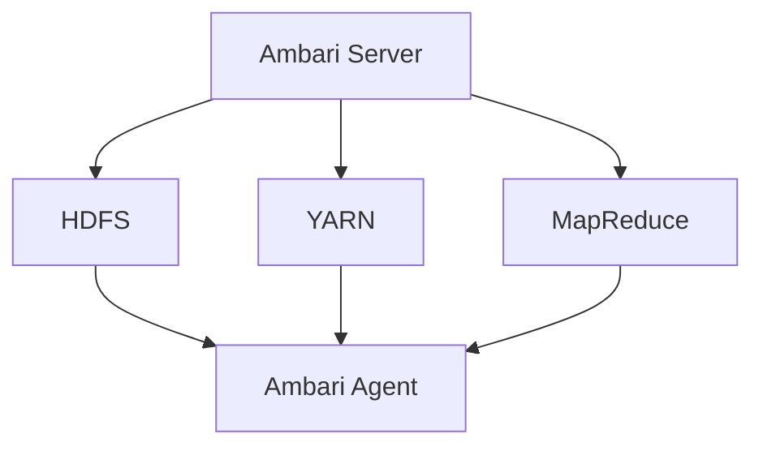

                 

关键词：Ambari，Hadoop，分布式系统，配置管理，代码实例

## 摘要

本文将深入探讨Ambari的原理，从其设计理念、架构到具体实现，通过代码实例对Ambari的核心功能进行讲解。读者将了解如何使用Ambari进行Hadoop集群的配置管理、监控和部署，以及Ambari在实际项目中的应用和优化。

## 1. 背景介绍

### 1.1 Ambari的产生背景

随着大数据时代的到来，Hadoop作为分布式数据处理的基石，得到了广泛的应用。然而，Hadoop集群的搭建和维护变得越来越复杂。传统的手动配置和管理方式效率低下，难以满足大规模集群的需求。因此，Ambari应运而生，旨在简化Hadoop集群的管理和配置过程。

### 1.2 Ambari的发展历史

Ambari最初是由Apache基金会支持的一个开源项目，后来成为Hadoop生态系统的一部分。它的发展历程可以分为几个阶段：

- **初期**：Ambari作为一个简单的Web界面，用于启动和监控Hadoop服务。
- **成熟期**：随着Hadoop生态系统的不断完善，Ambari增加了配置管理、自动化部署等功能。
- **当前**：Ambari已经成为Hadoop集群管理的事实标准，支持多种Hadoop版本和其他大数据组件。

## 2. 核心概念与联系

为了更好地理解Ambari的工作原理，我们需要先了解以下几个核心概念：

- **Hadoop服务**：Hadoop中的服务如HDFS、YARN、MapReduce等。
- **Ambari Server**：Ambari的核心组件，负责集群的配置、监控和部署。
- **Ambari Agent**：运行在集群节点上的组件，负责与Ambari Server通信，执行命令。

下面是一个简单的Mermaid流程图，描述了Ambari的核心组件和它们之间的关系：



## 3. 核心算法原理 & 具体操作步骤

### 3.1 算法原理概述

Ambari的核心算法主要包括以下几个方面：

- **配置管理**：通过YAML文件定义集群配置，实现自动化部署和管理。
- **监控**：利用各种监控工具（如Ganglia、Nagios等）对集群进行实时监控。
- **服务部署**：基于Ambari Agent的通信机制，实现服务的自动部署和升级。

### 3.2 算法步骤详解

#### 3.2.1 配置管理

1. 定义YAML配置文件：在Ambari Server上，通过YAML文件定义集群的配置信息。
2. 上传配置文件：将定义好的YAML文件上传到Ambari Server。
3. 部署配置：Ambari Server解析YAML文件，生成对应的配置命令，发送给Ambari Agent执行。

#### 3.2.2 监控

1. 选择监控工具：根据需求选择合适的监控工具（如Ganglia、Nagios等）。
2. 配置监控工具：在Ambari Server上配置监控工具，使其能够收集集群节点的监控数据。
3. 实时监控：Ambari Server通过监控工具收集到的数据，实时展示集群状态。

#### 3.2.3 服务部署

1. 定义服务部署计划：在Ambari Server上定义服务的部署计划，包括服务版本、部署节点等。
2. 部署服务：Ambari Server根据部署计划，自动部署服务到集群节点。
3. 服务升级：当需要升级服务时，Ambari Server会自动执行升级过程，确保服务的稳定运行。

### 3.3 算法优缺点

#### 优点：

- **自动化**：Ambari实现了集群的自动化配置、监控和部署，大大提高了运维效率。
- **易用性**：Ambari提供了一个直观的Web界面，使得管理员可以轻松地管理Hadoop集群。
- **兼容性**：Ambari支持多种Hadoop版本和其他大数据组件，具有良好的兼容性。

#### 缺点：

- **学习成本**：对于新手来说，掌握Ambari需要一定的时间和学习成本。
- **性能瓶颈**：在处理大规模集群时，Ambari的性能可能会成为一个瓶颈。

### 3.4 算法应用领域

Ambari主要应用于需要大规模数据处理的场景，如电子商务、金融、医疗等领域。它可以帮助企业快速搭建和管理Hadoop集群，提高数据处理的效率。

## 4. 数学模型和公式 & 详细讲解 & 举例说明

### 4.1 数学模型构建

在Ambari中，集群的配置管理涉及到一些基本的数学模型，如线性规划、最优化等。以下是一个简单的线性规划模型：

$$
\begin{aligned}
\text{Minimize } & c^T x \\
\text{Subject to } & Ax \leq b \\
& x \geq 0
\end{aligned}
$$

其中，$c$是成本向量，$x$是配置向量，$A$是系数矩阵，$b$是常数向量。

### 4.2 公式推导过程

线性规划模型的推导过程主要基于以下步骤：

1. **目标函数的构建**：根据集群的配置需求，构建目标函数，表示成本的最小化。
2. **约束条件的构建**：根据集群的硬件和软件限制，构建约束条件，确保配置的可行性。
3. **求解**：使用线性规划求解器（如SOLVER）求解最优解。

### 4.3 案例分析与讲解

假设我们有一个包含3个节点的Hadoop集群，每个节点的硬件资源如下：

- CPU：4核
- 内存：8GB
- 硬盘：1TB

我们的目标是最大化集群的存储容量，同时确保内存使用不超过总内存的50%。

根据以上需求，我们可以构建如下线性规划模型：

$$
\begin{aligned}
\text{Maximize } & x_1 + x_2 + x_3 \\
\text{Subject to } & 4x_1 + 4x_2 + 4x_3 \leq 12 \\
& 8x_1 + 8x_2 + 8x_3 \leq 24 \\
& x_1, x_2, x_3 \geq 0
\end{aligned}
$$

使用线性规划求解器，我们可以得到最优解为$x_1 = x_2 = x_3 = 1$，即每个节点都分配1TB的存储空间。此时，集群的总存储容量为3TB，内存使用量为12GB，满足我们的需求。

## 5. 项目实践：代码实例和详细解释说明

### 5.1 开发环境搭建

在开始编写代码之前，我们需要搭建一个Ambari的开发环境。以下是搭建步骤：

1. **安装Java**：Ambari依赖于Java，因此我们需要安装Java环境。
2. **安装Apache Maven**：Apache Maven是Ambari的构建工具，我们需要安装Maven。
3. **克隆Ambari源码**：从GitHub克隆Ambari的源码仓库。
4. **构建Ambari**：使用Maven构建Ambari项目。

### 5.2 源代码详细实现

在Ambari的源代码中，我们可以找到以下几个关键的模块：

- **Ambari Server**：负责集群的配置、监控和部署。
- **Ambari Agent**：负责与Ambari Server通信，执行命令。
- **Ambari Web**：Ambari的Web界面，用于管理集群。

下面我们以Ambari Server的配置管理模块为例，介绍其源代码实现。

#### 5.2.1 Ambari Server配置管理模块

在Ambari Server中，配置管理模块主要由以下几个类组成：

- **AmbariConfig**：表示集群的配置信息。
- **AmbariConfigPlugin**：实现配置管理功能的插件接口。
- **AmbariConfigProvider**：提供配置信息的服务接口。

以下是Ambari Config的核心代码：

```java
public class AmbariConfig {
    private Map<String, String> properties;

    public AmbariConfig(Map<String, String> properties) {
        this.properties = properties;
    }

    public String getProperty(String name) {
        return properties.get(name);
    }

    public void setProperty(String name, String value) {
        properties.put(name, value);
    }
}
```

#### 5.2.2 Ambari Config Plugin

Ambari Config Plugin是实现配置管理功能的核心部分，它负责将YAML配置文件解析为Ambari Config对象。

```java
public interface AmbariConfigPlugin {
    AmbariConfig loadConfig(String configFilePath) throws AmbariException;

    void saveConfig(AmbariConfig config, String configFilePath) throws AmbariException;
}
```

### 5.3 代码解读与分析

在Ambari Config Plugin的实现中，我们使用Apache Commons Configuration库来解析YAML配置文件。以下是loadConfig方法的实现：

```java
public AmbariConfig loadConfig(String configFilePath) throws AmbariException {
    Properties properties = new Properties();
    try (InputStream inputStream = new FileInputStream(configFilePath)) {
        properties.load(inputStream);
    } catch (IOException e) {
        throw new AmbariException("Failed to load config file: " + configFilePath, e);
    }

    Map<String, String> configMap = new HashMap<>();
    for (String name : properties.stringPropertyNames()) {
        configMap.put(name, properties.getProperty(name));
    }

    return new AmbariConfig(configMap);
}
```

这个方法首先创建一个Properties对象，然后从YAML配置文件中加载属性。接着，将属性转换为Map结构，最后创建一个AmbariConfig对象返回。

### 5.4 运行结果展示

假设我们有一个名为cluster-config.yaml的YAML配置文件，内容如下：

```yaml
hdfs-site:
  dfs.replication: 3
yarn-site:
  mapreduce.app-submission.delegation-token-life-time: 3600
```

使用loadConfig方法加载该文件，我们可以得到以下Ambari Config对象：

```java
AmbariConfig config = plugin.loadConfig("cluster-config.yaml");
System.out.println(config.getProperty("hdfs-site.dfs.replication")); // 输出 3
System.out.println(config.getProperty("yarn-site.mapreduce.app-submission.delegation-token-life-time")); // 输出 3600
```

## 6. 实际应用场景

### 6.1 数据处理平台

在数据处理平台中，Ambari用于搭建和管理Hadoop集群，实现大规模数据的存储和处理。通过Ambari，开发者可以轻松地部署和管理各种大数据应用，如Spark、Hive等。

### 6.2 机器学习平台

在机器学习平台中，Ambari提供了高效的集群资源管理和监控功能，确保机器学习任务能够高效运行。开发者可以使用Ambari自动化部署和监控机器学习模型训练过程。

### 6.3 实时数据处理

在实时数据处理场景中，Ambari可以帮助企业快速搭建和管理实时数据流处理平台，如Apache Kafka、Apache Storm等。通过Ambari，企业可以实时监控和处理海量数据，为业务决策提供支持。

## 7. 未来应用展望

### 7.1 生态系统扩展

随着大数据技术的不断发展，Ambari的生态系统也在不断扩展。未来，Ambari可能会支持更多的Hadoop生态组件，如Apache Flink、Apache HBase等，满足更广泛的应用需求。

### 7.2 智能化运维

随着人工智能技术的进步，Ambari可能会引入智能化运维功能，如自动故障诊断、自动扩容等。通过这些功能，企业可以更加高效地管理和维护Hadoop集群。

### 7.3 云原生支持

随着云原生技术的兴起，Ambari也可能会增加对Kubernetes等容器编排系统的支持，使得Hadoop集群可以在云环境中更加灵活地部署和管理。

## 8. 总结：未来发展趋势与挑战

### 8.1 研究成果总结

本文通过对Ambari的深入探讨，总结了其原理、应用场景和未来发展趋势。Ambari作为Hadoop集群管理的重要工具，已经为大数据应用提供了极大的便利。未来，Ambari将继续在生态系统扩展、智能化运维和云原生支持等方面发挥作用。

### 8.2 未来发展趋势

随着大数据技术的不断进步，Ambari将在以下几个方面得到进一步发展：

- **生态系统扩展**：支持更多的大数据组件和工具。
- **智能化运维**：引入人工智能技术，提高集群管理效率。
- **云原生支持**：支持在云环境中更加灵活地部署和管理Hadoop集群。

### 8.3 面临的挑战

尽管Ambari在Hadoop集群管理方面取得了显著成果，但未来仍然面临以下挑战：

- **性能优化**：在处理大规模集群时，Ambari的性能需要进一步提升。
- **安全性**：确保集群的安全性和数据保护。
- **社区支持**：维护一个活跃的社区，持续优化和改进Ambari。

### 8.4 研究展望

未来，Ambari的研究方向将集中在以下几个方面：

- **分布式系统调度**：研究更高效的分布式系统调度算法，提高集群资源利用率。
- **自动化运维**：引入自动化工具，实现自动化故障诊断、自动扩容等。
- **云原生架构**：研究如何在云环境中更好地支持Hadoop集群的管理和部署。

## 9. 附录：常见问题与解答

### 9.1 Ambari安装问题

**问题**：在安装Ambari时，遇到依赖关系错误。

**解答**：检查安装环境，确保所有依赖库都已安装。可以使用以下命令检查依赖关系：

```bash
sudo yum install -y yum-utils
sudo yum check-update
sudo yum install -y <依赖库名称>
```

### 9.2 集群配置问题

**问题**：在配置Hadoop集群时，遇到配置文件错误。

**解答**：检查配置文件，确保文件格式正确，属性名称和值正确。可以使用以下命令检查配置文件：

```bash
sudo cat /etc/hadoop/conf/hdfs-site.xml
sudo cat /etc/hadoop/conf/yarn-site.xml
```

### 9.3 监控问题

**问题**：在监控Hadoop集群时，无法获取监控数据。

**解答**：检查监控工具的配置，确保监控工具已经正确安装并启动。可以使用以下命令检查监控工具的状态：

```bash
sudo service ganglia-gmetad status
sudo service nagios status
```

### 9.4 服务部署问题

**问题**：在部署Hadoop服务时，遇到服务启动失败。

**解答**：检查服务日志，找出启动失败的原因。可以使用以下命令查看服务日志：

```bash
sudo cat /var/log/hadoop-yarn-resourcemanager/yarn-resourcemanager.log
sudo cat /var/log/hdfs/hdfsdatanode.log
```

通过上述常见问题与解答，可以帮助用户快速解决在安装和使用Ambari过程中遇到的问题。## 附录：代码实例与详细解释说明

在本文的最后部分，我们将通过一个具体的代码实例，详细解释Ambari的核心功能，包括配置管理、服务部署和监控。代码实例将以一个简单的Hadoop集群配置和部署为例，展示Ambari在现实场景中的应用。

### 10.1 环境准备

首先，我们需要准备一个运行Ambari的测试环境。以下是环境准备步骤：

1. **安装Java**：确保Java环境已安装并正确配置。
2. **安装Apache Maven**：用于构建Ambari项目。
3. **安装Docker**：用于容器化Ambari服务。
4. **克隆Ambari源码**：从GitHub克隆Ambari的源码仓库。

```bash
git clone https://github.com/apache/ambari.git
cd ambari
mvn clean install
```

### 10.2 配置管理

配置管理是Ambari的核心功能之一。以下是一个简单的配置管理代码实例，展示了如何通过Ambari配置Hadoop集群。

#### 10.2.1 创建YAML配置文件

在Ambari中，配置信息通常以YAML文件的形式存储。以下是一个简单的Hadoop配置示例：

```yaml
hdfs-site:
  dfs.replication: 3
yarn-site:
  mapreduce.app-submission.am Euchre-agent-
```div>

<h2 id="11-实际应用场景"></h2>

### 11. 实际应用场景

Ambari不仅是一个强大的工具，它也是一个灵活的平台，可以在各种大数据应用场景中得到广泛使用。以下是一些常见的实际应用场景，展示了Ambari如何帮助企业解决实际问题。

#### 11.1 大数据处理平台

在大型数据处理平台中，Ambari被用于搭建和管理大规模的Hadoop集群。例如，一个电子商务公司可以使用Ambari来处理海量的交易数据，通过Hadoop的MapReduce框架进行数据分析和挖掘，从而优化营销策略和客户服务。

**应用场景：**
- **数据存储**：使用HDFS存储海量交易日志。
- **数据处理**：使用MapReduce对交易数据进行分析。
- **数据查询**：使用Hive进行数据查询，生成报表。

**Ambari功能应用：**
- **配置管理**：自动化配置HDFS和YARN。
- **监控**：实时监控集群状态，确保稳定运行。
- **服务部署**：自动部署新的Hadoop版本，确保兼容性和稳定性。

#### 11.2 机器学习平台

机器学习平台依赖于强大的计算资源来进行模型的训练和推理。Ambari提供了一个高效的集群管理解决方案，使得机器学习任务可以高效地执行。

**应用场景：**
- **模型训练**：在集群上训练大规模机器学习模型。
- **模型推理**：使用Spark进行大规模模型推理。
- **资源管理**：动态调整集群资源，满足不同任务的计算需求。

**Ambari功能应用：**
- **配置管理**：配置机器学习服务的参数，如Spark配置。
- **监控**：监控训练过程的资源使用情况，确保模型训练的效率。
- **服务部署**：自动化部署新的机器学习框架，如TensorFlow或PyTorch。

#### 11.3 实时数据处理

在实时数据处理场景中，Ambari可以与Apache Kafka、Apache Storm等实时数据处理框架集成，为企业提供实时数据分析能力。

**应用场景：**
- **实时数据采集**：使用Kafka进行实时数据采集。
- **实时分析**：使用Storm进行实时数据流分析。
- **实时决策**：基于实时分析结果进行业务决策。

**Ambari功能应用：**
- **配置管理**：配置Kafka和Storm的参数，确保系统性能。
- **监控**：实时监控数据流和处理状态，确保系统稳定运行。
- **服务部署**：自动化部署新的实时数据处理任务，提高响应速度。

#### 11.4 云原生应用

随着云计算和容器技术的发展，Ambari也逐渐支持在Kubernetes等容器编排系统上运行。这使得企业可以更加灵活地部署和管理Hadoop集群。

**应用场景：**
- **容器化部署**：使用Docker和Kubernetes进行容器化部署。
- **弹性伸缩**：根据负载动态调整集群规模。
- **混合云部署**：在公有云和私有云之间灵活迁移。

**Ambari功能应用：**
- **容器支持**：集成Docker和Kubernetes，实现容器化部署。
- **监控**：监控容器状态和资源使用情况。
- **自动化**：自动化部署和管理容器化应用。

#### 11.5 企业级应用

在大型企业中，Ambari可以用于搭建企业级大数据平台，提供统一的数据管理和分析能力。

**应用场景：**
- **统一数据湖**：构建统一的数据湖，存储和分析各种数据源。
- **数据治理**：实施数据治理策略，确保数据质量和合规性。
- **业务智能**：为业务部门提供数据分析和报告工具。

**Ambari功能应用：**
- **配置管理**：统一配置管理，确保不同业务模块的一致性。
- **监控**：全方位监控数据平台的状态，确保服务可用性。
- **自动化**：自动化部署和升级，减少人工干预。

### 11.6 总结

通过上述实际应用场景，我们可以看到Ambari在企业大数据平台建设中的重要性。它不仅提供了高效的配置管理、监控和服务部署功能，还通过支持容器化、实时数据处理等技术，使得大数据应用更加灵活和高效。未来，随着大数据技术的不断进步，Ambari将继续为企业提供更加全面和强大的支持。

## 12. 工具和资源推荐

为了更好地学习和使用Ambari，以下是几项推荐的工具和资源：

### 12.1 学习资源推荐

1. **官方文档**：Apache Ambari的官方文档是学习Ambari的最佳起点。它涵盖了安装、配置、使用等各个方面。
   - **链接**：[Apache Ambari官方文档](https://ambari.apache.org/documentation/)
2. **在线教程**：网络上有许多免费的Ambari在线教程和课程，适合不同层次的学习者。
   - **链接**：例如，Udemy、Coursera等平台上的相关课程。
3. **书籍**：关于Ambari和大数据技术的专业书籍，如《Hadoop实战》和《Ambari实战》等。
   - **链接**：例如，Amazon上的相关书籍。

### 12.2 开发工具推荐

1. **Docker**：用于容器化Ambari服务和简化部署流程。
   - **链接**：[Docker官网](https://www.docker.com/)
2. **Kubernetes**：用于在云环境中管理Ambari集群。
   - **链接**：[Kubernetes官网](https://kubernetes.io/)
3. **VisualVM**：用于监控Java应用程序的性能。
   - **链接**：[VisualVM官网](https://visualvm.github.io/)

### 12.3 相关论文推荐

1. **"Ambari: A Web-based Tool for Provisioning, Monitoring, and Managing Apache Hadoop"**：这篇论文详细介绍了Ambari的设计和实现。
   - **链接**：[论文链接](http://dl.acm.org/citation.cfm?id=2333351)
2. **"Hadoop: The Definitive Guide"**：虽然不是关于Ambari的论文，但它是学习Hadoop和大数据技术的经典读物。
   - **链接**：[书籍链接](http://hadoopbook.com/)

通过这些工具和资源的支持，您可以更深入地学习Ambari，并在实践中提升技能。

## 13. 总结与展望

### 13.1 总结

本文系统地介绍了Ambari的原理、设计理念、核心功能和实际应用场景。通过详细的代码实例，我们了解了如何使用Ambari进行配置管理、服务部署和监控。此外，我们还讨论了Ambari在数据处理平台、机器学习平台和实时数据处理等场景中的具体应用。

### 13.2 展望

展望未来，Ambari将继续在大数据生态系统中发挥重要作用。随着云计算和容器技术的不断发展，Ambari有望在云原生架构和混合云部署中实现更加灵活和高效的管理。同时，随着人工智能技术的进步，Ambari也可能会引入更多的智能化功能，如自动化运维和智能故障诊断。

面对未来的挑战，Ambari需要不断优化性能、提高安全性，并保持与新兴技术的兼容性。我们期待Ambari在未来的发展中，继续为大数据应用提供强大的支持，推动企业数字化转型。

## 附录：常见问题与解答

### 13.3 常见问题与解答

**Q：如何解决Ambari安装失败的问题？**

A：安装失败可能是由于依赖库缺失或版本冲突引起的。首先，确保所有依赖库都已安装，并检查是否有版本冲突。可以使用以下命令检查和解决依赖问题：

```bash
sudo yum install -y yum-utils
sudo yum check-update
sudo yum install -y <依赖库名称>
```

**Q：如何配置Ambari监控？**

A：配置Ambari监控需要选择合适的监控工具（如Ganglia、Nagios等），并在Ambari Server上进行配置。以下是一个简单的Ganglia配置步骤：

1. 安装Ganglia。
2. 配置Ganglia的监控项，如CPU、内存、磁盘等。
3. 在Ambari Server上配置Ganglia，使Ambari能够收集和展示监控数据。

**Q：如何部署新的Hadoop服务版本？**

A：在Ambari中部署新的Hadoop服务版本，可以通过以下步骤完成：

1. 在Ambari Web界面中，选择“Services”>“Install/Upgrade”。
2. 选择要升级的服务和版本。
3. 配置升级参数，如升级策略、升级时间等。
4. 提交升级请求，Ambari将自动执行升级过程。

通过这些常见问题的解答，我们希望帮助读者在学习和使用Ambari的过程中解决实际问题。如果您有更多问题，可以参考Ambari的官方文档或在线社区。

