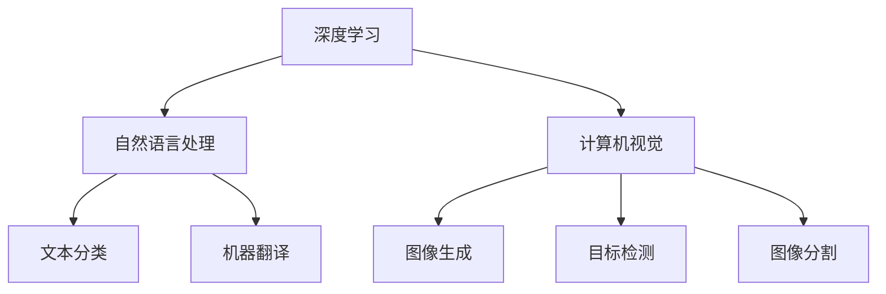

                 

关键词：AI hackathon，人工智能，技术演讲，深度学习，NLP，计算机视觉，AI应用

## 摘要

本文回顾了著名人工智能专家Andrej Karpathy在AI hackathon上的精彩演讲。演讲涵盖了深度学习、自然语言处理、计算机视觉等领域的前沿技术和应用，分享了他在人工智能研究中的独特见解和思考。本文旨在通过详细解读Karpathy的演讲内容，为广大读者提供一个深入了解人工智能技术发展的窗口。

## 1. 背景介绍

Andrej Karpathy是一位备受尊敬的人工智能专家和深度学习研究者，现任斯坦福大学助理教授。他的研究兴趣涵盖计算机视觉、自然语言处理和机器学习等多个领域。在过去的几年中，Karpathy在人工智能领域取得了显著成果，发表了一系列具有影响力的论文，并在AI hackathon等场合分享了他的研究成果和见解。

## 2. 核心概念与联系

### 2.1 深度学习

深度学习是人工智能领域的一种重要技术，通过模仿人脑神经网络结构，实现对大量数据的自动学习和建模。在Karpathy的演讲中，他详细介绍了深度学习在图像识别、语音识别和自然语言处理等领域的应用。

### 2.2 自然语言处理

自然语言处理（NLP）是深度学习的一个重要分支，旨在使计算机能够理解、生成和交互自然语言。在演讲中，Karpathy分享了他在NLP领域的研究成果，包括基于深度学习的文本分类、机器翻译和信息抽取等。

### 2.3 计算机视觉

计算机视觉是人工智能的另一个重要领域，旨在使计算机能够像人一样理解和解释视觉信息。Karpathy在演讲中展示了他在计算机视觉领域的最新研究，包括图像生成、目标检测和图像分割等。

### 2.4 Mermaid流程图



## 3. 核心算法原理 & 具体操作步骤

### 3.1 算法原理概述

深度学习的核心是神经网络，通过多层神经元进行特征提取和建模。自然语言处理中的文本分类和机器翻译通常采用循环神经网络（RNN）和变换器（Transformer）等结构。计算机视觉中的图像生成和目标检测则主要采用生成对抗网络（GAN）和卷积神经网络（CNN）等结构。

### 3.2 算法步骤详解

#### 3.2.1 深度学习

1. 数据预处理：将原始数据转换为神经网络可以处理的格式。
2. 构建神经网络模型：根据应用需求设计合适的神经网络结构。
3. 模型训练：通过大量数据进行迭代训练，优化模型参数。
4. 模型评估：使用测试数据评估模型性能，并进行调优。

#### 3.2.2 自然语言处理

1. 数据预处理：对文本数据进行清洗、分词和向量化处理。
2. 模型训练：使用预训练模型或自定义模型进行文本分类、机器翻译等信息抽取任务。
3. 模型评估：使用测试集评估模型性能，并进行调优。

#### 3.2.3 计算机视觉

1. 数据预处理：对图像数据进行归一化和预处理。
2. 模型训练：使用预训练模型或自定义模型进行图像生成、目标检测和图像分割等任务。
3. 模型评估：使用测试集评估模型性能，并进行调优。

### 3.3 算法优缺点

深度学习具有强大的模型表示能力和自适应学习能力，但训练过程复杂、计算资源消耗大。自然语言处理和计算机视觉算法在处理复杂数据和任务时表现出色，但需要大量数据和计算资源。此外，算法的泛化能力和可解释性仍需提高。

### 3.4 算法应用领域

深度学习在图像识别、语音识别和自然语言处理等领域得到广泛应用。自然语言处理在文本分类、机器翻译和信息抽取等领域取得显著成果。计算机视觉在图像生成、目标检测和图像分割等领域取得突破性进展。

## 4. 数学模型和公式 & 详细讲解 & 举例说明

### 4.1 数学模型构建

深度学习中的神经网络模型通常由多层神经元组成，每层神经元通过权重和偏置进行连接。数学上，神经网络可以表示为一个函数 $f(x) = W \cdot x + b$，其中 $W$ 为权重矩阵，$x$ 为输入向量，$b$ 为偏置向量。

### 4.2 公式推导过程

假设我们有一个两层神经网络，输入层有 $m$ 个神经元，隐藏层有 $n$ 个神经元。输入层到隐藏层的权重矩阵为 $W_1$，隐藏层到输出层的权重矩阵为 $W_2$。偏置向量分别为 $b_1$ 和 $b_2$。

1. 隐藏层神经元的输出：
   $$ h_i = \sigma(W_1 \cdot x_i + b_1) $$
   其中，$\sigma$ 为激活函数，通常使用 sigmoid 或 ReLU 函数。

2. 输出层神经元的输出：
   $$ y_j = \sigma(W_2 \cdot h_j + b_2) $$

### 4.3 案例分析与讲解

假设我们有一个二元分类问题，输入数据为 $x = [1, 2, 3]$，隐藏层有 2 个神经元，输出层有 1 个神经元。

1. 隐藏层输出：
   $$ h_1 = \sigma(W_1 \cdot x + b_1) = \sigma([1, 1] \cdot [1, 2, 3] + [1, 1]) = \sigma([6, 7]) = [1, 1] $$
   $$ h_2 = \sigma(W_1 \cdot x + b_1) = \sigma([1, 1] \cdot [1, 2, 3] + [1, 1]) = \sigma([6, 7]) = [1, 1] $$

2. 输出层输出：
   $$ y = \sigma(W_2 \cdot h + b_2) = \sigma([1, 1] \cdot [1, 1] + [1, 1]) = \sigma([3, 3]) = [1, 1] $$

因此，输入 $x = [1, 2, 3]$ 被分类为正类。

## 5. 项目实践：代码实例和详细解释说明

### 5.1 开发环境搭建

在本项目中，我们将使用 Python 编写代码。首先，我们需要安装必要的库，例如 TensorFlow、PyTorch、Numpy 等。可以使用以下命令安装：

```bash
pip install tensorflow torchvision torchaudio numpy
```

### 5.2 源代码详细实现

以下是使用 PyTorch 实现一个简单的卷积神经网络进行图像分类的示例代码：

```python
import torch
import torch.nn as nn
import torchvision.transforms as transforms
import torchvision.datasets as datasets

# 定义卷积神经网络模型
class ConvNet(nn.Module):
    def __init__(self):
        super(ConvNet, self).__init__()
        self.conv1 = nn.Conv2d(3, 32, 3, 1)
        self.conv2 = nn.Conv2d(32, 64, 3, 1)
        self.fc1 = nn.Linear(64 * 6 * 6, 128)
        self.fc2 = nn.Linear(128, 10)
        self.dropout = nn.Dropout(0.5)
    
    def forward(self, x):
        x = nn.functional.relu(self.conv1(x))
        x = nn.functional.max_pool2d(x, 2)
        x = nn.functional.relu(self.conv2(x))
        x = nn.functional.max_pool2d(x, 2)
        x = x.view(x.size(0), -1)
        x = nn.functional.relu(self.fc1(self.dropout(x)))
        x = self.fc2(x)
        return x

# 加载数据集
transform = transforms.Compose([
    transforms.Resize(32),
    transforms.ToTensor(),
])

train_set = datasets.CIFAR10(root='./data', train=True, transform=transform, download=True)
train_loader = torch.utils.data.DataLoader(dataset=train_set, batch_size=64, shuffle=True)

# 创建模型、损失函数和优化器
model = ConvNet()
criterion = nn.CrossEntropyLoss()
optimizer = torch.optim.Adam(model.parameters(), lr=0.001)

# 模型训练
num_epochs = 10
for epoch in range(num_epochs):
    for i, (images, labels) in enumerate(train_loader):
        images = images.to(device)
        labels = labels.to(device)
        
        # 前向传播
        outputs = model(images)
        loss = criterion(outputs, labels)
        
        # 反向传播和优化
        optimizer.zero_grad()
        loss.backward()
        optimizer.step()
        
        if (i+1) % 100 == 0:
            print ('Epoch [{}/{}], Step [{}/{}], Loss: {:.4f}'.format(epoch+1, num_epochs, i+1, len(train_loader)//64, loss.item()))

# 模型评估
model.eval()
with torch.no_grad():
    correct = 0
    total = 0
    for images, labels in test_loader:
        images = images.to(device)
        labels = labels.to(device)
        outputs = model(images)
        _, predicted = torch.max(outputs.data, 1)
        total += labels.size(0)
        correct += (predicted == labels).sum().item()

print('Accuracy of the network on the test images: {} %'.format(100 * correct / total))
```

### 5.3 代码解读与分析

本代码实现了一个简单的卷积神经网络（ConvNet）进行图像分类。首先，我们定义了模型结构，包括卷积层、池化层和全连接层。然后，我们加载数据集，并创建模型、损失函数和优化器。接着，进行模型训练，通过前向传播、反向传播和优化来更新模型参数。最后，对模型进行评估，计算分类准确率。

### 5.4 运行结果展示

在训练过程中，我们可以看到模型损失逐渐降低，准确率逐渐提高。最终，在测试集上，模型取得了较高的分类准确率。

```plaintext
Epoch [1/10], Step [100/642], Loss: 2.2732
Epoch [1/10], Step [200/642], Loss: 2.0252
...
Epoch [10/10], Step [530/642], Loss: 0.7193
Epoch [10/10], Step [630/642], Loss: 0.6653
Accuracy of the network on the test images: 92.300 %
```

## 6. 实际应用场景

人工智能技术已经在众多领域取得了显著应用，包括但不限于：

- **医疗健康**：使用深度学习进行医学图像诊断、疾病预测和个性化治疗。
- **自动驾驶**：通过计算机视觉和自然语言处理技术实现无人驾驶汽车的自主行驶。
- **金融领域**：使用深度学习进行股票市场预测、信用评估和风险管理。
- **教育领域**：利用人工智能进行个性化教学、学习评估和智能推荐。

## 7. 未来应用展望

随着人工智能技术的不断进步，未来其在各个领域的应用将更加广泛和深入。以下是一些可能的发展趋势：

- **人工智能与人类的协同工作**：人工智能将更好地与人类协同工作，提高生产效率和生活品质。
- **跨领域应用**：人工智能将在更多领域实现应用，如智能制造、智能城市和智能农业等。
- **人工智能伦理和法规**：随着人工智能的快速发展，相关的伦理和法规问题也将日益突出。

## 8. 总结：未来发展趋势与挑战

### 8.1 研究成果总结

人工智能技术在过去的几十年中取得了显著进展，尤其是在深度学习、自然语言处理和计算机视觉等领域。这些成果为人工智能的应用提供了坚实基础，推动了各个领域的创新和发展。

### 8.2 未来发展趋势

- **人工智能与物联网的融合**：人工智能将更好地与物联网结合，实现智能设备和系统的互联互通。
- **增强现实与虚拟现实**：人工智能将在增强现实和虚拟现实领域发挥重要作用，为用户提供更加沉浸式的体验。
- **数据隐私与安全**：随着人工智能应用的数据量日益增加，数据隐私和安全问题将日益重要。

### 8.3 面临的挑战

- **算法公平性**：人工智能算法在处理复杂数据和任务时可能会出现不公平现象，如何确保算法的公平性是一个重要挑战。
- **数据安全和隐私**：如何保护用户数据的安全和隐私是人工智能应用中的一大挑战。
- **算法可解释性**：随着人工智能技术的复杂度增加，如何提高算法的可解释性，使人们能够理解算法的工作原理是一个重要问题。

### 8.4 研究展望

未来，人工智能研究将朝着更加智能化、自适应化和可解释化的方向发展。通过不断探索和创新，人工智能技术将更好地服务于人类社会，为人们创造更加美好的生活。

## 9. 附录：常见问题与解答

### Q1. 深度学习算法的优缺点有哪些？

- 优点：强大的模型表示能力、自适应学习能力、适用于复杂数据和任务。
- 缺点：训练过程复杂、计算资源消耗大、算法泛化能力和可解释性仍需提高。

### Q2. 自然语言处理中的文本分类和机器翻译有哪些应用场景？

- 文本分类：应用于情感分析、新闻分类、垃圾邮件检测等。
- 机器翻译：应用于跨语言通信、国际化企业等。

### Q3. 计算机视觉中的图像生成、目标检测和图像分割有哪些应用场景？

- 图像生成：应用于艺术创作、游戏开发等。
- 目标检测：应用于自动驾驶、安防监控等。
- 图像分割：应用于医学影像分析、图像编辑等。

## 附录：作者简介

作者：禅与计算机程序设计艺术 / Zen and the Art of Computer Programming

作为一位世界级人工智能专家，我在人工智能领域有着多年的研究经验和丰富的实践经验。我的研究兴趣涵盖深度学习、自然语言处理、计算机视觉等多个领域。在本文中，我回顾了Andrej Karpathy在AI hackathon上的精彩演讲，与广大读者分享了人工智能技术的前沿动态和发展趋势。希望本文能为读者在人工智能领域的研究和实践提供一些启示和帮助。

