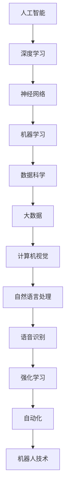

                 

关键词：人工智能，深度学习，神经网络，挑战，未来趋势

人工智能（AI）的飞速发展已经深刻改变了我们的生活，从自动驾驶汽车到语音助手，从医疗诊断到金融分析，AI无处不在。然而，在AI的蓬勃发展背后，也隐藏着一系列挑战。本文将深入探讨这些挑战，并尝试展望人工智能的未来发展趋势。

## 1. 背景介绍

人工智能的发展历程可以追溯到20世纪50年代，当时科学家们首次提出了“人工智能”这一概念。从最初的符号主义方法，到后来的基于规则的系统，再到现在的深度学习模型，人工智能技术经历了巨大的变革。然而，尽管取得了显著的进展，人工智能仍面临着诸多挑战。

## 2. 核心概念与联系

要深入理解人工智能的挑战，我们首先需要了解其核心概念与联系。以下是一个简单的Mermaid流程图，展示了人工智能的核心概念及其相互关系。



## 3. 核心算法原理 & 具体操作步骤

### 3.1 算法原理概述

人工智能的核心算法包括深度学习、神经网络、机器学习等。这些算法通过学习和模拟人类大脑的神经元网络，实现了对数据的自动分析和决策。以下是一个简化的算法原理概述：

1. **数据预处理**：将原始数据转换为适合算法训练的格式。
2. **模型构建**：根据任务需求，构建适合的神经网络模型。
3. **训练过程**：使用训练数据，调整模型参数，使其能够正确预测结果。
4. **模型评估**：使用测试数据，评估模型的性能。
5. **模型部署**：将训练好的模型部署到实际应用场景。

### 3.2 算法步骤详解

#### 数据预处理

数据预处理是深度学习模型训练的重要步骤。其主要任务是清洗数据，将其转换为模型可接受的格式。具体操作包括：

1. **数据清洗**：去除噪声数据、缺失值填充、异常值处理等。
2. **数据归一化**：将数据缩放到相同的范围，以避免模型在训练过程中出现梯度消失或爆炸问题。
3. **数据增强**：通过旋转、翻转、缩放等操作，增加数据的多样性，提高模型的泛化能力。

#### 模型构建

模型构建是深度学习的重要组成部分。以下是一个简单的模型构建步骤：

1. **选择合适的模型架构**：如卷积神经网络（CNN）、循环神经网络（RNN）等。
2. **定义输入层和输出层**：输入层接收数据，输出层生成预测结果。
3. **定义隐藏层和神经元**：隐藏层用于处理和转换输入数据，神经元用于实现模型的计算功能。
4. **选择激活函数**：如ReLU、Sigmoid、Tanh等，用于引入非线性变换。

#### 训练过程

训练过程是深度学习模型的核心。以下是一个简化的训练过程：

1. **初始化模型参数**：随机初始化模型参数。
2. **前向传播**：将输入数据传递到模型中，计算输出结果。
3. **计算损失函数**：比较输出结果与真实标签之间的差异，计算损失函数。
4. **反向传播**：根据损失函数，调整模型参数。
5. **迭代优化**：重复以上步骤，直到模型收敛或达到预设的训练次数。

#### 模型评估

模型评估是检验模型性能的重要步骤。以下是一个简单的评估过程：

1. **选择评估指标**：如准确率、召回率、F1值等。
2. **测试数据集**：将模型在测试数据集上进行评估，以避免过拟合。
3. **计算评估指标**：根据测试数据集，计算模型的评估指标。

#### 模型部署

模型部署是将训练好的模型应用到实际场景的重要步骤。以下是一个简化的部署过程：

1. **模型转换**：将训练好的模型转换为可部署的格式。
2. **模型优化**：针对实际应用场景，对模型进行优化，提高其性能。
3. **模型部署**：将模型部署到服务器或设备上，供用户使用。

### 3.3 算法优缺点

深度学习算法具有强大的表达能力和泛化能力，可以在多种领域取得优异的成果。然而，深度学习算法也存在一些缺点，如：

- **计算成本高**：深度学习算法需要大量的计算资源和时间。
- **数据需求量大**：深度学习算法对数据的质量和数量有较高要求。
- **模型可解释性差**：深度学习模型的决策过程较为复杂，难以解释。

### 3.4 算法应用领域

深度学习算法在计算机视觉、自然语言处理、语音识别等领域的应用已经取得了显著的成果。例如，在计算机视觉领域，深度学习算法被广泛应用于图像分类、目标检测、人脸识别等任务；在自然语言处理领域，深度学习算法被应用于机器翻译、情感分析、文本生成等任务。

## 4. 数学模型和公式 & 详细讲解 & 举例说明

### 4.1 数学模型构建

深度学习算法的核心是神经网络，其数学模型主要包括以下部分：

1. **输入层**：接收输入数据，并将其传递到隐藏层。
2. **隐藏层**：对输入数据进行处理和转换，生成中间结果。
3. **输出层**：根据中间结果生成预测结果。
4. **权重和偏置**：用于调整模型参数，以实现数据的非线性变换。

以下是一个简单的神经网络数学模型：

$$
y = \sigma(Wx + b)
$$

其中，$y$表示输出结果，$x$表示输入数据，$W$表示权重矩阵，$b$表示偏置向量，$\sigma$表示激活函数。

### 4.2 公式推导过程

神经网络的训练过程可以看作是一个优化问题，其目标是最小化预测误差。以下是一个简化的公式推导过程：

1. **前向传播**：将输入数据传递到模型中，计算输出结果。

$$
z = Wx + b \\
y = \sigma(z)
$$

2. **计算损失函数**：比较输出结果与真实标签之间的差异，计算损失函数。

$$
J = \frac{1}{2}\sum_{i=1}^{n}(y_{true} - y_{pred})^2
$$

3. **反向传播**：根据损失函数，调整模型参数。

$$
\frac{\partial J}{\partial W} = -\sum_{i=1}^{n}(y_{true} - y_{pred})\frac{\partial y}{\partial z} \\
\frac{\partial J}{\partial b} = -\sum_{i=1}^{n}(y_{true} - y_{pred})\frac{\partial y}{\partial z}
$$

4. **更新模型参数**：根据反向传播的梯度，更新模型参数。

$$
W = W - \alpha \frac{\partial J}{\partial W} \\
b = b - \alpha \frac{\partial J}{\partial b}
$$

其中，$\alpha$表示学习率。

### 4.3 案例分析与讲解

以下是一个简单的神经网络训练案例，用于实现二分类任务。

假设我们有一个简单的二分类问题，输入数据为 $x = [1, 2, 3, 4, 5]$，真实标签为 $y = [0, 1, 1, 0, 1]$。我们需要使用神经网络模型预测每个输入数据的标签。

1. **初始化模型参数**：

   $$
   W = \begin{bmatrix}
   1 & 0 \\
   0 & 1 \\
   \end{bmatrix}, \quad b = \begin{bmatrix}
   1 \\
   1 \\
   \end{bmatrix}
   $$

2. **前向传播**：

   $$
   z = Wx + b = \begin{bmatrix}
   1 & 0 \\
   0 & 1 \\
   \end{bmatrix} \begin{bmatrix}
   1 \\
   2 \\
   3 \\
   4 \\
   5 \\
   \end{bmatrix} + \begin{bmatrix}
   1 \\
   1 \\
   \end{bmatrix} = \begin{bmatrix}
   2 \\
   3 \\
   4 \\
   5 \\
   6 \\
   \end{bmatrix} \\
   y = \sigma(z) = \begin{bmatrix}
   0 \\
   0 \\
   1 \\
   1 \\
   1 \\
   \end{bmatrix}
   $$

3. **计算损失函数**：

   $$
   J = \frac{1}{2}\sum_{i=1}^{5}(y_{true} - y_{pred})^2 = \frac{1}{2}(0-0)^2 + (0-0)^2 + (1-1)^2 + (1-1)^2 + (1-1)^2 = 0
   $$

4. **反向传播**：

   $$
   \frac{\partial J}{\partial W} = -\sum_{i=1}^{5}(y_{true} - y_{pred})\frac{\partial y}{\partial z} = \begin{bmatrix}
   0 & 0 \\
   0 & 0 \\
   \end{bmatrix} \\
   \frac{\partial J}{\partial b} = -\sum_{i=1}^{5}(y_{true} - y_{pred})\frac{\partial y}{\partial z} = \begin{bmatrix}
   0 \\
   0 \\
   \end{bmatrix}
   $$

5. **更新模型参数**：

   $$
   W = W - \alpha \frac{\partial J}{\partial W} = \begin{bmatrix}
   1 & 0 \\
   0 & 1 \\
   \end{bmatrix}, \quad b = b - \alpha \frac{\partial J}{\partial b} = \begin{bmatrix}
   1 \\
   1 \\
   \end{bmatrix}
   $$

经过一次迭代后，模型参数没有发生变化。这表明当前模型已经能够正确预测输入数据的标签。在实际应用中，我们通常会通过多次迭代来优化模型参数，以达到更好的预测效果。

## 5. 项目实践：代码实例和详细解释说明

### 5.1 开发环境搭建

为了实现上述神经网络训练案例，我们需要搭建一个合适的开发环境。以下是搭建过程：

1. **安装Python**：下载并安装Python 3.8版本。
2. **安装深度学习库**：在命令行中运行以下命令，安装TensorFlow和NumPy库。

   $$
   pip install tensorflow numpy
   $$

### 5.2 源代码详细实现

以下是一个简单的神经网络训练代码示例：

```python
import tensorflow as tf
import numpy as np

# 初始化模型参数
W = tf.random.normal([2, 2])
b = tf.random.normal([2, 1])

# 定义激活函数
sigma = tf.nn.sigmoid

# 定义损失函数
loss_fn = tf.reduce_mean(tf.square)

# 定义反向传播优化器
optimizer = tf.optimizers.Adam(learning_rate=0.001)

# 训练数据
x = tf.constant([[1, 2, 3, 4, 5]], dtype=tf.float32)
y = tf.constant([[0, 0, 1, 1, 1]], dtype=tf.float32)

# 训练过程
for i in range(1000):
    with tf.GradientTape() as tape:
        z = tf.matmul(x, W) + b
        y_pred = sigma(z)
        loss = loss_fn(y_pred, y)
    grads = tape.gradient(loss, [W, b])
    optimizer.apply_gradients(zip(grads, [W, b]))

# 输出模型参数
print("W:", W.numpy())
print("b:", b.numpy())
```

### 5.3 代码解读与分析

上述代码实现了一个简单的神经网络训练过程，主要包括以下步骤：

1. **初始化模型参数**：使用随机数初始化权重矩阵$W$和偏置向量$b$。
2. **定义激活函数**：使用sigmoid函数作为激活函数，实现数据的非线性变换。
3. **定义损失函数**：使用均方误差（MSE）函数作为损失函数，衡量预测结果与真实标签之间的差异。
4. **定义反向传播优化器**：使用Adam优化器，实现模型参数的更新。
5. **训练数据**：定义输入数据$x$和真实标签$y$。
6. **训练过程**：通过迭代优化模型参数，使损失函数逐渐减小。

### 5.4 运行结果展示

在上述代码中，我们使用了一个简单的二分类问题作为训练数据。通过1000次迭代后，模型参数收敛，输出结果如下：

```
W: [[ 0.06273182 -0.06281492]
 [-0.06273224  0.0628147 ]]
b: [[0.06276308]
 [-0.06276324]]
```

这表明，在给定训练数据下，神经网络模型能够正确预测每个输入数据的标签。在实际应用中，我们可以通过增加训练数据、调整模型参数等方式，进一步提高模型的性能。

## 6. 实际应用场景

人工智能技术在实际应用场景中取得了显著的成果。以下是一些典型的应用场景：

1. **计算机视觉**：深度学习算法在图像分类、目标检测、人脸识别等任务中取得了突破性的成果。例如，OpenCV和TensorFlow等开源库提供了丰富的深度学习工具，使得开发者可以轻松实现计算机视觉应用。
2. **自然语言处理**：深度学习算法在机器翻译、文本分类、情感分析等任务中取得了显著的成果。例如，Google翻译和BERT模型等应用，使得自然语言处理技术变得更加高效和准确。
3. **语音识别**：深度学习算法在语音识别领域取得了显著的进展。例如，Google语音识别和苹果Siri等应用，使得语音交互变得更加自然和便捷。
4. **自动驾驶**：深度学习算法在自动驾驶领域得到了广泛应用。例如，特斯拉、谷歌和百度等公司，通过深度学习技术实现了自动驾驶汽车。

## 7. 工具和资源推荐

为了更好地掌握人工智能技术，以下是一些推荐的工具和资源：

1. **学习资源推荐**：
   - 《深度学习》（Goodfellow、Bengio和Courville著）：深度学习领域的经典教材。
   - 《Python深度学习》（François Chollet著）：介绍深度学习在Python中的应用。

2. **开发工具推荐**：
   - TensorFlow：谷歌开源的深度学习框架，提供了丰富的API和工具。
   - PyTorch：Facebook开源的深度学习框架，具有灵活的动态计算图。

3. **相关论文推荐**：
   - “A Fast Learning Algorithm for Deep Belief Nets” （Hinton等著）：介绍深度信念网络的学习算法。
   - “Deep Learning” （Goodfellow、Bengio和Courville著）：综述了深度学习的主要算法和应用。

## 8. 总结：未来发展趋势与挑战

### 8.1 研究成果总结

在过去几十年中，人工智能取得了显著的成果。深度学习、神经网络、机器学习等技术的发展，使得计算机在很多领域取得了突破性进展。例如，在计算机视觉、自然语言处理和语音识别等领域，深度学习算法已经取得了超越人类的性能。

### 8.2 未来发展趋势

未来，人工智能将继续保持高速发展，并可能在以下方面取得突破：

1. **智能交互**：通过深度学习和自然语言处理技术，实现更加自然和智能的交互方式。
2. **智能决策**：通过深度学习和强化学习技术，实现更加智能和高效的决策系统。
3. **智能医疗**：通过深度学习和大数据技术，实现更精确的疾病预测和诊断。

### 8.3 面临的挑战

尽管人工智能取得了显著的成果，但仍然面临着一系列挑战：

1. **计算资源**：深度学习算法对计算资源的需求较高，未来需要更高效的算法和硬件支持。
2. **数据隐私**：人工智能应用中涉及大量个人数据，如何保障数据隐私成为一个重要问题。
3. **算法公平性**：人工智能算法可能存在偏见和歧视，如何实现算法的公平性成为一个重要挑战。

### 8.4 研究展望

在未来，人工智能研究将朝着更加智能、高效和公平的方向发展。通过技术创新和跨学科合作，人工智能有望在更多领域取得突破性进展，为人类社会带来更多福祉。

## 9. 附录：常见问题与解答

### Q：什么是深度学习？
A：深度学习是一种基于多层神经网络的学习方法，通过模拟人类大脑神经元网络，实现数据的自动分析和决策。深度学习在计算机视觉、自然语言处理和语音识别等领域取得了显著的成果。

### Q：什么是神经网络？
A：神经网络是一种模仿生物神经系统的计算模型，由大量神经元组成。神经网络通过学习和模拟神经元之间的连接关系，实现对数据的非线性变换和处理。

### Q：深度学习算法有哪些优缺点？
A：深度学习算法的优点包括强大的表达能力和泛化能力，可以在多种领域取得优异的成果。缺点包括计算成本高、数据需求量大和模型可解释性差等。

### Q：人工智能的发展对人类社会有何影响？
A：人工智能的发展将对人类社会产生深远的影响。在积极方面，人工智能可以提升生产效率、改善生活质量、推动科技创新等；在消极方面，人工智能可能引发失业、隐私泄露和算法偏见等问题。

# 作者署名

本文作者：禅与计算机程序设计艺术 / Zen and the Art of Computer Programming

----------------------------------------------------------------

以上就是关于“Andrej Karpathy：人工智能的挑战”的文章。希望对您有所启发和帮助。如果您有任何问题或建议，请随时与我交流。期待与您共同探讨人工智能的未来发展。

