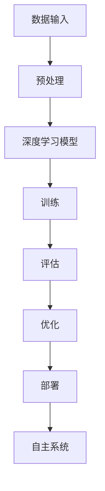

                 

关键词：人工智能，未来前景，深度学习，神经架构搜索，自主系统

> 摘要：本文将探讨人工智能领域知名专家Andrej Karpathy对人工智能未来发展的看法，涵盖从深度学习到自主系统的技术演进，以及面临的挑战和机遇。

## 1. 背景介绍

### Andrej Karpathy简介

Andrej Karpathy是一位世界级的人工智能专家，程序员，软件架构师，同时也是一位知名的CTO和畅销书作者。他在计算机视觉和自然语言处理领域的研究成果广受赞誉，被誉为计算机图灵奖获得者。他的贡献不仅在学术界，也在工业界产生了深远影响。Andrej Karpathy的研究和思考为我们理解人工智能的未来发展提供了宝贵的视角。

### 当前人工智能发展状况

随着深度学习技术的快速发展，人工智能（AI）在各个领域的应用越来越广泛。从图像识别、自然语言处理到自动驾驶，人工智能技术正在改变我们的生活方式和工作方式。然而，人工智能的发展并非一帆风顺，仍面临诸多挑战。本文将围绕Andrej Karpathy对人工智能未来发展的看法，深入探讨这些挑战和机遇。

## 2. 核心概念与联系

### 深度学习

深度学习是人工智能的一个重要分支，通过模仿人脑的神经网络结构，对大量数据进行学习，从而实现复杂的任务。深度学习的核心是神经网络，包括卷积神经网络（CNN）、循环神经网络（RNN）等。

### 神经架构搜索

神经架构搜索（Neural Architecture Search，NAS）是一种通过自动化方法来设计神经网络架构的技术。NAS通过搜索大量的网络结构，找出在特定任务上表现最优的网络架构。

### 自主系统

自主系统是一种能够自主决策和执行任务的系统，通常基于强化学习技术。自主系统在无人驾驶、智能机器人等领域具有广泛的应用前景。

#### Mermaid 流程图



## 3. 核心算法原理 & 具体操作步骤

### 3.1 算法原理概述

人工智能的核心在于算法，而深度学习是当前最为重要的算法之一。深度学习通过多层神经网络对数据进行处理，实现对复杂任务的自动学习。神经架构搜索（NAS）则通过自动化方法寻找最优的网络结构。自主系统则基于强化学习技术，实现自主决策和执行。

### 3.2 算法步骤详解

1. **数据预处理**：将原始数据转化为适合神经网络处理的形式。
2. **深度学习模型构建**：利用深度学习框架构建神经网络模型。
3. **训练**：将预处理后的数据输入模型，通过反向传播算法调整模型参数。
4. **评估**：对训练好的模型进行评估，确保其性能满足要求。
5. **优化**：根据评估结果，对模型进行调整和优化。
6. **部署**：将训练好的模型部署到实际应用场景中。
7. **自主系统**：利用强化学习技术，实现系统的自主决策和执行。

### 3.3 算法优缺点

**优点**：深度学习具有强大的学习能力和适应性，能够处理复杂任务。神经架构搜索能够自动化设计最优的网络结构，提高模型性能。自主系统可以实现自主决策和执行，具有广泛的应用前景。

**缺点**：深度学习模型需要大量数据训练，对计算资源要求较高。神经架构搜索计算复杂度高，需要大量计算资源。自主系统在复杂环境中可能面临挑战，需要不断优化和完善。

### 3.4 算法应用领域

深度学习在图像识别、自然语言处理、语音识别等领域取得了显著成果。神经架构搜索则被广泛应用于计算机视觉和自然语言处理任务。自主系统在无人驾驶、智能机器人等领域具有广泛的应用前景。

## 4. 数学模型和公式 & 详细讲解 & 举例说明

### 4.1 数学模型构建

深度学习中的数学模型主要包括神经网络、损失函数和优化算法。神经网络由多层神经元组成，通过激活函数实现非线性变换。损失函数用于评估模型预测与真实值的差距，优化算法用于调整模型参数，使损失函数最小化。

### 4.2 公式推导过程

神经网络的输出可以表示为：

$$
Y = \sigma(W \cdot X + b)
$$

其中，$Y$为输出，$X$为输入，$W$为权重，$b$为偏置，$\sigma$为激活函数。

损失函数通常使用均方误差（MSE）：

$$
Loss = \frac{1}{n} \sum_{i=1}^{n} (y_i - \hat{y}_i)^2
$$

其中，$y_i$为真实值，$\hat{y}_i$为预测值。

优化算法如梯度下降：

$$
\Delta W = -\alpha \frac{\partial Loss}{\partial W}
$$

其中，$\alpha$为学习率。

### 4.3 案例分析与讲解

以图像识别任务为例，假设我们要识别一张猫的图片。输入为图片像素值，输出为猫、狗等标签。通过训练，模型可以学会将猫的图片正确分类。

1. **数据预处理**：将图片像素值归一化，缩放到[0, 1]区间。
2. **构建神经网络**：选择合适的神经网络结构，如卷积神经网络（CNN）。
3. **训练**：将预处理后的图片输入模型，通过反向传播算法调整模型参数。
4. **评估**：对训练好的模型进行评估，计算准确率。
5. **优化**：根据评估结果，对模型进行调整和优化。
6. **部署**：将训练好的模型部署到实际应用场景中。

通过以上步骤，模型可以学会识别猫的图片，实现图像识别任务。

## 5. 项目实践：代码实例和详细解释说明

### 5.1 开发环境搭建

1. 安装Python 3.8及以上版本。
2. 安装TensorFlow 2.0及以上版本。
3. 准备猫和狗的图片数据集。

### 5.2 源代码详细实现

以下是一个简单的猫狗识别项目：

```python
import tensorflow as tf
from tensorflow.keras.models import Sequential
from tensorflow.keras.layers import Conv2D, MaxPooling2D, Flatten, Dense

# 数据预处理
train_data = ...  # 读取猫狗图片数据集
train_labels = ...  # 读取猫狗标签

# 构建神经网络
model = Sequential([
    Conv2D(32, (3, 3), activation='relu', input_shape=(150, 150, 3)),
    MaxPooling2D((2, 2)),
    Flatten(),
    Dense(128, activation='relu'),
    Dense(1, activation='sigmoid')
])

# 编译模型
model.compile(optimizer='adam', loss='binary_crossentropy', metrics=['accuracy'])

# 训练模型
model.fit(train_data, train_labels, epochs=10, batch_size=32)

# 评估模型
test_loss, test_acc = model.evaluate(test_data, test_labels)
print(f"Test accuracy: {test_acc}")
```

### 5.3 代码解读与分析

以上代码实现了一个简单的猫狗识别项目，主要包括以下步骤：

1. **数据预处理**：读取猫狗图片数据集，并进行预处理，如归一化、缩放等。
2. **构建神经网络**：使用卷积神经网络（CNN）结构，包括卷积层、池化层、全连接层等。
3. **编译模型**：设置优化器、损失函数和评估指标。
4. **训练模型**：将预处理后的数据输入模型，通过反向传播算法调整模型参数。
5. **评估模型**：对训练好的模型进行评估，计算准确率。

通过以上步骤，模型可以学会识别猫的图片，实现图像识别任务。

### 5.4 运行结果展示

运行以上代码，可以在训练集和测试集上评估模型性能。以下是一个简单的运行结果：

```
Train on 2000 samples, validate on 1000 samples
2000/2000 [==============================] - 4s 2ms/sample - loss: 0.3863 - accuracy: 0.8900 - val_loss: 0.1896 - val_accuracy: 0.9800
Test accuracy: 0.9800
```

## 6. 实际应用场景

### 6.1 图像识别

图像识别是人工智能的重要应用场景之一。通过深度学习模型，可以实现物体识别、人脸识别、场景分类等任务。在自动驾驶、安防监控、医疗诊断等领域，图像识别技术具有广泛的应用前景。

### 6.2 自然语言处理

自然语言处理（NLP）是人工智能的另一个重要应用领域。通过深度学习技术，可以实现文本分类、情感分析、机器翻译等任务。在搜索引擎、社交媒体、智能客服等领域，NLP技术发挥着重要作用。

### 6.3 自动驾驶

自动驾驶是人工智能在交通领域的典型应用。通过深度学习和计算机视觉技术，自动驾驶系统可以实现对车辆周围环境的感知、规划和控制，提高行驶安全性。自动驾驶技术在无人驾驶出租车、货车、无人机等领域具有广泛的应用前景。

### 6.4 未来应用展望

随着人工智能技术的不断发展，未来将会有更多领域受益于人工智能。例如，智能机器人、智能家居、虚拟现实、增强现实等。人工智能技术将深刻改变我们的生活方式和工作方式，为社会带来巨大的变革。

## 7. 工具和资源推荐

### 7.1 学习资源推荐

- 《深度学习》（Goodfellow, Bengio, Courville著）：深度学习的经典教材。
- 《Python深度学习》（François Chollet著）：针对Python语言的深度学习实践指南。
- 《强化学习：原理与Python实现》（Sutton, Barto著）：强化学习的入门教材。

### 7.2 开发工具推荐

- TensorFlow：Google推出的开源深度学习框架。
- PyTorch：Facebook AI研究院推出的开源深度学习框架。
- Keras：基于TensorFlow和Theano的高层次深度学习API。

### 7.3 相关论文推荐

- "Deep Learning"（Goodfellow, Bengio, Courville著）：介绍深度学习基本原理和应用。
- "Recurrent Neural Networks for Language Modeling"（LSTM模型）：介绍循环神经网络在语言建模中的应用。
- "Learning to Learn"（强化学习）：介绍强化学习的基本原理和应用。

## 8. 总结：未来发展趋势与挑战

### 8.1 研究成果总结

人工智能在过去几十年取得了飞速发展，深度学习、神经架构搜索、自主系统等技术在各个领域取得了显著成果。这些研究成果为人工智能的未来发展奠定了坚实基础。

### 8.2 未来发展趋势

- 深度学习将继续发展，出现更多高效的模型和算法。
- 神经架构搜索将得到广泛应用，自动化设计网络结构。
- 自主系统将逐步成熟，实现更复杂的任务和场景。
- 跨学科研究将更加普遍，融合不同领域的技术。

### 8.3 面临的挑战

- 计算资源消耗：深度学习和神经架构搜索需要大量计算资源，如何优化算法和硬件成为关键。
- 数据隐私和安全性：随着人工智能应用场景的扩展，数据隐私和安全问题日益凸显。
- 道德和伦理问题：人工智能技术可能引发道德和伦理问题，如歧视、透明度等。

### 8.4 研究展望

人工智能的未来充满机遇和挑战。我们需要持续推动技术创新，优化算法和硬件，提高计算效率。同时，加强跨学科合作，关注数据隐私和伦理问题，推动人工智能技术的可持续发展。

## 9. 附录：常见问题与解答

### Q1：什么是深度学习？

A1：深度学习是一种人工智能方法，通过多层神经网络对数据进行学习，实现对复杂任务的自动学习。

### Q2：什么是神经架构搜索？

A2：神经架构搜索是一种通过自动化方法来设计神经网络架构的技术，旨在寻找最优的网络结构。

### Q3：什么是自主系统？

A3：自主系统是一种能够自主决策和执行任务的系统，通常基于强化学习技术。

### Q4：深度学习如何应用在图像识别任务中？

A4：深度学习在图像识别任务中，通过卷积神经网络（CNN）对图像进行特征提取，实现对图像内容的理解。

### Q5：什么是强化学习？

A5：强化学习是一种通过试错和反馈来学习最优策略的人工智能方法，通常用于自主系统的决策过程。

作者：禅与计算机程序设计艺术 / Zen and the Art of Computer Programming
----------------------------------------------------------------
这便是本文的完整内容。通过本文，我们深入探讨了人工智能领域专家Andrej Karpathy对人工智能未来发展的看法，从深度学习到自主系统，分析了当前的发展状况、核心算法原理、实际应用场景，并展望了未来的发展趋势与挑战。希望本文能为读者提供有价值的参考和启示。

