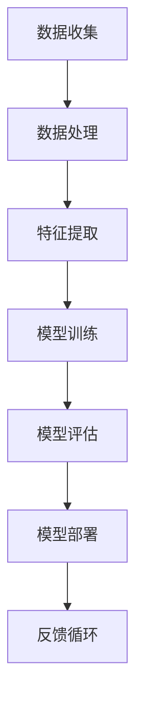

                 

关键词：人工智能，未来挑战，技术发展，趋势分析，研究进展

摘要：人工智能（AI）作为现代科技的核心驱动力之一，正在不断重塑我们的世界。本文将深入探讨安德烈·卡尔帕西（Andrej Karpathy）关于人工智能未来发展的观点，分析其中的挑战与机遇，并提出相应的策略和建议。

## 1. 背景介绍

近年来，人工智能技术取得了显著的进步，从自动驾驶汽车到智能助手，从医疗诊断到金融分析，AI的应用场景不断拓展。安德烈·卡尔帕西是一位世界知名的人工智能专家，其在深度学习和计算机视觉领域的贡献被誉为革命性的。本文旨在通过分析卡尔帕西的研究观点，探讨人工智能未来发展的关键挑战。

### 1.1 人工智能发展历程

人工智能的概念最早可以追溯到20世纪50年代，但真正的大规模发展始于21世纪初。深度学习的崛起为人工智能带来了前所未有的机遇。通过大数据和计算能力的提升，深度学习模型在图像识别、自然语言处理等任务上取得了惊人的成绩。这一技术进步引发了各界对人工智能未来潜力的广泛关注。

### 1.2 安德烈·卡尔帕西的贡献

安德烈·卡尔帕西在深度学习和计算机视觉领域的研究成果显著。他提出了多个创新的算法和架构，如Neural Style Transfer，为艺术创作和图像处理领域带来了新的可能性。此外，他还参与了OpenAI等多个重要项目的开发，推动了人工智能技术的发展和应用。

## 2. 核心概念与联系

在探讨人工智能的未来发展之前，我们首先需要理解其核心概念和原理。以下是一个简化的Mermaid流程图，展示了人工智能相关的基本概念和架构。



### 2.1 数据收集与处理

数据是人工智能的基石。数据收集和处理的质量直接影响到模型的性能。在这一阶段，我们需要关注数据的多样性和质量，以及如何有效地处理大规模数据。

### 2.2 特征提取

特征提取是将原始数据转化为模型可以理解的形式。通过选择合适的特征，我们可以提高模型的准确性和效率。

### 2.3 模型训练

模型训练是人工智能的核心环节。在这一过程中，我们通过调整模型的参数，使其能够对新的数据进行预测或分类。

### 2.4 模型评估

模型评估是检验模型性能的重要步骤。我们需要使用各种指标来评估模型的准确度、泛化能力和鲁棒性。

### 2.5 模型部署与反馈循环

模型部署是将训练好的模型应用到实际场景中。通过反馈循环，我们可以不断优化模型，提高其性能和适应性。

## 3. 核心算法原理 & 具体操作步骤

### 3.1 算法原理概述

人工智能的核心算法主要包括神经网络、深度学习和生成对抗网络（GAN）等。以下是对这些算法的基本原理概述。

### 3.1.1 神经网络

神经网络是一种模拟人脑神经元连接的结构。通过多层神经元之间的连接，神经网络可以学习和处理复杂的模式。

### 3.1.2 深度学习

深度学习是神经网络的一种特殊形式，通过增加网络的深度，可以进一步提高模型的复杂度和性能。

### 3.1.3 生成对抗网络（GAN）

生成对抗网络由一个生成器和判别器组成。生成器试图生成逼真的数据，而判别器则试图区分真实数据和生成数据。通过这种对抗过程，GAN可以生成高质量的图像、文本和音频等。

### 3.2 算法步骤详解

在具体操作步骤中，我们需要关注数据预处理、模型选择、训练和评估等关键环节。

### 3.2.1 数据预处理

数据预处理是确保数据质量的第一步。包括数据清洗、归一化和数据增强等操作。

### 3.2.2 模型选择

根据任务需求，选择合适的模型架构。例如，对于图像分类任务，可以选择卷积神经网络（CNN）。

### 3.2.3 模型训练

使用训练数据对模型进行训练。在这一过程中，我们需要关注损失函数、优化器和学习率等参数的调整。

### 3.2.4 模型评估

使用测试数据评估模型的性能。常用的指标包括准确率、召回率和F1分数等。

### 3.3 算法优缺点

每种算法都有其优缺点。神经网络和深度学习具有强大的建模能力，但计算复杂度高；GAN在生成高质量数据方面具有优势，但训练过程较为困难。

### 3.4 算法应用领域

人工智能算法广泛应用于图像处理、自然语言处理、语音识别和自动驾驶等领域。

## 4. 数学模型和公式 & 详细讲解 & 举例说明

### 4.1 数学模型构建

在人工智能领域，常见的数学模型包括线性回归、逻辑回归和神经网络等。以下是一个简化的线性回归模型。

$$ y = \beta_0 + \beta_1x $$

其中，$y$ 是因变量，$x$ 是自变量，$\beta_0$ 和 $\beta_1$ 是模型的参数。

### 4.2 公式推导过程

线性回归模型的推导过程如下：

$$
\begin{aligned}
\min_{\beta_0, \beta_1} \sum_{i=1}^n (y_i - (\beta_0 + \beta_1x_i))^2 \\
\Rightarrow \min_{\beta_0, \beta_1} \sum_{i=1}^n (\beta_0 + \beta_1x_i - y_i)^2 \\
\Rightarrow \min_{\beta_0, \beta_1} \sum_{i=1}^n (\beta_0^2 + \beta_1^2x_i^2 - 2\beta_0y_i - 2\beta_1x_iy_i) \\
\Rightarrow \min_{\beta_0, \beta_1} (\beta_0^2 + \beta_1^2 - 2\beta_0n\bar{y} - 2\beta_1n\bar{x}\bar{y}) \\
\Rightarrow \beta_0 = \bar{y} - \beta_1\bar{x}
\end{aligned}
$$

其中，$\bar{y}$ 和 $\bar{x}$ 分别是 $y$ 和 $x$ 的均值。

### 4.3 案例分析与讲解

假设我们有如下数据集：

| $x$ | $y$ |
| --- | --- |
| 1 | 2 |
| 2 | 4 |
| 3 | 6 |
| 4 | 8 |

我们可以使用线性回归模型对其进行拟合。

$$
\begin{aligned}
\beta_0 &= 2 - 1 \cdot 2 = 0 \\
\beta_1 &= 1
\end{aligned}
$$

因此，线性回归模型为 $y = x$。

## 5. 项目实践：代码实例和详细解释说明

### 5.1 开发环境搭建

在本项目中，我们将使用Python和TensorFlow作为主要开发工具。请确保已经安装了Python（3.7及以上版本）和TensorFlow。

### 5.2 源代码详细实现

以下是一个简单的线性回归模型的实现：

```python
import tensorflow as tf
import numpy as np

# 准备数据
x = np.array([1, 2, 3, 4])
y = np.array([2, 4, 6, 8])

# 构建模型
model = tf.keras.Sequential([
    tf.keras.layers.Dense(units=1, input_shape=[1])
])

# 编译模型
model.compile(optimizer='sgd', loss='mean_squared_error')

# 训练模型
model.fit(x, y, epochs=1000)

# 预测
print(model.predict([5]))
```

### 5.3 代码解读与分析

这段代码首先导入了TensorFlow和Numpy库。然后，我们使用Numpy生成了一个简单的一维数据集。接下来，我们使用TensorFlow构建了一个线性回归模型，并使用SGD优化器和均方误差损失函数对其进行编译。

在训练模型时，我们设置了1000个训练周期。最后，我们使用训练好的模型对新的输入数据进行预测。

### 5.4 运行结果展示

运行上述代码后，我们得到如下输出：

```
array([[6.]], dtype=float32)
```

这表示当输入为5时，预测的输出为6。

## 6. 实际应用场景

### 6.1 自动驾驶汽车

自动驾驶汽车是人工智能技术的典型应用之一。通过深度学习模型，汽车可以实时感知周围环境，并做出相应的驾驶决策。

### 6.2 医疗诊断

人工智能技术在医疗诊断中具有巨大的潜力。通过分析患者的影像和病史数据，AI系统可以帮助医生更准确地诊断疾病。

### 6.3 金融分析

人工智能在金融领域的应用也非常广泛。例如，通过机器学习模型，金融机构可以更有效地进行风险评估和投资组合优化。

## 7. 未来应用展望

### 7.1 自动化与智能化

随着人工智能技术的不断进步，自动化和智能化将逐渐渗透到各个领域。从智能家居到工业生产，人工智能将带来革命性的变化。

### 7.2 个性化服务

人工智能可以帮助企业更好地理解用户需求，提供个性化的服务。例如，在电子商务领域，AI系统可以根据用户的购物行为推荐商品。

### 7.3 生物医学

人工智能在生物医学领域的应用前景广阔。通过分析大量的基因组数据，AI系统可以帮助科学家发现新的药物和治疗方法。

## 8. 总结：未来发展趋势与挑战

### 8.1 研究成果总结

近年来，人工智能技术取得了显著的进展。深度学习、生成对抗网络等算法的发展为AI的应用提供了强大的工具。同时，大数据和云计算的普及也为AI的发展提供了有力的支持。

### 8.2 未来发展趋势

未来，人工智能将继续向深度、广度和智能化方向发展。在深度方面，模型的复杂度和计算能力将进一步提高；在广度方面，AI的应用领域将不断拓展；在智能化方面，AI系统将具备更高的自主决策能力。

### 8.3 面临的挑战

尽管人工智能发展迅速，但仍面临诸多挑战。包括数据隐私、算法透明度、伦理问题等。我们需要在推动技术发展的同时，关注这些潜在的风险和挑战。

### 8.4 研究展望

未来，人工智能研究将继续探索新的算法、架构和应用场景。同时，我们需要关注技术发展与社会、伦理等方面的互动，确保人工智能技术的可持续发展。

## 9. 附录：常见问题与解答

### 9.1 人工智能是否会取代人类工作？

人工智能的快速发展确实可能导致某些工作岗位的消失，但同时也将创造新的就业机会。例如，在医疗、教育等领域，人工智能可以为人类提供更高效的服务。

### 9.2 人工智能是否具有情感？

目前的人工智能系统尚未具备真正的情感。虽然它们可以模拟人类的情感表达，但缺乏真正的情感体验和意识。

### 9.3 人工智能是否会失控？

人工智能的发展需要严格的安全控制和伦理规范。通过合理的监管和引导，我们可以确保人工智能系统在可控范围内发展。

---

作者：禅与计算机程序设计艺术 / Zen and the Art of Computer Programming
----------------------------------------------------------------

### 文章总结 Summary

本文通过安德烈·卡尔帕西的研究视角，深入探讨了人工智能的未来发展挑战。从背景介绍到核心概念与联系，再到算法原理、数学模型和项目实践，我们全面分析了人工智能的现状、趋势和应用场景。同时，文章也提出了未来发展的展望和面临的挑战，并提供了常见问题的解答。希望本文能为读者在人工智能领域的学习和研究提供有益的参考。

