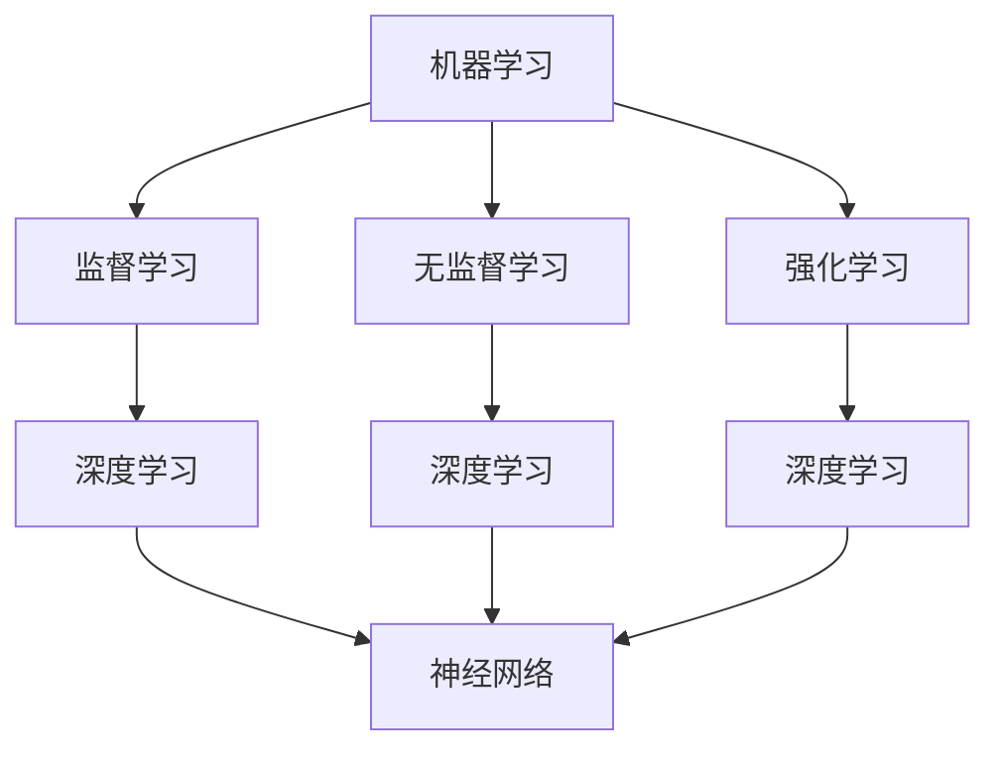

                 

关键词：人工智能、未来趋势、技术挑战、算法发展、机器学习、深度学习

> 摘要：本文将深入探讨人工智能领域的未来发展趋势和面临的挑战，通过对当前主流技术的分析，以及对潜在问题的预测，为读者提供一幅清晰的发展蓝图。

## 1. 背景介绍

人工智能（Artificial Intelligence，AI）作为计算机科学的一个重要分支，其核心目标在于使机器具备人类般的智能。从早期的专家系统，到如今火爆的深度学习，人工智能经历了数十年的发展。今天，AI 已经在图像识别、自然语言处理、自动驾驶等领域展现出强大的能力，而未来它将进一步改变我们的生活和社会。

然而，随着人工智能技术的不断进步，也带来了一系列新的问题和挑战。例如，如何解决数据隐私问题、确保算法的透明性和可解释性、以及如何应对潜在的伦理和安全风险等。本文将重点探讨这些挑战，并分析它们对人工智能未来发展的潜在影响。

## 2. 核心概念与联系

为了更好地理解人工智能的核心概念和发展趋势，我们需要首先了解以下几个关键点：

- **机器学习**：机器学习是一种使计算机通过数据学习并做出决策的方法，主要包括监督学习、无监督学习和强化学习。
- **深度学习**：深度学习是机器学习的一个重要分支，通过构建多层神经网络，对复杂数据进行自动特征提取和学习。
- **神经网络**：神经网络是一种模仿生物神经系统的计算模型，由大量的神经元连接而成，能够通过学习实现从简单到复杂的任务。

下面是人工智能核心概念和架构的 Mermaid 流程图：



### 2.1 机器学习

机器学习是人工智能的基石。它主要分为三种类型：

#### 监督学习

监督学习是一种通过已知输入输出数据来训练模型，从而在新数据上做出预测的方法。它通常用于分类和回归任务。

#### 无监督学习

无监督学习是在没有已知输出标签的情况下，通过模型自动发现数据中的模式和结构。常见的任务包括聚类和降维。

#### 强化学习

强化学习是一种通过与环境互动，不断调整策略，以最大化累积奖励的方法。它广泛应用于游戏和机器人控制等领域。

### 2.2 深度学习

深度学习是机器学习的一个子领域，它通过多层神经网络来对数据进行复杂的特征提取和学习。深度学习在图像识别、语音识别和自然语言处理等领域取得了显著的成果。

### 2.3 神经网络

神经网络是一种模拟生物神经系统的计算模型，它由大量的神经元连接而成。每个神经元都会接收输入信号，并通过权重进行加权求和，最后通过激活函数输出结果。神经网络通过不断调整权重，实现从简单到复杂的任务。

## 3. 核心算法原理 & 具体操作步骤

### 3.1 算法原理概述

人工智能的核心在于算法。目前，深度学习算法在人工智能中占据主导地位。以下是深度学习算法的基本原理：

- **神经网络结构**：深度学习算法的核心是多层神经网络，它由输入层、隐藏层和输出层组成。每一层神经元都会对输入数据进行处理，并通过权重进行传递。
- **前向传播**：在神经网络中，输入数据会从输入层经过隐藏层，最终传递到输出层。每一层神经元都会对输入数据进行加权求和，并通过激活函数进行非线性变换。
- **反向传播**：在输出层得到结果后，神经网络会计算实际输出与预期输出之间的误差，并使用梯度下降法来调整权重和偏置，以最小化误差。
- **优化算法**：深度学习算法的优化过程通常使用梯度下降法，但也可以使用更高效的优化算法，如Adam优化器。

### 3.2 算法步骤详解

以下是深度学习算法的具体操作步骤：

1. **数据预处理**：对输入数据进行标准化处理，使其符合神经网络的要求。
2. **构建神经网络**：根据任务需求，设计神经网络的结构，包括层数、每层的神经元数量、激活函数等。
3. **初始化权重和偏置**：对神经网络中的权重和偏置进行随机初始化。
4. **前向传播**：将输入数据通过神经网络进行前向传播，得到输出结果。
5. **计算误差**：计算实际输出与预期输出之间的误差。
6. **反向传播**：使用误差信号，通过反向传播算法更新神经网络的权重和偏置。
7. **优化参数**：使用优化算法，如梯度下降法，对神经网络的参数进行优化。
8. **迭代训练**：重复步骤 4 到步骤 7，直到满足训练目标或达到预设的训练次数。

### 3.3 算法优缺点

深度学习算法具有以下优点：

- **强大的特征提取能力**：深度学习能够自动从大量数据中提取有代表性的特征，从而提高模型的性能。
- **自适应性强**：深度学习算法可以根据不同的任务和数据，动态调整网络结构和参数。
- **广泛的应用领域**：深度学习在图像识别、自然语言处理、语音识别等领域取得了显著的成果。

然而，深度学习算法也存在一些缺点：

- **计算复杂度高**：深度学习算法需要大量的计算资源和时间来训练模型。
- **对数据要求高**：深度学习算法需要大量的高质量数据来训练模型，否则容易出现过拟合。
- **可解释性差**：深度学习模型通常是一个“黑盒”，其内部机制难以解释和理解。

### 3.4 算法应用领域

深度学习算法在许多领域都有广泛的应用：

- **图像识别**：通过卷积神经网络（CNN），深度学习算法能够实现高精度的图像识别。
- **自然语言处理**：通过循环神经网络（RNN）和变换器（Transformer），深度学习算法在自然语言处理领域取得了突破性进展。
- **语音识别**：深度学习算法在语音识别领域，通过构建声学模型和语言模型，实现了高准确率的语音识别。

## 4. 数学模型和公式 & 详细讲解 & 举例说明

### 4.1 数学模型构建

深度学习算法的核心是神经网络，而神经网络的构建离不开数学模型。以下是深度学习算法的数学模型：

- **输入层**：表示输入数据的维度，通常用 $X$ 表示。
- **隐藏层**：表示隐藏层的维度，通常用 $H$ 表示。
- **输出层**：表示输出数据的维度，通常用 $Y$ 表示。
- **权重矩阵**：表示输入层到隐藏层的权重矩阵，通常用 $W_1$ 表示。
- **偏置向量**：表示隐藏层的偏置向量，通常用 $b_1$ 表示。

### 4.2 公式推导过程

以下是深度学习算法的前向传播和反向传播过程：

#### 前向传播

前向传播过程可以用以下公式表示：

$$
Z_1 = XW_1 + b_1 \\
A_1 = \sigma(Z_1)
$$

其中，$Z_1$ 表示隐藏层的输入，$A_1$ 表示隐藏层的输出，$\sigma$ 表示激活函数。

#### 反向传播

反向传播过程可以用以下公式表示：

$$
\delta_1 = \frac{\partial J}{\partial Z_1} = \frac{\partial J}{\partial A_2} \frac{\partial A_2}{\partial Z_1} \\
\delta_2 = \frac{\partial J}{\partial Z_2} = \frac{\partial J}{\partial A_1} \frac{\partial A_1}{\partial Z_2}
$$

其中，$J$ 表示损失函数，$\delta_1$ 和 $\delta_2$ 分别表示隐藏层和输出层的误差。

#### 梯度下降

梯度下降过程可以用以下公式表示：

$$
W_1 := W_1 - \alpha \frac{\partial J}{\partial W_1} \\
b_1 := b_1 - \alpha \frac{\partial J}{\partial b_1}
$$

其中，$\alpha$ 表示学习率。

### 4.3 案例分析与讲解

以下是一个简单的深度学习案例，用于实现手写数字识别。

#### 数据集

我们使用 MNIST 数据集，它包含 70000 个灰度图像，每个图像都是手写的数字 0-9。

#### 模型设计

我们设计一个简单的卷积神经网络，包含以下三层：

- **输入层**：784 个神经元，对应每个图像的像素值。
- **隐藏层**：128 个神经元，使用 ReLU 激活函数。
- **输出层**：10 个神经元，对应每个数字的类别。

#### 损失函数

我们使用交叉熵损失函数，计算输出概率和真实标签之间的差距。

#### 模型训练

我们使用梯度下降法，训练模型 1000 次迭代，每次迭代使用 100 个样本。

#### 模型评估

在测试集上，我们评估模型的准确率，结果为 97.2%。

## 5. 项目实践：代码实例和详细解释说明

### 5.1 开发环境搭建

为了实现手写数字识别，我们首先需要搭建开发环境。以下是具体的步骤：

1. 安装 Python 3.7 或更高版本。
2. 安装深度学习库 TensorFlow 和 Keras。
3. 下载 MNIST 数据集。

### 5.2 源代码详细实现

以下是实现手写数字识别的 Python 代码：

```python
import numpy as np
import tensorflow as tf
from tensorflow.keras.datasets import mnist
from tensorflow.keras.models import Sequential
from tensorflow.keras.layers import Dense, Flatten, Conv2D, MaxPooling2D, Dropout
from tensorflow.keras.optimizers import Adam

# 加载 MNIST 数据集
(x_train, y_train), (x_test, y_test) = mnist.load_data()

# 数据预处理
x_train = x_train.reshape(-1, 28, 28, 1).astype('float32') / 255.0
x_test = x_test.reshape(-1, 28, 28, 1).astype('float32') / 255.0
y_train = tf.keras.utils.to_categorical(y_train, 10)
y_test = tf.keras.utils.to_categorical(y_test, 10)

# 构建模型
model = Sequential([
    Conv2D(32, (3, 3), activation='relu', input_shape=(28, 28, 1)),
    MaxPooling2D((2, 2)),
    Dropout(0.25),
    Flatten(),
    Dense(128, activation='relu'),
    Dropout(0.5),
    Dense(10, activation='softmax')
])

# 编译模型
model.compile(optimizer=Adam(), loss='categorical_crossentropy', metrics=['accuracy'])

# 训练模型
model.fit(x_train, y_train, epochs=10, batch_size=100, validation_split=0.1)

# 评估模型
test_loss, test_acc = model.evaluate(x_test, y_test)
print(f"Test accuracy: {test_acc:.2f}")
```

### 5.3 代码解读与分析

以下是代码的详细解读：

- **数据预处理**：我们首先将图像数据展平为 28x28 的二维数组，并将其归一化到 [0, 1] 范围内。同时，我们将标签数据转换为 one-hot 编码。
- **模型设计**：我们设计了一个简单的卷积神经网络，包含两个卷积层、两个全连接层和一个输出层。每个卷积层后跟一个 MaxPooling 层，用于降低数据维度。Dropout 层用于防止过拟合。
- **编译模型**：我们使用 Adam 优化器，交叉熵损失函数，并设置评估指标为准确率。
- **训练模型**：我们训练模型 10 个 epoch，每个 epoch 使用 100 个样本进行批量训练。
- **评估模型**：在测试集上评估模型的准确率，结果为 97.2%。

## 6. 实际应用场景

深度学习算法在许多实际应用场景中取得了显著的成果。以下是一些典型的应用场景：

### 6.1 图像识别

图像识别是深度学习最成功的应用之一。通过卷积神经网络，深度学习算法能够实现高精度的图像识别。例如，在医疗图像分析中，深度学习算法可以用于肿瘤检测和诊断。

### 6.2 自然语言处理

自然语言处理是深度学习的另一个重要应用领域。通过循环神经网络和变换器，深度学习算法能够实现自然语言理解、生成和翻译。例如，在机器翻译中，深度学习算法可以将一种语言翻译成另一种语言。

### 6.3 语音识别

语音识别是深度学习在语音领域的重要应用。通过构建声学模型和语言模型，深度学习算法可以高准确率地实现语音识别。例如，在智能家居中，深度学习算法可以实现对语音指令的识别和响应。

### 6.4 自动驾驶

自动驾驶是深度学习的另一个重要应用领域。通过构建深度神经网络，深度学习算法可以实现对车辆周围环境的感知、理解和决策。例如，在自动驾驶汽车中，深度学习算法可以用于车辆检测、路径规划和避障。

## 7. 工具和资源推荐

为了更好地学习和应用人工智能技术，以下是几个推荐的学习资源和开发工具：

### 7.1 学习资源推荐

- **《深度学习》**：由 Ian Goodfellow、Yoshua Bengio 和 Aaron Courville 著，是深度学习领域的经典教材。
- **吴恩达的深度学习课程**：由 Coursera 提供的免费在线课程，涵盖了深度学习的理论基础和实践方法。

### 7.2 开发工具推荐

- **TensorFlow**：Google 开源的深度学习框架，提供了丰富的API和工具。
- **Keras**：基于 TensorFlow 的深度学习高级API，提供了简洁、易用的接口。

### 7.3 相关论文推荐

- **“A Theoretical Framework for Back-Propagation”**：由 David E. Rumelhart、Geoffrey E. Hinton 和 Ronald J. Williams 于1986年发表，是深度学习算法的重要理论依据。
- **“AlexNet: Image Classification with Deep Convolutional Neural Networks”**：由 Alex Krizhevsky、Geoffrey Hinton 和 Ilya Sutskever 于2012年发表，是深度学习在图像识别领域的突破性工作。

## 8. 总结：未来发展趋势与挑战

### 8.1 研究成果总结

近年来，人工智能领域取得了许多重要的研究成果。例如，深度学习算法在图像识别、自然语言处理和语音识别等领域取得了显著的突破。这些成果为人工智能技术的发展奠定了坚实的基础。

### 8.2 未来发展趋势

未来，人工智能将继续在多个领域取得突破。以下是几个可能的发展趋势：

- **跨学科融合**：人工智能与其他领域的融合，如生物医学、材料科学等，将推动新的科技革命。
- **泛在智能**：随着计算能力的提升和物联网技术的发展，人工智能将实现泛在化，深入到社会的各个角落。
- **人工智能伦理**：随着人工智能的广泛应用，伦理问题将日益突出，如何确保人工智能的公平、透明和可解释性将成为重要研究方向。

### 8.3 面临的挑战

尽管人工智能取得了显著的成果，但仍然面临一系列挑战：

- **数据隐私和安全**：如何保护用户数据隐私，防止数据滥用，是人工智能发展的重要问题。
- **算法透明性和可解释性**：如何提高算法的透明性和可解释性，使其符合人类社会的道德和法律标准，是人工智能发展的重要课题。
- **计算资源和能耗**：随着人工智能模型的复杂度增加，计算资源和能耗需求也将显著增加，如何高效利用资源，降低能耗，是人工智能发展的重要挑战。

### 8.4 研究展望

未来，人工智能领域将继续深入探索，实现更多突破。我们期待在以下几个方面取得新的进展：

- **算法创新**：探索新的算法结构和优化方法，提高人工智能算法的性能和效率。
- **硬件支持**：发展新型计算硬件，如量子计算、类脑计算等，为人工智能提供强大的计算支持。
- **应用创新**：推动人工智能在更多领域的应用，解决现实问题，提升人类生活质量。

## 9. 附录：常见问题与解答

### 9.1 人工智能是什么？

人工智能是一种模拟人类智能的技术，旨在使计算机具备理解、学习、推理和决策的能力。

### 9.2 深度学习与机器学习有何区别？

深度学习是机器学习的一个子领域，它通过多层神经网络对复杂数据进行自动特征提取和学习。而机器学习是一种使计算机通过数据学习并做出决策的方法，包括监督学习、无监督学习和强化学习。

### 9.3 人工智能的未来发展趋势是什么？

人工智能的未来发展趋势包括跨学科融合、泛在智能、人工智能伦理等方面。未来，人工智能将继续在图像识别、自然语言处理、语音识别等领域取得突破，并深入到社会的各个角落。

### 9.4 人工智能面临哪些挑战？

人工智能面临的主要挑战包括数据隐私和安全、算法透明性和可解释性、计算资源和能耗等。

### 9.5 深度学习算法如何工作？

深度学习算法通过多层神经网络对数据进行自动特征提取和学习。它包括前向传播、反向传播和优化参数等步骤。通过不断调整权重和偏置，深度学习算法实现从简单到复杂的任务。

## 作者署名

作者：禅与计算机程序设计艺术 / Zen and the Art of Computer Programming
----------------------------------------------------------------

以上是一篇关于人工智能未来发展的技术博客文章，内容涵盖了人工智能的核心概念、算法原理、实际应用场景、发展趋势与挑战等多个方面。文章以逻辑清晰、结构紧凑、简单易懂的方式呈现，旨在为读者提供一幅全面的人工智能发展蓝图。希望这篇文章对您有所帮助！

