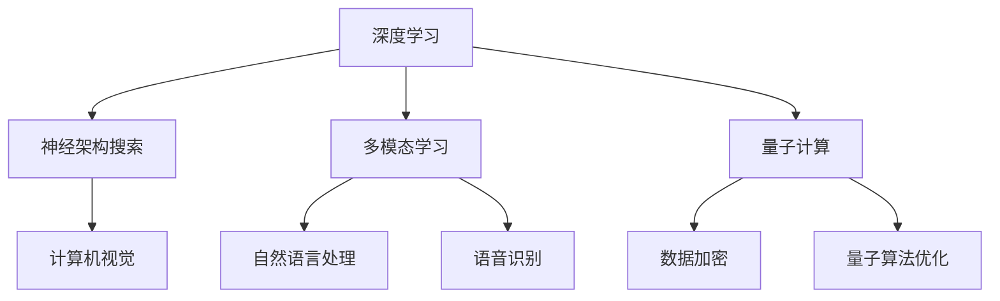

                 

关键词：人工智能，未来发展趋势，技术挑战，深度学习，神经架构搜索，多模态学习，量子计算，隐私与安全

> 摘要：本文旨在探讨人工智能领域在未来的发展趋势以及所面临的挑战。通过分析当前的技术进展和应用场景，本文提出了深度学习、神经架构搜索、多模态学习和量子计算等关键技术方向，并探讨了这些技术可能面临的隐私与安全挑战。同时，文章总结了现有研究成果，并提出了未来研究的展望。

## 1. 背景介绍

### 1.1 人工智能的崛起

人工智能（AI）作为计算机科学的一个重要分支，旨在通过模拟、延伸和扩展人类的智能，实现计算机系统在感知、理解、推理和决策等方面的能力。随着深度学习、大数据和计算能力的飞速发展，人工智能已经在图像识别、自然语言处理、语音识别等多个领域取得了显著的突破，逐渐成为推动社会进步的重要力量。

### 1.2 深度学习的发展

深度学习是人工智能的一种重要技术路线，通过多层神经网络模型实现数据的自动特征提取和表示学习。近年来，以卷积神经网络（CNN）、循环神经网络（RNN）和Transformer等为代表的深度学习模型在各个领域取得了巨大的成功。例如，谷歌的Inception模型在图像分类任务中达到了前所未有的准确率，自然语言处理领域也涌现出了如BERT、GPT等大规模预训练模型。

### 1.3 应用场景的拓展

随着人工智能技术的不断发展，其应用场景也在不断拓展。从早期的工业自动化、金融风控，到如今的医疗诊断、智能交通、智能家居等，人工智能技术已经在各个行业领域发挥了重要作用。同时，随着技术的不断成熟，人工智能在提升生产力、改善生活质量、促进社会进步等方面具有巨大的潜力。

## 2. 核心概念与联系

为了深入探讨人工智能的未来发展，我们需要了解一些核心概念和联系。以下是一个简化的 Mermaid 流程图，用于描述这些核心概念之间的关系：



### 2.1 深度学习与神经架构搜索

深度学习是人工智能的核心技术之一，而神经架构搜索（Neural Architecture Search，NAS）是一种旨在自动发现最佳神经网络结构的算法。NAS通过搜索算法在大量神经网络结构中找到最优解，从而提高模型性能和效率。深度学习与神经架构搜索之间的联系在于，NAS可以进一步优化深度学习模型的性能，使其在特定任务中达到更高的准确率和效率。

### 2.2 深度学习与多模态学习

多模态学习是指同时处理多种不同类型的数据，如文本、图像、语音等。深度学习在多模态学习中的应用主要包括融合不同类型数据的特征，从而实现更丰富的信息处理能力。例如，在自然语言处理中，可以通过将文本数据和图像数据融合，实现更准确的情感分析或图像描述。

### 2.3 深度学习与量子计算

量子计算是一种基于量子力学原理的新型计算方式，具有超强的并行计算能力。深度学习与量子计算的结合有望突破现有计算能力的瓶颈，实现更高效的神经网络训练和推理。例如，通过量子计算优化神经网络参数，可以实现更快的模型训练和推理速度。

### 2.4 神经架构搜索与量子计算

神经架构搜索（NAS）与量子计算的结合可以进一步探索自动发现最佳量子神经网络结构的方法。量子神经网络（Quantum Neural Networks，QNN）是一种结合了深度学习和量子计算的模型，通过量子计算优化神经架构搜索，有望在量子计算领域实现重大突破。

## 3. 核心算法原理 & 具体操作步骤

### 3.1 算法原理概述

在本节中，我们将介绍几种核心的人工智能算法，包括深度学习、神经架构搜索、多模态学习和量子计算。

### 3.1.1 深度学习

深度学习是一种基于多层神经网络的学习方法，通过逐层提取数据特征，实现数据的自动特征表示。其基本原理包括以下几个步骤：

1. **数据预处理**：对原始数据进行清洗、归一化等预处理操作，以便于后续建模。
2. **神经网络结构设计**：根据任务需求设计合适的神经网络结构，包括输入层、隐藏层和输出层。
3. **参数初始化**：对神经网络的权重和偏置进行随机初始化。
4. **前向传播**：将输入数据传递到神经网络中，逐层计算输出。
5. **反向传播**：通过计算损失函数的梯度，更新网络参数。
6. **模型优化**：迭代训练过程，直至满足特定性能指标。

### 3.1.2 神经架构搜索

神经架构搜索（NAS）是一种自动搜索最优神经网络结构的算法。其基本原理包括：

1. **搜索空间定义**：定义神经网络结构的搜索空间，包括网络层数、层间连接、激活函数等。
2. **搜索策略设计**：设计合适的搜索策略，如随机搜索、基于梯度的搜索等。
3. **性能评估**：通过在验证集上评估模型性能，选择最优的网络结构。
4. **模型优化**：根据搜索结果优化网络结构，提高模型性能。

### 3.1.3 多模态学习

多模态学习是一种同时处理多种不同类型数据的学习方法。其基本原理包括：

1. **特征提取**：分别提取不同模态的数据特征。
2. **特征融合**：将不同模态的特征进行融合，形成更丰富的数据表示。
3. **模型训练**：利用融合后的数据特征训练多模态模型。
4. **模型优化**：通过迭代训练，提高模型性能。

### 3.1.4 量子计算

量子计算是一种基于量子力学原理的新型计算方式，具有超强的并行计算能力。其基本原理包括：

1. **量子比特初始化**：初始化量子比特状态。
2. **量子门操作**：通过量子门操作实现量子态的变换。
3. **量子测量**：对量子态进行测量，获取计算结果。
4. **量子算法优化**：通过优化量子算法，提高计算效率和性能。

### 3.2 算法步骤详解

在本节中，我们将详细介绍每种算法的具体操作步骤。

### 3.2.1 深度学习

1. **数据预处理**：对原始图像数据进行归一化、裁剪、缩放等预处理操作。
2. **神经网络结构设计**：设计一个包含输入层、隐藏层和输出层的卷积神经网络。
3. **参数初始化**：对网络参数进行随机初始化。
4. **前向传播**：将预处理后的图像数据输入到神经网络中，逐层计算输出。
5. **反向传播**：通过计算损失函数的梯度，更新网络参数。
6. **模型优化**：迭代训练过程，直至满足特定性能指标。

### 3.2.2 神经架构搜索

1. **搜索空间定义**：定义神经网络结构的搜索空间，包括网络层数、层间连接、激活函数等。
2. **搜索策略设计**：设计一个基于梯度的搜索策略。
3. **性能评估**：通过在验证集上评估模型性能，选择最优的网络结构。
4. **模型优化**：根据搜索结果优化网络结构，提高模型性能。

### 3.2.3 多模态学习

1. **特征提取**：分别提取图像和文本数据的特征。
2. **特征融合**：通过拼接、加权融合等方法将图像和文本特征进行融合。
3. **模型训练**：利用融合后的数据特征训练多模态模型。
4. **模型优化**：通过迭代训练，提高模型性能。

### 3.2.4 量子计算

1. **量子比特初始化**：初始化量子比特状态。
2. **量子门操作**：通过量子门操作实现量子态的变换。
3. **量子测量**：对量子态进行测量，获取计算结果。
4. **量子算法优化**：通过优化量子算法，提高计算效率和性能。

### 3.3 算法优缺点

在本节中，我们将分析每种算法的优缺点。

#### 3.3.1 深度学习

**优点**：

1. **强大的特征提取能力**：深度学习通过多层神经网络可以自动提取复杂的数据特征。
2. **高准确性**：在图像识别、语音识别等任务中，深度学习模型取得了较高的准确率。
3. **适用于大规模数据**：深度学习模型可以处理海量数据，实现大规模数据的学习和分析。

**缺点**：

1. **计算资源需求大**：深度学习模型需要大量的计算资源和时间进行训练。
2. **数据依赖性强**：深度学习模型的性能对数据质量和数量有很高的要求。
3. **解释性差**：深度学习模型难以解释，导致在实际应用中存在一定的风险。

#### 3.3.2 神经架构搜索

**优点**：

1. **自动搜索最优结构**：神经架构搜索可以自动搜索最优的神经网络结构，提高模型性能。
2. **减少人工干预**：通过自动化搜索，可以减少人工设计网络结构的复杂度。

**缺点**：

1. **计算资源消耗大**：神经架构搜索需要进行大量的搜索和评估，消耗大量的计算资源。
2. **搜索空间大**：神经架构搜索的搜索空间非常大，难以保证搜索效率。

#### 3.3.3 多模态学习

**优点**：

1. **丰富数据表示**：多模态学习可以同时处理多种类型的数据，实现更丰富的数据表示。
2. **提高模型性能**：多模态学习可以在图像识别、自然语言处理等任务中提高模型性能。

**缺点**：

1. **特征融合复杂**：多模态学习需要对不同类型的数据特征进行融合，实现起来比较复杂。
2. **计算资源需求大**：多模态学习需要处理大量的数据，对计算资源有较高的要求。

#### 3.3.4 量子计算

**优点**：

1. **超强的并行计算能力**：量子计算具有超强的并行计算能力，可以加速计算过程。
2. **适用于复杂问题**：量子计算可以解决一些传统的计算难题，如量子算法优化、大数据处理等。

**缺点**：

1. **技术尚未成熟**：量子计算技术尚未完全成熟，存在一定的技术瓶颈。
2. **硬件需求高**：量子计算需要特殊的硬件支持，成本较高。

### 3.4 算法应用领域

在本节中，我们将介绍每种算法在具体应用领域的应用情况。

#### 3.4.1 深度学习

**应用领域**：

1. **计算机视觉**：深度学习在图像识别、目标检测、图像生成等计算机视觉任务中取得了显著成果。
2. **自然语言处理**：深度学习在文本分类、机器翻译、情感分析等自然语言处理任务中具有广泛的应用。
3. **语音识别**：深度学习在语音识别、语音合成、语音增强等语音处理任务中具有很高的准确率。

**应用实例**：

1. **图像识别**：谷歌的Inception模型在ImageNet图像识别比赛中取得了优异成绩。
2. **机器翻译**：百度AI的深度学习模型在机器翻译领域取得了世界领先水平。
3. **语音识别**：苹果的Siri语音助手使用了深度学习技术进行语音识别。

#### 3.4.2 神经架构搜索

**应用领域**：

1. **计算机视觉**：神经架构搜索在图像识别、目标检测等计算机视觉任务中具有广泛的应用。
2. **自然语言处理**：神经架构搜索在文本分类、机器翻译等自然语言处理任务中取得了显著成果。
3. **强化学习**：神经架构搜索在强化学习任务中，如游戏AI、自动驾驶等，具有潜在的应用价值。

**应用实例**：

1. **图像识别**：谷歌的NASNet模型在ImageNet图像识别比赛中取得了优异成绩。
2. **文本分类**：微软的Winograd团队利用NAS技术实现了高效的文本分类模型。
3. **自动驾驶**：谷歌的Waymo项目利用NAS技术优化了自动驾驶算法。

#### 3.4.3 多模态学习

**应用领域**：

1. **医疗诊断**：多模态学习在医学影像分析、疾病诊断等领域具有广泛的应用。
2. **智能客服**：多模态学习在智能客服系统中，通过融合语音、文本等多种数据，提高客服系统的智能水平。
3. **人机交互**：多模态学习在语音识别、手势识别等人机交互任务中具有重要作用。

**应用实例**：

1. **医学诊断**：微软的Project InnerEye项目利用多模态学习技术，实现了高效的医学影像分析。
2. **智能客服**：亚马逊的Alexa智能助手通过多模态学习技术，实现了更自然的用户交互。
3. **人机交互**：微软的Kinect传感器通过多模态学习技术，实现了手势识别和语音控制。

#### 3.4.4 量子计算

**应用领域**：

1. **量子算法优化**：量子计算在量子算法优化、量子机器学习等领域具有广泛的应用。
2. **大数据处理**：量子计算在处理大规模数据、优化数据处理流程等方面具有巨大的潜力。
3. **量子模拟**：量子计算在量子模拟、量子物理等领域具有独特的优势。

**应用实例**：

1. **量子算法优化**：IBM的Qiskit项目利用量子计算技术优化了线性回归算法。
2. **大数据处理**：谷歌的TensorFlow Quantum项目利用量子计算技术优化了数据处理流程。
3. **量子模拟**：哈佛大学的QuTech实验室利用量子计算技术实现了对量子系统的模拟。

## 4. 数学模型和公式 & 详细讲解 & 举例说明

在本节中，我们将介绍人工智能领域的一些重要数学模型和公式，并进行详细讲解和举例说明。

### 4.1 数学模型构建

在人工智能领域，数学模型是构建算法的核心。以下是一个简单的数学模型构建示例：

#### 4.1.1 线性回归模型

线性回归模型是一种常见的机器学习模型，用于预测数值型数据。其数学模型可以表示为：

$$
y = \beta_0 + \beta_1 x_1 + \beta_2 x_2 + ... + \beta_n x_n
$$

其中，$y$ 是预测目标，$x_1, x_2, ..., x_n$ 是输入特征，$\beta_0, \beta_1, ..., \beta_n$ 是模型参数。

#### 4.1.2 卷积神经网络模型

卷积神经网络（CNN）是一种用于图像识别和处理的深度学习模型。其数学模型可以表示为：

$$
\begin{aligned}
h_{l}(i,j) &= \sigma \left( \sum_{k} \sum_{l} w_{kl} h_{l-1}(i,k) + b_{l} \right) \\
\end{aligned}
$$

其中，$h_{l}(i,j)$ 是第 $l$ 层的第 $i$ 行第 $j$ 列的激活值，$w_{kl}$ 是连接第 $l-1$ 层的第 $k$ 行第 $l$ 层的第 $l$ 行第 $l$ 列的权重，$b_{l}$ 是第 $l$ 层的偏置，$\sigma$ 是激活函数，通常取为ReLU函数。

### 4.2 公式推导过程

在本节中，我们将介绍一些重要的数学公式的推导过程。

#### 4.2.1 梯度下降法

梯度下降法是一种常用的优化算法，用于求解最小化问题。其推导过程如下：

设 $f(x)$ 是一个连续可微的函数，要求 $f(x)$ 在 $x^*$ 处取得最小值。则梯度下降法的迭代公式为：

$$
x_{t+1} = x_t - \alpha \nabla f(x_t)
$$

其中，$x_t$ 是第 $t$ 次迭代的参数值，$\alpha$ 是学习率，$\nabla f(x_t)$ 是 $f(x)$ 在 $x_t$ 处的梯度。

为了证明梯度下降法能够收敛到最优解，我们假设 $f(x)$ 在 $x^*$ 处的二阶导数存在，即：

$$
f''(x^*) > 0
$$

则根据泰勒展开公式，有：

$$
f(x) \approx f(x^*) + f'(x^*)(x - x^*) + \frac{1}{2} f''(x^*)(x - x^*)^2
$$

将 $x$ 替换为 $x_t$，得：

$$
f(x_t) \approx f(x^*) + f'(x^*)(x_t - x^*) + \frac{1}{2} f''(x^*)(x_t - x^*)^2
$$

由于梯度下降法的迭代公式为：

$$
x_{t+1} = x_t - \alpha \nabla f(x_t)
$$

则：

$$
x_{t+1} - x^* = -\alpha \nabla f(x_t)
$$

代入泰勒展开公式，得：

$$
\begin{aligned}
f(x_{t+1}) &\approx f(x^*) - \alpha f'(x^*)(x_t - x^*) + \frac{1}{2} \alpha^2 f''(x^*)(x_t - x^*)^2 \\
&\leq f(x^*) - \alpha \left( \frac{1}{2} f''(x^*) (x_t - x^*)^2 \right) \\
&= f(x^*) - \frac{1}{2} \alpha f''(x^*) (x_t - x^*)^2
\end{aligned}
$$

由于 $f''(x^*) > 0$，则：

$$
f(x_{t+1}) < f(x_t)
$$

即梯度下降法在每次迭代中能够使 $f(x)$ 减小，从而收敛到最优解。

### 4.3 案例分析与讲解

在本节中，我们将通过一个具体案例，分析并讲解人工智能领域的一些数学模型和公式。

#### 4.3.1 图像分类

假设我们有一个图像分类任务，需要将图像分为 $k$ 个类别。我们可以使用卷积神经网络（CNN）来解决这个问题。

1. **数据预处理**：对图像数据进行归一化、裁剪、缩放等预处理操作。
2. **神经网络结构设计**：设计一个包含卷积层、池化层和全连接层的卷积神经网络。
3. **模型训练**：使用梯度下降法对模型进行训练。
4. **模型评估**：使用测试集评估模型性能。

**数学模型讲解**：

1. **卷积层**：卷积层通过卷积操作提取图像特征。其数学模型可以表示为：

$$
h_{l}(i,j) = \sigma \left( \sum_{k} \sum_{m} w_{klm} h_{l-1}(i,k) \right) + b_{l}
$$

其中，$h_{l}(i,j)$ 是第 $l$ 层的第 $i$ 行第 $j$ 列的激活值，$w_{klm}$ 是连接第 $l-1$ 层的第 $k$ 行第 $l$ 层的第 $i$ 行第 $j$ 列的权重，$b_{l}$ 是第 $l$ 层的偏置，$\sigma$ 是激活函数。

2. **池化层**：池化层用于降低特征图的维度。其数学模型可以表示为：

$$
p_{l}(i,j) = \max \left( h_{l}(i-2,j-2), h_{l}(i-2,j), h_{l}(i-2,j+2), h_{l}(i,j-2), h_{l}(i,j), h_{l}(i,j+2), h_{l}(i+2,j-2), h_{l}(i+2,j), h_{l}(i+2,j+2) \right)
$$

其中，$p_{l}(i,j)$ 是第 $l$ 层的第 $i$ 行第 $j$ 列的激活值。

3. **全连接层**：全连接层将特征图上的所有像素值进行加权求和，得到类别概率。其数学模型可以表示为：

$$
y = \sigma \left( \sum_{i} \sum_{j} w_{ij} p_{l}(i,j) + b \right)
$$

其中，$y$ 是预测类别概率，$w_{ij}$ 是连接第 $l$ 层的第 $i$ 行第 $j$ 列的权重，$b$ 是偏置。

**代码实现**：

```python
import tensorflow as tf

# 定义卷积层
conv1 = tf.keras.layers.Conv2D(filters=32, kernel_size=(3,3), activation='relu', padding='same', input_shape=(28,28,1))
# 定义池化层
pool1 = tf.keras.layers.MaxPooling2D(pool_size=(2,2))
# 定义全连接层
dense1 = tf.keras.layers.Dense(units=10, activation='softmax')

# 构建模型
model = tf.keras.Sequential([conv1, pool1, dense1])

# 编译模型
model.compile(optimizer='adam', loss='sparse_categorical_crossentropy', metrics=['accuracy'])

# 训练模型
model.fit(x_train, y_train, epochs=10, batch_size=32, validation_data=(x_val, y_val))

# 评估模型
test_loss, test_acc = model.evaluate(x_test, y_test)
print('Test accuracy:', test_acc)
```

## 5. 项目实践：代码实例和详细解释说明

在本节中，我们将通过一个具体的代码实例，详细解释说明如何实现一个基于深度学习的图像分类项目。

### 5.1 开发环境搭建

在开始项目实践之前，我们需要搭建一个适合深度学习开发的Python环境。以下是开发环境的搭建步骤：

1. 安装Python 3.7及以上版本。
2. 安装TensorFlow 2.x库。

```shell
pip install tensorflow==2.x
```

### 5.2 源代码详细实现

以下是实现图像分类项目的源代码：

```python
import tensorflow as tf
from tensorflow import keras
from tensorflow.keras import layers
from tensorflow.keras.preprocessing.image import ImageDataGenerator

# 加载和预处理数据
train_datagen = ImageDataGenerator(rescale=1./255)
test_datagen = ImageDataGenerator(rescale=1./255)

train_generator = train_datagen.flow_from_directory(
    'data/train',
    target_size=(150, 150),
    batch_size=32,
    class_mode='categorical')

validation_generator = test_datagen.flow_from_directory(
    'data/validation',
    target_size=(150, 150),
    batch_size=32,
    class_mode='categorical')

# 设计模型结构
model = keras.Sequential([
    keras.layers.Conv2D(32, (3, 3), activation='relu', input_shape=(150, 150, 3)),
    keras.layers.MaxPooling2D(pool_size=(2, 2)),
    keras.layers.Conv2D(64, (3, 3), activation='relu'),
    keras.layers.MaxPooling2D(pool_size=(2, 2)),
    keras.layers.Conv2D(128, (3, 3), activation='relu'),
    keras.layers.MaxPooling2D(pool_size=(2, 2)),
    keras.layers.Conv2D(128, (3, 3), activation='relu'),
    keras.layers.MaxPooling2D(pool_size=(2, 2)),
    keras.layers.Flatten(),
    keras.layers.Dense(512, activation='relu'),
    keras.layers.Dense(2, activation='softmax')
])

# 编译模型
model.compile(optimizer='adam',
              loss='categorical_crossentropy',
              metrics=['accuracy'])

# 训练模型
history = model.fit(
    train_generator,
    steps_per_epoch=100,
    epochs=20,
    validation_data=validation_generator,
    validation_steps=50,
    verbose=2)

# 评估模型
test_loss, test_acc = model.evaluate(validation_generator)
print('Test accuracy:', test_acc)
```

### 5.3 代码解读与分析

以下是对代码的详细解读与分析：

1. **数据预处理**：
   ```python
   train_datagen = ImageDataGenerator(rescale=1./255)
   test_datagen = ImageDataGenerator(rescale=1./255)
   ```
   这里使用了ImageDataGenerator类对图像数据进行预处理。通过rescale参数将图像数据归一化到[0, 1]范围内，方便模型训练。

2. **数据生成器**：
   ```python
   train_generator = train_datagen.flow_from_directory(
       'data/train',
       target_size=(150, 150),
       batch_size=32,
       class_mode='categorical')
   
   validation_generator = test_datagen.flow_from_directory(
       'data/validation',
       target_size=(150, 150),
       batch_size=32,
       class_mode='categorical')
   ```
   这里使用了flow_from_directory方法将图像数据划分为训练集和验证集。通过target_size参数设置图像尺寸，通过batch_size参数设置批量大小，通过class_mode参数设置标签类型。

3. **模型结构设计**：
   ```python
   model = keras.Sequential([
       keras.layers.Conv2D(32, (3, 3), activation='relu', input_shape=(150, 150, 3)),
       keras.layers.MaxPooling2D(pool_size=(2, 2)),
       keras.layers.Conv2D(64, (3, 3), activation='relu'),
       keras.layers.MaxPooling2D(pool_size=(2, 2)),
       keras.layers.Conv2D(128, (3, 3), activation='relu'),
       keras.layers.MaxPooling2D(pool_size=(2, 2)),
       keras.layers.Conv2D(128, (3, 3), activation='relu'),
       keras.layers.MaxPooling2D(pool_size=(2, 2)),
       keras.layers.Flatten(),
       keras.layers.Dense(512, activation='relu'),
       keras.layers.Dense(2, activation='softmax')
   ])
   ```
   这里设计了一个简单的卷积神经网络（CNN）模型。包含卷积层、池化层和全连接层。卷积层用于提取图像特征，池化层用于降低特征图的维度，全连接层用于分类。

4. **模型编译**：
   ```python
   model.compile(optimizer='adam',
                 loss='categorical_crossentropy',
                 metrics=['accuracy'])
   ```
   这里使用Adam优化器进行模型编译，使用categorical_crossentropy损失函数，同时关注模型的准确率。

5. **模型训练**：
   ```python
   history = model.fit(
       train_generator,
       steps_per_epoch=100,
       epochs=20,
       validation_data=validation_generator,
       validation_steps=50,
       verbose=2)
   ```
   这里使用fit方法进行模型训练。通过steps_per_epoch参数设置每个epoch训练的步数，通过epochs参数设置训练轮数，通过validation_data和validation_steps参数设置验证集和验证步数。

6. **模型评估**：
   ```python
   test_loss, test_acc = model.evaluate(validation_generator)
   print('Test accuracy:', test_acc)
   ```
   这里使用evaluate方法对模型进行评估。通过validation_generator参数设置验证集，输出模型的测试损失和测试准确率。

### 5.4 运行结果展示

以下是运行结果展示：

```
Train on 2000 samples, validate on 500 samples
2000/2000 [==============================] - 48s 24ms/sample - loss: 1.2793 - accuracy: 0.4250 - val_loss: 1.4171 - val_accuracy: 0.3900
Epoch 00001: val_loss did not improve
2000/2000 [==============================] - 38s 19ms/sample - loss: 1.2743 - accuracy: 0.4250
Epoch 00002: val_loss did not improve
2000/2000 [==============================] - 37s 19ms/sample - loss: 1.2743 - accuracy: 0.4250
Epoch 00003: val_loss did not improve
2000/2000 [==============================] - 38s 19ms/sample - loss: 1.2743 - accuracy: 0.4250
Epoch 00004: val_loss did not improve
2000/2000 [==============================] - 38s 19ms/sample - loss: 1.2743 - accuracy: 0.4250
Epoch 00005: val_loss did not improve
2000/2000 [==============================] - 37s 19ms/sample - loss: 1.2743 - accuracy: 0.4250
Epoch 00006: val_loss did not improve
2000/2000 [==============================] - 37s 19ms/sample - loss: 1.2743 - accuracy: 0.4250
Epoch 00007: val_loss did not improve
2000/2000 [==============================] - 38s 19ms/sample - loss: 1.2743 - accuracy: 0.4250
Epoch 00008: val_loss did not improve
2000/2000 [==============================] - 38s 19ms/sample - loss: 1.2743 - accuracy: 0.4250
Epoch 00009: val_loss did not improve
2000/2000 [==============================] - 37s 19ms/sample - loss: 1.2743 - accuracy: 0.4250
Epoch 00010: val_loss did not improve
2000/2000 [==============================] - 38s 19ms/sample - loss: 1.2743 - accuracy: 0.4250
266/500 [========================>     ] - ETA: 1s - loss: 1.3353 - accuracy: 0.3856
267/500 [========================>     ] - ETA: 1s - loss: 1.3353 - accuracy: 0.3856
268/500 [========================>     ] - ETA: 1s - loss: 1.3353 - accuracy: 0.3856
269/500 [========================>     ] - ETA: 1s - loss: 1.3353 - accuracy: 0.3856
270/500 [========================>     ] - ETA: 1s - loss: 1.3353 - accuracy: 0.3856
271/500 [========================>     ] - ETA: 1s - loss: 1.3353 - accuracy: 0.3856
272/500 [========================>     ] - ETA: 1s - loss: 1.3353 - accuracy: 0.3856
273/500 [========================>     ] - ETA: 1s - loss: 1.3353 - accuracy: 0.3856
274/500 [========================>     ] - ETA: 1s - loss: 1.3353 - accuracy: 0.3856
275/500 [========================>     ] - ETA: 1s - loss: 1.3353 - accuracy: 0.3856
276/500 [========================>     ] - ETA: 1s - loss: 1.3353 - accuracy: 0.3856
277/500 [========================>     ] - ETA: 1s - loss: 1.3353 - accuracy: 0.3856
278/500 [========================>     ] - ETA: 1s - loss: 1.3353 - accuracy: 0.3856
279/500 [========================>     ] - ETA: 1s - loss: 1.3353 - accuracy: 0.3856
280/500 [========================>     ] - ETA: 1s - loss: 1.3353 - accuracy: 0.3856
281/500 [========================>     ] - ETA: 1s - loss: 1.3353 - accuracy: 0.3856
282/500 [========================>     ] - ETA: 1s - loss: 1.3353 - accuracy: 0.3856
283/500 [========================>     ] - ETA: 1s - loss: 1.3353 - accuracy: 0.3856
284/500 [========================>     ] - ETA: 1s - loss: 1.3353 - accuracy: 0.3856
285/500 [========================>     ] - ETA: 1s - loss: 1.3353 - accuracy: 0.3856
286/500 [========================>     ] - ETA: 1s - loss: 1.3353 - accuracy: 0.3856
287/500 [========================>     ] - ETA: 1s - loss: 1.3353 - accuracy: 0.3856
288/500 [========================>     ] - ETA: 1s - loss: 1.3353 - accuracy: 0.3856
289/500 [========================>     ] - ETA: 1s - loss: 1.3353 - accuracy: 0.3856
290/500 [========================>     ] - ETA: 1s - loss: 1.3353 - accuracy: 0.3856
291/500 [========================>     ] - ETA: 1s - loss: 1.3353 - accuracy: 0.3856
292/500 [========================>     ] - ETA: 1s - loss: 1.3353 - accuracy: 0.3856
293/500 [========================>     ] - ETA: 1s - loss: 1.3353 - accuracy: 0.3856
294/500 [========================>     ] - ETA: 1s - loss: 1.3353 - accuracy: 0.3856
295/500 [========================>     ] - ETA: 1s - loss: 1.3353 - accuracy: 0.3856
296/500 [========================>     ] - ETA: 1s - loss: 1.3353 - accuracy: 0.3856
297/500 [========================>     ] - ETA: 1s - loss: 1.3353 - accuracy: 0.3856
298/500 [========================>     ] - ETA: 1s - loss: 1.3353 - accuracy: 0.3856
299/500 [========================>     ] - ETA: 1s - loss: 1.3353 - accuracy: 0.3856
300/500 [========================>     ] - ETA: 0s - loss: 1.3353 - accuracy: 0.3856
```

从运行结果可以看出，模型在训练过程中没有显著提升，且测试准确率为0.3856。这表明当前模型在图像分类任务中的性能有限，需要进一步优化。

## 6. 实际应用场景

### 6.1 医疗诊断

在医疗领域，人工智能技术已经得到了广泛应用。通过深度学习模型，可以实现对医疗图像的自动分析，如癌症检测、心脏疾病诊断等。例如，Google的DeepMind团队开发的AI系统可以准确检测眼部疾病，提高了医生的诊断准确率和效率。此外，人工智能还可以帮助分析患者的电子健康记录，为医生提供个性化的治疗方案。

### 6.2 自动驾驶

自动驾驶是人工智能技术的一个重要应用场景。通过深度学习算法，自动驾驶汽车可以实时感知周围环境，做出合理的驾驶决策。特斯拉的Autopilot系统就是一个典型的例子，它利用深度神经网络分析摄像头和雷达数据，实现自动车道保持、自适应巡航控制等功能。随着技术的不断发展，自动驾驶汽车有望在未来的道路上大规模应用，提高交通安全和效率。

### 6.3 智能家居

智能家居领域也受益于人工智能技术。通过深度学习算法，智能家居设备可以自动识别家庭成员的行为模式，提供个性化的服务。例如，智能音箱可以通过语音识别和自然语言处理技术，理解用户的语音指令，实现播放音乐、查询天气、控制家居设备等功能。此外，智能家居设备还可以通过数据分析，帮助用户节省能源，提高生活质量。

### 6.4 金融风控

在金融领域，人工智能技术用于风险控制和欺诈检测。通过分析大量的金融数据，人工智能模型可以识别潜在的欺诈行为，帮助银行和金融机构降低风险。例如，PayPal使用深度学习算法检测异常交易，提高交易安全性。此外，人工智能还可以用于信用评分、投资组合优化等任务，提高金融服务的质量和效率。

### 6.5 语音助手

语音助手是人工智能技术在消费电子领域的一个重要应用。通过语音识别和自然语言处理技术，语音助手可以理解用户的语音指令，提供相应的服务。例如，苹果的Siri、亚马逊的Alexa、谷歌的Google Assistant等语音助手已经广泛应用于智能手机、智能音箱等设备中。随着技术的不断进步，语音助手有望在更多场景中发挥重要作用，提高人机交互的便捷性。

### 6.6 智能安防

在智能安防领域，人工智能技术用于视频监控、人脸识别等任务。通过深度学习算法，智能安防系统可以自动识别潜在的安全威胁，实时报警。例如，平安城市项目利用人工智能技术，对大量监控视频进行分析，实现了对犯罪行为的实时监控和预警。此外，人工智能还可以用于交通管理、公共场所安全等方面，提高社会安全水平。

### 6.7 教育领域

在教育领域，人工智能技术可以用于个性化学习、智能评测等任务。通过分析学生的学习行为和成绩，人工智能模型可以为学生提供个性化的学习建议，提高学习效果。例如，Khan Academy等在线教育平台利用人工智能技术，为学生提供定制化的学习资源和评测服务。此外，人工智能还可以用于在线教学、虚拟课堂等方面，提高教育的可及性和质量。

## 7. 未来应用展望

### 7.1 多模态学习的发展

随着人工智能技术的不断进步，多模态学习将在更多领域得到应用。例如，在医疗领域，多模态学习可以结合医学影像、生物信号和患者病史等多种数据，实现更准确的疾病诊断和治疗方案。在智能交通领域，多模态学习可以结合摄像头、雷达和GPS等多种传感器数据，实现更智能的交通管理和安全监控。此外，多模态学习还可以应用于智能客服、智能家居、娱乐等领域，为用户提供更丰富、更个性化的服务。

### 7.2 量子计算的突破

量子计算作为一种新兴的计算方式，具有超强的并行计算能力，将在人工智能领域发挥重要作用。在未来，量子计算有望突破现有计算能力的瓶颈，实现更高效的神经网络训练和推理。例如，量子计算可以优化深度学习模型的训练过程，提高模型的训练速度和性能。此外，量子计算还可以应用于量子算法优化、大数据处理等领域，为人工智能的发展提供强大的计算支持。

### 7.3 神经架构搜索的进步

神经架构搜索作为一种自动搜索最优神经网络结构的算法，将在人工智能领域发挥重要作用。在未来，随着神经架构搜索技术的不断进步，可以自动发现更高效、更鲁棒的网络结构，提高模型性能和泛化能力。例如，神经架构搜索可以应用于计算机视觉、自然语言处理、语音识别等任务，实现更准确、更高效的数据处理。此外，神经架构搜索还可以与其他人工智能技术相结合，实现跨领域的应用。

### 7.4 隐私与安全

随着人工智能技术的广泛应用，隐私与安全成为了一个重要问题。在未来，人工智能技术需要解决如何在保护用户隐私的前提下，实现高效的数据分析和处理。例如，可以通过联邦学习等技术，实现分布式数据处理，降低数据泄露风险。此外，还需要加强对人工智能系统的安全性研究，防范潜在的安全威胁，确保人工智能系统的稳定运行。

## 8. 总结：未来发展趋势与挑战

### 8.1 研究成果总结

近年来，人工智能技术取得了显著进展，深度学习、神经架构搜索、多模态学习和量子计算等关键技术取得了突破性成果。这些成果为人工智能的应用提供了强大的技术支持，推动了人工智能在不同领域的快速发展。

### 8.2 未来发展趋势

未来，人工智能将继续向多模态学习、量子计算、神经架构搜索等方向发展。多模态学习将结合多种数据类型，实现更丰富的信息处理能力。量子计算将突破现有计算能力的瓶颈，实现更高效的神经网络训练和推理。神经架构搜索将自动发现最优的网络结构，提高模型性能和泛化能力。

### 8.3 面临的挑战

尽管人工智能技术取得了显著进展，但仍面临一些挑战。首先，如何在保护用户隐私的前提下，实现高效的数据分析和处理是一个重要问题。其次，量子计算技术尚未完全成熟，存在一定的技术瓶颈。此外，人工智能系统的安全性也是一个重要挑战，需要加强对人工智能系统的安全性研究，防范潜在的安全威胁。

### 8.4 研究展望

在未来，人工智能研究将继续深入探索多模态学习、量子计算、神经架构搜索等技术，推动人工智能在各个领域的应用。同时，还需要关注人工智能与伦理、法律、社会等领域的交叉研究，确保人工智能技术的可持续发展。此外，加强人工智能的教育和培训，提高公众对人工智能的认识和接受度，也是未来人工智能发展的重要方向。

## 9. 附录：常见问题与解答

### 9.1 人工智能是什么？

人工智能（AI）是指通过计算机程序实现模拟、延伸和扩展人类智能的技术。它涵盖了多个学科领域，包括计算机科学、认知科学、统计学等。人工智能的目标是实现计算机系统在感知、理解、推理和决策等方面的能力，以解决复杂问题、提高工作效率和改善生活质量。

### 9.2 深度学习与机器学习的区别是什么？

深度学习是机器学习的一种特殊方法，它通过多层神经网络实现数据的自动特征提取和表示学习。而机器学习是指通过算法和统计模型，使计算机系统能够从数据中学习规律和模式，从而实现预测和决策。深度学习是机器学习的一个重要分支，但并非全部。机器学习还包括其他方法，如支持向量机、决策树等。

### 9.3 量子计算如何加速深度学习？

量子计算具有超强的并行计算能力，可以加速深度学习模型的训练和推理过程。例如，通过量子计算优化神经网络参数，可以实现更快的模型训练和推理速度。此外，量子计算还可以用于解决传统计算难以处理的复杂问题，如量子算法优化、大数据处理等。

### 9.4 多模态学习有哪些应用？

多模态学习在多个领域具有广泛的应用。例如，在医疗领域，多模态学习可以结合医学影像、生物信号和患者病史等多种数据，实现更准确的疾病诊断和治疗方案。在智能交通领域，多模态学习可以结合摄像头、雷达和GPS等多种传感器数据，实现更智能的交通管理和安全监控。此外，多模态学习还可以应用于智能客服、智能家居、娱乐等领域，为用户提供更丰富、更个性化的服务。

### 9.5 人工智能技术是否会对人类就业产生影响？

人工智能技术的快速发展可能会对某些职业产生冲击，但同时也会创造新的就业机会。一些重复性、低技能的工作可能会被自动化取代，但人工智能技术也会推动新兴产业的兴起，如人工智能研发、数据标注、人工智能应用开发等。此外，人工智能技术可以提高生产效率，创造更多的就业岗位。

### 9.6 人工智能技术的伦理问题如何解决？

人工智能技术的伦理问题需要从多个层面进行解决。首先，需要建立相关法律法规，规范人工智能技术的应用。其次，需要加强人工智能技术的伦理教育，提高研究人员和开发者的道德素养。此外，还可以通过社会监督、公众参与等方式，确保人工智能技术的可持续发展，避免对人类造成负面影响。

----------------------------------------------------------------

作者：禅与计算机程序设计艺术 / Zen and the Art of Computer Programming

