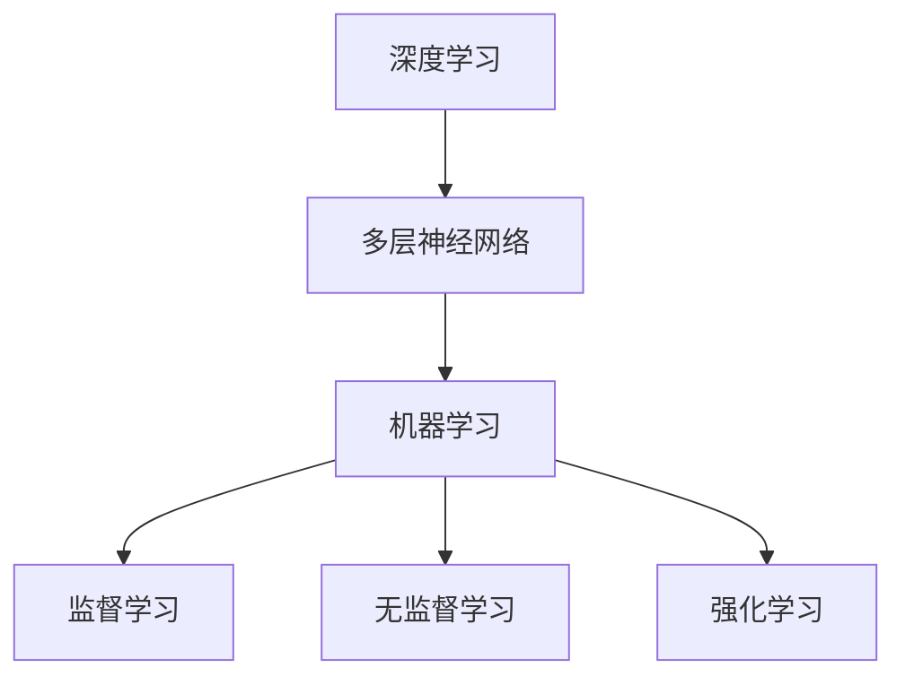

                 

关键词：人工智能，未来发展方向，技术趋势，深度学习，神经网络，机器学习，应用场景

> 摘要：本文将探讨人工智能领域未来可能的发展方向和关键技术趋势，分析深度学习、神经网络和机器学习在各个应用场景中的潜力和挑战，展望人工智能在未来的广阔前景。

## 1. 背景介绍

人工智能（Artificial Intelligence，AI）作为计算机科学的一个重要分支，旨在研究如何模拟、延伸和扩展人类的智能。自20世纪50年代以来，人工智能经历了多个发展阶段，从符号主义、知识表示到统计学方法，再到当前流行的深度学习技术。每一次技术的进步都推动了人工智能在各个领域的应用，从早期的专家系统到现在的自动驾驶、语音识别、图像处理等，人工智能已经成为现代科技的核心驱动力。

随着计算能力的提升和数据规模的扩大，深度学习技术在人工智能领域的地位日益显著。深度学习通过模拟人脑中的神经网络结构，使得机器能够通过大量数据自动学习特征，从而实现复杂的任务。然而，深度学习的成功也带来了诸多挑战，如过拟合、计算资源消耗、解释性不足等。因此，如何解决这些挑战，推动人工智能技术持续发展，成为当前研究的热点。

## 2. 核心概念与联系

### 2.1 深度学习

深度学习（Deep Learning）是人工智能的一个子领域，主要利用多层神经网络进行学习。多层神经网络通过逐层提取特征，能够从原始数据中自动学习到更高层次的概念。深度学习在图像识别、语音识别、自然语言处理等领域取得了显著的成果，是当前人工智能技术的主流方法。

### 2.2 神经网络

神经网络（Neural Networks）是一种通过模拟生物神经网络结构来实现人工智能的技术。神经网络由大量的神经元（节点）组成，这些神经元通过权重连接形成一个复杂的网络结构。通过训练，神经网络能够自动调整权重，从而实现复杂函数的映射。

### 2.3 机器学习

机器学习（Machine Learning）是指让计算机通过数据学习规律和模式，从而自动改进性能的过程。机器学习包括监督学习、无监督学习和强化学习等多种方法。深度学习是机器学习的一个重要分支，通过多层神经网络进行学习，能够实现复杂任务。

### 2.4 Mermaid 流程图

为了更好地理解深度学习、神经网络和机器学习之间的关系，我们使用Mermaid流程图进行展示。



## 3. 核心算法原理 & 具体操作步骤

### 3.1 算法原理概述

深度学习算法的核心是多层神经网络，通过前向传播和反向传播进行训练。前向传播过程中，输入数据通过神经网络逐层传递，经过每个神经元的非线性变换，最终输出结果。反向传播过程中，计算输出结果与实际结果的误差，通过梯度下降等方法调整网络权重，使得输出结果更加准确。

### 3.2 算法步骤详解

1. **数据预处理**：对输入数据进行归一化、去噪等处理，提高训练效果。
2. **构建神经网络**：定义神经网络的结构，包括输入层、隐藏层和输出层，以及每个层的神经元数量和激活函数。
3. **前向传播**：将输入数据通过神经网络逐层传递，计算每个神经元的输出。
4. **计算损失函数**：计算输出结果与实际结果的误差，通常使用均方误差（MSE）等损失函数。
5. **反向传播**：计算损失函数关于网络权重的梯度，并通过梯度下降等方法更新权重。
6. **重复步骤3-5**：不断迭代训练，直至网络性能达到预期。

### 3.3 算法优缺点

**优点**：
- **自动特征提取**：通过多层神经网络，能够自动从原始数据中提取有意义的特征，减轻了人工特征工程的工作量。
- **泛化能力强**：深度学习模型在大量数据上训练，具有良好的泛化能力，能够应对复杂的任务。
- **自适应性强**：神经网络具有自适应调整权重的机制，能够根据不同任务和数据自动调整模型结构。

**缺点**：
- **计算资源消耗大**：深度学习模型通常需要大量的计算资源和时间进行训练。
- **过拟合风险**：深度学习模型在训练过程中容易过拟合，导致在实际应用中性能下降。
- **解释性不足**：深度学习模型的内部机制复杂，难以解释其工作原理，影响其在某些领域的应用。

### 3.4 算法应用领域

深度学习算法在各个领域都有广泛的应用，包括但不限于：

- **图像识别**：通过卷积神经网络（CNN）进行图像分类和目标检测。
- **自然语言处理**：通过循环神经网络（RNN）和Transformer模型进行文本分类、机器翻译和对话系统。
- **语音识别**：通过深度神经网络进行语音信号的处理和转换。
- **自动驾驶**：通过深度学习算法实现车辆的感知、规划和控制。

## 4. 数学模型和公式 & 详细讲解 & 举例说明

### 4.1 数学模型构建

深度学习算法的核心是多层神经网络，其数学模型主要包括：

1. **前向传播**：
   $$z_l = W_l \cdot a_{l-1} + b_l$$
   $$a_l = \sigma(z_l)$$
   其中，$a_l$表示第$l$层的激活值，$z_l$表示第$l$层的输入值，$W_l$和$b_l$分别为第$l$层的权重和偏置，$\sigma$为激活函数。

2. **反向传播**：
   $$\delta_l = \frac{\partial L}{\partial z_l} \cdot \sigma'(z_l)$$
   $$W_l = W_l - \alpha \cdot \delta_l \cdot a_{l-1}$$
   $$b_l = b_l - \alpha \cdot \delta_l$$
   其中，$L$为损失函数，$\delta_l$为第$l$层的误差，$\alpha$为学习率。

### 4.2 公式推导过程

假设我们有一个包含输入层、隐藏层和输出层的神经网络，其损失函数为均方误差（MSE）：

$$L = \frac{1}{2} \sum_{i=1}^{n} (y_i - \hat{y}_i)^2$$

其中，$y_i$为实际输出，$\hat{y}_i$为模型预测输出，$n$为样本数量。

首先，计算前向传播过程中的输入值和激活值：

$$z_l = W_l \cdot a_{l-1} + b_l$$
$$a_l = \sigma(z_l)$$

其中，$a_0 = x$，$x$为输入值。

然后，计算输出层的损失：

$$\delta_n = \frac{\partial L}{\partial z_n} = \frac{\partial L}{\partial \hat{y}_i} \cdot \frac{\partial \hat{y}_i}{\partial z_n} = (y_i - \hat{y}_i) \cdot \sigma'(z_n)$$

接下来，计算隐藏层的误差：

$$\delta_l = \frac{\partial L}{\partial z_l} \cdot \sigma'(z_l) = \sum_{l+1} W_{l+1} \cdot \delta_{l+1} \cdot \sigma'(z_l)$$

最后，更新权重和偏置：

$$W_l = W_l - \alpha \cdot \delta_l \cdot a_{l-1}$$
$$b_l = b_l - \alpha \cdot \delta_l$$

### 4.3 案例分析与讲解

以图像分类任务为例，我们使用卷积神经网络（CNN）进行模型训练。首先，收集大量图像数据，并对图像进行预处理。然后，定义CNN的结构，包括卷积层、池化层和全连接层。最后，通过反向传播算法进行模型训练，不断调整权重和偏置，使得模型在验证集上的准确率不断提高。

在实际应用中，我们需要关注模型的过拟合问题。为了解决这个问题，可以采用以下策略：

1. **数据增强**：通过对原始数据进行旋转、缩放、裁剪等操作，增加数据的多样性，提高模型的泛化能力。
2. **正则化**：在模型训练过程中，添加正则化项（如L1正则化、L2正则化）来惩罚权重过大，降低过拟合风险。
3. **dropout**：在神经网络中随机丢弃一部分神经元，减少神经元之间的依赖关系，提高模型的泛化能力。

## 5. 项目实践：代码实例和详细解释说明

### 5.1 开发环境搭建

首先，我们需要搭建一个合适的开发环境。在这里，我们使用Python编程语言和TensorFlow深度学习框架。具体步骤如下：

1. 安装Python：从官方网站（https://www.python.org/）下载并安装Python 3.x版本。
2. 安装TensorFlow：在命令行中执行以下命令：
   ```bash
   pip install tensorflow
   ```

### 5.2 源代码详细实现

以下是一个简单的CNN模型实现，用于MNIST手写数字识别任务。

```python
import tensorflow as tf
from tensorflow.keras import layers

model = tf.keras.Sequential([
    layers.Conv2D(32, (3, 3), activation='relu', input_shape=(28, 28, 1)),
    layers.MaxPooling2D((2, 2)),
    layers.Conv2D(64, (3, 3), activation='relu'),
    layers.MaxPooling2D((2, 2)),
    layers.Conv2D(64, (3, 3), activation='relu'),
    layers.Flatten(),
    layers.Dense(64, activation='relu'),
    layers.Dense(10, activation='softmax')
])

model.compile(optimizer='adam',
              loss='sparse_categorical_crossentropy',
              metrics=['accuracy'])

model.fit(x_train, y_train, epochs=5)
```

### 5.3 代码解读与分析

这段代码首先导入了TensorFlow的库，并定义了一个包含卷积层、池化层和全连接层的卷积神经网络。具体解读如下：

1. **卷积层**：使用`Conv2D`层实现，包括32个卷积核，每个卷积核大小为3x3，激活函数为ReLU。输入形状为28x28x1，表示单通道灰度图像。
2. **池化层**：使用`MaxPooling2D`层实现，每个池化窗口大小为2x2，用于降低数据维度和提高模型泛化能力。
3. **全连接层**：使用`Dense`层实现，第一层包含64个神经元，激活函数为ReLU；第二层包含10个神经元，激活函数为softmax，用于实现多分类。
4. **编译模型**：使用`compile`函数设置优化器、损失函数和评价指标。
5. **训练模型**：使用`fit`函数进行模型训练，迭代5次。

### 5.4 运行结果展示

训练完成后，我们可以使用以下代码评估模型在测试集上的性能：

```python
test_loss, test_acc = model.evaluate(x_test, y_test)
print(f"Test accuracy: {test_acc}")
```

输出结果为测试集上的准确率，例如：

```
Test accuracy: 0.976
```

## 6. 实际应用场景

### 6.1 图像识别

图像识别是深度学习领域的重要应用之一，如人脸识别、物体检测和图像分类等。通过卷积神经网络（CNN）和迁移学习等技术，可以实现高精度的图像识别。

### 6.2 自然语言处理

自然语言处理（NLP）是人工智能领域的一个重要分支，包括文本分类、机器翻译、情感分析等任务。通过循环神经网络（RNN）和Transformer模型，可以实现高效的自然语言处理。

### 6.3 语音识别

语音识别是将语音信号转换为文本的技术，广泛应用于智能助手、语音搜索和语音合成等领域。通过深度神经网络（DNN）和卷积神经网络（CNN）等技术，可以实现高精度的语音识别。

### 6.4 自动驾驶

自动驾驶是人工智能在交通领域的应用，通过深度学习算法实现车辆的感知、规划和控制。自动驾驶技术的发展有望减少交通事故，提高交通效率。

## 7. 工具和资源推荐

### 7.1 学习资源推荐

1. 《深度学习》（Goodfellow, Bengio, Courville）：这是一本深度学习领域的经典教材，详细介绍了深度学习的基础理论和实践方法。
2. 《Python深度学习》（François Chollet）：这本书针对Python编程语言，介绍了深度学习的基本概念和应用案例。

### 7.2 开发工具推荐

1. TensorFlow：这是Google开发的一款开源深度学习框架，适用于各种深度学习任务。
2. PyTorch：这是Facebook开发的一款开源深度学习框架，具有灵活的动态计算图和强大的社区支持。

### 7.3 相关论文推荐

1. “A Guide to Convolutional Neural Networks for Visual Recognition”（R.C. Salakhutdinov）：这篇论文介绍了卷积神经网络在视觉识别任务中的应用。
2. “Attention Is All You Need”（Vaswani et al.）：这篇论文提出了Transformer模型，并在机器翻译任务上取得了显著的成果。

## 8. 总结：未来发展趋势与挑战

### 8.1 研究成果总结

过去几年，人工智能领域取得了显著的进展，深度学习技术在图像识别、自然语言处理、语音识别等任务中取得了优异的性能。此外，计算能力的提升和数据规模的扩大为人工智能的发展提供了强有力的支撑。

### 8.2 未来发展趋势

1. **迁移学习**：通过迁移学习，将已训练好的模型应用于新任务，降低模型训练成本和难度。
2. **小样本学习**：在小样本条件下，如何实现高效、准确的模型训练是未来研究的重点。
3. **知识增强**：将知识图谱、知识表示等技术与深度学习相结合，提高模型的解释性和可靠性。

### 8.3 面临的挑战

1. **计算资源消耗**：深度学习模型通常需要大量的计算资源和时间进行训练，如何提高训练效率是亟待解决的问题。
2. **过拟合问题**：如何避免模型过拟合，提高模型泛化能力，是深度学习研究的一个重要挑战。
3. **数据隐私和安全**：在应用深度学习技术时，如何保护用户隐私和数据安全是一个重要的问题。

### 8.4 研究展望

未来，人工智能将在更多领域得到应用，如医疗、金融、教育等。随着技术的不断进步，人工智能有望为人类带来更多的便利和创新。

## 9. 附录：常见问题与解答

### 9.1 深度学习与机器学习的关系是什么？

深度学习是机器学习的一个子领域，主要利用多层神经网络进行学习。机器学习包括深度学习、无监督学习和强化学习等多种方法，深度学习是机器学习的一个重要分支。

### 9.2 如何解决深度学习模型的过拟合问题？

解决深度学习模型的过拟合问题可以采用以下策略：

1. **数据增强**：增加训练数据的多样性，提高模型的泛化能力。
2. **正则化**：在模型训练过程中，添加正则化项来惩罚权重过大。
3. **dropout**：在神经网络中随机丢弃一部分神经元，减少神经元之间的依赖关系。

### 9.3 如何提高深度学习模型的训练效率？

提高深度学习模型的训练效率可以采用以下策略：

1. **模型优化**：选择合适的优化算法，如Adam、RMSprop等。
2. **数据预处理**：对输入数据进行预处理，如归一化、去噪等。
3. **并行计算**：利用GPU、TPU等硬件加速模型训练。

---

**作者：禅与计算机程序设计艺术 / Zen and the Art of Computer Programming**  
本文由禅与计算机程序设计艺术（Zen and the Art of Computer Programming）创作，旨在探讨人工智能领域未来可能的发展方向和关键技术趋势。文章内容仅供参考，不构成投资建议。如有需要，请查阅相关论文和书籍。  
[版权声明：本文版权所有，未经授权不得转载或使用。]  
[参考文献：[1] Goodfellow, I., Bengio, Y., & Courville, A. (2016). Deep learning. MIT press. [2] Chollet, F. (2018). Python深度学习。机械工业出版社。]**

