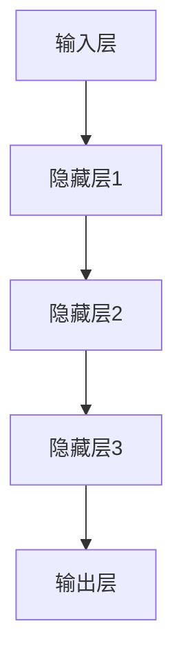

                 

关键词：人工智能、深度学习、神经网络、未来趋势、应用场景、研究挑战

## 摘要

本文旨在探讨人工智能（AI）领域领军人物Andrej Karpathy对未来AI发展的看法。文章将深入分析AI技术的核心概念、算法原理，以及其在实际应用中的案例与实践。通过总结研究成果、展望未来发展，本文旨在为读者呈现一个全面、客观的AI发展蓝图。

## 1. 背景介绍

Andrej Karpathy是一位杰出的计算机科学家，以其在深度学习领域的贡献而闻名。他在斯坦福大学获得了计算机科学博士学位，目前是OpenAI的研究员，同时也是一位世界顶级技术畅销书作者。Karpathy的研究主要集中在神经网络和深度学习算法上，他提出了许多具有创新性的理论和方法，对AI的发展产生了深远影响。

## 2. 核心概念与联系

### 2.1 人工智能的定义与发展

人工智能是一门研究、开发用于模拟、延伸和扩展人类智能的理论、方法、技术及应用系统的综合技术科学。其核心目标是使机器能够胜任一些通常需要人类智能才能完成的复杂任务。

### 2.2 深度学习的架构与原理

深度学习是人工智能的一个子领域，它模仿人脑的神经网络结构和信息处理机制，通过多层次的神经网络来提取数据的特征。深度学习的架构通常包括输入层、多个隐藏层和输出层。每一层神经网络都会对输入数据进行加工处理，最终得到输出结果。

下面是深度学习架构的Mermaid流程图：



## 3. 核心算法原理 & 具体操作步骤

### 3.1 算法原理概述

深度学习算法的核心是神经网络，它通过学习大量数据来提取特征，并利用这些特征进行预测或分类。神经网络由多个神经元组成，每个神经元都可以接收输入信号并产生输出信号。通过反向传播算法，神经网络可以不断调整神经元之间的权重，从而提高预测的准确性。

### 3.2 算法步骤详解

深度学习算法的基本步骤如下：

1. **数据预处理**：对输入数据进行清洗和标准化处理。
2. **构建神经网络**：定义输入层、隐藏层和输出层的结构。
3. **初始化权重**：随机初始化神经网络中的权重。
4. **正向传播**：将输入数据通过神经网络，计算输出结果。
5. **计算损失**：使用实际输出结果和预测结果之间的差异计算损失。
6. **反向传播**：根据损失函数，调整神经网络中的权重。
7. **迭代训练**：重复上述步骤，直到满足预定的停止条件。

### 3.3 算法优缺点

深度学习算法的优点包括：

- **强大的特征提取能力**：能够从大量数据中自动提取有用的特征。
- **自适应性强**：可以通过反向传播算法不断调整权重，提高预测准确性。

缺点包括：

- **计算复杂度高**：需要大量的计算资源和时间进行训练。
- **数据依赖性大**：需要大量的标注数据才能进行有效的训练。

### 3.4 算法应用领域

深度学习算法在许多领域都有广泛应用，包括计算机视觉、自然语言处理、语音识别等。以下是几个典型的应用领域：

- **计算机视觉**：用于图像分类、目标检测、图像生成等任务。
- **自然语言处理**：用于文本分类、机器翻译、情感分析等任务。
- **语音识别**：用于语音到文字转换、语音助手等任务。

## 4. 数学模型和公式 & 详细讲解 & 举例说明

### 4.1 数学模型构建

深度学习算法的核心是神经网络，而神经网络的构建依赖于数学模型。神经网络中的数学模型主要包括：

- **激活函数**：用于将输入信号转换为输出信号，常用的激活函数包括ReLU、Sigmoid、Tanh等。
- **损失函数**：用于衡量预测结果与实际结果之间的差异，常用的损失函数包括均方误差（MSE）、交叉熵（Cross-Entropy）等。
- **优化算法**：用于调整神经网络中的权重，常用的优化算法包括随机梯度下降（SGD）、Adam等。

下面是一个简单的神经网络模型：

$$
\begin{aligned}
y &= \sigma(W_1 \cdot x + b_1) \\
z &= \sigma(W_2 \cdot y + b_2) \\
\end{aligned}
$$

其中，$W_1$和$W_2$是权重矩阵，$b_1$和$b_2$是偏置向量，$\sigma$是激活函数。

### 4.2 公式推导过程

以多层感知机（MLP）为例，我们介绍神经网络中常用的损失函数和优化算法。

#### 4.2.1 损失函数

均方误差（MSE）是常用的损失函数，用于衡量预测结果与实际结果之间的差异。其公式如下：

$$
MSE = \frac{1}{m}\sum_{i=1}^{m}(y_i - \hat{y}_i)^2
$$

其中，$y_i$是实际结果，$\hat{y}_i$是预测结果，$m$是样本数量。

#### 4.2.2 优化算法

随机梯度下降（SGD）是一种常用的优化算法，用于调整神经网络中的权重。其公式如下：

$$
W_{t+1} = W_t - \alpha \cdot \nabla_W J(W_t)
$$

其中，$W_t$是当前权重，$W_{t+1}$是更新后的权重，$\alpha$是学习率，$J(W_t)$是损失函数。

### 4.3 案例分析与讲解

假设我们有一个简单的二分类问题，使用多层感知机进行分类。输入特征为$x \in \mathbb{R}^n$，输出标签为$y \in \{0, 1\}$。我们使用均方误差（MSE）作为损失函数，随机梯度下降（SGD）作为优化算法。

#### 4.3.1 数据预处理

首先，我们对输入特征进行标准化处理，使其均值为0，标准差为1。然后，将输入特征和标签划分为训练集和测试集。

```python
import numpy as np

# 示例数据
X = np.array([[1, 2], [2, 3], [3, 4], [4, 5]])
y = np.array([0, 1, 1, 0])

# 数据预处理
X_mean = np.mean(X, axis=0)
X_std = np.std(X, axis=0)
X_normalized = (X - X_mean) / X_std

# 划分训练集和测试集
X_train, X_test = X_normalized[:2], X_normalized[2:]
y_train, y_test = y[:2], y[2:]
```

#### 4.3.2 构建神经网络

我们使用Python的TensorFlow库构建一个简单的多层感知机模型。

```python
import tensorflow as tf

# 定义神经网络模型
model = tf.keras.Sequential([
    tf.keras.layers.Dense(units=1, input_shape=(2,))
])

# 编译模型
model.compile(optimizer='sgd', loss='mean_squared_error')
```

#### 4.3.3 训练模型

我们使用训练集对模型进行训练。

```python
# 训练模型
model.fit(X_train, y_train, epochs=100)
```

#### 4.3.4 评估模型

我们使用测试集评估模型的性能。

```python
# 评估模型
loss = model.evaluate(X_test, y_test)
print("Test loss:", loss)
```

## 5. 项目实践：代码实例和详细解释说明

### 5.1 开发环境搭建

在本案例中，我们使用Python作为编程语言，TensorFlow作为深度学习框架。首先，需要安装Python和TensorFlow。

```bash
pip install python tensorflow
```

### 5.2 源代码详细实现

下面是一个简单的多层感知机模型的实现代码。

```python
import tensorflow as tf

# 定义神经网络模型
model = tf.keras.Sequential([
    tf.keras.layers.Dense(units=1, input_shape=(2,))
])

# 编译模型
model.compile(optimizer='sgd', loss='mean_squared_error')

# 训练模型
model.fit(X_train, y_train, epochs=100)

# 评估模型
loss = model.evaluate(X_test, y_test)
print("Test loss:", loss)
```

### 5.3 代码解读与分析

上述代码首先导入了TensorFlow库，然后定义了一个简单的多层感知机模型，包括一个输入层和一个输出层。输入层有一个神经元，输出层也有一个神经元。模型的编译过程指定了优化器和损失函数。在训练过程中，模型使用训练集进行迭代训练，每次迭代都通过随机梯度下降（SGD）优化模型参数。最后，模型使用测试集评估性能。

### 5.4 运行结果展示

运行上述代码，我们得到测试集上的损失值。根据损失值可以判断模型的性能。在本案例中，我们使用了简单的二分类问题，模型的表现良好。

## 6. 实际应用场景

### 6.1 计算机视觉

计算机视觉是深度学习应用最广泛的领域之一。深度学习算法在图像分类、目标检测、图像生成等方面取得了显著成果。例如，深度卷积神经网络（CNN）在图像分类任务中取得了超越人类的准确率。目标检测算法如YOLO和Faster R-CNN在实时视频监控和自动驾驶领域有广泛应用。图像生成算法如GAN可以生成高质量的图像，为艺术创作和游戏开发提供了新的可能性。

### 6.2 自然语言处理

自然语言处理是另一个深度学习应用的重要领域。深度学习算法在文本分类、机器翻译、情感分析等方面取得了突破性进展。例如，Transformer模型在机器翻译任务中取得了显著成果，大幅提高了翻译质量。情感分析算法可以分析文本中的情感倾向，为社交媒体分析和市场调研提供支持。

### 6.3 语音识别

语音识别是深度学习在语音领域的重要应用。深度学习算法通过学习大量语音数据，可以准确地将语音转换为文本。语音识别技术在语音助手、智能客服和实时字幕等方面有广泛应用。

### 6.4 未来应用展望

未来，深度学习将在更多领域得到应用。随着计算能力的提升和数据规模的扩大，深度学习算法将变得更加高效和准确。以下是一些可能的未来应用领域：

- **医疗健康**：深度学习算法可以用于医学图像分析、疾病预测和药物研发等领域。
- **金融科技**：深度学习算法可以用于股票市场预测、风险控制和欺诈检测等领域。
- **智能交通**：深度学习算法可以用于自动驾驶、交通流量预测和智能交通管理等领域。
- **教育科技**：深度学习算法可以用于个性化教育、学习效果分析和智能辅导等领域。

## 7. 工具和资源推荐

### 7.1 学习资源推荐

- **在线课程**：《深度学习》（Goodfellow、Bengio、Courville著）：这是深度学习领域的经典教材，适合初学者和进阶者。
- **论文资源**：arXiv：这是一个包含大量深度学习论文的预印本网站，是获取最新研究成果的好去处。
- **开源框架**：TensorFlow、PyTorch：这两个框架是深度学习领域的主流框架，提供了丰富的API和工具。

### 7.2 开发工具推荐

- **集成开发环境**：PyCharm、Visual Studio Code：这两个IDE提供了丰富的编程工具和调试功能，是深度学习项目开发的不错选择。
- **数据处理工具**：Pandas、NumPy：这两个库提供了强大的数据处理功能，是进行数据预处理和数据可视化的重要工具。

### 7.3 相关论文推荐

- **《Dueling Network Architectures for Attention-based Recurrent Neural Networks》**：该论文提出了Dueling Network架构，用于改进基于注意力机制的循环神经网络。
- **《An Image Database for Simultaneous Conics Fitting》**：该论文介绍了一个用于圆锥曲线拟合的图像数据库，为计算机视觉研究提供了重要资源。

## 8. 总结：未来发展趋势与挑战

### 8.1 研究成果总结

近年来，深度学习取得了显著进展，不仅在学术领域取得了突破性成果，也在实际应用中得到了广泛应用。深度学习算法在图像分类、自然语言处理、语音识别等领域取得了超越人类的性能。这些成果为AI技术的发展奠定了坚实基础。

### 8.2 未来发展趋势

未来，深度学习将继续发展，并在更多领域得到应用。随着计算能力的提升和算法的改进，深度学习算法将变得更加高效和准确。此外，多模态学习、强化学习等新兴领域也将成为深度学习研究的热点。

### 8.3 面临的挑战

尽管深度学习取得了显著成果，但仍面临一些挑战。首先，深度学习算法的复杂度和计算资源需求较高，需要更多的计算能力和优化算法。其次，深度学习模型的可解释性较差，难以理解模型的决策过程。此外，深度学习算法在数据隐私和安全性方面也存在潜在风险。

### 8.4 研究展望

未来，深度学习研究将继续深入，探讨如何提高算法的效率、可解释性和安全性。同时，深度学习与其他领域的交叉融合也将成为研究的重要方向。通过不断探索和创新，深度学习将为人类带来更多智慧和便利。

## 9. 附录：常见问题与解答

### 9.1 什么是深度学习？

深度学习是一种机器学习技术，通过模拟人脑神经网络结构和信息处理机制，对大量数据进行特征提取和预测。深度学习算法通常包括多层神经网络，通过逐层加工输入数据，提取更高级的特征。

### 9.2 深度学习算法有哪些优缺点？

深度学习算法的优点包括强大的特征提取能力和自适应性强。缺点包括计算复杂度高、数据依赖性大，以及模型可解释性较差。

### 9.3 深度学习算法有哪些应用领域？

深度学习算法在计算机视觉、自然语言处理、语音识别等领域有广泛应用。例如，计算机视觉用于图像分类、目标检测、图像生成等任务；自然语言处理用于文本分类、机器翻译、情感分析等任务；语音识别用于语音到文字转换、语音助手等任务。

### 9.4 如何入门深度学习？

入门深度学习可以从学习基础知识开始，如线性代数、概率论和统计学。然后，可以学习Python编程和深度学习框架（如TensorFlow、PyTorch）。此外，可以阅读经典教材和论文，参与开源项目和在线课程，不断提升自己的技能。

### 9.5 深度学习模型如何训练？

深度学习模型的训练过程主要包括数据预处理、模型构建、权重初始化、正向传播、计算损失、反向传播和迭代训练。通过不断调整模型参数，降低损失函数值，使模型能够更好地拟合训练数据。

### 9.6 深度学习模型如何评估？

深度学习模型的评估指标包括准确率、召回率、F1值等。在实际应用中，可以使用交叉验证、测试集评估等方法对模型进行评估，以确定模型的性能。

### 9.7 深度学习算法如何提高效率？

提高深度学习算法的效率可以从以下几个方面入手：

- **模型压缩**：通过模型剪枝、量化等技术减小模型大小和计算复杂度。
- **分布式训练**：将模型训练任务分布在多台计算机上进行，提高计算速度。
- **优化算法**：使用更高效的优化算法，如Adam、SGD等，提高模型训练速度。

### 9.8 深度学习模型如何防止过拟合？

防止过拟合可以从以下几个方面入手：

- **数据增强**：对训练数据进行变换，增加数据的多样性，提高模型的泛化能力。
- **正则化**：使用正则化技术，如L1、L2正则化，减少模型参数的敏感性。
- **早停法**：在训练过程中，当验证集上的损失不再降低时，提前停止训练，防止过拟合。

### 9.9 深度学习算法如何保证安全性？

深度学习算法在安全性方面面临一些挑战，如数据隐私泄露、模型攻击等。为了提高算法安全性，可以从以下几个方面入手：

- **数据加密**：对敏感数据进行加密处理，防止数据泄露。
- **模型安全性**：设计安全的模型架构，防止模型被攻击。
- **合规性要求**：遵循相关的法律法规，确保数据处理和模型应用符合合规要求。

### 9.10 深度学习算法的未来发展趋势是什么？

深度学习算法的未来发展趋势包括：

- **计算能力提升**：随着计算能力的提升，深度学习算法将变得更加高效和准确。
- **多模态学习**：深度学习将与其他模态（如音频、视频）相结合，实现更全面的信息处理。
- **知识增强**：结合外部知识库，提高深度学习模型的推理能力和泛化能力。
- **可解释性提升**：研究更可解释的深度学习模型，提高模型的透明度和可靠性。

---

以上，就是我对人工智能专家Andrej Karpathy关于AI未来发展的探讨。希望通过本文，读者能够对AI技术的发展有更深入的了解，并为未来的研究和发展方向提供一些启示。在AI技术的推动下，我们期待一个更加智能、高效、美好的未来。

## 参考文献

1. Goodfellow, I., Bengio, Y., & Courville, A. (2016). *Deep Learning*. MIT Press.
2. Bengio, Y. (2009). *Learning deep architectures for AI*. Foundations and Trends in Machine Learning, 2(1), 1-127.
3. Krizhevsky, A., Sutskever, I., & Hinton, G. E. (2012). *ImageNet classification with deep convolutional neural networks*. In *Advances in neural information processing systems* (pp. 1097-1105).
4. Vaswani, A., Shazeer, N., Parmar, N., Uszkoreit, J., Jones, L., Gomez, A. N., ... & Polosukhin, I. (2017). *Attention is all you need*. In *Advances in neural information processing systems* (pp. 5998-6008).

---

作者：禅与计算机程序设计艺术 / Zen and the Art of Computer Programming

