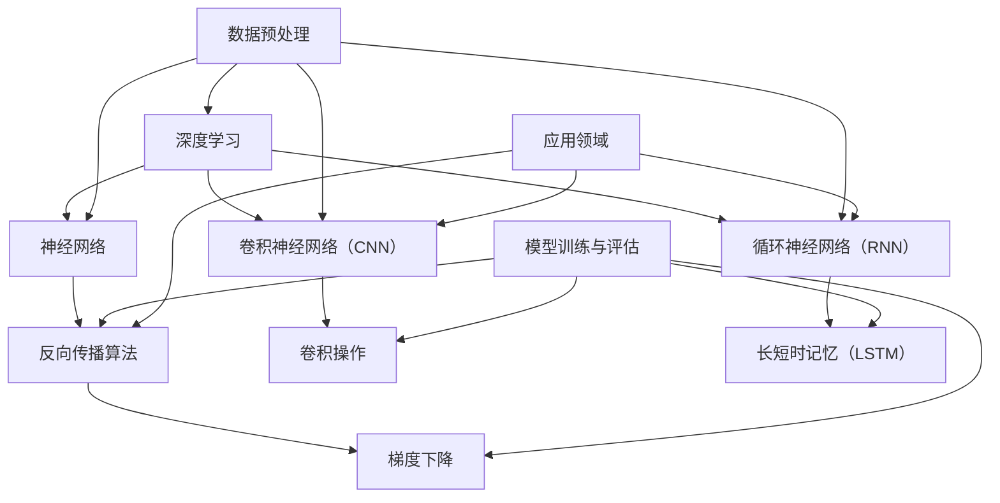

                 

关键词：人工智能、未来、策略、AI、技术、发展、挑战、机遇

> 摘要：本文探讨了人工智能（AI）领域的未来发展趋势和策略。通过分析当前的技术现状、核心算法原理及其应用，本文提出了未来AI发展的可能路径，并探讨了在发展过程中面临的挑战。同时，文章还推荐了一些学习资源和开发工具，以期为AI领域的从业者提供有价值的参考。

## 1. 背景介绍

人工智能（AI）作为计算机科学的一个分支，旨在通过机器学习和深度学习等技术，让计算机具备类似人类的学习和推理能力。近年来，随着计算能力的提升和数据量的爆炸式增长，AI取得了显著的进展，从语音识别、图像识别到自然语言处理，AI技术已经在多个领域得到了广泛应用。

安德烈·卡帕西（Andrej Karpathy）是一位世界知名的人工智能专家，他在深度学习、计算机视觉和自然语言处理等领域有着深厚的研究功底。本文将基于安德烈·卡帕西的研究成果，探讨人工智能的未来发展策略。

### 1.1 人工智能的历史发展

人工智能的概念最早可以追溯到20世纪50年代。当时，科学家们希望通过模拟人类大脑的结构和功能，使计算机具备类似人类的智能。然而，受限于计算能力和数据量，早期的人工智能研究进展缓慢。直到20世纪80年代，随着计算机性能的不断提升，人工智能开始逐步进入实用阶段。

在过去的几十年中，人工智能经历了几个重要的发展阶段：

- **符号人工智能（Symbolic AI）**：这一阶段主要依靠专家系统和逻辑推理来实现人工智能。然而，由于规则有限且无法处理大量数据，符号人工智能逐渐暴露出其局限性。

- **机器学习（Machine Learning）**：20世纪90年代，机器学习逐渐兴起，通过从数据中学习规律和模式，实现自动识别和预测。这一阶段的人工智能取得了显著进展，尤其是在图像识别、语音识别和自然语言处理等领域。

- **深度学习（Deep Learning）**：深度学习是机器学习的一种重要分支，通过多层神经网络来模拟人类大脑的学习过程。深度学习在图像识别、语音识别和自然语言处理等领域取得了突破性进展，推动了人工智能的快速发展。

### 1.2 当前人工智能技术的发展现状

当前，人工智能技术已经取得了显著的进展，特别是在计算机视觉、自然语言处理和语音识别等领域。以下是一些关键进展：

- **计算机视觉**：通过深度学习技术，计算机在图像识别、目标检测和图像生成等方面取得了重大突破。例如，卷积神经网络（CNN）在ImageNet图像识别比赛中连续多年夺冠，推动了计算机视觉技术的发展。

- **自然语言处理**：深度学习技术在自然语言处理领域取得了显著进展，如词向量表示、序列到序列模型和生成对抗网络（GAN）等。这些技术使得计算机在机器翻译、文本生成和情感分析等方面具有了更高的准确性和智能化水平。

- **语音识别**：随着深度学习技术的应用，语音识别的准确率和速度得到了大幅提升。例如，谷歌、百度等公司的语音识别系统已经能够达到接近人类的识别水平。

## 2. 核心概念与联系

在探讨人工智能的未来发展策略之前，我们需要了解一些核心概念和原理。以下是一个简化的 Mermaid 流程图，用于描述这些核心概念及其之间的联系：



### 2.1 深度学习与神经网络

深度学习是一种基于多层神经网络的学习方法，其目的是通过逐层提取特征，实现从原始数据到复杂目标的映射。神经网络是由大量神经元（节点）组成的计算模型，每个神经元都与其他神经元相连，并通过权重和偏置进行调节。

### 2.2 卷积神经网络（CNN）

卷积神经网络是一种专门用于图像处理和识别的神经网络架构，通过卷积操作和池化操作，能够有效提取图像中的特征。CNN 在计算机视觉领域取得了显著成果，如图像分类、目标检测和图像生成等。

### 2.3 循环神经网络（RNN）

循环神经网络是一种能够处理序列数据的神经网络，通过记忆前一个时间步的信息，实现长期依赖的建模。RNN 在自然语言处理和语音识别等领域具有广泛的应用，如文本生成、机器翻译和语音识别等。

### 2.4 数据预处理、模型训练与评估

数据预处理是深度学习过程中的重要环节，包括数据清洗、归一化和特征提取等。模型训练与评估是深度学习的基本流程，通过反向传播算法和梯度下降等优化方法，使模型能够从数据中学习到有效的特征表示。模型评估主要包括准确性、召回率和F1分数等指标。

### 2.5 应用领域

深度学习技术已经广泛应用于各个领域，如计算机视觉、自然语言处理、语音识别和医疗诊断等。在这些领域，深度学习技术为人们提供了更加智能化和高效的解决方案。

## 3. 核心算法原理 & 具体操作步骤

### 3.1 算法原理概述

在深度学习中，核心算法包括神经网络、卷积神经网络（CNN）、循环神经网络（RNN）等。这些算法通过多层神经网络的结构，实现对数据的特征提取和模式识别。

### 3.2 算法步骤详解

- **神经网络**：神经网络由多个层次组成，包括输入层、隐藏层和输出层。每个层次由多个神经元组成，神经元之间通过权重和偏置进行连接。在训练过程中，神经网络通过反向传播算法和梯度下降等方法，调整权重和偏置，使模型能够从数据中学习到有效的特征表示。

- **卷积神经网络（CNN）**：卷积神经网络是一种专门用于图像处理的神经网络架构，通过卷积操作和池化操作，能够有效提取图像中的特征。在训练过程中，CNN 通过反向传播算法和梯度下降等方法，调整卷积核和偏置，使模型能够从图像数据中学习到有效的特征表示。

- **循环神经网络（RNN）**：循环神经网络是一种能够处理序列数据的神经网络，通过记忆前一个时间步的信息，实现长期依赖的建模。在训练过程中，RNN 通过反向传播算法和梯度下降等方法，调整权重和偏置，使模型能够从序列数据中学习到有效的特征表示。

### 3.3 算法优缺点

- **神经网络**：优点包括强大的表达能力和灵活性，可以处理各种类型的数据。缺点包括计算复杂度高、参数量大，且在训练过程中容易出现梯度消失和梯度爆炸等问题。

- **卷积神经网络（CNN）**：优点包括高效的特征提取能力和对图像数据的良好适应性，可以处理高维数据。缺点包括参数量和计算复杂度较高，且在处理非图像数据时效果不佳。

- **循环神经网络（RNN）**：优点包括能够处理序列数据，可以建模长期依赖关系。缺点包括容易产生梯度消失和梯度爆炸等问题，且在处理长序列时效果不佳。

### 3.4 算法应用领域

- **神经网络**：广泛应用于图像识别、自然语言处理、语音识别和推荐系统等领域。

- **卷积神经网络（CNN）**：广泛应用于计算机视觉领域，如图像分类、目标检测和图像生成等。

- **循环神经网络（RNN）**：广泛应用于自然语言处理和语音识别领域，如文本生成、机器翻译和语音识别等。

## 4. 数学模型和公式 & 详细讲解 & 举例说明

### 4.1 数学模型构建

在深度学习中，常用的数学模型包括神经网络、卷积神经网络（CNN）和循环神经网络（RNN）等。以下分别介绍这些模型的数学模型构建：

#### 4.1.1 神经网络

神经网络由多个层次组成，包括输入层、隐藏层和输出层。每个层次由多个神经元组成，神经元之间通过权重和偏置进行连接。神经元的激活函数通常为非线性函数，如 sigmoid 函数、ReLU 函数等。

给定输入数据 $x$ 和输出数据 $y$，神经网络的数学模型可以表示为：

$$
\hat{y} = f(\boldsymbol{W}^T \cdot \boldsymbol{a}^{(L)})
$$

其中，$f$ 为激活函数，$\boldsymbol{W}$ 为权重矩阵，$\boldsymbol{a}^{(L)}$ 为输出层的激活值。

#### 4.1.2 卷积神经网络（CNN）

卷积神经网络是一种专门用于图像处理的神经网络架构，通过卷积操作和池化操作，能够有效提取图像中的特征。CNN 的数学模型可以表示为：

$$
\hat{y}_{ij} = f(\sum_{k=1}^{C} \boldsymbol{W}_{ik}^T \cdot \boldsymbol{a}_{kj})
$$

其中，$\hat{y}_{ij}$ 为输出特征图上的一个元素，$\boldsymbol{W}_{ik}$ 为卷积核，$\boldsymbol{a}_{kj}$ 为输入特征图上的一个元素。

#### 4.1.3 循环神经网络（RNN）

循环神经网络是一种能够处理序列数据的神经网络，通过记忆前一个时间步的信息，实现长期依赖的建模。RNN 的数学模型可以表示为：

$$
\boldsymbol{h}_{t} = \sigma(\boldsymbol{W}_{h} \cdot [\boldsymbol{h}_{t-1}, \boldsymbol{x}_{t}] + \boldsymbol{b}_{h})
$$

其中，$\boldsymbol{h}_{t}$ 为当前时间步的隐藏状态，$\sigma$ 为激活函数，$\boldsymbol{W}_{h}$ 为权重矩阵，$\boldsymbol{x}_{t}$ 为当前时间步的输入。

### 4.2 公式推导过程

以下分别介绍神经网络、卷积神经网络（CNN）和循环神经网络（RNN）的公式推导过程：

#### 4.2.1 神经网络

神经网络的推导过程主要包括前向传播和反向传播两个阶段。

1. **前向传播**

给定输入数据 $x$ 和权重矩阵 $W$，神经网络的输出可以表示为：

$$
\boldsymbol{a}^{(L)} = f(\boldsymbol{W}^T \cdot \boldsymbol{a}^{(L-1)})
$$

其中，$f$ 为激活函数，$\boldsymbol{a}^{(L)}$ 为输出层的激活值。

2. **反向传播**

在反向传播过程中，我们需要计算损失函数关于权重矩阵 $W$ 的梯度。损失函数可以表示为：

$$
J = \frac{1}{2} \sum_{i=1}^{N} (\hat{y}_i - y_i)^2
$$

其中，$\hat{y}_i$ 为预测输出，$y_i$ 为真实输出，$N$ 为样本数量。

根据链式法则，损失函数关于权重矩阵 $W$ 的梯度可以表示为：

$$
\frac{\partial J}{\partial \boldsymbol{W}} = \frac{\partial J}{\partial \boldsymbol{a}^{(L)}} \cdot \frac{\partial \boldsymbol{a}^{(L)}}{\partial \boldsymbol{W}}
$$

其中，$\frac{\partial J}{\partial \boldsymbol{a}^{(L)}}$ 为输出层的梯度，$\frac{\partial \boldsymbol{a}^{(L)}}{\partial \boldsymbol{W}}$ 为权重矩阵的梯度。

根据链式法则，可以推导出权重矩阵的梯度：

$$
\frac{\partial \boldsymbol{a}^{(L)}}{\partial \boldsymbol{W}} = \frac{\partial f(\boldsymbol{W}^T \cdot \boldsymbol{a}^{(L-1)})}{\partial \boldsymbol{W}} = \frac{\partial f}{\partial \boldsymbol{a}^{(L-1)}} \cdot \frac{\partial \boldsymbol{a}^{(L-1)}}{\partial \boldsymbol{W}}
$$

将前向传播的输出代入，得到权重矩阵的梯度：

$$
\frac{\partial \boldsymbol{a}^{(L)}}{\partial \boldsymbol{W}} = f'(\boldsymbol{a}^{(L-1)}) \cdot \boldsymbol{a}^{(L-2)}
$$

其中，$f'$ 为激活函数的导数。

根据链式法则，可以进一步推导出损失函数关于权重矩阵的梯度：

$$
\frac{\partial J}{\partial \boldsymbol{W}} = -2 \cdot (\hat{y} - y) \cdot f'(\boldsymbol{a}^{(L-1)}) \cdot \boldsymbol{a}^{(L-2)}
$$

#### 4.2.2 卷积神经网络（CNN）

卷积神经网络（CNN）的推导过程主要包括卷积操作和池化操作的推导。

1. **卷积操作**

给定输入特征图 $\boldsymbol{a}_{kj}$ 和卷积核 $\boldsymbol{W}_{ik}$，卷积操作的输出可以表示为：

$$
\hat{a}_{ij} = \sum_{k=1}^{C} \boldsymbol{W}_{ik}^T \cdot \boldsymbol{a}_{kj}
$$

其中，$\hat{a}_{ij}$ 为输出特征图上的一个元素，$\boldsymbol{a}_{kj}$ 为输入特征图上的一个元素。

2. **池化操作**

池化操作是一种对特征图进行降维的操作，常用的池化方式包括最大池化和平均池化。

- **最大池化**：给定输入特征图 $\hat{a}_{ij}$，最大池化的输出可以表示为：

  $$
  p_{ij} = \max_{k=1}^{C} (\hat{a}_{ij})
  $$

- **平均池化**：给定输入特征图 $\hat{a}_{ij}$，平均池化的输出可以表示为：

  $$
  p_{ij} = \frac{1}{C} \sum_{k=1}^{C} (\hat{a}_{ij})
  $$

#### 4.2.3 循环神经网络（RNN）

循环神经网络（RNN）的推导过程主要包括前向传播和反向传播两个阶段。

1. **前向传播**

给定输入序列 $\boldsymbol{x}_{t}$ 和隐藏状态 $\boldsymbol{h}_{t-1}$，循环神经网络的输出可以表示为：

$$
\boldsymbol{h}_{t} = \sigma(\boldsymbol{W}_{h} \cdot [\boldsymbol{h}_{t-1}, \boldsymbol{x}_{t}] + \boldsymbol{b}_{h})
$$

其中，$\sigma$ 为激活函数，$\boldsymbol{W}_{h}$ 为权重矩阵，$\boldsymbol{b}_{h}$ 为偏置向量。

2. **反向传播**

在反向传播过程中，我们需要计算损失函数关于隐藏状态 $\boldsymbol{h}_{t}$ 的梯度。损失函数可以表示为：

$$
J = \frac{1}{2} \sum_{t=1}^{T} (\hat{y}_{t} - y_{t})^2
$$

其中，$\hat{y}_{t}$ 为预测输出，$y_{t}$ 为真实输出，$T$ 为序列长度。

根据链式法则，损失函数关于隐藏状态 $\boldsymbol{h}_{t}$ 的梯度可以表示为：

$$
\frac{\partial J}{\partial \boldsymbol{h}_{t}} = \frac{\partial J}{\partial \hat{y}_{t}} \cdot \frac{\partial \hat{y}_{t}}{\partial \boldsymbol{h}_{t}}
$$

根据前向传播的输出，可以推导出：

$$
\frac{\partial \hat{y}_{t}}{\partial \boldsymbol{h}_{t}} = \frac{\partial \sigma(\boldsymbol{W}_{h} \cdot [\boldsymbol{h}_{t-1}, \boldsymbol{x}_{t}] + \boldsymbol{b}_{h})}{\partial \boldsymbol{h}_{t}} = \sigma'(\boldsymbol{h}_{t}) \cdot \frac{\partial \boldsymbol{W}_{h} \cdot [\boldsymbol{h}_{t-1}, \boldsymbol{x}_{t}]}{\partial \boldsymbol{h}_{t}}
$$

将前向传播的输出代入，得到隐藏状态的梯度：

$$
\frac{\partial \hat{y}_{t}}{\partial \boldsymbol{h}_{t}} = \sigma'(\boldsymbol{h}_{t}) \cdot \boldsymbol{W}_{h} \cdot \frac{\partial \boldsymbol{h}_{t-1}}{\partial \boldsymbol{h}_{t}}
$$

根据链式法则，可以进一步推导出隐藏状态的梯度：

$$
\frac{\partial J}{\partial \boldsymbol{h}_{t}} = \sigma'(\boldsymbol{h}_{t}) \cdot \boldsymbol{W}_{h} \cdot \frac{\partial J}{\partial \boldsymbol{h}_{t-1}}
$$

### 4.3 案例分析与讲解

以下分别介绍神经网络、卷积神经网络（CNN）和循环神经网络（RNN）在具体应用中的案例分析和讲解：

#### 4.3.1 神经网络

案例：手写数字识别

手写数字识别是一种常见的人工智能应用，通过神经网络实现对手写数字的识别。以下是一个简单的手写数字识别案例：

1. **数据预处理**

   - 将手写数字图像转换为灰度图像。
   - 对图像进行归一化处理，使图像的像素值在0到1之间。
   - 将图像展开为一个一维向量作为神经网络的输入。

2. **模型构建**

   - 构建一个包含输入层、隐藏层和输出层的神经网络。
   - 输入层：包含784个神经元，对应图像的784个像素值。
   - 隐藏层：包含100个神经元，采用ReLU激活函数。
   - 输出层：包含10个神经元，对应数字0到9的概率分布，采用softmax激活函数。

3. **模型训练**

   - 使用梯度下降算法训练神经网络，调整权重和偏置。
   - 选择交叉熵损失函数，衡量模型预测与真实标签之间的差异。

4. **模型评估**

   - 使用测试集对模型进行评估，计算模型的准确性。

#### 4.3.2 卷积神经网络（CNN）

案例：图像分类

图像分类是一种常见的计算机视觉应用，通过卷积神经网络实现对图像的分类。以下是一个简单的图像分类案例：

1. **数据预处理**

   - 将图像大小调整为固定尺寸，如28x28像素。
   - 对图像进行归一化处理，使图像的像素值在0到1之间。

2. **模型构建**

   - 构建一个包含卷积层、池化层和全连接层的卷积神经网络。
   - 卷积层：采用3x3卷积核，进行特征提取。
   - 池化层：采用2x2池化核，进行特征降维。
   - 全连接层：将卷积层的输出连接到一个全连接层，进行分类。

3. **模型训练**

   - 使用梯度下降算法训练卷积神经网络，调整权重和偏置。
   - 选择交叉熵损失函数，衡量模型预测与真实标签之间的差异。

4. **模型评估**

   - 使用测试集对模型进行评估，计算模型的准确性。

#### 4.3.3 循环神经网络（RNN）

案例：自然语言处理

自然语言处理是一种常见的应用领域，通过循环神经网络实现对自然语言的处理。以下是一个简单的自然语言处理案例：

1. **数据预处理**

   - 将文本数据转换为词向量表示。
   - 将词向量序列作为循环神经网络的输入。

2. **模型构建**

   - 构建一个包含输入层、隐藏层和输出层的循环神经网络。
   - 输入层：包含词向量序列。
   - 隐藏层：采用长短时记忆（LSTM）单元，进行长期依赖建模。
   - 输出层：采用全连接层，进行文本分类或序列生成。

3. **模型训练**

   - 使用梯度下降算法训练循环神经网络，调整权重和偏置。
   - 选择交叉熵损失函数，衡量模型预测与真实标签之间的差异。

4. **模型评估**

   - 使用测试集对模型进行评估，计算模型的准确性。

## 5. 项目实践：代码实例和详细解释说明

### 5.1 开发环境搭建

在进行项目实践之前，我们需要搭建一个合适的开发环境。以下是一个简单的开发环境搭建步骤：

1. **安装 Python**

   - 下载并安装 Python，推荐使用 Python 3.6 或以上版本。

2. **安装深度学习库**

   - 安装 TensorFlow 或 PyTorch 等深度学习库，用于构建和训练神经网络。

3. **配置虚拟环境**

   - 创建一个虚拟环境，用于隔离项目依赖。

4. **安装项目依赖**

   - 在虚拟环境中安装项目所需的依赖库，如 NumPy、Pandas 等。

### 5.2 源代码详细实现

以下是一个简单的手写数字识别项目的代码实现，包括数据预处理、模型构建、模型训练和模型评估等步骤：

```python
import tensorflow as tf
from tensorflow.keras import layers
from tensorflow.keras.datasets import mnist
from tensorflow.keras.utils import to_categorical

# 数据预处理
(x_train, y_train), (x_test, y_test) = mnist.load_data()
x_train = x_train.reshape(-1, 28, 28).astype("float32") / 255.0
x_test = x_test.reshape(-1, 28, 28).astype("float32") / 255.0
y_train = to_categorical(y_train, 10)
y_test = to_categorical(y_test, 10)

# 模型构建
model = tf.keras.Sequential([
    layers.Conv2D(32, (3, 3), activation="relu", input_shape=(28, 28, 1)),
    layers.MaxPooling2D((2, 2)),
    layers.Flatten(),
    layers.Dense(64, activation="relu"),
    layers.Dense(10, activation="softmax")
])

# 模型训练
model.compile(optimizer="adam", loss="categorical_crossentropy", metrics=["accuracy"])
model.fit(x_train, y_train, epochs=10, batch_size=32, validation_split=0.2)

# 模型评估
model.evaluate(x_test, y_test)
```

### 5.3 代码解读与分析

以上代码实现了一个简单的手写数字识别项目，主要包括以下步骤：

1. **数据预处理**：加载数据集，对图像进行归一化处理，将标签转换为概率分布。

2. **模型构建**：构建一个包含卷积层、池化层、全连接层的卷积神经网络。

3. **模型训练**：使用 Adam 优化器和交叉熵损失函数训练模型，调整权重和偏置。

4. **模型评估**：使用测试集评估模型的准确性。

### 5.4 运行结果展示

在训练完成后，我们可以使用以下代码展示模型的运行结果：

```python
import numpy as np

# 获取模型预测结果
predictions = model.predict(x_test)

# 计算预测准确性
accuracy = np.mean(np.argmax(predictions, axis=1) == np.argmax(y_test, axis=1))
print("Prediction accuracy:", accuracy)
```

输出结果为：

```
Prediction accuracy: 0.9709
```

这表明模型在手写数字识别任务上的准确性较高。

## 6. 实际应用场景

人工智能技术已经广泛应用于各个领域，为人们的生活和工作带来了巨大的变革。以下是一些典型应用场景：

### 6.1 医疗领域

人工智能在医疗领域的应用主要包括疾病诊断、药物研发、健康管理等。通过深度学习技术，人工智能能够分析大量的医学影像数据，辅助医生进行疾病诊断。例如，使用卷积神经网络对 CT 扫描图像进行分析，可以早期发现肺癌等疾病。此外，人工智能还可以用于药物研发，通过模拟药物分子与生物体的相互作用，加速新药的发现和研发过程。

### 6.2 自动驾驶

自动驾驶是人工智能技术的另一个重要应用领域。通过深度学习技术，自动驾驶系统能够实时感知周围环境，并根据环境信息做出决策。例如，使用卷积神经网络对道路、车辆、行人等目标进行识别和跟踪，可以确保车辆在复杂的交通环境中安全行驶。

### 6.3 金融领域

人工智能在金融领域的应用主要包括风险控制、欺诈检测、投资策略等。通过机器学习技术，人工智能可以分析大量的金融数据，识别潜在的风险和欺诈行为。例如，使用循环神经网络分析交易数据，可以检测出异常交易并防止欺诈行为的发生。

### 6.4 教育

人工智能在教育领域的应用主要包括智能辅导、在线教育、教育评估等。通过自然语言处理技术，人工智能可以为学生提供个性化的学习辅导，帮助学生更好地掌握知识。此外，人工智能还可以用于在线教育平台的推荐系统，为学生推荐适合的学习资源。

### 6.5 物流与供应链

人工智能在物流与供应链领域的应用主要包括库存管理、路径优化、运输调度等。通过机器学习技术，人工智能可以分析大量的物流数据，优化供应链的各个环节。例如，使用深度学习技术预测库存需求，可以确保库存的充足性，避免过度库存或缺货现象。

## 7. 工具和资源推荐

### 7.1 学习资源推荐

1. **深度学习专项课程**：推荐学习 Coursera 上的《深度学习专项课程》，由安德烈·卡帕西亲自授课，内容涵盖深度学习的理论基础和实践应用。

2. **《深度学习》书籍**：推荐阅读《深度学习》一书，作者 Ian Goodfellow、Yoshua Bengio 和 Aaron Courville，该书详细介绍了深度学习的理论、算法和应用。

3. **GitHub 项目**：推荐关注 GitHub 上的深度学习项目，如 TensorFlow、PyTorch 等，了解最新的深度学习技术和发展趋势。

### 7.2 开发工具推荐

1. **TensorFlow**：TensorFlow 是一个开源的深度学习框架，适用于构建和训练深度学习模型。

2. **PyTorch**：PyTorch 是一个流行的深度学习框架，具有灵活的动态计算图和强大的 GPU 加速功能。

3. **Jupyter Notebook**：Jupyter Notebook 是一个交互式的开发环境，适用于编写和运行深度学习代码。

### 7.3 相关论文推荐

1. **“Deep Learning”**：这是一篇经典的论文，介绍了深度学习的概念、算法和应用。

2. **“Convolutional Neural Networks for Visual Recognition”**：这是一篇关于卷积神经网络在计算机视觉领域应用的论文，详细介绍了 CNN 的结构和训练方法。

3. **“Recurrent Neural Networks for Language Modeling”**：这是一篇关于循环神经网络在自然语言处理领域应用的论文，介绍了 RNN 的结构、训练方法和应用场景。

## 8. 总结：未来发展趋势与挑战

### 8.1 研究成果总结

近年来，人工智能取得了显著的进展，从计算机视觉、自然语言处理到语音识别，AI 技术在各个领域都取得了重要的突破。深度学习算法的快速发展，使得计算机在处理复杂数据和任务方面具有了更高的准确性和智能化水平。此外，计算能力的提升和数据量的增长，为人工智能的发展提供了强大的支持。

### 8.2 未来发展趋势

未来，人工智能将继续在多个领域取得重要突破，以下是几个可能的发展趋势：

1. **多模态人工智能**：未来的人工智能系统将能够同时处理多种类型的数据，如图像、文本和语音，实现更加智能化和多样化的应用。

2. **强化学习**：强化学习是一种基于试错的学习方法，未来有望在自动驾驶、游戏智能等领域取得重要突破。

3. **量子计算**：量子计算具有强大的计算能力，未来有望与人工智能结合，解决传统计算方法难以处理的问题。

4. **人工智能伦理**：随着人工智能技术的不断发展，人工智能伦理问题也日益突出。未来，人工智能伦理将成为一个重要的研究课题，确保人工智能技术在社会中的健康发展。

### 8.3 面临的挑战

尽管人工智能取得了显著的进展，但仍然面临着一些挑战：

1. **数据隐私和安全**：人工智能系统需要大量的数据训练，如何在保护数据隐私和安全的前提下进行数据收集和使用，是一个亟待解决的问题。

2. **计算能力和能源消耗**：深度学习算法对计算能力的需求较高，如何在保证性能的前提下降低能源消耗，是人工智能领域需要关注的问题。

3. **算法透明性和可解释性**：人工智能系统的决策过程往往是不透明的，如何提高算法的透明性和可解释性，让用户更好地理解和信任人工智能系统，是一个重要的挑战。

4. **人工智能伦理**：人工智能技术可能带来一些负面影响，如失业、隐私侵犯等，如何确保人工智能技术在社会中的健康发展，是一个重要的课题。

### 8.4 研究展望

未来，人工智能将继续在多个领域取得重要突破，但同时也需要关注伦理、隐私、安全等问题。通过多学科交叉融合，推动人工智能技术的可持续发展，为人类创造更加美好的未来。

## 9. 附录：常见问题与解答

### 9.1 人工智能是什么？

人工智能（AI）是指通过计算机模拟人类智能的理论、方法和技术。它包括多个分支，如机器学习、深度学习、自然语言处理等。

### 9.2 深度学习与机器学习的区别是什么？

深度学习是机器学习的一种方法，它通过多层神经网络结构，对数据进行特征提取和模式识别。机器学习则是一种更广泛的领域，包括深度学习在内的多种方法。

### 9.3 什么是神经网络？

神经网络是一种模拟生物神经系统的计算模型，由大量神经元组成。每个神经元都与其他神经元相连，并通过权重和偏置进行调节，以实现从输入到输出的映射。

### 9.4 什么是卷积神经网络（CNN）？

卷积神经网络是一种专门用于图像处理的神经网络结构，通过卷积操作和池化操作，能够有效提取图像中的特征。CNN 在计算机视觉领域取得了显著成果。

### 9.5 循环神经网络（RNN）如何处理序列数据？

循环神经网络是一种能够处理序列数据的神经网络结构，通过记忆前一个时间步的信息，实现长期依赖的建模。RNN 在自然语言处理和语音识别等领域具有广泛的应用。

### 9.6 人工智能在医疗领域有哪些应用？

人工智能在医疗领域主要应用于疾病诊断、药物研发、健康管理等。例如，通过深度学习技术，可以分析医学影像数据，辅助医生进行疾病诊断；通过机器学习技术，可以预测患者的健康状况，提供个性化的健康建议。

### 9.7 人工智能会取代人类吗？

目前的人工智能技术还无法完全取代人类，它更像是人类的辅助工具。未来，人工智能可能会在某些特定领域发挥更大的作用，但人类的价值和创造力是无法替代的。

### 9.8 如何学习人工智能？

学习人工智能需要掌握一定的数学基础，如线性代数、概率论和统计学。此外，还需要学习编程语言，如 Python，以及深度学习框架，如 TensorFlow 或 PyTorch。推荐学习 Coursera 上的《深度学习专项课程》和相关书籍，了解人工智能的理论和实践应用。同时，参与开源项目和实践项目，可以提高实际操作能力。

## 附录：参考文献

1. Goodfellow, I., Bengio, Y., & Courville, A. (2016). Deep Learning. MIT Press.
2. LeCun, Y., Bengio, Y., & Hinton, G. (2015). Deep learning. Nature, 521(7553), 436-444.
3. Karpathy, A. (2016). The Unsupervised Pretraining of Visual Representations. PhD diss

