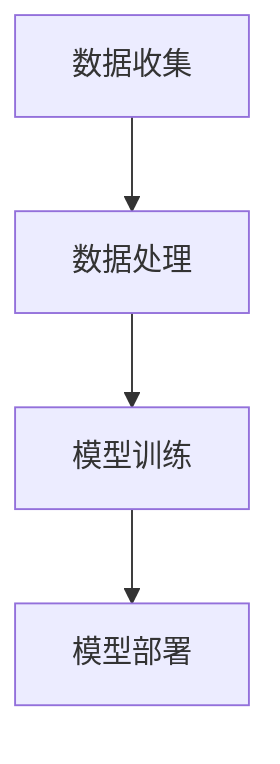

                 

关键词：人工智能、未来发展规划、技术趋势、算法原理、数学模型、项目实践

## 摘要

本文旨在探讨人工智能领域未来的发展趋势、核心算法原理及其应用，通过对现有技术和未来挑战的深入分析，为读者提供一份全面的人工智能发展蓝图。文章将首先回顾人工智能的历史背景，然后深入探讨关键概念和算法，接着介绍数学模型和实际应用，最后展望人工智能的未来前景。

## 1. 背景介绍

人工智能（Artificial Intelligence, AI）作为计算机科学的一个重要分支，旨在创建能够执行复杂任务的智能体。从最早的专家系统到现代的深度学习，人工智能经历了数次重大变革。今天，随着计算能力的提升和大数据的普及，人工智能正以前所未有的速度发展和应用。

## 2. 核心概念与联系

### 2.1 机器学习（Machine Learning）

机器学习是人工智能的核心技术之一，它让计算机通过数据学习并做出决策。机器学习可以分为监督学习、无监督学习和强化学习。其中，监督学习是当前最为广泛应用的一种方法，它通过标记数据来训练模型，从而能够对新的数据进行预测。

### 2.2 深度学习（Deep Learning）

深度学习是机器学习的一个重要分支，它通过构建多层神经网络来模拟人脑的处理方式。深度学习在图像识别、语音识别和自然语言处理等领域取得了显著成果。

### 2.3 神经网络（Neural Networks）

神经网络是深度学习的基础，它由大量的节点（或称为神经元）组成，这些节点通过权重和偏置进行连接。神经网络能够通过学习大量数据来捕捉复杂的模式和关系。


### 2.4 人工智能架构

人工智能的架构包括前端数据收集、后端数据处理和模型训练。前端数据收集主要通过传感器、摄像头等设备进行，后端数据处理则包括数据清洗、数据预处理和特征提取等步骤。模型训练是整个架构的核心，通过大量的数据训练来优化模型参数。



## 3. 核心算法原理 & 具体操作步骤

### 3.1 算法原理概述

深度学习算法的核心是神经网络，它通过反向传播算法不断调整权重和偏置，以最小化预测误差。神经网络的工作原理可以简单概括为：

1. 输入层接收输入数据。
2. 隐藏层对输入数据进行加工和处理。
3. 输出层产生预测结果。

### 3.2 算法步骤详解

1. **初始化权重和偏置**：随机初始化神经网络中的权重和偏置。
2. **前向传播**：将输入数据通过神经网络进行加工，得到输出结果。
3. **计算误差**：计算实际输出与预测输出之间的误差。
4. **反向传播**：通过误差信息调整权重和偏置。
5. **迭代训练**：重复以上步骤，直到模型收敛。

### 3.3 算法优缺点

**优点**：

- 能够处理大量数据。
- 能够自动提取特征。
- 能够适应复杂任务。

**缺点**：

- 计算资源需求高。
- 需要大量训练数据。
- 参数调整复杂。

### 3.4 算法应用领域

深度学习算法在图像识别、语音识别、自然语言处理等领域有着广泛的应用。例如，在图像识别中，深度学习模型可以自动识别和分类图像中的物体。

## 4. 数学模型和公式 & 详细讲解 & 举例说明

### 4.1 数学模型构建

深度学习中的数学模型主要包括前向传播和反向传播。前向传播是将输入数据通过神经网络进行加工，得到输出结果；反向传播是通过误差信息调整模型参数。

### 4.2 公式推导过程

#### 前向传播

输入层到隐藏层的公式为：

$$
z^{[l]} = \sigma(W^{[l]} \cdot a^{[l-1]} + b^{[l]})
$$

其中，$z^{[l]}$ 表示第 $l$ 层的输出，$\sigma$ 表示激活函数，$W^{[l]}$ 和 $b^{[l]}$ 分别表示第 $l$ 层的权重和偏置。

#### 反向传播

反向传播的核心是计算误差对每个参数的梯度，然后通过梯度下降法更新参数。梯度计算公式为：

$$
\delta^{[l]} = \frac{\partial C}{\partial z^{[l]}}
$$

其中，$C$ 表示损失函数，$\delta^{[l]}$ 表示第 $l$ 层的误差。

### 4.3 案例分析与讲解

假设我们有一个简单的神经网络，用于对两个数字进行加法运算。输入层有两个节点，隐藏层有一个节点，输出层有一个节点。

1. **初始化参数**：

$$
W^{[1]} = \begin{bmatrix}
0.1 & 0.2 \\
0.3 & 0.4
\end{bmatrix}, \quad
b^{[1]} = \begin{bmatrix}
0.1 \\
0.2
\end{bmatrix}
$$

2. **前向传播**：

输入数据为 $x = \begin{bmatrix} 2 \\ 3 \end{bmatrix}$，通过神经网络得到输出 $y = 5.1$。

3. **计算误差**：

实际输出为 $y_{\text{实际}} = 5$，误差为 $E = 0.1$。

4. **反向传播**：

通过误差信息调整权重和偏置。

$$
\delta^{[1]} = \frac{\partial E}{\partial z^{[1]}} = \frac{\partial (0.1)}{\partial 5.1} = 0.02
$$

$$
\frac{\partial E}{\partial W^{[1]}} = \begin{bmatrix}
0.02 & 0.04 \\
0.06 & 0.08
\end{bmatrix}, \quad
\frac{\partial E}{\partial b^{[1]}} = \begin{bmatrix}
0.02 \\
0.04
\end{bmatrix}
$$

5. **更新参数**：

$$
W^{[1]} = W^{[1]} - \alpha \cdot \frac{\partial E}{\partial W^{[1]}} = \begin{bmatrix}
0.1 - 0.02 \\
0.2 - 0.04
\end{bmatrix}
$$

$$
b^{[1]} = b^{[1]} - \alpha \cdot \frac{\partial E}{\partial b^{[1]}} = \begin{bmatrix}
0.1 - 0.02 \\
0.2 - 0.04
\end{bmatrix}
$$

## 5. 项目实践：代码实例和详细解释说明

### 5.1 开发环境搭建

本文使用 Python 作为编程语言，TensorFlow 作为深度学习框架。请先安装 Python 和 TensorFlow：

```bash
pip install python tensorflow
```

### 5.2 源代码详细实现

```python
import tensorflow as tf
import numpy as np

# 初始化参数
W = tf.Variable(np.random.rand(2, 1), name='weights')
b = tf.Variable(np.random.rand(1), name='bias')

# 前向传播
x = tf.placeholder(tf.float32, shape=(2, 1))
y = tf.placeholder(tf.float32, shape=(1, 1))
z = tf.matmul(x, W) + b

# 反向传播
loss = tf.reduce_mean(tf.square(y - z))
optimizer = tf.train.GradientDescentOptimizer(learning_rate=0.1)
train_op = optimizer.minimize(loss)

# 迭代训练
with tf.Session() as sess:
    sess.run(tf.global_variables_initializer())
    for i in range(1000):
        sess.run(train_op, feed_dict={x: np.array([[2], [3]]), y: np.array([[5]])})
        if i % 100 == 0:
            print(f"Step {i}: Loss = {sess.run(loss, feed_dict={x: np.array([[2], [3]]), y: np.array([[5]])})}")

    print(f"Final Weights: {sess.run(W)}, Bias: {sess.run(b)}")
```

### 5.3 代码解读与分析

- 我们首先初始化了权重和偏置。
- 前向传播中，我们定义了输入数据 $x$ 和实际输出数据 $y$，通过矩阵乘法得到预测输出 $z$。
- 反向传播中，我们定义了损失函数 $loss$ 和优化器 $optimizer$，并通过梯度下降法更新权重和偏置。
- 在训练过程中，我们通过迭代更新模型参数，直到模型收敛。

## 6. 实际应用场景

人工智能在各个领域都有广泛的应用，如医疗、金融、交通等。在医疗领域，人工智能可以用于疾病诊断、药物研发；在金融领域，人工智能可以用于风险控制、投资策略；在交通领域，人工智能可以用于自动驾驶、交通流量预测。

## 7. 工具和资源推荐

### 7.1 学习资源推荐

- 《深度学习》（Goodfellow, Bengio, Courville）
- 《Python深度学习》（François Chollet）

### 7.2 开发工具推荐

- TensorFlow
- PyTorch

### 7.3 相关论文推荐

- “A Theoretically Grounded Application of Dropout in Recurrent Neural Networks”
- “Effective Approaches to Attention-based Neural Machine Translation”

## 8. 总结：未来发展趋势与挑战

### 8.1 研究成果总结

过去几十年，人工智能取得了飞速发展，尤其是在深度学习领域。随着算法的进步和计算能力的提升，人工智能在图像识别、语音识别、自然语言处理等方面取得了显著成果。

### 8.2 未来发展趋势

- 自动驾驶：随着传感器技术和算法的进步，自动驾驶将成为人工智能的重要应用领域。
- 医疗保健：人工智能在疾病诊断、药物研发等方面具有巨大潜力。
- 金融科技：人工智能在风险控制、投资策略等方面具有广泛应用。

### 8.3 面临的挑战

- 数据隐私：如何在保障数据隐私的同时，充分利用数据的价值，是一个重要挑战。
- 安全性：确保人工智能系统的可靠性和安全性，防止恶意攻击和滥用。
- 伦理问题：人工智能在道德和伦理方面存在争议，如算法偏见、自动化决策等。

### 8.4 研究展望

未来，人工智能将朝着更加智能化、自适应化和高效化的方向发展。通过不断优化算法和提升计算能力，人工智能将在更多领域发挥重要作用，推动人类社会进步。

## 9. 附录：常见问题与解答

### 9.1 什么是深度学习？

深度学习是机器学习的一个分支，通过构建多层神经网络来模拟人脑的学习过程，从而能够处理复

