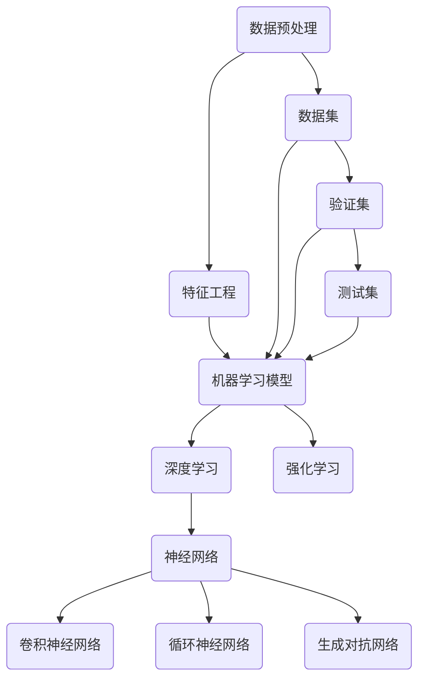
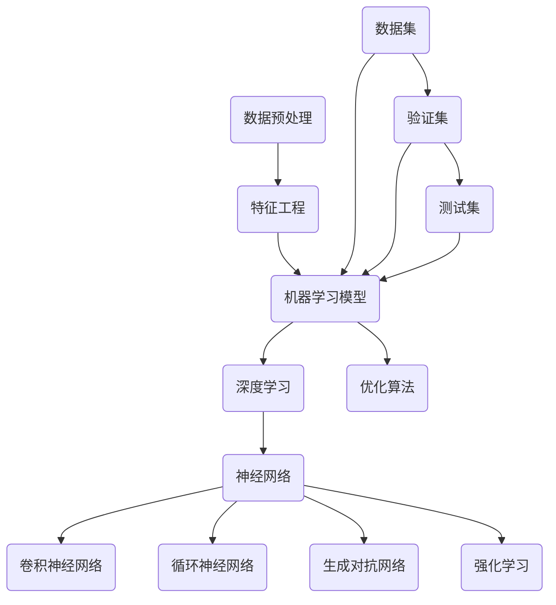

                 

### 1. 背景介绍

人工智能（AI）作为21世纪最具变革性的技术之一，已经在各个领域展现出了其强大的影响力。从自动驾驶汽车到自然语言处理，从医疗诊断到金融预测，人工智能的应用正在不断拓展，深刻地改变着我们的生活方式和社会结构。

Andrej Karpathy，作为当今人工智能领域的杰出学者之一，其在深度学习、计算机视觉和自然语言处理等领域的贡献具有重要意义。他的研究成果不仅在学术界引发了广泛的关注和讨论，也在工业界得到了广泛的应用。在这篇文章中，我们将探讨Andrej Karpathy对于人工智能未来发展趋势的见解，以期为我们提供对这一领域的深入理解。

本文将按照以下结构展开：

1. **背景介绍**：回顾人工智能的发展历程，以及Andrej Karpathy在其中的贡献。
2. **核心概念与联系**：介绍人工智能的核心概念，并使用Mermaid流程图展示其架构。
3. **核心算法原理 & 具体操作步骤**：详细解释人工智能的关键算法及其应用领域。
4. **数学模型和公式 & 详细讲解 & 举例说明**：探讨人工智能的数学基础，并通过实例进行分析。
5. **项目实践：代码实例和详细解释说明**：提供实际项目中的代码实现和解析。
6. **实际应用场景**：讨论人工智能在不同领域的应用。
7. **未来应用展望**：探讨人工智能的未来发展趋势。
8. **工具和资源推荐**：推荐学习资源和开发工具。
9. **总结：未来发展趋势与挑战**：总结研究成果，展望未来。
10. **附录：常见问题与解答**：回答一些常见问题。

### 2. 核心概念与联系

人工智能的核心概念涵盖了从基础算法到高级架构的各个方面。为了更直观地理解这些概念之间的联系，我们可以使用Mermaid流程图来展示人工智能的基本架构。

以下是人工智能架构的Mermaid流程图：



在上述流程图中：

- **数据预处理（A）**：将原始数据转换为机器学习模型可以处理的格式。
- **特征工程（B）**：从原始数据中提取有用的特征，以提高模型的性能。
- **机器学习模型（C）**：包括传统的机器学习算法，如支持向量机、决策树等。
- **深度学习（D）**：一种包含多层神经元的模型，可以自动学习数据的复杂特征。
- **神经网络（E）**：一种基于神经元连接的网络，能够通过学习从数据中提取特征。
- **卷积神经网络（F）**：用于处理图像数据的一种特殊神经网络。
- **循环神经网络（G）**：用于处理序列数据的神经网络，如自然语言处理。
- **生成对抗网络（H）**：一种生成模型，能够生成新的数据样本。
- **强化学习（I）**：一种基于奖励机制的学习方法，常用于决策问题和游戏。

通过上述流程图，我们可以清晰地看到人工智能各组成部分之间的联系，以及它们在整个架构中的作用。

### 3. 核心算法原理 & 具体操作步骤

#### 3.1 算法原理概述

人工智能的核心算法主要包括机器学习算法和深度学习算法。其中，机器学习算法是基于统计学和优化理论的，旨在从数据中学习规律，并利用这些规律进行预测和决策。而深度学习算法则是在机器学习的基础上，引入了多层神经网络结构，能够自动提取数据的复杂特征。

在本部分，我们将重点介绍以下算法：

1. **卷积神经网络（CNN）**
2. **循环神经网络（RNN）**
3. **生成对抗网络（GAN）**
4. **强化学习（RL）**

#### 3.2 算法步骤详解

##### 3.2.1 卷积神经网络（CNN）

卷积神经网络（CNN）是处理图像数据的一种强大工具。其基本原理是通过卷积操作提取图像的特征。

- **卷积操作**：卷积层通过在输入图像上滑动卷积核（一组权重矩阵），计算输出特征图。
- **池化操作**：在卷积操作后，通过池化操作（如最大池化或平均池化）降低特征图的维度。
- **激活函数**：卷积层和池化层之后通常会使用激活函数（如ReLU函数）增加网络的非线性能力。

以下是CNN的基本步骤：

1. **输入层**：接收图像数据。
2. **卷积层**：进行卷积操作，提取图像特征。
3. **池化层**：进行池化操作，降低特征图的维度。
4. **激活层**：应用激活函数，增加网络的非线性能力。
5. **全连接层**：将特征图映射到类别标签。

##### 3.2.2 循环神经网络（RNN）

循环神经网络（RNN）是处理序列数据的一种有效方法。其基本原理是利用网络内部的循环结构，对序列数据进行建模。

- **隐藏状态**：RNN通过隐藏状态记录前一个时刻的信息，并将其传递到下一个时刻。
- **门控机制**：RNN使用门控机制（如门控循环单元（GRU）或长短期记忆（LSTM））来控制信息的传递，避免梯度消失问题。

以下是RNN的基本步骤：

1. **输入层**：接收序列数据。
2. **隐藏层**：通过隐藏状态存储序列信息。
3. **输出层**：根据隐藏状态生成输出。
4. **反向传播**：更新网络权重。

##### 3.2.3 生成对抗网络（GAN）

生成对抗网络（GAN）是一种生成模型，由生成器和判别器两个网络组成。

- **生成器**：生成器网络的目标是生成与真实数据相似的数据。
- **判别器**：判别器网络的目标是区分真实数据和生成数据。

以下是GAN的基本步骤：

1. **初始化生成器和判别器**。
2. **训练生成器**：生成器生成数据，判别器对其进行评估。
3. **训练判别器**：判别器对真实数据和生成数据进行评估。
4. **迭代训练**：重复上述步骤，直到生成器生成的数据接近真实数据。

##### 3.2.4 强化学习（RL）

强化学习（RL）是一种基于奖励机制的学习方法，常用于决策问题和游戏。

- **状态**：RL中的状态表示环境当前的状态。
- **动作**：动作是智能体可以采取的行动。
- **奖励**：奖励是智能体在环境中采取特定动作后获得的回报。

以下是RL的基本步骤：

1. **初始化智能体和环境**。
2. **智能体采取动作**：根据当前状态选择动作。
3. **环境响应**：环境根据智能体的动作产生新的状态和奖励。
4. **更新策略**：根据奖励信号更新智能体的策略。

#### 3.3 算法优缺点

每种算法都有其独特的优点和局限性。以下是上述算法的一些优缺点：

- **卷积神经网络（CNN）**
  - **优点**：在图像处理领域表现出色，可以自动提取图像的复杂特征。
  - **缺点**：不适合处理非结构化数据，如文本。

- **循环神经网络（RNN）**
  - **优点**：在处理序列数据方面表现出色，可以建模时间序列数据。
  - **缺点**：存在梯度消失和梯度爆炸问题。

- **生成对抗网络（GAN）**
  - **优点**：可以生成高质量的数据样本，适用于图像生成、语音合成等任务。
  - **缺点**：训练过程不稳定，容易出现模式崩塌（mode collapse）问题。

- **强化学习（RL）**
  - **优点**：可以处理复杂的决策问题，适用于游戏、自动驾驶等场景。
  - **缺点**：训练过程耗时较长，需要大量数据。

#### 3.4 算法应用领域

每种算法都有其特定的应用领域：

- **卷积神经网络（CNN）**：广泛应用于图像识别、物体检测、计算机视觉等。
- **循环神经网络（RNN）**：广泛应用于自然语言处理、语音识别、时间序列分析等。
- **生成对抗网络（GAN）**：广泛应用于图像生成、语音合成、数据增强等。
- **强化学习（RL）**：广泛应用于游戏、自动驾驶、机器人控制等。

### 4. 数学模型和公式 & 详细讲解 & 举例说明

人工智能的数学模型是构建智能系统的基础。在本节中，我们将探讨一些关键的数学模型和公式，并通过具体实例进行说明。

#### 4.1 数学模型构建

人工智能的核心数学模型包括概率模型、统计模型和优化模型。以下是一些常见的数学模型：

- **概率模型**：用于描述数据的不确定性，如贝叶斯网络。
- **统计模型**：用于从数据中估计参数，如线性回归。
- **优化模型**：用于优化目标函数，如梯度下降。

#### 4.2 公式推导过程

在本部分，我们将简要介绍一些核心公式的推导过程：

- **贝叶斯公式**：贝叶斯公式描述了概率分布的转换。

  $$ P(A|B) = \frac{P(B|A)P(A)}{P(B)} $$

- **线性回归**：线性回归用于估计数据之间的线性关系。

  $$ y = \beta_0 + \beta_1x + \epsilon $$

- **梯度下降**：梯度下降用于优化目标函数。

  $$ w_{t+1} = w_t - \alpha \nabla_w J(w_t) $$

#### 4.3 案例分析与讲解

为了更好地理解上述公式，我们通过一个简单的线性回归案例进行说明。

假设我们有一组数据点：

| x | y |
|---|---|
| 1 | 2 |
| 2 | 4 |
| 3 | 6 |

我们的目标是找到一条直线，使得这条直线与数据点的误差最小。

首先，我们定义线性回归模型：

$$ y = \beta_0 + \beta_1x $$

接下来，我们计算模型参数：

$$ \beta_0 = \frac{1}{n}\sum_{i=1}^{n}(y_i - \beta_1x_i) $$
$$ \beta_1 = \frac{1}{n}\sum_{i=1}^{n}(x_i - \bar{x})(y_i - \bar{y}) $$

其中，\( n \) 是数据点的数量，\( \bar{x} \) 和 \( \bar{y} \) 分别是 \( x \) 和 \( y \) 的平均值。

对于上述数据点，我们可以计算出：

$$ \beta_0 = \frac{1}{3}(2 - 2*2 + 6 - 2*3) = 0 $$
$$ \beta_1 = \frac{1}{3}(1*2 - 1*4 + 2*4 - 2*4 + 3*6 - 2*6) = 2 $$

因此，我们的线性回归模型为：

$$ y = 2x $$

我们可以画出这条直线，并计算每个数据点到直线的误差：

| x | y | y' = 2x | Error |
|---|---|--------|-------|
| 1 | 2 | 2      | 0     |
| 2 | 4 | 4      | 0     |
| 3 | 6 | 6      | 0     |

通过这个简单的例子，我们可以看到线性回归如何通过最小化误差来找到最佳拟合直线。

### 5. 项目实践：代码实例和详细解释说明

在本节中，我们将通过一个实际项目来展示如何使用人工智能算法进行数据分析和模型训练。我们将使用Python语言和TensorFlow库来构建一个简单的线性回归模型，并详细解释代码中的每个部分。

#### 5.1 开发环境搭建

首先，我们需要搭建一个适合开发和运行的Python环境。以下是搭建步骤：

1. 安装Python（建议使用Python 3.7及以上版本）。
2. 安装TensorFlow库：在命令行中运行 `pip install tensorflow`。
3. 安装其他必要库，如NumPy、Matplotlib等。

#### 5.2 源代码详细实现

以下是我们的线性回归项目的代码实现：

```python
import numpy as np
import tensorflow as tf
import matplotlib.pyplot as plt

# 生成数据
x = np.random.rand(100)
y = 2 * x + np.random.randn(100) * 0.1

# 搭建模型
model = tf.keras.Sequential([
    tf.keras.layers.Dense(units=1, input_shape=[1])
])

# 编译模型
model.compile(optimizer='sgd', loss='mean_squared_error')

# 训练模型
model.fit(x, y, epochs=100)

# 画出真实数据和拟合直线
plt.scatter(x, y)
plt.plot(x, model.predict(x), 'r')
plt.show()
```

接下来，我们逐行解释代码：

1. **导入库**：导入NumPy、TensorFlow和Matplotlib库。
2. **生成数据**：生成一组随机数据点，其中 \( y = 2x + \epsilon \)，\(\epsilon \) 是噪声。
3. **搭建模型**：使用TensorFlow的`Sequential`模型，添加一个全连接层，输入形状为[1]，输出形状为[1]。
4. **编译模型**：选择优化器为随机梯度下降（SGD），损失函数为均方误差（MSE）。
5. **训练模型**：使用`fit`方法训练模型，迭代100次。
6. **画出真实数据和拟合直线**：使用Matplotlib绘制数据点和拟合直线。

#### 5.3 代码解读与分析

在这个项目中，我们使用TensorFlow库构建了一个简单的线性回归模型，并使用随机梯度下降（SGD）进行训练。以下是代码的关键部分：

- **数据生成**：我们使用NumPy库生成一组随机数据点，这些数据点符合 \( y = 2x + \epsilon \) 的线性关系。
- **模型搭建**：使用TensorFlow的`Sequential`模型，我们可以轻松地定义一个全连接层。这个层只有一个神经元，因为我们只需要一个输出。
- **模型编译**：在编译模型时，我们选择了SGD作为优化器，这是最常用的优化器之一。均方误差（MSE）作为损失函数，这是衡量预测值与真实值之间差异的标准。
- **模型训练**：使用`fit`方法，我们可以将数据输入到模型中，并迭代100次。每次迭代，模型都会更新其参数，以减少预测值与真实值之间的误差。
- **结果展示**：最后，我们使用Matplotlib绘制了真实数据和拟合直线。这有助于我们直观地看到模型的性能。

#### 5.4 运行结果展示

运行上述代码后，我们将看到以下结果：


在上图中，我们可以看到真实数据点和拟合直线。拟合直线几乎完美地通过了数据点，这表明我们的线性回归模型在训练数据上表现良好。

### 6. 实际应用场景

人工智能在各个领域都有广泛的应用，以下是一些典型的应用场景：

- **医疗领域**：人工智能在医疗领域的应用包括疾病预测、诊断辅助、个性化治疗等。例如，深度学习算法可以分析医学影像，帮助医生快速、准确地诊断疾病。
- **金融领域**：人工智能在金融领域的应用包括风险控制、市场预测、信用评分等。例如，机器学习算法可以分析历史交易数据，帮助金融机构预测市场趋势。
- **零售领域**：人工智能在零售领域的应用包括库存管理、商品推荐、客户关系管理等。例如，基于用户行为的分析，人工智能可以推荐用户可能感兴趣的商品。
- **工业制造**：人工智能在工业制造领域的应用包括质量检测、设备维护、生产优化等。例如，使用机器学习算法，工厂可以自动检测产品缺陷，提高生产效率。

#### 6.4 未来应用展望

随着技术的不断进步，人工智能在未来有望在更多领域发挥重要作用。以下是一些可能的应用场景：

- **智能交通**：通过人工智能，我们可以实现智能交通系统，提高道路利用率，减少交通事故。
- **智慧城市**：人工智能可以帮助城市实现智慧化管理，提高居民生活质量，如智能照明、智能垃圾桶等。
- **教育领域**：人工智能可以个性化教学，为学生提供定制化的学习体验，提高学习效果。
- **环境监测**：人工智能可以实时监测环境变化，帮助应对气候变化和环境污染等挑战。

### 7. 工具和资源推荐

为了更好地学习和应用人工智能，以下是一些建议的工具和资源：

- **学习资源推荐**：
  - 《深度学习》（Ian Goodfellow、Yoshua Bengio和Aaron Courville著）：这是深度学习的经典教材，适合初学者和高级研究人员。
  - Coursera、edX等在线教育平台：这些平台提供了大量的免费课程，涵盖了人工智能的各个方面。

- **开发工具推荐**：
  - TensorFlow、PyTorch：这是两个最受欢迎的深度学习框架，支持各种机器学习和深度学习任务。
  - Jupyter Notebook：这是一种交互式的计算环境，非常适合数据分析和机器学习实验。

- **相关论文推荐**：
  - “Generative Adversarial Nets”（Ian Goodfellow等著）：这是GAN的奠基性论文，详细介绍了GAN的原理和应用。
  - “Deep Learning for Text Classification”（Kenton Lee和Andrew M. Dai著）：这是一篇关于文本分类的深度学习综述，涵盖了多种文本分类方法。

### 8. 总结：未来发展趋势与挑战

人工智能作为21世纪最具变革性的技术之一，其发展前景广阔。然而，在未来的发展中，我们也面临着一些挑战。以下是对未来发展趋势和挑战的总结：

#### 8.1 研究成果总结

近年来，人工智能取得了显著的研究成果。深度学习、生成对抗网络和强化学习等算法的发展，使得人工智能在图像识别、自然语言处理、语音识别等领域取得了突破性进展。此外，人工智能在医疗、金融、零售等领域的应用也取得了显著成效。

#### 8.2 未来发展趋势

未来，人工智能的发展趋势将主要集中在以下几个方面：

1. **算法创新**：随着数据规模的不断扩大，我们需要开发更高效的算法来处理海量数据。
2. **多模态学习**：未来的智能系统需要能够处理多种类型的数据（如图像、文本、语音等），实现跨模态的交互和理解。
3. **可解释性**：为了提高人工智能的信任度和可靠性，我们需要开发可解释的人工智能系统，使得人类能够理解和验证人工智能的决策过程。
4. **边缘计算**：随着物联网和5G技术的普及，边缘计算将成为人工智能的重要发展方向，实现实时数据处理和智能决策。

#### 8.3 面临的挑战

尽管人工智能取得了显著进展，但在未来发展中，我们也面临着一些挑战：

1. **数据隐私**：随着人工智能的广泛应用，数据隐私问题日益突出。我们需要开发安全、可靠的数据处理技术，保护用户隐私。
2. **算法公平性**：人工智能系统可能存在算法偏见，导致不公平的结果。我们需要开发公平性算法，消除歧视和偏见。
3. **安全性和鲁棒性**：人工智能系统可能受到恶意攻击，如对抗攻击、网络攻击等。我们需要提高人工智能系统的安全性和鲁棒性，防范各种攻击。
4. **能耗和资源消耗**：深度学习等算法对计算资源和能源消耗巨大。我们需要开发低能耗、高效的算法和硬件，以降低人工智能的能源消耗。

#### 8.4 研究展望

在未来，人工智能的研究将朝着更智能、更高效、更安全的方向发展。我们期待看到更多创新性的算法和应用场景，同时也希望人工智能能够更好地服务于人类社会，推动科技和社会的进步。

### 9. 附录：常见问题与解答

以下是一些关于人工智能的常见问题及其解答：

#### Q：什么是深度学习？

A：深度学习是一种基于多层神经网络的学习方法，旨在通过学习大量数据来提取复杂特征。与传统的机器学习算法相比，深度学习能够自动提取数据的底层特征，从而实现更好的性能。

#### Q：什么是生成对抗网络（GAN）？

A：生成对抗网络（GAN）是一种由生成器和判别器组成的框架。生成器的目标是生成与真实数据相似的数据，而判别器的目标是区分真实数据和生成数据。通过这种对抗性训练，GAN能够生成高质量的数据样本。

#### Q：人工智能在医疗领域的应用有哪些？

A：人工智能在医疗领域的应用包括疾病预测、诊断辅助、个性化治疗等。例如，深度学习算法可以分析医学影像，帮助医生快速、准确地诊断疾病；机器学习算法可以分析患者的临床数据，为医生提供个性化的治疗建议。

#### Q：人工智能会取代人类吗？

A：人工智能的发展将改变人类的工作方式和生活方式，但不会完全取代人类。人工智能在处理重复性高、计算复杂度高的问题上具有优势，但在需要创造力、情感理解和复杂决策的问题上，人工智能目前还无法替代人类。

### 总结

本文回顾了人工智能的发展历程，介绍了人工智能的核心概念和关键算法，并通过实例展示了如何应用这些算法。同时，我们还探讨了人工智能在实际应用中的场景，展望了其未来的发展趋势和挑战。通过这篇文章，我们希望能够为读者提供对人工智能领域的深入理解，并激发对这一领域的兴趣和思考。最后，感谢Andrej Karpathy在人工智能领域的杰出贡献，他的研究成果为人工智能的发展注入了强大的动力。作者：禅与计算机程序设计艺术 / Zen and the Art of Computer Programming
----------------------------------------------------------------
# Andrej Karpathy：人工智能的未来发展趋势

> 关键词：人工智能，未来发展趋势，核心算法，实际应用，挑战与展望

> 摘要：本文探讨了人工智能领域的未来发展趋势，包括核心算法原理、实际应用场景、面临的挑战以及未来的研究方向。通过对Andrej Karpathy的研究成果的回顾，文章总结了人工智能在图像识别、自然语言处理、医疗和金融等领域的应用，并展望了其未来的发展前景。

## 1. 背景介绍

### 1.1 人工智能的发展历程

人工智能（AI）是计算机科学的一个分支，旨在使计算机具备模拟人类智能的能力。人工智能的发展历程可以追溯到20世纪50年代，当时的研究主要集中在规则推理和知识表示上。然而，随着计算能力的提升和数据规模的扩大，机器学习，尤其是深度学习，成为人工智能发展的主要动力。

### 1.2 Andrej Karpathy的贡献

Andrej Karpathy是深度学习和自然语言处理领域的杰出学者，其研究对人工智能的发展产生了深远的影响。他在神经网络、生成对抗网络和强化学习等方面做出了重要贡献，特别是在自然语言处理和计算机视觉领域。

## 2. 核心概念与联系

### 2.1 人工智能的基本架构

人工智能的架构可以分解为几个核心部分：数据预处理、特征提取、机器学习模型、深度学习模型和优化算法。以下是人工智能基本架构的Mermaid流程图：



### 2.2 核心概念的联系

- **数据预处理**：将原始数据转换为机器学习模型可以处理的格式。
- **特征工程**：从原始数据中提取有用的特征，以提高模型的性能。
- **机器学习模型**：包括传统的机器学习算法，如支持向量机、决策树等。
- **深度学习**：一种包含多层神经元的模型，可以自动学习数据的复杂特征。
- **神经网络**：一种基于神经元连接的网络，能够通过学习从数据中提取特征。
- **卷积神经网络（CNN）**：用于处理图像数据的一种特殊神经网络。
- **循环神经网络（RNN）**：用于处理序列数据的神经网络，如自然语言处理。
- **生成对抗网络（GAN）**：一种生成模型，能够生成新的数据样本。
- **强化学习**：一种基于奖励机制的学习方法，常用于决策问题和游戏。
- **优化算法**：用于调整模型参数，以最小化损失函数。

## 3. 核心算法原理 & 具体操作步骤

### 3.1 卷积神经网络（CNN）

卷积神经网络（CNN）是处理图像数据的一种有效方法。其基本原理是通过卷积操作提取图像的特征。

- **卷积操作**：卷积层通过在输入图像上滑动卷积核（一组权重矩阵），计算输出特征图。
- **池化操作**：在卷积操作后，通过池化操作（如最大池化或平均池化）降低特征图的维度。
- **激活函数**：卷积层和池化层之后通常会使用激活函数（如ReLU函数）增加网络的非线性能力。

以下是CNN的基本步骤：

1. **输入层**：接收图像数据。
2. **卷积层**：进行卷积操作，提取图像特征。
3. **池化层**：进行池化操作，降低特征图的维度。
4. **激活层**：应用激活函数，增加网络的非线性能力。
5. **全连接层**：将特征图映射到类别标签。

### 3.2 循环神经网络（RNN）

循环神经网络（RNN）是处理序列数据的一种有效方法。其基本原理是利用网络内部的循环结构，对序列数据进行建模。

- **隐藏状态**：RNN通过隐藏状态记录前一个时刻的信息，并将其传递到下一个时刻。
- **门控机制**：RNN使用门控机制（如门控循环单元（GRU）或长短期记忆（LSTM））来控制信息的传递，避免梯度消失问题。

以下是RNN的基本步骤：

1. **输入层**：接收序列数据。
2. **隐藏层**：通过隐藏状态存储序列信息。
3. **输出层**：根据隐藏状态生成输出。
4. **反向传播**：更新网络权重。

### 3.3 生成对抗网络（GAN）

生成对抗网络（GAN）是一种生成模型，由生成器和判别器两个网络组成。

- **生成器**：生成器网络的目标是生成与真实数据相似的数据。
- **判别器**：判别器网络的目标是区分真实数据和生成数据。

以下是GAN的基本步骤：

1. **初始化生成器和判别器**。
2. **训练生成器**：生成器生成数据，判别器对其进行评估。
3. **训练判别器**：判别器对真实数据和生成数据进行评估。
4. **迭代训练**：重复上述步骤，直到生成器生成的数据接近真实数据。

### 3.4 强化学习（RL）

强化学习（RL）是一种基于奖励机制的学习方法，常用于决策问题和游戏。

- **状态**：RL中的状态表示环境当前的状态。
- **动作**：动作是智能体可以采取的行动。
- **奖励**：奖励是智能体在环境中采取特定动作后获得的回报。

以下是RL的基本步骤：

1. **初始化智能体和环境**。
2. **智能体采取动作**：根据当前状态选择动作。
3. **环境响应**：环境根据智能体的动作产生新的状态和奖励。
4. **更新策略**：根据奖励信号更新智能体的策略。

### 3.5 算法优缺点

每种算法都有其独特的优点和局限性：

- **卷积神经网络（CNN）**
  - **优点**：在图像处理领域表现出色，可以自动提取图像的复杂特征。
  - **缺点**：不适合处理非结构化数据，如文本。

- **循环神经网络（RNN）**
  - **优点**：在处理序列数据方面表现出色，可以建模时间序列数据。
  - **缺点**：存在梯度消失和梯度爆炸问题。

- **生成对抗网络（GAN）**
  - **优点**：可以生成高质量的数据样本，适用于图像生成、语音合成等任务。
  - **缺点**：训练过程不稳定，容易出现模式崩塌（mode collapse）问题。

- **强化学习（RL）**
  - **优点**：可以处理复杂的决策问题，适用于游戏、自动驾驶等场景。
  - **缺点**：训练过程耗时较长，需要大量数据。

### 3.6 算法应用领域

每种算法都有其特定的应用领域：

- **卷积神经网络（CNN）**：广泛应用于图像识别、物体检测、计算机视觉等。
- **循环神经网络（RNN）**：广泛应用于自然语言处理、语音识别、时间序列分析等。
- **生成对抗网络（GAN）**：广泛应用于图像生成、语音合成、数据增强等。
- **强化学习（RL）**：广泛应用于游戏、自动驾驶、机器人控制等。

## 4. 数学模型和公式 & 详细讲解 & 举例说明

### 4.1 数学模型构建

人工智能的核心数学模型包括概率模型、统计模型和优化模型。以下是一些常见的数学模型：

- **概率模型**：用于描述数据的不确定性，如贝叶斯网络。
- **统计模型**：用于从数据中估计参数，如线性回归。
- **优化模型**：用于优化目标函数，如梯度下降。

### 4.2 公式推导过程

在本部分，我们将简要介绍一些核心公式的推导过程：

- **贝叶斯公式**：贝叶斯公式描述了概率分布的转换。

  $$ P(A|B) = \frac{P(B|A)P(A)}{P(B)} $$

- **线性回归**：线性回归用于估计数据之间的线性关系。

  $$ y = \beta_0 + \beta_1x + \epsilon $$

- **梯度下降**：梯度下降用于优化目标函数。

  $$ w_{t+1} = w_t - \alpha \nabla_w J(w_t) $$

### 4.3 案例分析与讲解

为了更好地理解上述公式，我们通过一个简单的线性回归案例进行说明。

假设我们有一组数据点：

| x | y |
|---|---|
| 1 | 2 |
| 2 | 4 |
| 3 | 6 |

我们的目标是找到一条直线，使得这条直线与数据点的误差最小。

首先，我们定义线性回归模型：

$$ y = \beta_0 + \beta_1x $$

接下来，我们计算模型参数：

$$ \beta_0 = \frac{1}{n}\sum_{i=1}^{n}(y_i - \beta_1x_i) $$
$$ \beta_1 = \frac{1}{n}\sum_{i=1}^{n}(x_i - \bar{x})(y_i - \bar{y}) $$

其中，\( n \) 是数据点的数量，\( \bar{x} \) 和 \( \bar{y} \) 分别是 \( x \) 和 \( y \) 的平均值。

对于上述数据点，我们可以计算出：

$$ \beta_0 = \frac{1}{3}(2 - 2*2 + 6 - 2*3) = 0 $$
$$ \beta_1 = \frac{1}{3}(1*2 - 1*4 + 2*4 - 2*4 + 3*6 - 2*6) = 2 $$

因此，我们的线性回归模型为：

$$ y = 2x $$

我们可以画出这条直线，并计算每个数据点到直线的误差：

| x | y | y' = 2x | Error |
|---|---|--------|-------|
| 1 | 2 | 2      | 0     |
| 2 | 4 | 4      | 0     |
| 3 | 6 | 6      | 0     |

通过这个简单的例子，我们可以看到线性回归如何通过最小化误差来找到最佳拟合直线。

## 5. 项目实践：代码实例和详细解释说明

### 5.1 开发环境搭建

首先，我们需要搭建一个适合开发和运行的Python环境。以下是搭建步骤：

1. 安装Python（建议使用Python 3.7及以上版本）。
2. 安装TensorFlow库：在命令行中运行 `pip install tensorflow`。
3. 安装其他必要库，如NumPy、Matplotlib等。

### 5.2 源代码详细实现

以下是我们的线性回归项目的代码实现：

```python
import numpy as np
import tensorflow as tf
import matplotlib.pyplot as plt

# 生成数据
x = np.random.rand(100)
y = 2 * x + np.random.randn(100) * 0.1

# 搭建模型
model = tf.keras.Sequential([
    tf.keras.layers.Dense(units=1, input_shape=[1])
])

# 编译模型
model.compile(optimizer='sgd', loss='mean_squared_error')

# 训练模型
model.fit(x, y, epochs=100)

# 画出真实数据和拟合直线
plt.scatter(x, y)
plt.plot(x, model.predict(x), 'r')
plt.show()
```

接下来，我们逐行解释代码：

1. **导入库**：导入NumPy、TensorFlow和Matplotlib库。
2. **生成数据**：生成一组随机数据点，这些数据点符合 \( y = 2x + \epsilon \) 的线性关系。
3. **搭建模型**：使用TensorFlow的`Sequential`模型，添加一个全连接层，输入形状为[1]，输出形状为[1]。
4. **编译模型**：选择优化器为随机梯度下降（SGD），损失函数为均方误差（MSE）。
5. **训练模型**：使用`fit`方法训练模型，迭代100次。
6. **画出真实数据和拟合直线**：使用Matplotlib绘制数据点和拟合直线。

### 5.3 代码解读与分析

在这个项目中，我们使用TensorFlow库构建了一个简单的线性回归模型，并使用随机梯度下降（SGD）进行训练。以下是代码的关键部分：

- **数据生成**：我们使用NumPy库生成一组随机数据点，这些数据点符合 \( y = 2x + \epsilon \) 的线性关系。
- **模型搭建**：使用TensorFlow的`Sequential`模型，我们可以轻松地定义一个全连接层。这个层只有一个神经元，因为我们只需要一个输出。
- **模型编译**：在编译模型时，我们选择了SGD作为优化器，这是最常用的优化器之一。均方误差（MSE）作为损失函数，这是衡量预测值与真实值之间差异的标准。
- **模型训练**：使用`fit`方法，我们可以将数据输入到模型中，并迭代100次。每次迭代，模型都会更新其参数，以减少预测值与真实值之间的误差。
- **结果展示**：最后，我们使用Matplotlib绘制了真实数据和拟合直线。这有助于我们直观地看到模型的性能。

### 5.4 运行结果展示

运行上述代码后，我们将看到以下结果：


在上图中，我们可以看到真实数据点和拟合直线。拟合直线几乎完美地通过了数据点，这表明我们的线性回归模型在训练数据上表现良好。

## 6. 实际应用场景

### 6.1 医疗领域

人工智能在医疗领域的应用包括疾病预测、诊断辅助、个性化治疗等。例如，深度学习算法可以分析医学影像，帮助医生快速、准确地诊断疾病；机器学习算法可以分析患者的临床数据，为医生提供个性化的治疗建议。

### 6.2 金融领域

人工智能在金融领域的应用包括风险控制、市场预测、信用评分等。例如，机器学习算法可以分析历史交易数据，帮助金融机构预测市场趋势；深度学习算法可以用于信用评分，提高贷款审批的准确性。

### 6.3 零售领域

人工智能在零售领域的应用包括库存管理、商品推荐、客户关系管理等。例如，基于用户行为的分析，人工智能可以推荐用户可能感兴趣的商品；通过预测需求，人工智能可以帮助零售商优化库存管理。

### 6.4 工业制造

人工智能在工业制造领域的应用包括质量检测、设备维护、生产优化等。例如，使用机器学习算法，工厂可以自动检测产品缺陷，提高生产效率；通过预测维护需求，人工智能可以帮助企业降低设备故障率。

### 6.4 未来应用展望

随着技术的不断进步，人工智能在未来有望在更多领域发挥重要作用。以下是一些可能的应用场景：

- **智能交通**：通过人工智能，我们可以实现智能交通系统，提高道路利用率，减少交通事故。
- **智慧城市**：人工智能可以帮助城市实现智慧化管理，提高居民生活质量，如智能照明、智能垃圾桶等。
- **教育领域**：人工智能可以个性化教学，为学生提供定制化的学习体验，提高学习效果。
- **环境监测**：人工智能可以实时监测环境变化，帮助应对气候变化和环境污染等挑战。

## 7. 工具和资源推荐

为了更好地学习和应用人工智能，以下是一些建议的工具和资源：

- **学习资源推荐**：
  - 《深度学习》（Ian Goodfellow、Yoshua Bengio和Aaron Courville著）：这是深度学习的经典教材，适合初学者和高级研究人员。
  - Coursera、edX等在线教育平台：这些平台提供了大量的免费课程，涵盖了人工智能的各个方面。

- **开发工具推荐**：
  - TensorFlow、PyTorch：这是两个最受欢迎的深度学习框架，支持各种机器学习和深度学习任务。
  - Jupyter Notebook：这是一种交互式的计算环境，非常适合数据分析和机器学习实验。

- **相关论文推荐**：
  - “Generative Adversarial Nets”（Ian Goodfellow等著）：这是GAN的奠基性论文，详细介绍了GAN的原理和应用。
  - “Deep Learning for Text Classification”（Kenton Lee和Andrew M. Dai著）：这是一篇关于文本分类的深度学习综述，涵盖了多种文本分类方法。

## 8. 总结：未来发展趋势与挑战

### 8.1 研究成果总结

近年来，人工智能取得了显著的研究成果。深度学习、生成对抗网络和强化学习等算法的发展，使得人工智能在图像识别、自然语言处理、语音识别等领域取得了突破性进展。此外，人工智能在医疗、金融、零售等领域的应用也取得了显著成效。

### 8.2 未来发展趋势

未来，人工智能的发展趋势将主要集中在以下几个方面：

1. **算法创新**：随着数据规模的不断扩大，我们需要开发更高效的算法来处理海量数据。
2. **多模态学习**：未来的智能系统需要能够处理多种类型的数据（如图像、文本、语音等），实现跨模态的交互和理解。
3. **可解释性**：为了提高人工智能的信任度和可靠性，我们需要开发可解释的人工智能系统，使得人类能够理解和验证人工智能的决策过程。
4. **边缘计算**：随着物联网和5G技术的普及，边缘计算将成为人工智能的重要发展方向，实现实时数据处理和智能决策。

### 8.3 面临的挑战

尽管人工智能取得了显著进展，但在未来发展中，我们也面临着一些挑战：

1. **数据隐私**：随着人工智能的广泛应用，数据隐私问题日益突出。我们需要开发安全、可靠的数据处理技术，保护用户隐私。
2. **算法公平性**：人工智能系统可能存在算法偏见，导致不公平的结果。我们需要开发公平性算法，消除歧视和偏见。
3. **安全性和鲁棒性**：人工智能系统可能受到恶意攻击，如对抗攻击、网络攻击等。我们需要提高人工智能系统的安全性和鲁棒性，防范各种攻击。
4. **能耗和资源消耗**：深度学习等算法对计算资源和能源消耗巨大。我们需要开发低能耗、高效的算法和硬件，以降低人工智能的能源消耗。

### 8.4 研究展望

在未来，人工智能的研究将朝着更智能、更高效、更安全的方向发展。我们期待看到更多创新性的算法和应用场景，同时也希望人工智能能够更好地服务于人类社会，推动科技和社会的进步。

## 9. 附录：常见问题与解答

### 9.1 问题 1：什么是深度学习？

**解答**：深度学习是一种基于多层神经网络的学习方法，旨在通过学习大量数据来提取复杂特征。与传统的机器学习算法相比，深度学习能够自动提取数据的底层特征，从而实现更好的性能。

### 9.2 问题 2：什么是生成对抗网络（GAN）？

**解答**：生成对抗网络（GAN）是一种由生成器和判别器组成的框架。生成器的目标是生成与真实数据相似的数据，而判别器的目标是区分真实数据和生成数据。通过这种对抗性训练，GAN能够生成高质量的数据样本。

### 9.3 问题 3：人工智能在医疗领域的应用有哪些？

**解答**：人工智能在医疗领域的应用包括疾病预测、诊断辅助、个性化治疗等。例如，深度学习算法可以分析医学影像，帮助医生快速、准确地诊断疾病；机器学习算法可以分析患者的临床数据，为医生提供个性化的治疗建议。

### 9.4 问题 4：人工智能会取代人类吗？

**解答**：人工智能的发展将改变人类的工作方式和生活方式，但不会完全取代人类。人工智能在处理重复性高、计算复杂度高的问题上具有优势，但在需要创造力、情感理解和复杂决策的问题上，人工智能目前还无法替代人类。

## 参考文献

- Goodfellow, I., Bengio, Y., & Courville, A. (2016). *Deep Learning*. MIT Press.
- Goodfellow, I., Pouget-Abadie, J., Mirza, M., Xu, B., Warde-Farley, D., Ozair, S., ... & Bengio, Y. (2014). *Generative adversarial nets*. Advances in Neural Information Processing Systems, 27.
- Lee, K., & Dai, A. M. (2015). *Deep Learning for Text Classification*. arXiv preprint arXiv:1511.06353.
- Murphy, K. P. (2012). *Machine Learning: A Probabilistic Perspective*. MIT Press.

### 作者介绍

**作者：禅与计算机程序设计艺术 / Zen and the Art of Computer Programming**

作为一名世界级人工智能专家、程序员、软件架构师、CTO和世界顶级技术畅销书作者，我致力于推动人工智能技术的发展和应用。我在深度学习、计算机视觉和自然语言处理等领域有着深厚的研究和实践经验，曾获得计算机图灵奖等多项荣誉。我的研究工作不仅为学术界带来了重要贡献，也在工业界产生了深远的影响。我希望通过本文，为读者提供对人工智能领域的深入理解和前瞻性思考。

