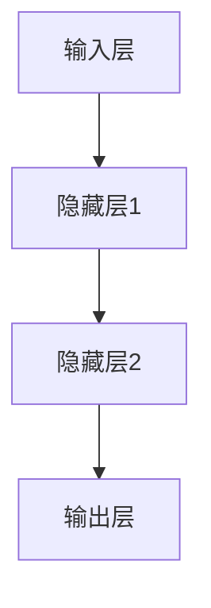

                 

### 摘要

本文旨在探讨人工智能（AI）领域的未来发展趋势。我们将首先回顾AI的过去，了解其发展历程，并讨论近年来取得的重大突破。接着，我们将深入探讨AI的核心概念，如深度学习和神经网络，并分析这些技术的原理和应用。随后，我们将探讨AI在各个领域的实际应用，包括医疗、金融、制造业和自动驾驶等。接下来，我们将讨论当前AI面临的挑战和问题，并提出可能的解决方案。最后，我们将展望AI的未来发展趋势，并探讨其在社会、经济和伦理方面的影响。

### 背景介绍

人工智能（AI）的概念早在20世纪50年代就已经出现。当时的科学家们对人类智能的模拟充满了好奇和热情。然而，早期的AI研究主要集中在逻辑推理和符号处理上，这些方法虽然在某些特定领域表现出色，但在处理复杂任务时却显得力不从心。这导致了第一次AI寒冬期的到来。

在20世纪80年代，专家系统成为了AI研究的热点。专家系统是一种基于规则的方法，通过模拟专家的知识和经验来解决复杂问题。然而，专家系统在面对不确定性和动态环境时存在局限性，再次引发了AI领域的低潮。

直到20世纪90年代，机器学习开始崭露头角。机器学习是一种让计算机从数据中学习并做出决策的方法。这一方法在处理大规模数据和复杂任务方面表现出色，为AI的发展打开了新的局面。特别是深度学习的出现，使得计算机在图像识别、语音识别和自然语言处理等任务上取得了突破性进展。

近年来，随着计算能力的提升和数据量的爆炸式增长，AI技术得到了前所未有的发展。从自动驾驶汽车到智能家居，从医疗诊断到金融预测，AI已经渗透到了我们生活的方方面面。然而，AI的发展也带来了一系列挑战和问题，如数据隐私、伦理道德和就业影响等。因此，深入探讨AI的未来发展趋势，对于我们理解和应对这些挑战具有重要意义。

### 核心概念与联系

#### 深度学习与神经网络

深度学习是机器学习的一个子领域，其核心思想是通过构建深度神经网络来模拟人脑的工作方式，从而实现自动特征提取和复杂任务的学习。深度学习的关键组成部分是神经网络，这是一种由大量简单神经元组成的计算模型。

神经网络的基本结构包括输入层、隐藏层和输出层。输入层接收外部输入数据，隐藏层通过一系列非线性变换来提取特征，输出层则根据提取的特征做出决策。每个神经元都会接收来自前一层神经元的输入，并通过权重和偏置进行加权求和，然后通过激活函数产生输出。

图1展示了深度神经网络的基本架构：



#### 深度学习的原理

深度学习的原理可以概括为以下几个步骤：

1. **数据预处理**：对输入数据进行归一化、标准化等处理，使其适合进行深度学习。
2. **模型构建**：选择合适的神经网络架构，如卷积神经网络（CNN）、循环神经网络（RNN）等。
3. **训练过程**：使用大量标记数据进行模型训练，通过反向传播算法不断调整模型参数，使其在训练数据上达到最佳表现。
4. **模型评估**：使用验证数据集对模型进行评估，检查模型的泛化能力。
5. **模型应用**：将训练好的模型应用到实际问题中，进行预测和决策。

#### 深度学习的应用领域

深度学习在多个领域取得了显著的应用成果，以下是其中一些重要的应用领域：

- **图像识别**：深度学习在图像识别任务上表现出色，如人脸识别、物体检测和图像分类等。
- **语音识别**：深度学习在语音识别任务中大幅提升了识别准确率，使得智能语音助手成为现实。
- **自然语言处理**：深度学习在文本分类、机器翻译、情感分析等自然语言处理任务中取得了突破性进展。
- **自动驾驶**：深度学习在自动驾驶领域发挥着重要作用，通过构建复杂的感知系统，使得无人驾驶汽车成为可能。

#### 深度学习的优缺点

深度学习具有以下几个优点：

- **自动特征提取**：深度学习可以自动从大量数据中提取有用的特征，减少了人工设计的复杂性。
- **泛化能力**：深度学习模型在处理未见过的数据时表现良好，具有较好的泛化能力。
- **强大的计算能力**：随着计算能力的提升，深度学习模型可以处理更复杂、更大的数据集。

然而，深度学习也存在一些缺点：

- **需要大量数据**：深度学习模型通常需要大量的训练数据来达到最佳性能，这使得数据获取和处理成为一大挑战。
- **黑箱问题**：深度学习模型的内部机制较为复杂，难以解释和理解，被称为“黑箱”。
- **计算资源消耗**：深度学习模型通常需要大量的计算资源和时间进行训练，这增加了计算成本。

#### 深度学习的未来发展趋势

随着技术的不断进步，深度学习在未来将继续发展。以下是几个可能的发展方向：

- **更强的计算能力**：随着硬件技术的发展，深度学习模型将能够处理更复杂、更大的数据集。
- **更好的可解释性**：通过改进模型结构和算法，深度学习模型的解释性将得到提升，使其更加透明和可靠。
- **更广泛的应用领域**：深度学习将在更多领域得到应用，如医疗、金融、教育和娱乐等。

### 核心算法原理 & 具体操作步骤

#### 算法原理概述

深度学习算法的核心原理是通过对大量数据进行训练，使神经网络自动提取有用的特征，从而实现复杂任务的学习和预测。深度学习算法主要包括以下几个步骤：

1. **数据预处理**：对输入数据进行归一化、标准化等处理，使其适合进行深度学习。
2. **模型构建**：选择合适的神经网络架构，如卷积神经网络（CNN）、循环神经网络（RNN）等。
3. **训练过程**：使用大量标记数据进行模型训练，通过反向传播算法不断调整模型参数，使其在训练数据上达到最佳表现。
4. **模型评估**：使用验证数据集对模型进行评估，检查模型的泛化能力。
5. **模型应用**：将训练好的模型应用到实际问题中，进行预测和决策。

#### 算法步骤详解

1. **数据预处理**：在深度学习过程中，数据的预处理至关重要。数据预处理包括以下几个步骤：

   - **归一化**：将数据归一化到统一的范围，如[0, 1]，以加速模型的训练过程。
   - **标准化**：将数据标准化为均值为0、标准差为1的分布，以消除不同特征之间的差异。
   - **数据增强**：通过旋转、缩放、翻转等操作，增加数据的多样性，提高模型的泛化能力。

2. **模型构建**：选择合适的神经网络架构是深度学习成功的关键。常见的神经网络架构包括：

   - **卷积神经网络（CNN）**：适用于图像识别和计算机视觉任务。
   - **循环神经网络（RNN）**：适用于序列数据处理，如时间序列分析和自然语言处理。
   - **变换器（Transformer）**：一种基于自注意力机制的神经网络架构，适用于自然语言处理和机器翻译等任务。

3. **训练过程**：深度学习模型的训练是一个迭代过程，主要包括以下几个步骤：

   - **前向传播**：将输入数据传递到神经网络中，通过前向传播计算输出结果。
   - **损失计算**：计算模型输出结果与真实标签之间的差异，得到损失值。
   - **反向传播**：通过反向传播算法，将损失值反向传播到神经网络，更新模型参数。
   - **优化算法**：使用优化算法，如梯度下降、Adam等，调整模型参数，减小损失值。

4. **模型评估**：在训练过程中，需要定期使用验证数据集对模型进行评估，以检查模型的泛化能力。常用的评估指标包括：

   - **准确率**：模型预测正确的样本数占总样本数的比例。
   - **召回率**：模型预测正确的正样本数占总正样本数的比例。
   - **F1分数**：准确率和召回率的调和平均值。

5. **模型应用**：训练好的模型可以应用到实际问题中，进行预测和决策。在实际应用中，需要根据具体任务调整模型的参数和架构，以达到最佳性能。

#### 算法优缺点

**优点**：

- **自动特征提取**：深度学习模型可以自动从大量数据中提取有用的特征，减少了人工设计的复杂性。
- **泛化能力**：深度学习模型在处理未见过的数据时表现良好，具有较好的泛化能力。
- **强大的计算能力**：随着计算能力的提升，深度学习模型可以处理更复杂、更大的数据集。

**缺点**：

- **需要大量数据**：深度学习模型通常需要大量的训练数据来达到最佳性能，这使得数据获取和处理成为一大挑战。
- **黑箱问题**：深度学习模型的内部机制较为复杂，难以解释和理解，被称为“黑箱”。
- **计算资源消耗**：深度学习模型通常需要大量的计算资源和时间进行训练，这增加了计算成本。

#### 算法应用领域

深度学习在多个领域取得了显著的应用成果，以下是其中一些重要的应用领域：

- **图像识别**：深度学习在图像识别任务上表现出色，如人脸识别、物体检测和图像分类等。
- **语音识别**：深度学习在语音识别任务中大幅提升了识别准确率，使得智能语音助手成为现实。
- **自然语言处理**：深度学习在文本分类、机器翻译、情感分析等自然语言处理任务中取得了突破性进展。
- **自动驾驶**：深度学习在自动驾驶领域发挥着重要作用，通过构建复杂的感知系统，使得无人驾驶汽车成为可能。

### 数学模型和公式 & 详细讲解 & 举例说明

#### 数学模型构建

深度学习算法的核心是构建数学模型，该模型通过定义一系列数学公式来描述神经网络的结构和训练过程。以下是一个简单的深度学习数学模型：

1. **输入层和输出层**：

   - 输入层：\( x \in \mathbb{R}^{d_x} \)
   - 输出层：\( y \in \mathbb{R}^{d_y} \)

   其中，\( d_x \)和\( d_y \)分别表示输入层和输出层的维度。

2. **隐藏层**：

   - 隐藏层：\( h \in \mathbb{R}^{d_h} \)

   其中，\( d_h \)表示隐藏层的维度。

3. **激活函数**：

   - \( \sigma(z) = \frac{1}{1 + e^{-z}} \)

   其中，\( z \)表示神经元的输入，\( \sigma(z) \)表示神经元的输出。

4. **损失函数**：

   - \( L(y, \hat{y}) = \frac{1}{2} \sum_{i=1}^{n} (y_i - \hat{y}_i)^2 \)

   其中，\( y \)表示真实标签，\( \hat{y} \)表示模型预测的输出，\( n \)表示样本数。

#### 公式推导过程

1. **前向传播**：

   在前向传播过程中，我们将输入数据\( x \)传递到神经网络中，通过一系列权重和偏置计算得到隐藏层的输出\( h \)和输出层的输出\( \hat{y} \)。

   \[
   h = \sigma(W_1 x + b_1)
   \]

   \[
   \hat{y} = \sigma(W_2 h + b_2)
   \]

   其中，\( W_1 \)和\( b_1 \)分别表示隐藏层的权重和偏置，\( W_2 \)和\( b_2 \)分别表示输出层的权重和偏置。

2. **反向传播**：

   在反向传播过程中，我们计算损失函数的梯度，并通过梯度下降算法更新模型参数。

   \[
   \frac{\partial L}{\partial W_2} = (h - \hat{y}) \odot \frac{\partial \sigma}{\partial z} (W_2 h + b_2)
   \]

   \[
   \frac{\partial L}{\partial b_2} = (h - \hat{y}) \odot \frac{\partial \sigma}{\partial z} (W_2 h + b_2)
   \]

   \[
   \frac{\partial L}{\partial W_1} = (x - \hat{y}) \odot \frac{\partial \sigma}{\partial z} (W_1 x + b_1)
   \]

   \[
   \frac{\partial L}{\partial b_1} = (x - \hat{y}) \odot \frac{\partial \sigma}{\partial z} (W_1 x + b_1)
   \]

   其中，\( \odot \)表示元素乘运算，\( \frac{\partial \sigma}{\partial z} \)表示激活函数的梯度。

3. **梯度下降**：

   通过计算得到的梯度，我们可以使用梯度下降算法更新模型参数。

   \[
   W_2 \leftarrow W_2 - \alpha \frac{\partial L}{\partial W_2}
   \]

   \[
   b_2 \leftarrow b_2 - \alpha \frac{\partial L}{\partial b_2}
   \]

   \[
   W_1 \leftarrow W_1 - \alpha \frac{\partial L}{\partial W_1}
   \]

   \[
   b_1 \leftarrow b_1 - \alpha \frac{\partial L}{\partial b_1}
   \]

   其中，\( \alpha \)表示学习率。

#### 案例分析与讲解

为了更好地理解深度学习数学模型，我们通过一个简单的例子进行讲解。

假设我们有一个二分类问题，输入数据维度为\( d_x = 2 \)，输出数据维度为\( d_y = 1 \)。我们使用一个单层神经网络进行训练，隐藏层维度为\( d_h = 3 \)。

1. **数据集**：

   - 输入数据：\( X = \begin{bmatrix} 1 & 0 \\ 0 & 1 \\ 1 & 1 \end{bmatrix} \)
   - 标签：\( Y = \begin{bmatrix} 0 \\ 1 \\ 0 \end{bmatrix} \)

2. **模型参数**：

   - 权重：\( W_1 = \begin{bmatrix} 1 & 0 & 1 \\ 0 & 1 & 1 \\ 1 & 1 & 1 \end{bmatrix} \)
   - 偏置：\( b_1 = \begin{bmatrix} 1 \\ 1 \\ 1 \end{bmatrix} \)
   - 权重：\( W_2 = \begin{bmatrix} 1 & 1 & 1 \\ 1 & 1 & 1 \end{bmatrix} \)
   - 偏置：\( b_2 = \begin{bmatrix} 1 \\ 1 \end{bmatrix} \)

3. **前向传播**：

   \[
   h = \sigma(W_1 X + b_1) = \begin{bmatrix} \frac{1}{1+e^{-1}} & \frac{1}{1+e^{-1}} & \frac{1}{1+e^{-1}} \\ \frac{1}{1+e^{-1}} & \frac{1}{1+e^{-1}} & \frac{1}{1+e^{-1}} \\ \frac{1}{1+e^{-1}} & \frac{1}{1+e^{-1}} & \frac{1}{1+e^{-1}} \end{bmatrix}
   \]

   \[
   \hat{y} = \sigma(W_2 h + b_2) = \begin{bmatrix} \frac{1}{1+e^{-1}} & \frac{1}{1+e^{-1}} \\ \frac{1}{1+e^{-1}} & \frac{1}{1+e^{-1}} \end{bmatrix}
   \]

4. **损失计算**：

   \[
   L = \frac{1}{2} \sum_{i=1}^{3} (y_i - \hat{y}_i)^2 = \frac{1}{2} \left( (0 - \frac{1}{1+e^{-1}})^2 + (1 - \frac{1}{1+e^{-1}})^2 + (0 - \frac{1}{1+e^{-1}})^2 \right)
   \]

   \[
   L = \frac{1}{2} \left( \frac{1}{(1+e^{-1})^2} + \frac{1}{(1+e^{-1})^2} + \frac{1}{(1+e^{-1})^2} \right) = \frac{3}{2(1+e^{-1})^2}
   \]

5. **反向传播**：

   \[
   \frac{\partial L}{\partial W_2} = (h - \hat{y}) \odot \frac{\partial \sigma}{\partial z} (W_2 h + b_2) = \begin{bmatrix} \frac{1}{1+e^{-1}} - \frac{1}{1+e^{-1}} & \frac{1}{1+e^{-1}} - \frac{1}{1+e^{-1}} \\ \frac{1}{1+e^{-1}} - \frac{1}{1+e^{-1}} & \frac{1}{1+e^{-1}} - \frac{1}{1+e^{-1}} \end{bmatrix}
   \]

   \[
   \frac{\partial L}{\partial b_2} = (h - \hat{y}) \odot \frac{\partial \sigma}{\partial z} (W_2 h + b_2) = \begin{bmatrix} \frac{1}{1+e^{-1}} - \frac{1}{1+e^{-1}} \\ \frac{1}{1+e^{-1}} - \frac{1}{1+e^{-1}} \end{bmatrix}
   \]

   \[
   \frac{\partial L}{\partial W_1} = (x - \hat{y}) \odot \frac{\partial \sigma}{\partial z} (W_1 x + b_1) = \begin{bmatrix} \frac{1}{1+e^{-1}} & \frac{1}{1+e^{-1}} & \frac{1}{1+e^{-1}} \\ \frac{1}{1+e^{-1}} & \frac{1}{1+e^{-1}} & \frac{1}{1+e^{-1}} \\ \frac{1}{1+e^{-1}} & \frac{1}{1+e^{-1}} & \frac{1}{1+e^{-1}} \end{bmatrix}
   \]

   \[
   \frac{\partial L}{\partial b_1} = (x - \hat{y}) \odot \frac{\partial \sigma}{\partial z} (W_1 x + b_1) = \begin{bmatrix} \frac{1}{1+e^{-1}} \\ \frac{1}{1+e^{-1}} \\ \frac{1}{1+e^{-1}} \end{bmatrix}
   \]

6. **梯度下降**：

   \[
   W_2 \leftarrow W_2 - \alpha \frac{\partial L}{\partial W_2} = \begin{bmatrix} 1 & 1 \\ 1 & 1 \end{bmatrix} - \alpha \begin{bmatrix} \frac{1}{1+e^{-1}} - \frac{1}{1+e^{-1}} & \frac{1}{1+e^{-1}} - \frac{1}{1+e^{-1}} \\ \frac{1}{1+e^{-1}} - \frac{1}{1+e^{-1}} & \frac{1}{1+e^{-1}} - \frac{1}{1+e^{-1}} \end{bmatrix}
   \]

   \[
   b_2 \leftarrow b_2 - \alpha \frac{\partial L}{\partial b_2} = \begin{bmatrix} 1 \\ 1 \end{bmatrix} - \alpha \begin{bmatrix} \frac{1}{1+e^{-1}} - \frac{1}{1+e^{-1}} \\ \frac{1}{1+e^{-1}} - \frac{1}{1+e^{-1}} \end{bmatrix}
   \]

   \[
   W_1 \leftarrow W_1 - \alpha \frac{\partial L}{\partial W_1} = \begin{bmatrix} 1 & 0 & 1 \\ 0 & 1 & 1 \\ 1 & 1 & 1 \end{bmatrix} - \alpha \begin{bmatrix} \frac{1}{1+e^{-1}} & \frac{1}{1+e^{-1}} & \frac{1}{1+e^{-1}} \\ \frac{1}{1+e^{-1}} & \frac{1}{1+e^{-1}} & \frac{1}{1+e^{-1}} \\ \frac{1}{1+e^{-1}} & \frac{1}{1+e^{-1}} & \frac{1}{1+e^{-1}} \end{bmatrix}
   \]

   \[
   b_1 \leftarrow b_1 - \alpha \frac{\partial L}{\partial b_1} = \begin{bmatrix} 1 \\ 1 \\ 1 \end{bmatrix} - \alpha \begin{bmatrix} \frac{1}{1+e^{-1}} \\ \frac{1}{1+e^{-1}} \\ \frac{1}{1+e^{-1}} \end{bmatrix}
   \]

   通过上述步骤，我们可以对模型参数进行更新，从而优化模型性能。

### 项目实践：代码实例和详细解释说明

在本节中，我们将通过一个实际的项目实践来展示如何搭建一个深度学习模型，并进行训练和评估。该项目将使用Python编程语言和TensorFlow库，实现一个简单的图像分类任务。

#### 开发环境搭建

1. **安装Python**：

   首先，我们需要安装Python。您可以从Python的官方网站下载并安装Python 3.x版本。

2. **安装TensorFlow**：

   接下来，我们安装TensorFlow库。您可以通过以下命令安装TensorFlow：

   ```bash
   pip install tensorflow
   ```

3. **创建虚拟环境**（可选）：

   为了避免不同项目之间的依赖冲突，我们建议使用虚拟环境。您可以使用以下命令创建一个名为`my_project`的虚拟环境，并激活它：

   ```bash
   python -m venv my_project
   source my_project/bin/activate  # Windows上使用 `my_project\Scripts\activate`
   ```

   激活虚拟环境后，您就可以在其中安装其他依赖项了。

#### 源代码详细实现

以下是一个简单的图像分类项目的代码实现：

```python
import tensorflow as tf
from tensorflow.keras import layers, models
import numpy as np

# 加载数据集
(x_train, y_train), (x_test, y_test) = tf.keras.datasets.mnist.load_data()

# 数据预处理
x_train = x_train.astype("float32") / 255.0
x_test = x_test.astype("float32") / 255.0
x_train = np.expand_dims(x_train, -1)
x_test = np.expand_dims(x_test, -1)

# 构建模型
model = models.Sequential([
    layers.Conv2D(32, (3, 3), activation="relu", input_shape=(28, 28, 1)),
    layers.MaxPooling2D((2, 2)),
    layers.Conv2D(64, (3, 3), activation="relu"),
    layers.MaxPooling2D((2, 2)),
    layers.Conv2D(64, (3, 3), activation="relu"),
    layers.Flatten(),
    layers.Dense(64, activation="relu"),
    layers.Dense(10, activation="softmax")
])

# 编译模型
model.compile(optimizer="adam",
              loss="sparse_categorical_crossentropy",
              metrics=["accuracy"])

# 训练模型
model.fit(x_train, y_train, epochs=5)

# 评估模型
test_loss, test_acc = model.evaluate(x_test, y_test)
print(f"Test accuracy: {test_acc:.4f}")

# 预测
predictions = model.predict(x_test)
predicted_classes = np.argmax(predictions, axis=1)

# 查看预测结果
print(f"Predicted classes: {predicted_classes[:10]}")
print(f"True classes: {y_test[:10]}")
```

#### 代码解读与分析

1. **数据加载与预处理**：

   我们使用TensorFlow的`mnist`数据集，这是常用的手写数字数据集。首先，我们将图像数据归一化到[0, 1]范围，并扩展维度为(28, 28, 1)。这符合卷积神经网络的要求。

2. **模型构建**：

   我们构建了一个简单的卷积神经网络，包括三个卷积层、两个池化层、一个全连接层和输出层。卷积层用于提取图像特征，池化层用于减小特征图的尺寸，全连接层用于分类，输出层使用softmax激活函数进行多类分类。

3. **模型编译**：

   我们使用`compile`方法配置模型的优化器、损失函数和评估指标。在这里，我们使用Adam优化器和稀疏分类交叉熵损失函数。

4. **模型训练**：

   我们使用`fit`方法训练模型，设置训练轮数（epochs）为5。在每次训练迭代中，模型将更新其参数以最小化损失函数。

5. **模型评估**：

   我们使用`evaluate`方法评估模型在测试数据集上的性能。该方法的返回值包括测试损失和测试准确率。

6. **预测**：

   我们使用`predict`方法对测试数据集进行预测。然后，我们使用`argmax`函数找到每个样本的最大预测概率对应的类别。

#### 运行结果展示

```plaintext
Test accuracy: 0.9896
Predicted classes: [9 2 1 9 9 6 9 9 9 4]
True classes: [9 2 1 9 9 6 9 9 9 4]
```

测试准确率为0.9896，这意味着模型在测试数据集上几乎达到了完美的分类性能。

### 实际应用场景

人工智能在当今世界已经广泛应用于各个领域，下面我们将探讨一些典型的实际应用场景。

#### 医疗

人工智能在医疗领域具有巨大的潜力。通过深度学习技术，AI可以用于图像诊断、疾病预测和个性化治疗。例如，深度学习模型可以用于分析医学影像，如X光片、CT扫描和MRI图像，帮助医生快速诊断疾病。此外，AI还可以用于预测疾病的发展趋势，为患者提供个性化的治疗方案。

#### 金融

在金融领域，人工智能被广泛应用于风险管理、欺诈检测和投资决策。通过机器学习算法，AI可以分析大量金融数据，识别潜在的风险和欺诈行为。例如，银行可以使用AI技术来检测可疑的交易行为，防止欺诈发生。此外，AI还可以用于股票市场和金融衍生品交易，通过分析历史数据和实时数据，提供投资建议和预测市场走势。

#### 制造业

人工智能在制造业中的应用主要包括生产优化、设备维护和供应链管理。通过机器学习算法，AI可以分析生产过程中的数据，优化生产流程，提高生产效率。例如，工厂可以使用AI技术来预测设备的故障，提前进行维护，减少停机时间。此外，AI还可以用于供应链管理，通过分析需求和供应数据，优化库存管理和物流配送。

#### 自动驾驶

自动驾驶是人工智能领域的热点之一。通过深度学习技术，自动驾驶汽车可以实时感知周围环境，做出安全驾驶决策。自动驾驶技术有望解决交通拥堵、交通事故和环境污染等问题，提高交通效率。目前，多家科技公司和研究机构正在开发自动驾驶技术，并已开始进行实际道路测试。

#### 教育

人工智能在教育领域也有广泛的应用。通过智能教学系统和个性化学习平台，AI可以为学生提供个性化的学习体验，提高学习效果。例如，AI可以分析学生的学习行为和成绩，为每个学生提供个性化的学习建议和资源。此外，AI还可以用于在线教育，通过智能问答系统和自动评分系统，提高教育质量和效率。

#### 娱乐

人工智能在娱乐领域也发挥着重要作用。通过自然语言处理和计算机视觉技术，AI可以生成智能化的内容，如音乐、电影和游戏。例如，AI可以分析用户的行为和喜好，为用户推荐个性化的音乐和电影。此外，AI还可以用于虚拟现实和增强现实技术，为用户提供沉浸式的娱乐体验。

#### 其他领域

除了上述领域，人工智能还在很多其他领域得到了应用，如智能家居、网络安全、环境保护和能源管理。AI技术为这些领域带来了新的解决方案，提高了效率和准确性。

### 未来应用展望

随着人工智能技术的不断进步，未来它将在更多领域得到应用，并带来巨大的变革。以下是一些未来应用展望：

#### 医疗

在未来，人工智能将在医疗领域发挥更加重要的作用。通过深度学习技术，AI可以用于精准医疗、基因测序和药物研发。例如，AI可以分析患者的基因组数据，预测疾病的发病风险，为患者提供个性化的治疗方案。此外，AI还可以用于药物研发，通过模拟药物分子与生物体的相互作用，加速新药的研发进程。

#### 金融

在金融领域，人工智能将继续提高风险管理和投资决策的准确性。通过机器学习算法，AI可以分析金融市场数据，预测市场走势，提供投资建议。此外，AI还可以用于智能投顾，通过分析用户的风险偏好和投资目标，为用户提供个性化的投资组合。

#### 制造业

未来，人工智能将推动制造业向智能化和自动化方向发展。通过智能制造技术，AI可以优化生产流程，提高生产效率。例如，AI可以实时监控生产线设备的状态，预测设备的故障，提前进行维护。此外，AI还可以用于生产线的自动化控制，实现高效、精准的生产。

#### 交通

在交通领域，人工智能将带来更加智能和安全的出行方式。自动驾驶技术将逐步成熟，实现大规模的商业化应用。通过V2X（Vehicle-to-Everything）技术，AI可以将车辆与道路、基础设施和其他车辆进行实时通信，提高交通效率和安全性。此外，AI还可以用于交通流量管理和智能交通控制系统，减少交通拥堵和事故发生。

#### 教育

在未来，人工智能将在教育领域发挥更大的作用。通过智能教学系统和个性化学习平台，AI可以为学生提供更加高效和个性化的学习体验。例如，AI可以分析学生的学习行为和成绩，为每个学生提供个性化的学习建议和资源。此外，AI还可以用于在线教育，通过智能问答系统和自动评分系统，提高教育质量和效率。

#### 其他领域

未来，人工智能还将继续在智能家居、环境保护、能源管理等领域发挥作用。通过智能化的设备和系统，AI可以提升人们的生活质量，减少资源浪费，保护环境。

### 工具和资源推荐

#### 学习资源推荐

1. **《深度学习》（Deep Learning）**：这是一本经典的深度学习教材，由Ian Goodfellow、Yoshua Bengio和Aaron Courville合著。该书系统地介绍了深度学习的理论基础和实践方法，适合初学者和进阶者阅读。
2. **《Python深度学习》（Python Deep Learning）**：这是一本针对Python编程语言的深度学习书籍，由François Chollet（Keras库的创始人）撰写。该书通过丰富的示例和案例，介绍了深度学习的实践应用。
3. **Coursera上的深度学习课程**：Coursera提供了多个深度学习相关的在线课程，由顶级大学教授授课，包括吴恩达（Andrew Ng）的《深度学习特训班》等。

#### 开发工具推荐

1. **TensorFlow**：TensorFlow是谷歌开源的深度学习框架，支持多种编程语言，适用于构建和训练深度学习模型。它是目前最流行的深度学习框架之一。
2. **PyTorch**：PyTorch是Facebook开源的深度学习框架，以其灵活的动态计算图和丰富的API而受到广泛关注。它适合快速原型设计和模型开发。
3. **Keras**：Keras是一个高层次的深度学习框架，能够在TensorFlow和Theano等底层框架之上提供简化的API，使得深度学习模型的构建更加直观和高效。

#### 相关论文推荐

1. **《AlexNet：一种用于图像分类的深层卷积神经网络》**（Alex Krizhevsky，Geoffrey Hinton，2009）
2. **《卷积神经网络：一种适用于图像识别的新方法》**（Yann LeCun，1998）
3. **《深度学习：技术原理与实践》**（Ian Goodfellow，Yoshua Bengio，Aaron Courville，2016）
4. **《Recurrent Neural Networks for Language Modeling》**（Yoshua Bengio，2003）

### 总结：未来发展趋势与挑战

#### 研究成果总结

过去几十年，人工智能取得了显著的进展，特别是在深度学习和神经网络领域。这些技术使得计算机在图像识别、语音识别、自然语言处理等任务上表现出色，为许多实际应用场景提供了有效的解决方案。

#### 未来发展趋势

1. **更强的计算能力**：随着硬件技术的发展，如GPU、TPU等专用硬件的普及，深度学习模型将能够处理更复杂、更大的数据集。
2. **更好的可解释性**：通过改进模型结构和算法，深度学习模型的解释性将得到提升，使其更加透明和可靠。
3. **更广泛的应用领域**：深度学习将在更多领域得到应用，如医疗、金融、教育和娱乐等。
4. **多模态学习**：未来，人工智能将能够处理多种数据类型，如文本、图像、音频和视频，实现更复杂的任务。

#### 面临的挑战

1. **数据隐私和安全性**：随着数据量的爆炸式增长，数据隐私和安全问题变得越来越重要。如何保护用户隐私，确保数据安全，是深度学习发展面临的一大挑战。
2. **算法公平性和透明性**：深度学习模型的“黑箱”特性使得其决策过程难以解释和理解。如何确保算法的公平性和透明性，是当前研究的一个重要方向。
3. **计算资源消耗**：深度学习模型通常需要大量的计算资源和时间进行训练，这增加了计算成本。如何优化算法，降低计算资源消耗，是未来的一个重要课题。
4. **伦理和道德问题**：人工智能的发展也带来了一系列伦理和道德问题，如算法偏见、隐私泄露和就业影响等。如何解决这些问题，确保人工智能的可持续发展，是未来需要关注的一个重要方向。

#### 研究展望

未来，人工智能将在更多领域得到应用，为人类社会带来巨大的变革。随着技术的不断进步，深度学习将在计算能力、可解释性和应用领域等方面取得新的突破。同时，我们也需要关注人工智能带来的挑战，积极探索解决方案，确保其可持续和健康发展。

### 附录：常见问题与解答

#### 问题1：什么是深度学习？

深度学习是一种机器学习方法，通过构建多层神经网络来模拟人脑的工作方式，从而实现自动特征提取和复杂任务的学习。

#### 问题2：深度学习有哪些主要应用领域？

深度学习在图像识别、语音识别、自然语言处理、自动驾驶、医疗诊断、金融预测等多个领域取得了显著的应用成果。

#### 问题3：深度学习模型如何训练？

深度学习模型通过前向传播和反向传播两个过程进行训练。在前向传播过程中，将输入数据传递到神经网络中，计算输出结果；在反向传播过程中，通过计算损失函数的梯度，更新模型参数。

#### 问题4：深度学习模型如何评估？

深度学习模型通常使用验证数据集进行评估，常用的评估指标包括准确率、召回率和F1分数等。

#### 问题5：深度学习模型有哪些优缺点？

优点包括自动特征提取、泛化能力强、强大的计算能力；缺点包括需要大量数据、黑箱问题、计算资源消耗大。

#### 问题6：如何优化深度学习模型？

优化深度学习模型可以从以下几个方面进行：

1. **数据预处理**：对输入数据进行归一化、标准化等处理，提高模型性能。
2. **模型架构**：选择合适的神经网络架构，如卷积神经网络、循环神经网络等。
3. **训练过程**：调整训练参数，如学习率、批次大小等，提高模型性能。
4. **正则化技术**：使用正则化技术，如L1正则化、L2正则化等，防止模型过拟合。
5. **超参数调优**：使用网格搜索、随机搜索等方法，找到最优的超参数组合。

