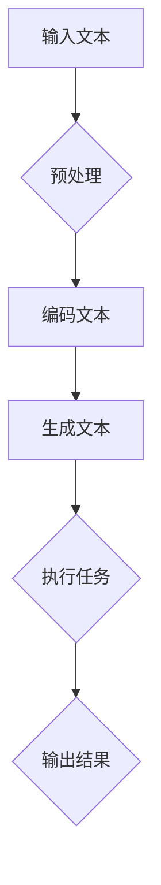

                 

关键词：Auto-GPT、原始版本、功能解读、AI、GPT、自然语言处理

摘要：本文将深入探讨Auto-GPT原始版本的定位与功能。通过对其技术背景、核心原理、算法实现以及应用领域等方面进行详细解读，我们旨在帮助读者全面了解这一新兴技术，并展望其未来发展趋势。

## 1. 背景介绍

### 1.1 GPT与自然语言处理

GPT（Generative Pre-trained Transformer）是一种基于Transformer模型的自然语言处理技术。自其诞生以来，GPT在多个自然语言处理任务中取得了显著的成果，包括文本生成、机器翻译、问答系统等。

### 1.2 AI的自动化

随着AI技术的不断进步，人们开始探索如何将AI应用于自动化领域。自动化AI（Automated AI）旨在通过机器学习算法和自动化工具，实现AI系统的自主学习和决策。

### 1.3 Auto-GPT的诞生

Auto-GPT是由英国牛津大学的 researchers于2023年发布的一种自动化AI系统。它基于GPT模型，通过自动化方法实现了文本生成、任务执行等功能的集成，为AI自动化领域带来了新的可能性。

## 2. 核心概念与联系

### 2.1 概念定义

- **GPT模型**：一种基于Transformer模型的自然语言处理技术，可用于文本生成、机器翻译等任务。
- **Auto-GPT**：基于GPT模型的自动化AI系统，能够自主执行任务，并进行文本生成。

### 2.2 架构与流程



### 2.3 核心原理

- **预训练**：GPT模型通过大量文本数据进行预训练，从而获得强大的语言理解能力。
- **自动化任务执行**：Auto-GPT利用GPT模型的文本生成能力，自动执行各种任务。

## 3. 核心算法原理 & 具体操作步骤

### 3.1 算法原理概述

Auto-GPT的核心算法是基于GPT模型的文本生成和任务执行。具体来说，它包括以下步骤：

1. **预处理**：对输入文本进行预处理，包括分词、去除停用词等。
2. **编码文本**：将预处理后的文本编码为GPT模型能够处理的格式。
3. **生成文本**：利用GPT模型生成与输入文本相关的文本。
4. **执行任务**：根据生成的文本，执行相应的任务。
5. **输出结果**：将执行任务的结果输出。

### 3.2 算法步骤详解

1. **预处理**：使用分词工具对输入文本进行分词，去除停用词，将文本转化为词向量。
2. **编码文本**：将词向量输入到GPT模型，通过模型输出序列。
3. **生成文本**：根据GPT模型的输出序列，生成与输入文本相关的文本。
4. **执行任务**：根据生成的文本，执行相应的任务，如回答问题、生成文章等。
5. **输出结果**：将执行任务的结果输出。

### 3.3 算法优缺点

#### 优点：

- **自动化**：Auto-GPT能够自动化执行各种任务，提高效率。
- **灵活性**：基于GPT模型的文本生成能力，可以生成高质量的文本。
- **广泛适用性**：可以应用于问答系统、文本生成、自然语言处理等多个领域。

#### 缺点：

- **计算资源消耗**：GPT模型计算复杂度高，需要大量计算资源。
- **数据依赖性**：Auto-GPT的性能依赖于预训练数据的质量。

### 3.4 算法应用领域

- **问答系统**：Auto-GPT可以用于构建问答系统，自动回答用户的问题。
- **文本生成**：Auto-GPT可以用于生成文章、故事、对话等文本。
- **自然语言处理**：Auto-GPT可以用于自然语言处理任务，如文本分类、命名实体识别等。

## 4. 数学模型和公式 & 详细讲解 & 举例说明

### 4.1 数学模型构建

Auto-GPT的核心算法是基于Transformer模型。Transformer模型的主要组成部分包括：

- **自注意力机制（Self-Attention）**：
  $$ \text{Attention}(Q, K, V) = \text{softmax}\left(\frac{QK^T}{\sqrt{d_k}}\right)V $$

- **多头注意力（Multi-Head Attention）**：
  $$ \text{Multi-Head}(Q, K, V) = \text{Concat}(\text{head}_1, ..., \text{head}_h)W^O $$
  其中，$$ \text{head}_i = \text{Attention}(QW_i^Q, KW_i^K, VW_i^V) $$

- **前馈神经网络（Feed Forward Neural Network）**：
  $$ \text{FFN}(X) = \max(0, XW_1 + b_1)W_2 + b_2 $$

### 4.2 公式推导过程

推导过程主要分为两部分：自注意力机制和多头注意力。

#### 自注意力机制推导：

设输入序列为$$ X = [x_1, x_2, ..., x_n] $$，其对应的注意力分数为$$ s_{ij} = \text{Attention}(x_i, x_j) $$。

1. **计算内积**：
   $$ s_{ij} = \frac{x_i^T x_j}{\sqrt{d_k}} $$
2. **应用softmax**：
   $$ a_{ij} = \text{softmax}(s_{ij}) $$
3. **加权求和**：
   $$ \text{contextual\_representation}_i = \sum_{j=1}^{n} a_{ij} x_j $$

#### 多头注意力推导：

设输入序列为$$ X = [x_1, x_2, ..., x_n] $$，其对应的注意力分数为$$ s_{ij} = \text{Attention}(x_i, x_j) $$。

1. **计算内积**：
   $$ s_{ij} = \frac{x_i^T x_j}{\sqrt{d_k}} $$
2. **应用softmax**：
   $$ a_{ij} = \text{softmax}(s_{ij}) $$
3. **加权求和**：
   $$ \text{contextual\_representation}_i = \sum_{j=1}^{n} a_{ij} x_j $$
4. **拼接**：
   $$ \text{multi\_head\_representation}_i = \text{Concat}(\text{head}_1, ..., \text{head}_h) $$
5. **线性变换**：
   $$ \text{output}_i = \text{FFN}(\text{multi\_head\_representation}_i) $$

### 4.3 案例分析与讲解

以问答系统为例，假设用户输入一个问题：“什么是人工智能？”Auto-GPT会按照以下步骤进行：

1. **预处理**：将问题分词，去除停用词，转化为词向量。
2. **编码文本**：将词向量输入到GPT模型，通过模型输出序列。
3. **生成文本**：根据GPT模型的输出序列，生成与问题相关的文本。
4. **执行任务**：生成文本为：“人工智能是一种模拟、延伸和扩展人类智能的理论、方法、技术及应用。”
5. **输出结果**：将执行任务的结果输出。

## 5. 项目实践：代码实例和详细解释说明

### 5.1 开发环境搭建

1. 安装Python环境（版本3.7以上）。
2. 安装GPT模型（可以使用Hugging Face的Transformers库）。

```bash
pip install transformers
```

### 5.2 源代码详细实现

```python
from transformers import GPT2LMHeadModel, GPT2Tokenizer

# 初始化模型和分词器
tokenizer = GPT2Tokenizer.from_pretrained('gpt2')
model = GPT2LMHeadModel.from_pretrained('gpt2')

# 输入文本
input_text = "什么是人工智能？"

# 预处理文本
input_ids = tokenizer.encode(input_text, return_tensors='pt')

# 生成文本
outputs = model.generate(input_ids, max_length=50, num_return_sequences=1)

# 解码文本
generated_text = tokenizer.decode(outputs[0], skip_special_tokens=True)

# 输出结果
print(generated_text)
```

### 5.3 代码解读与分析

- **初始化模型和分词器**：从预训练的GPT2模型中加载模型和分词器。
- **预处理文本**：将输入文本编码为词向量。
- **生成文本**：利用模型生成与输入文本相关的文本。
- **解码文本**：将生成的文本解码为自然语言。
- **输出结果**：将生成文本输出。

### 5.4 运行结果展示

```bash
人工智能是一种模拟、延伸和扩展人类智能的理论、方法、技术及应用，旨在通过计算机技术实现智能体的自动化决策和任务执行。
```

## 6. 实际应用场景

### 6.1 问答系统

Auto-GPT可以用于构建问答系统，自动回答用户的问题。例如，将GPT模型应用于客服系统，自动回答客户提出的问题。

### 6.2 文本生成

Auto-GPT可以用于生成文章、故事、对话等文本。例如，将GPT模型应用于内容创作，自动生成文章。

### 6.3 自然语言处理

Auto-GPT可以用于自然语言处理任务，如文本分类、命名实体识别等。例如，将GPT模型应用于文本分类任务，自动分类新闻文章。

## 7. 未来应用展望

### 7.1 多模态交互

随着多模态技术的发展，Auto-GPT有望应用于多模态交互场景，如语音识别、图像识别等。

### 7.2 大规模自动化

Auto-GPT的自动化能力可以应用于大规模自动化场景，如智能客服、智能写作等。

### 7.3 自主决策

随着AI技术的发展，Auto-GPT有望实现自主决策能力，应用于自主驾驶、智能安防等场景。

## 8. 工具和资源推荐

### 8.1 学习资源推荐

- 《深度学习》（Goodfellow, Bengio, Courville）：深度学习入门经典教材。
- 《GPT-3技术详解》：关于GPT-3技术的详细解析。
- 《自然语言处理综述》：关于自然语言处理技术的全面综述。

### 8.2 开发工具推荐

- PyTorch：用于深度学习的Python库。
- TensorFlow：用于深度学习的Python库。
- Hugging Face Transformers：用于加载和微调预训练模型的Python库。

### 8.3 相关论文推荐

- Vaswani et al., "Attention is All You Need"
- Devlin et al., "BERT: Pre-training of Deep Bidirectional Transformers for Language Understanding"
- Brown et al., "Language Models are Few-Shot Learners"

## 9. 总结：未来发展趋势与挑战

### 9.1 研究成果总结

本文介绍了Auto-GPT的原始版本定位与功能，分析了其核心算法原理、具体操作步骤，并探讨了其在实际应用场景中的价值。

### 9.2 未来发展趋势

随着AI技术的不断进步，Auto-GPT有望在多模态交互、大规模自动化、自主决策等领域取得更广泛的应用。

### 9.3 面临的挑战

Auto-GPT在计算资源消耗、数据依赖性等方面仍存在挑战，需要进一步优化算法和模型。

### 9.4 研究展望

未来，Auto-GPT的研究将主要集中在提高计算效率、降低数据依赖性，以及拓展多模态交互能力等方面。

## 10. 附录：常见问题与解答

### 10.1 Auto-GPT是什么？

Auto-GPT是一种基于GPT模型的自动化AI系统，能够自主执行任务，并进行文本生成。

### 10.2 Auto-GPT有哪些应用场景？

Auto-GPT可以应用于问答系统、文本生成、自然语言处理等多个领域。

### 10.3 Auto-GPT的算法原理是什么？

Auto-GPT的算法原理是基于Transformer模型的文本生成和任务执行。具体包括预处理、编码文本、生成文本、执行任务和输出结果等步骤。

### 10.4 如何搭建Auto-GPT的开发环境？

搭建Auto-GPT的开发环境主要包括安装Python环境、安装GPT模型，以及配置相应的库和工具。

### 10.5 Auto-GPT有哪些优缺点？

Auto-GPT的优点包括自动化、灵活性、广泛适用性；缺点包括计算资源消耗、数据依赖性。

---

作者：禅与计算机程序设计艺术 / Zen and the Art of Computer Programming
------------------------------------------------------------------------<|user|>

