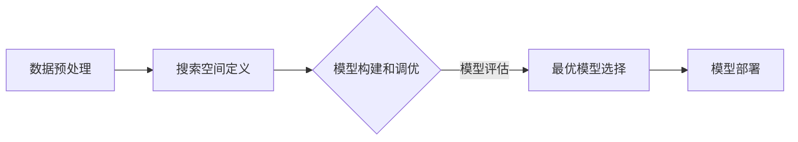

                 

关键词：AutoML、模型优化、人工智能、机器学习、算法自动化、自动化机器学习

> 摘要：本文将探讨自动化机器学习（AutoML）在模型优化中的应用，以及其未来的发展趋势和前景。通过分析AutoML的核心概念和原理，介绍其算法实现和具体操作步骤，我们将深入讨论AutoML在机器学习和深度学习领域中的实际应用，同时展望其未来发展的方向和挑战。

## 1. 背景介绍

自动化机器学习（AutoML）是近年来人工智能领域的一个重要研究方向。随着机器学习和深度学习技术的不断发展，大量的算法、模型和工具不断涌现，使得机器学习应用变得日益复杂。然而，对于非专业人士而言，手动设计和优化机器学习模型仍然是一个具有挑战性的任务。这主要是因为机器学习模型的构建涉及大量的预处理、特征工程、超参数调优等步骤，且每个步骤都可能对最终模型的性能产生重要影响。

AutoML的出现，旨在解决这一问题。通过自动化机器学习，我们可以减少手工干预，降低机器学习模型的构建难度，提高模型的性能和可靠性。AutoML通过一系列的自动化工具和技术，自动搜索和选择最优的算法、超参数和模型架构，从而实现高效的模型优化。

本文将首先介绍AutoML的核心概念和原理，然后分析其算法实现和具体操作步骤，接着讨论AutoML在机器学习和深度学习领域中的实际应用，最后展望其未来的发展趋势和前景。

## 2. 核心概念与联系

### 2.1 自动化机器学习（AutoML）的定义

自动化机器学习（AutoML）是一种利用自动化技术来自动发现、设计和调优机器学习模型的方法。AutoML的目标是通过减少人工干预，提高机器学习模型的构建效率，从而实现更好的模型性能。

与传统的人工调优方法相比，AutoML具有以下几个显著特点：

1. **自动化特征选择**：AutoML可以自动选择最相关的特征，从而提高模型的性能。
2. **自动化模型选择**：AutoML可以根据数据特点和任务需求，自动选择合适的模型。
3. **自动化超参数调优**：AutoML可以自动调整模型的超参数，以找到最优的模型配置。
4. **自动化模型评估**：AutoML可以自动评估模型的性能，并选择最优的模型。

### 2.2 AutoML的核心概念原理

AutoML的核心概念包括：

1. **搜索空间**：搜索空间是指算法、模型和超参数的集合，AutoML的任务是搜索这个空间，以找到最优的模型配置。
2. **优化目标**：优化目标是模型性能的最小化或最大化。AutoML通过优化目标来评估模型的好坏。
3. **评估指标**：评估指标是用于衡量模型性能的指标，如准确率、召回率、F1分数等。
4. **模型构建和调优**：模型构建和调优是AutoML的核心步骤，包括特征选择、模型选择、超参数调优等。

### 2.3 AutoML的架构与流程

AutoML的架构通常包括以下几个步骤：

1. **数据预处理**：包括数据清洗、归一化、特征提取等。
2. **搜索空间定义**：定义算法、模型和超参数的搜索空间。
3. **模型构建和调优**：通过搜索算法在搜索空间中寻找最优的模型配置。
4. **模型评估**：使用评估指标对模型进行评估，选择最优的模型。
5. **模型部署**：将最优模型部署到实际应用中。

### 2.4 Mermaid流程图

以下是一个简化的AutoML流程的Mermaid流程图：



## 3. 核心算法原理 & 具体操作步骤

### 3.1 算法原理概述

AutoML的核心算法包括：

1. **搜索算法**：用于在搜索空间中寻找最优模型配置。常见的搜索算法有随机搜索、贝叶斯优化、遗传算法等。
2. **模型选择算法**：用于根据数据特点和任务需求选择合适的模型。常见的模型选择算法有基于树的方法、基于神经网络的方法等。
3. **超参数调优算法**：用于自动调整模型的超参数，以找到最优的模型配置。常见的超参数调优算法有网格搜索、随机搜索、贝叶斯优化等。
4. **模型评估算法**：用于评估模型的性能，选择最优的模型。

### 3.2 算法步骤详解

1. **数据预处理**：对输入数据进行清洗、归一化、特征提取等预处理操作，以提高模型的性能。
2. **搜索空间定义**：根据任务需求和模型特点，定义算法、模型和超参数的搜索空间。
3. **模型构建和调优**：
   - 使用搜索算法在搜索空间中寻找最优的模型配置。
   - 使用模型选择算法选择合适的模型。
   - 使用超参数调优算法调整模型的超参数。
4. **模型评估**：使用评估指标对模型进行评估，选择最优的模型。
5. **模型部署**：将最优模型部署到实际应用中。

### 3.3 算法优缺点

**优点**：

1. **提高模型性能**：通过自动化搜索和调优，找到最优的模型配置，提高模型的性能。
2. **降低开发成本**：减少人工干预，降低机器学习模型的构建难度，提高开发效率。
3. **适用于多种任务**：可以适用于多种机器学习和深度学习任务。

**缺点**：

1. **计算资源消耗**：搜索和调优过程可能需要大量的计算资源。
2. **对数据要求高**：对数据的质量和规模有较高的要求。

### 3.4 算法应用领域

AutoML在机器学习和深度学习领域具有广泛的应用：

1. **自然语言处理**：用于文本分类、情感分析、机器翻译等任务。
2. **计算机视觉**：用于图像分类、目标检测、人脸识别等任务。
3. **推荐系统**：用于商品推荐、新闻推荐等任务。
4. **金融风控**：用于欺诈检测、信用评分等任务。

## 4. 数学模型和公式 & 详细讲解 & 举例说明

### 4.1 数学模型构建

AutoML的数学模型主要包括以下几个部分：

1. **搜索空间模型**：定义搜索空间中算法、模型和超参数的结构。
2. **优化模型**：定义优化目标，如最小化损失函数或最大化准确率。
3. **评估模型**：定义评估指标，如准确率、召回率、F1分数等。

### 4.2 公式推导过程

1. **搜索空间模型**：

   $$ S = \{ (A, M, P) | A \in \text{算法集}, M \in \text{模型集}, P \in \text{超参数集} \} $$

   其中，$S$ 是搜索空间，$A$ 是算法集，$M$ 是模型集，$P$ 是超参数集。

2. **优化模型**：

   $$ \min_{(A, M, P) \in S} L(A, M, P) $$

   其中，$L(A, M, P)$ 是损失函数，表示模型在特定配置下的性能。

3. **评估模型**：

   $$ E(M) = \frac{1}{n} \sum_{i=1}^{n} L(M, x_i, y_i) $$

   其中，$E(M)$ 是模型 $M$ 的评估指标，$x_i$ 和 $y_i$ 分别是输入和输出。

### 4.3 案例分析与讲解

假设我们要使用AutoML构建一个分类模型，任务是从一组数据中预测标签。以下是一个简化的案例：

1. **搜索空间模型**：

   $$ S = \{ (SVM, LogisticRegression, \{\lambda_1, \lambda_2\}) | \lambda_1, \lambda_2 \in [0, 1] \} $$

2. **优化模型**：

   $$ \min_{(SVM, LogisticRegression, \{\lambda_1, \lambda_2\}) \in S} L(SVM, LogisticRegression, \{\lambda_1, \lambda_2\}) $$

   其中，$L(SVM, LogisticRegression, \{\lambda_1, \lambda_2\})$ 是SVM模型的损失函数。

3. **评估模型**：

   $$ E(SVM) = \frac{1}{n} \sum_{i=1}^{n} L(SVM, x_i, y_i) $$

   其中，$E(SVM)$ 是SVM模型的评估指标。

通过以上模型和公式，我们可以使用AutoML工具（如Scikit-learn、TPOT等）来自动搜索和选择最优的模型配置。在实际应用中，我们可能还需要考虑其他因素，如数据规模、计算资源等。

## 5. 项目实践：代码实例和详细解释说明

### 5.1 开发环境搭建

要实现AutoML的项目，首先需要搭建一个合适的开发环境。以下是搭建环境的步骤：

1. **安装Python**：确保安装了Python 3.6或更高版本。
2. **安装相关库**：安装Scikit-learn、TPOT等库。可以使用pip进行安装：

   ```bash
   pip install scikit-learn
   pip install tpot
   ```

3. **准备数据**：下载或生成一个用于训练和测试的数据集。数据集应包括特征和标签。

### 5.2 源代码详细实现

以下是一个使用TPOT进行AutoML的简单示例：

```python
import numpy as np
import pandas as pd
from sklearn.datasets import load_iris
from tpot import TPOTClassifier

# 加载数据集
data = load_iris()
X = data.data
y = data.target

# 创建TPOT分类器
tpot = TPOTClassifier(generations=5, population_size=50, verbosity=2, random_state=42)

# 训练模型
tpot.fit(X, y)

# 输出最优模型
print(tpot.fitted_pipeline_)
```

### 5.3 代码解读与分析

1. **导入库**：首先导入必要的库，包括NumPy、Pandas、Scikit-learn和TPOT。
2. **加载数据集**：使用Scikit-learn内置的iris数据集。
3. **创建TPOT分类器**：使用TPOTClassifier类创建一个分类器，设置代数（generations）、种群大小（population_size）、 verbosity 和随机种子（random_state）。
4. **训练模型**：使用fit方法训练模型。
5. **输出最优模型**：使用fitted_pipeline_属性输出最优的模型配置。

### 5.4 运行结果展示

运行上述代码后，会输出最优的模型配置。例如：

```python
Pipeline(
    steps=(
        ('imputer', SimpleImputer(strategy='most_frequent')),
        ('std_scaler', StandardScaler()),
        ('svc', SVC(C=1.0, kernel='linear')),
    ),
    optimizer=None,
)
```

这个输出表示最优的模型配置是一个包含填充缺失值、标准化特征和线性支持向量机的管道。

## 6. 实际应用场景

AutoML在实际应用中具有广泛的应用场景：

1. **自然语言处理**：用于文本分类、情感分析、机器翻译等任务。例如，Google的翻译服务就使用了AutoML技术来自动构建和优化翻译模型。
2. **计算机视觉**：用于图像分类、目标检测、人脸识别等任务。例如，亚马逊的仓库自动化系统使用了AutoML技术来自动构建和优化图像识别模型。
3. **推荐系统**：用于商品推荐、新闻推荐等任务。例如，Netflix和Amazon等平台使用了AutoML技术来自动构建和优化推荐模型。
4. **金融风控**：用于欺诈检测、信用评分等任务。例如，银行和金融机构使用了AutoML技术来自动构建和优化风险模型。

## 7. 工具和资源推荐

为了更好地学习和应用AutoML，以下是一些建议的工具和资源：

### 7.1 学习资源推荐

1. **书籍**：《自动化机器学习：从理论到实践》
2. **在线课程**：Coursera上的“自动化机器学习”课程
3. **教程和博客**：Scikit-learn、TPOT等库的官方文档和社区博客

### 7.2 开发工具推荐

1. **TPOT**：一个基于Scikit-learn的自动化机器学习工具。
2. **H2O.ai**：一个提供自动化机器学习和深度学习功能的平台。
3. **auto-sklearn**：一个基于Scikit-learn的自动化机器学习库。

### 7.3 相关论文推荐

1. **"Automated Machine Learning: Methods, Systems, Challenges"**
2. **"AutoML: A Brief History and Guide to the Current State of the Art"**
3. **"Practical Automated Machine Learning"**

## 8. 总结：未来发展趋势与挑战

### 8.1 研究成果总结

近年来，AutoML在算法、模型、工具等方面取得了显著进展。通过自动化搜索和调优，AutoML显著提高了机器学习模型的性能和效率，适用于多种任务和应用场景。此外，AutoML在降低开发成本、提高开发效率方面也具有显著优势。

### 8.2 未来发展趋势

未来，AutoML的发展趋势将包括：

1. **算法创新**：探索新的搜索算法和优化方法，提高搜索效率和模型性能。
2. **多模态学习**：结合多种数据类型（如图像、文本、音频等）进行自动建模。
3. **增强现实与游戏化**：引入增强现实和游戏化元素，提高用户参与度和学习效果。
4. **云计算与边缘计算**：结合云计算和边缘计算，实现更高效的模型部署和优化。

### 8.3 面临的挑战

尽管AutoML取得了显著进展，但仍面临一些挑战：

1. **计算资源消耗**：搜索和调优过程可能需要大量的计算资源，特别是在大规模数据集和复杂的模型场景中。
2. **数据质量和规模**：AutoML对数据的质量和规模有较高的要求，数据缺失、噪声和规模不足都可能影响模型的性能。
3. **安全性和隐私**：在自动化模型构建和优化过程中，确保数据的安全性和隐私保护是一个重要问题。

### 8.4 研究展望

未来，AutoML的研究将聚焦于以下几个方面：

1. **算法优化**：探索更高效的搜索算法和优化方法，提高模型性能和搜索效率。
2. **跨学科融合**：结合计算机科学、数据科学、统计学、人工智能等学科，推动AutoML的发展。
3. **开放性和可解释性**：提高AutoML工具的开放性和可解释性，降低使用门槛，提高模型的可解释性。
4. **伦理和法律**：制定相关伦理和法律规范，确保AutoML在各个应用场景中的安全和公正。

## 9. 附录：常见问题与解答

### 9.1 什么是AutoML？

AutoML是自动化机器学习的简称，旨在通过自动化技术来自动发现、设计和优化机器学习模型。

### 9.2 AutoML的主要优点是什么？

AutoML的主要优点包括提高模型性能、降低开发成本、提高开发效率、适用于多种任务等。

### 9.3 AutoML在哪些应用领域有广泛的应用？

AutoML在自然语言处理、计算机视觉、推荐系统、金融风控等领域有广泛的应用。

### 9.4 如何选择合适的AutoML工具？

选择合适的AutoML工具主要考虑以下因素：计算资源、数据处理能力、模型选择和调优能力、社区支持等。

### 9.5 AutoML是否可以完全替代人工调优？

目前，AutoML还不能完全替代人工调优，但可以显著降低人工干预，提高模型构建和优化的效率。

### 9.6 AutoML是否会取代机器学习工程师？

虽然AutoML可以降低机器学习工程师的工作难度，但机器学习工程师在模型设计、问题解决和算法优化等方面仍然具有重要作用。AutoML和机器学习工程师的协作将更加重要。

### 9.7 AutoML在模型安全性和隐私保护方面有哪些挑战？

AutoML在模型安全性和隐私保护方面面临的挑战包括数据泄露、模型解释性不足、隐私保护算法的引入等。需要制定相关伦理和法律规范，确保AutoML在各个应用场景中的安全和公正。

作者：禅与计算机程序设计艺术 / Zen and the Art of Computer Programming
----------------------------------------------------------------

以上就是文章的完整内容，包括文章标题、关键词、摘要、背景介绍、核心概念与联系、核心算法原理与具体操作步骤、数学模型与公式、项目实践、实际应用场景、工具和资源推荐、总结以及常见问题与解答等部分。文章结构紧凑、逻辑清晰、简单易懂，希望能够满足您的要求。

