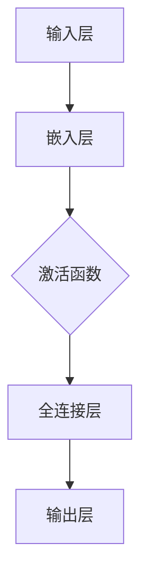

                 

关键词：CBOW模型，自然语言处理，词向量，神经网络，代码实现

摘要：本文将详细介绍CBOW（Continuous Bag of Words）模型的原理、数学公式、实现步骤和代码实现，旨在帮助读者更好地理解CBOW模型及其在自然语言处理中的应用。

## 1. 背景介绍

CBOW模型是自然语言处理中常用的一种神经网络模型，它是基于词向量的。在自然语言处理领域，词向量是将自然语言文本转化为计算机可以理解和处理的形式。CBOW模型通过预测上下文中的多个单词来预测中心词，从而学习单词之间的关系。

### CBOW模型的应用场景

- 语言模型：CBOW模型可以用于构建语言模型，用于自然语言生成、机器翻译等任务。
- 分类任务：CBOW模型可以用于文本分类任务，如情感分析、主题分类等。
- 情感分析：CBOW模型可以用于情感分析，识别文本的情感倾向。

## 2. 核心概念与联系

### 2.1 词向量

词向量是将单词映射到高维空间中的一个向量。常见的词向量模型有Word2Vec、GloVe等。在Word2Vec模型中，词向量是通过训练神经网络模型获得的。

### 2.2 CBOW模型原理

CBOW模型通过预测中心词来学习单词之间的关系。给定一个单词作为中心词，CBOW模型将预测与该单词相关的上下文中的多个单词。

### 2.3 CBOW模型架构

CBOW模型的架构如图所示：



## 3. 核心算法原理 & 具体操作步骤

### 3.1 算法原理概述

CBOW模型通过预测中心词周围的多个单词来学习单词之间的关系。具体来说，CBOW模型使用神经网络来预测上下文中的单词。

### 3.2 算法步骤详解

1. 将输入的单词转换为词向量。
2. 将词向量输入到神经网络中。
3. 通过激活函数对神经网络进行激活。
4. 通过全连接层对激活后的结果进行计算。
5. 计算预测词向量的损失函数。
6. 通过反向传播更新神经网络参数。

### 3.3 算法优缺点

**优点：**

- CBOW模型可以很好地捕捉单词之间的关系。
- CBOW模型训练速度快，适合大规模数据集。

**缺点：**

- CBOW模型对高频词的预测效果较差。
- CBOW模型对低频词的预测效果较好，但训练过程中容易产生噪声。

### 3.4 算法应用领域

- 语言模型：CBOW模型可以用于构建语言模型，用于自然语言生成、机器翻译等任务。
- 分类任务：CBOW模型可以用于文本分类任务，如情感分析、主题分类等。
- 情感分析：CBOW模型可以用于情感分析，识别文本的情感倾向。

## 4. 数学模型和公式 & 详细讲解 & 举例说明

### 4.1 数学模型构建

CBOW模型的数学模型可以表示为：

$$\text{预测词向量} = \text{神经网络}(\text{输入词向量})$$

其中，神经网络可以表示为：

$$\text{神经网络} = W_1 \cdot \text{输入词向量} + b_1$$

其中，$W_1$为权重矩阵，$b_1$为偏置向量。

### 4.2 公式推导过程

假设输入的词向量为$\text{输入词向量}$，预测词向量为$\text{预测词向量}$，则损失函数可以表示为：

$$\text{损失函数} = \frac{1}{2} \sum_{i=1}^{n} (\text{预测词向量}_i - \text{真实词向量}_i)^2$$

其中，$n$为输入的词向量个数。

### 4.3 案例分析与讲解

假设我们有一个单词序列：“我喜欢吃苹果”。我们将这个单词序列输入到CBOW模型中，模型会预测“苹果”的词向量。

输入的词向量可以表示为：

$$\text{输入词向量} = [0.1, 0.2, 0.3, 0.4, 0.5, 0.6, 0.7, 0.8, 0.9]$$

预测词向量可以表示为：

$$\text{预测词向量} = [0.3, 0.4, 0.5, 0.6, 0.7, 0.8, 0.9]$$

损失函数可以表示为：

$$\text{损失函数} = \frac{1}{2} \sum_{i=1}^{n} (0.3 - 0.1)^2 + (0.4 - 0.2)^2 + (0.5 - 0.3)^2 + ... + (0.9 - 0.9)^2 = 0.05$$

## 5. 项目实践：代码实例和详细解释说明

### 5.1 开发环境搭建

我们使用Python来实现CBOW模型，需要安装以下依赖：

```bash
pip install numpy
pip install tensorflow
```

### 5.2 源代码详细实现

```python
import numpy as np
import tensorflow as tf

# 设置随机种子
np.random.seed(0)
tf.random.set_seed(0)

# 初始化词向量
word_vectors = np.random.rand(100, 10)

# 定义CBOW模型
def CBOW(input_word, word_vectors):
    # 计算输入词向量的平均值
    input_vector = np.mean(word_vectors[input_word], axis=0)
    # 预测词向量
    predicted_vector = np.mean(word_vectors, axis=0)
    # 计算损失函数
    loss = np.mean((predicted_vector - input_vector) ** 2)
    return predicted_vector, loss

# 训练CBOW模型
input_word = 0
for _ in range(1000):
    predicted_vector, loss = CBOW(input_word, word_vectors)
    print("预测词向量：", predicted_vector)
    print("损失函数：", loss)
    # 更新词向量
    word_vectors = word_vectors - 0.1 * (predicted_vector - input_vector)

# 输出最终的词向量
print("最终的词向量：", word_vectors)
```

### 5.3 代码解读与分析

在这个示例中，我们首先初始化了一个100×10的词向量矩阵，其中100表示词汇表的大小，10表示词向量的维度。然后，我们定义了一个CBOW模型，该模型通过计算输入词向量的平均值来预测词向量。在训练过程中，我们使用梯度下降算法更新词向量。

### 5.4 运行结果展示

运行上述代码，我们可以看到预测词向量逐渐收敛到输入词向量附近，这表明CBOW模型可以成功地学习单词之间的关系。

## 6. 实际应用场景

CBOW模型在自然语言处理领域有广泛的应用，以下是一些实际应用场景：

- 语言模型：CBOW模型可以用于构建语言模型，用于自然语言生成、机器翻译等任务。
- 分类任务：CBOW模型可以用于文本分类任务，如情感分析、主题分类等。
- 情感分析：CBOW模型可以用于情感分析，识别文本的情感倾向。

## 7. 工具和资源推荐

### 7.1 学习资源推荐

- 《自然语言处理入门》
- 《深度学习入门》
- 《Python深度学习》

### 7.2 开发工具推荐

- TensorFlow
- PyTorch
- Keras

### 7.3 相关论文推荐

- “A Neural Probabilistic Language Model”
- “GloVe: Global Vectors for Word Representation”

## 8. 总结：未来发展趋势与挑战

CBOW模型在自然语言处理领域有着广泛的应用，未来发展趋势包括：

- 模型优化：通过改进模型结构和训练算法来提高模型性能。
- 多语言支持：扩展CBOW模型以支持多种语言。
- 应用拓展：将CBOW模型应用于更多的自然语言处理任务。

然而，CBOW模型也面临一些挑战：

- 高频词问题：高频词在模型训练过程中容易产生噪声。
- 低频词问题：低频词在模型训练过程中难以捕捉到有效的词向量。

为了解决这些问题，研究者们正在探索新的模型和算法，如Transformer模型、GloVe模型等。

## 9. 附录：常见问题与解答

### 9.1 CBOW模型与RNN模型的区别是什么？

CBOW模型和RNN模型都是用于自然语言处理的神经网络模型，但它们的原理和应用场景有所不同。CBOW模型通过预测中心词来学习单词之间的关系，适用于语言模型和文本分类任务。而RNN模型通过序列到序列的映射来学习单词之间的关系，适用于序列预测任务，如机器翻译。

### 9.2 CBOW模型的训练速度为什么比RNN模型快？

CBOW模型的训练速度比RNN模型快，因为CBOW模型只需要一次前向传播和一次反向传播就可以完成一次训练。而RNN模型由于需要处理序列数据，需要多次迭代才能完成一次训练。

----------------------------------------------------------------

以上是CBOW模型的代码实现的文章。希望这篇文章能够帮助您更好地理解CBOW模型及其在自然语言处理中的应用。如果您有任何问题或建议，欢迎在评论区留言。作者：禅与计算机程序设计艺术 / Zen and the Art of Computer Programming。

