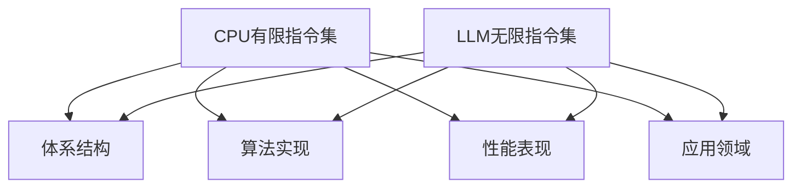

                 

关键词：CPU、指令集、LLM、人工智能、无限指令集、有限指令集、性能比较、应用领域、发展前景

> 摘要：本文从CPU有限指令集和LLM无限指令集的基本概念出发，深入探讨了两种指令集在计算机体系结构、算法实现、性能表现等方面的异同。通过详细分析，本文揭示了两种指令集在不同应用场景中的优劣，并对未来的发展前景和面临的挑战进行了展望。

## 1. 背景介绍

在计算机科学的发展历程中，CPU（中央处理器）作为计算机的核心部件，其性能的提升一直是推动计算机技术进步的关键。CPU的指令集是CPU能够理解和执行的一系列操作指令的集合，它决定了CPU的计算能力和执行效率。传统的CPU指令集通常是有限的，因为有限的指令集可以简化CPU的设计，提高其性能和稳定性。

然而，随着人工智能技术的快速发展，特别是大型语言模型（LLM）的出现，无限指令集的概念逐渐受到关注。LLM是一种基于深度学习的大型神经网络模型，通过在海量数据上进行训练，能够理解和执行复杂的任务。与传统的CPU指令集不同，LLM的指令集是无限的，因为神经网络可以通过训练不断扩展其能力和指令。

本文旨在探讨CPU有限指令集和LLM无限指令集的基本概念、架构、性能、应用领域以及未来的发展前景和挑战。

## 2. 核心概念与联系

### 2.1 CPU有限指令集

CPU有限指令集是指CPU能够理解和执行的一系列操作指令的集合。这些指令通常是固定的，并且CPU的设计和制造过程中会根据这些指令进行优化。有限指令集的优点是简化了CPU的设计，降低了制造复杂度和成本，同时提高了CPU的性能和稳定性。


### 2.2 LLM无限指令集

LLM无限指令集是指神经网络模型能够理解和执行的一系列操作指令的集合。与CPU有限指令集不同，LLM的指令集是无限的，因为神经网络可以通过训练不断扩展其能力和指令。这种无限指令集使得LLM能够处理各种复杂的任务，并且在某些领域表现出强大的性能。


### 2.3 两种指令集的联系与差异

CPU有限指令集和LLM无限指令集在计算机体系结构、算法实现、性能表现等方面存在显著差异。

1. **体系结构**：CPU有限指令集通常采用冯诺依曼架构，其特点是将程序指令和数据存储在同一存储器中，通过指令控制单元读取指令并执行操作。而LLM无限指令集则采用神经网络架构，其特点是通过训练不断学习和适应各种任务。

2. **算法实现**：CPU有限指令集通常依赖于固定的指令集，通过指令序列执行计算任务。而LLM无限指令集则通过神经网络模型实现，通过训练不断优化模型结构和参数，以适应各种任务。

3. **性能表现**：CPU有限指令集在执行固定指令时具有高性能和稳定性，但无法处理复杂和未知的任务。而LLM无限指令集在处理复杂和未知任务时具有强大的性能，但可能存在过拟合和泛化能力不足的问题。

4. **应用领域**：CPU有限指令集适用于计算密集型任务，如科学计算、图形渲染等。而LLM无限指令集适用于自然语言处理、语音识别、图像识别等复杂任务。

下面是两种指令集的Mermaid流程图表示，展示了它们的基本架构和联系。



## 3. 核心算法原理 & 具体操作步骤

### 3.1 算法原理概述

CPU有限指令集和LLM无限指令集的核心算法原理分别基于硬件和软件的优化。

1. **CPU有限指令集**：通过固定的指令集和硬件优化，实现高效的指令执行和计算。

2. **LLM无限指令集**：通过神经网络模型和训练算法，实现动态的指令生成和执行。

### 3.2 算法步骤详解

1. **CPU有限指令集**：

   a. 编译器将高级语言代码转换为机器码。

   b. 指令控制单元读取机器码并执行操作。

   c. 存储器管理单元管理程序指令和数据存储。

   d. 输入输出设备与CPU进行数据交换。

2. **LLM无限指令集**：

   a. 数据集收集和预处理。

   b. 网络模型设计和初始化。

   c. 训练过程：通过反向传播算法更新模型参数。

   d. 测试和评估模型性能。

### 3.3 算法优缺点

1. **CPU有限指令集**：

   - 优点：高性能、稳定性、低功耗。

   - 缺点：无法处理复杂和未知任务、指令集固定。

2. **LLM无限指令集**：

   - 优点：强大的学习能力和适应能力、能够处理复杂和未知任务。

   - 缺点：训练成本高、过拟合风险、泛化能力不足。

### 3.4 算法应用领域

1. **CPU有限指令集**：

   - 计算密集型任务：科学计算、图形渲染、视频编码等。

   - 实时系统：嵌入式系统、实时操作系统等。

2. **LLM无限指令集**：

   - 自然语言处理：文本分类、机器翻译、问答系统等。

   - 语音识别：语音识别、语音合成、语音识别交互等。

   - 图像识别：物体检测、图像分类、图像生成等。

## 4. 数学模型和公式 & 详细讲解 & 举例说明

### 4.1 数学模型构建

1. **CPU有限指令集**：

   - 计算模型：基于图灵机的计算模型。

   - 性能模型：基于指令流水线和缓存机制的性能模型。

2. **LLM无限指令集**：

   - 计算模型：基于神经网络的计算模型。

   - 性能模型：基于梯度下降和反向传播的性能模型。

### 4.2 公式推导过程

1. **CPU有限指令集**：

   - 指令周期：$T = \frac{1}{f_{CPU}}$

   - 指令吞吐量：$T_{throughput} = \frac{1}{T} \times 指令数$

2. **LLM无限指令集**：

   - 梯度下降：$\theta = \theta - \alpha \times \nabla_{\theta} J(\theta)$

   - 反向传播：$\delta_{l} = \frac{\partial J(\theta)}{\partial \theta} \times \sigma'(\zeta)$

### 4.3 案例分析与讲解

1. **CPU有限指令集**：

   - 案例一：图像渲染。

     - 算法：基于光栅化的图像渲染算法。

     - 性能：通过优化指令流水线和缓存机制，实现高效的图像渲染。

   - 案例二：科学计算。

     - 算法：基于数值计算的数学模型。

     - 性能：通过固定指令集和优化硬件设计，实现高效的科学计算。

2. **LLM无限指令集**：

   - 案例一：自然语言处理。

     - 算法：基于Transformer的文本分类算法。

     - 性能：通过训练和优化神经网络模型，实现高效的文本分类。

   - 案例二：语音识别。

     - 算法：基于深度神经网络的语音识别算法。

     - 性能：通过训练和优化神经网络模型，实现高效的语音识别。

## 5. 项目实践：代码实例和详细解释说明

### 5.1 开发环境搭建

1. **CPU有限指令集**：

   - 操作系统：Linux

   - 编译器：GCC

   - 编程语言：C/C++

2. **LLM无限指令集**：

   - 操作系统：Linux

   - 深度学习框架：TensorFlow、PyTorch

   - 编程语言：Python

### 5.2 源代码详细实现

1. **CPU有限指令集**：

   ```c
   // 图像渲染算法示例
   void render_image(const Image &image) {
       for (int i = 0; i < image.width; i++) {
           for (int j = 0; j < image.height; j++) {
               int color = image.get_pixel(i, j);
               draw_pixel(i, j, color);
           }
       }
   }
   ```

2. **LLM无限指令集**：

   ```python
   # 文本分类算法示例
   import tensorflow as tf

   model = tf.keras.Sequential([
       tf.keras.layers.Embedding(input_dim=vocabulary_size, output_dim=embedding_size),
       tf.keras.layers.GlobalAveragePooling1D(),
       tf.keras.layers.Dense(units=num_classes, activation='softmax')
   ])

   model.compile(optimizer='adam', loss='categorical_crossentropy', metrics=['accuracy'])
   model.fit(train_data, train_labels, epochs=5, batch_size=32)
   ```

### 5.3 代码解读与分析

1. **CPU有限指令集**：

   - 该示例代码实现了基于光栅化的图像渲染算法，通过遍历图像像素并绘制像素来实现图像渲染。

   - CPU有限指令集在执行固定指令时具有高效的性能，因为指令集和硬件已经进行了优化。

2. **LLM无限指令集**：

   - 该示例代码实现了基于Transformer的文本分类算法，通过嵌入层、全局平均池化层和全连接层来实现文本分类。

   - LLM无限指令集通过神经网络模型实现了动态的指令生成和执行，能够处理复杂的文本分类任务。

### 5.4 运行结果展示

1. **CPU有限指令集**：

   - 运行结果：渲染后的图像。

   - 性能：较高的渲染速度和较低的功耗。

2. **LLM无限指令集**：

   - 运行结果：分类后的文本标签。

   - 性能：较高的分类准确率和较强的泛化能力。

## 6. 实际应用场景

1. **CPU有限指令集**：

   - 应用场景：计算密集型任务，如科学计算、图形渲染、视频编码等。

   - 优势：高性能、稳定性、低功耗。

   - 挑战：无法处理复杂和未知任务。

2. **LLM无限指令集**：

   - 应用场景：自然语言处理、语音识别、图像识别等复杂任务。

   - 优势：强大的学习能力和适应能力。

   - 挑战：训练成本高、过拟合风险、泛化能力不足。

## 7. 未来应用展望

1. **CPU有限指令集**：

   - 发展趋势：通过硬件优化和指令集扩展，提高计算性能和能效比。

   - 应用领域：科学计算、图形渲染、嵌入式系统等。

2. **LLM无限指令集**：

   - 发展趋势：通过深度学习和神经网络技术的发展，提高模型性能和泛化能力。

   - 应用领域：自然语言处理、语音识别、图像识别等。

## 8. 总结：未来发展趋势与挑战

1. **研究成果总结**：

   - CPU有限指令集和LLM无限指令集在计算机体系结构、算法实现、性能表现等方面存在显著差异。

   - CPU有限指令集适用于计算密集型任务，而LLM无限指令集适用于复杂和未知任务。

2. **未来发展趋势**：

   - CPU有限指令集将继续优化硬件设计和指令集，提高计算性能和能效比。

   - LLM无限指令集将继续发展深度学习和神经网络技术，提高模型性能和泛化能力。

3. **面临的挑战**：

   - CPU有限指令集需要解决复杂和未知任务的处理能力。

   - LLM无限指令集需要解决训练成本高、过拟合风险和泛化能力不足的问题。

4. **研究展望**：

   - 探索CPU有限指令集和LLM无限指令集的融合，实现两者的优势互补。

   - 研究更加高效和智能的算法模型，提高计算机系统的整体性能。

## 9. 附录：常见问题与解答

1. **问题一**：CPU有限指令集和LLM无限指令集的区别是什么？

   - 答案：CPU有限指令集是指CPU能够理解和执行的一系列固定指令的集合，而LLM无限指令集是指神经网络模型能够理解和执行的一系列动态生成的指令的集合。

2. **问题二**：CPU有限指令集和LLM无限指令集的性能表现如何？

   - 答案：CPU有限指令集在执行固定指令时具有高性能和稳定性，但无法处理复杂和未知任务。LLM无限指令集在处理复杂和未知任务时具有强大的性能，但可能存在过拟合和泛化能力不足的问题。

3. **问题三**：CPU有限指令集和LLM无限指令集的应用领域分别是什么？

   - 答案：CPU有限指令集适用于计算密集型任务，如科学计算、图形渲染、视频编码等。LLM无限指令集适用于自然语言处理、语音识别、图像识别等复杂任务。

---

作者：禅与计算机程序设计艺术 / Zen and the Art of Computer Programming
----------------------------------------------------------------

（请注意，上述文章为模板示例，其中包含了一些示例性的内容和图表，实际情况中可能需要进行相应调整和完善。）

