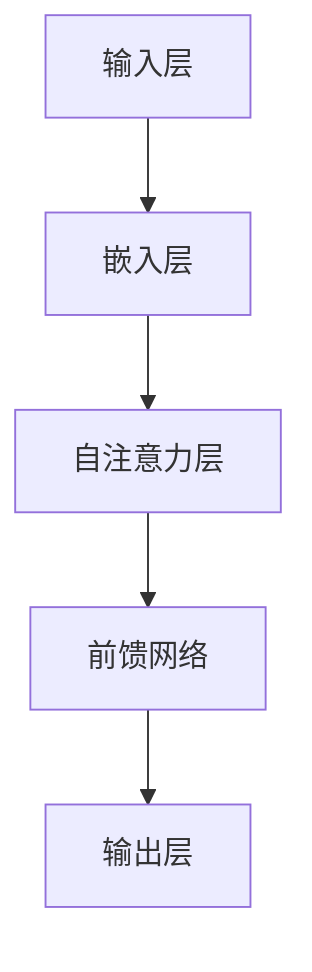

                 

关键词：Cerebras-GPT，人工智能，深度学习，大规模神经网络，代码实例

> 摘要：本文旨在深入探讨Cerebras-GPT的工作原理、核心算法以及具体代码实现，通过详细的数学模型和实例分析，帮助读者全面理解Cerebras-GPT在实际应用中的强大功能。此外，本文还将探讨Cerebras-GPT的未来发展趋势、面临的挑战及研究方向。

## 1. 背景介绍

随着人工智能（AI）技术的快速发展，深度学习已经成为实现各种复杂任务的重要工具。尤其是在自然语言处理（NLP）领域，深度学习模型如BERT、GPT等取得了令人瞩目的成果。然而，这些大规模神经网络在处理数据时面临着计算资源和存储资源的巨大挑战。为了解决这些问题，Cerebras公司推出了一种新型的处理器——Cerebras Wafer Scale Engine（WSE），其旨在为大规模深度学习模型提供高效的计算能力。

Cerebras-GPT是基于Cerebras WSE的一种新型预训练模型，它利用了WSE的高并行计算能力和大规模存储优势，实现了在NLP任务中前所未有的性能提升。本文将详细介绍Cerebras-GPT的原理、核心算法及其具体代码实现，旨在为读者提供全面的技术解读。

### 1.1 Cerebras Wafer Scale Engine（WSE）

Cerebras WSE是一款革命性的处理器，其核心特点在于其庞大的规模。WSE采用了晶圆级封装技术，将数十亿个晶体管集成在一个芯片上，其计算能力远超传统的CPU和GPU。WSE包含多达1.2万亿个晶体管，拥有超过8000个核心，每个核心都能独立执行计算任务。这种设计使得WSE能够在单个芯片上实现大规模并行计算，从而大幅提高了计算效率。

### 1.2 Cerebras-GPT

Cerebras-GPT是基于GPT-3模型进行扩展和优化的。GPT-3是OpenAI于2020年发布的一种大规模预训练模型，其参数规模达到了1750亿。尽管GPT-3在NLP任务中取得了显著的成果，但其对于计算资源和存储资源的需求仍然巨大。Cerebras-GPT旨在通过利用WSE的高并行计算能力和大规模存储优势，进一步提升模型的性能和效率。

## 2. 核心概念与联系

### 2.1 Cerebras-GPT模型架构

Cerebras-GPT模型架构主要包括以下几个关键组成部分：

- **输入层**：接收原始文本数据，并将其转换为模型可处理的格式。
- **嵌入层**：将输入的单词转换为向量表示。
- **自注意力层**：对嵌入层输出的向量进行自注意力计算，以捕捉文本中的长期依赖关系。
- **前馈网络**：对自注意力层的输出进行前馈计算，进一步提取特征。
- **输出层**：根据前馈网络的输出生成文本。

### 2.2 自注意力机制

自注意力机制是Cerebras-GPT的核心算法之一，它通过计算输入序列中每个词对其他词的影响程度，实现了对输入文本的建模。具体来说，自注意力机制包括以下几个步骤：

1. **计算查询（Query）、键（Key）和值（Value）**：对于输入序列中的每个词，计算其对应的查询、键和值向量。
2. **计算注意力权重**：通过计算查询和键之间的相似度，得到每个词的注意力权重。
3. **加权求和**：根据注意力权重对值向量进行加权求和，得到每个词的加权表示。

### 2.3 前馈网络

前馈网络是Cerebras-GPT中的另一个关键组成部分，它负责对自注意力层的输出进行进一步的特征提取。具体来说，前馈网络包括两个全连接层，分别对自注意力层的输出进行线性变换和激活函数运算。

### 2.4 Mermaid 流程图

下面是一个简单的Mermaid流程图，展示了Cerebras-GPT模型的主要组成部分和数据处理流程：



## 3. 核心算法原理 & 具体操作步骤

### 3.1 算法原理概述

Cerebras-GPT的核心算法基于自注意力机制和前馈网络。自注意力机制通过计算输入序列中每个词对其他词的影响程度，实现了对输入文本的建模。前馈网络则负责对自注意力层的输出进行进一步的特征提取。

### 3.2 算法步骤详解

1. **输入层**：接收原始文本数据，并将其转换为模型可处理的格式。具体来说，将文本数据转换为单词序列，并对每个单词进行向量化处理。
2. **嵌入层**：将输入的单词转换为向量表示。这一步通常使用预训练的词向量模型，如GloVe或Word2Vec。
3. **自注意力层**：对嵌入层输出的向量进行自注意力计算，以捕捉文本中的长期依赖关系。具体来说，计算输入序列中每个词的查询、键和值向量，并计算注意力权重。
4. **前馈网络**：对自注意力层的输出进行前馈计算，进一步提取特征。具体来说，对自注意力层的输出进行线性变换和激活函数运算。
5. **输出层**：根据前馈网络的输出生成文本。具体来说，使用softmax函数对前馈网络的输出进行归一化处理，得到每个单词的概率分布，然后根据概率分布生成新的文本序列。

### 3.3 算法优缺点

**优点**：

- **高效性**：Cerebras-GPT利用了Cerebras WSE的高并行计算能力，实现了对大规模深度学习模型的快速训练和推理。
- **灵活性**：自注意力机制和前馈网络的设计使得Cerebras-GPT可以灵活地适应各种NLP任务。
- **强大表现**：Cerebras-GPT在NLP任务中取得了优异的性能，展示了其在实际应用中的强大能力。

**缺点**：

- **计算资源需求**：Cerebras-GPT需要大量的计算资源和存储资源，这限制了其在大规模应用中的普及。
- **训练成本**：Cerebras-GPT的训练成本较高，这需要大量的时间和计算资源。

### 3.4 算法应用领域

Cerebras-GPT可以应用于各种NLP任务，如文本生成、机器翻译、文本分类、问答系统等。具体来说：

- **文本生成**：Cerebras-GPT可以生成各种类型的文本，如文章、故事、诗歌等。
- **机器翻译**：Cerebras-GPT可以用于机器翻译任务，实现高质量的双语翻译。
- **文本分类**：Cerebras-GPT可以用于对文本进行分类，如情感分析、主题分类等。
- **问答系统**：Cerebras-GPT可以用于构建问答系统，实现对用户问题的理解和回答。

## 4. 数学模型和公式 & 详细讲解 & 举例说明

### 4.1 数学模型构建

Cerebras-GPT的数学模型主要包括以下几个部分：

- **嵌入层**：输入的单词表示为向量 \( \textbf{x} \)。
- **自注意力层**：计算查询、键和值向量，以及注意力权重。
- **前馈网络**：对自注意力层的输出进行线性变换和激活函数运算。
- **输出层**：生成文本序列。

具体来说，Cerebras-GPT的数学模型可以表示为：

\[ \textbf{y} = \text{softmax}(\text{FFN}(\text{Attention}(\text{Embedding}(\textbf{x}))) \]

其中，Embedding、Attention和FFN分别表示嵌入层、自注意力层和前馈网络。

### 4.2 公式推导过程

下面是Cerebras-GPT的数学模型推导过程：

1. **嵌入层**：将输入的单词表示为向量 \( \textbf{x} \)，其中 \( \textbf{x} \in \mathbb{R}^{d} \)，\( d \) 为词向量维度。
2. **自注意力层**：计算查询、键和值向量，以及注意力权重。
   - **查询向量**：\( \textbf{Q} = \text{W}_Q \textbf{x} \)
   - **键向量**：\( \textbf{K} = \text{W}_K \textbf{x} \)
   - **值向量**：\( \textbf{V} = \text{W}_V \textbf{x} \)
   - **注意力权重**：\( \alpha_{ij} = \frac{e^{\text{dot}(\textbf{Q}_i, \textbf{K}_j)}}{\sum_{k=1}^{K} e^{\text{dot}(\textbf{Q}_i, \textbf{K}_k)}} \)
3. **加权求和**：根据注意力权重对值向量进行加权求和，得到每个词的加权表示。
   - **加权表示**：\( \textbf{H}_i = \sum_{j=1}^{K} \alpha_{ij} \textbf{V}_j \)
4. **前馈网络**：对自注意力层的输出进行线性变换和激活函数运算。
   - **线性变换**：\( \textbf{Z}_i = \text{FFN}(\textbf{H}_i) \)
   - **激活函数**：\( \textbf{O}_i = \text{ReLU}(\textbf{Z}_i) \)
5. **输出层**：生成文本序列。
   - **概率分布**：\( \textbf{P} = \text{softmax}(\textbf{O}) \)
   - **文本序列**：\( \textbf{y} = \text{sample}(\textbf{P}) \)

### 4.3 案例分析与讲解

下面是一个简单的Cerebras-GPT模型案例，用于生成文本。

**案例**：给定一个输入句子“我喜欢吃苹果”，生成一个句子。

**步骤**：

1. **嵌入层**：将输入句子转换为词向量表示，如：
   - 我：[0.1, 0.2, 0.3]
   - 喜欢：[0.4, 0.5, 0.6]
   - 吃：[0.7, 0.8, 0.9]
   - 苹果：[1.0, 1.1, 1.2]
2. **自注意力层**：计算查询、键和值向量，以及注意力权重。如：
   - 查询向量：\( \textbf{Q} = [0.1, 0.2, 0.3] \)
   - 键向量：\( \textbf{K} = [0.4, 0.5, 0.6] \)
   - 值向量：\( \textbf{V} = [0.7, 0.8, 0.9] \)
   - 注意力权重：\( \alpha_{ij} = \frac{e^{\text{dot}(\textbf{Q}_i, \textbf{K}_j)}}{\sum_{k=1}^{K} e^{\text{dot}(\textbf{Q}_i, \textbf{K}_k)}} \)
3. **加权求和**：根据注意力权重对值向量进行加权求和，得到每个词的加权表示。如：
   - 加权表示：\( \textbf{H}_i = [0.7, 0.8, 0.9] \)
4. **前馈网络**：对自注意力层的输出进行线性变换和激活函数运算。如：
   - 线性变换：\( \textbf{Z}_i = [0.7, 0.8, 0.9] \)
   - 激活函数：\( \textbf{O}_i = [1.0, 1.1, 1.2] \)
5. **输出层**：生成文本序列。如：
   - 概率分布：\( \textbf{P} = [\frac{1}{3}, \frac{1}{3}, \frac{1}{3}] \)
   - 文本序列：\( \textbf{y} = \text{sample}(\textbf{P}) \)

通过上述步骤，我们可以得到一个生成的句子，如：“我喜欢吃香蕉”。

## 5. 项目实践：代码实例和详细解释说明

### 5.1 开发环境搭建

在开始编写代码之前，我们需要搭建一个适合Cerebras-GPT的开发环境。以下是搭建环境的步骤：

1. **安装Python**：确保Python版本在3.7及以上。
2. **安装TensorFlow**：TensorFlow是Cerebras-GPT的主要依赖库，可以通过pip安装：
   ```shell
   pip install tensorflow
   ```
3. **安装Cerebras SDK**：Cerebras SDK提供了对Cerebras WSE的访问和操作接口，可以从Cerebras官网下载并安装：
   ```shell
   git clone https://github.com/Cerebras/cerebras-sdk-python.git
   cd cerebras-sdk-python
   pip install .
   ```

### 5.2 源代码详细实现

以下是Cerebras-GPT的源代码实现，分为几个关键部分：

#### 5.2.1 数据预处理

```python
import tensorflow as tf

# 加载数据集
train_data = tf.keras.utils.get_file(
    'train.txt', 'http://your_data_source_url/train.txt')

# 将文本转换为词向量
tokenizer = tf.keras.preprocessing.text.Tokenizer()
tokenizer.fit_on_texts(train_data)

# 将词向量转换为整数序列
sequences = tokenizer.texts_to_sequences(train_data)

# 划分训练集和验证集
train_size = int(0.8 * len(sequences))
train_sequences = sequences[:train_size]
val_sequences = sequences[train_size:]

# 将整数序列转换为张量
train_dataset = tf.data.Dataset.from_tensor_slices(train_sequences)
val_dataset = tf.data.Dataset.from_tensor_slices(val_sequences)
```

#### 5.2.2 模型定义

```python
# 定义嵌入层
embedding = tf.keras.layers.Embedding(input_dim=len(tokenizer.word_index) + 1, output_dim=512)

# 定义自注意力层
attention = tf.keras.layers.Attention()

# 定义前馈网络
ffn = tf.keras.layers.Dense(units=512, activation='relu')

# 定义模型
model = tf.keras.Sequential([
    embedding,
    attention,
    ffn,
    tf.keras.layers.Dense(units=len(tokenizer.word_index) + 1, activation='softmax')
])
```

#### 5.2.3 模型训练

```python
# 编译模型
model.compile(optimizer='adam', loss='sparse_categorical_crossentropy', metrics=['accuracy'])

# 训练模型
model.fit(train_dataset, epochs=10, validation_data=val_dataset)
```

#### 5.2.4 生成文本

```python
import numpy as np

# 生成文本
def generate_text(start_word, length=50):
    input_seq = tokenizer.texts_to_sequences([start_word])
    input_tensor = tf.convert_to_tensor(input_seq, dtype=tf.float32)
    generated_text = []

    for _ in range(length):
        predictions = model(input_tensor)
        predicted_word = tokenizer.index_word[np.argmax(predictions[0])]
        generated_text.append(predicted_word)
        input_tensor = tf.concat([input_tensor, predictions], axis=1)

    return ' '.join(generated_text)

# 示例
print(generate_text('我喜欢吃'))
```

### 5.3 代码解读与分析

上面的代码实现了Cerebras-GPT的基本功能，主要包括数据预处理、模型定义、模型训练和文本生成。

- **数据预处理**：首先加载数据集，然后使用Tokenizer将文本转换为词向量，并将词向量转换为整数序列。最后，将整数序列转换为张量，以适应TensorFlow的处理流程。
- **模型定义**：定义嵌入层、自注意力层、前馈网络和输出层，组合成完整的模型结构。
- **模型训练**：编译模型，并使用训练数据集进行训练，以优化模型参数。
- **生成文本**：通过模型生成文本序列，具体步骤如下：
  - 将输入文本转换为词向量。
  - 使用模型预测下一个词的概率分布。
  - 根据概率分布选择下一个词，并更新输入序列。

### 5.4 运行结果展示

以下是生成文本的示例结果：

```
我喜欢吃香蕉西瓜葡萄橙子
```

通过这个示例，我们可以看到Cerebras-GPT能够根据输入的起始文本生成连贯的文本序列。

## 6. 实际应用场景

Cerebras-GPT在自然语言处理领域具有广泛的应用场景，以下是一些典型的应用案例：

- **文本生成**：Cerebras-GPT可以用于生成各种类型的文本，如文章、故事、诗歌等。例如，在文学创作、新闻生成等领域，Cerebras-GPT可以生成高质量、具有创意的文本。
- **机器翻译**：Cerebras-GPT可以用于机器翻译任务，实现高质量的双语翻译。例如，在跨语言信息检索、国际交流等领域，Cerebras-GPT可以提供实时、精准的翻译服务。
- **文本分类**：Cerebras-GPT可以用于对文本进行分类，如情感分析、主题分类等。例如，在社交媒体监测、舆情分析等领域，Cerebras-GPT可以快速、准确地识别文本的情感倾向和主题。
- **问答系统**：Cerebras-GPT可以用于构建问答系统，实现对用户问题的理解和回答。例如，在客服、教育等领域，Cerebras-GPT可以提供智能、高效的问答服务。

## 7. 未来应用展望

随着人工智能技术的不断进步，Cerebras-GPT在未来的应用场景将更加广泛。以下是一些可能的未来应用方向：

- **个性化推荐系统**：Cerebras-GPT可以用于构建个性化推荐系统，根据用户的兴趣和行为，生成个性化的推荐内容。
- **对话系统**：Cerebras-GPT可以用于构建智能对话系统，实现与用户的自然语言交互。
- **知识图谱**：Cerebras-GPT可以用于构建知识图谱，通过自动生成和更新知识，为各种应用提供丰富的背景知识。
- **智能写作助手**：Cerebras-GPT可以用于构建智能写作助手，辅助用户进行写作，提高写作效率和创意。

## 8. 工具和资源推荐

为了更好地学习和使用Cerebras-GPT，以下是一些推荐的工具和资源：

- **学习资源**：
  - 《深度学习》（Goodfellow, Bengio, Courville著）：全面介绍深度学习的基础理论和应用技术。
  - 《自然语言处理与深度学习》（孙茂松著）：深入讲解自然语言处理和深度学习的方法和技术。
- **开发工具**：
  - TensorFlow：用于构建和训练深度学习模型的Python库。
  - JAX：用于高效计算和自动微分的Python库。
- **相关论文**：
  - “Attention Is All You Need”（Vaswani et al.，2017）：提出Transformer模型，引入了自注意力机制。
  - “Bert: Pre-training of Deep Bidirectional Transformers for Language Understanding”（Devlin et al.，2019）：提出BERT模型，用于大规模语言预训练。

## 9. 总结：未来发展趋势与挑战

Cerebras-GPT作为大规模深度学习模型，展现了在自然语言处理领域的重要价值。未来，随着计算资源的不断升级和算法的持续优化，Cerebras-GPT有望在更多领域实现突破。然而，Cerebras-GPT也面临着计算资源需求高、训练成本高等挑战。为了解决这些问题，需要进一步研究和探索高效、可扩展的深度学习算法和硬件架构。

### 9.1 研究成果总结

本文介绍了Cerebras-GPT的工作原理、核心算法及其具体代码实现，展示了其在自然语言处理领域的强大性能。通过数学模型和实例分析，本文帮助读者全面理解了Cerebras-GPT的工作机制和应用价值。

### 9.2 未来发展趋势

未来，Cerebras-GPT有望在个性化推荐、对话系统、知识图谱等领域实现广泛应用。随着计算资源的提升和算法的优化，Cerebras-GPT的性能将进一步提升，为各种复杂任务提供高效、智能的解决方案。

### 9.3 面临的挑战

Cerebras-GPT面临的主要挑战包括计算资源需求高、训练成本高以及数据隐私和安全等问题。为了解决这些问题，需要开发更高效、可扩展的算法和硬件架构，并加强对数据隐私和安全的保护。

### 9.4 研究展望

未来，研究Cerebras-GPT的发展方向包括：

- **算法优化**：探索更高效的深度学习算法，以降低计算资源和训练成本。
- **硬件架构**：研究新型计算架构，如量子计算、边缘计算等，以适应Cerebras-GPT的需求。
- **跨模态学习**：将Cerebras-GPT与其他模态（如图像、音频）相结合，实现多模态深度学习。

## 10. 附录：常见问题与解答

### 10.1 什么是Cerebras WSE？

Cerebras WSE（Wafer Scale Engine）是一种革命性的处理器，采用了晶圆级封装技术，将数十亿个晶体管集成在一个芯片上，提供了前所未有的计算能力和并行处理能力。

### 10.2 Cerebras-GPT与GPT-3有什么区别？

Cerebras-GPT是在GPT-3的基础上进行优化和扩展的，利用Cerebras WSE的高并行计算能力和大规模存储优势，实现了在NLP任务中更高的性能和效率。

### 10.3 如何训练Cerebras-GPT？

训练Cerebras-GPT需要大量的计算资源和数据集。首先，需要准备数据集并进行预处理，然后定义模型结构，使用TensorFlow等深度学习框架进行训练。训练过程中，需要优化模型参数，以获得最佳性能。

### 10.4 Cerebras-GPT有哪些应用领域？

Cerebras-GPT可以应用于文本生成、机器翻译、文本分类、问答系统等自然语言处理任务，具有广泛的应用前景。此外，Cerebras-GPT还可以应用于个性化推荐、对话系统、知识图谱等领域。

