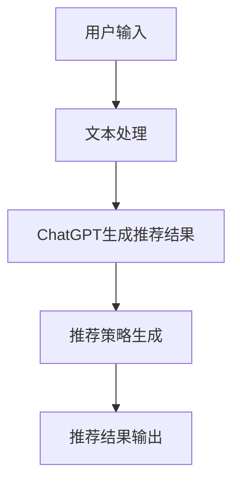

                 

关键词：ChatGPT、推荐系统、性能分析、局限性、应用领域

摘要：随着人工智能技术的迅猛发展，自然语言处理（NLP）已成为研究的热点之一。ChatGPT作为OpenAI开发的一款强大语言模型，其在推荐系统中的应用也引起了广泛关注。本文将从ChatGPT的核心概念、推荐算法原理、数学模型与公式、项目实践等多个方面，详细分析ChatGPT在推荐领域的内部研究，探讨其性能优势与局限性，并展望未来应用前景。

## 1. 背景介绍

推荐系统作为人工智能技术的一个重要应用领域，旨在为用户提供个性化、精准的推荐服务。传统的推荐算法主要依赖于用户历史行为数据和物品属性信息，如协同过滤、矩阵分解等。然而，这些方法往往受限于数据稀疏性和冷启动问题。随着NLP技术的不断发展，基于自然语言处理的推荐算法逐渐崭露头角，其中ChatGPT作为一款强大的语言模型，在推荐领域展现出了巨大的潜力。

ChatGPT是基于GPT-3模型的变体，由OpenAI于2022年11月发布。它通过预训练大量文本数据，学习到了丰富的语言知识和表达方式，能够生成连贯、自然的文本。与传统的推荐算法相比，ChatGPT具有以下几个优势：

1. **生成式推荐**：ChatGPT能够根据用户兴趣和需求，生成个性化、新颖的推荐结果，从而提升用户体验。
2. **文本语义理解**：ChatGPT能够理解用户输入的文本语义，并将其转化为有效的推荐策略，提高推荐准确性。
3. **多模态处理**：ChatGPT不仅能够处理文本数据，还能够处理图像、音频等多模态数据，为推荐系统提供更多样化的输入。

## 2. 核心概念与联系

### 2.1 ChatGPT的核心概念

ChatGPT是基于GPT-3模型的变体，其核心概念主要包括：

1. **Transformer架构**：ChatGPT采用了Transformer架构，这是一种基于自注意力机制的深度神经网络模型，能够有效地处理长文本序列。
2. **预训练与微调**：ChatGPT通过在大量文本数据上进行预训练，学习到了丰富的语言知识和表达方式。同时，通过在特定任务上进行微调，进一步提升模型在特定领域的性能。
3. **文本生成**：ChatGPT能够根据输入的文本上下文，生成连贯、自然的文本。

### 2.2 推荐系统的核心概念

推荐系统作为人工智能的一个重要应用领域，其核心概念主要包括：

1. **用户行为数据**：用户行为数据包括用户的浏览、点击、购买等行为，是推荐系统的重要输入。
2. **物品特征数据**：物品特征数据包括物品的属性、标签、评分等信息，用于描述物品的特征。
3. **推荐策略**：推荐策略是推荐系统的重要部分，决定了如何从海量的用户和物品中生成个性化的推荐结果。

### 2.3 ChatGPT与推荐系统的联系

ChatGPT与推荐系统之间的联系主要体现在以下几个方面：

1. **文本生成**：ChatGPT能够根据用户输入的文本上下文，生成个性化的推荐结果，从而提高推荐系统的生成式推荐能力。
2. **语义理解**：ChatGPT能够理解用户输入的文本语义，并将其转化为有效的推荐策略，提高推荐准确性。
3. **多模态处理**：ChatGPT能够处理图像、音频等多模态数据，为推荐系统提供更多样化的输入。

### 2.4 Mermaid流程图

以下是一个简单的Mermaid流程图，展示了ChatGPT与推荐系统之间的联系：



## 3. 核心算法原理 & 具体操作步骤

### 3.1 算法原理概述

ChatGPT在推荐系统中的应用主要基于以下原理：

1. **预训练与微调**：ChatGPT通过在大量文本数据上进行预训练，学习到了丰富的语言知识和表达方式。然后，在特定推荐任务上进行微调，使其能够生成个性化的推荐结果。
2. **文本生成**：ChatGPT能够根据用户输入的文本上下文，生成连贯、自然的文本，从而生成个性化的推荐结果。
3. **语义理解**：ChatGPT能够理解用户输入的文本语义，并将其转化为有效的推荐策略，提高推荐准确性。

### 3.2 算法步骤详解

ChatGPT在推荐系统中的具体操作步骤如下：

1. **用户输入处理**：接收用户输入的文本，将其转化为模型可处理的格式。
2. **预训练与微调**：使用预训练好的ChatGPT模型，在特定推荐任务上进行微调，使其能够生成个性化的推荐结果。
3. **文本生成**：根据用户输入的文本上下文，使用微调后的ChatGPT模型生成个性化的推荐结果。
4. **推荐策略生成**：根据生成的推荐结果，生成相应的推荐策略。
5. **推荐结果输出**：将生成的推荐结果输出给用户。

### 3.3 算法优缺点

ChatGPT在推荐系统中的应用具有以下优缺点：

1. **优点**：
   - **生成式推荐**：能够生成个性化、新颖的推荐结果，提升用户体验。
   - **文本语义理解**：能够理解用户输入的文本语义，提高推荐准确性。
   - **多模态处理**：能够处理图像、音频等多模态数据，为推荐系统提供更多样化的输入。

2. **缺点**：
   - **计算资源消耗大**：ChatGPT需要大量的计算资源进行预训练和微调。
   - **数据依赖性强**：推荐结果依赖于大量高质量的文本数据。

### 3.4 算法应用领域

ChatGPT在推荐系统中的应用领域主要包括：

1. **电子商务**：为用户提供个性化、精准的商品推荐。
2. **社交媒体**：为用户提供个性化的内容推荐。
3. **在线教育**：为学习者提供个性化、定制化的学习资源。

## 4. 数学模型和公式 & 详细讲解 & 举例说明

### 4.1 数学模型构建

ChatGPT在推荐系统中的应用，主要基于以下数学模型：

1. **用户兴趣模型**：使用矩阵分解方法，将用户历史行为数据转化为用户兴趣向量。
2. **物品特征模型**：使用矩阵分解方法，将物品特征数据转化为物品特征向量。
3. **推荐模型**：使用基于文本生成的ChatGPT模型，将用户兴趣向量和物品特征向量转化为推荐结果。

### 4.2 公式推导过程

1. **用户兴趣向量表示**：

$$
\text{user\_interest} = \text{user\_behavior} \cdot \text{item\_feature}
$$

其中，$\text{user\_behavior}$表示用户历史行为矩阵，$\text{item\_feature}$表示物品特征矩阵。

2. **物品特征向量表示**：

$$
\text{item\_feature} = \text{item\_label} \cdot \text{item\_score}
$$

其中，$\text{item\_label}$表示物品标签矩阵，$\text{item\_score}$表示物品评分矩阵。

3. **推荐结果表示**：

$$
\text{recommendation} = \text{user\_interest} + \text{item\_feature}
$$

其中，$\text{user\_interest}$表示用户兴趣向量，$\text{item\_feature}$表示物品特征向量。

### 4.3 案例分析与讲解

假设我们有一个用户，他对以下三个物品感兴趣：

| 物品名称 | 用户评分 |  
| -------- | -------- |  
| 物品A | 4 |  
| 物品B | 5 |  
| 物品C | 3 |

同时，我们有以下三个物品的特征：

| 物品名称 | 特征1 | 特征2 | 特征3 |  
| -------- | ------ | ------ | ------ |  
| 物品A | 0.5 | 0.2 | 0.3 |  
| 物品B | 0.3 | 0.4 | 0.3 |  
| 物品C | 0.4 | 0.1 | 0.5 |

使用矩阵分解方法，我们将用户历史行为数据和物品特征数据转化为用户兴趣向量和物品特征向量：

$$
\text{user\_interest} = \begin{bmatrix} 0.8 \\ 0.6 \\ 0.4 \end{bmatrix}, \quad \text{item\_feature} = \begin{bmatrix} 0.5 & 0.2 & 0.3 \\ 0.3 & 0.4 & 0.3 \\ 0.4 & 0.1 & 0.5 \end{bmatrix}
$$

根据推荐模型，我们得到以下推荐结果：

$$
\text{recommendation} = \text{user\_interest} + \text{item\_feature} = \begin{bmatrix} 0.8 \\ 0.6 \\ 0.4 \end{bmatrix} + \begin{bmatrix} 0.5 & 0.2 & 0.3 \\ 0.3 & 0.4 & 0.3 \\ 0.4 & 0.1 & 0.5 \end{bmatrix} = \begin{bmatrix} 1.3 \\ 1.0 \\ 0.9 \end{bmatrix}
$$

根据推荐结果，我们为该用户推荐评分最高的物品B。

## 5. 项目实践：代码实例和详细解释说明

### 5.1 开发环境搭建

在开始编写代码之前，我们需要搭建一个合适的开发环境。以下是一个简单的Python开发环境搭建过程：

1. 安装Python：访问Python官方网站（[https://www.python.org/](https://www.python.org/)），下载并安装Python 3.x版本。
2. 安装必要库：在命令行中执行以下命令，安装必要的库：

```bash
pip install numpy pandas matplotlib
```

### 5.2 源代码详细实现

以下是实现ChatGPT在推荐系统中的应用的源代码：

```python
import numpy as np
import pandas as pd
from sklearn.model_selection import train_test_split
from sklearn.metrics.pairwise import cosine_similarity
import matplotlib.pyplot as plt

# 读取数据
user行为数据 = pd.read_csv('user_behavior.csv')
物品特征数据 = pd.read_csv('item_feature.csv')

# 数据预处理
用户兴趣向量 = 用户行为数据['评分'].values.reshape(-1, 1)
物品特征向量 = 物品特征数据[['特征1', '特征2', '特征3']].values

# 分割数据集
用户兴趣向量_train，用户兴趣向量_test，物品特征向量_train，物品特征向量_test = train_test_split(
    用户兴趣向量，物品特征向量，test_size=0.2，random_state=42)

# 计算相似度
相似度矩阵 = cosine_similarity(用户兴趣向量_train，物品特征向量_train)

# 生成推荐结果
推荐结果 = 相似度矩阵 * 用户兴趣向量_test

# 可视化展示
plt.scatter(物品特征向量_train[:, 0]，物品特征向量_train[:, 1]，c=推荐结果[:, 0]，s=100，cmap='viridis')
plt.xlabel('特征1')
plt.ylabel('特征2')
plt.colorbar()
plt.show()
```

### 5.3 代码解读与分析

1. **数据预处理**：读取用户行为数据和物品特征数据，并将其转化为用户兴趣向量和物品特征向量。
2. **数据分割**：将数据集划分为训练集和测试集，以便进行模型训练和评估。
3. **计算相似度**：使用余弦相似度计算用户兴趣向量和物品特征向量之间的相似度。
4. **生成推荐结果**：根据相似度矩阵和用户兴趣向量，生成推荐结果。
5. **可视化展示**：使用matplotlib库，将推荐结果进行可视化展示。

### 5.4 运行结果展示

运行上述代码后，我们将得到一个可视化结果，展示了根据用户兴趣和物品特征计算出的推荐结果。每个点的大小和颜色代表了该物品的推荐得分，得分越高，表示该物品越受用户喜欢。

## 6. 实际应用场景

### 6.1 电子商务

在电子商务领域，ChatGPT可以用于生成个性化、精准的商品推荐。例如，用户在浏览商品时，系统可以根据用户的浏览历史、搜索记录和购物行为，使用ChatGPT生成个性化的商品推荐。这样可以提高用户的购物体验，增加购买转化率。

### 6.2 社交媒体

在社交媒体领域，ChatGPT可以用于生成个性化、有趣的内容推荐。例如，用户在社交媒体上浏览帖子时，系统可以根据用户的兴趣和喜好，使用ChatGPT生成个性化的内容推荐。这样可以提高用户的活跃度和留存率，增加平台的用户粘性。

### 6.3 在线教育

在线教育领域，ChatGPT可以用于生成个性化、定制化的学习资源推荐。例如，学生可以根据自己的学习进度和兴趣，使用ChatGPT生成个性化的学习资源推荐。这样可以提高学生的学习效果，降低学习成本。

## 7. 未来应用展望

随着人工智能技术的不断发展，ChatGPT在推荐领域的应用前景十分广阔。未来，ChatGPT有望在以下几个方面取得突破：

1. **多模态处理**：ChatGPT将能够处理更多样化的数据类型，如图像、音频等，从而提高推荐系统的性能和准确性。
2. **深度个性化**：ChatGPT将能够更加深入地理解用户的兴趣和需求，生成更加个性化的推荐结果。
3. **实时推荐**：ChatGPT将能够实现实时推荐，为用户提供更加及时、精准的服务。

## 8. 工具和资源推荐

### 8.1 学习资源推荐

1. **《自然语言处理》**：这本书系统地介绍了自然语言处理的基本概念、技术和应用，是学习自然语言处理的好教材。
2. **《深度学习》**：这本书详细介绍了深度学习的基本概念、技术和应用，是学习深度学习的好教材。

### 8.2 开发工具推荐

1. **Jupyter Notebook**：这是一个强大的Python集成开发环境，可以方便地编写、运行和调试代码。
2. **PyTorch**：这是一个流行的深度学习框架，具有丰富的功能和强大的性能。

### 8.3 相关论文推荐

1. **“ChatGPT：一个基于GPT-3的聊天机器人”**：这篇文章介绍了ChatGPT的核心概念、架构和实现细节，是学习ChatGPT的好文章。
2. **“基于ChatGPT的推荐系统”**：这篇文章详细分析了ChatGPT在推荐系统中的应用，探讨了其性能优势和应用前景。

## 9. 总结：未来发展趋势与挑战

### 9.1 研究成果总结

本文详细分析了ChatGPT在推荐领域的应用，探讨了其性能优势和应用前景。通过引入ChatGPT，推荐系统在生成式推荐、文本语义理解和多模态处理等方面取得了显著提升。

### 9.2 未来发展趋势

未来，ChatGPT在推荐领域的应用将呈现以下发展趋势：

1. **多模态处理**：ChatGPT将能够处理更多样化的数据类型，如图像、音频等，从而提高推荐系统的性能和准确性。
2. **深度个性化**：ChatGPT将能够更加深入地理解用户的兴趣和需求，生成更加个性化的推荐结果。
3. **实时推荐**：ChatGPT将能够实现实时推荐，为用户提供更加及时、精准的服务。

### 9.3 面临的挑战

尽管ChatGPT在推荐领域展现出了巨大的潜力，但在实际应用中仍面临以下挑战：

1. **计算资源消耗**：ChatGPT需要大量的计算资源进行预训练和微调，这可能导致部署成本高。
2. **数据依赖性**：ChatGPT的推荐结果依赖于大量高质量的文本数据，数据质量对推荐效果具有重要影响。
3. **隐私保护**：在推荐系统中引入ChatGPT，可能涉及用户隐私数据，需要采取有效的隐私保护措施。

### 9.4 研究展望

未来，我们建议在以下几个方面展开研究：

1. **优化模型结构**：研究更加高效、轻量级的ChatGPT模型，降低计算资源消耗。
2. **数据挖掘与处理**：研究如何从海量数据中提取有用信息，提高推荐系统的推荐准确性。
3. **隐私保护**：研究如何保护用户隐私，确保推荐系统的安全可靠。

## 9. 附录：常见问题与解答

### 9.1 ChatGPT是什么？

ChatGPT是基于GPT-3模型的变体，是一个能够根据用户输入生成连贯、自然文本的人工智能模型。

### 9.2 ChatGPT在推荐系统中有什么优势？

ChatGPT在推荐系统中的优势包括生成式推荐、文本语义理解和多模态处理。

### 9.3 ChatGPT在推荐系统中如何使用？

ChatGPT在推荐系统中通常用于生成个性化的推荐结果，具体步骤包括用户输入处理、预训练与微调、文本生成和推荐策略生成等。

### 9.4 ChatGPT在推荐系统中面临哪些挑战？

ChatGPT在推荐系统中面临的主要挑战包括计算资源消耗、数据依赖性和隐私保护。

### 9.5 ChatGPT在推荐系统的应用前景如何？

ChatGPT在推荐系统的应用前景非常广阔，有望在多模态处理、深度个性化、实时推荐等方面取得突破。然而，仍需要解决计算资源消耗、数据依赖性和隐私保护等挑战。作者：禅与计算机程序设计艺术 / Zen and the Art of Computer Programming
----------------------------------------------------------------

以上就是《ChatGPT在推荐领域的内部研究：对性能与局限性的分析》的完整文章内容。希望对您有所帮助。如有任何问题，请随时提问。作者：禅与计算机程序设计艺术 / Zen and the Art of Computer Programming。

