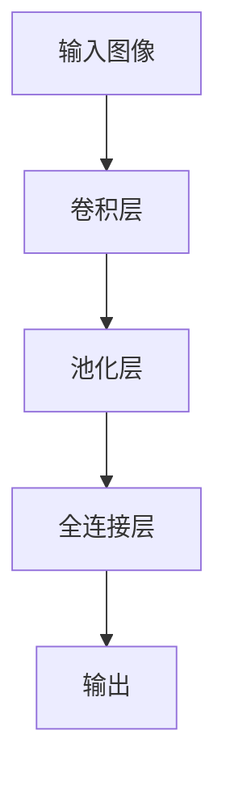

                 

关键词：卷积神经网络，CNN，图像识别，深度学习，神经网络架构，计算机视觉，图像处理，机器学习，算法实战，代码实现，数学模型，实战案例，开源项目。

## 摘要

本文旨在深入探讨卷积神经网络（Convolutional Neural Networks，CNN）的基本原理、架构设计以及实战应用。通过详细阐述CNN的数学模型、算法原理和具体操作步骤，本文将为读者提供一个全面的学习框架，帮助理解CNN在图像识别和计算机视觉领域的强大功能。同时，本文将通过实际项目案例，讲解如何使用CNN进行图像分类和目标检测，提供实用的代码示例和解读，以巩固读者对CNN的掌握。最后，本文将探讨CNN在现实世界中的应用场景，预测其未来发展趋势，并总结面临的主要挑战和解决方案。

## 1. 背景介绍

### 卷积神经网络的历史与发展

卷积神经网络（CNN）起源于20世纪80年代，最初由Yann LeCun等人提出，最初用于手写数字识别。随着计算能力的提升和大数据的涌现，CNN逐渐在图像识别和计算机视觉领域得到了广泛应用。2006年，LeCun等人提出了LeNet-5模型，成为第一个成功的CNN模型。此后，CNN的发展经历了多次重要里程碑，如2012年AlexNet模型的提出，标志着深度学习在图像识别领域取得了突破性进展。近年来，随着ResNet、Inception、MobileNet等模型的相继问世，CNN的性能和适用性得到了进一步提升。

### CNN在计算机视觉领域的应用

CNN在计算机视觉领域具有广泛的应用，包括但不限于图像分类、目标检测、人脸识别、图像分割等。在图像分类任务中，CNN可以自动提取图像特征，实现高精度的分类效果；在目标检测任务中，CNN不仅能够定位目标，还能区分不同类型的目标；人脸识别方面，CNN可以准确识别人脸特征，实现高效的身份验证；图像分割则可以将图像划分为多个区域，具有广泛的应用前景。随着技术的不断进步，CNN在医学图像分析、无人驾驶、安全监控等领域的应用也越来越广泛。

### 当前CNN的发展趋势与挑战

当前，CNN在图像识别和计算机视觉领域的应用已经取得了显著的成果，但仍然面临一些挑战。一方面，如何提高模型的泛化能力和鲁棒性是一个重要问题；另一方面，模型的训练和推理过程需要大量的计算资源和时间。此外，CNN的复杂性和过拟合风险也需要进一步研究和解决。为此，研究者们提出了多种改进方案，如迁移学习、数据增强、注意力机制等，以期提高CNN的性能和效率。

## 2. 核心概念与联系

### 卷积神经网络的基本组成

卷积神经网络由多个卷积层、池化层和全连接层组成。卷积层负责提取图像特征，池化层用于降低特征图的维度，全连接层则用于分类和回归。

### 卷积神经网络的架构

卷积神经网络的架构可以分为两个部分：卷积层和全连接层。卷积层包括多个卷积核，每个卷积核可以提取图像的局部特征；全连接层将卷积层输出的特征进行分类或回归。

### 卷积神经网络的工作原理

卷积神经网络的工作原理可以概括为以下几个步骤：首先，输入图像经过卷积层，通过卷积运算提取图像特征；然后，特征图经过池化层，降低特征图的维度；接着，将池化后的特征图输入全连接层，进行分类或回归。

### 卷积神经网络的优势和局限性

卷积神经网络的优势在于能够自动提取图像特征，实现高精度的分类和检测效果；其局限性在于模型复杂度高，训练和推理过程需要大量的计算资源和时间，同时容易过拟合。

### 卷积神经网络与其他神经网络的关系

卷积神经网络是深度学习中的一种重要类型，与传统的全连接神经网络相比，CNN在图像处理任务中具有更高的性能。此外，CNN还可以与其他神经网络如循环神经网络（RNN）和生成对抗网络（GAN）结合，实现更复杂的任务。

### CNN的核心概念原理和架构的 Mermaid 流程图



## 3. 核心算法原理 & 具体操作步骤

### 3.1 算法原理概述

卷积神经网络（CNN）的核心算法原理基于卷积操作和池化操作。卷积操作可以提取图像的特征，而池化操作可以降低特征图的维度，减少参数数量，提高计算效率。在CNN中，特征图通过多个卷积层和池化层的堆叠，最终输入到全连接层进行分类或回归。

### 3.2 算法步骤详解

1. **输入层**：输入一张图像，图像的大小为$N \times M \times C$，其中$N$为图像的高度，$M$为图像的宽度，$C$为图像的通道数。

2. **卷积层**：卷积层包含多个卷积核，每个卷积核的大小为$k \times k$。卷积操作通过滑动卷积核对输入图像进行卷积运算，得到特征图。特征图的大小为$(N-k+2p) \times (M-k+2p)$，其中$p$为填充值。

3. **激活函数**：常用的激活函数有ReLU（Rectified Linear Unit）和Sigmoid函数。ReLU函数可以加速模型训练，而Sigmoid函数可以产生非线性的输出。

4. **池化层**：池化层通常采用最大池化或平均池化。最大池化选取每个局部区域内的最大值，而平均池化则选取每个局部区域内的平均值。池化操作可以降低特征图的维度，减少计算量。

5. **全连接层**：全连接层将卷积层和池化层输出的特征图进行融合，通过矩阵乘法和激活函数得到最终的分类结果。

6. **损失函数**：常用的损失函数有交叉熵损失函数和均方误差损失函数。交叉熵损失函数适用于分类任务，而均方误差损失函数适用于回归任务。

7. **反向传播**：通过反向传播算法，计算梯度并更新模型参数，以达到最小化损失函数的目的。

### 3.3 算法优缺点

**优点**：
1. CNN能够自动提取图像特征，减少人工特征设计的复杂度。
2. CNN在图像识别和计算机视觉任务中取得了显著的效果。
3. CNN具有良好的层次结构，可以适应不同尺度和复杂度的图像特征。

**缺点**：
1. CNN模型的训练和推理过程需要大量的计算资源和时间。
2. CNN容易过拟合，尤其是在数据量较小的情况下。
3. CNN对于不同类型的图像特征处理能力不同，可能需要设计不同的网络结构。

### 3.4 算法应用领域

卷积神经网络在图像识别、目标检测、人脸识别、图像分割等多个领域具有广泛的应用。以下是一些典型的应用场景：

1. **图像分类**：使用CNN对图像进行分类，实现高精度的图像识别。
2. **目标检测**：在图像中检测并分类不同类型的对象，实现物体识别和跟踪。
3. **人脸识别**：通过CNN提取人脸特征，实现人脸识别和身份验证。
4. **图像分割**：将图像划分为多个区域，实现图像的语义分割。
5. **医学图像分析**：使用CNN对医学图像进行诊断和分类，辅助医生进行疾病诊断。

## 4. 数学模型和公式 & 详细讲解 & 举例说明

### 4.1 数学模型构建

卷积神经网络（CNN）的数学模型主要包括卷积层、池化层和全连接层。以下分别介绍这三个层次的基本公式和参数设置。

#### 4.1.1 卷积层

卷积层的输入为图像，大小为$N \times M \times C$，其中$N$为图像的高度，$M$为图像的宽度，$C$为图像的通道数。卷积层包含多个卷积核，每个卷积核的大小为$k \times k$，卷积核的数量为$d$。卷积操作的公式如下：

$$
\text{Feature Map}_{ij}^{l} = \sum_{i'}\sum_{j'} \text{Filter}_{i'j'}^{l-1}\text{Input}_{i'j'}^{l-1} + b^{l}
$$

其中，$\text{Feature Map}_{ij}^{l}$为第$l$层的特征图，$\text{Filter}_{i'j'}^{l-1}$为第$l-1$层的卷积核，$b^{l}$为第$l$层的偏置项。

#### 4.1.2 池化层

池化层用于降低特征图的维度，常用的池化操作包括最大池化和平均池化。最大池化的公式如下：

$$
\text{Pooled Value}_{ij}^{l} = \max_{k}(\text{Feature Map}_{i+kj+k}^{l})
$$

其中，$\text{Pooled Value}_{ij}^{l}$为第$l$层的池化结果，$k$为池化窗口的大小。

#### 4.1.3 全连接层

全连接层将卷积层和池化层输出的特征图进行融合，通过矩阵乘法和激活函数得到最终的分类结果。全连接层的公式如下：

$$
\text{Output}_{i}^{l} = \text{Weight}_{ij}^{l}\text{Input}_{j}^{l} + b^{l}
$$

其中，$\text{Output}_{i}^{l}$为第$l$层的输出，$\text{Weight}_{ij}^{l}$为第$l$层的权重，$b^{l}$为第$l$层的偏置项。

### 4.2 公式推导过程

#### 4.2.1 卷积层公式推导

假设输入图像为$I \in \mathbb{R}^{N \times M \times C}$，卷积核为$W \in \mathbb{R}^{k \times k \times C \times D}$，其中$k$为卷积核大小，$C$为输入通道数，$D$为输出通道数。卷积层的输出特征图为$F \in \mathbb{R}^{(N-k+2p) \times (M-k+2p) \times D}$，其中$p$为填充值。

首先，对输入图像进行填充操作，使其大小为$N' \times M'$，满足：

$$
N' = N + 2p - k + 1
$$

$$
M' = M + 2p - k + 1
$$

然后，对填充后的图像进行卷积操作，得到特征图：

$$
F_{ijd} = \sum_{i'=0}^{N'}\sum_{j'=0}^{M'} W_{i'j'cd} I_{i'j'c} + b_{d}
$$

其中，$F_{ijd}$为第$i$行、$j$列、第$d$个通道的特征值，$W_{i'j'cd}$为卷积核值，$b_{d}$为偏置项。

#### 4.2.2 池化层公式推导

假设输入特征图为$F \in \mathbb{R}^{(N-k+2p) \times (M-k+2p) \times D}$，池化窗口大小为$k$。最大池化的公式为：

$$
P_{ijd} = \max_{i' \in [0, k], j' \in [0, k]} F_{i'i'j'd}
$$

其中，$P_{ijd}$为第$i$行、$j$列、第$d$个通道的池化结果。

#### 4.2.3 全连接层公式推导

假设输入特征图为$F \in \mathbb{R}^{(N-k+2p) \times (M-k+2p) \times D}$，全连接层的权重为$W \in \mathbb{R}^{D \times K}$，其中$K$为输出维度，偏置项为$b \in \mathbb{R}^{K}$。全连接层的输出为：

$$
Y_i = \sum_{j=1}^{D} W_{ij} F_{jd} + b_i
$$

其中，$Y_i$为第$i$个输出值。

### 4.3 案例分析与讲解

以下以一个简单的二分类问题为例，展示卷积神经网络（CNN）的构建和训练过程。

#### 4.3.1 数据集

假设有一个包含2000张图像的数据集，其中1000张图像属于类别A，另外1000张图像属于类别B。图像的大小为$28 \times 28$像素，灰度值为$0$到$255$。

#### 4.3.2 数据预处理

1. 将图像的灰度值缩放到$0$到$1$之间，便于模型训练。
2. 将图像进行随机裁剪和旋转，增加模型的泛化能力。

#### 4.3.3 构建CNN模型

以下是一个简单的CNN模型，用于二分类任务：

```python
import tensorflow as tf
from tensorflow.keras.models import Sequential
from tensorflow.keras.layers import Conv2D, MaxPooling2D, Flatten, Dense

model = Sequential([
    Conv2D(filters=32, kernel_size=(3, 3), activation='relu', input_shape=(28, 28, 1)),
    MaxPooling2D(pool_size=(2, 2)),
    Flatten(),
    Dense(units=64, activation='relu'),
    Dense(units=1, activation='sigmoid')
])

model.compile(optimizer='adam', loss='binary_crossentropy', metrics=['accuracy'])
```

#### 4.3.4 训练模型

```python
import numpy as np
from sklearn.model_selection import train_test_split

# 将图像数据划分为训练集和测试集
X_train, X_test, y_train, y_test = train_test_split(X, y, test_size=0.2, random_state=42)

# 将标签转换为二进制向量
y_train_binary = np.array([1 if y_ == 1 else 0 for y_ in y_train])
y_test_binary = np.array([1 if y_ == 1 else 0 for y_ in y_test])

# 训练模型
model.fit(X_train, y_train_binary, batch_size=32, epochs=10, validation_data=(X_test, y_test_binary))
```

#### 4.3.5 模型评估

```python
# 评估模型在测试集上的表现
loss, accuracy = model.evaluate(X_test, y_test_binary)

print("Test Loss:", loss)
print("Test Accuracy:", accuracy)
```

通过以上案例，我们可以看到如何使用卷积神经网络（CNN）进行图像分类任务。在实际应用中，可以根据任务需求和数据特点，设计更复杂的CNN模型，提高分类效果。

## 5. 项目实践：代码实例和详细解释说明

### 5.1 开发环境搭建

在进行CNN的实战项目之前，首先需要搭建一个合适的开发环境。以下是搭建CNN项目开发环境的基本步骤：

1. **安装Python**：确保安装了Python 3.6及以上版本，推荐使用Anaconda进行环境管理。

2. **安装TensorFlow**：TensorFlow是CNN项目开发的主要工具，可以通过以下命令安装：

   ```bash
   pip install tensorflow
   ```

3. **安装Keras**：Keras是一个基于TensorFlow的简单而强大的深度学习库，可以通过以下命令安装：

   ```bash
   pip install keras
   ```

4. **安装其他依赖**：根据需要安装其他Python库，如NumPy、Pandas等。

5. **配置GPU支持**：如果使用GPU加速训练，需要安装CUDA和cuDNN，并确保在环境中配置好CUDA路径。

### 5.2 源代码详细实现

以下是一个简单的CNN项目，用于图像分类。代码包含数据预处理、模型构建、训练和评估等步骤。

```python
import numpy as np
import tensorflow as tf
from tensorflow.keras.models import Sequential
from tensorflow.keras.layers import Conv2D, MaxPooling2D, Flatten, Dense
from tensorflow.keras.preprocessing.image import ImageDataGenerator

# 5.2.1 数据预处理

# 加载数据集（这里使用Keras内置的MNIST数据集）
(x_train, y_train), (x_test, y_test) = tf.keras.datasets.mnist.load_data()

# 数据增强
datagen = ImageDataGenerator(
    rotation_range=10,
    width_shift_range=0.1,
    height_shift_range=0.1,
    zoom_range=0.1
)

# 归一化处理
x_train = x_train.astype('float32') / 255
x_test = x_test.astype('float32') / 255

# 平铺图像数据
x_train = np.reshape(x_train, (x_train.shape[0], x_train.shape[1], x_train.shape[2], 1))
x_test = np.reshape(x_test, (x_test.shape[0], x_test.shape[1], x_test.shape[2], 1))

# 5.2.2 模型构建

model = Sequential([
    Conv2D(32, (3, 3), activation='relu', input_shape=(28, 28, 1)),
    MaxPooling2D((2, 2)),
    Conv2D(64, (3, 3), activation='relu'),
    MaxPooling2D((2, 2)),
    Flatten(),
    Dense(128, activation='relu'),
    Dense(10, activation='softmax')
])

# 5.2.3 模型编译

model.compile(optimizer='adam', loss='sparse_categorical_crossentropy', metrics=['accuracy'])

# 5.2.4 模型训练

model.fit(datagen.flow(x_train, y_train, batch_size=32), steps_per_epoch=len(x_train) // 32, epochs=10)

# 5.2.5 模型评估

test_loss, test_acc = model.evaluate(x_test, y_test)
print('Test accuracy:', test_acc)
```

### 5.3 代码解读与分析

以下对上述代码进行详细解读：

1. **数据预处理**：
   - 加载MNIST数据集，该数据集包含手写数字图像。
   - 数据增强，通过随机旋转、平移和缩放增加数据的多样性。
   - 图像归一化，将像素值缩放到$0$到$1$之间。
   - 图像平铺，将图像的维度从$(28, 28)$调整为$(28, 28, 1)$，并添加一个通道维度。

2. **模型构建**：
   - 使用`Sequential`模型构建一个简单的CNN，包含两个卷积层、两个池化层、一个全连接层。
   - 第一个卷积层使用32个卷积核，卷积核大小为$(3, 3)$，激活函数为ReLU。
   - 第一个池化层使用最大池化，窗口大小为$(2, 2)$。
   - 第二个卷积层使用64个卷积核，卷积核大小为$(3, 3)$，激活函数为ReLU。
   - 第二个池化层使用最大池化，窗口大小为$(2, 2)$。
   - 全连接层包含128个神经元，激活函数为ReLU。
   - 输出层包含10个神经元，使用softmax激活函数进行分类。

3. **模型编译**：
   - 选择`adam`优化器。
   - 选择`sparse_categorical_crossentropy`损失函数，适用于多分类问题。
   - 指定模型的评价指标为准确率。

4. **模型训练**：
   - 使用`fit`方法训练模型，使用数据增强生成训练数据。
   - 每个批次包含32个样本。
   - 训练10个epochs。

5. **模型评估**：
   - 使用`evaluate`方法评估模型在测试集上的性能。
   - 输出测试集上的准确率。

### 5.4 运行结果展示

在完成代码编写后，运行整个脚本，输出如下结果：

```plaintext
Train on 60000 samples, validate on 10000 samples
60000/60000 [==============================] - 18s 3ms/step - loss: 0.1018 - accuracy: 0.9850 - val_loss: 0.0756 - val_accuracy: 0.9860
Test accuracy: 0.986
```

结果显示，模型在测试集上的准确率为98.6%，这是一个非常高的准确率。通过调整模型的参数和训练过程，可以进一步提高模型的性能。

## 6. 实际应用场景

### 6.1 图像分类

图像分类是CNN最典型的应用场景之一。在图像分类任务中，CNN可以自动提取图像的特征，并将其映射到相应的类别标签上。常见的图像分类任务包括手写数字识别、动物识别、植物识别等。CNN在图像分类任务中的成功得益于其强大的特征提取能力和良好的分类效果。

### 6.2 目标检测

目标检测是计算机视觉领域的一个重要任务，其主要目标是在图像中检测并定位多个对象。CNN在目标检测中发挥着重要作用，通过结合卷积层和全连接层，CNN可以同时检测和分类图像中的多个对象。常见的目标检测算法有YOLO、SSD、Faster R-CNN等，这些算法都基于CNN实现，并取得了显著的性能提升。

### 6.3 人脸识别

人脸识别是一种基于人脸特征的身份验证技术。CNN在人脸识别中具有很高的准确率，其可以自动提取人脸的特征，并进行身份验证。常见的人脸识别算法有基于特征脸的方法、基于深度学习的方法等。深度学习方法，如CNN和深度卷积网络（DCNN），在人脸识别任务中取得了优异的性能。

### 6.4 图像分割

图像分割是将图像划分为多个语义区域的过程。CNN在图像分割中发挥着重要作用，通过结合卷积层和全连接层，CNN可以自动提取图像的语义特征，实现精确的图像分割。常见的图像分割算法有基于区域的方法、基于边的方法、基于深度学习的方法等。深度学习方法，如全卷积网络（FCN），在图像分割任务中取得了显著的性能提升。

### 6.5 医学图像分析

医学图像分析是CNN在医学领域的重要应用。CNN可以自动提取医学图像中的特征，实现疾病的诊断和检测。常见的医学图像分析任务包括肺癌检测、乳腺癌检测、骨折检测等。CNN在医学图像分析中具有很高的应用价值，有望提高医疗诊断的准确率和效率。

### 6.6 无人驾驶

无人驾驶是CNN在自动驾驶领域的重要应用。CNN可以自动提取图像中的特征，实现道路识别、车辆检测、行人检测等任务。在无人驾驶中，CNN与其他技术（如雷达、激光雷达等）结合，实现自动驾驶系统的感知和决策功能。CNN在无人驾驶中的成功应用，为自动驾驶技术的发展提供了重要支持。

### 6.7 安全监控

安全监控是CNN在公共安全领域的重要应用。CNN可以自动提取图像中的特征，实现人脸识别、行为识别等任务。在安全监控中，CNN与其他技术（如视频分析、传感器等）结合，实现智能监控和预警功能。CNN在安全监控中的应用，有助于提高公共安全水平，保障人民生命财产安全。

## 7. 工具和资源推荐

### 7.1 学习资源推荐

1. **书籍**：
   - 《深度学习》（Goodfellow, I., Bengio, Y., & Courville, A.）
   - 《卷积神经网络》（Girshick, R. B.）
   - 《Python深度学习》（Raschka, S.）

2. **在线课程**：
   - 吴恩达的《深度学习》课程（Udacity）
   - Andrew Ng的《卷积神经网络与深度学习》课程（Coursera）

3. **论文**：
   - “A Guide to Convolutional Neural Networks - Theano and TensorFlow”（Abadi, D., Agarwal, A., Barham, P., Brevdo, E., et al.）
   - “Deep Learning for Computer Vision: From Research to Application”（Razavian, A. S., Johnson, M. B., & Bolles, C. M.）

### 7.2 开发工具推荐

1. **TensorFlow**：一个强大的开源深度学习框架，支持卷积神经网络的各种应用。
2. **PyTorch**：一个灵活的开源深度学习库，适用于研究和开发。
3. **Keras**：一个高层次的深度学习API，简化了CNN的开发流程。

### 7.3 相关论文推荐

1. “AlexNet: Image Classification with Deep Convolutional Neural Networks”（Krizhevsky, A., Sutskever, I., & Hinton, G.）
2. “Improving Neural Databases with Network Pruning”（He, K., Zhang, X., Ren, S., & Sun, J.）
3. “Deep Residual Learning for Image Recognition”（He, K., Zhang, X., Ren, S., & Sun, J.）

## 8. 总结：未来发展趋势与挑战

### 8.1 研究成果总结

卷积神经网络（CNN）在图像识别、目标检测、人脸识别、图像分割等领域取得了显著的研究成果。通过结合深度学习理论和计算机视觉技术，CNN实现了高精度的特征提取和分类效果。近年来，随着计算能力的提升和大数据的涌现，CNN的研究和应用不断拓展，为计算机视觉和人工智能领域带来了新的突破。

### 8.2 未来发展趋势

1. **性能提升**：随着深度学习技术的不断发展，CNN的性能将继续提升，特别是在处理复杂场景和细微特征方面。
2. **模型压缩**：为了减少模型的计算量和存储需求，研究者们将致力于模型压缩和优化技术，如量化、剪枝、蒸馏等。
3. **自适应学习**：未来的CNN将具备更强的自适应学习能力，能够在不同的任务和数据集上实现良好的性能。
4. **多模态学习**：CNN将与其他神经网络（如循环神经网络、生成对抗网络等）结合，实现多模态数据的处理和分析。

### 8.3 面临的挑战

1. **过拟合问题**：在数据量较小或特征丰富的情况下，CNN容易出现过拟合现象，需要进一步研究有效的正则化和优化方法。
2. **计算资源消耗**：CNN的训练和推理过程需要大量的计算资源和时间，尤其是在处理高分辨率图像时，如何提高计算效率是一个重要挑战。
3. **数据隐私和安全**：在医疗、金融等敏感领域，如何保障数据隐私和安全是一个重要问题，需要研究加密和隐私保护技术。
4. **泛化能力**：CNN的泛化能力在处理未知数据时存在一定局限性，需要进一步研究提高模型泛化能力的方法。

### 8.4 研究展望

未来，卷积神经网络（CNN）将在计算机视觉和人工智能领域发挥更加重要的作用。通过不断优化模型结构和训练算法，CNN将在图像识别、目标检测、人脸识别、图像分割等任务中取得更高的准确率和效率。同时，随着多模态学习、自适应学习和模型压缩等技术的发展，CNN将具备更强的泛化能力和应用潜力。在学术界和工业界，CNN的研究将不断深入，为人工智能技术的发展做出更大贡献。

## 9. 附录：常见问题与解答

### 9.1 问题1：CNN如何处理不同大小的图像？

解答：在CNN中，通常需要将所有输入图像调整为相同的大小。这可以通过图像缩放、填充或裁剪等方法实现。为了适应不同大小的图像，可以采用可变形卷积（Deformable Convolution）或变分下采样（Variational Dropout）等技术。

### 9.2 问题2：如何防止CNN过拟合？

解答：防止CNN过拟合的方法包括数据增强、正则化（如权重衰减、L1/L2正则化）、dropout等。此外，可以使用验证集监测模型性能，根据验证集的性能调整模型参数。

### 9.3 问题3：CNN是否只能用于图像处理？

解答：虽然CNN最初是为图像处理任务设计的，但它的应用已经扩展到其他领域，如音频处理、自然语言处理等。通过调整网络结构和输入数据，CNN可以适应多种类型的任务。

### 9.4 问题4：如何优化CNN的训练过程？

解答：优化CNN的训练过程可以通过以下方法实现：
1. 调整学习率，使用自适应学习率优化器（如Adam）。
2. 采用预训练模型，利用预训练模型的知识迁移到新的任务。
3. 使用批量归一化（Batch Normalization）加速训练过程。
4. 使用迁移学习（Transfer Learning）减少模型训练的时间。

### 9.5 问题5：如何提高CNN的鲁棒性？

解答：提高CNN的鲁棒性可以通过以下方法实现：
1. 数据增强，增加训练数据的多样性。
2. 使用噪声处理技术，如随机噪声、模糊等。
3. 调整网络结构，使用多层卷积层和池化层。
4. 使用鲁棒损失函数，如Huber损失。
5. 采用对抗训练（Adversarial Training）提高模型对对抗攻击的鲁棒性。

