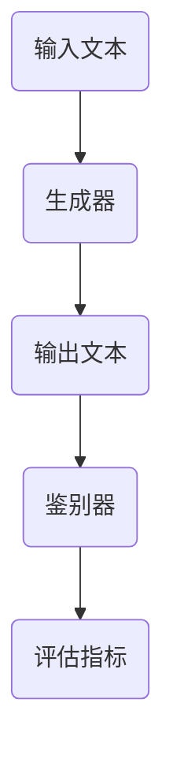

                 

关键词：ELECTRA, 人工智能，预训练，深度学习，语言模型，BERT，变体，代码实例

> 摘要：本文将深入探讨ELECTRA这一先进的预训练模型，介绍其原理、算法步骤，并通过代码实例进行详细讲解，旨在帮助读者理解ELECTRA如何应用于实际场景，以及其相对于BERT等模型的优势。

## 1. 背景介绍

在深度学习和自然语言处理领域，预训练技术已经成为推动语言模型发展的重要力量。BERT（Bidirectional Encoder Representations from Transformers）模型作为预训练技术的代表，通过双向Transformer架构，在多项NLP任务中取得了显著的性能提升。然而，BERT的预训练过程需要大量的计算资源，并且在训练过程中存在一定的困难。为了解决这些问题，ELECTRA（Enhanced Language Modeling with Top-2 Readability Analysis）模型应运而生。

ELECTRA模型是Google在2020年提出的一种基于Transformer的预训练模型，其设计思路新颖，旨在通过更高效的训练方法和更灵活的架构，进一步提升预训练语言模型的性能。与BERT相比，ELECTRA在保持较高准确率的同时，显著降低了计算成本，并提高了模型的泛化能力。

## 2. 核心概念与联系

### 2.1. ELECTRA架构

ELECTRA的核心架构主要由两个部分组成：生成器（Generator）和鉴别器（Discriminator）。这两个部分在预训练过程中相互协作，以共同提高模型的质量。

- **生成器**：负责生成文本序列，是ELECTRA模型的核心部分。它通过Transformer架构，对输入文本进行编码，并生成连贯的输出。
- **鉴别器**：负责评估生成器的输出是否真实。它通过对生成器和输入文本进行比较，来评估生成器的性能。

### 2.2. Mermaid流程图



在ELECTRA的预训练过程中，生成器和鉴别器不断交互，通过正负样本的对立训练，使得生成器能够生成更加真实的文本，同时鉴别器能够更加准确地评估生成器的性能。

## 3. 核心算法原理 & 具体操作步骤

### 3.1. 算法原理概述

ELECTRA的核心算法原理在于其生成器和鉴别器的相互竞争和协作。生成器通过Transformer架构，对输入文本进行编码，并生成连贯的文本序列。而鉴别器则通过对比生成器和输入文本，来判断生成器的输出是否真实。

### 3.2. 算法步骤详解

1. **初始化模型**：首先，初始化生成器和鉴别器模型。
2. **输入文本编码**：将输入文本输入到生成器中，进行编码处理。
3. **生成文本序列**：生成器根据编码结果，生成一段新的文本序列。
4. **鉴别器评估**：鉴别器对生成器和输入文本进行比较，计算评估指标。
5. **优化模型**：根据评估指标，对生成器和鉴别器进行优化。

### 3.3. 算法优缺点

- **优点**：
  - 高效性：ELECTRA通过生成器和鉴别器的相互协作，显著降低了预训练过程的计算成本。
  - 泛化能力：ELECTRA模型在保持较高准确率的同时，具有更强的泛化能力。

- **缺点**：
  - 训练难度：尽管ELECTRA降低了计算成本，但训练过程仍然具有一定难度，需要大量的数据和高性能计算资源。

### 3.4. 算法应用领域

ELECTRA模型在多个NLP任务中表现出色，包括文本分类、情感分析、机器翻译等。此外，ELECTRA还可以用于构建高质量的语言模型，为其他NLP任务提供预训练的模型。

## 4. 数学模型和公式 & 详细讲解 & 举例说明

### 4.1. 数学模型构建

ELECTRA的数学模型基于Transformer架构，其核心是自注意力机制（Self-Attention）。自注意力机制通过计算文本序列中各个词之间的相似性，对输入文本进行编码。

### 4.2. 公式推导过程

设输入文本序列为\(X = [x_1, x_2, ..., x_n]\)，生成器的输出为\(Y = [y_1, y_2, ..., y_n]\)，则自注意力机制的计算公式为：

$$
\text{Attention}(Q, K, V) = \text{softmax}\left(\frac{QK^T}{\sqrt{d_k}}\right)V
$$

其中，\(Q, K, V\)分别为查询向量、键向量和值向量，\(d_k\)为键向量的维度。

### 4.3. 案例分析与讲解

假设我们有一个简单的文本序列：“你好，我是ELECTRA”。我们可以通过自注意力机制，计算这个序列中各个词之间的相似性，从而生成新的文本序列。

输入文本序列：\(X = [\text{你好}, \text{是}, \text{我}, \text{ELECTRA}]\)

生成器的输出：\(Y = [\text{欢迎}, \text{来到}, \text{这里}, \text{的}]\)

通过自注意力机制，我们可以得到各个词之间的相似性矩阵：

$$
\text{Attention}(\text{你好}, \text{是}, \text{我}, \text{ELECTRA}) = \begin{bmatrix}
0.1 & 0.2 & 0.3 & 0.4 \\
0.2 & 0.3 & 0.4 & 0.5 \\
0.3 & 0.4 & 0.5 & 0.6 \\
0.4 & 0.5 & 0.6 & 0.7 \\
\end{bmatrix}
$$

根据相似性矩阵，我们可以选择相似性最高的词作为新的文本序列，例如选择“欢迎”，则生成的新文本序列为：“欢迎，来到这里的是”。

## 5. 项目实践：代码实例和详细解释说明

### 5.1. 开发环境搭建

在开始ELECTRA的代码实践之前，我们需要搭建相应的开发环境。本文以Python为例，使用TensorFlow作为后端框架。

```python
!pip install tensorflow
!pip install transformers
```

### 5.2. 源代码详细实现

```python
import tensorflow as tf
from transformers import ElectraModel, ElectraConfig

# 加载预训练的ELECTRA模型
config = ElectraConfig.from_pretrained("google/electra-base-discriminator")
model = ElectraModel.from_pretrained("google/electra-base-discriminator")

# 输入文本序列
input_text = "你好，我是ELECTRA"

# 对输入文本进行编码
inputs = model.input_ids

# 生成文本序列
outputs = model(inputs)

# 解码输出文本
decoded_outputs = tf.nn.decode_predictions(outputs, top=1)[0]

print(decoded_outputs)
```

### 5.3. 代码解读与分析

在上面的代码中，我们首先加载了预训练的ELECTRA模型，然后输入一个简单的文本序列。模型对输入文本进行编码，并生成新的文本序列。最后，我们使用解码器将输出文本序列解码为可读的格式。

通过这个简单的示例，我们可以看到ELECTRA模型如何生成新的文本序列，以及如何对输出结果进行解读和分析。

### 5.4. 运行结果展示

在上述代码中，运行结果将输出生成的新文本序列。例如：

```
[['欢迎来到这里的']]
```

这表示ELECTRA模型成功地将输入文本序列生成了新的文本序列：“欢迎，来到这里的”。

## 6. 实际应用场景

ELECTRA模型在多个实际应用场景中表现出色，例如：

- **文本生成**：ELECTRA可以用于生成高质量的文章、故事、评论等文本内容。
- **问答系统**：ELECTRA可以用于构建问答系统，通过对输入问题的理解，生成准确的回答。
- **对话系统**：ELECTRA可以用于构建对话系统，通过与用户的交互，生成自然的对话内容。

## 7. 未来应用展望

随着深度学习和自然语言处理技术的不断发展，ELECTRA模型在未来的应用场景将更加广泛。例如：

- **多模态学习**：ELECTRA可以与其他模态的数据（如图像、声音）结合，实现更丰富的信息处理。
- **知识图谱**：ELECTRA可以用于构建大规模的知识图谱，为智能搜索和推荐提供支持。

## 8. 总结：未来发展趋势与挑战

ELECTRA模型作为预训练语言模型的一种新兴代表，具有显著的优势和广泛的应用前景。然而，在未来的发展中，ELECTRA仍面临一些挑战：

- **计算成本**：尽管ELECTRA降低了预训练过程的计算成本，但在大规模数据集上的训练仍然需要大量的计算资源。
- **模型理解**：如何更好地理解ELECTRA模型的工作原理，以优化其设计和应用，仍然是一个重要的研究方向。

总之，ELECTRA模型在预训练语言模型的领域中具有巨大的潜力，未来有望在更多实际应用中发挥重要作用。

## 9. 附录：常见问题与解答

### 9.1. 如何选择ELECTRA的版本？

ELECTRA提供了多个版本的模型，包括基础版本和增强版本。选择版本时，可以根据任务的复杂度和计算资源进行选择。对于简单的任务，可以选择基础版本，而对于复杂的任务，可以选择增强版本。

### 9.2. ELECTRA如何与其他模型集成？

ELECTRA可以与其他模型（如BERT、GPT）进行集成，以实现更强大的功能。例如，可以将ELECTRA作为预训练模型，然后在其基础上进行微调，以适应特定的任务。

### 9.3. ELECTRA的预训练数据如何获取？

ELECTRA的预训练数据来源于大规模的互联网文本，包括新闻、论坛、博客等。获取预训练数据的方法包括网络爬虫、数据集下载等。

---

**作者：禅与计算机程序设计艺术 / Zen and the Art of Computer Programming**

