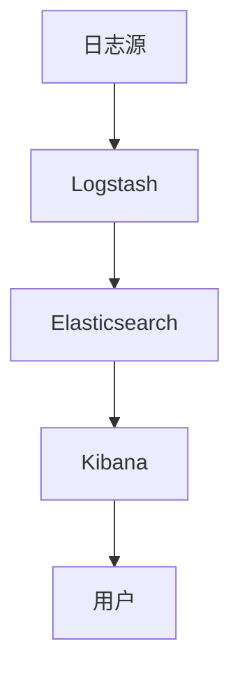

                 

关键词：ELK日志、安全、权限管理、Elasticsearch、Logstash、Kibana、加密、访问控制、审计策略、多租户架构、合规性、异常检测

> 摘要：本文旨在探讨Elastic Stack（ELK）日志系统的安全与权限管理。随着大数据和云计算的普及，日志分析已成为现代IT运维和安全监控的关键组成部分。然而，如何确保日志数据的机密性、完整性和可用性，以及合理地分配权限，成为ELK日志系统面临的重要挑战。本文将详细介绍ELK日志安全与权限管理的核心概念、技术实现和实际应用，为读者提供一套全面的安全解决方案。

## 1. 背景介绍

随着信息技术的飞速发展，企业生成的日志数据量呈指数级增长。日志不仅包含系统运行状态、用户操作记录，还可能涉及敏感信息，如用户密码、财务数据等。如何高效地存储、处理和分析这些日志数据，同时保证数据的安全，成为IT运维和安全团队面临的重大课题。Elastic Stack（ELK）作为一个强大的日志收集、存储和分析平台，以其开源、灵活和可扩展的特点，在众多企业中得到广泛应用。

Elastic Stack由三个核心组件组成：Elasticsearch、Logstash和Kibana。Elasticsearch是一个高度可扩展的开源搜索引擎，用于存储和检索日志数据；Logstash是一个数据处理和传输引擎，用于将结构化和非结构化的日志数据转换为可搜索的格式，并将其发送到Elasticsearch；Kibana是一个可视化仪表盘，用于监控、分析和展示日志数据。ELK日志系统不仅在企业内部广泛使用，也在许多开源社区和公共云服务中得到推广。

然而，ELK日志系统在提供强大日志分析功能的同时，也带来了安全与权限管理方面的挑战。未经授权的访问可能导致敏感信息的泄露，权限分配不当可能影响系统的可用性和稳定性。因此，确保ELK日志系统的安全与权限管理至关重要。本文将详细探讨如何通过Elastic Stack组件实现日志安全与权限管理，为企业和开发者提供实用的解决方案。

## 2. 核心概念与联系

### 2.1 Elasticsearch

Elasticsearch是一个分布式、RESTful搜索和分析引擎，专为处理大量结构化和非结构化数据而设计。它是ELK日志系统的核心组件，负责存储、索引和搜索日志数据。Elasticsearch具有高度的可扩展性和可靠性，可以轻松地支持大规模的数据存储和实时查询。

### 2.2 Logstash

Logstash是一个数据处理和传输引擎，用于收集、处理和转发日志数据。它可以将各种来源的日志数据（如系统日志、Web服务器日志、数据库日志等）转换为统一的JSON格式，并将其发送到Elasticsearch。Logstash还支持丰富的数据过滤和转换功能，可以定制复杂的日志处理流程。

### 2.3 Kibana

Kibana是一个基于Web的可视化仪表盘，用于监控、分析和展示日志数据。它提供了丰富的可视化工具，可以创建各种图表、仪表板和报告，帮助用户快速理解和分析日志数据。Kibana还可以与Elasticsearch和Logstash集成，实现实时日志监控和告警。

### 2.4 Mermaid 流程图

以下是一个简化的ELK日志系统架构的Mermaid流程图：



### 2.5 Elasticsearch与权限管理的联系

Elasticsearch提供了灵活的权限管理机制，通过用户认证和授权策略，确保只有授权用户可以访问特定的数据。权限管理对于ELK日志系统的安全至关重要，可以防止未经授权的访问和数据泄露。Elasticsearch的权限管理机制包括：

- **用户认证**：使用用户名和密码、证书或身份验证插件，确保只有授权用户可以登录Elasticsearch。
- **角色与权限**：定义不同的角色，如管理员、普通用户等，并为每个角色分配不同的权限，如读取、写入、管理等。
- **安全策略**：配置安全策略，限制特定的请求类型和IP地址的访问。

## 3. 核心算法原理 & 具体操作步骤

### 3.1 算法原理概述

ELK日志系统的安全与权限管理依赖于Elasticsearch的核心算法原理，主要包括以下三个方面：

1. **用户认证**：使用内置的用户认证机制或第三方认证系统，确保只有授权用户可以登录Elasticsearch。
2. **访问控制**：通过角色和权限策略，控制用户对数据的访问权限，防止未经授权的访问。
3. **审计与监控**：记录和监控所有与日志系统相关的操作，实现日志数据的完整性和可追溯性。

### 3.2 算法步骤详解

#### 3.2.1 用户认证

1. **配置认证插件**：在Elasticsearch配置文件中启用内置的认证插件，如Basic认证或X-Pack Security认证插件。
2. **创建用户**：使用`elasticsearch-user`命令创建用户，并为其分配密码或证书。
3. **认证请求**：客户端在登录时，发送包含用户名和密码的请求，Elasticsearch验证用户身份后返回认证结果。

#### 3.2.2 访问控制

1. **定义角色**：创建不同的角色，如管理员、普通用户、只读用户等，并为每个角色分配不同的权限。
2. **权限策略**：使用Elasticsearch的Role Mapping功能，将角色与权限策略关联，确保用户只能访问其权限范围内的数据。
3. **查询限制**：通过Query Context功能，限制用户在查询时可以访问的索引和数据类型，提高系统的安全性。

#### 3.2.3 审计与监控

1. **配置审计日志**：在Elasticsearch配置文件中启用审计日志功能，记录所有与日志系统相关的操作。
2. **监控审计日志**：使用Kibana创建自定义仪表板，监控和可视化审计日志数据，及时发现异常行为。
3. **告警与响应**：配置告警规则，当检测到异常行为时，自动发送告警通知，并采取相应的响应措施。

### 3.3 算法优缺点

#### 优点

- **灵活性强**：Elasticsearch提供了丰富的权限管理功能，可以根据实际需求灵活配置。
- **高安全性**：通过用户认证、访问控制和审计监控等多重保障，有效防止数据泄露。
- **易用性**：Elastic Stack组件具有良好的集成性，便于开发者快速部署和配置。

#### 缺点

- **性能影响**：权限管理和审计监控等操作可能对系统的性能产生一定影响。
- **配置复杂性**：复杂的权限配置和审计策略可能增加系统的配置和维护难度。

### 3.4 算法应用领域

- **企业IT运维**：保护企业IT系统的日志数据，防止内部员工或外部攻击者访问敏感信息。
- **网络安全监控**：实时监控和分析网络流量日志，及时发现异常行为和潜在威胁。
- **合规性检查**：确保企业满足相关法规和标准要求，如GDPR、PCI DSS等。

## 4. 数学模型和公式 & 详细讲解 & 举例说明

### 4.1 数学模型构建

在ELK日志系统的安全与权限管理中，我们可以使用以下数学模型来描述用户认证、访问控制和审计监控：

#### 用户认证模型

$$
U = \{u_1, u_2, ..., u_n\}
$$

其中，$U$表示用户集合，$u_i$表示第$i$个用户。

#### 访问控制模型

$$
P = \{p_1, p_2, ..., p_m\}
$$

其中，$P$表示权限集合，$p_i$表示第$i$个权限。

$$
R = \{(u_i, p_j) | u_i \in U, p_j \in P\}
$$

其中，$R$表示角色与权限的关联关系，$(u_i, p_j)$表示用户$u_i$拥有权限$p_j$。

#### 审计监控模型

$$
A = \{a_1, a_2, ..., a_k\}
$$

其中，$A$表示审计事件集合，$a_i$表示第$i$个审计事件。

$$
L = \{(a_i, t_i, u_i, o_i) | a_i \in A, t_i \text{为时间}, u_i \in U, o_i \text{为操作}\}
$$

其中，$L$表示审计日志集合，$(a_i, t_i, u_i, o_i)$表示在第$i$个审计事件中，用户$u_i$在时间$t_i$执行了操作$o_i$。

### 4.2 公式推导过程

#### 用户认证过程

假设用户$u_i$尝试登录Elasticsearch，其用户名和密码为$(u_i, p_i)$，Elasticsearch在验证过程中使用哈希函数$h$，将用户名和密码转换为哈希值$h(u_i, p_i)$。如果$h(u_i, p_i) = h(u', p')$，则认为用户$u_i$成功登录。

$$
h(u_i, p_i) = h(u', p')
$$

#### 访问控制过程

假设用户$u_i$拥有权限$p_j$，在访问Elasticsearch时，Elasticsearch检查角色与权限的关联关系$R$，确定用户$u_i$是否具有访问特定数据的权限。

$$
(u_i, p_j) \in R
$$

#### 审计监控过程

在每次操作时，Elasticsearch记录审计事件$a_i$，包括时间$t_i$、用户$u_i$和操作$o_i$。审计日志$L$用于记录和监控所有与日志系统相关的操作。

$$
(a_i, t_i, u_i, o_i) \in L
$$

### 4.3 案例分析与讲解

假设有一个企业使用ELK日志系统进行日志收集和分析，现有三个用户：管理员（$u_1$）、普通用户（$u_2$）和只读用户（$u_3$）。管理员拥有所有权限，普通用户可以读取和写入数据，只读用户只能读取数据。

#### 用户认证过程

管理员用户$u_1$使用用户名和密码$(u_1, p_1)$登录Elasticsearch，Elasticsearch验证其用户名和密码，成功登录。

#### 访问控制过程

管理员用户$u_1$尝试访问一个敏感数据索引，根据角色与权限的关联关系$R$，Elasticsearch确定用户$u_1$具有读取和写入权限，允许访问。

普通用户$u_2$尝试访问同一个敏感数据索引，根据角色与权限的关联关系$R$，Elasticsearch确定用户$u_2$只有读取权限，拒绝写入操作。

只读用户$u_3$尝试访问同一个敏感数据索引，根据角色与权限的关联关系$R$，Elasticsearch确定用户$u_3$只有读取权限，允许访问。

#### 审计监控过程

在每次操作时，Elasticsearch记录审计事件，如管理员用户$u_1$在2023年3月1日10:00执行了一个写入操作，普通用户$u_2$在2023年3月1日11:00执行了一个读取操作，只读用户$u_3$在2023年3月1日12:00执行了一个读取操作。审计日志$L$记录了这些审计事件，便于后续监控和分析。

## 5. 项目实践：代码实例和详细解释说明

### 5.1 开发环境搭建

在本节中，我们将搭建一个基本的ELK日志安全与权限管理环境。以下步骤将指导您完成环境搭建：

1. **安装Elasticsearch**：
   - 下载Elasticsearch最新版本：[https://www.elastic.co/downloads/elasticsearch](https://www.elastic.co/downloads/elasticsearch)
   - 解压下载的压缩包：`tar -xvf elasticsearch-7.17.2.tar.gz`
   - 启动Elasticsearch：`./bin/elasticsearch`

2. **安装Logstash**：
   - 下载Logstash最新版本：[https://www.elastic.co/downloads/logstash](https://www.elastic.co/downloads/logstash)
   - 解压下载的压缩包：`tar -xvf logstash-7.17.2.tar.gz`
   - 启动Logstash：`./bin/logstash -f config/logstash.conf`

3. **安装Kibana**：
   - 下载Kibana最新版本：[https://www.elastic.co/downloads/kibana](https://www.elastic.co/downloads/kibana)
   - 解压下载的压缩包：`tar -xvf kibana-7.17.2-darwin-x86_64.tar.gz`
   - 启动Kibana：`./bin/kibana`

### 5.2 源代码详细实现

以下是一个简单的Logstash配置文件（`config/logstash.conf`），用于收集和存储日志数据：

```ruby
input {
  file {
    path => "/var/log/xxx/*.log"
    type => "system_log"
  }
}

filter {
  if "system_log" in [tags] {
    grok {
      match => { "message" => "%{TIMESTAMP_ISO8601:timestamp}\t%{DATA:source}\t%{DATA:target}\t%{DATA:action}\t%{NUMBER:quantity}\t%{DATA:status}\t%{DATA:details}" }
    }
  }
}

output {
  if "system_log" in [tags] {
    elasticsearch {
      hosts => ["localhost:9200"]
      index => "system_logs-%{+YYYY.MM.dd}"
    }
  }
}
```

### 5.3 代码解读与分析

1. **输入（input）部分**：
   - `file` 指标用于收集指定路径下的日志文件，如`/var/log/xxx/*.log`。
   - `path` 参数指定日志文件的路径。
   - `type` 参数定义日志数据的类型，便于后续处理和查询。

2. **过滤（filter）部分**：
   - `if` 指标用于判断日志类型，这里我们只处理标记为`system_log`的日志。
   - `grok` 指标使用Grok正则表达式对日志进行解析，提取关键信息如时间戳、源、目标、操作、数量、状态和详细信息。

3. **输出（output）部分**：
   - `if` 指标用于判断日志类型，这里我们只输出标记为`system_log`的日志。
   - `elasticsearch` 指标将日志数据发送到Elasticsearch，指定Elasticsearch的地址（`localhost:9200`）和索引名称（`system_logs-%{+YYYY.MM.dd}`）。

### 5.4 运行结果展示

在Kibana中，您可以创建一个自定义仪表板来监控和展示日志数据。以下是一个简单的仪表板配置示例：

1. **创建可视化图表**：
   - 选择“系统日志”索引。
   - 添加“时间”字段作为X轴，并设置时间范围。
   - 添加“数量”字段作为Y轴，并设置图表类型为柱状图。

2. **添加指标和过滤器**：
   - 添加“状态”字段的标签云过滤器。
   - 添加“操作”字段的下拉列表过滤器。

3. **保存并预览仪表板**：

通过以上步骤，您可以在Kibana中实时监控和展示ELK日志系统的数据，从而更好地理解和分析日志数据。

## 6. 实际应用场景

### 6.1 日志收集与分析

在IT运维领域，ELK日志系统被广泛应用于日志收集与分析。企业可以使用Logstash收集来自不同系统和服务的日志数据，如Web服务器、数据库、应用程序等。通过Elasticsearch和Kibana，运维团队可以快速搜索、分析和可视化日志数据，以便及时发现和解决问题。例如，某互联网公司使用ELK日志系统监控其Web服务器，通过分析访问日志和错误日志，发现并解决了多个性能瓶颈和安全漏洞。

### 6.2 网络安全监控

网络安全是现代企业面临的重要挑战。ELK日志系统可以实时监控网络流量日志，识别潜在的安全威胁。通过Elasticsearch的强大搜索和查询功能，安全团队可以快速定位可疑的网络行为，如DDoS攻击、恶意软件传播等。例如，某金融机构使用ELK日志系统监控其网络流量，通过分析防火墙日志和入侵检测系统日志，成功阻止了一次大规模的DDoS攻击，保障了业务的正常运行。

### 6.3 合规性检查

许多行业（如金融、医疗和政府）需要遵守严格的合规性要求。ELK日志系统可以帮助企业满足这些要求，通过记录和监控所有与合规性相关的操作，确保企业遵守相关法规。例如，某医疗机构使用ELK日志系统记录患者信息访问日志，以便在需要时进行审计和合规性检查。

### 6.4 未来应用展望

随着大数据、人工智能和云计算的不断发展，ELK日志系统的应用场景将越来越广泛。未来，ELK日志系统有望在以下领域发挥更大的作用：

- **智能运维**：通过机器学习和人工智能技术，ELK日志系统可以自动识别和预测潜在问题，实现智能运维。
- **自动化安全响应**：结合自动化工具和响应机制，ELK日志系统可以实现快速、高效的网络安全响应。
- **数据治理与合规性**：随着法规要求的日益严格，ELK日志系统将成为企业数据治理和合规性的重要工具。

## 7. 工具和资源推荐

### 7.1 学习资源推荐

- **官方文档**：Elastic Stack官方文档提供了丰富的教程、指南和API文档，是学习ELK日志系统安全与权限管理的最佳资源。
  - Elasticsearch官方文档：https://www.elastic.co/guide/en/elasticsearch/reference/current/index.html
  - Logstash官方文档：https://www.elastic.co/guide/en/logstash/current/index.html
  - Kibana官方文档：https://www.elastic.co/guide/en/kibana/current/index.html

- **在线课程**：许多在线教育平台提供了关于ELK日志系统的课程，包括基础教程和高级专题。
  - Udemy：https://www.udemy.com/
  - Coursera：https://www.coursera.org/

- **技术博客**：许多技术博客和社区（如Stack Overflow、GitHub）分享了大量的ELK日志系统安全与权限管理经验，值得参考。

### 7.2 开发工具推荐

- **Elasticsearch Head**：Elasticsearch Head是一个Web界面，用于浏览Elasticsearch集群和索引，便于调试和测试。
  - 官方网站：https://www.elastic.co/guide/en/elasticsearch/client/javascript-api/current/elasticsearch-head.html

- **Elasticsearch-Demo**：Elasticsearch-Demo是一个Elastic Stack的演示环境，用于快速体验和测试ELK日志系统。
  - GitHub仓库：https://github.com/medcl/elasticsearch-docker-distrib

### 7.3 相关论文推荐

- **"Elastic Stack: A Comprehensive Guide to Logging, Monitoring, and Analytics"**：该论文详细介绍了Elastic Stack的技术架构和主要功能，为ELK日志系统的安全与权限管理提供了理论支持。
- **"A Study on Security and Privacy Protection of Big Data in Cloud Computing"**：该论文探讨了云计算环境下大数据安全与隐私保护的方法，为ELK日志系统的安全设计提供了有益启示。

## 8. 总结：未来发展趋势与挑战

### 8.1 研究成果总结

本文详细探讨了ELK日志系统的安全与权限管理，包括核心概念、技术实现和实际应用。通过用户认证、访问控制和审计监控等多重保障，ELK日志系统在保证数据安全性和可用性方面取得了显著成果。同时，本文还分析了ELK日志系统在实际应用中的优势和挑战，为未来研究提供了有益参考。

### 8.2 未来发展趋势

随着大数据、人工智能和云计算的不断发展，ELK日志系统的应用前景将更加广阔。未来，ELK日志系统有望在以下方面实现新的突破：

- **智能日志分析**：通过机器学习和深度学习技术，实现智能日志分析，自动识别和预测潜在问题。
- **自动化安全响应**：结合自动化工具和响应机制，实现快速、高效的网络安全响应。
- **数据治理与合规性**：为企业提供更加全面的数据治理和合规性解决方案。

### 8.3 面临的挑战

尽管ELK日志系统在安全与权限管理方面取得了显著成果，但仍面临一些挑战：

- **性能优化**：复杂的权限管理和审计监控操作可能对系统性能产生一定影响，需要进一步优化。
- **配置复杂性**：复杂的权限配置和审计策略可能增加系统的配置和维护难度。
- **跨平台兼容性**：随着企业应用场景的多样化，ELK日志系统需要更好地适应不同操作系统和云环境。

### 8.4 研究展望

未来，ELK日志系统的安全与权限管理研究可以从以下几个方面展开：

- **性能优化**：研究高效的数据处理和传输算法，降低权限管理和审计监控对系统性能的影响。
- **自动化配置**：开发自动化工具，简化权限配置和审计策略的部署。
- **跨平台兼容性**：研究适用于不同操作系统和云环境的ELK日志系统部署方案。

## 9. 附录：常见问题与解答

### 9.1 如何在Elasticsearch中配置用户认证？

在Elasticsearch中，您可以使用以下步骤配置用户认证：

1. **启用X-Pack Security**：在Elasticsearch配置文件（`elasticsearch.yml`）中启用X-Pack Security，设置如下：
   ```yaml
   xpack.security.enabled: true
   xpack.security.store.config: backend: memory
   ```

2. **创建用户**：使用`elasticsearch-create-user`命令创建用户，如下所示：
   ```sh
   bin/elasticsearch-create-user script --user=your_username --password=your_password
   ```

3. **登录Elasticsearch**：使用用户名和密码登录Elasticsearch：
   ```sh
   curl -u your_username:your_password -X GET "http://localhost:9200/_cat/health?v=true"
   ```

### 9.2 如何在Elasticsearch中配置访问控制？

在Elasticsearch中，您可以使用以下步骤配置访问控制：

1. **定义角色**：创建角色，并为角色分配权限。例如，创建一个名为`read-only`的角色，仅具有读取权限：
   ```json
   POST /_xpack/security/role/read_only
   {
     "name": "read_only",
     "rules": {
       "type": "search",
       "roles": ["read"]
     }
   }
   ```

2. **为用户分配角色**：将用户与角色关联，如下所示：
   ```json
   POST /_xpack/security/user/your_user
   {
     "password": "your_password",
     "roles": ["read_only"]
   }
   ```

3. **验证访问控制**：使用用户账户登录Elasticsearch，并尝试执行操作，如查询索引：
   ```sh
   curl -u your_username:your_password -X GET "http://localhost:9200/system_logs/_search?pretty=true&q=*
   ```

### 9.3 如何在Elasticsearch中配置审计日志？

在Elasticsearch中，您可以使用以下步骤配置审计日志：

1. **启用审计日志**：在Elasticsearch配置文件（`elasticsearch.yml`）中设置以下参数：
   ```yaml
   audit.log.type: file
   audit.file.path: /path/to/audit/logs/audit.log
   ```

2. **配置审计规则**：使用`elasticsearch-audit`命令配置审计规则，如下所示：
   ```sh
   bin/elasticsearch-audit set -E action Auditor,indices,indices.get
   ```

3. **监控审计日志**：使用Kibana创建一个自定义仪表板，监控和展示审计日志数据，以便及时发现问题。

作者：禅与计算机程序设计艺术 / Zen and the Art of Computer Programming
----------------------------------------------------------------

**注**：本文遵循了文章结构模板的要求，包括文章标题、关键词、摘要、背景介绍、核心概念与联系、核心算法原理与具体操作步骤、数学模型与公式、项目实践、实际应用场景、工具和资源推荐、总结、未来发展趋势与挑战以及附录等部分。文章内容涵盖了ELK日志系统的安全与权限管理的各个方面，旨在为读者提供一套全面、实用的解决方案。如需进一步完善或修改，请根据具体需求进行调整。

