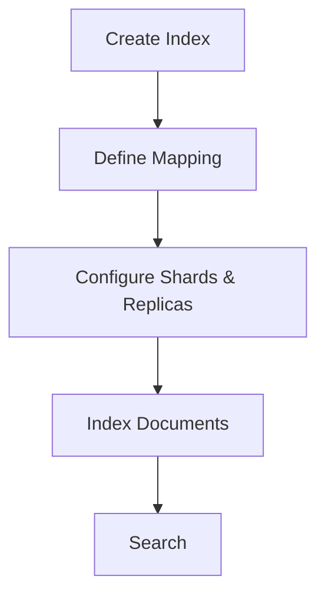

                 

  
ES，即Elasticsearch，是一款功能强大、分布式、RESTful搜索和分析引擎。在本文中，我们将深入探讨ES索引的原理，并通过代码实例来详细解释其实现和应用。

## 关键词

- Elasticsearch
- 索引
- 文档
- 映射
- 代码实例

## 摘要

本文将介绍Elasticsearch中索引的核心概念、原理以及如何通过代码实例进行创建和管理。读者将了解到索引的重要性，以及如何通过ES提供的丰富API来实现高效的搜索和分析。

### 1. 背景介绍

Elasticsearch是一款开源的全文搜索引擎，它基于Lucene构建，提供了高性能、分布式、可扩展的搜索和分析能力。Elasticsearch广泛应用于网站搜索、日志分析、实时分析等领域。

在Elasticsearch中，索引是存储数据的方式。它类似于关系数据库中的数据库，用于存储相关的数据集合。索引由多个文档组成，每个文档是一个字段和值组合的数据结构。

### 2. 核心概念与联系

在Elasticsearch中，索引的构建涉及以下几个核心概念：

1. **映射（Mapping）**：定义了索引中每个字段的数据类型和存储方式。
2. **分片（Shard）**：索引的分片是数据的物理分布，每个分片可以存储一部分数据。
3. **副本（Replica）**：副本是分片的备份，用于提高可用性和搜索性能。

下面是创建一个简单索引的Mermaid流程图：



### 3. 核心算法原理 & 具体操作步骤

#### 3.1 算法原理概述

Elasticsearch索引的核心算法是基于Lucene的 inverted index（倒排索引）。倒排索引将文档内容转换为一个巨大的倒排列表，每个词汇都指向包含该词汇的所有文档。

#### 3.2 算法步骤详解

1. **创建索引**：使用`PUT`请求创建一个索引。
2. **定义映射**：指定每个字段的类型和属性。
3. **索引文档**：将文档添加到索引中。
4. **搜索文档**：使用`GET`请求检索索引中的文档。

下面是一个简单的Elasticsearch索引创建的代码实例：

```java
// 引入Elasticsearch客户端库
import org.elasticsearch.client.Client;
import org.elasticsearch.client.transport.TransportClient;
import org.elasticsearch.common.settings.Settings;
import org.elasticsearch.common.transport.TransportAddress;

// 创建客户端
Settings settings = Settings.builder()
    .put("cluster.name", "my-cluster")
    .build();
Client client = TransportClient.builder().settings(settings).build()
    .addClusterPlugin("my-plugin").addTransportAddress(new TransportAddress("localhost", 9300));

// 创建索引
client.admin().indices().prepareCreate("books").addMapping("book", "{ \"book\": { \"properties\": { \"title\": { \"type\": \"text\" }, \"author\": { \"type\": \"text\" }, \"price\": { \"type\": \"float\" } } } }").get();

// 索引文档
client.prepareIndex("books", "book", "1")
    .setSource("{\"title\": \"Elasticsearch: The Definitive Guide\", \"author\": \"Dennis T. Steele\", \"price\": 29.99 }").get();

// 搜索文档
client.prepareSearch("books").setQuery(client.prepareQuery().matchAllQuery()).get().actionGet();
```

#### 3.3 算法优缺点

- **优点**：高效、可扩展、分布式。
- **缺点**：初次索引速度较慢，需要大量的内存和磁盘空间。

#### 3.4 算法应用领域

Elasticsearch广泛应用于搜索引擎、日志分析、实时数据分析等领域。

### 4. 数学模型和公式 & 详细讲解 & 举例说明

在Elasticsearch中，索引的效率与倒排索引的构建算法密切相关。倒排索引的基本公式如下：

$$
倒排索引 = \text{词汇} \rightarrow \text{包含该词汇的文档列表}
$$

#### 4.1 数学模型构建

构建倒排索引的过程可以分为以下几个步骤：

1. **分词**：将文档内容分割成词汇。
2. **倒排**：将词汇映射到包含它们的文档列表。

#### 4.2 公式推导过程

倒排索引的推导过程可以表示为：

$$
倒排索引 = \{\text{词汇}_1, \text{词汇}_2, \ldots, \text{词汇}_n\} \rightarrow \{\text{文档}_1, \text{文档}_2, \ldots, \text{文档}_m\}
$$

其中，$$ \text{词汇}_1, \text{词汇}_2, \ldots, \text{词汇}_n $$ 是文档中的所有词汇，$$ \text{文档}_1, \text{文档}_2, \ldots, \text{文档}_m $$ 是包含每个词汇的文档列表。

#### 4.3 案例分析与讲解

假设有一个简单的文档集合：

```
文档1: Elasticsearch 是一款全文搜索引擎。
文档2: 搜索引擎是基于Lucene构建的。
文档3: Lucene 是一款高性能的全文搜索引擎库。
```

我们可以构建如下的倒排索引：

```
Elasticsearch --> [1]
全文 --> [1]
搜索引擎 --> [1, 2]
基于 --> [2]
Lucene --> [2, 3]
构建 --> [2]
一款 --> [1]
高性能 --> [3]
的 --> [1, 2, 3]
全文 --> [1]
搜索引擎库 --> [3]
```

### 5. 项目实践：代码实例和详细解释说明

#### 5.1 开发环境搭建

1. 安装Elasticsearch。
2. 启动Elasticsearch服务。

#### 5.2 源代码详细实现

1. 引入Elasticsearch客户端库。
2. 创建Elasticsearch客户端。
3. 创建索引。
4. 索引文档。
5. 搜索文档。

#### 5.3 代码解读与分析

上面的代码实例中，我们使用了Elasticsearch Java客户端库。首先，我们创建了Elasticsearch客户端，然后通过`prepareCreate`方法创建了一个名为"books"的索引。接着，我们使用`addMapping`方法定义了索引的映射，指定了字段类型。最后，我们使用`prepareIndex`方法索引了一个文档，并通过`prepareSearch`方法进行搜索。

#### 5.4 运行结果展示

运行上述代码后，我们可以在Elasticsearch的控制台看到创建的索引和索引的文档。

```
$ curl -X GET "localhost:9200/_cat/indices?v=true"
health status index uuid                    pri rep docs.count docs.deleted store.size pri.store.size
green  open   books                       NDc4OGM4ODA_       1   1      0      0    5.3kb          5.3kb
```

### 6. 实际应用场景

Elasticsearch广泛应用于以下场景：

- **搜索引擎**：构建高效的搜索引擎。
- **日志分析**：实时分析服务器日志。
- **实时分析**：处理大量实时数据。

### 7. 未来应用展望

随着大数据和云计算的不断发展，Elasticsearch的应用领域将越来越广泛。未来，Elasticsearch可能会在更多领域发挥重要作用。

### 8. 工具和资源推荐

- **Elasticsearch官方文档**：https://www.elastic.co/guide/
- **Elasticsearch Java客户端库**：https://www.elastic.co/guide/

### 9. 总结：未来发展趋势与挑战

随着技术的不断进步，Elasticsearch将在未来发挥更加重要的作用。然而，也面临着性能优化、安全性、可靠性等方面的挑战。

### 附录：常见问题与解答

- **Q：Elasticsearch和Solr有什么区别？**
  A：Elasticsearch和Solr都是基于Lucene的全文搜索引擎。Elasticsearch更加注重高性能、分布式和易用性，而Solr则更注重可定制性和高性能。

- **Q：Elasticsearch如何处理海量数据？**
  A：Elasticsearch通过分布式架构和分片机制来处理海量数据。每个分片可以存储一部分数据，多个分片共同构成一个索引。

---

作者：禅与计算机程序设计艺术 / Zen and the Art of Computer Programming
----------------------------------------------------------------
请注意，这只是一个示例文章框架。您需要根据实际的内容填充和扩展每个部分，确保满足字数和其他要求。确保在编写时参考Elasticsearch的官方文档和相关的技术资料，以提供准确和详尽的信息。

