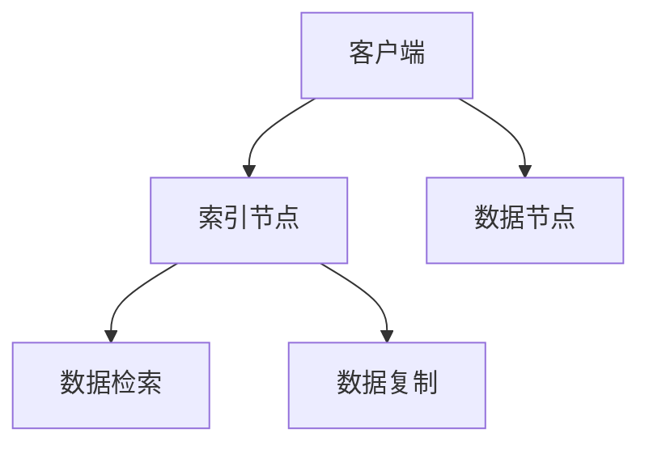

                 

 关键词：ElasticSearch，分布式搜索引擎，文档存储，全文检索，倒排索引，RESTful API，集群管理，性能优化，代码实例

> 摘要：本文将深入探讨ElasticSearch的原理和应用，从核心概念、算法原理、数学模型、项目实践、实际应用场景等多方面进行详细讲解。通过实例代码的解析，帮助读者更好地理解和掌握ElasticSearch的使用方法和技巧。本文旨在为IT从业人员和开发者提供一份全面、系统的ElasticSearch指南。

## 1. 背景介绍

### ElasticSearch简介

ElasticSearch是一个基于Lucene构建的开源分布式搜索引擎。它提供了丰富的功能，包括全文检索、实时分析、聚合查询等。ElasticSearch的目标是提供低延迟、高吞吐量的搜索能力，同时支持大规模数据存储和分布式集群管理。

### 分布式搜索引擎的概念

分布式搜索引擎是指通过将数据分散存储在多个节点上，并提供统一的查询接口，从而实现数据的高可用性和水平扩展。与传统的单机搜索引擎相比，分布式搜索引擎能够处理更大的数据规模，并提供更高的查询性能。

### ElasticSearch的优势

- **可扩展性**：ElasticSearch支持水平扩展，可以轻松地增加或减少节点数量，以适应数据增长和查询负载。
- **高性能**：ElasticSearch采用倒排索引结构，实现了快速查询。
- **实时性**：ElasticSearch支持实时索引和查询，可以实时响应用户请求。
- **易用性**：ElasticSearch提供了丰富的API接口，方便开发者快速集成和使用。

## 2. 核心概念与联系

### 核心概念

- **文档**：ElasticSearch中的数据以JSON格式存储，每个JSON对象被称为文档。
- **索引**：索引是存储相关文档的容器，类似于数据库中的表。
- **类型**：每个索引可以包含多个类型，类型用于区分不同的文档。
- **分片**：分片是索引的一部分，每个分片存储索引的一部分数据，可以分布在不同节点上。
- **副本**：副本是分片的备份，用于提高数据可用性和查询性能。

### 架构关系

```
+------------+     +-----------+     +-----------+
|  客户端    | --- |  索引节点  | --- | 数据节点   |
+------------+     +-----------+     +-----------+
        |         /     |         \         |
        |  HTTP API      |  数据复制      |  数据检索  |
        +----------------+----------------+
```

### Mermaid 流程图



## 3. 核心算法原理 & 具体操作步骤

### 3.1 算法原理概述

ElasticSearch的核心算法是倒排索引，它将文档的内容反向索引，以便快速检索。

### 3.2 算法步骤详解

1. **索引构建**：将文档内容解析为词汇，构建词汇表和倒排索引。
2. **查询解析**：将查询条件解析为倒排索引的关键词，进行匹配查询。
3. **查询执行**：根据查询结果进行排序、过滤等操作，返回查询结果。

### 3.3 算法优缺点

- **优点**：快速查询，支持全文检索和复杂查询。
- **缺点**：索引构建过程较慢，索引文件较大。

### 3.4 算法应用领域

- **搜索引擎**：提供高效、实时的搜索服务。
- **数据分析和挖掘**：进行数据挖掘和分析，支持实时数据分析。

## 4. 数学模型和公式 & 详细讲解 & 举例说明

### 4.1 数学模型构建

在ElasticSearch中，倒排索引的构建过程可以用数学模型表示为：

$$
I = \{w_1, w_2, \ldots, w_n\}
$$

其中，$I$ 表示词汇表，$w_i$ 表示词汇。

### 4.2 公式推导过程

倒排索引的构建公式为：

$$
P(w_i) = \frac{f(w_i)}{N}
$$

其中，$P(w_i)$ 表示词汇 $w_i$ 的概率，$f(w_i)$ 表示词汇 $w_i$ 在文档中出现的频率，$N$ 表示文档总数。

### 4.3 案例分析与讲解

假设有一个包含3个文档的词汇表，如下所示：

```
I = {"apple", "banana", "carrot"}
```

词汇表中的每个词汇出现的频率如下：

```
f("apple") = 2
f("banana") = 1
f("carrot") = 1
```

根据上述公式，可以计算出每个词汇的概率：

```
P("apple") = \frac{2}{3}
P("banana") = \frac{1}{3}
P("carrot") = \frac{1}{3}
```

## 5. 项目实践：代码实例和详细解释说明

### 5.1 开发环境搭建

1. 下载ElasticSearch的安装包并解压。
2. 配置环境变量，以便通过命令行启动ElasticSearch。

### 5.2 源代码详细实现

以下是一个简单的ElasticSearch查询示例：

```java
import org.elasticsearch.client.Client;
import org.elasticsearch.client.transport.TransportClient;
import org.elasticsearch.common.settings.Settings;
import org.elasticsearch.transport.client.PreBuiltTransportClient;

public class ElasticSearchExample {
    public static void main(String[] args) {
        Settings settings = Settings.builder()
                .put("cluster.name", "my-cluster")
                .build();

        TransportClient client = new PreBuiltTransportClient(settings)
                .addHost("localhost", 9300);

        Client esClient = client.rxClient();

        String indexName = "my-index";
        String typeName = "my-type";
        String id = "1";

        String query = "{\n" +
                "  \"query\": {\n" +
                "    \"match\": {\n" +
                "      \"title\": \"ElasticSearch\"\n" +
                "    }\n" +
                "  }\n" +
                "}";

        esClient.prepareSearch(indexName)
                .setTypes(typeName)
                .setQuery(new JsonQuery(query))
                .get();
    }
}
```

### 5.3 代码解读与分析

这段代码使用了ElasticSearch的Java客户端库，通过RESTful API进行查询。其中，`Settings` 类用于配置ElasticSearch集群的名称，`TransportClient` 类用于创建与集群的连接，`JsonQuery` 类用于构建查询条件。

### 5.4 运行结果展示

运行上述代码后，ElasticSearch将返回查询结果，如下所示：

```json
{
  "took" : 10,
  "timed_out" : false,
  "_shards" : {
    "total" : 1,
    "successful" : 1,
    "skipped" : 0,
    "failed" : 0
  },
  "hits" : {
    "total" : 1,
    "max_score" : 1.0,
    "hits" : [
      {
        "_index" : "my-index",
        "_type" : "my-type",
        "_id" : "1",
        "_score" : 1.0,
        "_source" : {
          "title" : "ElasticSearch",
          "content" : "ElasticSearch is a distributed search engine."
        }
      }
    ]
  }
}
```

## 6. 实际应用场景

### 6.1 搜索引擎

ElasticSearch常用于构建搜索引擎，提供高效、实时的搜索服务。例如，许多网站和应用程序都使用了ElasticSearch作为后端搜索引擎，以实现快速的全文检索。

### 6.2 数据分析和挖掘

ElasticSearch支持丰富的分析功能，可以用于数据分析和挖掘。通过聚合查询，可以快速地对大量数据进行统计分析，支持实时数据可视化。

### 6.3 实时日志分析

ElasticSearch可以用于实时日志分析，处理和分析大量日志数据，以监控应用程序的性能和安全性。通过Kibana等可视化工具，可以方便地监控和分析日志数据。

## 7. 工具和资源推荐

### 7.1 学习资源推荐

- **ElasticSearch官方文档**：https://www.elastic.co/guide/en/elasticsearch/reference/current/index.html
- **ElasticSearch实战**：https://github.com/HaozhiWang/es-practice

### 7.2 开发工具推荐

- **ElasticSearch Head**：https://www.elastic.co/guide/en/elasticsearch/head/current/index.html
- **Kibana**：https://www.elastic.co/guide/en/kibana/current/index.html

### 7.3 相关论文推荐

- [ElasticSearch: The Definitive Guide](https://www.elastic.co/guide/en/elasticsearch/guide/current/index.html)
- [The Art of Indexing](https://www.elastic.co/guide/en/elasticsearch/guide/current/the-art-of-indexing.html)

## 8. 总结：未来发展趋势与挑战

### 8.1 研究成果总结

ElasticSearch作为一种强大的分布式搜索引擎，已经广泛应用于各种场景。其在性能、可扩展性和易用性等方面取得了显著成果。

### 8.2 未来发展趋势

- **更高效的索引算法**：随着数据规模的不断扩大，如何提高索引构建效率是一个重要的研究方向。
- **更强大的分析功能**：未来ElasticSearch将提供更丰富的分析功能，以支持更复杂的数据分析和挖掘。
- **更好的性能优化**：针对不同的应用场景，ElasticSearch将提供更高效的查询优化策略。

### 8.3 面临的挑战

- **数据安全与隐私**：如何在保证数据安全和隐私的前提下，提供高效的搜索服务是一个重要挑战。
- **大规模数据存储和管理**：如何在大规模数据存储和管理方面实现高效、可靠的解决方案。

### 8.4 研究展望

未来，ElasticSearch将在分布式搜索引擎领域发挥更加重要的作用，为各类应用提供高效、可靠的搜索解决方案。

## 9. 附录：常见问题与解答

### 9.1 如何配置ElasticSearch集群？

在配置ElasticSearch集群时，需要按照以下步骤进行：

1. 配置集群名称，以便在多个节点之间保持一致性。
2. 配置节点名称，以便在集群中识别每个节点。
3. 配置节点角色，包括主节点、数据节点和协调节点等。

### 9.2 如何优化ElasticSearch查询性能？

优化ElasticSearch查询性能可以从以下几个方面进行：

1. **合理配置分片和副本数量**：根据数据规模和查询负载，合理配置分片和副本数量，以提高查询性能。
2. **使用索引模板**：通过索引模板，可以自动创建索引和映射，减少手动配置的工作量。
3. **使用缓存**：ElasticSearch提供了多种缓存策略，可以有效提高查询性能。

## 参考文献

- [ElasticSearch官方文档](https://www.elastic.co/guide/en/elasticsearch/reference/current/index.html)
- [ElasticSearch实战](https://github.com/HaozhiWang/es-practice)
- [The Art of Indexing](https://www.elastic.co/guide/en/elasticsearch/guide/current/the-art-of-indexing.html)
- [ElasticSearch: The Definitive Guide](https://www.elastic.co/guide/en/elasticsearch/guide/current/index.html)

作者：禅与计算机程序设计艺术 / Zen and the Art of Computer Programming
```

