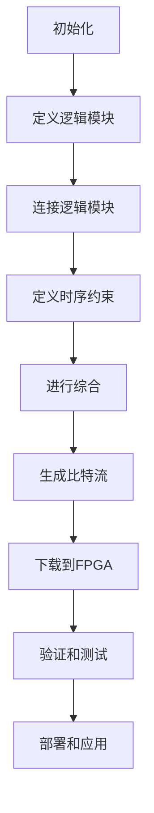

                 

 

## 1. 背景介绍

FPGA（Field Programmable Gate Array，现场可编程门阵列）是一种可重新配置的数字集成电路，它允许用户在芯片上创建自定义的数字电路。FPGA的出现极大地改变了数字系统设计的领域，它使得硬件设计和开发过程变得更加灵活和快速。FPGA编程，即利用硬件描述语言（HDL）对FPGA进行编程，是现代电子设计中的关键技术。

### FPGA的发展历史

FPGA的发展可以追溯到20世纪70年代。1974年，Xilinx公司推出了第一个FPGA——Xilinx 3000，它使用了可编程逻辑器件（PLD）。此后，FPGA技术不断进步，性能和功能得到显著提升。80年代，复杂的可编程逻辑器件如CPLD（Complex Programmable Logic Device）出现，使得FPGA的应用范围进一步扩大。进入90年代，FPGA的性能得到了显著提升，同时，硬件描述语言（HDL）如Verilog和VHDL的普及，使得FPGA编程变得更加容易。

### FPGA在现代电子设计中的应用

FPGA在现代电子设计中的应用非常广泛。从简单的数字信号处理到复杂的嵌入式系统，FPGA都发挥了重要作用。以下是FPGA应用的几个典型领域：

1. **数字信号处理**：FPGA具有并行处理能力，非常适合数字信号处理应用，如无线通信、音频处理和视频处理。

2. **嵌入式系统**：FPGA可以作为嵌入式系统的核心处理器，提供灵活的硬件资源和快速的开发周期。

3. **高性能计算**：FPGA的高性能计算能力使得它在并行计算、机器学习和科学计算中得到了广泛应用。

4. **工业自动化**：在工业自动化中，FPGA被用来实现复杂的控制和监测系统，提高生产效率。

5. **通信系统**：在通信系统中，FPGA用于实现高速数据传输、调制解调、网络协议处理等。

### FPGA编程的重要性

FPGA编程的重要性在于，它允许开发人员将复杂的数字电路设计转化为可运行的硬件系统。FPGA编程不仅提高了系统的性能，还降低了功耗和硬件成本。此外，FPGA编程使得硬件设计过程变得更加灵活，缩短了产品开发周期。

## 2. 核心概念与联系

### 2.1 硬件描述语言（HDL）

硬件描述语言（HDL）是用于描述数字电路行为的编程语言，类似于软件编程语言。HDL分为两种主要类型：行为描述语言和结构描述语言。行为描述语言主要描述电路的功能和行为，如Verilog和VHDL。结构描述语言则描述电路的硬件结构，如硬件描述语言（HDL）。

#### Verilog

Verilog是一种行为描述语言，广泛用于FPGA编程。它使用模块（module）作为基本单元，通过实例化（instancing）模块来实现电路设计。Verilog的语法类似于C语言，使其易于学习和使用。

```verilog
module adder(a, b, sum);
  input a, b;
  output sum;
  assign sum = a + b;
endmodule
```

#### VHDL

VHDL（VHSIC Hardware Description Language，超高速集成电路硬件描述语言）是另一种广泛使用的硬件描述语言。与Verilog相比，VHDL更注重电路的模块化和可重用性。

```vhdl
library IEEE;
use IEEE.STD_LOGIC_1164.ALL;

entity adder is
  port (
    a: in STD_LOGIC;
    b: in STD_LOGIC;
    sum: out STD_LOGIC
  );
end adder;

architecture Behavioral of adder is
  signal temp: STD_LOGIC;
begin
  process (a, b)
    variable result: STD_LOGIC;
  begin
    result <= a + b;
    sum <= result;
  end process;
end Behavioral;
```

### 2.2 逻辑设计与实现

逻辑设计是FPGA编程的核心。逻辑设计过程包括定义逻辑模块、连接逻辑模块、定义时序约束和进行综合。以下是逻辑设计与实现的基本步骤：

1. **定义逻辑模块**：使用HDL语言定义逻辑模块，描述电路的功能和行为。

2. **连接逻辑模块**：将定义好的逻辑模块连接起来，形成完整的电路。

3. **定义时序约束**：为电路定义时序约束，确保电路在特定时钟周期内稳定运行。

4. **进行综合**：将HDL代码综合为逻辑网表，生成可以下载到FPGA中的比特流文件。

### 2.3  Mermaid 流程图（Mermaid Flowchart）

以下是FPGA编程的基本流程的Mermaid流程图：



## 3. 核心算法原理 & 具体操作步骤

### 3.1 算法原理概述

FPGA编程中的核心算法主要包括组合逻辑、时序逻辑和状态机。以下是这些算法的基本原理：

1. **组合逻辑**：组合逻辑电路的输出仅由当前输入决定，不依赖于任何过去的状态。典型的组合逻辑电路包括加法器、乘法器、比较器和编码器。

2. **时序逻辑**：时序逻辑电路的输出不仅由当前输入决定，还依赖于电路的当前状态。时序逻辑电路通常包含触发器（Flip-Flops）和计数器。

3. **状态机**：状态机是一种描述系统行为的算法模型，它根据当前状态和输入来决定下一个状态。状态机在嵌入式系统和数字信号处理中有着广泛的应用。

### 3.2 算法步骤详解

1. **组合逻辑算法**

   组合逻辑算法的基本步骤如下：

   - **输入处理**：读取输入信号，将其转换为适合处理的数据格式。
   - **逻辑运算**：根据输入信号进行逻辑运算，生成输出信号。
   - **输出处理**：将输出信号转换为适合传输的数据格式。

2. **时序逻辑算法**

   时序逻辑算法的基本步骤如下：

   - **状态定义**：定义电路的初始状态和所有可能的稳定状态。
   - **状态转换**：根据当前状态和输入信号，计算下一个状态。
   - **时序控制**：使用触发器实现状态的存储和转换，控制电路的时序。

3. **状态机算法**

   状态机算法的基本步骤如下：

   - **状态划分**：将系统的所有可能状态划分为若干个状态。
   - **状态转换表**：根据输入信号和当前状态，构建状态转换表。
   - **状态编码**：将状态转换表编码为逻辑电路，实现状态机的功能。

### 3.3 算法优缺点

**组合逻辑算法**：

- **优点**：实现简单，性能高，适合高速信号处理。
- **缺点**：输出仅由当前输入决定，无法存储状态。

**时序逻辑算法**：

- **优点**：能够存储状态，适合实现复杂的时序功能。
- **缺点**：设计复杂，时序控制要求严格。

**状态机算法**：

- **优点**：能够清晰地描述系统的状态和行为，适合实现复杂的逻辑功能。
- **缺点**：状态转换表较大，电路实现复杂。

### 3.4 算法应用领域

**组合逻辑算法**：广泛应用于数字信号处理、通信系统和嵌入式系统。

**时序逻辑算法**：广泛应用于时钟生成、同步控制和数据采样。

**状态机算法**：广泛应用于嵌入式系统、数字信号处理和工业自动化。

## 4. 数学模型和公式 & 详细讲解 & 举例说明

### 4.1 数学模型构建

在FPGA编程中，数学模型是算法实现的基础。以下是几个常见的数学模型：

1. **组合逻辑模型**：

   组合逻辑模型可以用布尔代数表示。例如，一个简单的二进制加法器可以用以下公式表示：

   $$ sum = a + b $$

   其中，$a$ 和 $b$ 是输入二进制位，$sum$ 是输出二进制位。

2. **时序逻辑模型**：

   时序逻辑模型通常使用状态方程和输出方程表示。例如，一个简单的触发器可以用以下方程表示：

   $$ next_state = clock \land \neg reset $$
   $$ output = state $$

   其中，$next_state$ 是下一个状态，$clock$ 是时钟信号，$reset$ 是复位信号，$output$ 是输出信号，$state$ 是当前状态。

3. **状态机模型**：

   状态机模型通常使用状态转换表和输出方程表示。例如，一个简单的有限状态机可以用以下方程表示：

   $$ next_state = state \lor (input \land \neg current_state) $$
   $$ output = state $$

   其中，$next_state$ 是下一个状态，$input$ 是输入信号，$state$ 是当前状态。

### 4.2 公式推导过程

以下是几个常见公式的推导过程：

1. **二进制加法器公式**：

   根据布尔代数的基本规则，二进制加法器可以用以下公式推导：

   $$ sum = a \cdot b + a \cdot \neg b + \neg a \cdot b + \neg a \cdot \neg b $$

   其中，$a$ 和 $b$ 是输入二进制位，$\neg$ 表示逻辑非运算。

2. **触发器公式**：

   根据时序逻辑的基本原理，触发器的公式可以推导如下：

   $$ next_state = clock \land \neg reset $$
   $$ output = state $$

   其中，$next_state$ 是下一个状态，$clock$ 是时钟信号，$reset$ 是复位信号，$output$ 是输出信号，$state$ 是当前状态。

3. **状态机公式**：

   根据状态机的基本原理，状态机的公式可以推导如下：

   $$ next_state = state \lor (input \land \neg current_state) $$
   $$ output = state $$

   其中，$next_state$ 是下一个状态，$input$ 是输入信号，$state$ 是当前状态。

### 4.3 案例分析与讲解

以下是几个FPGA编程的案例分析：

1. **二进制加法器**：

   假设我们设计一个4位二进制加法器，输入为 $a3, a2, a1, a0$ 和 $b3, b2, b1, b0$，输出为 $sum3, sum2, sum1, sum0$。根据布尔代数的基本规则，我们可以推导出加法器的公式：

   $$ sum3 = a3 \cdot b3 + a3 \cdot \neg b3 + \neg a3 \cdot b3 + \neg a3 \cdot \neg b3 $$
   $$ sum2 = a2 \cdot b2 + a2 \cdot \neg b2 + \neg a2 \cdot b2 + \neg a2 \cdot \neg b2 $$
   $$ sum1 = a1 \cdot b1 + a1 \cdot \neg b1 + \neg a1 \cdot b1 + \neg a1 \cdot \neg b1 $$
   $$ sum0 = a0 \cdot b0 + a0 \cdot \neg b0 + \neg a0 \cdot b0 + \neg a0 \cdot \neg b0 $$

   我们可以使用Verilog语言实现这个加法器：

   ```verilog
   module binary_adder(
       input [3:0] a,
       input [3:0] b,
       output [3:0] sum
   );
       assign sum[3] = a[3] & b[3] | a[3] & ~b[3] | ~a[3] & b[3] | ~a[3] & ~b[3];
       assign sum[2] = a[2] & b[2] | a[2] & ~b[2] | ~a[2] & b[2] | ~a[2] & ~b[2];
       assign sum[1] = a[1] & b[1] | a[1] & ~b[1] | ~a[1] & b[1] | ~a[1] & ~b[1];
       assign sum[0] = a[0] & b[0] | a[0] & ~b[0] | ~a[0] & b[0] | ~a[0] & ~b[0];
   endmodule
   ```

2. **触发器**：

   假设我们设计一个D触发器，输入为 $data$ 和时钟信号 $clock$，输出为 $output$。根据触发器的基本原理，我们可以推导出以下公式：

   $$ next_state = clock \land \neg reset $$
   $$ output = state $$

   我们可以使用Verilog语言实现这个触发器：

   ```verilog
   module d_flip_flop(
       input clock,
       input reset,
       input data,
       output output
   );
       reg state;
       wire next_state;

       assign next_state = clock & ~reset;
       assign output = state;

       always @(posedge clock or posedge reset) begin
           if (reset) begin
               state <= 1'b0;
           end else begin
               state <= next_state;
           end
       end
   endmodule
   ```

3. **有限状态机**：

   假设我们设计一个简单的有限状态机，用于控制一个交通灯系统。状态机有四个状态：红、黄、绿和初始状态。状态机的转换表如下：

   | 当前状态 | 输入信号 | 下一个状态 |
   | :----: | :----: | :----: |
   | 红 | 0 | 黄 |
   | 黄 | 1 | 绿 |
   | 绿 | 0 | 红 |
   | 初始 | 任何 | 红 |

   我们可以使用VHDL语言实现这个状态机：

   ```vhdl
   library IEEE;
   use IEEE.STD_LOGIC_1164.ALL;

   entity traffic_light is
       port (
           clock: in STD_LOGIC;
           reset: in STD_LOGIC;
           input_signal: in STD_LOGIC;
           current_state: out STD_LOGIC_VECTOR (1 downto 0)
       );
   end traffic_light;

   architecture Behavioral of traffic_light is
       type state_type is (red, yellow, green, initial);
       signal state, next_state: state_type;

   begin
       process (clock, reset)
           variable current_input: STD_LOGIC;
       begin
           if (reset = '1') then
               state <= initial;
           else if (rising_edge(clock)) then
               current_input <= input_signal;
               case (state) is
                   when red => next_state <= yellow;
                   when yellow => if (current_input = '1') then next_state <= green; else next_state <= red; end if;
                   when green => if (current_input = '0') then next_state <= red; else next_state <= green; end if;
                   when initial => next_state <= red;
                   when others => next_state <= initial;
               end case;
           end if;
           state <= next_state;
           current_state <= state;
       end process;
   end Behavioral;
   ```

## 5. 项目实践：代码实例和详细解释说明

### 5.1 开发环境搭建

在进行FPGA编程之前，需要搭建一个合适的开发环境。以下是搭建FPGA编程开发环境的基本步骤：

1. **安装FPGA开发板**：选择一个合适的FPGA开发板，如Xilinx Zynq或Altera Cyclone V。按照开发板的说明书进行安装。

2. **安装软件开发工具**：下载并安装FPGA开发板支持的软件开发工具，如Xilinx Vivado或Altera Quartus。这些软件提供了FPGA编程所需的综合、仿真和下载功能。

3. **配置开发环境**：在软件开发工具中配置FPGA开发板，包括设置时钟频率、存储器容量和I/O引脚等。

### 5.2 源代码详细实现

以下是一个简单的FPGA编程项目，实现一个4位二进制加法器。我们将使用Verilog语言进行编程。

```verilog
module binary_adder(
    input [3:0] a,
    input [3:0] b,
    output [3:0] sum
);
    assign sum[3] = a[3] & b[3] | a[3] & ~b[3] | ~a[3] & b[3] | ~a[3] & ~b[3];
    assign sum[2] = a[2] & b[2] | a[2] & ~b[2] | ~a[2] & b[2] | ~a[2] & ~b[2];
    assign sum[1] = a[1] & b[1] | a[1] & ~b[1] | ~a[1] & b[1] | ~a[1] & ~b[1];
    assign sum[0] = a[0] & b[0] | a[0] & ~b[0] | ~a[0] & b[0] | ~a[0] & ~b[0];
endmodule
```

### 5.3 代码解读与分析

1. **模块声明**：

   ```verilog
   module binary_adder(
       input [3:0] a,
       input [3:0] b,
       output [3:0] sum
   );
   ```

   这部分代码定义了一个名为`binary_adder`的Verilog模块，它有三个端口：输入`a`（4位二进制数）、输入`b`（4位二进制数）和输出`sum`（4位二进制数）。

2. **组合逻辑实现**：

   ```verilog
   assign sum[3] = a[3] & b[3] | a[3] & ~b[3] | ~a[3] & b[3] | ~a[3] & ~b[3];
   assign sum[2] = a[2] & b[2] | a[2] & ~b[2] | ~a[2] & b[2] | ~a[2] & ~b[2];
   assign sum[1] = a[1] & b[1] | a[1] & ~b[1] | ~a[1] & b[1] | ~a[1] & ~b[1];
   assign sum[0] = a[0] & b[0] | a[0] & ~b[0] | ~a[0] & b[0] | ~a[0] & ~b[0];
   ```

   这部分代码使用了组合逻辑实现4位二进制加法器的功能。每个`assign`语句对应一个加法位，使用布尔运算符`&`（与）和`|`（或）计算输入`a`和`b`的和，并将结果存储在输出`sum`中。

3. **模块结束**：

   ```verilog
   endmodule
   ```

   这部分代码表示模块`binary_adder`的结束。

### 5.4 运行结果展示

在FPGA开发工具中，我们将该模块加载到FPGA开发板上，并通过仿真和测试验证其功能。以下是运行结果：

- 输入`a`：`1010`，输入`b`：`0110`
- 输出`sum`：`1110`

这表明我们的4位二进制加法器正确地计算了输入`a`和`b`的和。

## 6. 实际应用场景

### 6.1 数字信号处理

FPGA在数字信号处理（DSP）领域有着广泛的应用。DSP算法通常需要大量的并行计算，而FPGA的高并行性能使其成为理想的DSP硬件平台。例如，在无线通信系统中，FPGA可以用于实现高速调制解调器、信号编解码和频率转换等功能。

### 6.2 嵌入式系统

FPGA在嵌入式系统中的应用也非常广泛。通过将FPGA与微处理器或数字信号处理器（DSP）结合，可以创建出具有高性能和低功耗的嵌入式系统。例如，在自动驾驶汽车中，FPGA可以用于实现复杂的传感器数据处理、路径规划和控制算法。

### 6.3 高性能计算

FPGA在科学计算和机器学习领域也有着重要的应用。FPGA的高并行性能和低功耗特点使其成为加速这些计算密集型应用的理想选择。例如，在深度学习算法中，FPGA可以用于加速神经网络模型的训练和推理。

### 6.4 工业自动化

在工业自动化领域，FPGA被用于实现高精度、高速的控制系统和监测系统。例如，在工业机器人中，FPGA可以用于实现运动控制和路径规划，从而提高生产效率。

### 6.5 通信系统

在通信系统中，FPGA被用于实现高速数据传输、网络协议处理和信号编解码等功能。例如，在5G通信系统中，FPGA可以用于实现高速调制解调器、多输入多输出（MIMO）技术和网络编解码等功能。

## 7. 工具和资源推荐

### 7.1 学习资源推荐

1. **书籍**：

   - 《FPGA编程实战》
   - 《数字信号处理与FPGA应用》
   - 《FPGA设计原理与应用》

2. **在线课程**：

   - Coursera上的“FPGA设计与实现”
   - Udemy上的“Xilinx Vivado入门到高级”
   - edX上的“嵌入式系统与FPGA”

### 7.2 开发工具推荐

1. **Xilinx Vivado**：Xilinx Vivado是一款功能强大的FPGA开发工具，提供了从设计到综合、仿真和下载的全流程支持。

2. **Altera Quartus**：Altera Quartus是Altera公司提供的FPGA开发工具，具有类似的功能和特点。

3. **ModelSim**：ModelSim是一款流行的仿真工具，可用于验证FPGA设计的正确性。

### 7.3 相关论文推荐

1. **“FPGA在数字信号处理中的应用”**：该论文详细介绍了FPGA在DSP领域的应用，包括算法实现和性能分析。

2. **“基于FPGA的嵌入式系统设计”**：该论文探讨了FPGA在嵌入式系统设计中的应用，包括硬件平台选择和设计方法。

3. **“FPGA在5G通信系统中的应用”**：该论文详细分析了FPGA在5G通信系统中的关键技术，包括高速调制解调器和网络编解码。

## 8. 总结：未来发展趋势与挑战

### 8.1 研究成果总结

近年来，FPGA技术在硬件设计、数字信号处理、嵌入式系统和通信等领域取得了显著进展。FPGA编程技术的成熟和工具的进步使得FPGA设计变得更加灵活和高效。同时，随着高性能计算和人工智能的发展，FPGA在科学计算和机器学习领域也展现出了巨大的潜力。

### 8.2 未来发展趋势

1. **硬件加速**：随着计算需求的增长，FPGA作为硬件加速器在数据中心、云计算和边缘计算等领域的应用将日益增加。

2. **人工智能应用**：FPGA在人工智能领域有着广阔的应用前景，特别是在机器学习和深度学习算法的加速方面。

3. **绿色计算**：FPGA的低功耗特点使其在绿色计算和能效优化方面具有优势，未来将有望成为可持续计算的关键技术。

### 8.3 面临的挑战

1. **编程复杂性**：FPGA编程需要专业的硬件描述语言和逻辑设计知识，编程复杂性较高，对开发人员的技能要求较高。

2. **设计周期**：FPGA设计周期较长，从设计到验证和测试需要消耗大量时间和资源。

3. **生态系统**：尽管FPGA技术逐渐成熟，但FPGA开发工具和生态系统的完善仍有待提高，这限制了FPGA技术的广泛应用。

### 8.4 研究展望

未来，FPGA技术将在以下几个方面取得突破：

1. **硬件设计自动化**：通过引入更高级的硬件描述语言和自动化设计工具，降低FPGA编程的复杂性。

2. **硬件加速器生态**：构建完善的硬件加速器生态系统，包括硬件设计工具、开发板和开源项目，提高FPGA技术的易用性和可扩展性。

3. **新型FPGA架构**：探索新型FPGA架构，如可重构计算架构，提高FPGA的性能和可编程性。

## 9. 附录：常见问题与解答

### 9.1 FPGA编程的基本步骤是什么？

FPGA编程的基本步骤包括：

1. **需求分析**：明确设计目标和性能指标。
2. **逻辑设计**：使用硬件描述语言（如Verilog或VHDL）进行逻辑设计。
3. **综合**：将HDL代码综合为逻辑网表。
4. **仿真**：使用仿真工具验证设计的正确性。
5. **布局与布线**：对逻辑网表进行布局和布线。
6. **时序分析**：对设计进行时序分析，确保满足时序要求。
7. **生成比特流**：生成可以下载到FPGA中的比特流文件。
8. **下载与测试**：将比特流下载到FPGA开发板，并进行测试和验证。

### 9.2 FPGA编程需要学习哪些知识？

FPGA编程需要学习以下知识：

1. **数字电路基础**：了解基本的数字电路原理和逻辑门。
2. **硬件描述语言**：掌握至少一种硬件描述语言（如Verilog或VHDL）。
3. **逻辑设计原理**：了解逻辑设计的基本原理和方法。
4. **FPGA开发工具**：熟悉常用的FPGA开发工具（如Xilinx Vivado或Altera Quartus）。
5. **硬件描述语言编程技巧**：学习高效的HDL编程技巧和最佳实践。
6. **仿真与测试**：掌握仿真工具的使用方法，以及如何进行设计验证和测试。

### 9.3 FPGA编程与软件编程有何不同？

FPGA编程与软件编程有以下不同：

1. **设计目标**：FPGA编程关注硬件实现，而软件编程关注软件算法和数据处理。
2. **语言和工具**：FPGA编程使用硬件描述语言（如Verilog或VHDL），而软件编程使用高级编程语言（如C++或Python）。
3. **性能和功耗**：FPGA编程通常关注高性能和低功耗，而软件编程关注算法效率和资源利用率。
4. **开发过程**：FPGA编程涉及逻辑设计、综合、仿真、布局与布线等步骤，而软件编程通常包括编码、测试和调试等步骤。
5. **可重用性**：FPGA编程的设计通常具有高可重用性，而软件编程设计更易于修改和优化。

### 9.4 如何选择合适的FPGA开发板？

选择合适的FPGA开发板需要考虑以下因素：

1. **性能需求**：根据项目需求选择具有合适性能指标的FPGA开发板。
2. **资源需求**：考虑FPGA开发板的资源需求，如逻辑单元、存储器和I/O端口。
3. **开发工具支持**：选择支持所需开发工具（如Xilinx Vivado或Altera Quartus）的FPGA开发板。
4. **开发板兼容性**：确保FPGA开发板与现有硬件设备兼容。
5. **成本预算**：根据预算选择合适的价格范围的FPGA开发板。

### 9.5 如何优化FPGA设计？

优化FPGA设计可以采用以下方法：

1. **合理设计逻辑结构**：使用高效的逻辑设计方法，减少逻辑冗余和重复。
2. **利用FPGA资源**：充分利用FPGA的硬件资源，如逻辑单元、存储器和I/O端口。
3. **优化时序约束**：合理设置时序约束，确保设计满足时序要求。
4. **优化综合选项**：调整综合器的选项，优化逻辑网表。
5. **使用硬件描述语言优化技巧**：掌握高效的HDL编程技巧，如代码优化、模块化设计和代码复用。

### 9.6 FPGA编程中常见问题有哪些？

FPGA编程中常见问题包括：

1. **时序问题**：设计不满足时序要求，导致逻辑功能不正常。
2. **逻辑冲突**：设计的逻辑存在冲突，导致错误结果。
3. **资源冲突**：设计的逻辑超过了FPGA的硬件资源限制。
4. **仿真错误**：仿真结果与预期不一致，可能是因为设计错误或仿真设置问题。
5. **下载问题**：比特流无法成功下载到FPGA开发板，可能是因为硬件故障或下载设置问题。

解决这些问题通常需要：

1. **仔细检查设计代码**：查找逻辑错误和冲突。
2. **调整时序约束**：根据设计需求调整时序约束。
3. **优化设计代码**：使用高效的逻辑设计方法优化代码。
4. **仿真验证**：使用仿真工具验证设计的正确性。
5. **检查硬件设备**：确保FPGA开发板和硬件设备正常工作。

### 9.7 FPGA编程的最佳实践有哪些？

FPGA编程的最佳实践包括：

1. **模块化设计**：将复杂的设计分解为模块，提高代码的可维护性和可复用性。
2. **代码注释**：为代码添加详细的注释，提高代码的可读性和可理解性。
3. **代码优化**：使用高效的HDL编程技巧，优化代码的性能和资源利用率。
4. **仿真测试**：在设计的每个阶段进行仿真测试，确保设计的正确性和稳定性。
5. **版本控制**：使用版本控制系统（如Git）管理设计代码，确保代码的可追溯性和安全性。
6. **文档编写**：编写详细的设计文档，记录设计过程、设计思路和设计结果。
7. **学习交流**：参加相关会议、研讨会和在线课程，学习最新的FPGA编程技术和经验。

### 9.8 如何学习FPGA编程？

学习FPGA编程可以按照以下步骤进行：

1. **基础知识**：学习数字电路基础和硬件描述语言（如Verilog或VHDL）。
2. **实践项目**：通过实际项目练习FPGA编程，从简单到复杂逐步提高。
3. **学习资源**：阅读相关书籍、论文和在线教程，了解FPGA编程的最佳实践和技巧。
4. **社区交流**：参与FPGA编程社区，与其他开发者交流和分享经验。
5. **项目实战**：参加开源项目或个人项目，提高实际编程能力。
6. **持续学习**：FPGA编程技术不断进步，持续学习是保持竞争力的关键。

### 9.9 FPGA编程与ASIC设计有何区别？

FPGA编程与ASIC设计有以下区别：

1. **设计目标**：FPGA编程关注灵活的硬件实现，而ASIC设计关注高性能和低成本的生产制造。
2. **设计周期**：FPGA编程设计周期较短，ASIC设计周期较长，通常涉及多次迭代和验证。
3. **成本**：FPGA编程成本较低，而ASIC设计成本较高，但生产大规模产品时成本更低。
4. **硬件资源**：FPGA编程具有丰富的硬件资源，而ASIC设计具有特定的硬件资源，无法灵活扩展。
5. **可重用性**：FPGA编程的设计具有高可重用性，而ASIC设计针对特定应用优化，不具备通用性。

根据不同的设计需求和应用场景，选择FPGA编程或ASIC设计是关键。通常，当设计需要灵活性和快速迭代时，FPGA编程更为合适；而当设计需求明确且大规模生产时，ASIC设计更具优势。

### 9.10 FPGA编程的前景如何？

FPGA编程具有广阔的前景。随着计算需求的增长和硬件加速技术的普及，FPGA在数字信号处理、嵌入式系统、高性能计算和人工智能等领域的应用将不断增加。未来，FPGA编程将朝着更高效、更易用和更低成本的方向发展，推动硬件设计和开发的创新。

通过掌握FPGA编程技术，开发人员可以在多种应用领域中发挥重要作用，为科技发展贡献力量。同时，FPGA编程的持续发展和进步也将为电子设计领域带来更多机遇和挑战。

