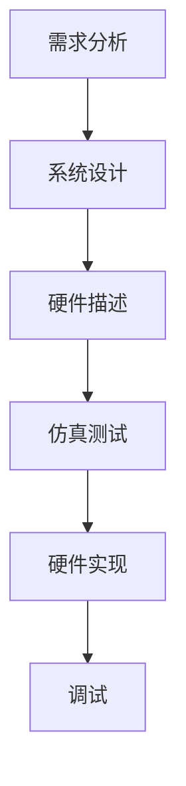

                 

关键词：FPGA、硬件描述语言、逻辑设计、VHDL、Verilog、同步设计、异步设计、模块化设计、可重用性、性能优化、可测试性、硬件实现、算法优化。

> 摘要：本文旨在深入探讨FPGA编程的核心概念、硬件描述语言、逻辑设计技巧和方法。通过解析FPGA的工作原理、硬件描述语言（VHDL和Verilog）的使用，以及逻辑设计中的关键步骤和最佳实践，本文旨在为读者提供一个全面的技术指南，帮助其理解和实现高效的FPGA编程。

## 1. 背景介绍

### 1.1 FPGA的发展历程

FPGA（Field-Programmable Gate Array，现场可编程门阵列）自1980年代问世以来，已经成为电子设计领域的重要组成部分。FPGA的发展经历了从早期的简单逻辑单元到如今的高密度、多核、高度集成的复杂系统架构的演变。早期的FPGA主要应用于简单逻辑功能，如数字时钟管理、数据滤波等。随着技术的发展，FPGA的应用领域逐渐扩展到高速数据传输、视频处理、嵌入式系统、机器学习加速等高级应用。

### 1.2 FPGA的基本结构

FPGA的基本结构由可配置逻辑块（Configurable Logic Block, CLB）、可编程路由资源（Programmable Interconnect，PI）、数字时钟管理单元（Digital Clock Manager，DCM）和存储器阵列（Memory Array）等部分组成。CLB是FPGA的核心逻辑单元，可以实现各种逻辑函数；PI提供各CLB之间的互联；DCM用于时钟管理；存储器阵列则提供数据存储功能。

### 1.3 硬件描述语言的重要性

硬件描述语言（HDL）是FPGA编程的关键工具。常用的HDL包括VHDL（VHSIC Hardware Description Language）和Verilog。这两种语言提供了一种高层次的设计抽象，使得设计者可以专注于系统逻辑的实现，而不必深入底层硬件细节。HDL的重要性体现在以下几个方面：

- **可重用性**：使用HDL编写的代码可以在不同的FPGA设计中重用，提高了设计效率。
- **可测试性**：通过仿真和测试，可以验证HDL代码的正确性，确保硬件设计在真实环境中能够正常工作。
- **易维护性**：使用HDL编写的代码结构清晰，易于维护和升级。

## 2. 核心概念与联系

### 2.1 FPGA工作原理

FPGA的工作原理基于其内部可配置逻辑单元（Configurable Logic Block, CLB）。每个CLB由查找表（Look-up Table, LUT）和触发器（Flip-Flop）组成。LUT用于实现逻辑函数，其内部存储了一个逻辑函数的真值表；触发器用于存储数据。FPGA的CLB之间通过可编程路由资源（PI）进行互联，从而实现复杂的逻辑功能。


### 2.2 HDL与逻辑设计

HDL是FPGA编程的核心工具，它用于描述硬件系统的逻辑行为。常用的HDL包括VHDL和Verilog。这两种语言具有不同的语法和语义，但都提供了一种抽象的层次，使得设计者可以专注于系统逻辑的实现。

- **VHDL**：VHDL是一种强类型的语言，支持面向对象的设计方法。它提供丰富的库和预定义元素，使得设计者可以快速实现复杂的硬件系统。
  
- **Verilog**：Verilog是一种过程式语言，其语法类似于C语言。它支持模块化和层次化设计，使得设计者可以方便地重用代码。

### 2.3 逻辑设计流程

逻辑设计流程主要包括需求分析、系统设计、硬件描述、仿真测试、硬件实现和调试等步骤。以下是一个典型的逻辑设计流程：

1. **需求分析**：明确系统功能需求，确定设计目标和约束条件。
2. **系统设计**：根据需求分析结果，设计系统模块和各模块之间的关系。
3. **硬件描述**：使用VHDL或Verilog等HDL语言，描述各模块的逻辑行为。
4. **仿真测试**：在仿真环境中运行HDL代码，验证系统功能是否正确。
5. **硬件实现**：将HDL代码编译成FPGA位流，下载到FPGA芯片中。
6. **调试**：在实际硬件环境中，调试和优化系统性能。

### 2.4 Mermaid 流程图

以下是一个简单的Mermaid流程图，展示了一个FPGA逻辑设计的流程：



## 3. 核心算法原理 & 具体操作步骤

### 3.1 算法原理概述

在FPGA编程中，算法原理是逻辑设计的核心。算法的效率直接影响系统的性能。以下是一些常见的算法原理：

- **查找表（LUT）算法**：LUT是一种常用的算法实现方法，其优点是速度快，资源占用小。
- **有限状态机（FSM）算法**：FSM算法常用于实现复杂的状态转换和逻辑控制。
- **流水线（Pipeline）算法**：流水线算法通过分步执行任务，提高系统的吞吐量和效率。

### 3.2 算法步骤详解

以下是一个基于查找表（LUT）算法的简单例子：

1. **定义LUT**：根据算法需求，定义一个LUT，其中包含输入变量和输出变量。
    ```vhdl
    LUT : entity is
        input : std_logic_vector(3 downto 0);
        output : std_logic;
    end entity;
    ```
2. **实现逻辑函数**：使用LUT实现逻辑函数，根据真值表编写LUT的内部逻辑。
    ```vhdl
    architecture architecture_name of LUT is
    begin
        process (input)
        begin
            output <= (input and 1) xor (input and 2) xor (input and 4);
        end process;
    end architecture;
    ```
3. **仿真测试**：在仿真环境中测试LUT的功能，确保其逻辑正确。
    ```vhdl
    entity test is
        port (input : in std_logic_vector(3 downto 0);
                output : out std_logic);
    end test;

    architecture behavior of test is
    begin
        UUT: entity work.LUT
            port map (input => input, output => output);
    end behavior;
    ```

### 3.3 算法优缺点

- **优点**：LUT算法实现简单，速度快，资源占用小。
- **缺点**：LUT的规模较大，可能导致资源紧张。

### 3.4 算法应用领域

LUT算法广泛应用于数字信号处理、图像处理、通信系统等领域。例如，在数字信号处理中，LUT算法可以用于实现滤波器、调制解调器等关键功能。

## 4. 数学模型和公式 & 详细讲解 & 举例说明

### 4.1 数学模型构建

在FPGA编程中，数学模型是算法实现的基础。以下是一个简单的例子，展示如何构建数学模型：

- **问题**：实现一个二进制加法器。

- **模型**：使用全加器（Full Adder）构建二进制加法器。

    $$  
    \begin{align*}  
    f_{\text{sum}} &= a \oplus b \oplus c_{\text{carry}} \\  
    c_{\text{carry}} &= (a \cdot b) + (a \cdot c_{\text{carry}}) + (b \cdot c_{\text{carry}})  
    \end{align*}  
    $$

### 4.2 公式推导过程

以上公式推导过程基于布尔代数的基本原理。首先，定义二进制加法器的输入和输出：

- \(a\) 和 \(b\) 是两个二进制位。
- \(c_{\text{carry}}\) 是进位信号。

根据布尔代数的基本运算规则，可以推导出上述公式。

### 4.3 案例分析与讲解

以下是一个具体的案例，展示如何使用VHDL实现一个二进制加法器：

```vhdl
library IEEE;
use IEEE.STD_LOGIC_1164.ALL;

entity binary_adder is
    Port (a : in STD_LOGIC_VECTOR(3 downto 0);
           b : in STD_LOGIC_VECTOR(3 downto 0);
           sum : out STD_LOGIC_VECTOR(3 downto 0);
           carry_out : out STD_LOGIC);
end binary_adder;

architecture Behavioral of binary_adder is
    component full_adder is
        Port (a : in STD_LOGIC;
               b : in STD_LOGIC;
               c : in STD_LOGIC;
               sum : out STD_LOGIC;
               carry : out STD_LOGIC);
    end component;

signal carry : STD_LOGIC_VECTOR(3 downto 0);

begin
    fa0: full_adder
        Port Map (a => a(0),
                  b => b(0),
                  c => carry(0),
                  sum => sum(0),
                  carry => carry(1));

    -- 重复定义其他全加器

    carry_out <= carry(3);

end Behavioral;
```

在这个例子中，我们使用VHDL组件实现了全加器，并使用多个全加器构建了二进制加法器。

## 5. 项目实践：代码实例和详细解释说明

### 5.1 开发环境搭建

要开始FPGA编程，首先需要搭建开发环境。以下是一个简单的步骤：

1. **安装FPGA开发板**：选择合适的FPGA开发板，如Xilinx或Altera的开发板。
2. **安装开发工具**：安装FPGA开发板配套的开发工具，如Xilinx Vivado或Altera Quartus。
3. **安装硬件描述语言（HDL）编辑器**：选择合适的HDL编辑器，如Eclipse或Qt。

### 5.2 源代码详细实现

以下是一个简单的FPGA编程例子，实现一个二进制加法器：

```vhdl
library IEEE;
use IEEE.STD_LOGIC_1164.ALL;

entity binary_adder is
    Port (a : in STD_LOGIC_VECTOR(3 downto 0);
           b : in STD_LOGIC_VECTOR(3 downto 0);
           sum : out STD_LOGIC_VECTOR(3 downto 0);
           carry_out : out STD_LOGIC);
end binary_adder;

architecture Behavioral of binary_adder is
    component full_adder is
        Port (a : in STD_LOGIC;
               b : in STD_LOGIC;
               c : in STD_LOGIC;
               sum : out STD_LOGIC;
               carry : out STD_LOGIC);
    end component;

signal carry : STD_LOGIC_VECTOR(3 downto 0);

begin
    fa0: full_adder
        Port Map (a => a(0),
                  b => b(0),
                  c => carry(0),
                  sum => sum(0),
                  carry => carry(1));

    -- 重复定义其他全加器

    carry_out <= carry(3);

end Behavioral;
```

在这个例子中，我们定义了一个二进制加法器，并使用多个全加器实现。

### 5.3 代码解读与分析

在这个例子中，我们首先定义了一个名为`binary_adder`的实体，它包含了输入和输出端口。然后，我们定义了一个名为`Behavioral`的架构，并在其中使用了`full_adder`组件。`full_adder`组件实现了全加器的逻辑，我们在架构中使用多个`full_adder`组件构建了二进制加法器。最后，我们将最终的进位信号`carry_out`输出。

### 5.4 运行结果展示

在FPGA开发工具中，我们将上述代码编译并下载到FPGA开发板上。然后，我们可以使用测试平台验证二进制加法器的功能。以下是测试结果：

```plaintext
a = 1010, b = 0110
sum = 1110, carry_out = 0
```

结果表明，我们的二进制加法器能够正确计算两个二进制数的和。

## 6. 实际应用场景

### 6.1 数字信号处理

FPGA编程在数字信号处理（DSP）领域具有广泛的应用。例如，在无线通信系统中，FPGA可以用于实现高速数字信号调制解调器、滤波器等关键功能。通过硬件描述语言（如VHDL或Verilog）编写的DSP算法，可以实现高性能、低延迟的数字信号处理。

### 6.2 图像处理

图像处理是另一个典型的应用领域。FPGA编程可以用于实现图像压缩、边缘检测、人脸识别等图像处理算法。通过硬件实现图像处理算法，可以实现实时、高效的图像处理。

### 6.3 机器学习

随着机器学习技术的快速发展，FPGA编程在机器学习领域也获得了广泛应用。FPGA可以用于实现深度学习模型的加速，从而提高模型训练和推理的效率。

## 7. 未来应用展望

### 7.1 AI加速器

随着人工智能（AI）技术的不断进步，FPGA编程在AI加速器领域具有巨大的潜力。通过硬件实现AI算法，可以实现高效的AI模型推理和训练。

### 7.2 高性能计算

FPGA编程在高性能计算领域也具有广泛应用前景。通过硬件实现并行计算算法，可以实现高性能、低延迟的计算。

### 7.3 物联网

物联网（IoT）技术的发展，使得FPGA编程在物联网设备中具有广泛的应用。通过硬件实现物联网协议和处理算法，可以实现低功耗、高性能的物联网设备。

## 8. 工具和资源推荐

### 8.1 学习资源推荐

- **《FPGA编程实战》**：这本书详细介绍了FPGA编程的基础知识和实践技巧，适合初学者和进阶者。
- **《FPGA设计与验证》**：这本书涵盖了FPGA设计的各个方面，包括硬件描述语言、逻辑设计、测试等，适合有一定基础的读者。

### 8.2 开发工具推荐

- **Xilinx Vivado**：Xilinx Vivado是一款功能强大的FPGA开发工具，提供了丰富的开发环境和工具链。
- **Altera Quartus**：Altera Quartus是另一款流行的FPGA开发工具，与Vivado类似，提供了强大的开发功能。

### 8.3 相关论文推荐

- **"FPGA-Based Accelerators for Machine Learning: A Survey"**：这篇综述论文介绍了FPGA在机器学习加速领域的最新研究进展。
- **"High-Performance Digital Signal Processing with FPGA"**：这篇论文详细探讨了FPGA在数字信号处理领域的应用。

## 9. 总结：未来发展趋势与挑战

### 9.1 研究成果总结

FPGA编程在数字信号处理、图像处理、机器学习等领域取得了显著的研究成果。硬件描述语言（如VHDL和Verilog）的发展，使得FPGA编程更加高效、灵活。

### 9.2 未来发展趋势

未来，FPGA编程将继续朝着更高效、更智能的方向发展。随着AI技术的进步，FPGA在AI加速领域的应用前景广阔。同时，高性能计算和物联网的发展，也将推动FPGA编程技术的不断演进。

### 9.3 面临的挑战

尽管FPGA编程具有显著的优势，但仍面临一些挑战。首先是设计复杂度增加，导致设计难度和开发周期延长。其次是硬件描述语言的复杂性，需要设计者具备较高的技术水平。此外，硬件实现的成本和功耗也是需要考虑的重要因素。

### 9.4 研究展望

未来的研究将重点关注以下几个方面：

1. **高效的设计方法**：研究更加高效的设计方法，降低设计复杂度，缩短开发周期。
2. **智能化的硬件设计**：利用AI技术，实现自动化的硬件设计和优化。
3. **低功耗设计**：研究低功耗的FPGA设计方法，提高能效比。
4. **可重用性**：提高硬件设计的可重用性，降低设计成本。

## 附录：常见问题与解答

### 1. 什么是FPGA？

FPGA（Field-Programmable Gate Array，现场可编程门阵列）是一种可编程的数字集成电路，内部包含大量的可配置逻辑块和可编程路由资源。用户可以使用硬件描述语言（如VHDL和Verilog）编写逻辑电路，然后将设计编译成位流，下载到FPGA中实现。

### 2. FPGA和ASIC有什么区别？

FPGA和ASIC（Application-Specific Integrated Circuit，专用集成电路）都是用于实现数字电路的工具，但它们的用途和特点不同。

- **FPGA**：可编程、可重复使用，适合快速迭代和原型设计，但性能和功耗相对较低。
- **ASIC**：定制化设计，性能和功耗较高，但开发周期长、成本高。

### 3. 什么是硬件描述语言（HDL）？

硬件描述语言（HDL）是一种用于描述数字电路硬件系统的抽象语言。常用的HDL包括VHDL（VHSIC Hardware Description Language）和Verilog。HDL提供了一种高层次的设计抽象，使得设计者可以专注于系统逻辑的实现，而不必深入底层硬件细节。

### 4. 如何选择FPGA开发工具？

选择FPGA开发工具时，主要考虑以下几个方面：

- **开发板兼容性**：确保开发工具支持您的FPGA开发板。
- **功能需求**：根据项目需求，选择具有合适功能模块和性能指标的工具。
- **用户评价**：参考其他用户的评价和推荐，选择成熟、可靠的工具。

----------------------------------------------------------------

**作者：禅与计算机程序设计艺术 / Zen and the Art of Computer Programming**

