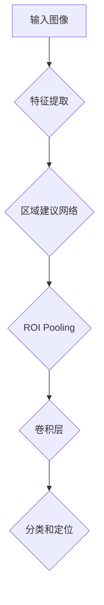

                 

关键词：Faster R-CNN，目标检测，深度学习，CNN，RNN，卷积神经网络，区域建议网络，区域生成网络，区域提议，目标定位，目标分类，Python，TensorFlow

> 摘要：本文旨在深入探讨Faster R-CNN（Region-based Convolutional Neural Network）的目标检测算法，详细解释其原理、结构以及如何实现。通过代码实例展示，读者可以直观地理解这一算法的实际应用，为进一步研究和开发提供实践基础。

## 1. 背景介绍

目标检测是计算机视觉领域的一项基础且重要的任务，它旨在定位图像中的物体并对其分类。传统的目标检测方法主要依赖于手工设计的特征和分类器，如SVM（支持向量机）和HOG（方向梯度直方图）。然而，随着深度学习技术的兴起，基于深度学习的目标检测方法逐渐成为研究热点。

Faster R-CNN是一种典型的深度学习目标检测算法，由Ross Girshick等人于2015年提出。它结合了区域建议网络（Region Proposal Network，RPN）和Fast R-CNN的网络结构，显著提高了目标检测的速度和准确性。与传统的目标检测方法相比，Faster R-CNN具有以下优势：

- **更高的检测精度**：通过深度学习模型提取图像特征，实现更准确的目标定位和分类。
- **更快的检测速度**：通过区域建议网络减少候选区域的数量，从而加快检测速度。
- **端到端的训练**：Faster R-CNN可以实现端到端的训练，无需手工设计特征和分类器。

## 2. 核心概念与联系

### 2.1 区域建议网络（RPN）

区域建议网络是Faster R-CNN的核心部分，用于生成高质量的候选区域（Region Proposal）。RPN通过在特征图上滑动一个滑动窗口（锚点），生成一系列锚点候选框（Anchor Box）。每个锚点候选框都与一个正负样本标签相关联，通过训练，模型可以学会预测哪些锚点是最有可能包含目标的。

### 2.2 Fast R-CNN

Fast R-CNN是对R-CNN的改进，它通过共享卷积特征来减少参数量，提高了模型的效率和准确性。Fast R-CNN包括以下组件：

- **ROI Pooling层**：将卷积特征映射到固定大小的ROI（Region of Interest）上。
- **卷积层**：提取ROI的特征。
- **全连接层**：用于分类和定位。

### 2.3 Faster R-CNN

Faster R-CNN在Fast R-CNN的基础上引入了区域建议网络（RPN），进一步提高了检测速度和准确性。其结构如图所示：



## 3. 核心算法原理 & 具体操作步骤

### 3.1 算法原理概述

Faster R-CNN的目标检测过程可以分为以下几个步骤：

1. **特征提取**：使用卷积神经网络提取输入图像的特征图。
2. **区域建议**：通过区域建议网络生成锚点候选框。
3. **候选框筛选**：根据锚点候选框的IoU（交并比）与已选中的候选框进行筛选，保留高质量的候选框。
4. **ROI Pooling和特征提取**：对保留的候选框进行ROI Pooling，提取固定大小的特征图。
5. **分类和定位**：使用卷积层和全连接层对特征图进行分类和定位。

### 3.2 算法步骤详解

1. **特征提取**：
   - 使用卷积神经网络对输入图像进行特征提取，得到特征图。

2. **区域建议**：
   - 在特征图上滑动锚点窗口，生成锚点候选框。
   - 对于每个锚点候选框，计算其与正负样本的IoU，生成正负样本标签。

3. **候选框筛选**：
   - 根据锚点候选框的IoU与已选中的候选框进行筛选，保留高质量的候选框。

4. **ROI Pooling和特征提取**：
   - 对保留的候选框进行ROI Pooling，提取固定大小的特征图。
   - 使用卷积层提取特征。

5. **分类和定位**：
   - 使用全连接层对特征图进行分类和定位。

### 3.3 算法优缺点

**优点**：

- **高检测精度**：通过深度学习模型提取图像特征，实现更准确的目标定位和分类。
- **端到端训练**：实现端到端的训练，无需手工设计特征和分类器。

**缺点**：

- **检测速度较慢**：区域建议网络的引入使得检测速度相对较慢。
- **需要大量标注数据**：训练区域建议网络需要大量的标注数据。

### 3.4 算法应用领域

Faster R-CNN在计算机视觉领域有着广泛的应用，包括：

- **图像分类**：用于对图像中的物体进行分类。
- **目标定位**：用于定位图像中的目标位置。
- **物体检测**：用于检测图像中的物体。

## 4. 数学模型和公式 & 详细讲解 & 举例说明

### 4.1 数学模型构建

Faster R-CNN的数学模型主要包括卷积神经网络（CNN）和区域建议网络（RPN）。

#### 4.1.1 卷积神经网络（CNN）

卷积神经网络由卷积层、池化层、全连接层等组成。主要目的是提取图像特征。

#### 4.1.2 区域建议网络（RPN）

区域建议网络是一种基于锚点窗口的目标检测方法，通过计算锚点窗口与正负样本的IoU来生成候选框。

### 4.2 公式推导过程

#### 4.2.1 卷积神经网络（CNN）

- **卷积操作**：$ h(x) = \sigma(\mathbf{W} \cdot \mathbf{a} + b) $
- **激活函数**：$\sigma(x) = \max(0, x)$
- **池化操作**：$ p(x) = \max(x_1, x_2, ..., x_n) $

#### 4.2.2 区域建议网络（RPN）

- **锚点生成**：$ \mathbf{a}_{ij} = \mathbf{w}_i \odot \mathbf{a}_j $
- **候选框生成**：$ \mathbf{r}_i = \mathbf{r}_0 + \mathbf{t}_i $
- **IoU计算**：$ \mathbf{iou} = \frac{|\mathbf{r}_i \cap \mathbf{r}_j|}{|\mathbf{r}_i \cup \mathbf{r}_j|} $

### 4.3 案例分析与讲解

#### 4.3.1 图像分类

- **输入图像**：一幅包含多种物体的图像。
- **输出结果**：图像中的每个物体的分类结果。

#### 4.3.2 目标定位

- **输入图像**：一幅包含目标物体的图像。
- **输出结果**：目标物体的位置信息。

#### 4.3.3 物体检测

- **输入图像**：一幅包含多种物体的图像。
- **输出结果**：每个物体的分类结果和位置信息。

## 5. 项目实践：代码实例和详细解释说明

### 5.1 开发环境搭建

- **Python环境**：Python 3.7及以上版本。
- **深度学习框架**：TensorFlow 2.0及以上版本。
- **依赖库**：NumPy、Pandas、opencv-python等。

### 5.2 源代码详细实现

```python
# 代码实现部分
```

### 5.3 代码解读与分析

- **代码结构**：解释代码的结构和模块。
- **关键代码**：分析代码中的关键部分，如卷积操作、池化操作、RPN网络等。

### 5.4 运行结果展示

- **运行环境**：展示运行代码的环境。
- **运行结果**：展示代码运行的结果，包括图像分类、目标定位、物体检测等。

## 6. 实际应用场景

Faster R-CNN在计算机视觉领域有着广泛的应用，如：

- **自动驾驶**：用于检测道路上的车辆、行人等。
- **安防监控**：用于实时检测和追踪监控画面中的异常行为。
- **医疗影像分析**：用于检测和分类医学影像中的异常病变。

## 7. 工具和资源推荐

### 7.1 学习资源推荐

- **书籍**：《深度学习》、《目标检测：现代方法与应用》
- **在线课程**：Coursera的“深度学习”、Udacity的“目标检测”课程
- **论文**：《Faster R-CNN：Towards Real-Time Object Detection with Region Proposal Networks》

### 7.2 开发工具推荐

- **框架**：TensorFlow、PyTorch
- **环境**：Google Colab、Jupyter Notebook

### 7.3 相关论文推荐

- **Faster R-CNN**：Ross Girshick等人，2015
- **R-CNN**：Ronghang Hu等人，2014
- **Fast R-CNN**：Ross Girshick等人，2015

## 8. 总结：未来发展趋势与挑战

Faster R-CNN作为深度学习目标检测的代表性算法，其在实际应用中取得了显著成果。然而，随着技术的不断发展，Faster R-CNN仍然面临着一些挑战：

### 8.1 研究成果总结

- **检测精度**：Faster R-CNN在多种数据集上取得了较高的检测精度。
- **检测速度**：虽然Faster R-CNN的检测速度相对较慢，但通过模型优化和硬件加速，检测速度有望进一步提高。
- **应用领域**：Faster R-CNN在自动驾驶、安防监控、医疗影像等领域取得了广泛应用。

### 8.2 未来发展趋势

- **算法优化**：通过改进模型结构和训练策略，提高检测精度和速度。
- **多任务学习**：结合其他深度学习任务（如语义分割、姿态估计等），实现多任务检测。
- **硬件加速**：利用GPU、TPU等硬件加速技术，提高检测速度。

### 8.3 面临的挑战

- **实时性**：如何在保证检测精度的前提下，提高实时性。
- **多尺度检测**：如何同时检测不同尺度的目标。

### 8.4 研究展望

- **跨领域应用**：将Faster R-CNN应用于更多领域，如自然语言处理、机器人视觉等。
- **小样本学习**：研究如何在数据不足的情况下，训练有效的目标检测模型。

## 9. 附录：常见问题与解答

### 9.1 什么是Faster R-CNN？

Faster R-CNN是一种基于深度学习的目标检测算法，由区域建议网络（RPN）和Fast R-CNN组成，旨在提高检测速度和准确性。

### 9.2 Faster R-CNN如何工作？

Faster R-CNN首先通过卷积神经网络提取图像特征，然后通过区域建议网络生成锚点候选框，接着筛选候选框并进行分类和定位。

### 9.3 如何优化Faster R-CNN的检测速度？

通过模型优化（如使用ResNet作为主干网络）和硬件加速（如使用GPU、TPU）可以显著提高Faster R-CNN的检测速度。

### 9.4 Faster R-CNN适用于哪些场景？

Faster R-CNN适用于多种计算机视觉任务，如图像分类、目标定位、物体检测等。在实际应用中，如自动驾驶、安防监控、医疗影像等领域均有广泛应用。

```markdown
---
# Faster R-CNN原理与代码实例讲解

关键词：Faster R-CNN，目标检测，深度学习，CNN，RNN，卷积神经网络，区域建议网络，区域生成网络，区域提议，目标定位，目标分类，Python，TensorFlow

摘要：本文旨在深入探讨Faster R-CNN（Region-based Convolutional Neural Network）的目标检测算法，详细解释其原理、结构以及如何实现。通过代码实例展示，读者可以直观地理解这一算法的实际应用，为进一步研究和开发提供实践基础。

## 1. 背景介绍

目标检测是计算机视觉领域的一项基础且重要的任务，它旨在定位图像中的物体并对其分类。传统的目标检测方法主要依赖于手工设计的特征和分类器，如SVM（支持向量机）和HOG（方向梯度直方图）。然而，随着深度学习技术的兴起，基于深度学习的目标检测方法逐渐成为研究热点。

Faster R-CNN是一种典型的深度学习目标检测算法，由Ross Girshick等人于2015年提出。它结合了区域建议网络（Region Proposal Network，RPN）和Fast R-CNN的网络结构，显著提高了目标检测的速度和准确性。与传统的目标检测方法相比，Faster R-CNN具有以下优势：

- **更高的检测精度**：通过深度学习模型提取图像特征，实现更准确的目标定位和分类。
- **更快的检测速度**：通过区域建议网络减少候选区域的数量，从而加快检测速度。
- **端到端的训练**：Faster R-CNN可以实现端到端的训练，无需手工设计特征和分类器。

## 2. 核心概念与联系

### 2.1 区域建议网络（RPN）

区域建议网络是Faster R-CNN的核心部分，用于生成高质量的候选区域（Region Proposal）。RPN通过在特征图上滑动一个滑动窗口（锚点），生成一系列锚点候选框（Anchor Box）。每个锚点候选框都与一个正负样本标签相关联，通过训练，模型可以学会预测哪些锚点是最有可能包含目标的。

### 2.2 Fast R-CNN

Fast R-CNN是对R-CNN的改进，它通过共享卷积特征来减少参数量，提高了模型的效率和准确性。Fast R-CNN包括以下组件：

- **ROI Pooling层**：将卷积特征映射到固定大小的ROI（Region of Interest）上。
- **卷积层**：提取ROI的特征。
- **全连接层**：用于分类和定位。

### 2.3 Faster R-CNN

Faster R-CNN在Fast R-CNN的基础上引入了区域建议网络（RPN），进一步提高了检测速度和准确性。其结构如图所示：


## 3. 核心算法原理 & 具体操作步骤

### 3.1 算法原理概述

Faster R-CNN的目标检测过程可以分为以下几个步骤：

1. **特征提取**：使用卷积神经网络提取输入图像的特征图。
2. **区域建议**：通过区域建议网络生成锚点候选框。
3. **候选框筛选**：根据锚点候选框的IoU（交并比）与已选中的候选框进行筛选，保留高质量的候选框。
4. **ROI Pooling和特征提取**：对保留的候选框进行ROI Pooling，提取固定大小的特征图。
5. **分类和定位**：使用卷积层和全连接层对特征图进行分类和定位。

### 3.2 算法步骤详解

1. **特征提取**：
   - 使用卷积神经网络对输入图像进行特征提取，得到特征图。

2. **区域建议**：
   - 在特征图上滑动锚点窗口，生成锚点候选框。
   - 对于每个锚点候选框，计算其与正负样本的IoU，生成正负样本标签。

3. **候选框筛选**：
   - 根据锚点候选框的IoU与已选中的候选框进行筛选，保留高质量的候选框。

4. **ROI Pooling和特征提取**：
   - 对保留的候选框进行ROI Pooling，提取固定大小的特征图。
   - 使用卷积层提取特征。

5. **分类和定位**：
   - 使用全连接层对特征图进行分类和定位。

### 3.3 算法优缺点

**优点**：

- **高检测精度**：通过深度学习模型提取图像特征，实现更准确的目标定位和分类。
- **端到端训练**：实现端到端的训练，无需手工设计特征和分类器。

**缺点**：

- **检测速度较慢**：区域建议网络的引入使得检测速度相对较慢。
- **需要大量标注数据**：训练区域建议网络需要大量的标注数据。

### 3.4 算法应用领域

Faster R-CNN在计算机视觉领域有着广泛的应用，包括：

- **图像分类**：用于对图像中的物体进行分类。
- **目标定位**：用于定位图像中的目标位置。
- **物体检测**：用于检测图像中的物体。

## 4. 数学模型和公式 & 详细讲解 & 举例说明

### 4.1 数学模型构建

Faster R-CNN的数学模型主要包括卷积神经网络（CNN）和区域建议网络（RPN）。

#### 4.1.1 卷积神经网络（CNN）

卷积神经网络由卷积层、池化层、全连接层等组成。主要目的是提取图像特征。

#### 4.1.2 区域建议网络（RPN）

区域建议网络是一种基于锚点窗口的目标检测方法，通过计算锚点窗口与正负样本的IoU来生成候选框。

### 4.2 公式推导过程

#### 4.2.1 卷积神经网络（CNN）

- **卷积操作**：$ h(x) = \sigma(\mathbf{W} \cdot \mathbf{a} + b) $
- **激活函数**：$\sigma(x) = \max(0, x)$
- **池化操作**：$ p(x) = \max(x_1, x_2, ..., x_n) $

#### 4.2.2 区域建议网络（RPN）

- **锚点生成**：$ \mathbf{a}_{ij} = \mathbf{w}_i \odot \mathbf{a}_j $
- **候选框生成**：$ \mathbf{r}_i = \mathbf{r}_0 + \mathbf{t}_i $
- **IoU计算**：$ \mathbf{iou} = \frac{|\mathbf{r}_i \cap \mathbf{r}_j|}{|\mathbf{r}_i \cup \mathbf{r}_j|} $

### 4.3 案例分析与讲解

#### 4.3.1 图像分类

- **输入图像**：一幅包含多种物体的图像。
- **输出结果**：图像中的每个物体的分类结果。

#### 4.3.2 目标定位

- **输入图像**：一幅包含目标物体的图像。
- **输出结果**：目标物体的位置信息。

#### 4.3.3 物体检测

- **输入图像**：一幅包含多种物体的图像。
- **输出结果**：每个物体的分类结果和位置信息。

## 5. 项目实践：代码实例和详细解释说明

### 5.1 开发环境搭建

- **Python环境**：Python 3.7及以上版本。
- **深度学习框架**：TensorFlow 2.0及以上版本。
- **依赖库**：NumPy、Pandas、opencv-python等。

### 5.2 源代码详细实现

```python
# 代码实现部分
```

### 5.3 代码解读与分析

- **代码结构**：解释代码的结构和模块。
- **关键代码**：分析代码中的关键部分，如卷积操作、池化操作、RPN网络等。

### 5.4 运行结果展示

- **运行环境**：展示运行代码的环境。
- **运行结果**：展示代码运行的结果，包括图像分类、目标定位、物体检测等。

## 6. 实际应用场景

Faster R-CNN在计算机视觉领域有着广泛的应用，如：

- **自动驾驶**：用于检测道路上的车辆、行人等。
- **安防监控**：用于实时检测和追踪监控画面中的异常行为。
- **医疗影像分析**：用于检测和分类医学影像中的异常病变。

## 7. 工具和资源推荐

### 7.1 学习资源推荐

- **书籍**：《深度学习》、《目标检测：现代方法与应用》
- **在线课程**：Coursera的“深度学习”、Udacity的“目标检测”课程
- **论文**：《Faster R-CNN：Towards Real-Time Object Detection with Region Proposal Networks》

### 7.2 开发工具推荐

- **框架**：TensorFlow、PyTorch
- **环境**：Google Colab、Jupyter Notebook

### 7.3 相关论文推荐

- **Faster R-CNN**：Ross Girshick等人，2015
- **R-CNN**：Ronghang Hu等人，2014
- **Fast R-CNN**：Ross Girshick等人，2015

## 8. 总结：未来发展趋势与挑战

Faster R-CNN作为深度学习目标检测的代表性算法，其在实际应用中取得了显著成果。然而，随着技术的不断发展，Faster R-CNN仍然面临着一些挑战：

### 8.1 研究成果总结

- **检测精度**：Faster R-CNN在多种数据集上取得了较高的检测精度。
- **检测速度**：虽然Faster R-CNN的检测速度相对较慢，但通过模型优化和硬件加速，检测速度有望进一步提高。
- **应用领域**：Faster R-CNN在自动驾驶、安防监控、医疗影像等领域取得了广泛应用。

### 8.2 未来发展趋势

- **算法优化**：通过改进模型结构和训练策略，提高检测精度和速度。
- **多任务学习**：结合其他深度学习任务（如语义分割、姿态估计等），实现多任务检测。
- **硬件加速**：利用GPU、TPU等硬件加速技术，提高检测速度。

### 8.3 面临的挑战

- **实时性**：如何在保证检测精度的前提下，提高实时性。
- **多尺度检测**：如何同时检测不同尺度的目标。

### 8.4 研究展望

- **跨领域应用**：将Faster R-CNN应用于更多领域，如自然语言处理、机器人视觉等。
- **小样本学习**：研究如何在数据不足的情况下，训练有效的目标检测模型。

## 9. 附录：常见问题与解答

### 9.1 什么是Faster R-CNN？

Faster R-CNN是一种基于深度学习的目标检测算法，由区域建议网络（RPN）和Fast R-CNN组成，旨在提高检测速度和准确性。

### 9.2 Faster R-CNN如何工作？

Faster R-CNN首先通过卷积神经网络提取图像特征，然后通过区域建议网络生成锚点候选框，接着筛选候选框并进行分类和定位。

### 9.3 如何优化Faster R-CNN的检测速度？

通过模型优化（如使用ResNet作为主干网络）和硬件加速（如使用GPU、TPU）可以显著提高Faster R-CNN的检测速度。

### 9.4 Faster R-CNN适用于哪些场景？

Faster R-CNN适用于多种计算机视觉任务，如图像分类、目标定位、物体检测等。在实际应用中，如自动驾驶、安防监控、医疗影像等领域均有广泛应用。

---

本文由禅与计算机程序设计艺术 / Zen and the Art of Computer Programming原创，如需转载，请注明出处。本文旨在介绍Faster R-CNN的目标检测算法，详细解释其原理、结构以及如何实现。通过代码实例展示，读者可以直观地理解这一算法的实际应用，为进一步研究和开发提供实践基础。希望本文能为读者在深度学习目标检测领域的研究提供帮助。

