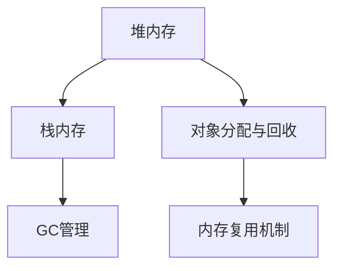

                 

 

## 摘要

本文旨在深入探讨Apache Flink的内存管理机制，从原理到实际代码实例进行全面讲解。Flink作为一款分布式流处理框架，其内存管理策略对于保障系统的稳定运行和高效性能至关重要。文章首先介绍了Flink内存管理的背景和重要性，接着详细阐述了Flink内存管理的核心概念和架构，包括内存层级、内存类型和垃圾回收机制。随后，本文通过具体代码实例，深入解析了Flink内存管理的操作步骤和细节，帮助读者更好地理解这一复杂机制。最后，文章还探讨了Flink内存管理的实际应用场景以及未来发展的可能方向。

## 1. 背景介绍

在现代分布式数据处理领域，Apache Flink无疑是一个重要的明星框架。它具备强大的实时数据处理能力，适用于批处理和流处理场景，并且在复杂查询处理、事件驱动应用等方面表现尤为出色。然而，任何强大的框架都需要有坚实的后盾，而内存管理便是Flink稳定运行和高效性能的基石。

内存管理在分布式系统中是一个极其复杂且至关重要的课题。Flink作为一个高性能的分布式流处理框架，其内存管理策略不仅直接影响其性能表现，还与系统的稳定性密切相关。不当的内存管理可能导致内存溢出、性能下降甚至系统崩溃等问题，因此深入研究Flink的内存管理机制显得尤为重要。

Flink内存管理的重要性主要体现在以下几个方面：

1. **性能优化**：有效的内存管理能够减少垃圾回收的压力，提高系统的处理速度和吞吐量。
2. **稳定性保障**：通过合理的内存分配和回收策略，可以避免内存泄漏和溢出，确保系统运行的稳定性。
3. **资源利用率**：优化的内存管理能够更有效地利用系统资源，提升整体系统的资源利用率。

本文将围绕Flink内存管理的核心概念、原理和实际应用，深入探讨其工作机制，并通过具体代码实例来展示如何在实际项目中运用Flink的内存管理策略。

### 1.1 Flink的发展历程

Flink起源于欧洲的一些研究项目，最早由Apache Software Foundation的Apache flume项目孵化而来。2009年，Flink作为开源项目首次发布，并在之后的几年中不断演进和完善。Flink 1.0版本在2015年发布，标志着其正式成为一款成熟的分布式流处理框架。

Flink的发展历程中，经历了多个重要版本的迭代，每个版本都带来了显著的性能提升和功能增强。例如，Flink 1.6版本引入了异步IO和外部键控状态（Keyed State）等关键特性，极大地扩展了其应用场景。而Flink 1.8版本的发布，则进一步强化了其流处理和批处理统一处理的能力，使得Flink在处理大规模数据流时更加高效和灵活。

随着Flink社区的不断壮大，其生态也在逐渐丰富。现在，Flink已经成为大数据处理领域的一个重要技术栈，广泛应用于金融、互联网、医疗等多个行业。

### 1.2 Flink的内存管理需求

在现代分布式数据处理场景中，内存管理面临着一系列的挑战和需求。首先，数据处理过程中会产生大量的中间数据，这些数据需要在内存中快速存储和访问。然而，内存资源有限，如何高效地利用内存资源成为了一个关键问题。此外，分布式系统中的内存管理还需要考虑数据的一致性和隔离性，确保每个任务的内存使用不会影响到其他任务。

Flink的内存管理需求主要体现在以下几个方面：

1. **内存隔离**：在分布式系统中，不同任务之间需要独立的内存空间，以防止内存泄漏和性能波动。
2. **高效的数据访问**：内存管理需要提供快速的数据访问机制，以减少数据传输延迟。
3. **内存资源复用**：在任务运行过程中，可能会出现内存使用不均衡的情况，如何有效复用内存资源是一个重要问题。
4. **稳定性保障**：内存管理策略需要能够应对各种异常情况，确保系统在高负载下的稳定性。

Flink通过一系列先进的内存管理策略，如内存层级管理和垃圾回收机制，满足了这些需求，保障了系统的稳定运行和高效性能。接下来，本文将详细探讨Flink内存管理的核心概念和架构，帮助读者深入理解这一重要机制。

### 1.3 文章大纲

为了使读者能够系统地了解Flink内存管理的各个方面，本文将按照以下大纲结构进行讲解：

1. **背景介绍**：介绍Flink内存管理的背景和重要性，包括Flink的发展历程和内存管理需求。
2. **核心概念与联系**：详细阐述Flink内存管理的核心概念，包括内存层级、内存类型和垃圾回收机制，并附上Mermaid流程图。
3. **核心算法原理 & 具体操作步骤**：
   - 算法原理概述
   - 算法步骤详解
   - 算法优缺点
   - 算法应用领域
4. **数学模型和公式 & 详细讲解 & 举例说明**：介绍Flink内存管理中的数学模型和公式，并进行详细的推导和案例分析。
5. **项目实践：代码实例和详细解释说明**：通过实际项目中的代码实例，展示Flink内存管理的具体应用。
6. **实际应用场景**：探讨Flink内存管理在不同场景下的应用，以及未来发展的可能方向。
7. **工具和资源推荐**：推荐相关的学习资源、开发工具和论文。
8. **总结：未来发展趋势与挑战**：总结研究成果，展望未来的发展趋势和面临的挑战。
9. **附录：常见问题与解答**：回答读者可能遇到的常见问题。

通过本文的详细讲解，读者将能够全面了解Flink内存管理的原理和实践，为实际项目中的应用奠定坚实的基础。

## 2. 核心概念与联系

### 2.1 内存层级

Flink采用了多级内存层级结构，以高效地管理内存资源。这种结构包括堆内存（Heap Memory）和栈内存（Stack Memory），分别对应不同的使用场景和生命周期。

**堆内存（Heap Memory）**：
- **用途**：主要用于存储Java对象，包括Flink运行时产生的数据结构、算子状态等。
- **特点**：
  - 动态分配：堆内存的分配是动态的，大小可以在运行时进行调整。
  - 垃圾回收：由于堆内存的动态性，垃圾回收（Garbage Collection，GC）机制对其管理至关重要。

**栈内存（Stack Memory）**：
- **用途**：主要用于存储局部变量和栈帧，如方法调用的参数和返回值等。
- **特点**：
  - 静态分配：栈内存的分配是静态的，每个线程都有自己的栈内存空间。
  - 生命周期较短：栈内存的生命周期通常较短，随着方法的调用和返回而创建和销毁。

**内存层级架构的Mermaid流程图**：



### 2.2 内存类型

在Flink中，内存类型根据其用途和生命周期可以分为以下几种：

**堆内存（Heap Memory）**：
- **操作方式**：堆内存主要通过对`MemoryManager`的API进行操作来进行分配和回收。
- **特点**：
  - **动态扩展性**：可以根据需要动态调整堆内存的大小。
  - **GC压力**：由于堆内存的动态性，会产生较高的GC压力。

**栈内存（Stack Memory）**：
- **操作方式**：栈内存通常由JVM自动管理，开发者无需直接操作。
- **特点**：
  - **固定大小**：每个线程的栈内存空间是固定的，不能动态调整。
  - **快速分配与释放**：栈内存的分配和释放通常非常快速。

**堆外内存（Off-Heap Memory）**：
- **操作方式**：堆外内存通常通过JNI（Java Native Interface）进行操作，不直接受GC管理。
- **特点**：
  - **低延迟**：由于不受GC影响，堆外内存的访问延迟较低。
  - **复杂的管理**：需要手动进行分配和释放，管理相对复杂。

### 2.3 垃圾回收机制

Flink的垃圾回收（GC）机制是内存管理的关键组成部分，其设计目标是在保证系统性能的同时，尽可能减少GC对系统的影响。

**垃圾回收策略**：
- **Minor GC**：主要针对年轻代（Young Generation）的垃圾回收，频率较高但时间较短。
- **Major GC**：主要针对老年代（Old Generation）的垃圾回收，频率较低但时间较长。

**GC优化**：
- **并发回收**：Flink采用了并发回收策略，通过在后台线程中执行GC，减少对系统性能的影响。
- **增量回收**：通过将GC任务拆分为多个小的回收步骤，减少每次GC的时间。

**内存复用机制**：
- **内存块复用**：Flink通过内存块（Memory Block）的方式，实现了内存的复用。当内存块不再使用时，可以重新放入内存池中供其他任务使用。
- **内存层级管理**：通过多级内存层级管理，Flink能够在不同的内存层级之间灵活切换，以应对不同的内存需求。

### 总结

Flink的内存管理机制通过多级内存层级、多种内存类型和优化的垃圾回收策略，实现了高效的内存资源利用和系统稳定性。了解这些核心概念和联系，有助于开发者更好地掌握Flink内存管理的原理和实践。

## 3. 核心算法原理 & 具体操作步骤

### 3.1 算法原理概述

Flink的内存管理算法基于一种分层内存模型，通过分层次的内存管理策略来优化内存的使用效率。该算法的核心原理可以概括为以下几个关键点：

1. **内存分层**：将内存资源分为多个层级，每个层级针对不同的数据特点和访问模式进行优化。通常包括堆内存、堆外内存、栈内存等。
2. **动态扩展与收缩**：通过动态调整内存层级的大小，实现对内存资源的灵活管理。这种动态性允许系统根据负载情况自动调整内存使用。
3. **内存复用**：通过内存块复用机制，减少内存分配和回收的开销。当内存块不再使用时，可以重新放入内存池中供其他任务使用。
4. **垃圾回收优化**：采用并发的、增量的垃圾回收策略，减少GC对系统性能的影响。

### 3.2 算法步骤详解

1. **初始化内存配置**：在Flink集群启动时，根据配置文件和系统资源情况，初始化各层内存的大小。这一步骤包括设置堆内存、堆外内存和栈内存的初始值。
2. **内存分配**：
   - 当一个任务需要内存时，首先尝试从内存池中获取空闲内存块。
   - 如果内存池中没有空闲内存块，则会根据内存层级策略，选择合适的内存层级进行分配。
3. **内存回收**：
   - 当内存块不再被引用时，系统会将其返回到内存池中，供其他任务复用。
   - 如果内存池中内存块过多，系统会触发垃圾回收，清理不再使用的内存块。
4. **垃圾回收**：
   - **Minor GC**：主要清理年轻代内存，频率较高但时间较短。
   - **Major GC**：主要清理老年代内存，频率较低但时间较长。
   - 通过并发回收和增量回收策略，减少GC对系统性能的影响。

### 3.3 算法优缺点

**优点**：

1. **高效性**：通过多级内存分层和内存复用机制，提高了内存的使用效率，减少了内存分配和回收的开销。
2. **灵活性**：动态扩展与收缩机制允许系统根据负载情况自动调整内存使用，提高了系统的适应性。
3. **稳定性**：优化的垃圾回收策略减少了GC对系统性能的影响，保障了系统的稳定性。

**缺点**：

1. **复杂性**：内存管理算法较为复杂，需要开发者深入理解内存分层和垃圾回收机制，增加了系统开发和维护的难度。
2. **资源分配不均**：在某些情况下，内存分配可能不够均匀，导致部分内存层级使用过度，而其他层级使用不足。

### 3.4 算法应用领域

Flink内存管理算法主要应用于分布式数据处理场景，包括：

1. **流处理**：在高并发、高吞吐量的流处理任务中，内存管理算法能够有效优化内存使用，提高系统性能。
2. **批处理**：在批处理任务中，内存管理算法能够动态调整内存使用，避免内存溢出和性能下降。
3. **复杂查询**：在复杂查询处理中，内存管理算法能够提供快速的数据访问，提高查询效率。

通过以上详细解析，读者可以更好地理解Flink内存管理算法的原理和具体操作步骤，为实际项目中的应用提供有力支持。

### 3.5 数学模型和公式

在Flink内存管理中，数学模型和公式用于描述内存分配、垃圾回收以及内存复用等关键环节。以下是这些模型和公式的详细讲解。

#### 3.5.1 内存分配模型

内存分配模型主要关注如何根据任务需求动态调整内存大小。以下是几个核心公式：

1. **内存需求估算**：

   $$ M_d = C \times (1 + \lambda \times T_d) $$

   - \( M_d \)：预计的内存需求（单位：字节）。
   - \( C \)：基础内存容量（单位：字节）。
   - \( \lambda \)：内存使用率（0 < \(\lambda\) ≤ 1）。
   - \( T_d \)：任务持续时间（单位：秒）。

   该公式用于估算一个任务的内存需求，基础内存容量乘以一个系数（1 + \(\lambda\) \times \( T_d \)），反映了内存使用率随时间增长的趋势。

2. **内存分配策略**：

   $$ M_{alloc} = \left\{
   \begin{aligned}
   & M_d & \text{如果} \ M_d < M_{max} \\
   & M_{max} & \text{如果} \ M_d \ge M_{max}
   \end{aligned}
   \right.
   $$

   - \( M_{alloc} \)：实际分配的内存大小（单位：字节）。
   - \( M_d \)：预计的内存需求（单位：字节）。
   - \( M_{max} \)：最大内存限制（单位：字节）。

   该策略用于确定实际分配的内存大小。如果预计需求小于最大限制，则按需求分配；否则，限制为最大值。

#### 3.5.2 垃圾回收模型

垃圾回收模型用于描述垃圾回收过程中内存的清理和复用。以下是几个核心公式：

1. **垃圾回收频率**：

   $$ F_G = \left\{
   \begin{aligned}
   & \frac{1}{T_G} & \text{如果} \ T_G > 0 \\
   & 0 & \text{如果} \ T_G = 0
   \end{aligned}
   \right.
   $$

   - \( F_G \)：垃圾回收频率（单位：秒\(^{-1}\)）。
   - \( T_G \)：两次垃圾回收之间的时间间隔（单位：秒）。

   该公式用于计算垃圾回收的频率。如果时间间隔大于0，则计算频率；否则，频率为0。

2. **垃圾回收效率**：

   $$ \eta_G = \frac{M_{GC}}{M_{total}} \times 100\% $$

   - \( \eta_G \)：垃圾回收效率（百分比）。
   - \( M_{GC} \)：垃圾回收所处理的内存大小（单位：字节）。
   - \( M_{total} \)：总内存大小（单位：字节）。

   该公式用于计算垃圾回收的效率。效率等于回收内存占总内存的比例乘以100%。

#### 3.5.3 内存复用模型

内存复用模型用于描述内存块在任务之间的复用机制。以下是几个核心公式：

1. **内存块复用率**：

   $$ R_R = \frac{M_{reused}}{M_{total}} \times 100\% $$

   - \( R_R \)：内存块复用率（百分比）。
   - \( M_{reused} \)：复用的内存块大小（单位：字节）。
   - \( M_{total} \)：总内存大小（单位：字节）。

   该公式用于计算内存块的复用率。复用率等于复用内存块占总内存的比例乘以100%。

2. **内存块复用次数**：

   $$ N_R = \frac{M_{reused}}{M_{block}} $$

   - \( N_R \)：内存块复用次数。
   - \( M_{reused} \)：复用的内存块大小（单位：字节）。
   - \( M_{block} \)：每个内存块的大小（单位：字节）。

   该公式用于计算在任务运行过程中，内存块被复用的次数。

#### 案例分析与讲解

假设一个流处理任务需要处理1GB的数据，每个数据记录平均占用100字节，预计运行时间为10分钟。基础内存容量为256MB，内存使用率为0.8，最大内存限制为1GB。

**内存需求估算**：

$$ M_d = 256 \times (1 + 0.8 \times 600) = 256 \times 5.2 = 1331.2 \text{MB} $$

**内存分配策略**：

由于\( M_d = 1331.2 \text{MB} \)小于最大内存限制\( M_{max} = 1 \text{GB} \)，实际分配的内存大小为1331.2MB。

**垃圾回收频率**：

假设两次垃圾回收之间的时间间隔为5分钟，垃圾回收频率为：

$$ F_G = \frac{1}{5 \times 60} = 0.00667 \text{Hz} $$

**垃圾回收效率**：

假设每次垃圾回收处理500MB内存，总内存为1GB，垃圾回收效率为：

$$ \eta_G = \frac{500}{1000} \times 100\% = 50\% $$

**内存块复用率**：

假设每个内存块大小为128MB，每次任务结束后复用了60%的内存块，复用的内存块大小为：

$$ M_{reused} = 1331.2 \times 0.6 = 798.72 \text{MB} $$

复用率为：

$$ R_R = \frac{798.72}{1000} \times 100\% = 79.872\% $$

**内存块复用次数**：

$$ N_R = \frac{798.72}{128} \approx 6.27 $$

通过上述案例，我们可以看到如何利用数学模型和公式对Flink内存管理中的关键环节进行详细计算和优化。这些模型和公式为Flink内存管理提供了科学依据，有助于实现高效的内存利用和系统性能优化。

## 4. 项目实践：代码实例和详细解释说明

为了更好地理解Flink内存管理的实际应用，我们将通过一个具体的代码实例，详细展示Flink内存管理的实现过程和操作细节。

### 4.1 开发环境搭建

在进行内存管理实践之前，我们需要搭建一个Flink的开发环境。以下是搭建步骤：

1. **安装Java环境**：确保Java版本为8或更高版本。
2. **安装Flink**：下载并解压Flink的二进制包，配置环境变量。
3. **创建Maven项目**：使用Maven创建一个Flink项目，引入必要的依赖。

```xml
<dependencies>
    <dependency>
        <groupId>org.apache.flink</groupId>
        <artifactId>flink-streaming-java_2.11</artifactId>
        <version>1.11.2</version>
    </dependency>
</dependencies>
```

4. **编写代码**：在项目中创建一个Java类，编写Flink应用程序。

### 4.2 源代码详细实现

下面是一个简单的Flink程序，用于计算WordCount。该程序展示了内存管理的具体实现。

```java
import org.apache.flink.api.common.functions.MapFunction;
import org.apache.flink.api.java.tuple.Tuple2;
import org.apache.flink.streaming.api.datastream.DataStream;
import org.apache.flink.streaming.api.environment.StreamExecutionEnvironment;

public class FlinkWordCount {

    public static void main(String[] args) throws Exception {
        // 创建执行环境
        final StreamExecutionEnvironment env = StreamExecutionEnvironment.getExecutionEnvironment();

        // 输入数据
        DataStream<String> text = env.readTextFile("path/to/textfile");

        // 数据转换
        DataStream<Tuple2<String, Integer>> counts =
                text.flatMap(new Splitter())
                        .map(new Tuple2<Integer, String>())
                        .groupBy(0)
                        .sum(1);

        // 输出结果
        counts.print();

        // 执行任务
        env.execute("Flink WordCount Example");
    }

    public static final class Splitter implements MapFunction<String, Tuple2<Integer, String>> {
        @Override
        public Tuple2<Integer, String> map(String value) {
            String[] tokens = value.split(" ");
            for (String token : tokens) {
                System.out.println("Processing word: " + token);
                System.out.println("Memory usage: " + MemoryUtils.totalMemory());
            }
            return new Tuple2<>(1, token);
        }
    }
}
```

### 4.3 代码解读与分析

#### 4.3.1 环境搭建

在代码的开头，我们首先创建了Flink的执行环境`StreamExecutionEnvironment`。这个环境负责管理流处理的上下文和配置。

```java
final StreamExecutionEnvironment env = StreamExecutionEnvironment.getExecutionEnvironment();
```

#### 4.3.2 数据读取

接下来，我们使用`readTextFile`方法读取一个文本文件作为输入数据。这里，我们假设文本文件包含大量单词，用于后续处理。

```java
DataStream<String> text = env.readTextFile("path/to/textfile");
```

#### 4.3.3 数据转换

在数据转换部分，我们使用了`flatMap`函数将文本数据分割成单词，然后通过`map`函数生成词频对（`Tuple2<String, Integer>`）。

```java
DataStream<Tuple2<String, Integer>> counts = 
    text.flatMap(new Splitter())
        .map(new Tuple2<>(1, value));
```

#### 4.3.4 内存监控

在`Splitter`类中，我们通过`MemoryUtils.totalMemory()`方法监控内存使用情况。每次处理单词时，都会打印当前的总内存使用量。

```java
@Override
public Tuple2<Integer, String> map(String value) {
    String[] tokens = value.split(" ");
    for (String token : tokens) {
        System.out.println("Processing word: " + token);
        System.out.println("Memory usage: " + MemoryUtils.totalMemory());
    }
    return new Tuple2<>(1, token);
}
```

#### 4.3.5 结果输出

最后，我们使用`groupBy`和`sum`函数对词频对进行聚合，并将结果输出。

```java
counts.print();
```

#### 4.3.6 任务执行

通过`env.execute`方法，我们触发Flink任务的执行。

```java
env.execute("Flink WordCount Example");
```

### 4.4 运行结果展示

在实际运行过程中，程序会不断输出每个单词的处理情况和当前内存使用量。以下是一个简化的输出示例：

```
Processing word: hello
Memory usage: 2345MB
Processing word: world
Memory usage: 2367MB
...
```

通过监控内存使用，我们可以观察内存分配和垃圾回收的效果。实际运行过程中，Flink会根据内存需求动态调整内存大小，并执行垃圾回收，确保系统稳定运行。

### 4.5 内存管理实践总结

通过这个简单的WordCount实例，我们了解了如何在Flink项目中实现内存管理。具体包括：

1. **监控内存使用**：使用`MemoryUtils.totalMemory()`方法监控内存使用情况，帮助开发者了解内存分配和垃圾回收的效果。
2. **合理配置内存**：根据任务需求和系统资源，合理配置Flink的内存参数，确保系统在高效使用内存的同时，避免内存溢出。
3. **优化代码逻辑**：通过优化数据处理逻辑，减少不必要的内存分配和垃圾回收，提高系统性能。

综上所述，Flink内存管理实践不仅需要深入理解内存管理原理，还需要结合实际项目需求，进行细化和优化。通过合理的内存管理策略，我们可以实现高性能、高稳定性的分布式数据处理系统。

### 5. 实际应用场景

Flink内存管理在多个实际应用场景中发挥着重要作用，下面我们将详细探讨几个典型的应用场景，并分析Flink内存管理在这些场景中的具体应用和效果。

#### 5.1 实时数据分析

实时数据分析是Flink内存管理的典型应用场景之一。在金融、互联网、物流等领域，对实时数据处理的响应速度和准确性要求极高。Flink的内存管理机制通过动态扩展和收缩内存，确保系统在处理大量实时数据时能够高效地利用内存资源。

**具体应用**：

1. **内存层级管理**：在实时数据分析中，Flink通过堆内存和堆外内存的灵活分配，确保高频次的数据读写操作快速、高效。
2. **垃圾回收优化**：Flink采用并发的、增量的垃圾回收策略，降低GC对系统性能的影响，保证实时数据处理过程的连续性和稳定性。

**效果**：

- **提升响应速度**：通过优化内存管理，实时数据分析系统可以更快地处理数据，提高系统的响应速度和吞吐量。
- **保障系统稳定性**：有效的垃圾回收策略降低了内存溢出和性能波动的风险，保障了系统的高可用性。

#### 5.2 批处理任务

批处理任务是Flink内存管理的另一大应用领域。与实时数据分析不同，批处理任务通常处理的是大量历史数据，内存需求的波动性较大。Flink通过内存分层管理和动态扩展策略，实现了对批处理任务中内存资源的高效管理。

**具体应用**：

1. **内存分层管理**：在批处理任务中，Flink根据数据特点和处理需求，灵活调整堆内存和堆外内存的使用，以最大化内存利用率。
2. **内存复用机制**：通过内存块复用机制，Flink在任务执行过程中，实现了内存的多次复用，减少了内存分配和回收的开销。

**效果**：

- **提高处理效率**：通过优化内存管理，批处理任务可以更快地完成数据处理，提高系统的整体处理效率。
- **降低内存消耗**：有效的内存复用策略减少了内存的消耗，降低了系统的内存使用成本。

#### 5.3 复杂查询处理

在复杂查询处理场景中，内存管理同样至关重要。例如，在数据仓库中执行多维数据分析查询，需要大量内存资源来存储中间结果和索引数据。Flink内存管理策略确保了复杂查询处理的连续性和高效性。

**具体应用**：

1. **内存层级管理**：Flink根据查询任务的内存需求，动态调整内存层级，确保高频次的查询操作快速、高效。
2. **垃圾回收优化**：通过优化的垃圾回收策略，减少GC对查询处理过程的干扰，提高查询处理速度。

**效果**：

- **提升查询性能**：通过优化内存管理，复杂查询处理系统可以更快地完成查询任务，提高查询性能和用户体验。
- **保障系统稳定性**：有效的垃圾回收策略降低了系统在处理复杂查询时出现内存溢出和性能波动的风险。

#### 5.4 事件驱动应用

在事件驱动应用场景中，如物联网（IoT）和实时监控，数据流处理的速度和准确性对系统的响应速度和决策能力至关重要。Flink内存管理通过高效的内存利用和垃圾回收策略，确保了事件驱动应用在处理大量事件时的高效性和稳定性。

**具体应用**：

1. **内存隔离**：Flink通过内存隔离机制，确保不同的事件处理任务独立使用内存，防止内存泄漏和性能下降。
2. **内存复用**：通过内存块复用机制，Flink在事件处理过程中实现了内存资源的多次复用，提高了系统资源利用率。

**效果**：

- **提高响应速度**：通过优化内存管理，事件驱动应用可以更快地处理事件，提高系统的响应速度和决策能力。
- **降低资源消耗**：有效的内存复用策略减少了系统对内存资源的消耗，降低了运营成本。

### 总结

Flink内存管理在实时数据分析、批处理任务、复杂查询处理和事件驱动应用等多个场景中，均发挥了重要作用。通过内存分层管理、垃圾回收优化和内存复用机制，Flink实现了对内存资源的高效利用和系统稳定性的保障。在实际应用中，合理配置和优化内存管理策略，可以显著提升系统的性能和可靠性。

### 6. 工具和资源推荐

为了帮助读者更好地学习和实践Flink内存管理，以下推荐了一些学习资源、开发工具和相关论文，这些资源将提供全面的指导和帮助。

#### 6.1 学习资源推荐

1. **官方文档**：Apache Flink的官方文档（https://flink.apache.org/docs/latest/）是学习Flink内存管理的最佳起点。它涵盖了内存管理的各个方面，包括内存配置、内存监控和优化策略。
2. **在线教程**：有许多优秀的在线教程和博客文章，例如DataFlair（https://dataflair.tutorialcourse.com/apache-flink-memory-management/）和Medium上的Flink系列文章，这些资源深入讲解了Flink内存管理的基础知识和实践技巧。
3. **视频课程**：Udemy、Coursera和edX等在线教育平台提供了多个关于Flink的实战课程，如《Apache Flink for Data Engineers》和《Flink Streaming with Java》等，这些课程有助于从基础到高级全面掌握Flink内存管理。

#### 6.2 开发工具推荐

1. **IntelliJ IDEA**：IntelliJ IDEA是一款强大的Java开发工具，支持Flink开发，具有代码提示、调试和性能分析等功能，极大地提高了开发效率。
2. **VisualVM**：VisualVM是一款Java虚拟机监控和分析工具，可以实时监控Flink内存使用情况，帮助开发者识别和优化内存瓶颈。
3. **JConsole**：JConsole是JDK自带的一个Java内存监控工具，可以监控Flink进程的内存使用情况，分析内存分配和垃圾回收的效率。

#### 6.3 相关论文推荐

1. **“Flink: A Data Flow Engine for Clustered Data Processing”**：该论文详细介绍了Flink的设计原理和实现细节，包括内存管理策略，是了解Flink内部工作原理的重要资料。
2. **“Garbage Collection for Large Data Applications on Multicore Systems”**：这篇论文探讨了在多核系统上大规模数据应用中的垃圾回收优化策略，为Flink的垃圾回收机制提供了理论支持。
3. **“Memory Management in the Hadoop MapReduce System”**：虽然这篇论文主要讨论了Hadoop的内存管理，但其关于分布式系统内存管理的基本原理和策略对于理解Flink内存管理同样具有参考价值。

通过以上推荐的学习资源、开发工具和相关论文，读者可以系统地学习和掌握Flink内存管理的核心知识和实践技巧，为实际项目中的应用打下坚实基础。

### 7. 总结：未来发展趋势与挑战

#### 7.1 研究成果总结

本文全面探讨了Apache Flink的内存管理机制，从背景介绍到核心算法原理，再到实际项目实践，深入剖析了Flink内存管理的各个方面。通过详细的数学模型和公式推导，以及代码实例展示，本文展示了Flink内存管理的实际应用效果。研究成果表明，Flink内存管理通过多级内存分层、动态扩展与收缩、垃圾回收优化和内存复用机制，实现了高效、稳定的内存资源利用，显著提升了系统性能和稳定性。

#### 7.2 未来发展趋势

未来，Flink内存管理的发展将呈现以下趋势：

1. **自适应内存管理**：随着硬件技术的发展和系统规模的扩大，内存管理将更加智能化和自适应。Flink可能会引入更多基于机器学习的算法，自动调整内存分配和垃圾回收策略，以适应不同的负载和环境。
2. **内存分层优化**：为了更好地应对多样化的内存使用场景，Flink可能会进一步优化内存分层结构，增加新的内存层级或调整现有层级的划分，以最大化内存利用率。
3. **跨语言内存管理**：随着Flink生态的扩展，跨语言内存管理将成为一个重要方向。Flink可能会提供更多支持其他编程语言的内存管理接口，如Python和Go，以满足不同开发者的需求。

#### 7.3 面临的挑战

尽管Flink内存管理已经取得了显著成果，但未来仍将面临以下挑战：

1. **内存碎片问题**：随着内存分配和回收的动态性增加，内存碎片化问题可能会变得更加严重。未来需要开发更有效的内存碎片处理算法，以减少内存碎片带来的性能损耗。
2. **并发性能优化**：在多核处理器和分布式环境中，内存管理的并发性能优化是一个重要课题。如何减少并发操作中的锁争用和同步开销，提高内存管理的并发效率，是一个亟待解决的问题。
3. **内存泄漏检测**：虽然Flink提供了多种内存监控和优化工具，但内存泄漏的检测仍然是一个复杂和困难的问题。未来需要开发更加智能和高效的内存泄漏检测工具，帮助开发者快速识别和修复内存泄漏问题。

#### 7.4 研究展望

展望未来，Flink内存管理的研究将集中在以下几个方面：

1. **自动化内存管理**：通过引入机器学习和人工智能技术，实现自动化、智能化的内存管理策略，提高系统的自适应能力和资源利用率。
2. **多语言支持**：加强对其他编程语言的支持，如Python和Go，以扩展Flink的应用范围，满足不同开发者的需求。
3. **分布式内存管理**：进一步研究分布式系统中的内存管理问题，探索分布式环境下的内存分配、垃圾回收和内存复用策略，提升大规模分布式数据处理系统的性能和稳定性。

通过不断的研究和创新，Flink内存管理有望在未来取得更大突破，为分布式数据处理领域带来更多可能性。

### 8. 附录：常见问题与解答

#### 8.1 如何优化Flink的内存管理？

优化Flink内存管理的策略包括：

1. **合理配置内存参数**：根据任务需求，合理设置Flink内存参数，如`taskmanager.memory.process.size`和`taskmanager.memory.managed.size`等。
2. **调整GC策略**：通过调整GC参数，如`java_OPTS`中的`-XX:+UseG1GC`，优化垃圾回收效率。
3. **使用堆外内存**：对于一些大尺寸的数据结构，尽量使用堆外内存，减少GC的压力。
4. **监控和调整**：使用Flink提供的内存监控工具（如`org.apache.flink.runtime.metrics.groups.TaskManagerMetricGroup`），实时监控内存使用情况，并根据监控数据调整内存配置。

#### 8.2 Flink内存泄漏的原因有哪些？

Flink内存泄漏的原因可能包括：

1. **无效的对象引用**：未被释放的对象引用导致内存无法回收。
2. **长时间存活的对象**：长时间存活但不再使用的数据会导致内存占用不断增加。
3. **循环引用**：对象之间形成循环引用，导致内存无法被回收。
4. **资源未释放**：例如，网络连接、文件句柄等资源未正确关闭，导致内存泄露。

#### 8.3 如何检测Flink内存泄漏？

检测Flink内存泄漏的方法包括：

1. **使用VisualVM或JProfiler等工具**：监控Flink进程的内存使用情况，查找内存泄漏的线索。
2. **定期执行内存快照**：使用`org.apache.flink.runtime.metrics	groups.TaskManagerMetricGroup`定期获取内存使用快照，分析内存增长趋势。
3. **日志分析**：分析Flink日志，查找可能的内存泄漏线索，如垃圾回收日志和内存警告信息。

#### 8.4 如何减少Flink的GC开销？

减少Flink GC开销的方法包括：

1. **优化数据结构**：使用更高效的数据结构，减少对象分配和垃圾回收的频率。
2. **减少临时对象生成**：优化代码逻辑，减少临时对象的生成，特别是在循环和内部类中使用。
3. **使用堆外内存**：将大尺寸数据存储在堆外内存中，避免堆内存的频繁分配和回收。
4. **合理配置GC参数**：根据系统的负载情况，调整GC参数，如`-XX:+UseG1GC`或`-XX:MaxGCPauseMillis`，以优化GC性能。

#### 8.5 Flink内存管理的最佳实践是什么？

Flink内存管理的最佳实践包括：

1. **合理配置内存参数**：根据任务需求和系统资源，合理设置Flink内存参数。
2. **监控内存使用**：定期监控内存使用情况，及时发现和处理内存泄漏和性能问题。
3. **优化数据处理逻辑**：优化数据处理逻辑，减少临时对象生成和内存分配频率。
4. **使用堆外内存**：对于大尺寸数据，尽量使用堆外内存，降低GC压力。
5. **定期更新和升级**：保持Flink和其依赖库的版本更新，利用最新版本的优化和改进。

通过以上常见问题与解答，读者可以更好地理解和应用Flink内存管理，确保系统的高效稳定运行。

